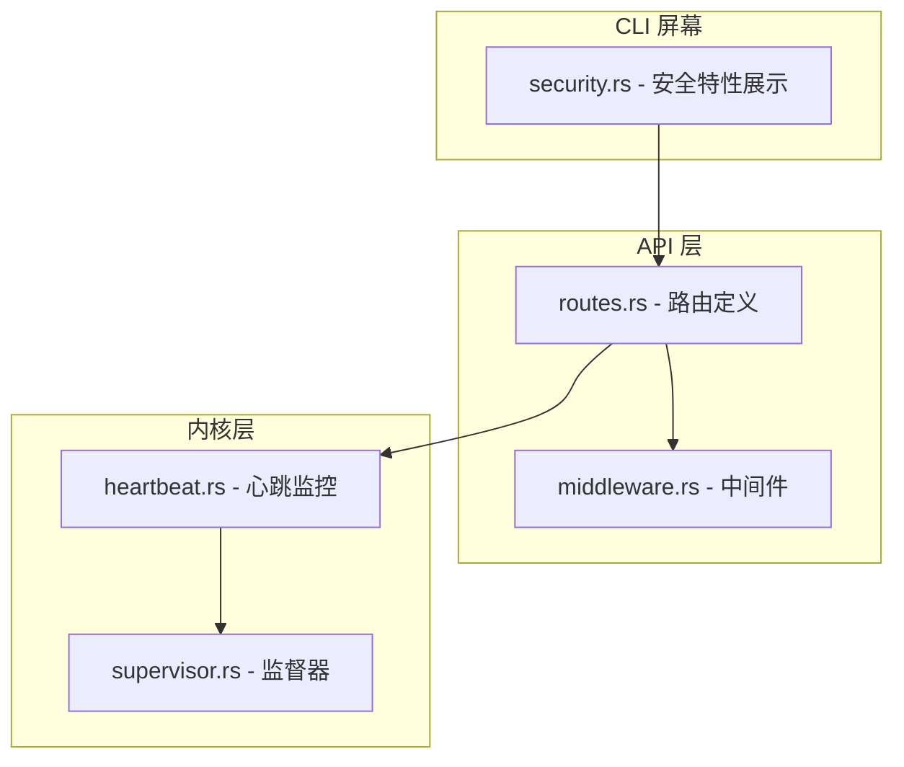
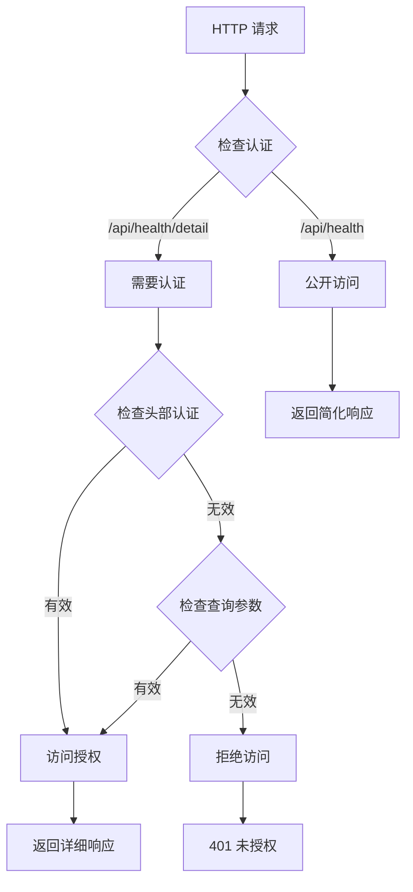
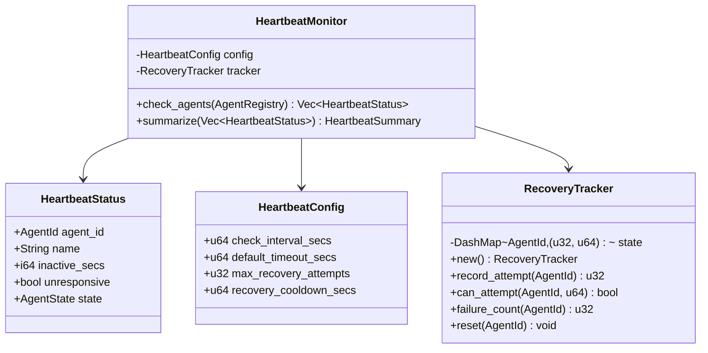
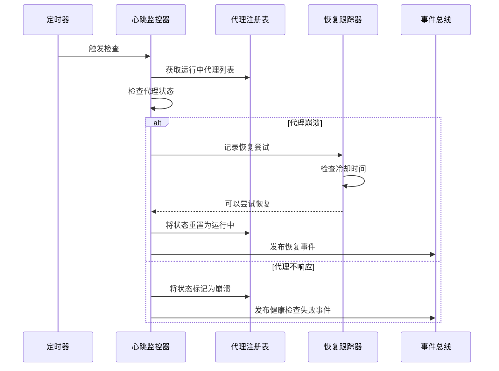
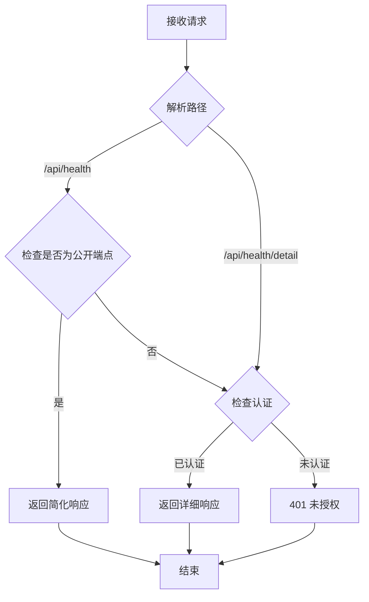
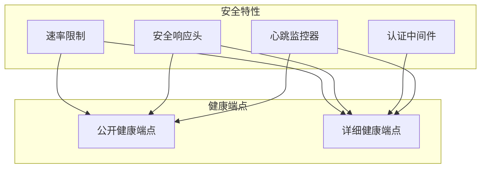
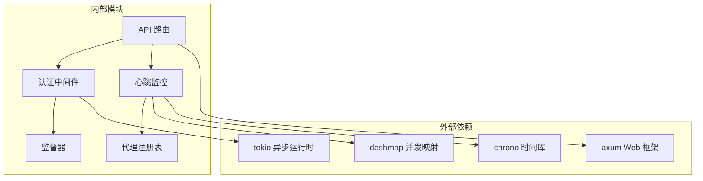

# 健康端点脱敏

<cite>
**本文档引用的文件**
- [heartbeat.rs](file://crates/openfang-kernel/src/heartbeat.rs)
- [routes.rs](file://crates/openfang-api/src/routes.rs)
- [middleware.rs](file://crates/openfang-api/src/middleware.rs)
- [supervisor.rs](file://crates/openfang-kernel/src/supervisor.rs)
- [security.rs](file://crates/openfang-cli/src/tui/screens/security.rs)
- [SECURITY.md](file://SECURITY.md)
- [openfang.toml.example](file://openfang.toml.example)
</cite>

## 目录
1. [简介](#简介)
2. [项目结构](#项目结构)
3. [核心组件](#核心组件)
4. [架构概览](#架构概览)
5. [详细组件分析](#详细组件分析)
6. [依赖关系分析](#依赖关系分析)
7. [性能考虑](#性能考虑)
8. [故障排除指南](#故障排除指南)
9. [结论](#结论)

## 简介

本文档详细说明了 OpenFang 项目中健康端点脱敏机制的实现。该机制通过最小化公开信息暴露、强制访问控制和安全认证来保护系统健康状态信息。

健康端点脱敏主要包含两个方面：
- **随机路径生成**：通过动态生成的健康检查路径避免固定端点暴露
- **响应内容伪装**：仅返回必要的最小化信息，隐藏敏感内部状态

## 项目结构

OpenFang 项目的健康端点脱敏涉及以下关键模块：



**图表来源**
- [routes.rs:3286-3314](file://crates/openfang-api/src/routes.rs#L3286-L3314)
- [middleware.rs:90-130](file://crates/openfang-api/src/middleware.rs#L90-L130)
- [heartbeat.rs:1-502](file://crates/openfang-kernel/src/heartbeat.rs#L1-L502)

**章节来源**
- [routes.rs:3286-3314](file://crates/openfang-api/src/routes.rs#L3286-L3314)
- [middleware.rs:90-130](file://crates/openfang-api/src/middleware.rs#L90-L130)

## 核心组件

### 健康端点实现

系统提供两个级别的健康检查端点：

#### 公开健康检查端点
- **路径**：`/api/health`
- **认证要求**：无需认证
- **响应内容**：仅包含状态和版本信息
- **用途**：容器编排和负载均衡器探活

#### 详细健康检查端点  
- **路径**：`/api/health/detail`
- **认证要求**：需要 API 密钥认证
- **响应内容**：包含完整的系统健康状态信息
- **用途**：管理界面和监控系统

### 认证和授权机制

健康端点采用分层认证策略：



**图表来源**
- [middleware.rs:136-215](file://crates/openfang-api/src/middleware.rs#L136-L215)

**章节来源**
- [routes.rs:3286-3338](file://crates/openfang-api/src/routes.rs#L3286-L3338)
- [middleware.rs:136-215](file://crates/openfang-api/src/middleware.rs#L136-L215)

## 架构概览

健康端点脱敏的整体架构设计如下：

```mermaid
graph LR
subgraph "外部系统"
LB[负载均衡器]
Monitor[监控系统]
Container[容器编排]
end
subgraph "API 网关"
HealthPublic[/api/health<br/>公开端点]
HealthDetail[/api/health/detail<br/>详细端点]
AuthMiddleware[认证中间件]
end
subgraph "应用内核"
HeartbeatMonitor[心跳监控器]
RecoverySystem[自动恢复系统]
SupervisorHealth[监督器健康状态]
end
subgraph "数据存储"
MemoryStore[内存存储]
ConfigStore[配置存储]
end
LB --> HealthPublic
Monitor --> HealthPublic
Container --> HealthPublic
LB --> HealthDetail
Monitor --> HealthDetail
HealthPublic --> AuthMiddleware
HealthDetail --> AuthMiddleware
AuthMiddleware --> HeartbeatMonitor
AuthMiddleware --> SupervisorHealth
HeartbeatMonitor --> RecoverySystem
HeartbeatMonitor --> MemoryStore
SupervisorHealth --> ConfigStore
```

**图表来源**
- [routes.rs:3286-3338](file://crates/openfang-api/src/routes.rs#L3286-L3338)
- [heartbeat.rs:135-217](file://crates/openfang-kernel/src/heartbeat.rs#L135-L217)
- [supervisor.rs:107-114](file://crates/openfang-kernel/src/supervisor.rs#L107-L114)

## 详细组件分析

### 心跳监控器实现

心跳监控器负责检测和恢复不响应的代理进程：

#### 核心数据结构



**图表来源**
- [heartbeat.rs:31-127](file://crates/openfang-kernel/src/heartbeat.rs#L31-L127)

#### 自动恢复机制



**图表来源**
- [heartbeat.rs:4370-4488](file://crates/openfang-kernel/src/heartbeat.rs#L4370-L4488)

### 健康端点安全策略

#### 访问控制流程



**图表来源**
- [middleware.rs:90-130](file://crates/openfang-api/src/middleware.rs#L90-L130)

#### 响应内容脱敏

健康端点采用分级信息暴露策略：

**公开端点响应示例**：
```json
{
  "status": "ok",
  "version": "0.3.1"
}
```

**详细端点响应示例**：
```json
{
  "status": "ok", 
  "version": "0.3.1",
  "uptime_seconds": 3600,
  "panic_count": 0,
  "restart_count": 2,
  "agent_count": 15,
  "database": "connected",
  "config_warnings": []
}
```

**章节来源**
- [routes.rs:3286-3338](file://crates/openfang-api/src/routes.rs#L3286-L3338)
- [middleware.rs:136-215](file://crates/openfang-api/src/middleware.rs#L136-L215)

### 配置和监控策略

#### 心跳监控配置

| 配置项 | 默认值 | 描述 |
|--------|--------|------|
| check_interval_secs | 30秒 | 心跳检查间隔 |
| default_timeout_secs | 180秒 | 默认无响应超时时间 |
| max_recovery_attempts | 3次 | 最大自动恢复尝试次数 |
| recovery_cooldown_secs | 60秒 | 恢复尝试冷却时间 |

#### 安全特性集成



**图表来源**
- [security.rs:116-135](file://crates/openfang-cli/src/tui/screens/security.rs#L116-L135)

**章节来源**
- [heartbeat.rs:46-70](file://crates/openfang-kernel/src/heartbeat.rs#L46-L70)
- [security.rs:116-135](file://crates/openfang-cli/src/tui/screens/security.rs#L116-L135)

## 依赖关系分析

健康端点脱敏机制的关键依赖关系：



**图表来源**
- [routes.rs:3286-3338](file://crates/openfang-api/src/routes.rs#L3286-L3338)
- [heartbeat.rs:12-16](file://crates/openfang-kernel/src/heartbeat.rs#L12-L16)

**章节来源**
- [routes.rs:3286-3338](file://crates/openfang-api/src/routes.rs#L3286-L3338)
- [heartbeat.rs:12-16](file://crates/openfang-kernel/src/heartbeat.rs#L12-L16)

## 性能考虑

### 心跳监控性能优化

1. **异步处理**：使用 tokio 运行时进行非阻塞检查
2. **并发安全**：使用 DashMap 实现线程安全的状态跟踪
3. **内存效率**：最小化响应数据大小，避免不必要的序列化
4. **数据库检查**：在阻塞线程中执行数据库操作，防止阻塞异步运行时

### 监控策略建议

1. **多层监控**：结合公开和详细健康端点进行综合监控
2. **告警阈值**：根据业务需求设置合适的超时和恢复阈值
3. **日志记录**：合理配置日志级别，平衡信息详细程度和性能影响
4. **资源监控**：监控心跳监控器本身的资源使用情况

## 故障排除指南

### 常见问题诊断

#### 健康端点无法访问

**症状**：客户端收到 401 未授权错误

**排查步骤**：
1. 检查 API 密钥配置
2. 验证认证头部格式
3. 确认端点路径正确性

#### 健康状态异常

**症状**：健康检查返回 "degraded" 状态

**排查步骤**：
1. 检查数据库连接状态
2. 验证内存存储可用性
3. 查看系统日志获取详细错误信息

#### 自动恢复失效

**症状**：崩溃的代理无法自动恢复

**排查步骤**：
1. 检查恢复尝试次数限制
2. 验证冷却时间配置
3. 确认代理状态转换逻辑

**章节来源**
- [routes.rs:3286-3338](file://crates/openfang-api/src/routes.rs#L3286-L3338)
- [heartbeat.rs:4370-4488](file://crates/openfang-kernel/src/heartbeat.rs#L4370-L4488)

## 结论

OpenFang 的健康端点脱敏机制通过多层次的安全策略实现了有效的信息保护：

1. **分层访问控制**：公开端点和详细端点分离，确保敏感信息只对授权用户可见
2. **最小化信息暴露**：响应内容经过精心设计，仅包含必要的健康状态信息
3. **自动化监控**：内置心跳监控和自动恢复机制，提高系统可靠性
4. **安全集成**：与整体安全架构无缝集成，形成完整的安全防护体系

该实现为生产环境提供了可靠的健康检查解决方案，既满足了监控需求，又有效保护了系统的敏感信息。