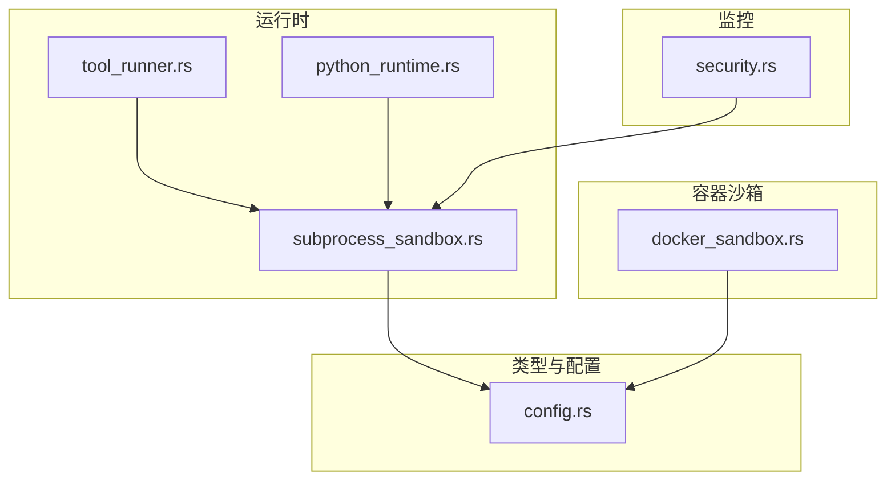
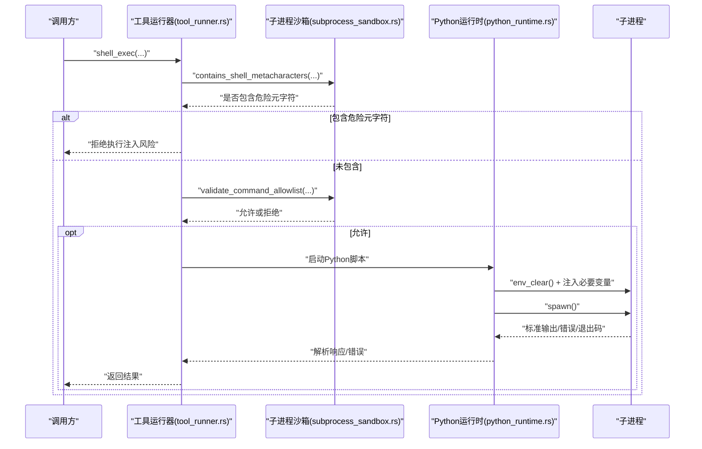
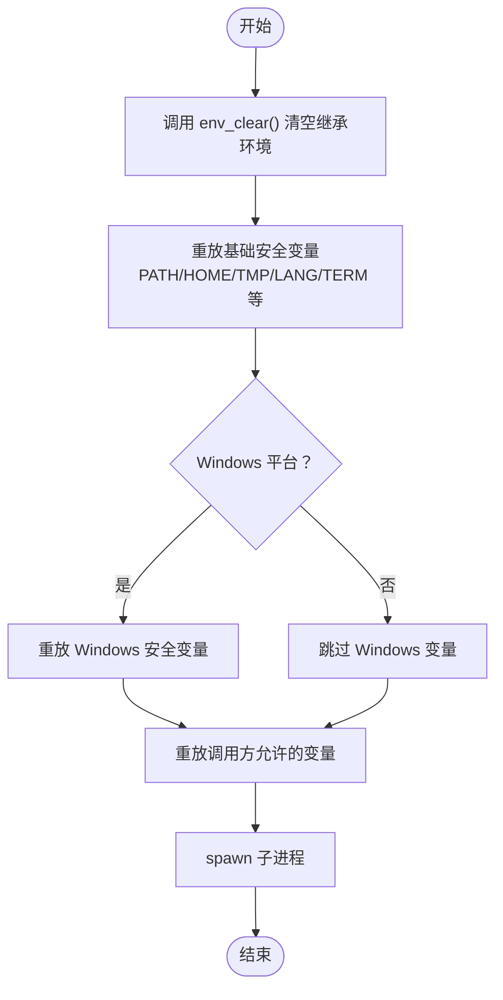
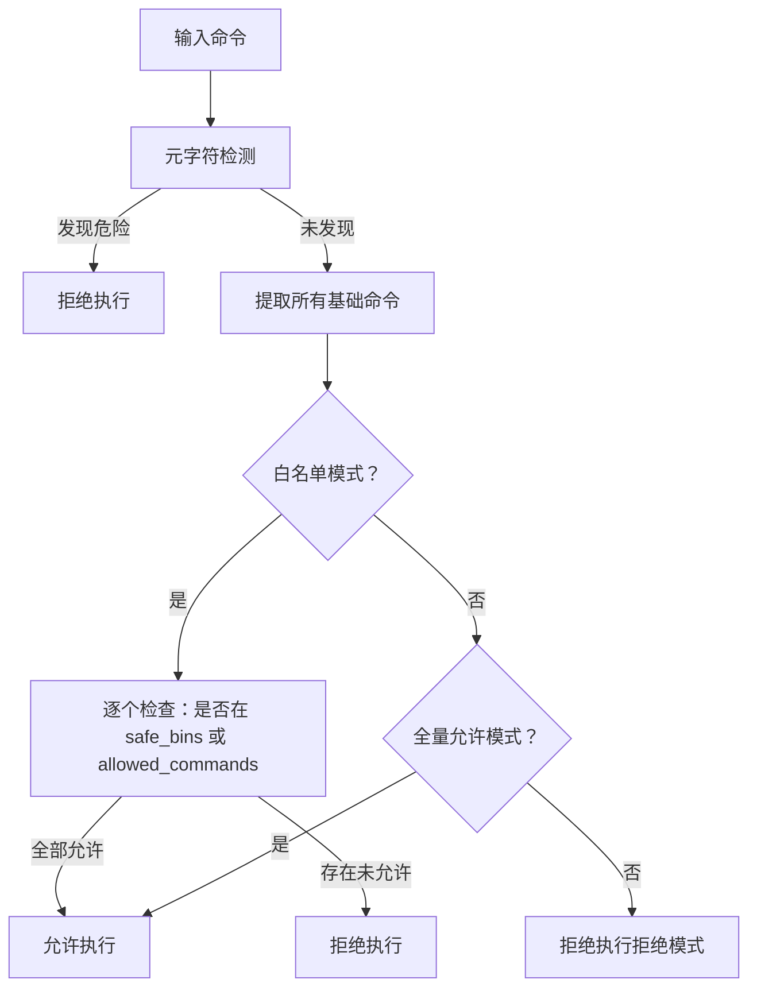
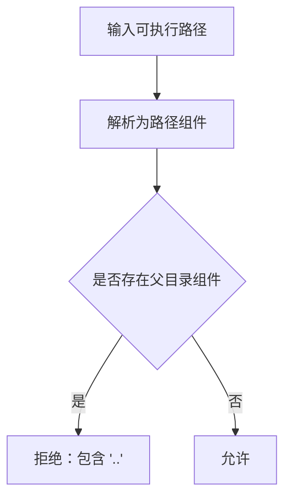
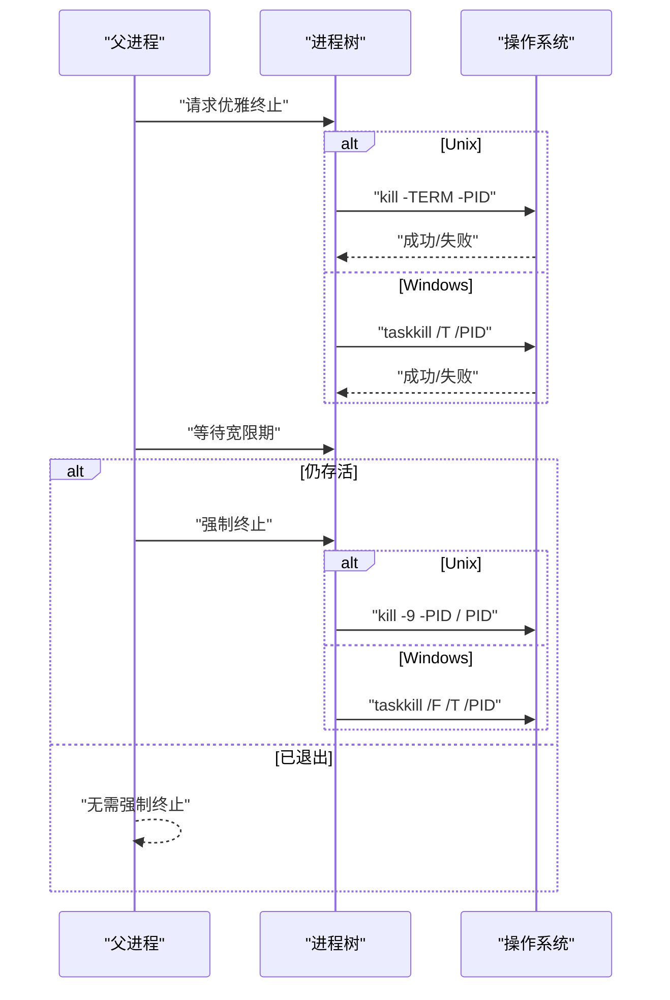
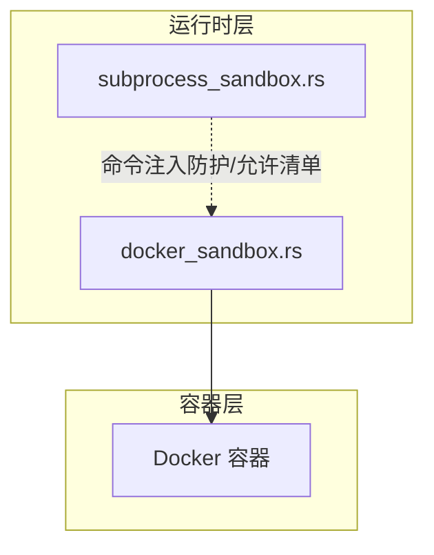
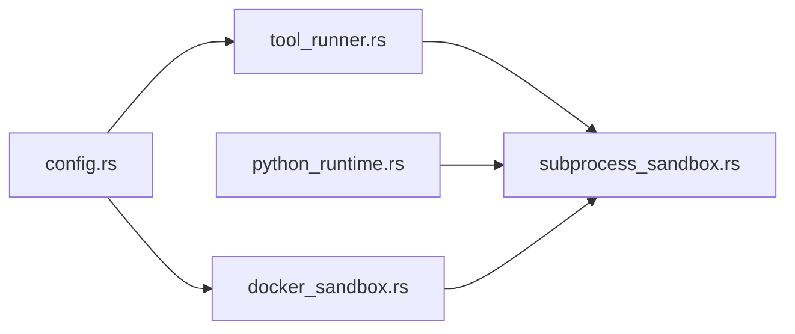

# 子进程隔离

<cite>
**本文引用的文件**
- [subprocess_sandbox.rs](file://crates/openfang-runtime/src/subprocess_sandbox.rs)
- [python_runtime.rs](file://crates/openfang-runtime/src/python_runtime.rs)
- [tool_runner.rs](file://crates/openfang-runtime/src/tool_runner.rs)
- [docker_sandbox.rs](file://crates/openfang-runtime/src/docker_sandbox.rs)
- [config.rs](file://crates/openfang-types/src/config.rs)
- [security.rs](file://crates/openfang-cli/src/tui/screens/security.rs)
</cite>

## 目录
1. [引言](#引言)
2. [项目结构](#项目结构)
3. [核心组件](#核心组件)
4. [架构总览](#架构总览)
5. [详细组件分析](#详细组件分析)
6. [依赖关系分析](#依赖关系分析)
7. [性能考量](#性能考量)
8. [故障排查指南](#故障排查指南)
9. [结论](#结论)
10. [附录](#附录)

## 引言
本文件面向“子进程隔离”的安全主题，聚焦于 subprocess_sandbox.rs 提供的 Python/Node 等技能运行时的安全执行环境与隔离策略。重点覆盖以下方面：
- 使用 cmd.env_clear() 清理继承环境，仅重放经白名单允许的环境变量，防止敏感信息泄露
- 可选地注入特定环境变量（如代理、虚拟环境等），并进行严格校验
- 命令注入防护：元字符检测、可执行路径校验、命令允许清单策略
- 进程树级管理：优雅终止与强制终止、超时与无输出空闲超时控制
- 与 Docker 容器沙箱的协同与对比
- 配置与监控方法

## 项目结构
围绕子进程隔离的关键模块与职责如下：
- subprocess_sandbox.rs：提供环境沙箱、可执行路径校验、命令注入检测、命令允许清单校验、进程树管理与等待/超时控制
- python_runtime.rs：在 Python 脚本运行中应用 env_clear() 并按需注入必要变量，确保最小暴露面
- tool_runner.rs：对外部 shell 工具调用进行元字符检测、执行策略校验与污点检查
- docker_sandbox.rs：基于 Docker 的系统级隔离，提供资源限制、能力降权、网络隔离与挂载安全校验
- config.rs：定义执行策略 ExecPolicy、Docker 沙箱配置等安全参数
- security.rs：CLI 中展示与安全特性相关的监控项（含 env_clear 的说明）

**图表来源**
- [subprocess_sandbox.rs](file://crates/openfang-runtime/src/subprocess_sandbox.rs)
- [python_runtime.rs](file://crates/openfang-runtime/src/python_runtime.rs)
- [tool_runner.rs](file://crates/openfang-runtime/src/tool_runner.rs)
- [docker_sandbox.rs](file://crates/openfang-runtime/src/docker_sandbox.rs)
- [config.rs](file://crates/openfang-types/src/config.rs)
- [security.rs](file://crates/openfang-cli/src/tui/screens/security.rs)

**章节来源**
- [subprocess_sandbox.rs:1-64](file://crates/openfang-runtime/src/subprocess_sandbox.rs#L1-L64)
- [python_runtime.rs:148-201](file://crates/openfang-runtime/src/python_runtime.rs#L148-L201)
- [tool_runner.rs:213-266](file://crates/openfang-runtime/src/tool_runner.rs#L213-L266)
- [docker_sandbox.rs:93-173](file://crates/openfang-runtime/src/docker_sandbox.rs#L93-L173)
- [config.rs:800-843](file://crates/openfang-types/src/config.rs#L800-L843)
- [security.rs:57](file://crates/openfang-cli/src/tui/screens/security.rs#L57)

## 核心组件
- 环境沙箱
  - 通过 cmd.env_clear() 清空子进程继承自父进程的全部环境变量，再按平台与调用方需求重放安全变量
  - 安全变量白名单：基础跨平台变量与 Windows 特定变量；调用方可追加额外允许变量
- 可执行路径校验
  - 拒绝包含目录穿越组件（..）的路径，避免逃逸工作目录
- 元字符注入检测
  - 拦截反引号命令替换、$() 扩展、${} 变量扩展、分号/管道/重定向、大括号展开、换行符、空字节、后台执行与逻辑连接符等
- 命令允许清单策略
  - 支持拒绝模式、全量允许模式、白名单模式；白名单模式下先做元字符拦截，再对基础命令名进行允许清单匹配
- 进程树管理与超时控制
  - 跨平台优雅终止（SIGTERM/taskkill /T），等待宽限期后强制终止（SIGKILL/taskkill /F）
  - 绝对超时与“无输出空闲超时”双重保护，避免僵尸进程与资源耗尽

**章节来源**
- [subprocess_sandbox.rs:40-64](file://crates/openfang-runtime/src/subprocess_sandbox.rs#L40-L64)
- [subprocess_sandbox.rs:71-82](file://crates/openfang-runtime/src/subprocess_sandbox.rs#L71-L82)
- [subprocess_sandbox.rs:96-149](file://crates/openfang-runtime/src/subprocess_sandbox.rs#L96-L149)
- [subprocess_sandbox.rs:203-241](file://crates/openfang-runtime/src/subprocess_sandbox.rs#L203-L241)
- [subprocess_sandbox.rs:261-426](file://crates/openfang-runtime/src/subprocess_sandbox.rs#L261-L426)

## 架构总览
下图展示了从工具调用到子进程执行的端到端流程，强调安全前置检查与隔离措施：

**图表来源**
- [tool_runner.rs:213-266](file://crates/openfang-runtime/src/tool_runner.rs#L213-L266)
- [subprocess_sandbox.rs:96-149](file://crates/openfang-runtime/src/subprocess_sandbox.rs#L96-L149)
- [subprocess_sandbox.rs:203-241](file://crates/openfang-runtime/src/subprocess_sandbox.rs#L203-L241)
- [python_runtime.rs:148-201](file://crates/openfang-runtime/src/python_runtime.rs#L148-L201)

## 详细组件分析

### 环境沙箱与秘密泄露防护
- 设计原则
  - 仅保留必要的最小环境变量集合，避免无意中将密钥、令牌等敏感信息传递给子进程
  - 对 Windows 平台补充安全变量集，同时允许调用方按需追加变量
- 关键实现
  - 清理继承环境：cmd.env_clear()
  - 重放安全变量：基础跨平台变量 + 平台特定变量（Windows）
  - 追加允许变量：由调用方传入的白名单变量列表
- 与 Python 运行时的结合
  - Python 运行时同样采用 env_clear()，仅注入 OPENFANG_*、PATH、HOME、PYTHONPATH、虚拟环境等必要变量，避免泄漏宿主密钥

**图表来源**
- [subprocess_sandbox.rs:40-64](file://crates/openfang-runtime/src/subprocess_sandbox.rs#L40-L64)
- [python_runtime.rs:159-200](file://crates/openfang-runtime/src/python_runtime.rs#L159-L200)

**章节来源**
- [subprocess_sandbox.rs:40-64](file://crates/openfang-runtime/src/subprocess_sandbox.rs#L40-L64)
- [python_runtime.rs:159-200](file://crates/openfang-runtime/src/python_runtime.rs#L159-L200)

### 命令注入防护与允许清单策略
- 元字符拦截
  - 在进入允许清单前，先对命令字符串进行元字符检测，阻断反引号、$()、${}、;、|、> <、{ }、换行、空字节、&、&& 等
- 允许清单
  - 拒绝模式：完全禁止
  - 全量允许模式：不作限制（开发用途）
  - 白名单模式：仅允许 safe_bins 与 allowed_commands 列表中的基础命令名
- 基础命令提取
  - 从复合命令中提取每个基础命令（处理管道、分号、逻辑连接符等），并对每个命令逐一校验

**图表来源**
- [subprocess_sandbox.rs:96-149](file://crates/openfang-runtime/src/subprocess_sandbox.rs#L96-L149)
- [subprocess_sandbox.rs:203-241](file://crates/openfang-runtime/src/subprocess_sandbox.rs#L203-L241)
- [subprocess_sandbox.rs:151-198](file://crates/openfang-runtime/src/subprocess_sandbox.rs#L151-L198)

**章节来源**
- [subprocess_sandbox.rs:96-149](file://crates/openfang-runtime/src/subprocess_sandbox.rs#L96-L149)
- [subprocess_sandbox.rs:203-241](file://crates/openfang-runtime/src/subprocess_sandbox.rs#L203-L241)
- [subprocess_sandbox.rs:151-198](file://crates/openfang-runtime/src/subprocess_sandbox.rs#L151-L198)

### 可执行路径校验
- 目标：防止通过包含 .. 的路径逃逸工作目录
- 方法：对路径进行组件遍历，若出现父目录组件则直接拒绝

**图表来源**
- [subprocess_sandbox.rs:71-82](file://crates/openfang-runtime/src/subprocess_sandbox.rs#L71-L82)

**章节来源**
- [subprocess_sandbox.rs:71-82](file://crates/openfang-runtime/src/subprocess_sandbox.rs#L71-L82)

### 进程树管理与超时控制
- 跨平台优雅终止
  - Unix：优先向进程组发送 TERM，失败则向进程发送 TERM；等待宽限期后发送 KILL
  - Windows：taskkill /T（树杀）+ /F（强制）
- 双重超时
  - 绝对超时：超过设定时间即终止
  - 无输出空闲超时：在指定时间内未产生任何输出则终止，防止静默卡死
- 输出截断与安全处理
  - 对超长输出进行字节边界安全截断，避免 UTF-8 破坏

**图表来源**
- [subprocess_sandbox.rs:261-392](file://crates/openfang-runtime/src/subprocess_sandbox.rs#L261-L392)

**章节来源**
- [subprocess_sandbox.rs:261-392](file://crates/openfang-runtime/src/subprocess_sandbox.rs#L261-L392)
- [subprocess_sandbox.rs:435-579](file://crates/openfang-runtime/src/subprocess_sandbox.rs#L435-L579)

### 与 Docker 容器沙箱的协同
- Docker 沙箱提供更强的系统级隔离：资源限制、能力降权、只读根文件系统、网络隔离、挂载安全校验
- subprocess_sandbox.rs 的元字符与允许清单策略同样适用于容器内命令执行，作为第一道防线
- 两者可叠加使用：在容器内执行命令时，仍需进行元字符与允许清单校验

**图表来源**
- [docker_sandbox.rs:93-173](file://crates/openfang-runtime/src/docker_sandbox.rs#L93-L173)
- [docker_sandbox.rs:175-224](file://crates/openfang-runtime/src/docker_sandbox.rs#L175-L224)
- [subprocess_sandbox.rs:96-149](file://crates/openfang-runtime/src/subprocess_sandbox.rs#L96-L149)
- [subprocess_sandbox.rs:203-241](file://crates/openfang-runtime/src/subprocess_sandbox.rs#L203-L241)

**章节来源**
- [docker_sandbox.rs:93-173](file://crates/openfang-runtime/src/docker_sandbox.rs#L93-L173)
- [docker_sandbox.rs:175-224](file://crates/openfang-runtime/src/docker_sandbox.rs#L175-L224)
- [subprocess_sandbox.rs:96-149](file://crates/openfang-runtime/src/subprocess_sandbox.rs#L96-L149)
- [subprocess_sandbox.rs:203-241](file://crates/openfang-runtime/src/subprocess_sandbox.rs#L203-L241)

## 依赖关系分析
- 工具运行器依赖 subprocess_sandbox.rs 进行元字符与允许清单校验
- Python 运行时独立实现 env_clear() 与最小变量注入，减少外部依赖
- Docker 沙箱依赖 subprocess_sandbox.rs 的元字符检测函数进行命令校验
- 配置模块提供执行策略与 Docker 沙箱参数，影响行为边界

**图表来源**
- [tool_runner.rs:213-266](file://crates/openfang-runtime/src/tool_runner.rs#L213-L266)
- [python_runtime.rs:148-201](file://crates/openfang-runtime/src/python_runtime.rs#L148-L201)
- [docker_sandbox.rs:63-75](file://crates/openfang-runtime/src/docker_sandbox.rs#L63-L75)
- [config.rs:800-843](file://crates/openfang-types/src/config.rs#L800-L843)

**章节来源**
- [tool_runner.rs:213-266](file://crates/openfang-runtime/src/tool_runner.rs#L213-L266)
- [python_runtime.rs:148-201](file://crates/openfang-runtime/src/python_runtime.rs#L148-L201)
- [docker_sandbox.rs:63-75](file://crates/openfang-runtime/src/docker_sandbox.rs#L63-L75)
- [config.rs:800-843](file://crates/openfang-types/src/config.rs#L800-L843)

## 性能考量
- 元字符检测与允许清单匹配均为轻量字符串扫描，开销可忽略
- 进程树管理采用短周期轮询与异步等待，避免阻塞事件循环
- Docker 沙箱涉及系统调用与容器生命周期管理，建议合理设置超时与资源上限
- 输出截断与安全字符串处理避免大文本带来的内存压力

## 故障排查指南
- 子进程无法启动或立即退出
  - 检查是否正确调用 env_clear() 并注入必要变量（如 PATH、HOME、PYTHONPATH 等）
  - 确认可执行路径不含 .. 组件
- 命令被拒绝
  - 若处于白名单模式，确认基础命令是否在 safe_bins 或 allowed_commands 中
  - 检查命令是否包含被拦截的元字符
- 进程卡住或资源占用高
  - 检查绝对超时与无输出空闲超时配置
  - 观察是否需要启用 Docker 沙箱以获得更强隔离与资源限制
- Docker 相关问题
  - 确认 Docker 可用性与镜像名称合法性
  - 检查挂载路径是否被阻止（系统敏感路径、非绝对路径、路径穿越等）

**章节来源**
- [python_runtime.rs:159-200](file://crates/openfang-runtime/src/python_runtime.rs#L159-L200)
- [subprocess_sandbox.rs:71-82](file://crates/openfang-runtime/src/subprocess_sandbox.rs#L71-L82)
- [subprocess_sandbox.rs:203-241](file://crates/openfang-runtime/src/subprocess_sandbox.rs#L203-L241)
- [docker_sandbox.rs:78-91](file://crates/openfang-runtime/src/docker_sandbox.rs#L78-L91)
- [docker_sandbox.rs:347-418](file://crates/openfang-runtime/src/docker_sandbox.rs#L347-L418)

## 结论
通过 env_clear() 清理环境、严格的元字符与允许清单策略、可执行路径校验以及进程树级超时控制，subprocess_sandbox.rs 为 Python/Node 等技能运行时提供了坚实的安全基线。配合 Docker 容器沙箱，可在系统级进一步强化隔离与资源治理。建议在生产环境中默认使用白名单模式，谨慎开启全量允许模式，并为关键操作启用 Docker 沙箱。

## 附录

### 安全配置要点
- 执行策略（ExecPolicy）
  - mode：deny/allowlist/full
  - safe_bins：基础工具白名单
  - allowed_commands：自定义命令白名单
  - timeout_secs/max_output_bytes/no_output_timeout_secs：超时与输出限制
- Docker 沙箱（DockerSandboxConfig）
  - image、workdir、network、memory_limit、cpu_limit、pids_limit
  - read_only_root、cap_drop/cap_add、tmpfs、挂载安全校验

**章节来源**
- [config.rs:800-843](file://crates/openfang-types/src/config.rs#L800-L843)
- [config.rs:509-541](file://crates/openfang-types/src/config.rs#L509-L541)

### 监控与可观测性
- CLI 安全面板展示“env_clear() + 子进程上仅重放白名单变量”的隔离策略
- 建议在日志中记录：
  - 命令注入尝试与拦截详情
  - 允许清单命中情况
  - 超时与强制终止事件
  - Docker 沙箱创建/销毁与异常

**章节来源**
- [security.rs:57](file://crates/openfang-cli/src/tui/screens/security.rs#L57)