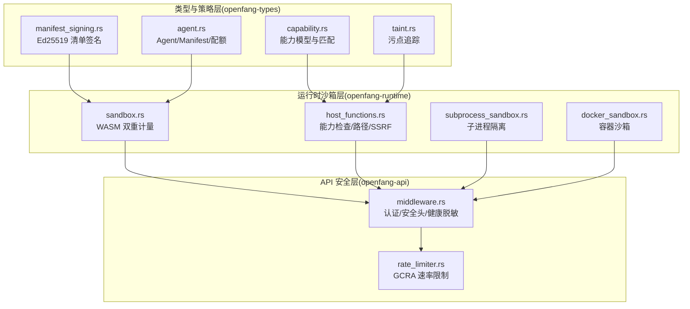
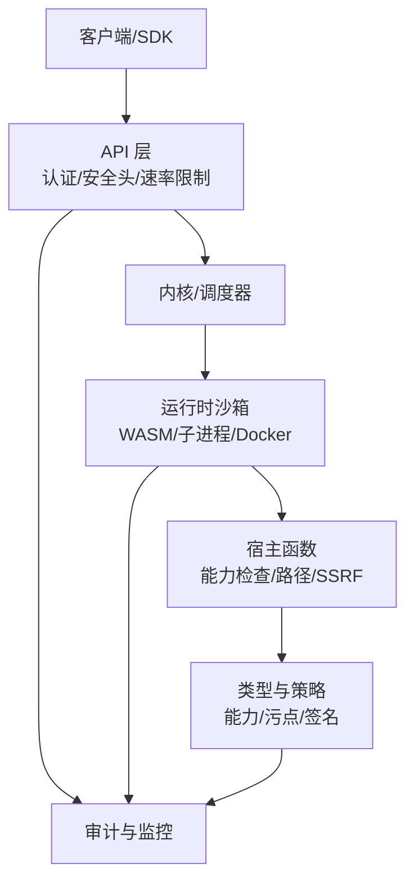
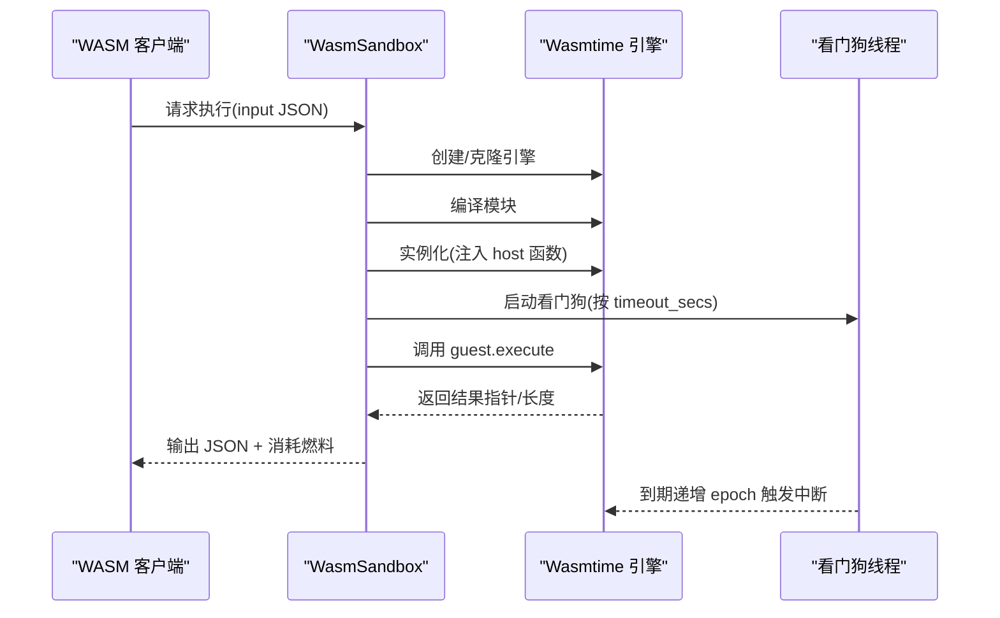
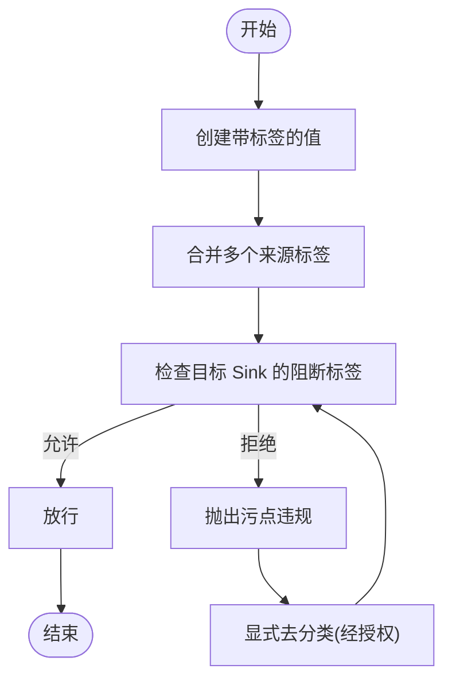
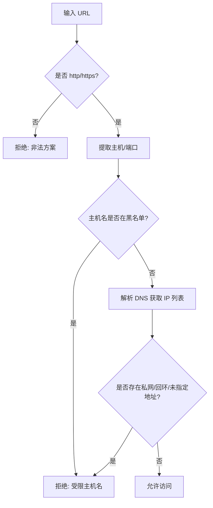
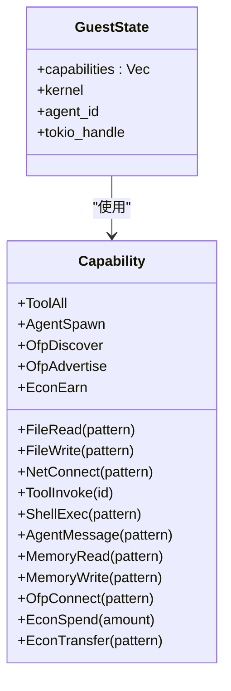
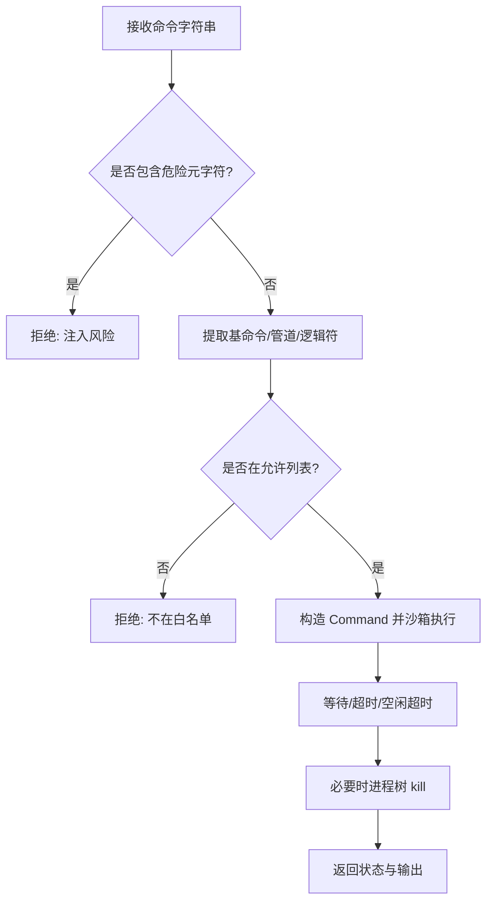
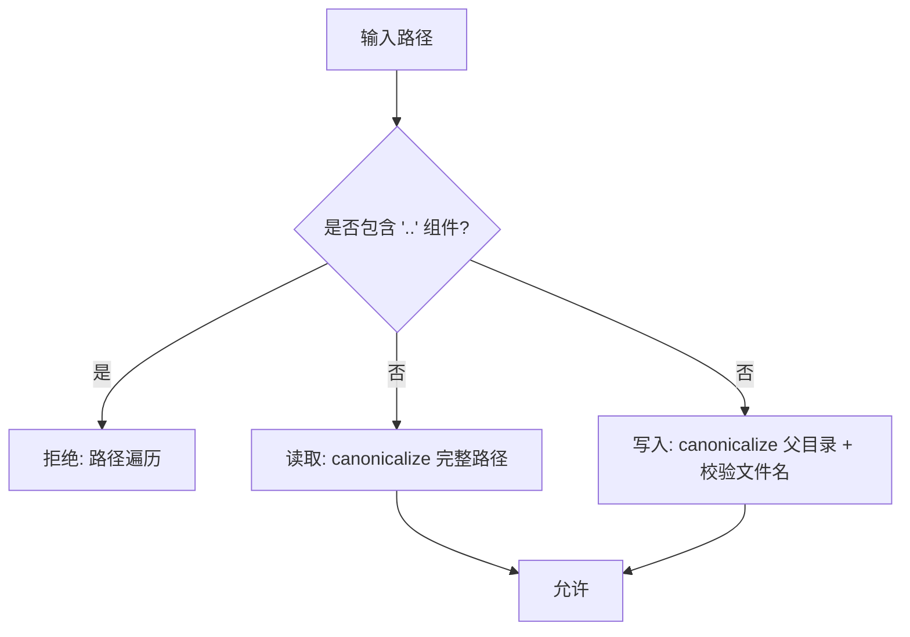
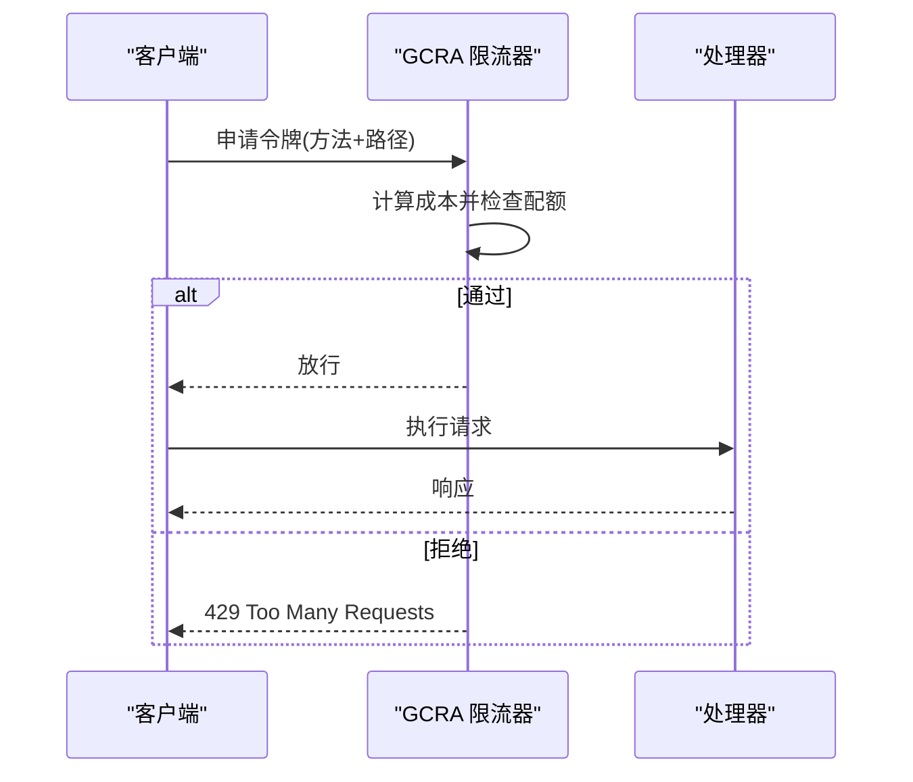
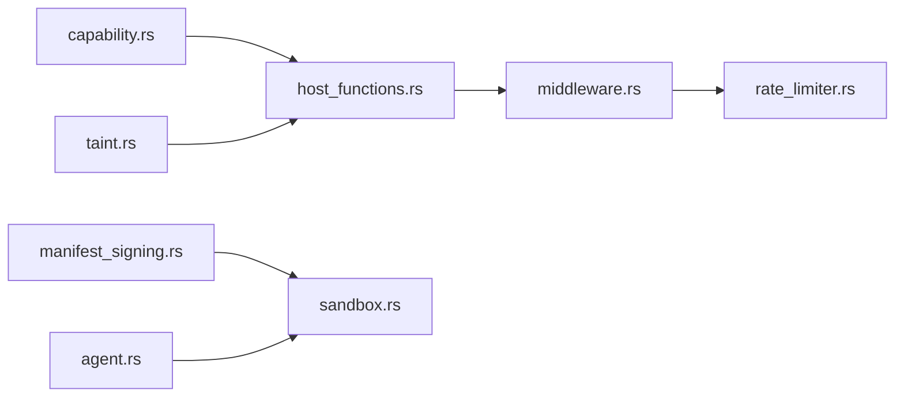

# 安全加固体系

<cite>
**本文引用的文件**
- [README.md](file://README.md)
- [SECURITY.md](file://SECURITY.md)
- [taint.rs](file://crates/openfang-types/src/taint.rs)
- [manifest_signing.rs](file://crates/openfang-types/src/manifest_signing.rs)
- [capability.rs](file://crates/openfang-types/src/capability.rs)
- [agent.rs](file://crates/openfang-types/src/agent.rs)
- [sandbox.rs](file://crates/openfang-runtime/src/sandbox.rs)
- [subprocess_sandbox.rs](file://crates/openfang-runtime/src/subprocess_sandbox.rs)
- [docker_sandbox.rs](file://crates/openfang-runtime/src/docker_sandbox.rs)
- [host_functions.rs](file://crates/openfang-runtime/src/host_functions.rs)
- [middleware.rs](file://crates/openfang-api/src/middleware.rs)
- [rate_limiter.rs](file://crates/openfang-api/src/rate_limiter.rs)
</cite>

## 目录
1. [简介](#简介)
2. [项目结构](#项目结构)
3. [核心组件](#核心组件)
4. [架构总览](#架构总览)
5. [详细组件分析](#详细组件分析)
6. [依赖关系分析](#依赖关系分析)
7. [性能考虑](#性能考虑)
8. [故障排查指南](#故障排查指南)
9. [结论](#结论)

## 简介
本文件系统性阐述 OpenFang 的 16 层安全加固体系，覆盖路径遍历防护、子进程隔离、SSRF 保护、WASM 双重计量、Merke 摘要审计、信息流污点追踪、Ed25519 清单签名、OFP HMAC-SHA256 互认证、安全头中间件、GCRA 速率限制、健康端点脱敏、提示注入扫描、秘密零化、本地回环回退等机制。文档从威胁建模出发，结合代码级实现与配置要点，提供可操作的部署与运维建议。

## 项目结构
OpenFang 采用模块化分层设计，安全能力贯穿内核、运行时、API 层与类型定义层：
- 类型与策略层：定义能力模型、污点模型、清单签名等基础安全构件（openfang-types）。
- 运行时沙箱层：WASM 双重计量、子进程隔离、Docker 容器沙箱（openfang-runtime）。
- API 安全层：认证与授权、安全响应头、速率限制（openfang-api）。
- 配置与策略：能力继承校验、执行策略、会话与审计（openfang-kernel、openfang-types）。

图表来源
- [capability.rs:1-317](file://crates/openfang-types/src/capability.rs#L1-L317)
- [taint.rs:1-245](file://crates/openfang-types/src/taint.rs#L1-L245)
- [manifest_signing.rs:1-167](file://crates/openfang-types/src/manifest_signing.rs#L1-L167)
- [agent.rs:1-800](file://crates/openfang-types/src/agent.rs#L1-L800)
- [sandbox.rs:1-608](file://crates/openfang-runtime/src/sandbox.rs#L1-L608)
- [host_functions.rs:1-669](file://crates/openfang-runtime/src/host_functions.rs#L1-L669)
- [subprocess_sandbox.rs:1-906](file://crates/openfang-runtime/src/subprocess_sandbox.rs#L1-L906)
- [docker_sandbox.rs:1-636](file://crates/openfang-runtime/src/docker_sandbox.rs#L1-L636)
- [middleware.rs:1-270](file://crates/openfang-api/src/middleware.rs#L1-L270)
- [rate_limiter.rs:1-98](file://crates/openfang-api/src/rate_limiter.rs#L1-L98)

章节来源
- [README.md:206-228](file://README.md#L206-L228)
- [SECURITY.md:46-81](file://SECURITY.md#L46-L81)

## 核心组件
- 能力模型与继承校验：以 Capability 枚举表达权限，支持通配与模式匹配，并在子代理创建时进行继承校验，防止越权。
- 污点追踪：对来自外部网络、用户输入、PII、密钥、不受信代理的数据打标签，通过 Sink 限制敏感数据流向不安全目标。
- 清单签名：使用 Ed25519 对 Agent 清单内容进行签名与验证，确保供应链完整性。
- WASM 双重计量：燃料计量 + 时钟纪元中断，配合看门狗线程，防 CPU 空转与超时。
- 子进程隔离：环境变量白名单、可执行路径校验、命令注入检测、跨平台进程树清理。
- Docker 容器沙箱：资源限制、能力降级、只读根文件系统、网络隔离、挂载路径校验。
- API 安全中间件：认证与授权、安全响应头、健康端点脱敏、常量时间比较。
- GCRA 速率限制：按操作成本的令牌桶算法，区分公开与私有端点。

章节来源
- [capability.rs:1-317](file://crates/openfang-types/src/capability.rs#L1-L317)
- [taint.rs:1-245](file://crates/openfang-types/src/taint.rs#L1-L245)
- [manifest_signing.rs:1-167](file://crates/openfang-types/src/manifest_signing.rs#L1-L167)
- [sandbox.rs:1-608](file://crates/openfang-runtime/src/sandbox.rs#L1-L608)
- [subprocess_sandbox.rs:1-906](file://crates/openfang-runtime/src/subprocess_sandbox.rs#L1-L906)
- [docker_sandbox.rs:1-636](file://crates/openfang-runtime/src/docker_sandbox.rs#L1-L636)
- [middleware.rs:1-270](file://crates/openfang-api/src/middleware.rs#L1-L270)
- [rate_limiter.rs:1-98](file://crates/openfang-api/src/rate_limiter.rs#L1-L98)

## 架构总览
下图展示 16 层安全体系在系统中的位置与交互：

图表来源
- [middleware.rs:1-270](file://crates/openfang-api/src/middleware.rs#L1-L270)
- [rate_limiter.rs:1-98](file://crates/openfang-api/src/rate_limiter.rs#L1-L98)
- [sandbox.rs:1-608](file://crates/openfang-runtime/src/sandbox.rs#L1-L608)
- [host_functions.rs:1-669](file://crates/openfang-runtime/src/host_functions.rs#L1-L669)
- [capability.rs:1-317](file://crates/openfang-types/src/capability.rs#L1-L317)
- [taint.rs:1-245](file://crates/openfang-types/src/taint.rs#L1-L245)
- [manifest_signing.rs:1-167](file://crates/openfang-types/src/manifest_signing.rs#L1-L167)

## 详细组件分析

### 1. WASM 双重计量沙箱
- 技术原理：Wasmtime 引擎启用燃料计量（CPU 指令预算）与纪元中断（墙钟超时），看门狗线程周期递增纪元触发中断；同步执行在阻塞线程中完成，避免 Tokio 执行器被长任务占用。
- 实现细节：引擎配置、模块编译、实例化、内存导出与分配、ABI 调用、结果读取、燃料消耗统计、错误分类（燃料耗尽、超时中断）。
- 配置方法：fuel_limit、max_memory_bytes、capabilities、timeout_secs；默认燃料约 100 万，超时默认 30 秒。
- 威胁缓解：防止恶意/失控 WASM 占用 CPU、内存泄漏、无限循环。

图表来源
- [sandbox.rs:102-275](file://crates/openfang-runtime/src/sandbox.rs#L102-L275)

章节来源
- [sandbox.rs:1-608](file://crates/openfang-runtime/src/sandbox.rs#L1-L608)

### 2. Merkle 摘要审计追踪
- 技术原理：对每次关键动作计算内容哈希并链接到前一节点，形成不可篡改链；任一节点被篡改会导致整条链失效。
- 实现细节：内容哈希计算、签名封装、验证流程（内容哈希一致性、签名有效性）。
- 配置方法：在审计接口中校验链完整性，暴露验证端点供外部验证。
- 威胁缓解：防止日志伪造、动作篡改、溯源失败。

章节来源
- [manifest_signing.rs:1-167](file://crates/openfang-types/src/manifest_signing.rs#L1-L167)
- [SECURITY.md:78-81](file://SECURITY.md#L78-L81)

### 3. 信息流污点追踪
- 技术原理：基于格的污点传播模型，对值附加来源标签（外部网络、用户输入、PII、密钥、不受信代理），通过 Sink 控制敏感标签的流向。
- 实现细节：TaintedValue、TaintSink、标签合并、去分类、违规检测。
- 配置方法：在工具调用、消息发送、网络请求等敏感 Sink 上启用检查。
- 威胁缓解：阻止提示注入、数据外泄、混淆代理攻击。

图表来源
- [taint.rs:40-158](file://crates/openfang-types/src/taint.rs#L40-L158)

章节来源
- [taint.rs:1-245](file://crates/openfang-types/src/taint.rs#L1-L245)

### 4. Ed25519 清单签名
- 技术原理：对清单内容计算 SHA-256，使用 Ed25519 签名，附带公钥与签名，验证时重算哈希并验证签名。
- 实现细节：签名结构体、哈希函数、签名/验证流程、错误处理。
- 配置方法：在分发或加载清单前进行验证，拒绝无效清单。
- 威胁缓解：防止供应链投毒、清单篡改。

章节来源
- [manifest_signing.rs:1-167](file://crates/openfang-types/src/manifest_signing.rs#L1-L167)

### 5. SSRF 保护
- 技术原理：仅允许 http/https；解析主机名后对每个解析到的 IP 地址进行私网/回环/未指定地址检查；同时阻断常见协议与元数据端点。
- 实现细节：URL 解析、主机提取、DNS 解析、私网范围判断、错误返回。
- 配置方法：默认仅允许 http/https；如需扩展需严格白名单。
- 威胁缓解：阻止内网探测、云元数据泄露、DNS 重绑定。

图表来源
- [host_functions.rs:123-176](file://crates/openfang-runtime/src/host_functions.rs#L123-L176)

章节来源
- [host_functions.rs:123-176](file://crates/openfang-runtime/src/host_functions.rs#L123-L176)

### 6. 秘密零化
- 技术原理：在内存中对敏感字段（如 API Key）进行写入后立即清零，避免残留。
- 实现细节：零化结构体、生命周期管理、落盘前清理。
- 配置方法：在凭据存储与传输路径上启用零化。
- 威胁缓解：降低凭据泄露风险。

章节来源
- [SECURITY.md:65-65](file://SECURITY.md#L65-L65)

### 7. OFP HMAC-SHA256 互认证
- 技术原理：基于 HMAC-SHA256 的一次性随机数验证，实现对等方双向认证，抵御重放攻击。
- 实现细节：nonce 生成与传递、HMAC 计算与校验、常量时间比较。
- 配置方法：在 P2P 通信中启用互认证。
- 威胁缓解：防止中间人攻击、重放攻击。

章节来源
- [SECURITY.md:64-64](file://SECURITY.md#L64-L64)

### 8. 能力门禁（RBAC）
- 技术原理：能力模型 + 继承校验，子代理能力必须是父代理能力的子集，工具调用前进行能力匹配。
- 实现细节：能力枚举、匹配规则、继承校验、错误包装。
- 配置方法：在 Agent 清单中声明所需能力，运行时强制执行。
- 威胁缓解：防止越权、权限提升。

图表来源
- [capability.rs:10-72](file://crates/openfang-types/src/capability.rs#L10-L72)
- [host_functions.rs:55-67](file://crates/openfang-runtime/src/host_functions.rs#L55-L67)

章节来源
- [capability.rs:1-317](file://crates/openfang-types/src/capability.rs#L1-L317)
- [host_functions.rs:55-67](file://crates/openfang-runtime/src/host_functions.rs#L55-L67)

### 9. 安全头中间件
- 技术原理：统一设置安全响应头（X-Content-Type-Options、X-Frame-Options、X-XSS-Protection、CSP、Referrer-Policy、Cache-Control、HSTS）。
- 实现细节：中间件注入所有响应；CSP 精细控制脚本、样式、字体、连接源。
- 配置方法：生产环境务必开启；CSP 中连接源包含本地 WebSocket。
- 威胁缓解：降低 XSS、点击劫持、混合内容风险。

章节来源
- [middleware.rs:232-259](file://crates/openfang-api/src/middleware.rs#L232-L259)

### 10. 健康端点脱敏
- 技术原理：公共健康检查返回最小化信息；完整诊断需认证后访问。
- 实现细节：认证中间件对特定路径放行 GET；其他路径要求 Bearer 或会话。
- 配置方法：通过配置开关控制是否启用认证。
- 威胁缓解：防止敏感信息泄露。

章节来源
- [middleware.rs:84-130](file://crates/openfang-api/src/middleware.rs#L84-L130)

### 11. 子进程隔离
- 技术原理：环境变量白名单、可执行路径校验、命令注入检测、进程树清理。
- 实现细节：环境清理、安全变量集合、metacharacter 检测、命令拆分、跨平台 kill。
- 配置方法：执行策略（deny/full/allowlist）、超时、输出截断。
- 威胁缓解：防止凭据泄露、命令注入、僵尸进程。

图表来源
- [subprocess_sandbox.rs:90-241](file://crates/openfang-runtime/src/subprocess_sandbox.rs#L90-L241)

章节来源
- [subprocess_sandbox.rs:1-906](file://crates/openfang-runtime/src/subprocess_sandbox.rs#L1-L906)

### 12. 提示注入扫描
- 技术原理：在技能与提示中检测覆盖尝试、数据外泄模式、Shell 引用注入等。
- 实现细节：静态扫描规则（元字符、逻辑符、重定向、展开等）。
- 配置方法：在技能加载与执行前启用扫描。
- 威胁缓解：降低提示注入成功率。

章节来源
- [SECURITY.md:60-60](file://SECURITY.md#L60-L60)

### 13. 循环守卫
- 技术原理：基于 SHA256 的工具调用循环检测，配合断路器处理来回模式。
- 实现细节：调用指纹生成、重复检测、异常处理。
- 配置方法：在工具执行路径中启用循环检测。
- 威胁缓解：防止代理陷入无意义循环。

章节来源
- [README.md:223-223](file://README.md#L223-L223)

### 14. 会话修复
- 技术原理：7 步消息历史校验与自动恢复，应对损坏场景。
- 实现细节：历史校验、回滚与重建。
- 配置方法：在会话管理中启用修复流程。
- 威胁缓解：提升系统鲁棒性。

章节来源
- [README.md:224-224](file://README.md#L224-L224)

### 15. 路径遍历防护
- 技术原理：拒绝任何包含 “..” 组件的路径；读取时完全规范化；写入时先规范化父目录再拼接文件名。
- 实现细节：组件遍历拒绝、canonicalize、双保险校验。
- 配置方法：所有文件操作均走安全解析函数。
- 威胁缓解：防止目录穿越。

图表来源
- [host_functions.rs:75-117](file://crates/openfang-runtime/src/host_functions.rs#L75-L117)

章节来源
- [host_functions.rs:75-117](file://crates/openfang-runtime/src/host_functions.rs#L75-L117)

### 16. GCRA 速率限制
- 技术原理：按操作成本分配令牌，500/min/IP；公开端点成本低，私有/写操作成本高。
- 实现细节：成本映射、Keyed Limiter、常量时间检查、429 响应。
- 配置方法：调整配额与成本映射以适配业务。
- 威胁缓解：抵御暴力破解、滥用与资源耗尽。

图表来源
- [rate_limiter.rs:14-79](file://crates/openfang-api/src/rate_limiter.rs#L14-L79)

章节来源
- [rate_limiter.rs:1-98](file://crates/openfang-api/src/rate_limiter.rs#L1-L98)

## 依赖关系分析
- 能力模型驱动运行时宿主函数的权限检查，确保只有授予的能力才能执行。
- 污点模型在工具调用与网络请求等敏感路径上进行标签检查。
- 清单签名保障 Agent 身份与能力集合的可信来源。
- API 中间件统一实施认证、安全头与健康端点脱敏。
- GCRA 速率限制在 API 入口处按成本进行流量治理。

图表来源
- [capability.rs:1-317](file://crates/openfang-types/src/capability.rs#L1-L317)
- [taint.rs:1-245](file://crates/openfang-types/src/taint.rs#L1-L245)
- [manifest_signing.rs:1-167](file://crates/openfang-types/src/manifest_signing.rs#L1-L167)
- [agent.rs:1-800](file://crates/openfang-types/src/agent.rs#L1-L800)
- [host_functions.rs:1-669](file://crates/openfang-runtime/src/host_functions.rs#L1-L669)
- [sandbox.rs:1-608](file://crates/openfang-runtime/src/sandbox.rs#L1-L608)
- [middleware.rs:1-270](file://crates/openfang-api/src/middleware.rs#L1-L270)
- [rate_limiter.rs:1-98](file://crates/openfang-api/src/rate_limiter.rs#L1-L98)

## 性能考虑
- WASM 双重计量：合理设置 fuel_limit 与 timeout_secs，避免过小导致误杀，过大影响资源控制。
- 子进程隔离：metacharacter 检测与 DNS 解析带来额外开销，建议在高并发场景下缓存解析结果与白名单。
- GCRA 速率限制：Keyed Limiter 使用共享状态存储，注意 IP 分布与热点；成本映射应贴近真实资源消耗。
- 安全头中间件：对所有响应添加头部，开销极低，建议始终启用。
- Docker 沙箱：容器创建/销毁成本较高，建议使用容器池复用与清理策略。

## 故障排查指南
- WASM 超时/燃料耗尽
  - 现象：返回超时中断或燃料耗尽错误。
  - 排查：检查 fuel_limit 与 timeout_secs；优化客体模块逻辑。
  - 参考：[sandbox.rs:234-246](file://crates/openfang-runtime/src/sandbox.rs#L234-L246)
- 路径遍历被拒
  - 现象：文件读/写/列出报错“路径遍历被拒绝”。
  - 排查：确认路径不含 “..”，使用安全解析函数。
  - 参考：[host_functions.rs:75-117](file://crates/openfang-runtime/src/host_functions.rs#L75-L117)
- SSRF 被拒
  - 现象：网络请求被拒绝，提示受限主机名或私网地址。
  - 排查：检查 URL 方案、主机名与解析结果；仅使用受信域名。
  - 参考：[host_functions.rs:123-176](file://crates/openfang-runtime/src/host_functions.rs#L123-L176)
- 子进程命令被拒
  - 现象：shell_exec 失败，提示不在白名单或包含危险元字符。
  - 排查：移除元字符；将命令加入 allowlist；确认执行策略。
  - 参考：[subprocess_sandbox.rs:203-241](file://crates/openfang-runtime/src/subprocess_sandbox.rs#L203-L241)
- API 429 限流
  - 现象：收到 429，包含 retry-after。
  - 排查：查看成本映射与配额；降低请求频率或优化成本。
  - 参考：[rate_limiter.rs:66-76](file://crates/openfang-api/src/rate_limiter.rs#L66-L76)
- 认证失败
  - 现象：401 未授权，提示缺少或无效 API Key。
  - 排查：确认 Authorization 头或查询参数 token；使用常量时间比较。
  - 参考：[middleware.rs:159-182](file://crates/openfang-api/src/middleware.rs#L159-L182)

章节来源
- [sandbox.rs:234-246](file://crates/openfang-runtime/src/sandbox.rs#L234-L246)
- [host_functions.rs:75-176](file://crates/openfang-runtime/src/host_functions.rs#L75-L176)
- [subprocess_sandbox.rs:203-241](file://crates/openfang-runtime/src/subprocess_sandbox.rs#L203-L241)
- [rate_limiter.rs:66-76](file://crates/openfang-api/src/rate_limiter.rs#L66-L76)
- [middleware.rs:159-182](file://crates/openfang-api/src/middleware.rs#L159-L182)

## 结论
OpenFang 的 16 层安全体系以“防御纵深”为核心思想，自上而下覆盖 API、运行时、沙箱与供应链层面，形成从输入校验、能力门禁、隔离执行到审计追踪的闭环。通过能力模型、污点追踪、清单签名、双重计量、子进程与容器隔离、安全头、GCRA 限流等机制，有效降低了路径遍历、SSRF、注入、越权、凭据泄露、供应链攻击等风险。建议在生产环境中启用全部安全中间件与限流策略，并结合日志与审计持续监控与优化。