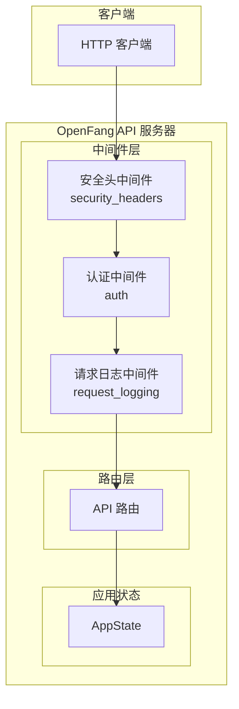
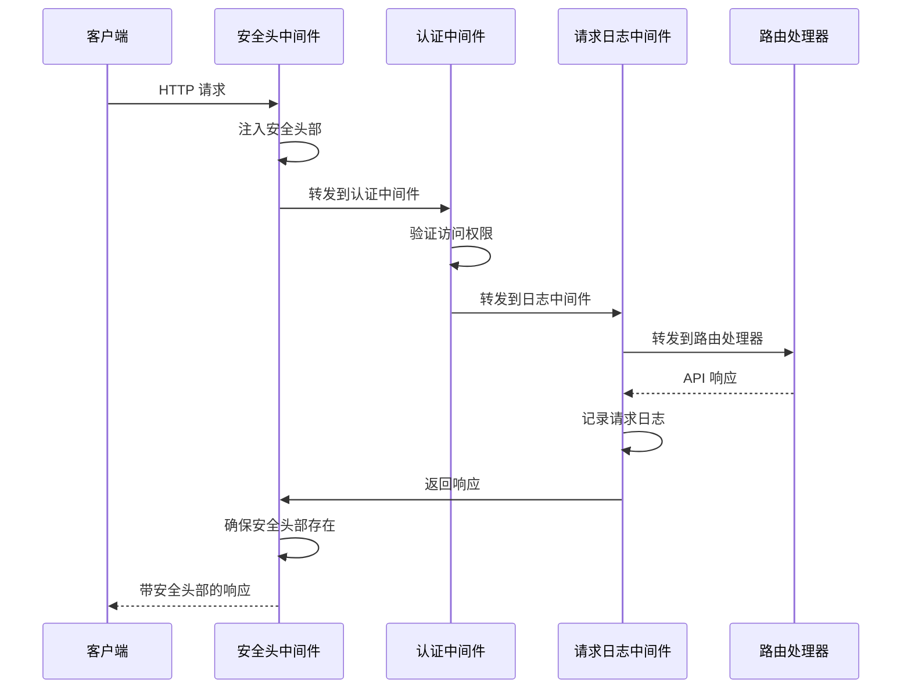
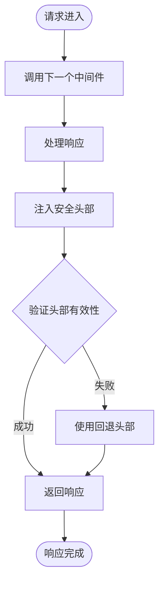
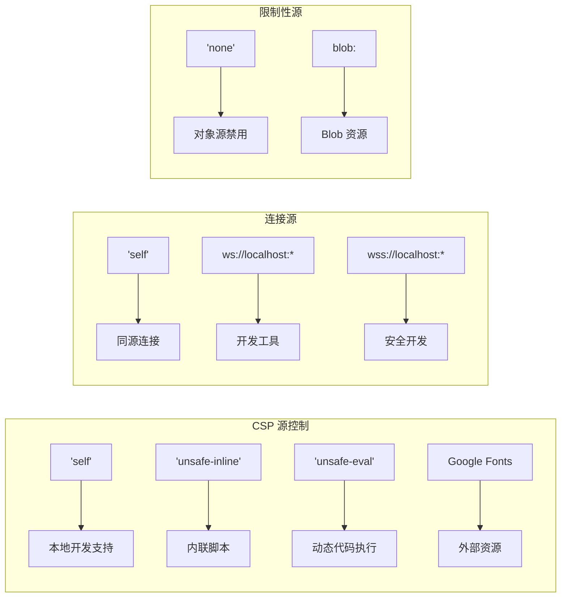
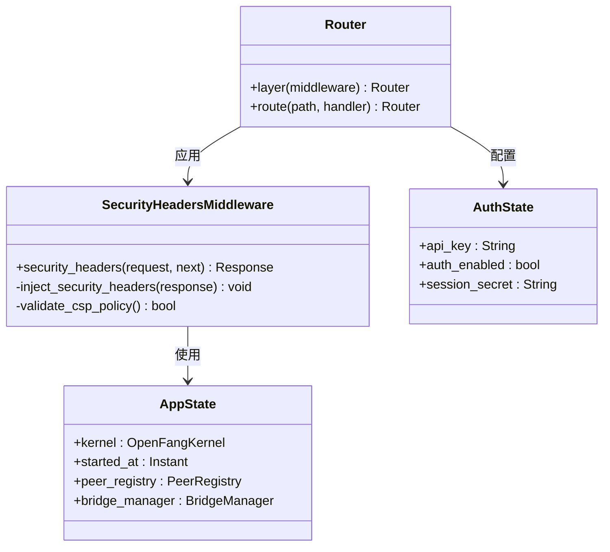
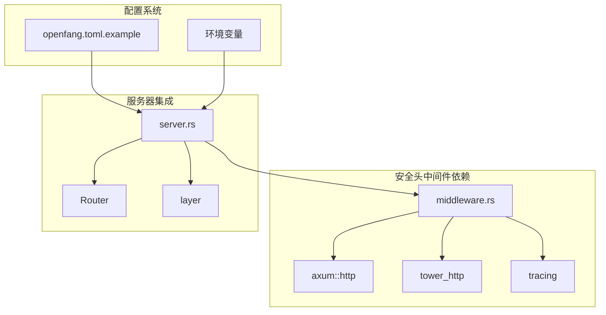
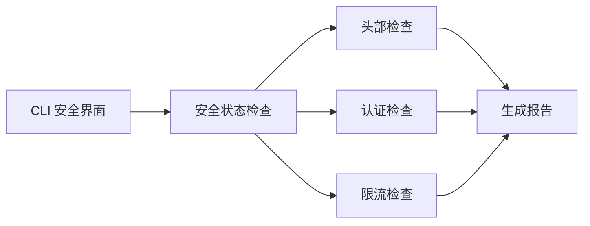

# 安全头中间件

<cite>
**本文档引用的文件**
- [middleware.rs](file://crates/openfang-api/src/middleware.rs)
- [server.rs](file://crates/openfang-api/src/server.rs)
- [routes.rs](file://crates/openfang-api/src/routes.rs)
- [security.rs](file://crates/openfang-cli/src/tui/screens/security.rs)
- [openfang.toml.example](file://openfang.toml.example)
</cite>

## 目录
1. [简介](#简介)
2. [项目结构](#项目结构)
3. [核心组件](#核心组件)
4. [架构概览](#架构概览)
5. [详细组件分析](#详细组件分析)
6. [依赖关系分析](#依赖关系分析)
7. [性能考虑](#性能考虑)
8. [故障排除指南](#故障排除指南)
9. [结论](#结论)

## 简介

安全头中间件是 OpenFang API 服务器的重要安全组件，负责在所有 API 响应中自动注入关键的安全 HTTP 头部。该中间件实现了多种行业标准的安全策略，包括内容安全策略（CSP）、点击劫持防护、跨站脚本防护等，为 API 服务提供了全面的浏览器安全保护。

本文档将深入分析 middleware.rs 中安全头中间件的实现细节，解释各种安全头部的作用和防护效果，并提供配置指南和最佳实践建议。

## 项目结构

安全头中间件位于 OpenFang 项目的 API 层，与认证中间件、请求日志中间件共同构成了完整的安全基础设施。

**图表来源**
- [server.rs:704](file://crates/openfang-api/src/server.rs#L704)
- [middleware.rs:232](file://crates/openfang-api/src/middleware.rs#L232)

**章节来源**
- [server.rs:37-712](file://crates/openfang-api/src/server.rs#L37-L712)

## 核心组件

安全头中间件的核心功能通过 `security_headers` 函数实现，该函数对所有 API 响应自动注入以下安全头部：

### 主要安全头部配置

| 安全头部 | 配置值 | 防护作用 |
|---------|--------|----------|
| Content-Type Options | nosniff | 防止 MIME 类型混淆攻击 |
| X-Frame-Options | DENY | 防止点击劫持攻击 |
| X-XSS-Protection | 1; mode=block | 启用浏览器 XSS 过滤器 |
| Content-Security-Policy | 严格策略 | 控制资源加载和执行 |
| Referrer-Policy | strict-origin-when-cross-origin | 控制引用信息泄露 |
| Cache-Control | no-store, no-cache, must-revalidate | 防止敏感数据缓存 |
| Strict-Transport-Security | max-age=63072000 | 强制 HTTPS 连接 |

**章节来源**
- [middleware.rs:232-259](file://crates/openfang-api/src/middleware.rs#L232-L259)

## 架构概览

安全头中间件在整个请求处理流程中的位置如下：

**图表来源**
- [server.rs:696-709](file://crates/openfang-api/src/server.rs#L696-L709)
- [middleware.rs:18](file://crates/openfang-api/src/middleware.rs#L18)

**章节来源**
- [server.rs:696-709](file://crates/openfang-api/src/server.rs#L696-L709)

## 详细组件分析

### 安全头中间件实现

#### 核心实现逻辑

安全头中间件采用后置中间件模式，在请求处理完成后修改响应头：

**图表来源**
- [middleware.rs:233-259](file://crates/openfang-api/src/middleware.rs#L233-L259)

#### 内容安全策略（CSP）配置

CSP 是现代 Web 应用最重要的安全策略之一，OpenFang 实现了严格的 CSP 配置：

**图表来源**
- [middleware.rs:240-245](file://crates/openfang-api/src/middleware.rs#L240-L245)

**章节来源**
- [middleware.rs:232-259](file://crates/openfang-api/src/middleware.rs#L232-L259)

### 安全头部详解

#### X-Content-Type-Options: nosniff

防止 MIME 类型混淆攻击，确保浏览器正确解析响应内容类型。

#### X-Frame-Options: DENY

完全禁止页面被嵌入到 iframe 中，有效防止点击劫持攻击。

#### X-XSS-Protection: 1; mode=block

启用浏览器内置的 XSS 过滤器，在检测到潜在 XSS 攻击时阻止页面渲染。

#### Content-Security-Policy

实施严格的内容安全策略，控制资源加载和脚本执行：

- **默认源策略**: 仅允许同源资源
- **脚本源**: 允许内联脚本和动态代码执行（用于必要的功能）
- **样式源**: 允许内联样式和外部字体资源
- **连接源**: 限制 WebSocket 连接到本地主机
- **对象源**: 禁用插件内容
- **框架源**: 仅允许同源和 Blob 资源

#### Referrer-Policy

设置为 `strict-origin-when-cross-origin`，在跨域请求时只发送源信息，减少隐私泄露风险。

#### Cache-Control

防止敏感数据被缓存，确保每次请求都获取最新数据。

#### Strict-Transport-Security

强制使用 HTTPS 连接，提升传输层安全性。

**章节来源**
- [middleware.rs:236-257](file://crates/openfang-api/src/middleware.rs#L236-L257)

### 中间件集成方式

安全头中间件通过 Tower 中间件系统集成到 API 服务器中：

**图表来源**
- [server.rs:696-709](file://crates/openfang-api/src/server.rs#L696-L709)
- [middleware.rs:47](file://crates/openfang-api/src/middleware.rs#L47)

**章节来源**
- [server.rs:696-709](file://crates/openfang-api/src/server.rs#L696-L709)

## 依赖关系分析

### 组件耦合关系

**图表来源**
- [server.rs:4-18](file://crates/openfang-api/src/server.rs#L4-L18)
- [middleware.rs:8-12](file://crates/openfang-api/src/middleware.rs#L8-L12)

### 外部依赖

- **Axum**: HTTP 服务器框架，提供中间件机制
- **Tower HTTP**: 中间件基础设施
- **Tracing**: 日志记录和监控
- **UUID**: 请求 ID 生成

**章节来源**
- [server.rs:4-18](file://crates/openfang-api/src/server.rs#L4-L18)
- [middleware.rs:8-12](file://crates/openfang-api/src/middleware.rs#L8-L12)

## 性能考虑

### 中间件性能影响

安全头中间件对性能的影响极小，主要开销来自：
- 响应头操作：O(n) 时间复杂度，n 为响应头数量
- 字符串解析：常数时间开销
- 内存分配：少量临时内存分配

### 优化策略

1. **避免重复注入**: 中间件确保只注入必要的安全头部
2. **最小化字符串操作**: 使用预定义的头部值
3. **零拷贝操作**: 利用 Rust 的所有权系统避免不必要的数据复制

## 故障排除指南

### 常见问题诊断

#### 安全头部未生效

**可能原因**:
1. 中间件未正确注册到路由器
2. 响应被其他中间件覆盖
3. CSP 策略过于严格导致资源加载失败

**解决方案**:
1. 检查中间件注册顺序
2. 验证 CSP 策略配置
3. 使用浏览器开发者工具检查响应头

#### CSP 策略冲突

**症状**: 外部资源无法加载或功能异常

**排查步骤**:
1. 检查 CSP 配置中的外部资源源
2. 验证 WebSocket 连接源配置
3. 确认开发环境的特殊需求

**章节来源**
- [middleware.rs:240-245](file://crates/openfang-api/src/middleware.rs#L240-L245)

### 安全状态监控

CLI 提供了安全状态监控功能，可以验证安全头中间件是否正常工作：

**图表来源**
- [security.rs:110-115](file://crates/openfang-cli/src/tui/screens/security.rs#L110-L115)

**章节来源**
- [security.rs:110-115](file://crates/openfang-cli/src/tui/screens/security.rs#L110-L115)

## 结论

OpenFang 的安全头中间件实现了业界标准的 Web 安全最佳实践，通过自动注入关键的安全 HTTP 头部，为 API 服务提供了全面的浏览器安全保护。其设计具有以下特点：

1. **自动化**: 所有响应自动包含安全头部，无需手动添加
2. **严格性**: 采用最严格的安全策略，确保最佳防护效果
3. **可维护性**: 清晰的代码结构和详细的注释
4. **可观测性**: 与日志系统集成，便于监控和调试

通过合理配置和持续监控，安全头中间件能够有效防范多种常见的 Web 攻击，包括 XSS、点击劫持、MIME 类型混淆等，为 OpenFang API 服务提供坚实的安全基础。