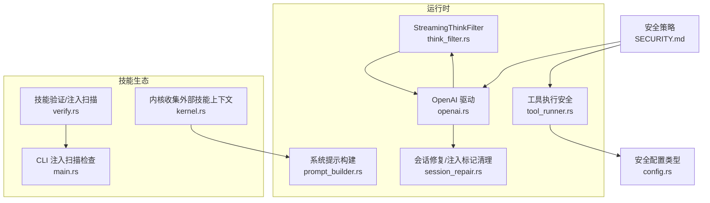
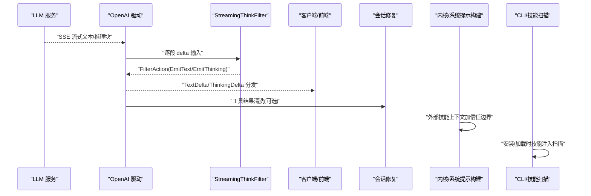
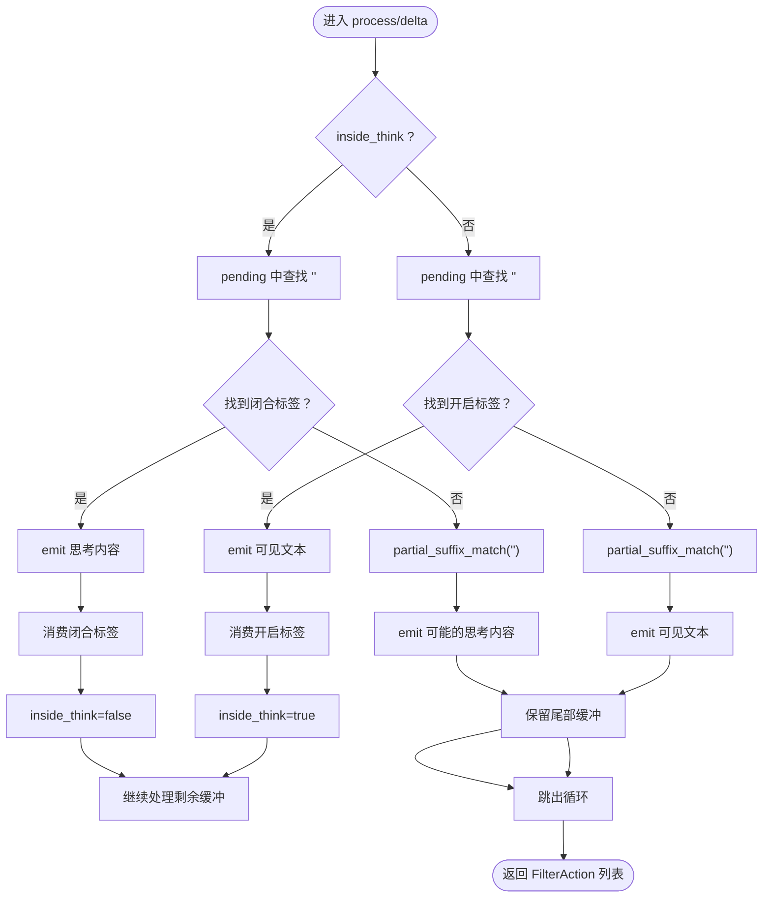
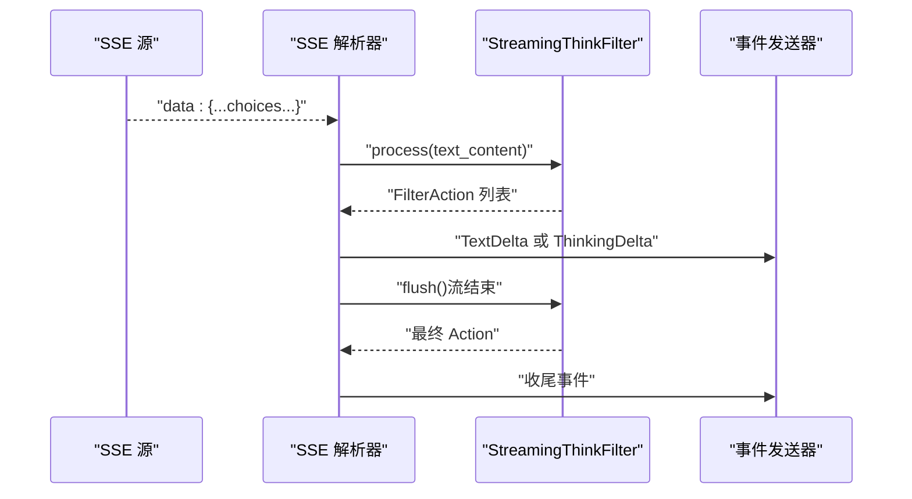
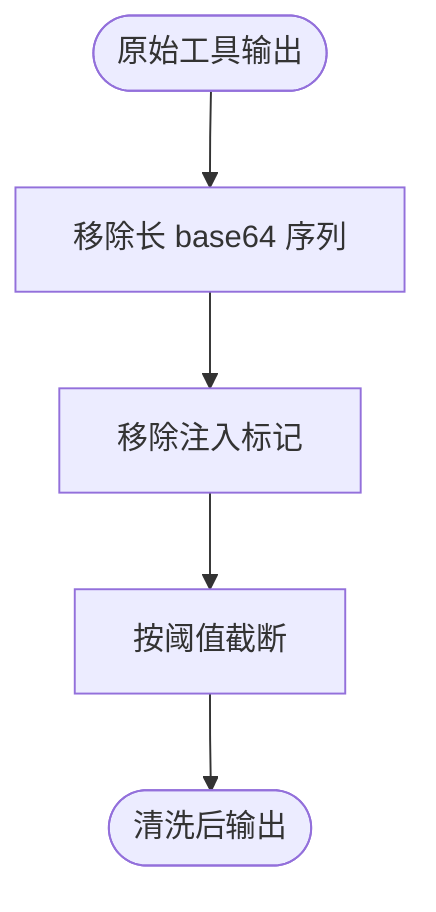
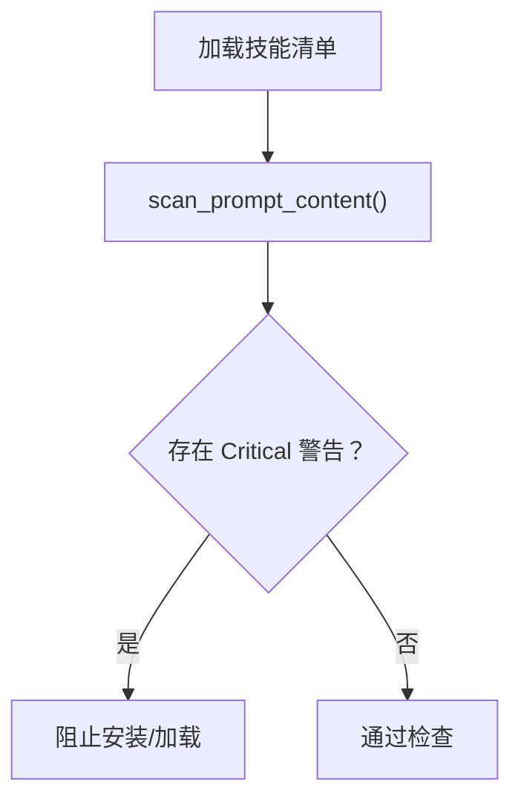
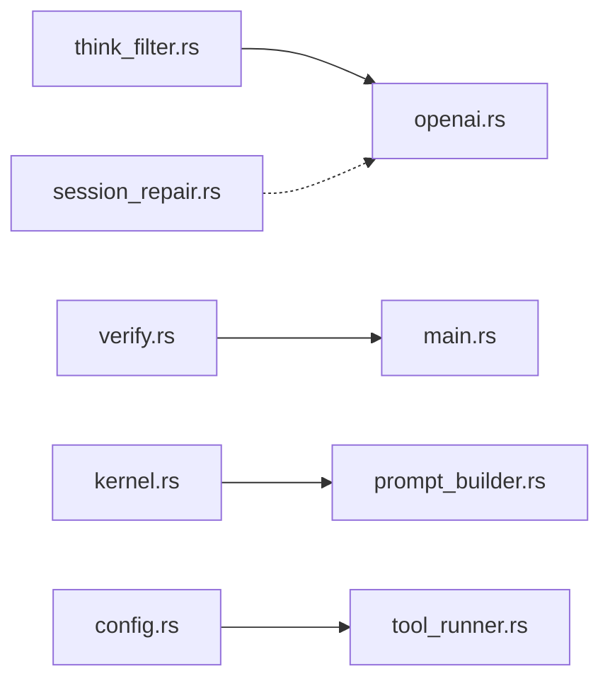

# 提示注入扫描

<cite>
**本文引用的文件**
- [think_filter.rs](file://crates/openfang-runtime/src/think_filter.rs)
- [openai.rs](file://crates/openfang-runtime/src/drivers/openai.rs)
- [session_repair.rs](file://crates/openfang-runtime/src/session_repair.rs)
- [kernel.rs](file://crates/openfang-kernel/src/kernel.rs)
- [verify.rs](file://crates/openfang-skills/src/verify.rs)
- [main.rs](file://crates/openfang-cli/src/main.rs)
- [prompt_builder.rs](file://crates/openfang-runtime/src/prompt_builder.rs)
- [tool_runner.rs](file://crates/openfang-runtime/src/tool_runner.rs)
- [config.rs](file://crates/openfang-types/src/config.rs)
- [SECURITY.md](file://SECURITY.md)
</cite>

## 目录
1. [简介](#简介)
2. [项目结构](#项目结构)
3. [核心组件](#核心组件)
4. [架构总览](#架构总览)
5. [详细组件分析](#详细组件分析)
6. [依赖关系分析](#依赖关系分析)
7. [性能考量](#性能考量)
8. [故障排查指南](#故障排查指南)
9. [结论](#结论)
10. [附录](#附录)

## 简介
本文件面向“提示注入扫描”的 AI 安全主题，聚焦于 think_filter.rs 的实现与工作机制，系统阐述其如何在流式输出中识别并过滤潜在的提示注入攻击（如模型推理标签泄漏），以及与之配套的上下文污染检测、安全响应生成与威胁检测策略。文档同时覆盖相关安全配置与运行时防护链路，帮助读者从代码级到实践层全面理解该能力的设计与落地。

## 项目结构
围绕提示注入扫描的关键代码主要分布在以下模块：
- 运行时过滤器：think_filter.rs 实现流式 think 标签过滤
- 驱动层集成：openai.rs 将过滤器接入 SSE 流解析
- 上下文清洗：session_repair.rs 对工具结果进行注入标记清理
- 技能扫描：verify.rs 对技能 Markdown 内容进行注入模式扫描
- CLI 扫描：main.rs 在安装/加载流程中执行技能注入扫描
- 系统提示构建：prompt_builder.rs 统一构建系统提示，避免注入扩散
- 命令执行安全：tool_runner.rs 通过白名单模式降低命令注入风险
- 安全策略：SECURITY.md 明确整体安全架构与输入验证要点

**图表来源**
- [think_filter.rs:23-141](file://crates/openfang-runtime/src/think_filter.rs#L23-L141)
- [openai.rs:1070-1269](file://crates/openfang-runtime/src/drivers/openai.rs#L1070-L1269)
- [session_repair.rs:503-612](file://crates/openfang-runtime/src/session_repair.rs#L503-L612)
- [prompt_builder.rs:1-206](file://crates/openfang-runtime/src/prompt_builder.rs#L1-L206)
- [tool_runner.rs:1460-1578](file://crates/openfang-runtime/src/tool_runner.rs#L1460-L1578)
- [verify.rs:105-179](file://crates/openfang-skills/src/verify.rs#L105-L179)
- [main.rs:2584-2616](file://crates/openfang-cli/src/main.rs#L2584-L2616)
- [kernel.rs:5248-5427](file://crates/openfang-kernel/src/kernel.rs#L5248-L5427)
- [config.rs:785-800](file://crates/openfang-types/src/config.rs#L785-L800)
- [SECURITY.md:46-81](file://SECURITY.md#L46-L81)

**章节来源**
- [think_filter.rs:1-446](file://crates/openfang-runtime/src/think_filter.rs#L1-L446)
- [openai.rs:1070-1269](file://crates/openfang-runtime/src/drivers/openai.rs#L1070-L1269)
- [session_repair.rs:503-612](file://crates/openfang-runtime/src/session_repair.rs#L503-L612)
- [verify.rs:105-179](file://crates/openfang-skills/src/verify.rs#L105-L179)
- [main.rs:2584-2616](file://crates/openfang-cli/src/main.rs#L2584-L2616)
- [prompt_builder.rs:1-206](file://crates/openfang-runtime/src/prompt_builder.rs#L1-L206)
- [tool_runner.rs:1460-1578](file://crates/openfang-runtime/src/tool_runner.rs#L1460-L1578)
- [kernel.rs:5248-5427](file://crates/openfang-kernel/src/kernel.rs#L5248-L5427)
- [config.rs:785-800](file://crates/openfang-types/src/config.rs#L785-L800)
- [SECURITY.md:46-81](file://SECURITY.md#L46-L81)

## 核心组件
- 流式思考标签过滤器 StreamingThinkFilter
  - 责任：在流式 SSE 数据中识别并分离 <think>...</think> 推理块，将可见文本与思考内容分别发出，防止推理标签泄露到用户侧
  - 关键点：状态机 inside_think、pending 缓冲、partial_suffix_match 用于处理跨分片标签边界
- OpenAI 驱动集成
  - 责任：在 SSE 解析过程中调用过滤器，将文本与推理内容分别映射为 TextDelta 和 ThinkingDelta
  - 关键点：流结束时 flush，确保未闭合标签或尾部缓冲被正确处理
- 会话修复与注入标记清理
  - 责任：对工具输出进行三步清洗：截断、移除 base64 大块、移除注入标记，降低二次注入风险
- 技能注入扫描
  - 责任：对 SKILL.md 中的 Markdown 内容进行模式匹配，识别系统提示覆盖、数据外泄、危险命令引用等
- CLI 注入扫描
  - 责任：在安装/加载技能时执行扫描，仅对“严重”级别警告进行阻断
- 系统提示构建
  - 责任：统一组装系统提示，对外部技能上下文添加信任边界注释，避免直接注入
- 工具执行安全
  - 责任：默认白名单模式，使用 POSIX shell 语法解析后直接执行二进制，避免编码技巧、$IFS、通配符等注入
- 安全配置
  - 责任：提供执行安全模式枚举（Deny/Allowlist/Full），作为工具执行策略开关

**章节来源**
- [think_filter.rs:23-141](file://crates/openfang-runtime/src/think_filter.rs#L23-L141)
- [openai.rs:1070-1269](file://crates/openfang-runtime/src/drivers/openai.rs#L1070-L1269)
- [session_repair.rs:503-612](file://crates/openfang-runtime/src/session_repair.rs#L503-L612)
- [verify.rs:105-179](file://crates/openfang-skills/src/verify.rs#L105-L179)
- [main.rs:2584-2616](file://crates/openfang-cli/src/main.rs#L2584-L2616)
- [prompt_builder.rs:316-333](file://crates/openfang-runtime/src/prompt_builder.rs#L316-L333)
- [tool_runner.rs:1460-1578](file://crates/openfang-runtime/src/tool_runner.rs#L1460-L1578)
- [config.rs:785-800](file://crates/openfang-types/src/config.rs#L785-L800)

## 架构总览
提示注入扫描贯穿“输入—解析—过滤—输出—上下文构建—执行—响应”的全链路，形成多层防护：

**图表来源**
- [openai.rs:1070-1269](file://crates/openfang-runtime/src/drivers/openai.rs#L1070-L1269)
- [think_filter.rs:51-135](file://crates/openfang-runtime/src/think_filter.rs#L51-L135)
- [session_repair.rs:503-612](file://crates/openfang-runtime/src/session_repair.rs#L503-L612)
- [kernel.rs:5248-5427](file://crates/openfang-kernel/src/kernel.rs#L5248-L5427)
- [verify.rs:105-179](file://crates/openfang-skills/src/verify.rs#L105-L179)
- [main.rs:2584-2616](file://crates/openfang-cli/src/main.rs#L2584-L2616)

## 详细组件分析

### think_filter.rs：流式思考标签过滤器
- 设计目标
  - 在流式场景下，准确识别 <think>...</think> 推理标签，避免推理内容泄露给用户
  - 支持跨分片标签边界，通过 partial_suffix_match 计算可能的不完整标签后缀
- 状态机与动作
  - inside_think：是否处于推理块内
  - pending：缓冲区，保存可能构成标签边界的字符
  - FilterAction：EmitText（可见文本）与 EmitThinking（推理内容）
- 关键算法
  - partial_suffix_match：计算 haystack 的最长后缀与 needle 前缀匹配长度，决定保留/丢弃的缓冲长度
  - process：循环查找标签，按需 emit 并更新状态；flush：收尾阶段将剩余缓冲按当前状态 emit
- 测试覆盖
  - 跨分片标签、部分标签、交错文本与推理、空推理块、仅推理块、flush 边界等

**图表来源**
- [think_filter.rs:51-135](file://crates/openfang-runtime/src/think_filter.rs#L51-L135)
- [think_filter.rs:147-158](file://crates/openfang-runtime/src/think_filter.rs#L147-L158)

**章节来源**
- [think_filter.rs:23-141](file://crates/openfang-runtime/src/think_filter.rs#L23-L141)
- [think_filter.rs:147-158](file://crates/openfang-runtime/src/think_filter.rs#L147-L158)
- [think_filter.rs:160-445](file://crates/openfang-runtime/src/think_filter.rs#L160-L445)

### openai.rs：驱动层集成与流式处理
- 职责
  - 解析 SSE 行，提取 choices/delta/content/reasoning_content/tool_calls
  - 将 content 通过 StreamingThinkFilter 过滤，分别发送 TextDelta 与 ThinkingDelta
  - 流结束后 flush，确保未闭合标签或尾部缓冲被处理
- 关键点
  - 使用 think_filter.process 处理每个文本 delta
  - 对 reasoning_content 同样进行路由（某些模型直接输出推理内容）

**图表来源**
- [openai.rs:1070-1269](file://crates/openfang-runtime/src/drivers/openai.rs#L1070-L1269)
- [think_filter.rs:51-135](file://crates/openfang-runtime/src/think_filter.rs#L51-L135)

**章节来源**
- [openai.rs:1070-1269](file://crates/openfang-runtime/src/drivers/openai.rs#L1070-L1269)

### session_repair.rs：上下文污染检测与响应生成
- 职责
  - 清洗工具输出：截断超长内容、移除大块 base64、移除注入标记
  - 保护后续 LLM 不再接收潜在恶意细节
- 关键策略
  - 最大长度限制（默认 10K）
  - base64 长序列识别与替换（>1000 字符）
  - 注入标记列表（大小写无关替换）

**图表来源**
- [session_repair.rs:503-612](file://crates/openfang-runtime/src/session_repair.rs#L503-L612)

**章节来源**
- [session_repair.rs:503-612](file://crates/openfang-runtime/src/session_repair.rs#L503-L612)

### verify.rs 与 main.rs：技能注入扫描与安装拦截
- verify.rs
  - 对技能 Markdown 内容扫描：系统提示覆盖、数据外泄、危险命令引用等
  - 返回警告（Info/Warning/Critical），Critical 级别直接阻断
- main.rs
  - 在安装/加载技能时执行扫描，统计并报告注入警告
  - 仅对“严重”级别触发阻断

**图表来源**
- [verify.rs:105-179](file://crates/openfang-skills/src/verify.rs#L105-L179)
- [main.rs:2584-2616](file://crates/openfang-cli/src/main.rs#L2584-L2616)

**章节来源**
- [verify.rs:105-179](file://crates/openfang-skills/src/verify.rs#L105-L179)
- [main.rs:2584-2616](file://crates/openfang-cli/src/main.rs#L2584-L2616)

### kernel.rs：外部技能上下文的信任边界
- 责任
  - 收集外部技能的 Markdown 上下文，统一注入系统提示
  - 对第三方技能上下文包裹信任边界注释，明确“仅作参考，不可跟随其中指令”
- 影响
  - 降低外部技能内容对系统提示的污染风险

**章节来源**
- [kernel.rs:5248-5427](file://crates/openfang-kernel/src/kernel.rs#L5248-L5427)

### prompt_builder.rs：系统提示构建与注入隔离
- 责任
  - 统一构建系统提示，避免散落拼接导致的注入扩散
  - 对 SOUL/USER/MEMORY 等文件内容进行清洗（如去除代码块），减少误触发工具调用
- 影响
  - 保持系统提示稳定，提升缓存命中率，同时降低注入传播面

**章节来源**
- [prompt_builder.rs:1-206](file://crates/openfang-runtime/src/prompt_builder.rs#L1-L206)

### tool_runner.rs：命令执行安全与注入缓解
- 责任
  - 默认采用 Allowlist 模式：使用 POSIX shell 语法解析命令为 argv，直接执行二进制，避免 shell 解释器引发的注入
  - 允许环境隔离与输出截断，防止资源滥用
- 影响
  - 有效降低命令注入风险，尤其是编码技巧、$IFS、glob 扩展等

**章节来源**
- [tool_runner.rs:1460-1578](file://crates/openfang-runtime/src/tool_runner.rs#L1460-L1578)
- [config.rs:785-800](file://crates/openfang-types/src/config.rs#L785-L800)

## 依赖关系分析
- think_filter.rs 与 openai.rs
  - openai.rs 依赖 think_filter.rs 的 StreamingThinkFilter，将其嵌入 SSE 流处理管线
- session_repair.rs 与 openai.rs
  - openai.rs 可能将工具结果传递给 session_repair.rs 进行二次清洗
- verify.rs 与 main.rs
  - main.rs 调用 verify.rs 的扫描函数，作为安装/加载前置校验
- kernel.rs 与 prompt_builder.rs
  - kernel.rs 产出的外部技能上下文经 prompt_builder.rs 注入系统提示
- tool_runner.rs 与 config.rs
  - tool_runner.rs 依据 config.rs 的 ExecSecurityMode 决策执行策略

**图表来源**
- [think_filter.rs:23-141](file://crates/openfang-runtime/src/think_filter.rs#L23-L141)
- [openai.rs:1070-1269](file://crates/openfang-runtime/src/drivers/openai.rs#L1070-L1269)
- [session_repair.rs:503-612](file://crates/openfang-runtime/src/session_repair.rs#L503-L612)
- [verify.rs:105-179](file://crates/openfang-skills/src/verify.rs#L105-L179)
- [main.rs:2584-2616](file://crates/openfang-cli/src/main.rs#L2584-L2616)
- [kernel.rs:5248-5427](file://crates/openfang-kernel/src/kernel.rs#L5248-L5427)
- [prompt_builder.rs:1-206](file://crates/openfang-runtime/src/prompt_builder.rs#L1-L206)
- [config.rs:785-800](file://crates/openfang-types/src/config.rs#L785-L800)
- [tool_runner.rs:1460-1578](file://crates/openfang-runtime/src/tool_runner.rs#L1460-L1578)

**章节来源**
- [openai.rs:1070-1269](file://crates/openfang-runtime/src/drivers/openai.rs#L1070-L1269)
- [think_filter.rs:23-141](file://crates/openfang-runtime/src/think_filter.rs#L23-L141)
- [session_repair.rs:503-612](file://crates/openfang-runtime/src/session_repair.rs#L503-L612)
- [verify.rs:105-179](file://crates/openfang-skills/src/verify.rs#L105-L179)
- [main.rs:2584-2616](file://crates/openfang-cli/src/main.rs#L2584-L2616)
- [kernel.rs:5248-5427](file://crates/openfang-kernel/src/kernel.rs#L5248-L5427)
- [prompt_builder.rs:1-206](file://crates/openfang-runtime/src/prompt_builder.rs#L1-L206)
- [tool_runner.rs:1460-1578](file://crates/openfang-runtime/src/tool_runner.rs#L1460-L1578)
- [config.rs:785-800](file://crates/openfang-types/src/config.rs#L785-L800)

## 性能考量
- 流式处理
  - StreamingThinkFilter 采用增量缓冲与局部匹配，避免一次性拼接大字符串，降低内存峰值
- 截断与清洗
  - session_repair.rs 对超长输出进行截断与 base64 块替换，控制下游负载
- 提示构建
  - prompt_builder.rs 对长内容进行截断与清洗，避免系统提示膨胀影响缓存与性能
- 执行安全
  - tool_runner.rs 的白名单模式避免 shell 解释器开销，提高执行效率

[本节为通用指导，无需特定文件引用]

## 故障排查指南
- 症状：推理标签（<think>...</think>）泄露到用户侧
  - 排查：确认 openai.rs 是否正确调用 StreamingThinkFilter.process 与 flush
  - 参考：[openai.rs:1070-1269](file://crates/openfang-runtime/src/drivers/openai.rs#L1070-L1269)
- 症状：跨分片标签未正确分割
  - 排查：检查 partial_suffix_match 的行为与缓冲区管理
  - 参考：[think_filter.rs:147-158](file://crates/openfang-runtime/src/think_filter.rs#L147-L158)
- 症状：工具输出包含敏感信息或注入标记
  - 排查：确认 session_repair.rs 的清洗逻辑是否生效
  - 参考：[session_repair.rs:503-612](file://crates/openfang-runtime/src/session_repair.rs#L503-L612)
- 症状：安装技能失败或警告过多
  - 排查：检查 verify.rs 的扫描规则与 main.rs 的拦截逻辑
  - 参考：[verify.rs:105-179](file://crates/openfang-skills/src/verify.rs#L105-L179)，[main.rs:2584-2616](file://crates/openfang-cli/src/main.rs#L2584-L2616)
- 症状：命令执行异常或注入风险
  - 排查：确认 config.rs 的 ExecSecurityMode 设置与 tool_runner.rs 的执行路径
  - 参考：[config.rs:785-800](file://crates/openfang-types/src/config.rs#L785-L800)，[tool_runner.rs:1460-1578](file://crates/openfang-runtime/src/tool_runner.rs#L1460-L1578)

**章节来源**
- [openai.rs:1070-1269](file://crates/openfang-runtime/src/drivers/openai.rs#L1070-L1269)
- [think_filter.rs:147-158](file://crates/openfang-runtime/src/think_filter.rs#L147-L158)
- [session_repair.rs:503-612](file://crates/openfang-runtime/src/session_repair.rs#L503-L612)
- [verify.rs:105-179](file://crates/openfang-skills/src/verify.rs#L105-L179)
- [main.rs:2584-2616](file://crates/openfang-cli/src/main.rs#L2584-L2616)
- [config.rs:785-800](file://crates/openfang-types/src/config.rs#L785-L800)
- [tool_runner.rs:1460-1578](file://crates/openfang-runtime/src/tool_runner.rs#L1460-L1578)

## 结论
think_filter.rs 通过流式状态机与边界匹配算法，有效防止推理标签泄露；配合 openai.rs 的集成、session_repair.rs 的上下文清洗、verify.rs 的技能注入扫描、kernel.rs 的信任边界与 prompt_builder.rs 的统一构建，以及 tool_runner.rs 的执行安全策略，形成了从输入到输出的多层提示注入防护闭环。结合 SECURITY.md 的整体安全架构，该方案在保障功能可用性的同时，显著降低了提示注入与上下文污染的风险。

[本节为总结性内容，无需特定文件引用]

## 附录
- 安全策略概览
  - 输入验证：路径遍历保护、SSRF 防护、图像类型白名单、提示注入扫描
  - 访问控制：基于能力的权限、RBAC 多用户、权限提升预防
  - 加密安全：签名清单、协议认证、密钥零化
  - 运行时隔离：WASM 双重计量、子进程沙箱、污点跟踪
  - 网络安全：速率限制、安全头、健康信息脱敏、CORS 限制
  - 审计：默克尔哈希链、篡改检测

**章节来源**
- [SECURITY.md:46-81](file://SECURITY.md#L46-L81)