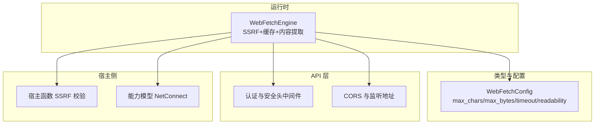
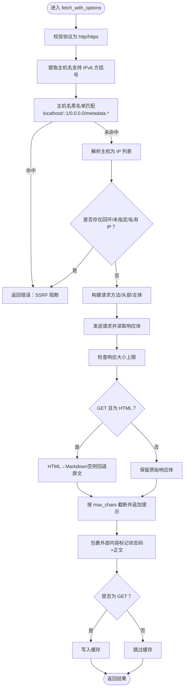
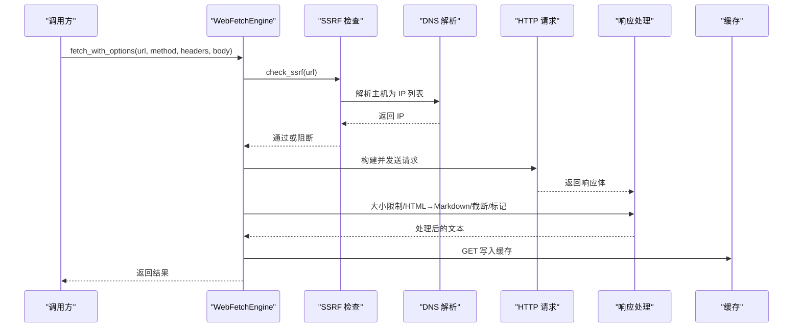
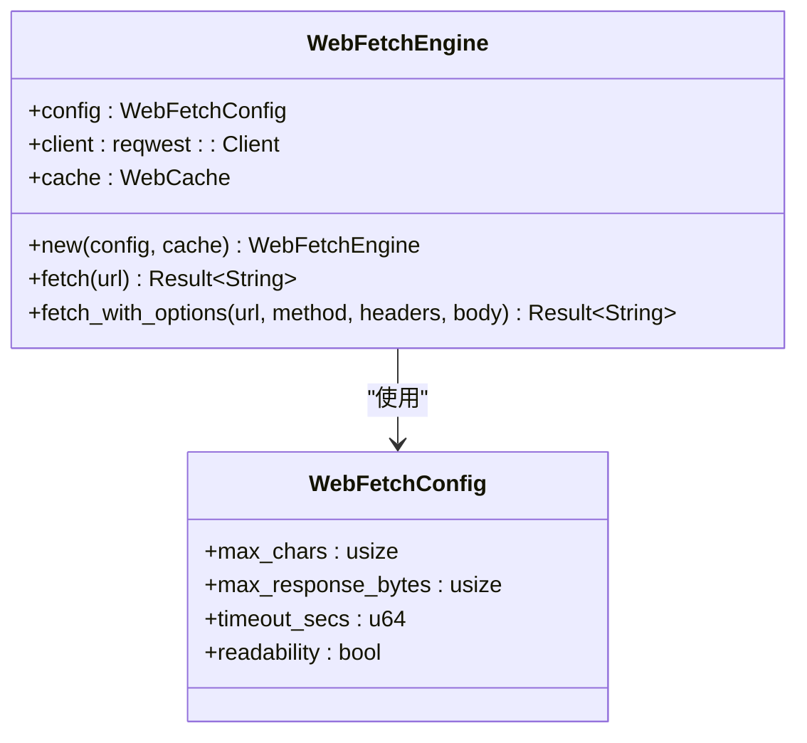
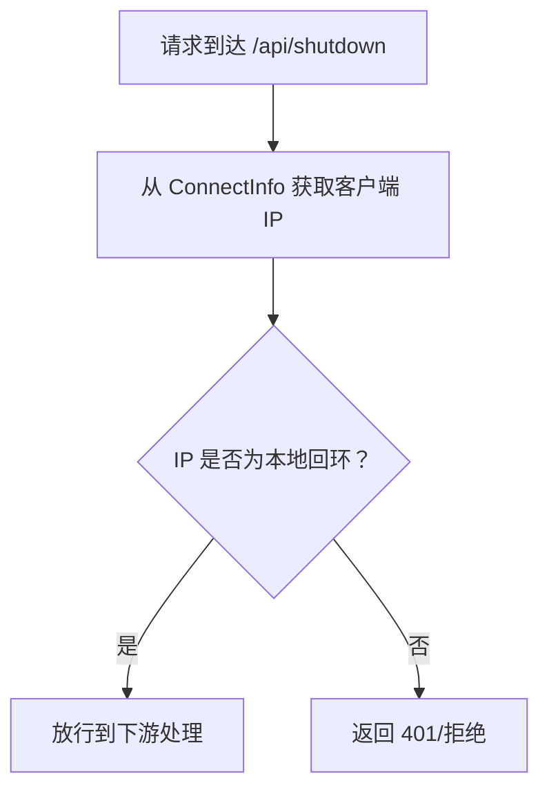
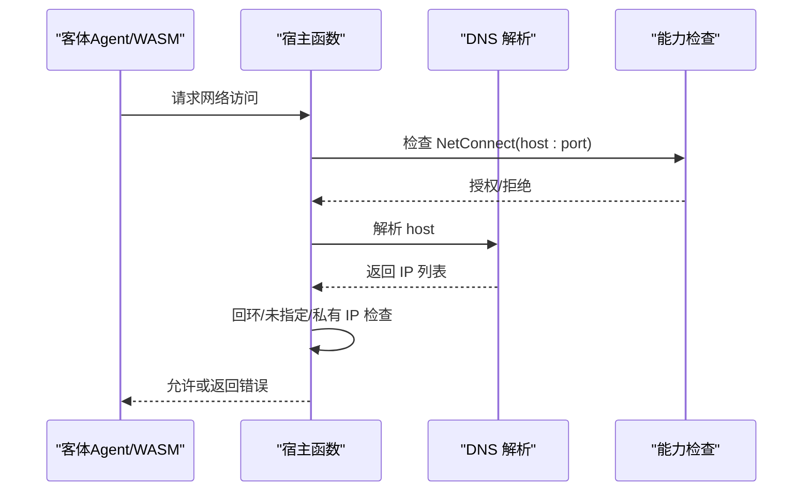
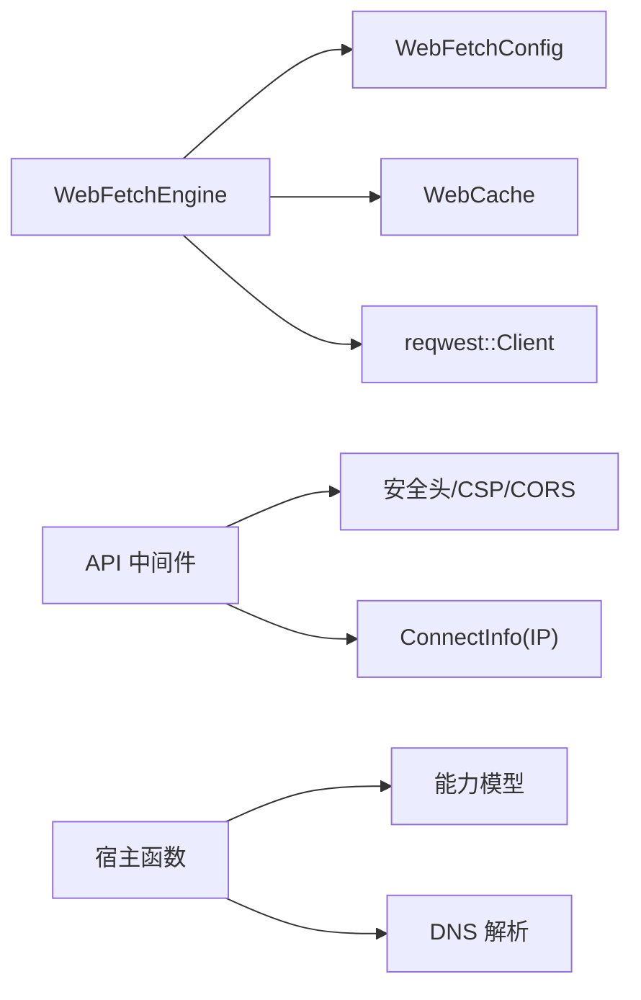

# 本地回环回退

<cite>
**本文引用的文件**
- [web_fetch.rs](file://crates/openfang-runtime/src/web_fetch.rs)
- [config.rs](file://crates/openfang-types/src/config.rs)
- [middleware.rs](file://crates/openfang-api/src/middleware.rs)
- [server.rs](file://crates/openfang-api/src/server.rs)
- [host_functions.rs](file://crates/openfang-runtime/src/host_functions.rs)
- [capability.rs](file://crates/openfang-types/src/capability.rs)
- [openfang.toml.example](file://openfang.toml.example)
</cite>

## 目录
1. [简介](#简介)
2. [项目结构与定位](#项目结构与定位)
3. [核心组件：WebFetch 引擎与 SSRF 防护](#核心组件webfetch-引擎与-ssrf-防护)
4. [架构总览](#架构总览)
5. [详细组件分析](#详细组件分析)
6. [依赖关系分析](#依赖关系分析)
7. [性能与安全权衡](#性能与安全权衡)
8. [故障排查指南](#故障排查指南)
9. [结论](#结论)
10. [附录：网络安全配置与访问控制策略](#附录网络安全配置与访问控制策略)

## 简介
本文件聚焦于“本地回环回退”的网络安全主题，系统性解析 openfang 在 web_fetch.rs 中对本地回环地址（127.0.0.1 与 ::1）的安全处理机制，涵盖：
- SSRF 检测与阻断策略
- 回退路径与访问控制
- 配置项与默认行为
- 实战场景与最佳实践

目标是帮助读者在理解实现细节的同时，掌握如何在生产环境中正确配置与使用该能力，以降低内网探测、元数据服务泄露与横向移动风险。

## 项目结构与定位
- web_fetch.rs 提供统一的网页抓取入口，内置 SSRF 阻断、缓存、内容提取与外部内容标记等能力。
- openfang-types 的 WebFetchConfig 定义了最大字符数、响应大小上限、超时与可选的 HTML→Markdown 转换开关。
- API 层 middleware.rs 与 server.rs 对本地回环访问进行限制与放行策略（如 /api/shutdown 仅允许本地回环），并与 CSP、CORS 等安全头协同。
- host_functions.rs 在宿主侧同样提供 SSRF 校验与能力检查，确保工具调用链路一致。
- capability.rs 定义了基于模式匹配的能力模型，用于细粒度的网络访问控制（NetConnect 等）。

**图表来源**
- [web_fetch.rs:15-167](file://crates/openfang-runtime/src/web_fetch.rs#L15-L167)
- [config.rs:284-307](file://crates/openfang-types/src/config.rs#L284-L307)
- [middleware.rs:60-259](file://crates/openfang-api/src/middleware.rs#L60-L259)
- [server.rs:50-104](file://crates/openfang-api/src/server.rs#L50-L104)
- [host_functions.rs:131-160](file://crates/openfang-runtime/src/host_functions.rs#L131-L160)
- [capability.rs:19-23](file://crates/openfang-types/src/capability.rs#L19-L23)

**章节来源**
- [web_fetch.rs:1-378](file://crates/openfang-runtime/src/web_fetch.rs#L1-L378)
- [config.rs:284-307](file://crates/openfang-types/src/config.rs#L284-L307)
- [middleware.rs:60-259](file://crates/openfang-api/src/middleware.rs#L60-L259)
- [server.rs:50-104](file://crates/openfang-api/src/server.rs#L50-L104)
- [host_functions.rs:131-160](file://crates/openfang-runtime/src/host_functions.rs#L131-L160)
- [capability.rs:19-23](file://crates/openfang-types/src/capability.rs#L19-L23)

## 核心组件：WebFetch 引擎与 SSRF 防护
- 入口方法 fetch_with_options 在发起网络请求前执行 SSRF 检查，确保 URL 不指向私有/内部网络资源（含 localhost、metadata 服务、0.0.0.0、IPv6 回环等）。
- 解析主机名后，对 DNS 解析结果逐一检查是否为回环、未指定或私有 IP（IPv4 私网段与 IPv6 ULA/Link-local）。
- 仅允许 http/https 协议；对非 GET 请求不进行 HTML→Markdown 转换，避免破坏 JSON/XML 响应。
- 支持缓存（仅 GET）、内容截断与外部内容标记，最后写入缓存（仅 GET）。

**图表来源**
- [web_fetch.rs:46-166](file://crates/openfang-runtime/src/web_fetch.rs#L46-L166)
- [web_fetch.rs:188-235](file://crates/openfang-runtime/src/web_fetch.rs#L188-L235)
- [web_fetch.rs:255-281](file://crates/openfang-runtime/src/web_fetch.rs#L255-L281)

**章节来源**
- [web_fetch.rs:46-166](file://crates/openfang-runtime/src/web_fetch.rs#L46-L166)
- [web_fetch.rs:188-235](file://crates/openfang-runtime/src/web_fetch.rs#L188-L235)
- [web_fetch.rs:255-281](file://crates/openfang-runtime/src/web_fetch.rs#L255-L281)

## 架构总览
- WebFetchEngine 作为统一抓取入口，串联 SSRF 检查、缓存、请求构建、响应处理与外部内容标记。
- API 层通过中间件与安全头，限制本地回环访问（如 /api/shutdown），并设置 CSP/CORS 以减少跨域风险。
- 宿主侧 host_functions.rs 同步执行 SSRF 校验与能力检查，保证工具调用链路一致。
- 能力模型 capability.rs 通过 NetConnect 等能力，对网络访问进行细粒度授权与模式匹配。

**图表来源**
- [web_fetch.rs:46-166](file://crates/openfang-runtime/src/web_fetch.rs#L46-L166)
- [host_functions.rs:271-291](file://crates/openfang-runtime/src/host_functions.rs#L271-L291)

**章节来源**
- [web_fetch.rs:46-166](file://crates/openfang-runtime/src/web_fetch.rs#L46-L166)
- [host_functions.rs:271-291](file://crates/openfang-runtime/src/host_functions.rs#L271-L291)

## 详细组件分析

### 组件一：WebFetchEngine 与 SSRF 检查
- 协议白名单：仅允许 http/https。
- 主机名黑名单：包含 localhost、ip6-localhost、metadata.*、0.0.0.0、::1、[::1] 等。
- DNS 解析后逐个检查 IP 是否为回环、未指定或私有 IP（IPv4 私网段与 IPv6 ULA/Link-local）。
- 非 GET 请求不进行 HTML→Markdown 转换，避免破坏 JSON/XML 响应。
- 缓存策略：仅对 GET 生效；响应大小与字符数上限受 WebFetchConfig 控制。

**图表来源**
- [web_fetch.rs:15-38](file://crates/openfang-runtime/src/web_fetch.rs#L15-L38)
- [config.rs:284-307](file://crates/openfang-types/src/config.rs#L284-L307)

**章节来源**
- [web_fetch.rs:15-38](file://crates/openfang-runtime/src/web_fetch.rs#L15-L38)
- [config.rs:284-307](file://crates/openfang-types/src/config.rs#L284-L307)

### 组件二：API 层的本地回环访问控制
- 认证中间件对特定端点（如 /api/shutdown）仅允许来自本地回环的连接，未知来源默认拒绝。
- 安全头中间件设置严格的 CSP，其中 connect-src 明确允许 ws://localhost:*、ws://127.0.0.1:*、wss://localhost:*、wss://127.0.0.1:*，以支持本地 WebSocket 连接。
- CORS 层在无 API Key 时默认仅允许 127.0.0.1 与 localhost 的常见开发端口，增强本地开发体验同时限制跨域风险。

**图表来源**
- [middleware.rs:70-81](file://crates/openfang-api/src/middleware.rs#L70-L81)
- [middleware.rs:240-245](file://crates/openfang-api/src/middleware.rs#L240-L245)
- [server.rs:56-104](file://crates/openfang-api/src/server.rs#L56-L104)

**章节来源**
- [middleware.rs:70-81](file://crates/openfang-api/src/middleware.rs#L70-L81)
- [middleware.rs:240-245](file://crates/openfang-api/src/middleware.rs#L240-L245)
- [server.rs:56-104](file://crates/openfang-api/src/server.rs#L56-L104)

### 组件三：宿主侧 SSRF 校验与能力检查
- 宿主函数在执行网络请求前，先进行 hostname 黑名单检查，再解析 DNS 并对每个 IP 进行回环/未指定/私有 IP 校验。
- 对 NetConnect 类能力进行模式匹配（支持通配符与前后缀），确保仅允许被授予的主机与端口。

**图表来源**
- [host_functions.rs:131-160](file://crates/openfang-runtime/src/host_functions.rs#L131-L160)
- [capability.rs:19-23](file://crates/openfang-types/src/capability.rs#L19-L23)

**章节来源**
- [host_functions.rs:131-160](file://crates/openfang-runtime/src/host_functions.rs#L131-L160)
- [capability.rs:19-23](file://crates/openfang-types/src/capability.rs#L19-L23)

## 依赖关系分析
- WebFetchEngine 依赖 WebFetchConfig 控制行为边界；依赖 WebCache 实现 GET 缓存。
- API 层中间件依赖 axum 的 ConnectInfo 获取客户端 IP，结合安全头与 CORS 策略。
- 宿主侧 host_functions.rs 与 capability.rs 协作，形成统一的能力与访问控制模型。

**图表来源**
- [web_fetch.rs:15-38](file://crates/openfang-runtime/src/web_fetch.rs#L15-L38)
- [config.rs:284-307](file://crates/openfang-types/src/config.rs#L284-L307)
- [middleware.rs:232-259](file://crates/openfang-api/src/middleware.rs#L232-L259)
- [server.rs:56-104](file://crates/openfang-api/src/server.rs#L56-L104)
- [host_functions.rs:131-160](file://crates/openfang-runtime/src/host_functions.rs#L131-L160)
- [capability.rs:19-23](file://crates/openfang-types/src/capability.rs#L19-L23)

**章节来源**
- [web_fetch.rs:15-38](file://crates/openfang-runtime/src/web_fetch.rs#L15-L38)
- [config.rs:284-307](file://crates/openfang-types/src/config.rs#L284-L307)
- [middleware.rs:232-259](file://crates/openfang-api/src/middleware.rs#L232-L259)
- [server.rs:56-104](file://crates/openfang-api/src/server.rs#L56-L104)
- [host_functions.rs:131-160](file://crates/openfang-runtime/src/host_functions.rs#L131-L160)
- [capability.rs:19-23](file://crates/openfang-types/src/capability.rs#L19-L23)

## 性能与安全权衡
- SSRF 检查在 DNS 解析阶段进行，避免不必要的网络往返；对 GET 请求启用缓存可显著降低重复抓取开销。
- 响应大小与字符数上限可防止大体积内容导致的内存压力与带宽占用。
- 可选的 HTML→Markdown 转换会引入额外处理成本，建议在需要纯文本摘要时开启。

[本节为通用指导，无需具体文件来源]

## 故障排查指南
- 抓取失败返回“SSRF blocked”：检查 URL 是否为 localhost、::1、0.0.0.0 或 metadata.*，或解析到私有/回环 IP。
- 响应过大被拒绝：调整 WebFetchConfig.max_response_bytes 或 max_chars。
- CORS/WS 连接异常：确认 connect-src 是否包含 ws/wss 的本地回环前缀，或检查 API Key 与 CORS 配置。
- 宿主侧能力不足：检查 NetConnect 能力授予是否覆盖目标主机与端口。

**章节来源**
- [web_fetch.rs:188-235](file://crates/openfang-runtime/src/web_fetch.rs#L188-L235)
- [config.rs:284-307](file://crates/openfang-types/src/config.rs#L284-L307)
- [middleware.rs:240-245](file://crates/openfang-api/src/middleware.rs#L240-L245)
- [server.rs:56-104](file://crates/openfang-api/src/server.rs#L56-L104)
- [capability.rs:19-23](file://crates/openfang-types/src/capability.rs#L19-L23)

## 结论
openfang 在 web_fetch.rs 中对本地回环与私有网络的访问进行了严格而一致的防护，结合 API 层的安全头与 CORS、宿主侧的能力模型与 SSRF 校验，形成了端到端的网络访问控制闭环。通过合理配置 WebFetchConfig 与 API Key/CORS，可在保障功能可用性的同时有效降低 SSRF 与内网探测风险。

[本节为总结，无需具体文件来源]

## 附录：网络安全配置与访问控制策略
- WebFetchConfig 默认值
  - 最大字符数：50,000
  - 最大响应字节数：10MB
  - 超时秒数：30
  - 可选的 HTML→Markdown 转换：开启
- API 层安全头
  - CSP connect-src 明确允许本地回环 WebSocket 连接
  - CORS 在无 API Key 时默认仅允许 127.0.0.1 与 localhost 的常见开发端口
- 本地回环访问控制
  - /api/shutdown 仅允许本地回环访问
  - 本地开发环境可使用 127.0.0.1:4200/8080 等端口
- 能力模型（NetConnect）
  - 使用通配符与前后缀模式精确授权网络访问范围
  - 通过父能力继承校验，防止子能力越权

**章节来源**
- [config.rs:284-307](file://crates/openfang-types/src/config.rs#L284-L307)
- [middleware.rs:240-245](file://crates/openfang-api/src/middleware.rs#L240-L245)
- [server.rs:56-104](file://crates/openfang-api/src/server.rs#L56-L104)
- [openfang.toml.example:5-6](file://openfang.toml.example#L5-L6)
- [capability.rs:19-23](file://crates/openfang-types/src/capability.rs#L19-L23)