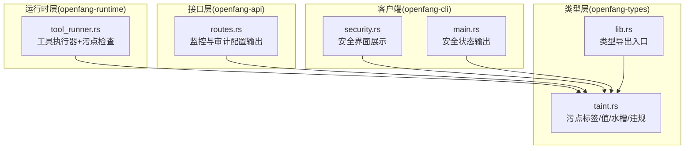
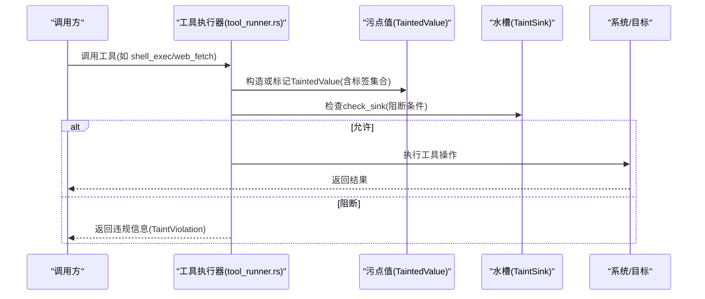
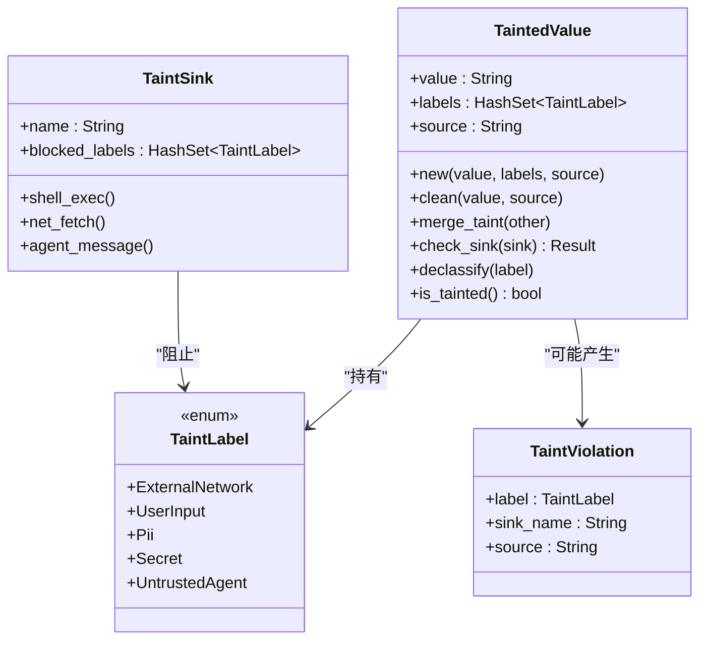
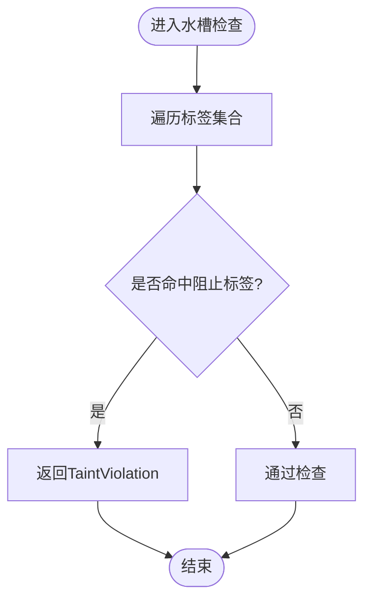
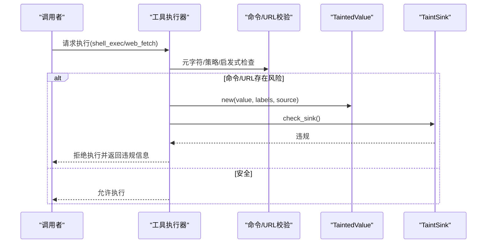
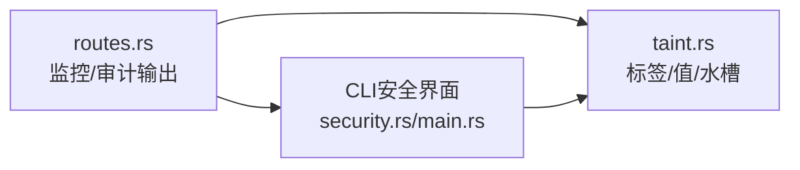
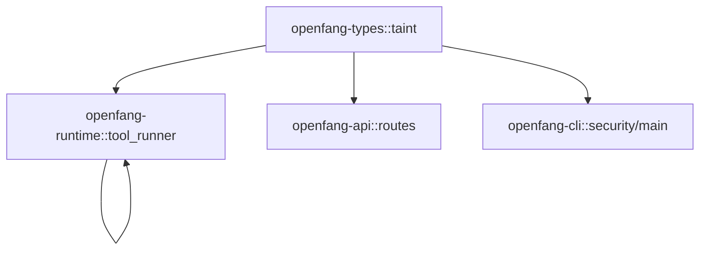

# 污点追踪系统

<cite>
**本文档引用的文件**
- [taint.rs](file://crates/openfang-types/src/taint.rs)
- [tool_runner.rs](file://crates/openfang-runtime/src/tool_runner.rs)
- [routes.rs](file://crates/openfang-api/src/routes.rs)
- [lib.rs](file://crates/openfang-types/src/lib.rs)
- [security.rs](file://crates/openfang-cli/src/tui/screens/security.rs)
- [main.rs](file://crates/openfang-cli/src/main.rs)
</cite>

## 目录
1. [简介](#简介)
2. [项目结构](#项目结构)
3. [核心组件](#核心组件)
4. [架构总览](#架构总览)
5. [详细组件分析](#详细组件分析)
6. [依赖关系分析](#依赖关系分析)
7. [性能考量](#性能考量)
8. [故障排查指南](#故障排查指南)
9. [结论](#结论)

## 简介
本文件面向污点追踪系统，聚焦于 openfang-types 中的 taint.rs 实现，系统性阐述污点标签与污点集的数据结构设计、外部数据源的污点标记策略、数据在系统中的传播机制以及信息流分析能力。同时结合运行时工具执行器（tool_runner.rs）中对污点检查的实际应用，解释技术原理与应用场景，并给出信息流安全策略与数据泄露防护方法。

## 项目结构
污点追踪相关代码主要分布在以下模块：
- 类型定义与工具：openfang-types/src/taint.rs
- 运行时工具执行与污点检查：openfang-runtime/src/tool_runner.rs
- API 层展示与配置：openfang-api/src/routes.rs
- CLI 安全状态展示：openfang-cli/src/tui/screens/security.rs 与 openfang-cli/src/main.rs
- 类型导出入口：openfang-types/src/lib.rs

**图表来源**
- [taint.rs:1-244](file://crates/openfang-types/src/taint.rs#L1-L244)
- [tool_runner.rs:1-526](file://crates/openfang-runtime/src/tool_runner.rs#L1-L526)
- [routes.rs:5810-5835](file://crates/openfang-api/src/routes.rs#L5810-L5835)
- [lib.rs:1-82](file://crates/openfang-types/src/lib.rs#L1-L82)
- [security.rs:72-107](file://crates/openfang-cli/src/tui/screens/security.rs#L72-L107)
- [main.rs:5750-5777](file://crates/openfang-cli/src/main.rs#L5750-L5777)

**章节来源**
- [taint.rs:1-244](file://crates/openfang-types/src/taint.rs#L1-L244)
- [tool_runner.rs:1-526](file://crates/openfang-runtime/src/tool_runner.rs#L1-L526)
- [routes.rs:5810-5835](file://crates/openfang-api/src/routes.rs#L5810-L5835)
- [lib.rs:1-82](file://crates/openfang-types/src/lib.rs#L1-L82)
- [security.rs:72-107](file://crates/openfang-cli/src/tui/screens/security.rs#L72-L107)
- [main.rs:5750-5777](file://crates/openfang-cli/src/main.rs#L5750-L5777)

## 核心组件
- 污点标签（TaintLabel）
  - 外部网络数据、用户输入、个人身份信息（PII）、密钥/令牌/密码等敏感材料、来自不受信任代理的数据。
- 污点值（TaintedValue）
  - 带有标签集合的字符串载体，记录来源，支持合并标签、检查流入水槽、降级标签（去污化）。
- 水槽（TaintSink）
  - 对特定敏感目的地的访问限制，定义被禁止进入的标签集合；提供 shell 执行、网络抓取、代理消息等常用水槽。
- 违规（TaintViolation）
  - 当标签违反水槽限制时返回的错误描述，包含标签、水槽名与来源。

这些组件共同构成基于格的污点传播模型，确保敏感数据无法未经显式去污化流向敏感目标。

**章节来源**
- [taint.rs:12-182](file://crates/openfang-types/src/taint.rs#L12-L182)

## 架构总览
污点追踪贯穿“类型层-运行时层-接口层-客户端层”，形成从数据进入系统到工具执行的端到端信息流保护：

**图表来源**
- [tool_runner.rs:21-75](file://crates/openfang-runtime/src/tool_runner.rs#L21-L75)
- [taint.rs:40-158](file://crates/openfang-types/src/taint.rs#L40-L158)

## 详细组件分析

### 组件一：污点标签与污点值
- 设计要点
  - 标签枚举覆盖外部来源、用户输入、PII、密钥、不受信任代理等关键类别。
  - 污点值包含三要素：载荷、标签集合、来源描述；支持标签合并、检查水槽、降级标签、判脏。
- 数据结构复杂度
  - 标签集合采用哈希集合，标签数量通常较小，传播与检查近似 O(k)，k 为标签数。
  - 合并标签为 O(k) 遍历插入。
- 错误处理
  - check_sink 返回 Result，遇到首个冲突即报错，便于快速定位违规来源。

**图表来源**
- [taint.rs:12-182](file://crates/openfang-types/src/taint.rs#L12-L182)

**章节来源**
- [taint.rs:12-182](file://crates/openfang-types/src/taint.rs#L12-L182)

### 组件二：水槽与违规
- 水槽策略
  - shell_exec：阻止外部网络、不受信任代理、用户输入，防止注入与混淆代理攻击。
  - net_fetch：阻止密钥/PII，防止数据外泄。
  - agent_message：阻止密钥，防止跨代理泄露。
- 违规描述
  - 包含标签、水槽名称与来源，便于审计与告警。

**图表来源**
- [taint.rs:83-98](file://crates/openfang-types/src/taint.rs#L83-L98)

**章节来源**
- [taint.rs:114-182](file://crates/openfang-types/src/taint.rs#L114-L182)

### 组件三：运行时中的污点检查流程
- shell_exec 工具
  - 先进行元字符注入检测，再根据执行策略决定是否启用启发式污点检查。
  - 若命令包含可疑模式，则以“外部网络”标签构造 TaintedValue 并检查 shell_exec 水槽。
- web_fetch/browser_navigate 工具
  - 在发起网络请求前，检查 URL 是否包含密钥/PII等敏感参数，若命中则以“密钥”标签构造 TaintedValue 并检查 net_fetch 水槽。
- 执行策略
  - 全量放行模式下跳过启发式污点检查，以满足手工代理等场景需求。

**图表来源**
- [tool_runner.rs:21-75](file://crates/openfang-runtime/src/tool_runner.rs#L21-L75)
- [tool_runner.rs:182-266](file://crates/openfang-runtime/src/tool_runner.rs#L182-L266)

**章节来源**
- [tool_runner.rs:21-75](file://crates/openfang-runtime/src/tool_runner.rs#L21-L75)
- [tool_runner.rs:182-266](file://crates/openfang-runtime/src/tool_runner.rs#L182-L266)

### 组件四：系统集成与可视化
- API 层
  - 监控与审计接口输出开启的跟踪项与受追踪标签列表，体现系统对信息流标签的可见性。
- CLI 层
  - 安全界面与状态输出明确展示“信息流标签”作为核心安全特性之一。

**图表来源**
- [routes.rs:5810-5835](file://crates/openfang-api/src/routes.rs#L5810-L5835)
- [security.rs:72-107](file://crates/openfang-cli/src/tui/screens/security.rs#L72-L107)
- [main.rs:5750-5777](file://crates/openfang-cli/src/main.rs#L5750-L5777)
- [taint.rs:12-182](file://crates/openfang-types/src/taint.rs#L12-L182)

**章节来源**
- [routes.rs:5810-5835](file://crates/openfang-api/src/routes.rs#L5810-L5835)
- [security.rs:72-107](file://crates/openfang-cli/src/tui/screens/security.rs#L72-L107)
- [main.rs:5750-5777](file://crates/openfang-cli/src/main.rs#L5750-L5777)

## 依赖关系分析
- 类型层
  - openfang-types 提供 TaintLabel/TaintedValue/TaintSink/TaintViolation 的定义与导出。
- 运行时层
  - openfang-runtime 引入 openfang_types::taint，并在工具执行路径中使用污点检查函数与水槽策略。
- 接口与客户端层
  - openfang-api 输出监控配置，openfang-cli 展示安全状态，二者均体现对“信息流标签”的支持。

**图表来源**
- [lib.rs](file://crates/openfang-types/src/lib.rs#L20)
- [tool_runner.rs](file://crates/openfang-runtime/src/tool_runner.rs#L10)
- [routes.rs:5810-5835](file://crates/openfang-api/src/routes.rs#L5810-L5835)
- [security.rs:72-107](file://crates/openfang-cli/src/tui/screens/security.rs#L72-L107)
- [main.rs:5750-5777](file://crates/openfang-cli/src/main.rs#L5750-L5777)

**章节来源**
- [lib.rs:1-82](file://crates/openfang-types/src/lib.rs#L1-L82)
- [tool_runner.rs:1-526](file://crates/openfang-runtime/src/tool_runner.rs#L1-L526)
- [routes.rs:5810-5835](file://crates/openfang-api/src/routes.rs#L5810-L5835)
- [security.rs:72-107](file://crates/openfang-cli/src/tui/screens/security.rs#L72-L107)
- [main.rs:5750-5777](file://crates/openfang-cli/src/main.rs#L5750-L5777)

## 性能考量
- 标签集合规模小且固定，check_sink 与 merge_taint 时间复杂度近似 O(k)，k 为标签数，整体开销可忽略。
- 启发式污点检查仅在非全量放行策略下触发，避免对高权限代理造成不必要的性能负担。
- 建议
  - 将常见启发式模式预编译为高效匹配结构，减少字符串扫描成本。
  - 对高频工具调用可考虑缓存已知安全来源的标签状态，降低重复计算。

## 故障排查指南
- 常见问题
  - shell_exec 被拒绝：命令包含可疑模式或命中外部网络标签。
  - 网络请求被拒绝：URL 参数包含密钥/PII。
  - 全量放行策略下仍被拒绝：命令包含 shell 元字符，该类风险始终阻断。
- 排查步骤
  - 查看工具调用输入，确认是否存在外部来源或敏感参数。
  - 检查执行策略（allowlist/deny/full），必要时调整策略或显式去污化。
  - 使用 API/CLI 的安全状态输出核对“信息流标签”是否按预期开启。
- 相关实现参考
  - 污点检查函数与工具执行逻辑位于运行时工具执行器。
  - API 层输出监控配置，CLI 展示安全状态。

**章节来源**
- [tool_runner.rs:21-75](file://crates/openfang-runtime/src/tool_runner.rs#L21-L75)
- [tool_runner.rs:182-266](file://crates/openfang-runtime/src/tool_runner.rs#L182-L266)
- [routes.rs:5810-5835](file://crates/openfang-api/src/routes.rs#L5810-L5835)
- [security.rs:72-107](file://crates/openfang-cli/src/tui/screens/security.rs#L72-L107)
- [main.rs:5750-5777](file://crates/openfang-cli/src/main.rs#L5750-L5777)

## 结论
本污点追踪系统以轻量的标签与水槽模型实现了对敏感数据的细粒度控制，有效防范注入与数据外泄等风险。通过在运行时工具执行器中嵌入启发式与策略驱动的检查，系统在保证安全性的同时兼顾了灵活性。建议在生产环境中持续监控“信息流标签”的运行状态，配合显式的去污化流程与策略调整，构建稳健的信息流安全防线。