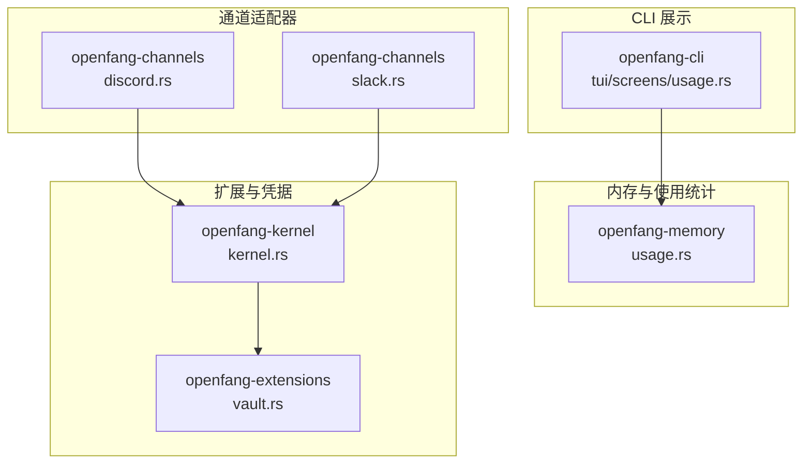
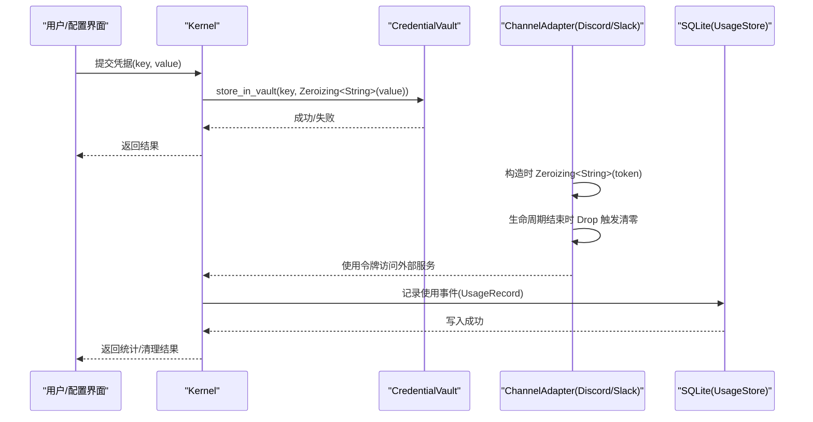
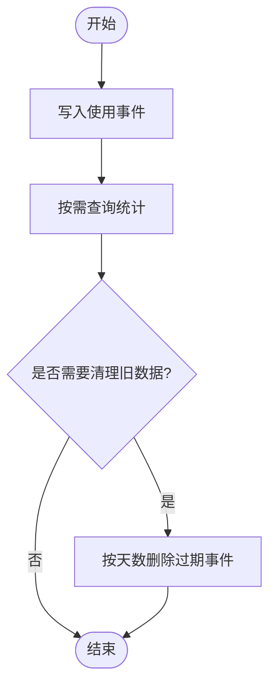
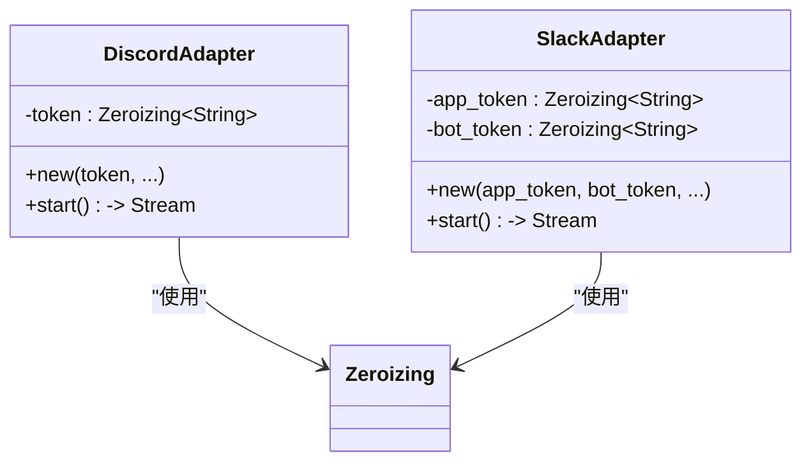
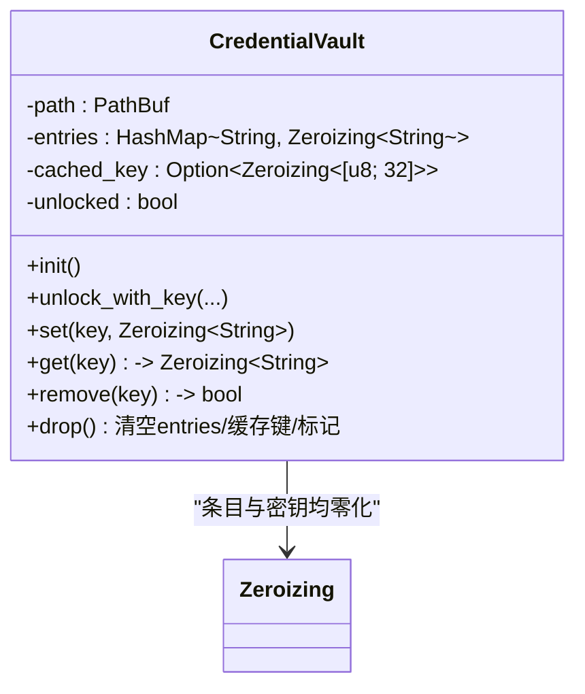
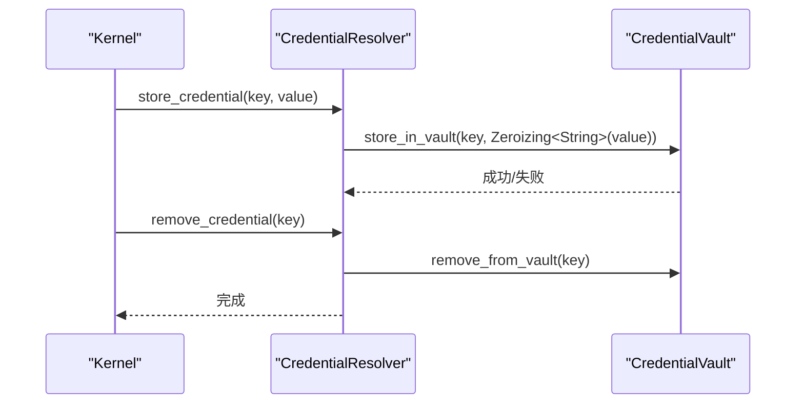
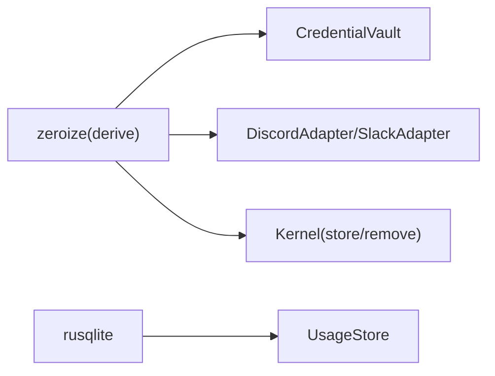

# 秘密零化

<cite>
**本文引用的文件**
- [usage.rs](file://crates/openfang-memory/src/usage.rs)
- [usage.rs](file://crates/openfang-cli/src/tui/screens/usage.rs)
- [discord.rs](file://crates/openfang-channels/src/discord.rs)
- [slack.rs](file://crates/openfang-channels/src/slack.rs)
- [vault.rs](file://crates/openfang-extensions/src/vault.rs)
- [kernel.rs](file://crates/openfang-kernel/src/kernel.rs)
- [Cargo.toml](file://Cargo.toml)
- [README.md](file://README.md)
</cite>

## 目录
1. [简介](#简介)
2. [项目结构](#项目结构)
3. [核心组件](#核心组件)
4. [架构总览](#架构总览)
5. [详细组件分析](#详细组件分析)
6. [依赖分析](#依赖分析)
7. [性能考虑](#性能考虑)
8. [故障排查指南](#故障排查指南)
9. [结论](#结论)
10. [附录](#附录)

## 简介
本文件聚焦“秘密零化”（Secret Zeroization）在系统中的实现与实践，围绕 openfang-memory 的 usage 记录存储与 openfang-channels、openfang-extensions、openfang-kernel 等模块对敏感凭据的生命周期管理展开。重点说明以下内容：
- usage.rs 中的敏感数据清理机制：如何在记录写入后及时清除、避免内存残留；以及在数据库层面对历史数据的清理策略。
- 秘密零化的安全重要性与实现原理：基于 zeroize 的自动清零语义、Drop 钩子触发的内存擦除、以及在凭据存储与传输链路中的零化策略。
- 敏感数据处理与内存安全最佳实践：从输入到落库再到清理的全生命周期安全控制。

## 项目结构
与“秘密零化”直接相关的模块分布如下：
- openfang-memory：提供 SQLite 使用量记录的持久化与查询，并支持按时间窗口清理旧数据。
- openfang-channels：在适配器内部使用 Zeroizing 包装敏感令牌，在生命周期结束时自动清零。
- openfang-extensions：凭据保险库（CredentialVault）使用 Zeroizing 存储密钥值，确保在 Drop 时清空内存。
- openfang-kernel：在运行时将凭据存入保险库并进行移除操作，调用零化包装类型以降低泄露风险。
- openfang-cli：TUI 展示层，不涉及敏感数据的存储或零化逻辑。

**图表来源**
- [usage.rs:1-542](file://crates/openfang-memory/src/usage.rs#L1-L542)
- [discord.rs:30-229](file://crates/openfang-channels/src/discord.rs#L30-L229)
- [slack.rs:20-219](file://crates/openfang-channels/src/slack.rs#L20-L219)
- [vault.rs:390-589](file://crates/openfang-extensions/src/vault.rs#L390-L589)
- [kernel.rs:4600-4799](file://crates/openfang-kernel/src/kernel.rs#L4600-L4799)
- [usage.rs:1-448](file://crates/openfang-cli/src/tui/screens/usage.rs#L1-L448)

**章节来源**
- [usage.rs:1-542](file://crates/openfang-memory/src/usage.rs#L1-L542)
- [discord.rs:30-229](file://crates/openfang-channels/src/discord.rs#L30-L229)
- [slack.rs:20-219](file://crates/openfang-channels/src/slack.rs#L20-L219)
- [vault.rs:390-589](file://crates/openfang-extensions/src/vault.rs#L390-L589)
- [kernel.rs:4600-4799](file://crates/openfang-kernel/src/kernel.rs#L4600-L4799)
- [usage.rs:1-448](file://crates/openfang-cli/src/tui/screens/usage.rs#L1-L448)

## 核心组件
- openfang-memory 的 UsageStore：负责记录 LLM 使用事件、聚合统计、按天/小时/月查询成本，并提供清理过期数据的能力。该模块本身不直接处理敏感凭据，但其清理策略可作为“历史敏感数据”的参考模式。
- openfang-channels 的 DiscordAdapter/SlackAdapter：在构造阶段使用 Zeroizing<String> 包装令牌，确保对象生命周期结束时自动清零，防止内存转储或堆栈扫描导致的泄露。
- openfang-extensions 的 CredentialVault：以加密文件形式保存凭据，内部以 Zeroizing<String> 存储条目值，Drop 时清空内存并清理缓存，避免明文残留在内存中。
- openfang-kernel：在运行时将凭据写入保险库并移除，调用零化包装类型，减少凭据在内存中的暴露窗口。
- openfang-cli 的 Usage 展示：仅负责展示统计信息，不涉及敏感数据处理。

**章节来源**
- [usage.rs:70-352](file://crates/openfang-memory/src/usage.rs#L70-L352)
- [discord.rs:36-77](file://crates/openfang-channels/src/discord.rs#L36-L77)
- [slack.rs:25-69](file://crates/openfang-channels/src/slack.rs#L25-L69)
- [vault.rs:55-65](file://crates/openfang-extensions/src/vault.rs#L55-L65)
- [kernel.rs:4602-4625](file://crates/openfang-kernel/src/kernel.rs#L4602-L4625)
- [usage.rs:1-200](file://crates/openfang-cli/src/tui/screens/usage.rs#L1-L200)

## 架构总览
下图展示了“秘密零化”在系统中的端到端流程：从凭据进入内核、写入保险库、到通道适配器使用零化令牌、再到内存使用统计的清理策略。

**图表来源**
- [kernel.rs:4602-4625](file://crates/openfang-kernel/src/kernel.rs#L4602-L4625)
- [vault.rs:390-589](file://crates/openfang-extensions/src/vault.rs#L390-L589)
- [discord.rs:36-77](file://crates/openfang-channels/src/discord.rs#L36-L77)
- [slack.rs:25-69](file://crates/openfang-channels/src/slack.rs#L25-L69)
- [usage.rs:82-106](file://crates/openfang-memory/src/usage.rs#L82-L106)

## 详细组件分析

### openfang-memory 的 UsageStore 与敏感数据清理
- 数据写入：记录 LLM 使用事件时，将模型名、令牌数、费用等非敏感字段写入数据库，不包含任何敏感凭据。
- 查询与统计：提供按小时/日/月的成本汇总、按模型分组统计、按天分解等查询接口。
- 历史清理：提供按天数删除过期事件的功能，避免历史数据长期驻留数据库，降低泄露面。

**图表来源**
- [usage.rs:82-106](file://crates/openfang-memory/src/usage.rs#L82-L106)
- [usage.rs:336-351](file://crates/openfang-memory/src/usage.rs#L336-L351)

**章节来源**
- [usage.rs:70-352](file://crates/openfang-memory/src/usage.rs#L70-L352)

### openfang-channels 的秘密零化（Discord/Slack）
- 构造阶段：将令牌封装为 Zeroizing<String>，确保在构造时即处于受控状态。
- 使用阶段：通过引用透明的方式传递令牌，避免复制到其他位置。
- 生命周期结束：对象 Drop 时自动触发清零，防止内存残留。

**图表来源**
- [discord.rs:36-77](file://crates/openfang-channels/src/discord.rs#L36-L77)
- [slack.rs:25-69](file://crates/openfang-channels/src/slack.rs#L25-L69)

**章节来源**
- [discord.rs:36-136](file://crates/openfang-channels/src/discord.rs#L36-L136)
- [slack.rs:25-134](file://crates/openfang-channels/src/slack.rs#L25-L134)

### openfang-extensions 的 CredentialVault 与零化
- 结构设计：以 HashMap<String, Zeroizing<String>> 存储密钥值，确保每个条目在 Drop 时被清零。
- 生命周期：Drop 时清空 entries、清理缓存密钥、标记未解锁，避免任何明文残留。
- 密钥派生：使用 Argon2id 派生 256 位密钥，派生过程中同样使用 Zeroizing 保护中间态。

**图表来源**
- [vault.rs:55-65](file://crates/openfang-extensions/src/vault.rs#L55-L65)
- [vault.rs:390-398](file://crates/openfang-extensions/src/vault.rs#L390-L398)
- [vault.rs:400-407](file://crates/openfang-extensions/src/vault.rs#L400-L407)

**章节来源**
- [vault.rs:55-65](file://crates/openfang-extensions/src/vault.rs#L55-L65)
- [vault.rs:390-398](file://crates/openfang-extensions/src/vault.rs#L390-L398)
- [vault.rs:400-407](file://crates/openfang-extensions/src/vault.rs#L400-L407)

### openfang-kernel 的凭据存储与移除
- 存储：将凭据写入保险库时使用 Zeroizing<String> 包装，避免在内存中长期持有明文。
- 移除：从保险库移除凭据并清理内存缓存，确保不再返回过期值。
- 运行时注入：在启动 MCP 等场景前，先解析并注入环境变量，再执行子进程，减少凭据暴露。

**图表来源**
- [kernel.rs:4602-4625](file://crates/openfang-kernel/src/kernel.rs#L4602-L4625)
- [kernel.rs:4791-4799](file://crates/openfang-kernel/src/kernel.rs#L4791-L4799)

**章节来源**
- [kernel.rs:4602-4625](file://crates/openfang-kernel/src/kernel.rs#L4602-L4625)
- [kernel.rs:4791-4799](file://crates/openfang-kernel/src/kernel.rs#L4791-L4799)

### openfang-cli 的 Usage 展示层
- 职责：渲染使用量统计、按模型/按代理的明细，不涉及敏感数据处理。
- 交互：支持切换视图、刷新数据、键盘导航等。

**章节来源**
- [usage.rs:1-200](file://crates/openfang-cli/src/tui/screens/usage.rs#L1-L200)

## 依赖分析
- zeroize：用于自动清零敏感字符串，广泛应用于凭据包装与 Drop 钩子。
- rusqlite：用于 openfang-memory 的 SQLite 访问，不直接处理敏感凭据。
- 其他安全依赖：sha2、Argon2、AES-GCM 等用于加密与密钥派生，但与“秘密零化”直接相关的是 zeroize 的使用。

**图表来源**
- [Cargo.toml:100-111](file://Cargo.toml#L100-L111)
- [vault.rs:390-398](file://crates/openfang-extensions/src/vault.rs#L390-L398)
- [discord.rs:36-77](file://crates/openfang-channels/src/discord.rs#L36-L77)
- [slack.rs:25-69](file://crates/openfang-channels/src/slack.rs#L25-L69)
- [kernel.rs:4602-4625](file://crates/openfang-kernel/src/kernel.rs#L4602-L4625)
- [usage.rs:82-106](file://crates/openfang-memory/src/usage.rs#L82-L106)

**章节来源**
- [Cargo.toml:100-111](file://Cargo.toml#L100-L111)

## 性能考虑
- 零化开销：Zeroizing 的清零操作通常为常数时间，且由系统调用保障内存擦除，对性能影响极小。
- 数据库清理：按天删除过期事件属于批量 DML，建议在低峰时段执行，避免对在线查询造成抖动。
- 凭据存储：保险库的加解密与密钥派生会带来额外 CPU 开销，但这是必要的安全成本。

## 故障排查指南
- 凭据未清零
  - 检查是否使用 Zeroizing 包装敏感字符串。
  - 确认对象生命周期结束（如函数返回、作用域退出）后是否触发 Drop。
  - 参考路径：[discord.rs:36-77](file://crates/openfang-channels/src/discord.rs#L36-L77)、[slack.rs:25-69](file://crates/openfang-channels/src/slack.rs#L25-L69)、[vault.rs:390-398](file://crates/openfang-extensions/src/vault.rs#L390-L398)。
- 保险库无法解锁/读取失败
  - 核对主密钥是否正确，确认密钥派生与解密流程。
  - 参考路径：[vault.rs:400-407](file://crates/openfang-extensions/src/vault.rs#L400-L407)。
- 使用统计异常
  - 检查数据库连接与事务，确认清理策略未误删近期数据。
  - 参考路径：[usage.rs:82-106](file://crates/openfang-memory/src/usage.rs#L82-L106)、[usage.rs:336-351](file://crates/openfang-memory/src/usage.rs#L336-L351)。
- 运行时凭据未生效
  - 确认凭据已写入保险库并清理了内存缓存。
  - 参考路径：[kernel.rs:4602-4625](file://crates/openfang-kernel/src/kernel.rs#L4602-L4625)。

**章节来源**
- [discord.rs:36-77](file://crates/openfang-channels/src/discord.rs#L36-L77)
- [slack.rs:25-69](file://crates/openfang-channels/src/slack.rs#L25-L69)
- [vault.rs:390-398](file://crates/openfang-extensions/src/vault.rs#L390-L398)
- [usage.rs:82-106](file://crates/openfang-memory/src/usage.rs#L82-L106)
- [usage.rs:336-351](file://crates/openfang-memory/src/usage.rs#L336-L351)
- [kernel.rs:4602-4625](file://crates/openfang-kernel/src/kernel.rs#L4602-L4625)

## 结论
- “秘密零化”通过在对象生命周期结束时自动清零敏感数据，显著降低了凭据泄露的风险。
- openfang 在多个层面实现了零化：通道适配器的令牌包装、保险库的条目与密钥清零、内核的凭据存储与移除。
- openfang-memory 的清理策略为历史敏感数据提供了参考：定期删除过期事件，缩短暴露窗口。
- 实践建议：所有敏感输入均应使用 Zeroizing 包装；在不再需要时立即丢弃；清理策略应结合业务周期与合规要求制定。

## 附录
- 安全系统概览（含“Secret Zeroization”）：参见 [README.md:206-227](file://README.md#L206-L227)。