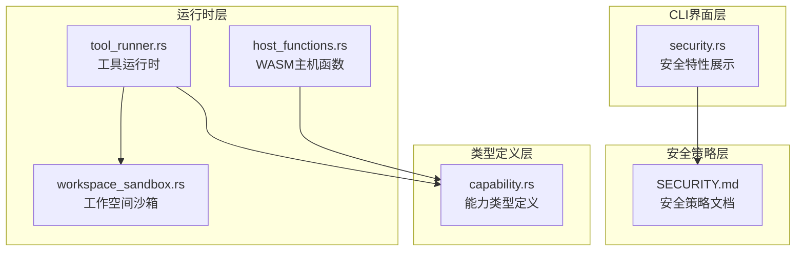
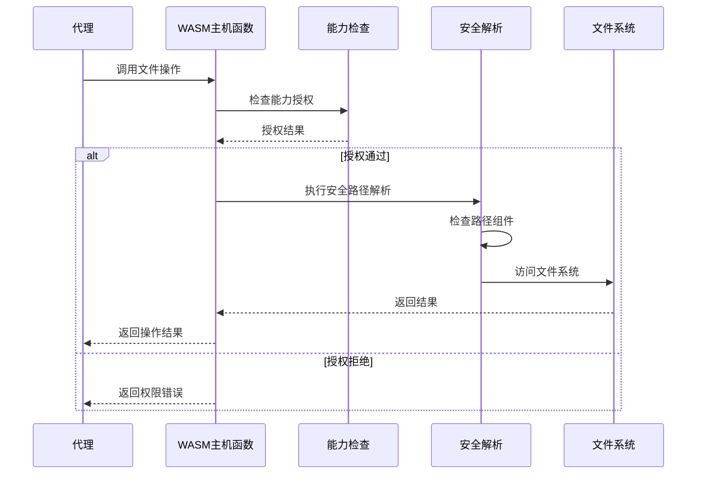
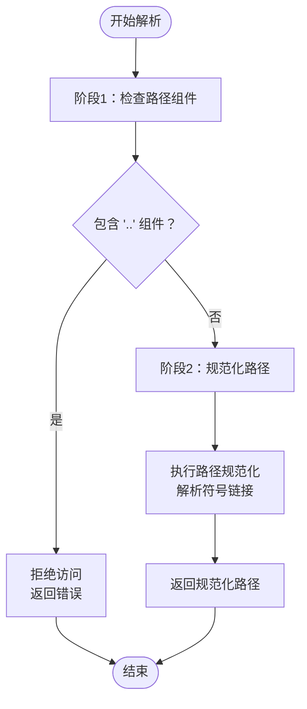
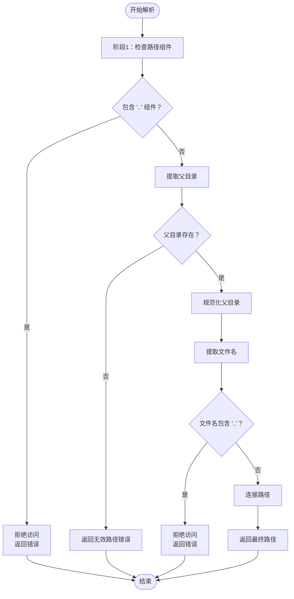
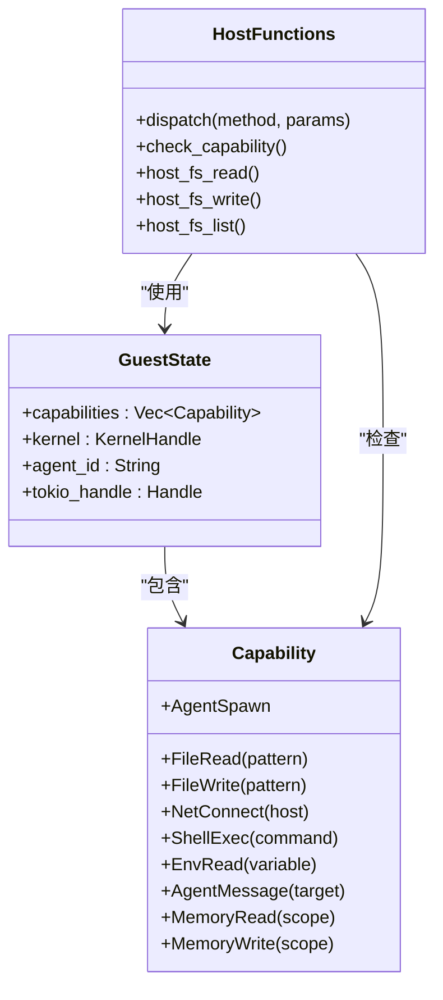
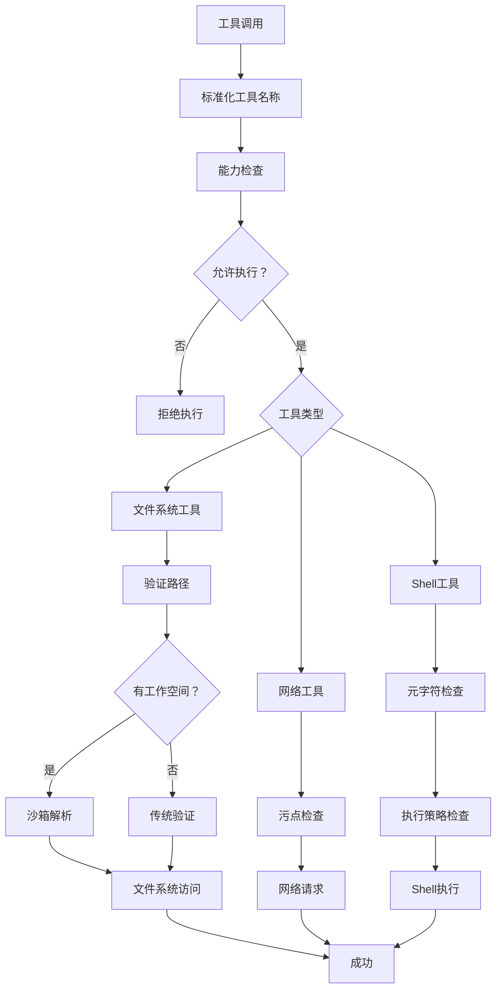
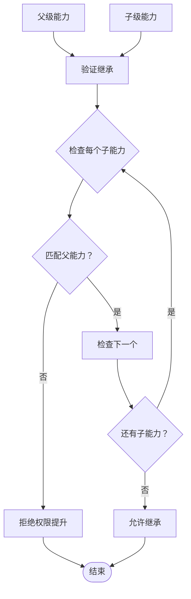
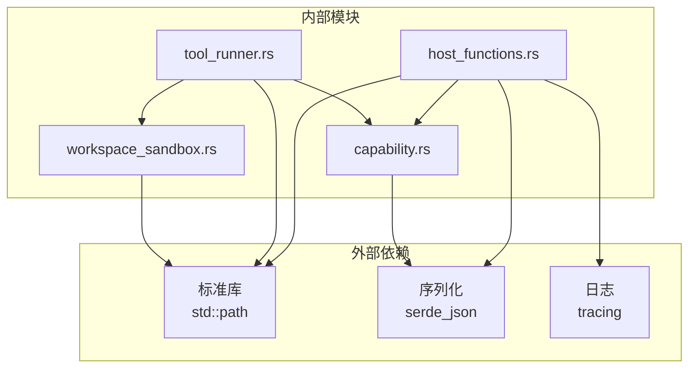

# 路径遍历防护

<cite>
**本文档引用的文件**
- [host_functions.rs](file://crates/openfang-runtime/src/host_functions.rs)
- [tool_runner.rs](file://crates/openfang-runtime/src/tool_runner.rs)
- [workspace_sandbox.rs](file://crates/openfang-runtime/src/workspace_sandbox.rs)
- [capability.rs](file://crates/openfang-types/src/capability.rs)
- [security.rs](file://crates/openfang-cli/src/tui/screens/security.rs)
- [SECURITY.md](file://SECURITY.md)
</cite>

## 目录
1. [简介](#简介)
2. [项目结构](#项目结构)
3. [核心组件](#核心组件)
4. [架构概览](#架构概览)
5. [详细组件分析](#详细组件分析)
6. [依赖关系分析](#依赖关系分析)
7. [性能考虑](#性能考虑)
8. [故障排除指南](#故障排除指南)
9. [结论](#结论)
10. [附录](#附录)

## 简介

OpenFang 实现了多层次的路径遍历防护机制，确保在 WASM 主机函数、工具运行时和工作空间沙箱中都能有效防止目录遍历攻击。本文档深入分析 safe_resolve_path() 和 safe_resolve_parent() 函数如何防止目录遍历攻击，包括 WASM 主机函数中的路径验证、工具运行时的路径遍历检查和能力检查前置机制。

## 项目结构

OpenFang 的路径安全防护主要分布在以下关键模块中：

**图表来源**
- [host_functions.rs:1-669](file://crates/openfang-runtime/src/host_functions.rs#L1-L669)
- [tool_runner.rs:1-3989](file://crates/openfang-runtime/src/tool_runner.rs#L1-L3989)
- [workspace_sandbox.rs:1-148](file://crates/openfang-runtime/src/workspace_sandbox.rs#L1-L148)

**章节来源**
- [host_functions.rs:1-669](file://crates/openfang-runtime/src/host_functions.rs#L1-L669)
- [tool_runner.rs:1-3989](file://crates/openfang-runtime/src/tool_runner.rs#L1-L3989)
- [workspace_sandbox.rs:1-148](file://crates/openfang-runtime/src/workspace_sandbox.rs#L1-L148)

## 核心组件

### 安全路径解析函数

OpenFang 实现了两个核心的安全路径解析函数：

1. **safe_resolve_path()** - 用于读取操作的安全路径解析
2. **safe_resolve_parent()** - 用于写入操作的安全父目录解析

这两个函数构成了路径遍历防护的核心防线。

### 能力检查机制

所有主机函数调用都必须通过能力检查，这是防止权限滥用的重要前置机制。

### 工作空间沙箱

提供额外的文件系统访问控制，确保所有文件操作都在指定的工作空间范围内进行。

**章节来源**
- [host_functions.rs:73-117](file://crates/openfang-runtime/src/host_functions.rs#L73-L117)
- [capability.rs:100-166](file://crates/openfang-types/src/capability.rs#L100-L166)
- [workspace_sandbox.rs:8-69](file://crates/openfang-runtime/src/workspace_sandbox.rs#L8-L69)

## 架构概览

**图表来源**
- [host_functions.rs:19-49](file://crates/openfang-runtime/src/host_functions.rs#L19-L49)
- [host_functions.rs:57-67](file://crates/openfang-runtime/src/host_functions.rs#L57-L67)
- [host_functions.rs:73-117](file://crates/openfang-runtime/src/host_functions.rs#L73-L117)

## 详细组件分析

### WASM 主机函数中的路径验证

#### safe_resolve_path() 实现分析

safe_resolve_path() 函数实现了两阶段的安全验证：

**图表来源**
- [host_functions.rs:75-87](file://crates/openfang-runtime/src/host_functions.rs#L75-L87)

#### safe_resolve_parent() 实现分析

safe_resolve_parent() 函数专门处理写入操作，提供了更严格的安全检查：

**图表来源**
- [host_functions.rs:90-117](file://crates/openfang-runtime/src/host_functions.rs#L90-L117)

#### 能力检查前置机制

所有主机函数都实现了统一的能力检查模式：

**图表来源**
- [capability.rs:12-72](file://crates/openfang-types/src/capability.rs#L12-L72)
- [host_functions.rs:19-49](file://crates/openfang-runtime/src/host_functions.rs#L19-L49)
- [host_functions.rs:57-67](file://crates/openfang-runtime/src/host_functions.rs#L57-L67)

**章节来源**
- [host_functions.rs:19-117](file://crates/openfang-runtime/src/host_functions.rs#L19-L117)
- [capability.rs:100-187](file://crates/openfang-types/src/capability.rs#L100-L187)

### 工具运行时的路径遍历检查

#### 工具运行器中的路径安全策略

工具运行器实现了多层路径安全检查：

**图表来源**
- [tool_runner.rs:99-174](file://crates/openfang-runtime/src/tool_runner.rs#L99-L174)
- [tool_runner.rs:1256-1274](file://crates/openfang-runtime/src/tool_runner.rs#L1256-L1274)

#### 工作空间沙箱机制

工作空间沙箱提供了额外的文件系统访问控制：

**章节来源**
- [tool_runner.rs:1256-1336](file://crates/openfang-runtime/src/tool_runner.rs#L1256-L1336)
- [workspace_sandbox.rs:8-69](file://crates/openfang-runtime/src/workspace_sandbox.rs#L8-L69)

### 能力继承和权限控制

#### 能力继承验证

能力继承机制防止权限提升：

**图表来源**
- [capability.rs:171-187](file://crates/openfang-types/src/capability.rs#L171-L187)

**章节来源**
- [capability.rs:168-187](file://crates/openfang-types/src/capability.rs#L168-L187)

## 依赖关系分析

**图表来源**
- [host_functions.rs:9-14](file://crates/openfang-runtime/src/host_functions.rs#L9-L14)
- [tool_runner.rs:6-16](file://crates/openfang-runtime/src/tool_runner.rs#L6-L16)
- [workspace_sandbox.rs:6](file://crates/openfang-runtime/src/workspace_sandbox.rs#L6)

**章节来源**
- [host_functions.rs:9-14](file://crates/openfang-runtime/src/host_functions.rs#L9-L14)
- [tool_runner.rs:6-16](file://crates/openfang-runtime/src/tool_runner.rs#L6-L16)
- [workspace_sandbox.rs:6](file://crates/openfang-runtime/src/workspace_sandbox.rs#L6)

## 性能考虑

### 路径解析性能优化

1. **早期拒绝**：在执行昂贵的文件系统操作之前先进行快速的路径组件检查
2. **最小化规范化**：只在必要时执行路径规范化操作
3. **缓存友好的设计**：避免不必要的文件系统查询

### 内存使用优化

1. **零拷贝字符串处理**：使用引用而非所有权转移
2. **按需分配**：只在确定路径有效时才分配额外内存
3. **错误处理优化**：快速失败减少资源浪费

## 故障排除指南

### 常见路径遍历攻击场景

1. **基本遍历攻击**：`../../../etc/passwd`
2. **相对路径攻击**：`../config/app.toml`
3. **符号链接攻击**：通过符号链接逃逸工作空间

### 调试技巧

1. **启用详细日志**：检查路径解析过程中的每一步
2. **验证能力配置**：确认代理是否具有正确的文件系统能力
3. **测试边界条件**：验证各种路径格式的处理

**章节来源**
- [host_functions.rs:608-620](file://crates/openfang-runtime/src/host_functions.rs#L608-L620)
- [tool_runner.rs:3395-3471](file://crates/openfang-runtime/src/tool_runner.rs#L3395-L3471)

## 结论

OpenFang 的路径遍历防护体系通过多层防御机制确保了系统的安全性：

1. **前置能力检查**：所有操作都必须通过能力验证
2. **严格路径解析**：safe_resolve_path() 和 safe_resolve_parent() 提供双重保护
3. **工作空间隔离**：额外的文件系统访问控制
4. **能力继承验证**：防止权限提升攻击

这些措施共同构建了一个健壮的路径安全防护体系，有效防止了各种类型的目录遍历攻击。

## 附录

### 最佳实践指南

1. **始终使用安全解析函数**：不要直接使用用户提供的路径
2. **最小权限原则**：只授予必要的文件系统能力
3. **定期审计**：检查能力配置和访问日志
4. **监控告警**：设置异常访问行为的监控

### 安全特性列表

根据 CLI 界面显示，OpenFang 包含以下核心安全特性：

- 路径遍历防护
- SSRF 保护
- 子进程隔离
- WASM 双重计量
- 能力继承验证
- 秘密数据零化

**章节来源**
- [security.rs:40-75](file://crates/openfang-cli/src/tui/screens/security.rs#L40-L75)
- [SECURITY.md:46-76](file://SECURITY.md#L46-L76)