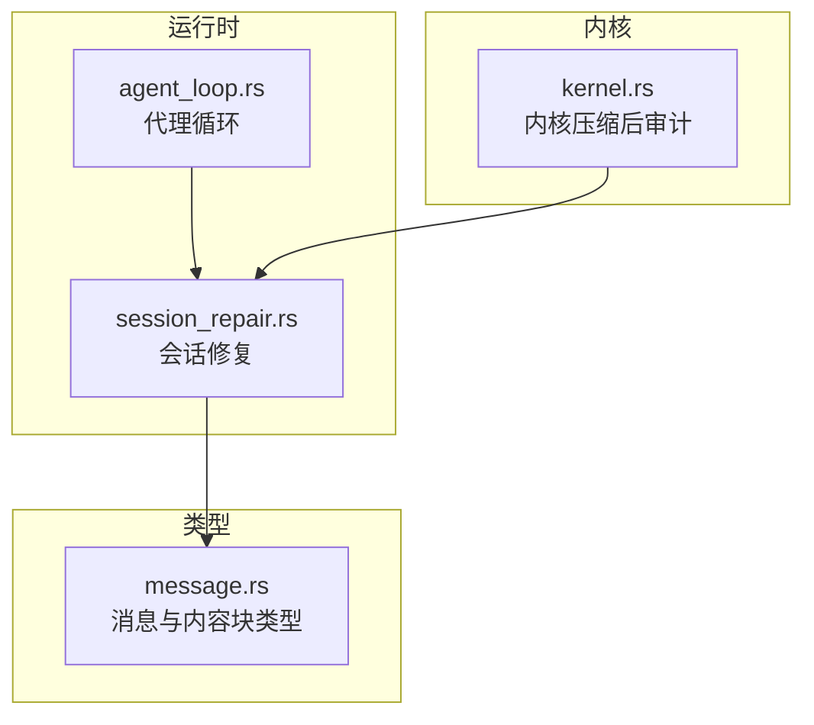
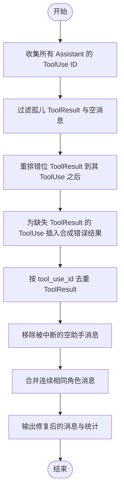
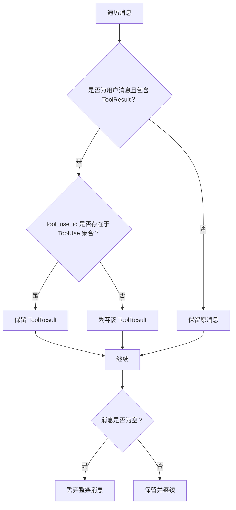
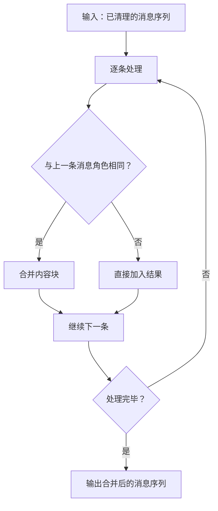
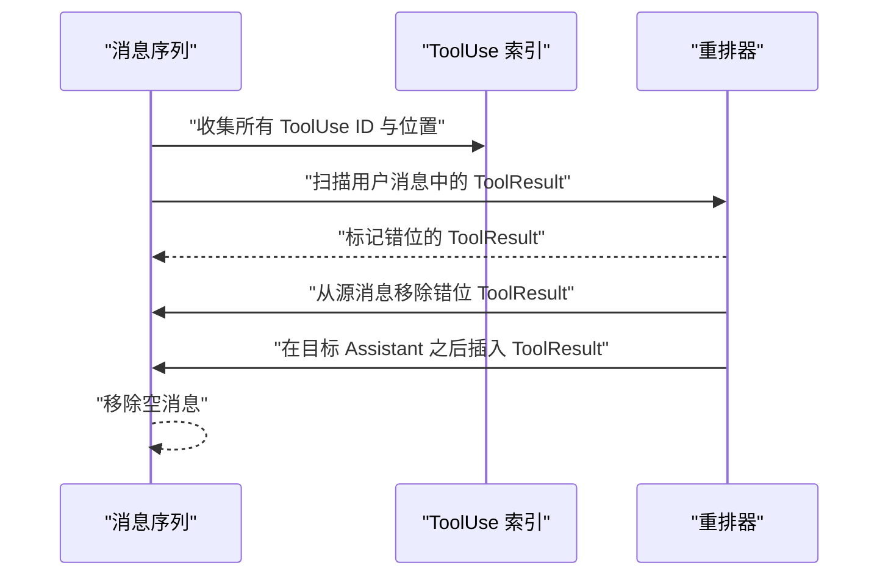
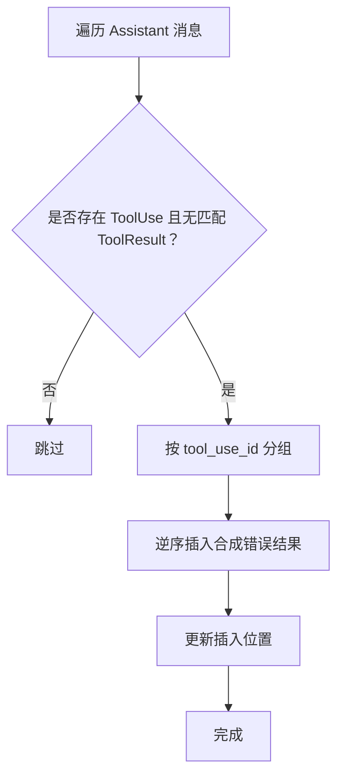
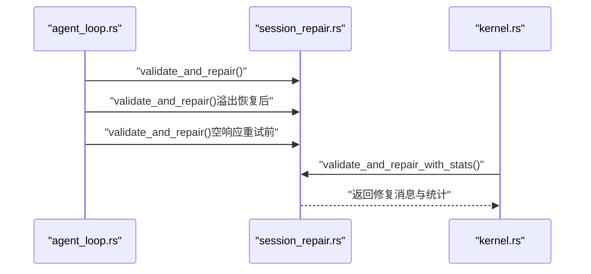

# 会话修复算法

<cite>
**本文引用的文件**
- [session_repair.rs](file://crates/openfang-runtime/src/session_repair.rs)
- [message.rs](file://crates/openfang-types/src/message.rs)
- [agent_loop.rs](file://crates/openfang-runtime/src/agent_loop.rs)
- [kernel.rs](file://crates/openfang-kernel/src/kernel.rs)
</cite>

## 目录
1. [简介](#简介)
2. [项目结构](#项目结构)
3. [核心组件](#核心组件)
4. [架构总览](#架构总览)
5. [详细组件分析](#详细组件分析)
6. [依赖关系分析](#依赖关系分析)
7. [性能考量](#性能考量)
8. [故障排查指南](#故障排查指南)
9. [结论](#结论)
10. [附录](#附录)

## 简介
本文件系统性阐述会话修复算法，聚焦于 validate_and_repair() 及其增强版本 validate_and_repair_with_stats() 的修复策略与实现细节。该算法旨在确保消息历史在发送给大模型（LLM）之前满足严格的格式与一致性要求，包括但不限于：
- 孤立 ToolResult 消息删除
- 空消息移除
- 连续相同角色消息合并
- ToolUse 与 ToolResult 的配对完整性与顺序校正
- 合成错误结果插入以补齐缺失的 ToolResult
- ToolResult 去重
- 针对被中断工具调用的“中止助手消息”清理
- 对工具结果内容进行安全裁剪与注入标记清理

此外，文档还提供修复效果评估方法与性能影响分析，帮助读者在工程实践中正确使用与优化该算法。

## 项目结构
会话修复算法位于运行时模块中，作为消息预处理的关键环节，贯穿代理循环与内核压缩流程：
- 运行时层：validate_and_repair() 在代理循环中多次调用，用于每轮对话前的会话净化与重排。
- 内核层：在压缩后对保留的消息再次执行修复，确保最终持久化的历史保持一致与可消费。
- 类型层：消息与内容块的数据结构定义，为修复算法提供统一的数据模型。

图表来源
- [agent_loop.rs:288-322](file://crates/openfang-runtime/src/agent_loop.rs#L288-L322)
- [session_repair.rs:43-178](file://crates/openfang-runtime/src/session_repair.rs#L43-L178)
- [kernel.rs:3121-3155](file://crates/openfang-kernel/src/kernel.rs#L3121-L3155)
- [message.rs:6-96](file://crates/openfang-types/src/message.rs#L6-L96)

章节来源
- [session_repair.rs:1-178](file://crates/openfang-runtime/src/session_repair.rs#L1-L178)
- [agent_loop.rs:288-322](file://crates/openfang-runtime/src/agent_loop.rs#L288-L322)
- [kernel.rs:3121-3155](file://crates/openfang-kernel/src/kernel.rs#L3121-L3155)
- [message.rs:6-96](file://crates/openfang-types/src/message.rs#L6-L96)

## 核心组件
- validate_and_repair()：主修复入口，返回修复后的消息列表。
- validate_and_repair_with_stats()：增强版，返回修复后的消息列表与统计信息 RepairStats。
- RepairStats：记录修复操作的统计量，如孤儿 ToolResult 移除数、空消息移除数、合并数、重排数、合成错误结果数、去重数等。
- 工具链函数：
  - reorder_tool_results()：将错位的 ToolResult 重排到其对应的 ToolUse 之后。
  - insert_synthetic_results()：为缺失 ToolResult 的 ToolUse 插入合成错误结果。
  - deduplicate_tool_results()：按 tool_use_id 去除重复的 ToolResult。
  - remove_aborted_assistant_messages()：移除被中断的空助手消息。
  - merge_content()/content_to_blocks()：将内容合并为块以便连续消息合并。
  - strip_tool_result_details()：对工具结果内容进行安全裁剪与注入标记清理。

章节来源
- [session_repair.rs:18-33](file://crates/openfang-runtime/src/session_repair.rs#L18-L33)
- [session_repair.rs:43-178](file://crates/openfang-runtime/src/session_repair.rs#L43-L178)
- [session_repair.rs:180-320](file://crates/openfang-runtime/src/session_repair.rs#L180-L320)
- [session_repair.rs:322-410](file://crates/openfang-runtime/src/session_repair.rs#L322-L410)
- [session_repair.rs:412-443](file://crates/openfang-runtime/src/session_repair.rs#L412-L443)
- [session_repair.rs:445-486](file://crates/openfang-runtime/src/session_repair.rs#L445-L486)
- [session_repair.rs:665-684](file://crates/openfang-runtime/src/session_repair.rs#L665-L684)
- [session_repair.rs:503-528](file://crates/openfang-runtime/src/session_repair.rs#L503-L528)

## 架构总览
validate_and_repair() 的整体工作流分为多个阶段，每个阶段负责一类修复任务，并通过统计信息反馈修复效果。

图表来源
- [session_repair.rs:49-178](file://crates/openfang-runtime/src/session_repair.rs#L49-L178)

章节来源
- [session_repair.rs:49-178](file://crates/openfang-runtime/src/session_repair.rs#L49-L178)

## 详细组件分析

### validate_and_repair() 与 validate_and_repair_with_stats()
- 输入：消息切片 &[Message]，其中 Message 包含角色 Role 与内容 MessageContent（文本或内容块）。
- 输出：修复后的消息向量 Vec<Message>；增强版同时返回 RepairStats。
- 关键行为：
  - 收集所有 ToolUse 的唯一 ID，用于后续匹配与去重。
  - 过滤孤儿 ToolResult（无对应 ToolUse）与空消息（纯空文本或仅空块）。
  - 将用户消息中的 ToolResult 重排至其 ToolUse 所在的 Assistant 消息之后。
  - 为缺失 ToolResult 的 ToolUse 插入合成错误结果，避免 API 校验失败。
  - 按 tool_use_id 去重 ToolResult，仅保留首个出现的结果。
  - 移除被中断的空助手消息（即前一条为空且下一条为包含 ToolResult 的用户消息）。
  - 合并连续相同角色的消息，减少历史长度并满足某些 API 的交替角色约束。

章节来源
- [session_repair.rs:43-178](file://crates/openfang-runtime/src/session_repair.rs#L43-L178)

### 孤立 ToolResult 消息删除
- 规则：若某条用户消息包含 ToolResult，但其 tool_use_id 不在任何 Assistant 的 ToolUse 列表中，则该 ToolResult 被视为孤儿并删除。
- 实现要点：
  - 先收集所有 ToolUse ID，再遍历消息，过滤掉孤儿 ToolResult。
  - 若整条消息仅剩孤儿 ToolResult，该消息本身也会被判定为空并移除。
- 复杂度：O(N) 遍历消息，哈希集合查询 O(1)，总体 O(N)。

图表来源
- [session_repair.rs:67-114](file://crates/openfang-runtime/src/session_repair.rs#L67-L114)

章节来源
- [session_repair.rs:67-114](file://crates/openfang-runtime/src/session_repair.rs#L67-L114)

### 空消息移除
- 规则：纯空文本或仅包含空文本块的消息被视为无效并移除。
- 特殊处理：当一条消息的所有内容块都被过滤后，该消息也被移除。
- 作用：避免空上下文污染 LLM 输入，减少历史长度。

章节来源
- [session_repair.rs:70-114](file://crates/openfang-runtime/src/session_repair.rs#L70-L114)

### 连续相同角色消息合并
- 规则：将相邻且角色相同的多条消息合并为一条，内容块顺序拼接。
- 实现要点：使用 merge_content() 将两条消息的内容转换为块后拼接，避免破坏内容块语义。
- 作用：满足 Anthropic 等 API 的交替角色要求，减少 token 使用。

图表来源
- [session_repair.rs:143-163](file://crates/openfang-runtime/src/session_repair.rs#L143-L163)
- [session_repair.rs:665-684](file://crates/openfang-runtime/src/session_repair.rs#L665-L684)

章节来源
- [session_repair.rs:143-163](file://crates/openfang-runtime/src/session_repair.rs#L143-L163)
- [session_repair.rs:665-684](file://crates/openfang-runtime/src/session_repair.rs#L665-L684)

### ToolUse 与 ToolResult 的配对完整性检查与重排
- 目标：确保每个 ToolUse 后紧邻其 ToolResult，否则将 ToolResult 移动到正确位置。
- 实现要点：
  - 第一次遍历建立 tool_use_id → Assistant 消息索引。
  - 第二次遍历收集错位的 ToolResult，按来源消息移除，并按目标 Assistant 位置插入。
  - 插入时考虑已有用户消息的存在，必要时扩展或新建用户消息承载 ToolResult。
- 复杂度：两次线性扫描 + 哈希映射，总体 O(N)。

图表来源
- [session_repair.rs:180-320](file://crates/openfang-runtime/src/session_repair.rs#L180-L320)

章节来源
- [session_repair.rs:180-320](file://crates/openfang-runtime/src/session_repair.rs#L180-L320)

### 缺失 ToolResult 的合成错误结果插入
- 目标：为未匹配 ToolResult 的 ToolUse 插入合成错误结果，防止 API 校验失败。
- 实现要点：
  - 先收集现有 ToolResult 的 tool_use_id。
  - 遍历 Assistant 消息，发现 ToolUse 但无对应 ToolResult 时，插入合成错误结果。
  - 插入位置紧随 Assistant 消息，优先写入同一索引的用户消息，否则新建。
- 复杂度：线性扫描 + 哈希集合查询，总体 O(N)。

图表来源
- [session_repair.rs:322-410](file://crates/openfang-runtime/src/session_repair.rs#L322-L410)

章节来源
- [session_repair.rs:322-410](file://crates/openfang-runtime/src/session_repair.rs#L322-L410)

### ToolResult 去重
- 规则：同一 tool_use_id 的多个 ToolResult 仅保留第一个，其余删除。
- 实现要点：遍历消息，维护 seen_ids 集合，遇到重复即移除；随后清理可能产生的空消息。
- 复杂度：单次线性扫描，总体 O(N)。

章节来源
- [session_repair.rs:412-443](file://crates/openfang-runtime/src/session_repair.rs#L412-L443)

### 被中断的助手消息清理
- 规则：若某条 Assistant 消息内容为空（或仅空文本块），且其后紧邻一条包含 ToolResult 的用户消息，则认为该 Assistant 消息被中断并移除。
- 实现要点：单次线性扫描，使用标志位跳过被中断的 Assistant 消息。
- 作用：避免“断点”导致的配对不完整与后续重排复杂度上升。

章节来源
- [session_repair.rs:445-486](file://crates/openfang-runtime/src/session_repair.rs#L445-L486)

### 工具结果内容安全裁剪与注入标记清理
- 目标：防止潜在恶意或冗余内容回灌给 LLM，降低风险并控制长度。
- 步骤：
  - 基于阈值移除长段 base64 数据（超过阈值的连续字符序列替换为占位符）。
  - 移除常见提示注入标记（大小写不敏感）。
  - 最终截断至最大长度，并标注截断信息。
- 复杂度：线性扫描，总体 O(L)，L 为内容长度。

章节来源
- [session_repair.rs:503-528](file://crates/openfang-runtime/src/session_repair.rs#L503-L528)
- [session_repair.rs:530-568](file://crates/openfang-runtime/src/session_repair.rs#L530-L568)
- [session_repair.rs:570-612](file://crates/openfang-runtime/src/session_repair.rs#L570-L612)

### 数据模型与一致性保证
- 消息与内容块类型由 openfang-types 定义，确保跨模块一致的数据结构。
- 修复后消息序列满足：
  - 角色交替（经合并后仍保持交替特性）。
  - ToolUse 与 ToolResult 成对且顺序正确。
  - 无孤儿 ToolResult 与空消息。
  - 无重复 ToolResult。
  - 工具结果内容经过安全裁剪。

章节来源
- [message.rs:6-96](file://crates/openfang-types/src/message.rs#L6-L96)

## 依赖关系分析
- 代理循环（agent_loop.rs）在以下时机调用修复算法：
  - 每轮对话开始前，对 llm_messages 进行修复。
  - 历史修剪后，重新修复以恢复 ToolUse/ToolResult 的配对完整性。
  - 上下文溢出恢复后，再次修复以确保配对不变量。
  - 空响应重试前，必要时进行修复以恢复配对状态。
- 内核压缩（kernel.rs）在压缩完成后对保留消息再次修复，并汇总修复统计用于审计报告。

图表来源
- [agent_loop.rs:288-322](file://crates/openfang-runtime/src/agent_loop.rs#L288-L322)
- [agent_loop.rs:350-361](file://crates/openfang-runtime/src/agent_loop.rs#L350-L361)
- [agent_loop.rs:457-477](file://crates/openfang-runtime/src/agent_loop.rs#L457-L477)
- [kernel.rs:3121-3155](file://crates/openfang-kernel/src/kernel.rs#L3121-L3155)

章节来源
- [agent_loop.rs:288-322](file://crates/openfang-runtime/src/agent_loop.rs#L288-L322)
- [agent_loop.rs:350-361](file://crates/openfang-runtime/src/agent_loop.rs#L350-L361)
- [agent_loop.rs:457-477](file://crates/openfang-runtime/src/agent_loop.rs#L457-L477)
- [kernel.rs:3121-3155](file://crates/openfang-kernel/src/kernel.rs#L3121-L3155)

## 性能考量
- 时间复杂度
  - validate_and_repair() 主要由多轮线性扫描组成，整体 O(N)。
  - 重排与合成插入采用哈希映射与分组，避免嵌套循环，保持线性复杂度。
- 空间复杂度
  - 使用临时向量与哈希集合存储中间状态，空间复杂度 O(N)。
- 优化建议
  - 合并阶段尽量减少不必要的内容块转换，复用已有的块结构。
  - 在高频调用场景下，可考虑缓存工具调用 ID 集合以降低重复构建成本。
  - 对超长工具结果提前进行安全裁剪，减少后续处理开销。

[本节为通用性能讨论，无需特定文件来源]

## 故障排查指南
- 症状：LLM 返回空文本或无工具调用，且 input_tokens=0。
  - 排查：确认是否发生上下文溢出或历史被截断，触发修复以恢复 ToolUse/ToolResult 配对。
  - 处理：在溢出恢复后与空响应重试前调用修复。
- 症状：历史中出现大量孤儿 ToolResult 或重复 ToolResult。
  - 排查：检查上游生成逻辑是否遗漏 ToolUse 或重复提交 ToolResult。
  - 处理：启用修复算法自动移除孤儿与去重，必要时在日志中观察 RepairStats 统计。
- 症状：消息角色连续且未交替。
  - 排查：确认是否遗漏了 ToolResult 导致角色中断。
  - 处理：修复算法会自动重排并插入合成错误结果，确保角色交替。
- 症状：工具结果过大或包含敏感内容。
  - 排查：检查工具输出是否包含长 base64 数据或注入标记。
  - 处理：使用 strip_tool_result_details() 自动裁剪与清理。

章节来源
- [agent_loop.rs:350-361](file://crates/openfang-runtime/src/agent_loop.rs#L350-L361)
- [agent_loop.rs:457-477](file://crates/openfang-runtime/src/agent_loop.rs#L457-L477)
- [session_repair.rs:503-528](file://crates/openfang-runtime/src/session_repair.rs#L503-L528)
- [session_repair.rs:530-612](file://crates/openfang-runtime/src/session_repair.rs#L530-L612)

## 结论
validate_and_repair() 通过多阶段修复策略，系统性地解决了会话历史中的常见问题，确保消息序列在发送给 LLM 前具备良好的格式与一致性。其设计兼顾正确性与效率，适合在代理循环与内核压缩等关键路径中稳定使用。配合 RepairStats 的统计输出，可有效评估修复效果并指导进一步优化。

[本节为总结性内容，无需特定文件来源]

## 附录

### 修复效果评估方法
- 修复统计指标
  - 孤儿 ToolResult 移除数：反映历史中未匹配 ToolUse 的 ToolResult 数量。
  - 空消息移除数：反映无效空消息数量。
  - 合并数：反映连续相同角色消息的合并次数。
  - 重排数：反映 ToolResult 重排次数。
  - 合成错误结果数：反映为缺失 ToolResult 插入的错误结果数量。
  - 去重数：反映重复 ToolResult 的去重数量。
- 评估步骤
  - 在关键节点调用 validate_and_repair_with_stats() 获取统计。
  - 对比修复前后消息数量、角色交替性、ToolUse/ToolResult 配对完整性。
  - 记录并监控异常模式（如频繁合成错误结果），定位上游生成问题。

章节来源
- [session_repair.rs:18-33](file://crates/openfang-runtime/src/session_repair.rs#L18-L33)
- [kernel.rs:3140-3153](file://crates/openfang-kernel/src/kernel.rs#L3140-L3153)