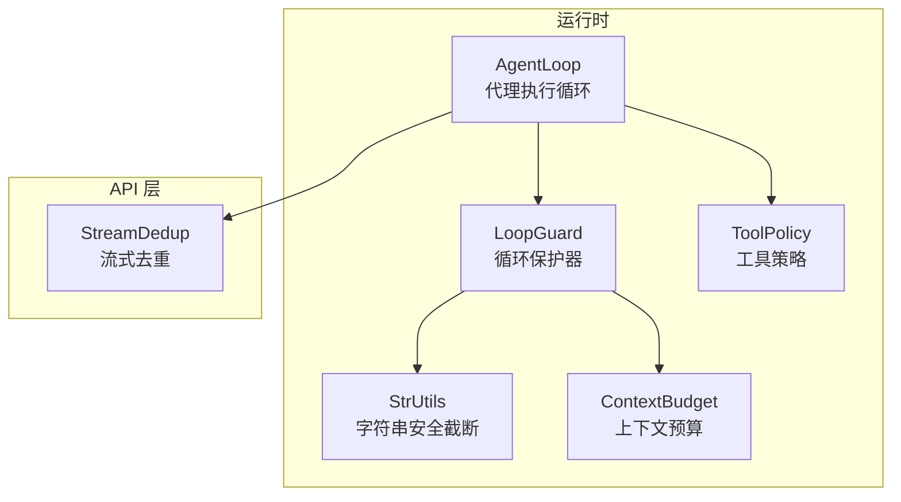
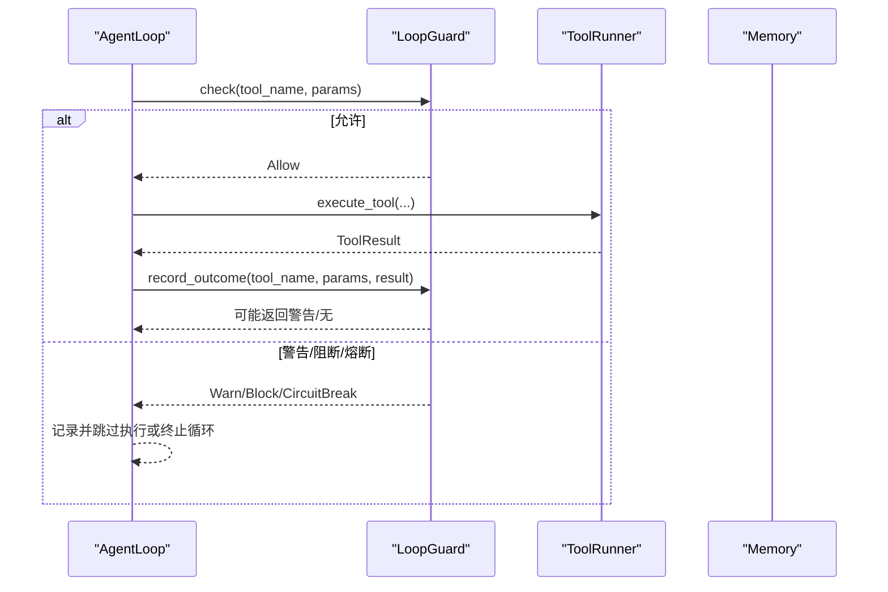
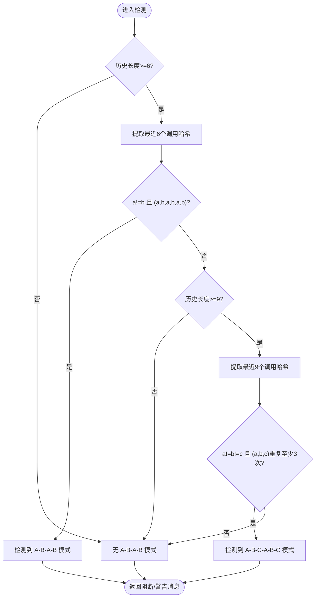
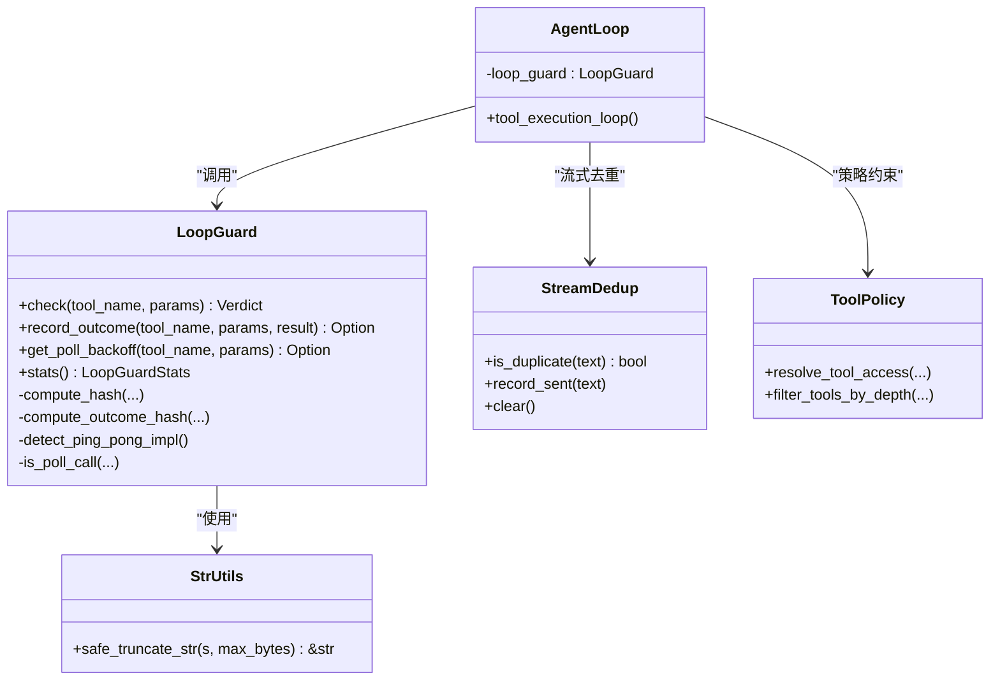

# 循环保护算法

<cite>
**本文引用的文件**
- [loop_guard.rs](file://crates/openfang-runtime/src/loop_guard.rs)
- [agent_loop.rs](file://crates/openfang-runtime/src/agent_loop.rs)
- [stream_dedup.rs](file://crates/openfang-api/src/stream_dedup.rs)
- [tool_policy.rs](file://crates/openfang-runtime/src/tool_policy.rs)
- [str_utils.rs](file://crates/openfang-runtime/src/str_utils.rs)
- [context_budget.rs](file://crates/openfang-runtime/src/context_budget.rs)
</cite>

## 目录
1. [简介](#简介)
2. [项目结构](#项目结构)
3. [核心组件](#核心组件)
4. [架构总览](#架构总览)
5. [详细组件分析](#详细组件分析)
6. [依赖关系分析](#依赖关系分析)
7. [性能考量](#性能考量)
8. [故障排查指南](#故障排查指南)
9. [结论](#结论)

## 简介
本文件系统性阐述 OpenFang 中的循环保护算法，涵盖以下关键能力：
- SHA-256 哈希计算机制：用于工具调用参数与结果的唯一标识
- 工具调用重复检测算法：基于调用哈希计数的阈值控制
- 结果哈希跟踪机制：对“调用+结果”进行去重，加速阻断
- Ping-pong 模式检测算法：长度 2 与长度 3 的交替模式识别
- 轮询工具识别算法：对状态轮询类工具的宽松阈值与退避建议
- 回退建议机制：在警告升级为阻断时提供可操作建议

该算法通过多层渐进式防护（允许、警告、阻断、全局熔断）避免代理陷入循环执行，同时兼顾轮询场景的合理性，并提供统计快照便于调试与监控。

## 项目结构
循环保护算法主要位于运行时模块中，与代理执行循环、流式去重、策略控制等模块协同工作。

图表来源
- [loop_guard.rs:101-139](file://crates/openfang-runtime/src/loop_guard.rs#L101-L139)
- [agent_loop.rs:632-667](file://crates/openfang-runtime/src/agent_loop.rs#L632-L667)
- [stream_dedup.rs:12-18](file://crates/openfang-api/src/stream_dedup.rs#L12-L18)
- [tool_policy.rs:36-50](file://crates/openfang-runtime/src/tool_policy.rs#L36-L50)
- [str_utils.rs:1-19](file://crates/openfang-runtime/src/str_utils.rs#L1-L19)
- [context_budget.rs:312-334](file://crates/openfang-runtime/src/context_budget.rs#L312-L334)

章节来源
- [loop_guard.rs:1-120](file://crates/openfang-runtime/src/loop_guard.rs#L1-L120)
- [agent_loop.rs:620-786](file://crates/openfang-runtime/src/agent_loop.rs#L620-L786)

## 核心组件
- LoopGuard：循环保护主控制器，负责调用哈希计算、重复检测、结果哈希跟踪、Ping-pong 检测、轮询工具识别与退避建议、全局熔断与统计快照。
- AgentLoop：代理执行循环，在每次工具调用前调用 LoopGuard 进行决策，并根据返回的判例决定是否执行或阻断。
- StreamDedup：流式内容去重，防止 LLM 重复输出相同文本，与循环保护互补。
- ToolPolicy：工具访问策略，与循环保护共同约束工具使用范围与深度限制。
- StrUtils：UTF-8 安全截断，确保哈希与结果处理不破坏字符边界。
- ContextBudget：上下文预算，影响工具结果截断策略，间接影响循环保护中的结果哈希稳定性。

章节来源
- [loop_guard.rs:101-139](file://crates/openfang-runtime/src/loop_guard.rs#L101-L139)
- [agent_loop.rs:632-667](file://crates/openfang-runtime/src/agent_loop.rs#L632-L667)
- [stream_dedup.rs:12-18](file://crates/openfang-api/src/stream_dedup.rs#L12-L18)
- [tool_policy.rs:36-50](file://crates/openfang-runtime/src/tool_policy.rs#L36-L50)
- [str_utils.rs:1-19](file://crates/openfang-runtime/src/str_utils.rs#L1-L19)
- [context_budget.rs:312-334](file://crates/openfang-runtime/src/context_budget.rs#L312-L334)

## 架构总览
循环保护在代理执行循环中以“预检查 + 执行 + 后记录”的流程运行，形成闭环反馈。

图表来源
- [agent_loop.rs:632-667](file://crates/openfang-runtime/src/agent_loop.rs#L632-L667)
- [agent_loop.rs:773-786](file://crates/openfang-runtime/src/agent_loop.rs#L773-L786)
- [loop_guard.rs:146-244](file://crates/openfang-runtime/src/loop_guard.rs#L146-L244)
- [loop_guard.rs:251-281](file://crates/openfang-runtime/src/loop_guard.rs#L251-L281)

## 详细组件分析

### SHA-256 哈希计算机制
- 调用哈希：对工具名与序列化后的参数进行 SHA-256，生成固定长度十六进制字符串，作为调用的唯一标识。
- 结果哈希：对“工具名|参数|结果截断”进行 SHA-256，仅截断结果前 1000 字节，避免对超大输出进行昂贵哈希，同时保留短结果的重复检测能力。
- 截断策略：使用 UTF-8 安全截断，保证多字节字符不被切开，避免 panic。

复杂度
- 时间复杂度：O(n)，n 为参数 JSON 序列化长度 + 结果长度（截断后）
- 空间复杂度：O(n)，存储序列化参数与哈希缓冲区

章节来源
- [loop_guard.rs:500-525](file://crates/openfang-runtime/src/loop_guard.rs#L500-L525)
- [str_utils.rs:1-19](file://crates/openfang-runtime/src/str_utils.rs#L1-L19)

### 工具调用重复检测算法
- 计数模型：以调用哈希为键，维护调用次数计数；支持轮询工具的阈值乘数，降低误报。
- 阈值控制：warn_threshold 与 block_threshold 分别对应警告与阻断阈值；超过阈值即阻断当前调用。
- 警告桶：同一调用哈希发出的警告次数超过 max_warnings_per_call 后，自动升级为阻断，防止噪声。
- 全局熔断：累计调用总数超过 global_circuit_breaker 即触发熔断，保护整个代理循环。

复杂度
- 时间复杂度：O(1) 平均，哈希表查找/更新
- 空间复杂度：O(k)，k 为不同调用哈希数量

章节来源
- [loop_guard.rs:146-244](file://crates/openfang-runtime/src/loop_guard.rs#L146-L244)
- [loop_guard.rs:330-360](file://crates/openfang-runtime/src/loop_guard.rs#L330-L360)

### 结果哈希跟踪机制
- 目标：当同一调用反复产生相同结果时，快速阻断，避免无效尝试。
- 实现：record_outcome 将“调用哈希 + 结果哈希”计数，达到阈值后将调用哈希加入阻断集合，下一次 check() 即直接阻断。
- 升级路径：先警告，再阻断，最后阻断集合生效，形成渐进式防护。

复杂度
- 时间复杂度：O(1) 平均
- 空间复杂度：O(m)，m 为不同结果哈希数量

章节来源
- [loop_guard.rs:251-281](file://crates/openfang-runtime/src/loop_guard.rs#L251-L281)

### Ping-pong 模式检测算法
- 设计目标：检测 A-B-A-B 或 A-B-C-A-B-C 的交替模式，绕过单次哈希计数检测。
- 长度 2 检测：最近 6 个调用必须满足 a!=b 且 (a,b,a,b,a,b) 模式，至少 3 次完整重复才触发阻断。
- 长度 3 检测：最近 9 个调用必须满足 a!=b!=c 且 (a,b,c) 循环重复至少 3 次。
- 复杂度：O(1) 检测窗口大小固定，O(1) 时间复杂度；空间复杂度 O(HISTORY_SIZE)

图表来源
- [loop_guard.rs:375-444](file://crates/openfang-runtime/src/loop_guard.rs#L375-L444)

章节来源
- [loop_guard.rs:362-444](file://crates/openfang-runtime/src/loop_guard.rs#L362-L444)

### 轮询工具识别算法
- 识别规则：已知轮询工具列表 + 参数中包含状态/轮询/等待等关键词的通用匹配。
- 阈值调整：轮询工具的 warn/block 阈值乘以 poll_multiplier，降低误报概率。
- 退避建议：提供指数退避延迟序列，建议调用者在后续轮询中增加等待时间。

复杂度
- 时间复杂度：O(1)（轮询判断与阈值计算）
- 空间复杂度：O(1)

章节来源
- [loop_guard.rs:24-33](file://crates/openfang-runtime/src/loop_guard.rs#L24-L33)
- [loop_guard.rs:330-360](file://crates/openfang-runtime/src/loop_guard.rs#L330-L360)
- [loop_guard.rs:283-304](file://crates/openfang-runtime/src/loop_guard.rs#L283-L304)

### 回退建议机制
- 警告升级：同一调用哈希多次警告后自动升级为阻断，提示“尝试不同的方法/参数”。
- 结果重复阻断：当“调用+结果”重复达到阈值，下一次检查直接阻断并建议改变策略。
- 统计快照：提供 total_calls、unique_calls、blocked_calls、most_repeated_tool 等指标，辅助诊断。

复杂度
- 时间复杂度：O(1) 平均
- 空间复杂度：O(k+m)，k 为调用哈希数量，m 为结果哈希数量

章节来源
- [loop_guard.rs:194-244](file://crates/openfang-runtime/src/loop_guard.rs#L194-L244)
- [loop_guard.rs:251-281](file://crates/openfang-runtime/src/loop_guard.rs#L251-L281)
- [loop_guard.rs:306-328](file://crates/openfang-runtime/src/loop_guard.rs#L306-L328)

## 依赖关系分析
- LoopGuard 依赖：
  - SHA-256 哈希与十六进制编码（外部库）
  - JSON 序列化（serde_json）
  - UTF-8 安全截断（str_utils.safe_truncate_str）
  - 上下文预算（context_budget）用于动态截断工具结果
- AgentLoop 与 LoopGuard 的交互：
  - 在工具调用前调用 check() 决策
  - 在工具执行后调用 record_outcome() 记录结果
  - 根据返回值决定是否阻断或熔断
- StreamDedup 与 LoopGuard 的互补：
  - 流式输出去重，避免重复文本导致的循环感知误差
- ToolPolicy 与 LoopGuard 的协作：
  - 通过策略限制工具可用性，减少不必要的循环风险

图表来源
- [loop_guard.rs:101-139](file://crates/openfang-runtime/src/loop_guard.rs#L101-L139)
- [agent_loop.rs:632-667](file://crates/openfang-runtime/src/agent_loop.rs#L632-L667)
- [stream_dedup.rs:12-18](file://crates/openfang-api/src/stream_dedup.rs#L12-L18)
- [tool_policy.rs:36-50](file://crates/openfang-runtime/src/tool_policy.rs#L36-L50)
- [str_utils.rs:1-19](file://crates/openfang-runtime/src/str_utils.rs#L1-L19)

## 性能考量
- 哈希成本：SHA-256 对于中等规模参数与结果开销可控；结果截断至 1000 字节显著降低哈希成本。
- 数据结构选择：HashMap/HashSet 提供平均 O(1) 查找与更新；Vec 作为固定容量环形缓冲区，避免频繁扩容。
- 时间复杂度汇总：
  - 调用哈希计算：O(n)
  - 结果哈希计算：O(n)
  - 重复检测：O(1)
  - Ping-pong 检测：O(1)（固定窗口）
  - 警告桶与全局熔断：O(1)
- 空间复杂度汇总：
  - 调用计数：O(k)
  - 结果计数：O(m)
  - 最近调用历史：O(HISTORY_SIZE)
- 优化建议：
  - 对超长结果采用分块哈希（当前已通过截断降低开销）
  - 使用更高效的哈希算法（如 FNV）在极端高频场景下替代 SHA-256（需权衡碰撞风险）
  - 将固定窗口改为滑动窗口以适应更长的历史模式（需评估内存占用）

[本节为通用性能讨论，无需特定文件来源]

## 故障排查指南
- 症状：频繁出现“警告”但未阻断
  - 排查：确认 max_warnings_per_call 是否过高；检查是否为轮询工具导致阈值被乘
  - 参考：[loop_guard.rs:184-222](file://crates/openfang-runtime/src/loop_guard.rs#L184-L222)
- 症状：结果重复未及时阻断
  - 排查：确认 outcome_warn_threshold/outcome_block_threshold 设置；检查 record_outcome 是否在工具执行后调用
  - 参考：[loop_guard.rs:251-281](file://crates/openfang-runtime/src/loop_guard.rs#L251-L281)
- 症状：轮询工具被误阻断
  - 排查：确认 is_poll_call 判断逻辑；适当提高 poll_multiplier
  - 参考：[loop_guard.rs:330-360](file://crates/openfang-runtime/src/loop_guard.rs#L330-L360)
- 症状：全局熔断提前触发
  - 排查：检查 max_iterations 与 global_circuit_breaker 的比例；必要时扩大熔断阈值
  - 参考：[agent_loop.rs:1470-1478](file://crates/openfang-runtime/src/agent_loop.rs#L1470-L1478)
- 症状：Ping-pong 未被检测
  - 排查：确认 HISTORY_SIZE 与 ping_pong_min_repeats；检查最近调用历史是否被正确记录
  - 参考：[loop_guard.rs:362-444](file://crates/openfang-runtime/src/loop_guard.rs#L362-L444)

章节来源
- [loop_guard.rs:184-222](file://crates/openfang-runtime/src/loop_guard.rs#L184-L222)
- [loop_guard.rs:251-281](file://crates/openfang-runtime/src/loop_guard.rs#L251-L281)
- [loop_guard.rs:330-360](file://crates/openfang-runtime/src/loop_guard.rs#L330-L360)
- [agent_loop.rs:1470-1478](file://crates/openfang-runtime/src/agent_loop.rs#L1470-L1478)
- [loop_guard.rs:362-444](file://crates/openfang-runtime/src/loop_guard.rs#L362-L444)

## 结论
循环保护算法通过“调用哈希 + 结果哈希 + Ping-pong 检测 + 轮询工具宽松阈值 + 退避建议 + 全局熔断”的组合，实现了对代理循环的有效防护。其设计兼顾了准确性与性能，既能在复杂模式下识别循环，又能在轮询场景中保持合理容忍度。配合统计快照与警告桶机制，能够为运维与调试提供清晰的线索。未来可在哈希算法选择、窗口策略与阈值自适应方面进一步优化，以应对更高并发与更复杂的使用场景。