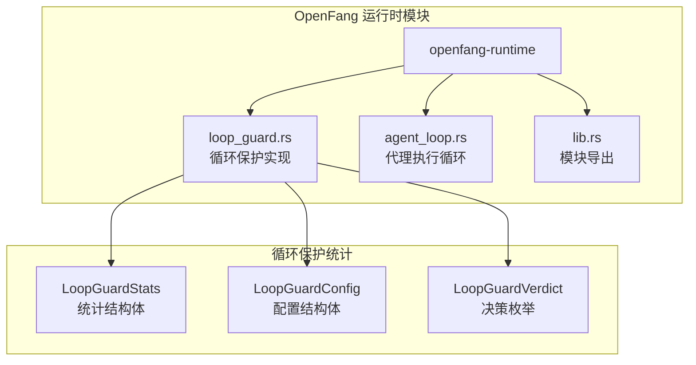
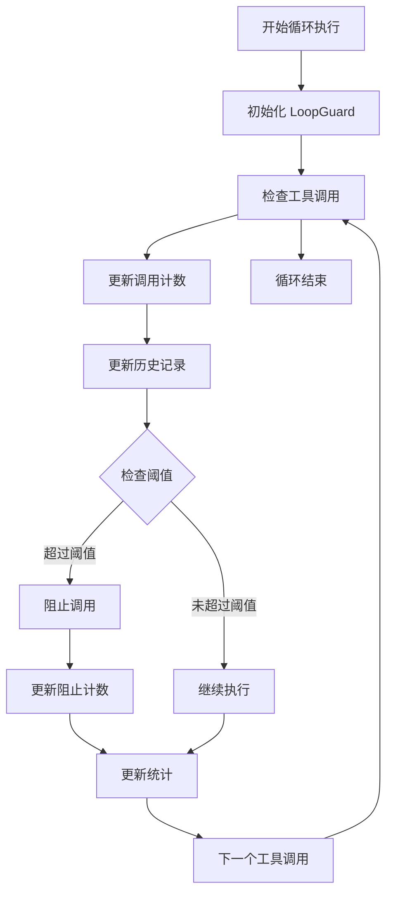
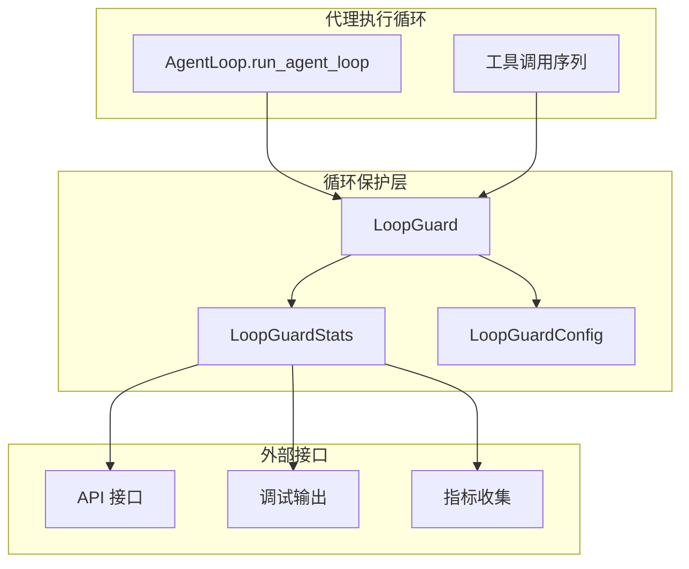
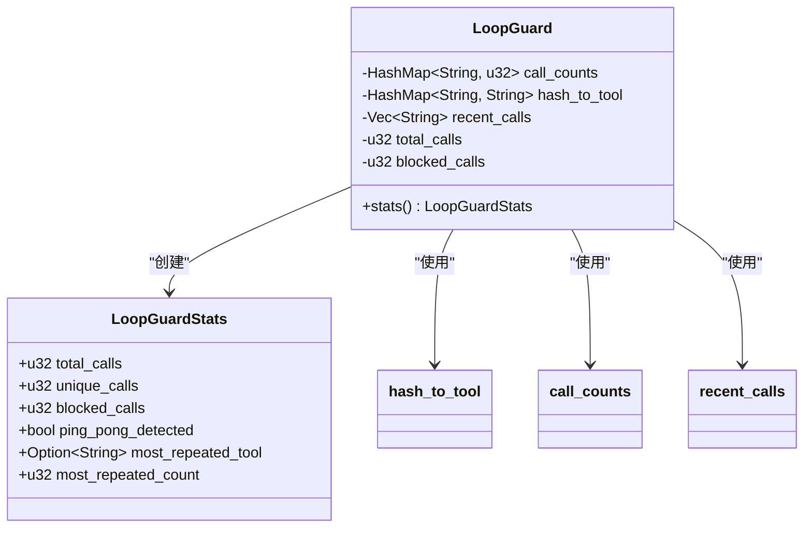
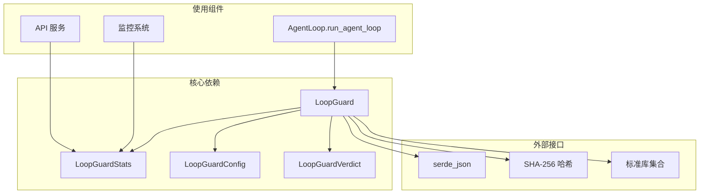
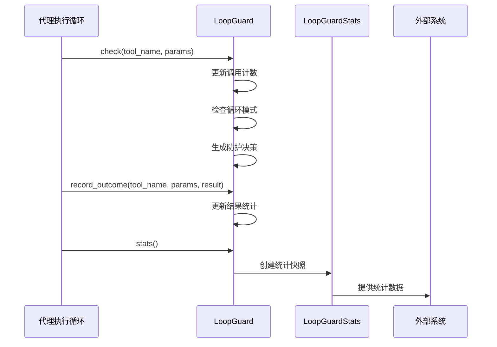

# 循环保护统计

<cite>
**本文档引用的文件**
- [loop_guard.rs](file://crates/openfang-runtime/src/loop_guard.rs)
- [agent_loop.rs](file://crates/openfang-runtime/src/agent_loop.rs)
- [lib.rs](file://crates/openfang-runtime/src/lib.rs)
</cite>

## 目录
1. [简介](#简介)
2. [项目结构](#项目结构)
3. [核心组件](#核心组件)
4. [架构概览](#架构概览)
5. [详细组件分析](#详细组件分析)
6. [依赖关系分析](#依赖关系分析)
7. [性能考虑](#性能考虑)
8. [故障排除指南](#故障排除指南)
9. [结论](#结论)

## 简介

循环保护统计功能是 OpenFang 代理运行时系统中的一个重要监控机制，用于跟踪和分析代理执行循环中的工具调用行为。该功能通过 `LoopGuardStats` 结构体提供详细的统计信息，帮助开发者和运维人员理解代理的行为模式，识别潜在的循环调用问题，并进行相应的调试和优化。

LoopGuardStats 结构体包含了六个关键字段，每个字段都代表了不同的统计维度：

- **total_calls（总调用次数）**：记录当前循环执行期间所有工具调用的总数
- **unique_calls（唯一调用数）**：统计不同工具名称和参数组合的数量
- **blocked_calls（被阻止的调用数）**：记录因循环保护机制而被阻止的工具调用次数
- **ping_pong_detected（是否检测到 ping-pong）**：指示是否检测到了工具间的交替调用模式
- **most_repeated_tool（最频繁工具）**：标识出现频率最高的工具名称
- **most_repeated_count（最高重复次数）**：记录最频繁工具的调用次数

这些统计数据不仅用于实时的循环保护决策，还为系统的调试和监控提供了宝贵的洞察。

## 项目结构

循环保护统计功能位于 OpenFang 项目的运行时模块中，具体位置如下：

**图表来源**
- [loop_guard.rs:85-99](file://crates/openfang-runtime/src/loop_guard.rs#L85-L99)
- [agent_loop.rs:12-13](file://crates/openfang-runtime/src/agent_loop.rs#L12-L13)
- [lib.rs](file://crates/openfang-runtime/src/lib.rs#L32)

**章节来源**
- [loop_guard.rs:1-20](file://crates/openfang-runtime/src/loop_guard.rs#L1-L20)
- [lib.rs:1-59](file://crates/openfang-runtime/src/lib.rs#L1-L59)

## 核心组件

### LoopGuardStats 结构体详解

LoopGuardStats 是循环保护统计功能的核心数据结构，它提供了对代理执行循环状态的完整快照。该结构体的设计体现了以下特点：

#### 字段定义与作用

1. **total_calls（总调用次数）**
   - 类型：u32
   - 作用：记录自循环开始以来所有工具调用的累计数量
   - 更新时机：每次调用 `check()` 方法时递增

2. **unique_calls（唯一调用数）**
   - 类型：u32
   - 作用：统计不同工具名称和参数组合的唯一数量
   - 计算方式：基于内部哈希表的长度

3. **blocked_calls（被阻止的调用数）**
   - 类型：u32
   - 作用：记录因各种原因被循环保护机制阻止的调用次数
   - 包括：阈值触发阻止、结果重复阻止、全局电路断路器触发

4. **ping_pong_detected（是否检测到 ping-pong）**
   - 类型：bool
   - 作用：指示是否检测到了工具间的交替调用模式
   - 检测算法：基于最近历史记录的模式分析

5. **most_repeated_tool（最频繁工具）**
   - 类型：Option<String>
   - 作用：标识出现频率最高的工具名称
   - 返回：如果存在重复工具则返回工具名，否则返回 None

6. **most_repeated_count（最高重复次数）**
   - 类型：u32
   - 作用：记录最频繁工具的调用次数
   - 价值：帮助识别潜在的无限循环或重复调用问题

#### 统计数据收集方式

统计数据的收集采用增量更新的方式，在循环执行过程中实时维护：

**图表来源**
- [loop_guard.rs:146-244](file://crates/openfang-runtime/src/loop_guard.rs#L146-L244)
- [loop_guard.rs:306-328](file://crates/openfang-runtime/src/loop_guard.rs#L306-L328)

**章节来源**
- [loop_guard.rs:85-99](file://crates/openfang-runtime/src/loop_guard.rs#L85-L99)
- [loop_guard.rs:306-328](file://crates/openfang-runtime/src/loop_guard.rs#L306-L328)

## 架构概览

循环保护统计功能在整个系统架构中扮演着监控和防护的角色：

**图表来源**
- [agent_loop.rs:145-167](file://crates/openfang-runtime/src/agent_loop.rs#L145-L167)
- [loop_guard.rs:124-139](file://crates/openfang-runtime/src/loop_guard.rs#L124-L139)

### 数据流分析

循环保护统计的数据流遵循以下模式：

1. **实时监控**：在每次工具调用前进行检查
2. **状态维护**：更新内部状态和统计数据
3. **决策生成**：基于统计结果生成防护决策
4. **统计输出**：提供快照供外部系统使用

**章节来源**
- [agent_loop.rs:631-667](file://crates/openfang-runtime/src/agent_loop.rs#L631-L667)
- [loop_guard.rs:146-244](file://crates/openfang-runtime/src/loop_guard.rs#L146-L244)

## 详细组件分析

### LoopGuardStats 的实现细节

LoopGuardStats 的实现采用了高效的数据结构来确保统计计算的性能：

#### 内存管理策略

**图表来源**
- [loop_guard.rs:85-122](file://crates/openfang-runtime/src/loop_guard.rs#L85-L122)
- [loop_guard.rs:306-328](file://crates/openfang-runtime/src/loop_guard.rs#L306-L328)

#### 统计计算算法

统计计算采用了优化的算法来处理大规模数据：

1. **最频繁工具查找**：单次遍历哈希表找到最大值
2. **历史记录维护**：固定大小的环形缓冲区限制内存使用
3. **哈希映射优化**：使用 SHA-256 哈希确保唯一性和性能

**章节来源**
- [loop_guard.rs:306-328](file://crates/openfang-runtime/src/loop_guard.rs#L306-L328)
- [loop_guard.rs:310-318](file://crates/openfang-runtime/src/loop_guard.rs#L310-L318)

### 使用场景和调试用途

LoopGuardStats 在多种场景中发挥重要作用：

#### 调试和监控

1. **性能分析**：识别过度调用的工具和异常的调用模式
2. **循环检测**：帮助定位可能导致死循环的工具组合
3. **资源使用**：监控代理的资源消耗模式

#### 配置优化

1. **阈值调整**：基于统计数据调整循环保护阈值
2. **工具策略**：识别需要特殊处理的工具类型
3. **系统调优**：优化代理的整体执行效率

**章节来源**
- [loop_guard.rs:897-919](file://crates/openfang-runtime/src/loop_guard.rs#L897-L919)
- [loop_guard.rs:925-948](file://crates/openfang-runtime/src/loop_guard.rs#L925-L948)

## 依赖关系分析

循环保护统计功能与其他系统组件的依赖关系如下：

**图表来源**
- [agent_loop.rs:12-13](file://crates/openfang-runtime/src/agent_loop.rs#L12-L13)
- [loop_guard.rs:20-22](file://crates/openfang-runtime/src/loop_guard.rs#L20-L22)

### 模块间交互

循环保护统计功能与代理执行循环的交互流程：

**图表来源**
- [agent_loop.rs:631-667](file://crates/openfang-runtime/src/agent_loop.rs#L631-L667)
- [agent_loop.rs:773-778](file://crates/openfang-runtime/src/agent_loop.rs#L773-L778)
- [loop_guard.rs:306-328](file://crates/openfang-runtime/src/loop_guard.rs#L306-L328)

**章节来源**
- [agent_loop.rs:620-819](file://crates/openfang-runtime/src/agent_loop.rs#L620-L819)
- [agent_loop.rs:1760-1959](file://crates/openfang-runtime/src/agent_loop.rs#L1760-L1959)

## 性能考虑

循环保护统计功能在设计时充分考虑了性能要求：

### 时间复杂度分析

1. **统计快照创建**：O(n)，其中 n 是唯一调用的数量
2. **历史记录维护**：O(1) 平均时间复杂度
3. **哈希计算**：O(k)，其中 k 是参数的大小

### 内存使用优化

1. **固定大小缓冲区**：限制历史记录的内存占用
2. **增量更新**：避免重复计算已知状态
3. **哈希映射**：提供高效的键值存储和检索

### 扩展性设计

1. **可配置阈值**：允许根据使用场景调整敏感度
2. **模块化设计**：便于独立测试和维护
3. **接口抽象**：支持未来功能扩展

## 故障排除指南

### 常见问题诊断

#### 统计数据异常

1. **total_calls 不正确**
   - 检查是否在所有工具调用路径上都进行了统计
   - 验证循环保护是否正确初始化

2. **unique_calls 为零**
   - 确认工具名称和参数是否正确传递
   - 检查哈希计算是否正常工作

#### 性能问题

1. **统计更新延迟**
   - 检查是否有过多的并发访问
   - 优化哈希表的大小和负载因子

2. **内存泄漏**
   - 定期清理历史记录
   - 监控哈希表的增长情况

**章节来源**
- [loop_guard.rs:528-949](file://crates/openfang-runtime/src/loop_guard.rs#L528-L949)

### 调试技巧

1. **启用详细日志**：在开发环境中增加调试信息
2. **单元测试**：编写针对统计逻辑的测试用例
3. **性能基准**：定期测量统计功能的性能影响

## 结论

循环保护统计功能通过 LoopGuardStats 结构体提供了全面的代理执行监控能力。该功能不仅能够有效防止代理陷入循环调用，还能为系统的调试、优化和监控提供宝贵的数据支持。

六个核心字段的设计体现了对不同监控维度的综合考虑：从基本的调用计数到复杂的模式识别，从实时的防护决策到长期的趋势分析。这种多层次的统计体系使得开发者能够深入理解代理的行为模式，及时发现和解决潜在问题。

随着 OpenFang 系统的发展，循环保护统计功能将继续演进，为构建更智能、更可靠的 AI 代理系统提供坚实的技术基础。