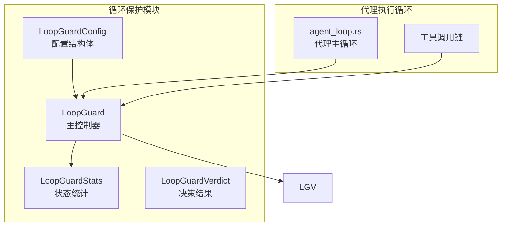
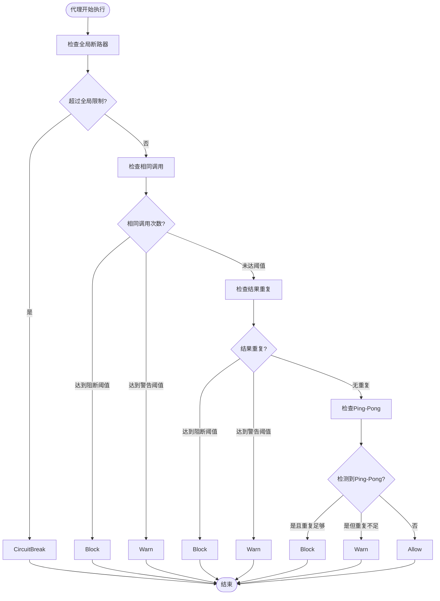
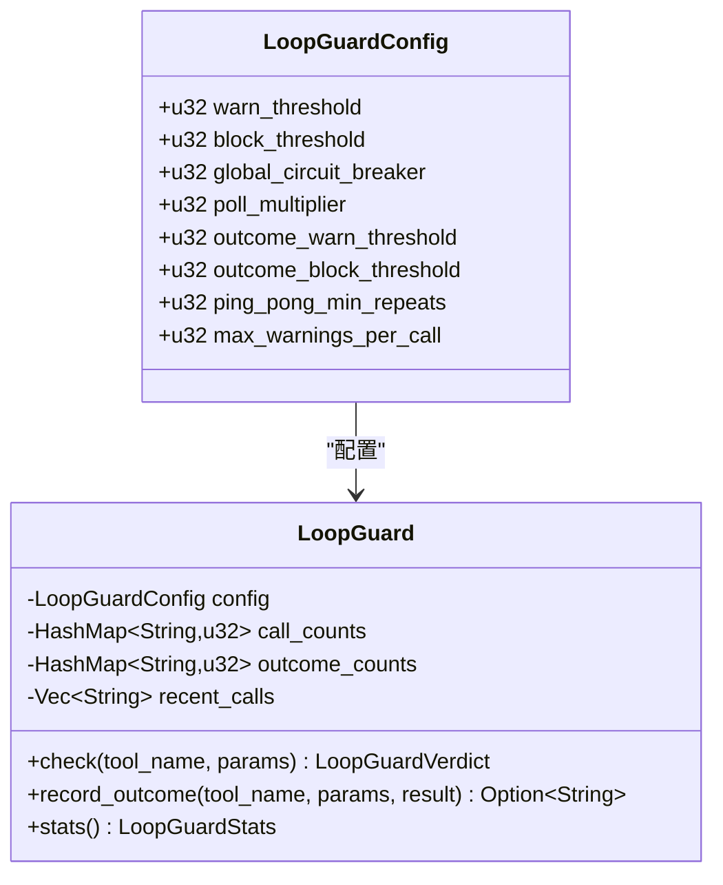
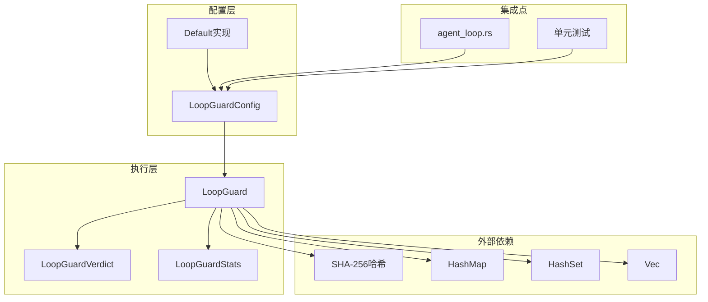

# 循环保护配置

<cite>
**本文档引用的文件**
- [loop_guard.rs](file://crates/openfang-runtime/src/loop_guard.rs)
- [agent_loop.rs](file://crates/openfang-runtime/src/agent_loop.rs)
</cite>

## 目录
1. [简介](#简介)
2. [项目结构](#项目结构)
3. [核心组件](#核心组件)
4. [架构概览](#架构概览)
5. [详细组件分析](#详细组件分析)
6. [依赖关系分析](#依赖关系分析)
7. [性能考虑](#性能考虑)
8. [故障排除指南](#故障排除指南)
9. [结论](#结论)

## 简介

循环保护配置是 OpenFang 代理操作系统中的关键安全机制，用于防止代理在执行过程中陷入无限循环或重复调用相同工具的陷阱。该系统通过监控代理的工具调用模式，智能地识别并阻止可能导致系统资源耗尽的循环行为。

LoopGuardConfig 结构体定义了循环保护的核心参数，包括阈值设置、检测策略和防护机制。这些配置直接影响代理系统的稳定性和安全性。

## 项目结构

循环保护功能主要位于 openfang-runtime crate 中，具体实现如下：



**图表来源**
- [loop_guard.rs:36-122](file://crates/openfang-runtime/src/loop_guard.rs#L36-L122)
- [agent_loop.rs:332-339](file://crates/openfang-runtime/src/agent_loop.rs#L332-L339)

**章节来源**
- [loop_guard.rs:1-50](file://crates/openfang-runtime/src/loop_guard.rs#L1-L50)
- [agent_loop.rs:330-340](file://crates/openfang-runtime/src/agent_loop.rs#L330-L340)

## 核心组件

LoopGuardConfig 是循环保护系统的核心配置结构体，包含以下八个关键字段：

### 默认配置值

系统提供了经过精心调优的默认配置，适用于大多数使用场景：

| 配置项 | 字段名 | 默认值 | 描述 |
|--------|--------|--------|------|
| 警告阈值 | `warn_threshold` | 3 | 连续相同工具调用达到此次数时发出警告 |
| 阻断阈值 | `block_threshold` | 5 | 连续相同工具调用达到此次数时阻止调用 |
| 全局断路器 | `global_circuit_breaker` | 30 | 整个代理循环中允许的总工具调用次数 |
| 轮询工具倍数 | `poll_multiplier` | 3 | 轮询类工具的阈值乘数 |
| 结果警告阈值 | `outcome_warn_threshold` | 2 | 相同结果重复出现的警告阈值 |
| 结果阻断阈值 | `outcome_block_threshold` | 3 | 相同结果重复出现的阻断阈值 |
| Ping-Pong最小重复 | `ping_pong_min_repeats` | 3 | Ping-Pong模式检测的最小重复次数 |
| 每调用最大警告数 | `max_warnings_per_call` | 3 | 单个调用最多发出的警告数量 |

**章节来源**
- [loop_guard.rs:36-69](file://crates/openfang-runtime/src/loop_guard.rs#L36-L69)

## 架构概览

循环保护系统采用多层次的检测和防护机制：



**图表来源**
- [loop_guard.rs:146-244](file://crates/openfang-runtime/src/loop_guard.rs#L146-L244)

## 详细组件分析

### LoopGuardConfig 结构体详解

LoopGuardConfig 是循环保护系统的核心配置容器，定义了所有保护参数：

#### 基础阈值配置



**图表来源**
- [loop_guard.rs:36-122](file://crates/openfang-runtime/src/loop_guard.rs#L36-L122)

#### 配置字段详细说明

##### 警告阈值 (warn_threshold)
- **默认值**: 3次
- **作用**: 当同一工具的相同参数被连续调用达到此次数时，系统会发出警告但继续执行
- **适用场景**: 
  - 日常工具调用的早期预警
  - 需要用户注意但不立即阻止的重复操作
- **调优建议**:
  - 增大: 减少误报，适用于频繁但必要的重复操作
  - 减小: 更严格的安全控制，适用于高风险操作

##### 阻断阈值 (block_threshold)
- **默认值**: 5次
- **作用**: 当同一工具的相同参数被连续调用达到此次数时，系统会阻止该调用
- **适用场景**:
  - 防止恶意或意外的无限循环
  - 保护系统资源不被过度消耗
- **调优建议**:
  - 增大: 给予更长的执行时间，适用于复杂计算
  - 减小: 更严格的控制，适用于简单快速操作

##### 全局断路器 (global_circuit_breaker)
- **默认值**: 30次
- **作用**: 控制整个代理循环中允许的总工具调用次数
- **动态调整**: 在代理主循环中会根据最大迭代次数自动调整
- **适用场景**:
  - 防止长时间运行的代理占用过多资源
  - 保护系统免受长时间循环的影响
- **调优建议**:
  - 与代理的最大迭代次数成比例增加
  - 复杂任务可适当提高此值

##### 轮询工具倍数 (poll_multiplier)
- **默认值**: 3倍
- **作用**: 对轮询类工具应用宽松的阈值，因为这类工具预期会被频繁调用
- **适用场景**:
  - 状态检查、进度查询等轮询操作
  - 系统监控和健康检查
- **调优建议**:
  - 保持默认值以平衡安全性和实用性
  - 复杂轮询场景可适当调整

##### 结果警告阈值 (outcome_warn_threshold)
- **默认值**: 2次
- **作用**: 当相同工具产生相同结果的次数达到此阈值时发出警告
- **适用场景**:
  - 检测工具调用无效或返回相同错误信息
  - 防止无意义的结果重复
- **调优建议**:
  - 与普通阈值保持较小差距
  - 复杂查询可适当提高

##### 结果阻断阈值 (outcome_block_threshold)
- **默认值**: 3次
- **作用**: 当相同工具产生相同结果的次数达到此阈值时阻止后续调用
- **适用场景**:
  - 工具调用失败或返回相同错误的自动阻断
  - 防止无效循环
- **调优建议**:
  - 通常比普通阈值高1次以提供缓冲
  - 复杂系统可适当调整

##### Ping-Pong最小重复 (ping_pong_min_repeats)
- **默认值**: 3次
- **作用**: 检测交替调用模式所需的最小重复次数
- **适用场景**:
  - 防止A-B-A-B或A-B-C-A-B-C等循环模式
  - 检测代理逻辑错误导致的死循环
- **调优建议**:
  - 保持默认值以平衡检测精度
  - 复杂交互可适当调整

##### 每调用最大警告数 (max_warnings_per_call)
- **默认值**: 3次
- **作用**: 单个调用最多发出的警告数量，超过后直接阻断
- **适用场景**:
  - 防止大量警告刷屏
  - 保护用户体验
- **调优建议**:
  - 保持默认值以平衡用户体验
  - 高度自动化场景可适当提高

**章节来源**
- [loop_guard.rs:36-69](file://crates/openfang-runtime/src/loop_guard.rs#L36-L69)
- [loop_guard.rs:146-244](file://crates/openfang-runtime/src/loop_guard.rs#L146-L244)

### 配置调优策略

#### 安全优先配置
```rust
let config = LoopGuardConfig {
    warn_threshold: 2,      // 更严格的警告
    block_threshold: 3,     // 更快的阻断
    outcome_warn_threshold: 1, // 立即警告重复结果
    outcome_block_threshold: 2, // 快速阻断
    max_warnings_per_call: 2, // 限制警告数量
    ..Default::default()
};
```

#### 性能优先配置
```rust
let config = LoopGuardConfig {
    warn_threshold: 5,
    block_threshold: 8,
    poll_multiplier: 5,     // 更宽松的轮询
    outcome_warn_threshold: 3,
    outcome_block_threshold: 4,
    max_warnings_per_call: 5,
    ..Default::default()
};
```

#### 自适应配置
```rust
let mut cfg = LoopGuardConfig::default();
if max_iterations > cfg.global_circuit_breaker {
    cfg.global_circuit_breaker = max_iterations * 3; // 动态调整
}
```

**章节来源**
- [agent_loop.rs:332-339](file://crates/openfang-runtime/src/agent_loop.rs#L332-L339)

## 依赖关系分析

循环保护配置与其他系统组件的依赖关系：



**图表来源**
- [loop_guard.rs:102-122](file://crates/openfang-runtime/src/loop_guard.rs#L102-L122)
- [agent_loop.rs:332-339](file://crates/openfang-runtime/src/agent_loop.rs#L332-L339)

**章节来源**
- [loop_guard.rs:102-122](file://crates/openfang-runtime/src/loop_guard.rs#L102-L122)
- [agent_loop.rs:332-339](file://crates/openfang-runtime/src/agent_loop.rs#L332-L339)

## 性能考虑

### 内存使用优化
- 使用固定大小的历史记录缓冲区 (30个元素)
- 哈希表按需增长，避免内存泄漏
- 结果哈希截断减少内存占用

### 计算复杂度
- 时间复杂度: O(1) 平均情况下的调用检查
- 空间复杂度: O(n) 其中 n 是唯一调用的数量
- Ping-Pong检测: O(k) 其中 k 是历史记录长度

### 缓存策略
- 哈希缓存避免重复计算
- 最近调用历史缓冲区支持快速模式检测
- 警告计数缓存防止重复警告

## 故障排除指南

### 常见问题及解决方案

#### 问题: 配置过于严格导致正常操作被阻断
**症状**: 代理频繁被阻断，无法完成正常任务
**解决方案**:
- 适当提高 `warn_threshold` 和 `block_threshold`
- 调整 `max_warnings_per_call` 增加警告容忍度
- 对特定工具调整 `poll_multiplier`

#### 问题: 配置过于宽松导致循环无法被检测
**症状**: 代理陷入无限循环但未被阻止
**解决方案**:
- 降低 `warn_threshold` 和 `block_threshold`
- 提高 `outcome_warn_threshold` 和 `outcome_block_threshold`
- 调整 `global_circuit_breaker` 限制总调用次数

#### 问题: 轮询工具被错误阻断
**症状**: 正常的状态检查被阻止
**解决方案**:
- 调整 `poll_multiplier` 增加轮询宽容度
- 检查轮询工具识别逻辑
- 适当提高相关阈值

**章节来源**
- [loop_guard.rs:580-605](file://crates/openfang-runtime/src/loop_guard.rs#L580-L605)

## 结论

LoopGuardConfig 提供了一个全面而灵活的循环保护机制，通过多层次的检测和防护策略，有效防止代理系统陷入无限循环或资源耗尽的情况。默认配置经过精心调优，适用于大多数使用场景，但系统也提供了丰富的调优选项以适应不同的需求。

关键优势：
- **多层次保护**: 从基础阈值到高级模式检测
- **自适应调整**: 支持运行时配置修改
- **性能优化**: 低开销的实时检测
- **灵活配置**: 可针对不同场景进行精细调优

通过合理配置这些参数，开发者可以在安全性和可用性之间找到最佳平衡点，确保代理系统既安全可靠又高效实用。