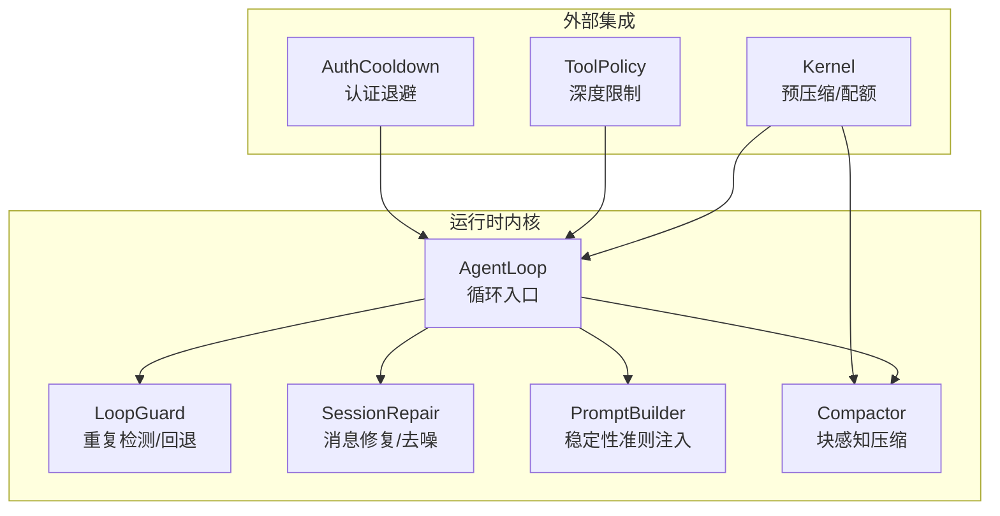
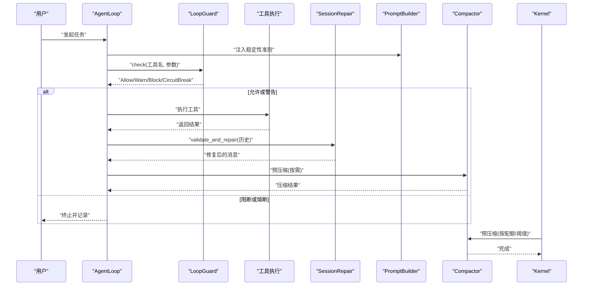
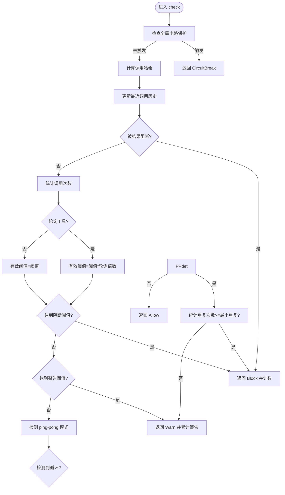
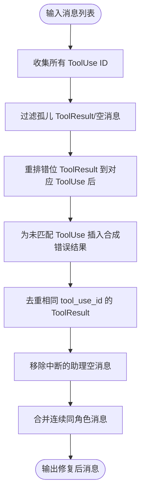
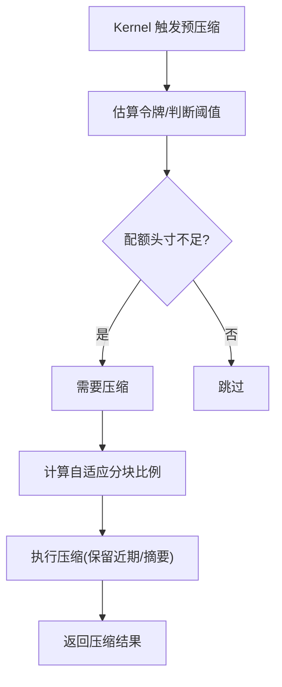
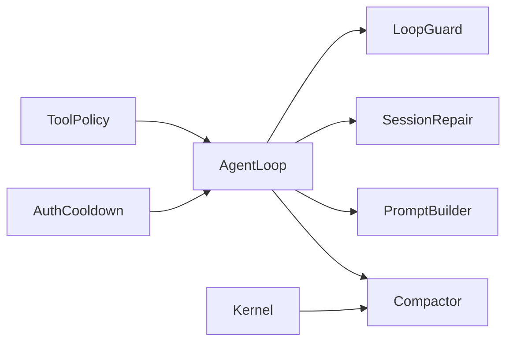

# 智能体循环稳定性

<cite>
**本文引用的文件**
- [loop_guard.rs](file://crates/openfang-runtime/src/loop_guard.rs)
- [session_repair.rs](file://crates/openfang-runtime/src/session_repair.rs)
- [agent_loop.rs](file://crates/openfang-runtime/src/agent_loop.rs)
- [prompt_builder.rs](file://crates/openfang-runtime/src/prompt_builder.rs)
- [compactor.rs](file://crates/openfang-runtime/src/compactor.rs)
- [kernel.rs](file://crates/openfang-kernel/src/kernel.rs)
- [tool_policy.rs](file://crates/openfang-runtime/src/tool_policy.rs)
- [auth_cooldown.rs](file://crates/openfang-runtime/src/auth_cooldown.rs)
</cite>

## 目录
1. [引言](#引言)
2. [项目结构](#项目结构)
3. [核心组件](#核心组件)
4. [架构总览](#架构总览)
5. [详细组件分析](#详细组件分析)
6. [依赖关系分析](#依赖关系分析)
7. [性能考量](#性能考量)
8. [故障排查指南](#故障排查指南)
9. [结论](#结论)
10. [附录](#附录)

## 引言
本文件面向 OpenFang 智能体循环稳定性保障体系，系统性阐述多重稳定化层的设计与实现，包括：
- LoopGuard（工具调用重复检测）
- SessionRepair（消息历史修复）
- ToolResultTruncation（工具输出截断）
- ToolTimeout（工具超时保护）
- MaxContinuations（最大续传次数限制）
- Inter-AgentDepthLimit（智能体调用深度限制）
- StabilityGuidelines（稳定性准则注入）
- BlockAwareCompaction（块感知压缩）

文档将逐项说明阈值配置、检测算法与防护策略，并提供诊断方法与调优建议，帮助在复杂场景下维持智能体循环的鲁棒性与可预测性。

## 项目结构
OpenFang 的稳定性相关能力主要集中在运行时内核模块中，围绕“工具执行—消息上下文—会话压缩”三轴构建：
- 运行时稳定性：LoopGuard、SessionRepair、PromptBuilder 注入、Compactor
- 循环控制：AgentLoop 中对 LoopGuard 的初始化与全局电路保护
- 超时与配额：Kernel 在 LLM 前触发预压缩，结合配额头寸判断
- 工具深度限制：ToolPolicy 对工具调用深度进行过滤
- 认证与退避：AuthCooldown 提供认证错误的指数退避

图表来源
- [agent_loop.rs:331-339](file://crates/openfang-runtime/src/agent_loop.rs#L331-L339)
- [loop_guard.rs:102-139](file://crates/openfang-runtime/src/loop_guard.rs#L102-L139)
- [session_repair.rs:35-46](file://crates/openfang-runtime/src/session_repair.rs#L35-L46)
- [prompt_builder.rs:471-480](file://crates/openfang-runtime/src/prompt_builder.rs#L471-L480)
- [compactor.rs:721-762](file://crates/openfang-runtime/src/compactor.rs#L721-L762)
- [kernel.rs:2258-2283](file://crates/openfang-kernel/src/kernel.rs#L2258-L2283)
- [tool_policy.rs:414-450](file://crates/openfang-runtime/src/tool_policy.rs#L414-L450)
- [auth_cooldown.rs:147-160](file://crates/openfang-runtime/src/auth_cooldown.rs#L147-L160)

章节来源
- [agent_loop.rs:331-339](file://crates/openfang-runtime/src/agent_loop.rs#L331-L339)
- [compactor.rs:721-762](file://crates/openfang-runtime/src/compactor.rs#L721-L762)

## 核心组件
本节概述各稳定化层的职责与交互方式，便于快速定位问题与优化方向。

- LoopGuard：对单次循环内的工具调用进行重复检测、结果重复检测、轮询工具退避、全局电路保护与 ping-pong 检测，提供分级处置（允许/警告/阻断/全回路熔断）。
- SessionRepair：在发送给 LLM 前修复消息历史，处理错位/孤儿/重复/空消息等异常，确保 API 合法性与上下文一致性。
- ToolResultTruncation：对工具输出进行安全截断与清洗，防止恶意内容与超长文本进入上下文。
- ToolTimeout：通过工具执行前的检查与后置统计，结合回退策略与全局电路保护，避免无限等待。
- MaxContinuations：在 AgentLoop 中根据自主迭代上限动态扩大全局电路保护阈值，避免过早熔断。
- Inter-AgentDepthLimit：基于 ToolPolicy 的深度过滤，限制跨智能体调用链的递归深度。
- StabilityGuidelines：在提示词中注入稳定性准则，指导模型行为，降低循环风险。
- BlockAwareCompaction：在 Kernel 预压缩阶段，依据消息长度与令牌估算，采用自适应分块比例与阈值，减少上下文膨胀。

章节来源
- [loop_guard.rs:1-19](file://crates/openfang-runtime/src/loop_guard.rs#L1-L19)
- [session_repair.rs:1-13](file://crates/openfang-runtime/src/session_repair.rs#L1-L13)
- [prompt_builder.rs:471-480](file://crates/openfang-runtime/src/prompt_builder.rs#L471-L480)
- [compactor.rs:721-762](file://crates/openfang-runtime/src/compactor.rs#L721-L762)
- [agent_loop.rs:331-339](file://crates/openfang-runtime/src/agent_loop.rs#L331-L339)
- [tool_policy.rs:414-450](file://crates/openfang-runtime/src/tool_policy.rs#L414-L450)
- [kernel.rs:2258-2283](file://crates/openfang-kernel/src/kernel.rs#L2258-L2283)

## 架构总览
下图展示一次智能体循环中的稳定性保障路径：从工具调用到消息修复再到压缩与熔断保护。

图表来源
- [agent_loop.rs:331-339](file://crates/openfang-runtime/src/agent_loop.rs#L331-L339)
- [loop_guard.rs:146-244](file://crates/openfang-runtime/src/loop_guard.rs#L146-L244)
- [session_repair.rs:35-46](file://crates/openfang-runtime/src/session_repair.rs#L35-L46)
- [prompt_builder.rs:471-480](file://crates/openfang-runtime/src/prompt_builder.rs#L471-L480)
- [compactor.rs:721-762](file://crates/openfang-runtime/src/compactor.rs#L721-L762)
- [kernel.rs:2258-2283](file://crates/openfang-kernel/src/kernel.rs#L2258-L2283)

## 详细组件分析

### LoopGuard（工具调用重复检测）
- 设计目标：防止智能体陷入“同一工具反复调用”或“相同结果不断返回”的循环；对轮询类工具提供宽松阈值与回退建议；检测 A-B-A-B 或 A-B-C-A-B-C 的 ping-pong 循环。
- 关键阈值与配置
  - 重复调用警告阈值、阻断阈值、全局电路保护阈值、轮询工具阈值倍数、结果重复警告阈值、结果重复阻断阈值、ping-pong 最小重复次数、单调用最大警告次数。
  - 默认值见配置结构字段定义。
- 算法要点
  - 使用 SHA-256 对“工具名+参数序列化字符串”进行哈希，作为调用指纹。
  - 维护最近 HISTORY_SIZE 条调用历史，检测长度为 2/3 的循环模式。
  - 结果重复检测：对“工具名+参数+结果截断”做哈希，统计相同结果对出现次数，达到阈值后阻断后续同调用。
  - 轮询工具识别：基于工具名与参数关键词（如 status/poll/wait 等），对轮询类调用采用更高阈值倍数。
  - 回退建议：为轮询调用提供指数级回退时间表，避免过于频繁查询。
- 防护策略
  - 允许：直接放行。
  - 警告：附加提示信息，建议改变参数或尝试不同方法。
  - 阻断：跳过当前调用，记录阻断次数。
  - 全回路熔断：当总调用数超过全局阈值，立即终止本次循环。
- 统计快照：暴露总调用数、唯一调用数、阻断数、是否检测到 ping-pong、最频繁工具及次数。

图表来源
- [loop_guard.rs:146-244](file://crates/openfang-runtime/src/loop_guard.rs#L146-L244)
- [loop_guard.rs:224-241](file://crates/openfang-runtime/src/loop_guard.rs#L224-L241)
- [loop_guard.rs:330-360](file://crates/openfang-runtime/src/loop_guard.rs#L330-L360)
- [loop_guard.rs:362-444](file://crates/openfang-runtime/src/loop_guard.rs#L362-L444)
- [loop_guard.rs:446-498](file://crates/openfang-runtime/src/loop_guard.rs#L446-L498)

章节来源
- [loop_guard.rs:35-69](file://crates/openfang-runtime/src/loop_guard.rs#L35-L69)
- [loop_guard.rs:146-244](file://crates/openfang-runtime/src/loop_guard.rs#L146-L244)
- [loop_guard.rs:246-281](file://crates/openfang-runtime/src/loop_guard.rs#L246-L281)
- [loop_guard.rs:283-304](file://crates/openfang-runtime/src/loop_guard.rs#L283-L304)
- [loop_guard.rs:306-328](file://crates/openfang-runtime/src/loop_guard.rs#L306-L328)
- [loop_guard.rs:330-360](file://crates/openfang-runtime/src/loop_guard.rs#L330-L360)
- [loop_guard.rs:362-444](file://crates/openfang-runtime/src/loop_guard.rs#L362-L444)
- [loop_guard.rs:446-498](file://crates/openfang-runtime/src/loop_guard.rs#L446-L498)

### SessionRepair（消息历史修复）
- 设计目标：在发送给 LLM 前，清理并修复消息历史，保证 API 合法性与上下文一致性。
- 修复范围
  - 清理孤儿 ToolResult（无匹配 ToolUse）、空消息、重复 ToolResult、错位 ToolResult（不在其 ToolUse 后面）、中断的助理消息（仅空内容）。
  - 合并连续同角色消息，减少冗余。
  - 对缺失 ToolResult 的 ToolUse 插入合成错误结果，避免验证失败。
  - 对 ToolResult 内容进行安全截断与注入标记清洗。
- 统计指标：孤儿结果移除数、空消息移除数、合并次数、重排次数、插入合成结果数、重复移除数。

图表来源
- [session_repair.rs:35-46](file://crates/openfang-runtime/src/session_repair.rs#L35-L46)
- [session_repair.rs:180-320](file://crates/openfang-runtime/src/session_repair.rs#L180-L320)
- [session_repair.rs:322-410](file://crates/openfang-runtime/src/session_repair.rs#L322-L410)
- [session_repair.rs:412-443](file://crates/openfang-runtime/src/session_repair.rs#L412-L443)
- [session_repair.rs:445-486](file://crates/openfang-runtime/src/session_repair.rs#L445-L486)
- [session_repair.rs:488-501](file://crates/openfang-runtime/src/session_repair.rs#L488-L501)
- [session_repair.rs:503-528](file://crates/openfang-runtime/src/session_repair.rs#L503-L528)

章节来源
- [session_repair.rs:18-34](file://crates/openfang-runtime/src/session_repair.rs#L18-L34)
- [session_repair.rs:35-46](file://crates/openfang-runtime/src/session_repair.rs#L35-L46)
- [session_repair.rs:180-320](file://crates/openfang-runtime/src/session_repair.rs#L180-L320)
- [session_repair.rs:322-410](file://crates/openfang-runtime/src/session_repair.rs#L322-L410)
- [session_repair.rs:412-443](file://crates/openfang-runtime/src/session_repair.rs#L412-L443)
- [session_repair.rs:445-486](file://crates/openfang-runtime/src/session_repair.rs#L445-L486)
- [session_repair.rs:488-501](file://crates/openfang-runtime/src/session_repair.rs#L488-L501)
- [session_repair.rs:503-528](file://crates/openfang-runtime/src/session_repair.rs#L503-L528)

### ToolResultTruncation（工具输出截断）
- 设计目标：限制工具输出长度、去除潜在恶意内容、防止注入标记污染上下文。
- 截断策略
  - 最大长度限制（默认约 10K 字符）。
  - 去除长串 base64 片段（>1000 字符）。
  - 移除常见注入标记（如系统提示标记、忽略指令等）。
  - 超长时添加截断说明。
- 应用点：在 SessionRepair 中对 ToolResult 内容进行清洗与截断，确保进入 LLM 的内容安全可控。

章节来源
- [session_repair.rs:503-528](file://crates/openfang-runtime/src/session_repair.rs#L503-L528)
- [session_repair.rs:530-563](file://crates/openfang-runtime/src/session_repair.rs#L530-L563)
- [session_repair.rs:570-612](file://crates/openfang-runtime/src/session_repair.rs#L570-L612)

### ToolTimeout（工具超时保护）
- 设计目标：避免工具执行卡死导致循环停滞；结合回退策略与全局电路保护，防止无限等待。
- 实现要点
  - 轮询工具回退：通过 LoopGuard 的回退时间表，逐步增加等待间隔。
  - 全局电路保护：当总调用数超过阈值，直接熔断整个循环。
  - 与认证退避协同：认证错误时延长冷却时间，降低重试压力。
- 协同组件
  - LoopGuard 的 get_poll_backoff 与 circuit-break。
  - AuthCooldown 的指数退避策略。

章节来源
- [loop_guard.rs:283-304](file://crates/openfang-runtime/src/loop_guard.rs#L283-L304)
- [loop_guard.rs:149-157](file://crates/openfang-runtime/src/loop_guard.rs#L149-L157)
- [auth_cooldown.rs:147-160](file://crates/openfang-runtime/src/auth_cooldown.rs#L147-L160)

### MaxContinuations（最大续传次数限制）
- 设计目标：限制单次循环内的最大迭代次数，避免长时间占用资源。
- 实现要点
  - AgentLoop 根据自主配置的最大迭代次数，动态调整 LoopGuard 的全局电路保护阈值，确保不会过早熔断。
  - 达到上限时触发钩子事件并保存会话，避免状态丢失。

章节来源
- [agent_loop.rs:324-339](file://crates/openfang-runtime/src/agent_loop.rs#L324-L339)
- [agent_loop.rs:897-917](file://crates/openfang-runtime/src/agent_loop.rs#L897-L917)

### Inter-AgentDepthLimit（智能体调用深度限制）
- 设计目标：限制跨智能体调用链的递归深度，防止无限 spawn 或深层嵌套。
- 实现要点
  - 基于 ToolPolicy 的深度过滤函数，按当前深度与最大深度决定是否允许某些工具（如 agent_spawn）继续调用。
  - 叶子深度不允许 spawn，以避免无限扩展。

章节来源
- [tool_policy.rs:414-450](file://crates/openfang-runtime/src/tool_policy.rs#L414-L450)

### StabilityGuidelines（稳定性准则注入）
- 设计目标：在提示词中注入稳定性准则，引导模型行为，降低循环与重复调用概率。
- 内容要点
  - 不要重复使用相同参数的工具调用。
  - 出错时先分析再重试。
  - 优先精准调用而非宽泛调用。
  - 若多次尝试仍无法完成，应解释原因而非继续循环。
  - 同一工具同参数最多调用 3 次。
  - 对无需回复的消息返回固定标记。

章节来源
- [prompt_builder.rs:471-480](file://crates/openfang-runtime/src/prompt_builder.rs#L471-L480)

### BlockAwareCompaction（块感知压缩）
- 设计目标：在上下文接近阈值前主动压缩，减少消息数量与长度，缓解上下文溢出风险。
- 实现要点
  - 基于消息数量、令牌估算、配额头寸与自适应分块比例，决定是否需要压缩。
  - 自动选择较大的分块比例用于短消息，较小比例用于长消息，平衡吞吐与质量。
  - 预压缩在 Kernel 的 LLM 调用前执行，避免上下文溢出错误。

图表来源
- [kernel.rs:2258-2283](file://crates/openfang-kernel/src/kernel.rs#L2258-L2283)
- [compactor.rs:721-762](file://crates/openfang-runtime/src/compactor.rs#L721-L762)
- [compactor.rs:977-1036](file://crates/openfang-runtime/src/compactor.rs#L977-L1036)

章节来源
- [kernel.rs:2258-2283](file://crates/openfang-kernel/src/kernel.rs#L2258-L2283)
- [compactor.rs:721-762](file://crates/openfang-runtime/src/compactor.rs#L721-L762)
- [compactor.rs:977-1036](file://crates/openfang-runtime/src/compactor.rs#L977-L1036)

## 依赖关系分析
- AgentLoop 依赖 LoopGuard 进行调用控制，依赖 PromptBuilder 注入稳定性准则，依赖 SessionRepair 修复消息，依赖 Compactor 进行压缩。
- Kernel 在 LLM 调用前触发 Compactor，同时监控配额头寸，避免上下文溢出。
- ToolPolicy 与 LoopGuard 协作，前者限制深度，后者限制重复与循环。
- AuthCooldown 与 LoopGuard 协同，前者提供退避，后者提供回退与熔断。

图表来源
- [agent_loop.rs:331-339](file://crates/openfang-runtime/src/agent_loop.rs#L331-L339)
- [kernel.rs:2258-2283](file://crates/openfang-kernel/src/kernel.rs#L2258-L2283)
- [tool_policy.rs:414-450](file://crates/openfang-runtime/src/tool_policy.rs#L414-L450)
- [auth_cooldown.rs:147-160](file://crates/openfang-runtime/src/auth_cooldown.rs#L147-L160)

章节来源
- [agent_loop.rs:331-339](file://crates/openfang-runtime/src/agent_loop.rs#L331-L339)
- [kernel.rs:2258-2283](file://crates/openfang-kernel/src/kernel.rs#L2258-L2283)
- [tool_policy.rs:414-450](file://crates/openfang-runtime/src/tool_policy.rs#L414-L450)
- [auth_cooldown.rs:147-160](file://crates/openfang-runtime/src/auth_cooldown.rs#L147-L160)

## 性能考量
- 哈希与统计开销：LoopGuard 使用哈希与计数器，时间复杂度近似 O(1)，空间随调用种类增长；建议合理设置 HISTORY_SIZE 与阈值，避免内存膨胀。
- 修复成本：SessionRepair 需要扫描消息、建立索引与重排，整体为 O(n)；对长历史消息建议配合压缩使用。
- 压缩效率：Compactor 的自适应分块比例与阈值在不同消息长度下表现更佳，建议结合实际消息特征调参。
- 退避与冷却：指数退避与认证冷却可显著降低无效重试，提升整体吞吐与稳定性。

## 故障排查指南
- 症状：循环卡住、工具重复调用、LLM 报错或响应异常
  - 排查步骤
    - 检查 LoopGuard 统计（最频繁工具、是否检测到 ping-pong、阻断数），确认是否存在重复或循环。
    - 查看 SessionRepair 统计（孤儿结果、重排、插入合成结果、重复移除），定位消息历史异常。
    - 检查 ToolResult 是否过长或包含注入标记，必要时调整截断阈值。
    - 观察 Kernel 的预压缩触发频率与压缩比例，评估上下文压力。
    - 审视 ToolPolicy 的深度限制是否误伤合法调用。
- 调优建议
  - 适度提高轮询工具阈值倍数，降低误报；对高风险工具降低阈值。
  - 调整全局电路保护阈值以适配长任务；结合 MaxContinuations 设置合理上限。
  - 合理设置 Compactor 的阈值与自适应比例，兼顾上下文密度与质量。
  - 配合 AuthCooldown 的退避策略，减少认证错误引发的抖动。

章节来源
- [loop_guard.rs:306-328](file://crates/openfang-runtime/src/loop_guard.rs#L306-L328)
- [session_repair.rs:18-34](file://crates/openfang-runtime/src/session_repair.rs#L18-L34)
- [compactor.rs:721-762](file://crates/openfang-runtime/src/compactor.rs#L721-L762)
- [tool_policy.rs:414-450](file://crates/openfang-runtime/src/tool_policy.rs#L414-L450)
- [auth_cooldown.rs:147-160](file://crates/openfang-runtime/src/auth_cooldown.rs#L147-L160)

## 结论
OpenFang 的稳定性保障体系通过“调用控制—消息修复—内容截断—上下文压缩—深度限制—准则注入—退避冷却”七维协同，形成闭环保护。实践中应结合任务特征与资源约束，动态调整阈值与策略，在稳定性与效果之间取得平衡。

## 附录
- 配置参考
  - LoopGuardConfig：重复警告/阻断阈值、全局电路保护、轮询倍数、结果重复阈值、ping-pong 最小重复、单调用最大警告次数。
  - CompactionConfig：消息阈值、保留近期数、最大摘要长度、令牌阈值比例、上下文窗口、分块比例范围。
  - ToolPolicy：按深度过滤工具集合，控制跨智能体调用深度。
  - PromptBuilder：稳定性准则注入，规范模型行为。
  - AuthCooldown：认证错误指数退避，避免雪崩式重试。

章节来源
- [loop_guard.rs:35-69](file://crates/openfang-runtime/src/loop_guard.rs#L35-L69)
- [compactor.rs:721-762](file://crates/openfang-runtime/src/compactor.rs#L721-L762)
- [tool_policy.rs:414-450](file://crates/openfang-runtime/src/tool_policy.rs#L414-L450)
- [prompt_builder.rs:471-480](file://crates/openfang-runtime/src/prompt_builder.rs#L471-L480)
- [auth_cooldown.rs:147-160](file://crates/openfang-runtime/src/auth_cooldown.rs#L147-L160)