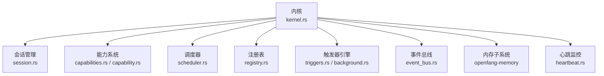
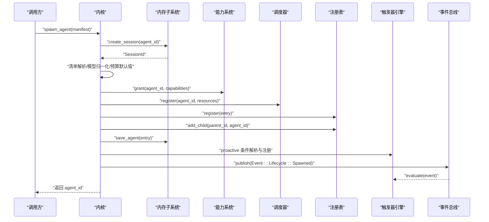
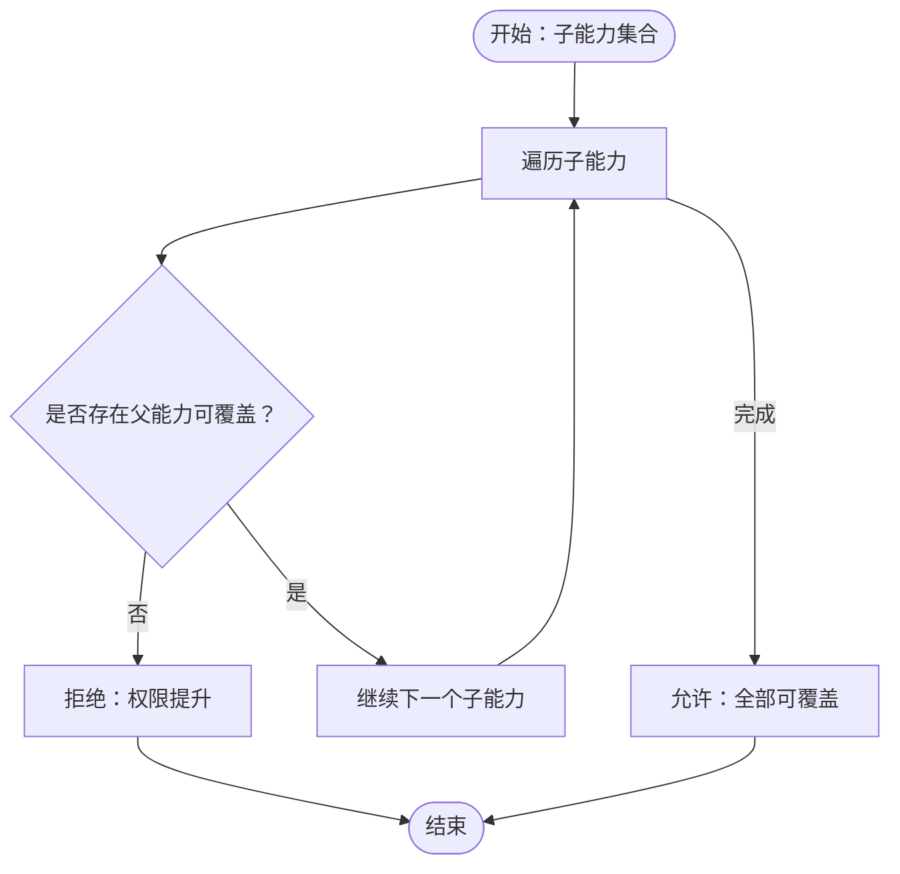
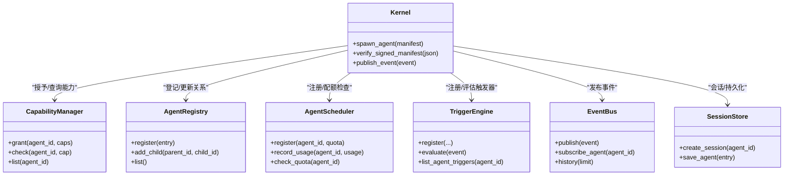

# 智能体启动流程

<cite>
**本文档引用的文件**
- [kernel.rs](file://crates/openfang-kernel/src/kernel.rs)
- [capability.rs](file://crates/openfang-types/src/capability.rs)
- [capabilities.rs](file://crates/openfang-kernel/src/capabilities.rs)
- [registry.rs](file://crates/openfang-kernel/src/registry.rs)
- [scheduler.rs](file://crates/openfang-kernel/src/scheduler.rs)
- [triggers.rs](file://crates/openfang-kernel/src/triggers.rs)
- [background.rs](file://crates/openfang-kernel/src/background.rs)
- [event_bus.rs](file://crates/openfang-kernel/src/event_bus.rs)
- [session.rs](file://crates/openfang-memory/src/session.rs)
- [heartbeat.rs](file://crates/openfang-kernel/src/heartbeat.rs)
</cite>

## 目录
1. [简介](#简介)
2. [项目结构](#项目结构)
3. [核心组件](#核心组件)
4. [架构总览](#架构总览)
5. [详细组件分析](#详细组件分析)
6. [依赖关系分析](#依赖关系分析)
7. [性能考量](#性能考量)
8. [故障排查指南](#故障排查指南)
9. [结论](#结论)

## 简介
本文件面向智能体启动流程，系统性梳理从清单解析到生命周期事件发布的完整过程，并重点阐述 capability 继承验证机制、权限提升防护与并发安全保证。同时提供启动失败的常见原因与解决方案，以及启动流程中的错误回滚机制说明。

## 项目结构
OpenFang 的智能体启动由内核（kernel）协调多个子系统完成，关键路径包括：会话创建与持久化、清单解析与模型配置归一化、能力授予与继承校验、调度器注册、注册表登记、父子关系维护、持久化存储、主动触发器注册、事件发布与触发器评估等。

图表来源
- [kernel.rs](file://crates/openfang-kernel/src/kernel.rs)
- [session.rs](file://crates/openfang-memory/src/session.rs)
- [capabilities.rs](file://crates/openfang-kernel/src/capabilities.rs)
- [capability.rs](file://crates/openfang-types/src/capability.rs)
- [scheduler.rs](file://crates/openfang-kernel/src/scheduler.rs)
- [registry.rs](file://crates/openfang-kernel/src/registry.rs)
- [triggers.rs](file://crates/openfang-kernel/src/triggers.rs)
- [background.rs](file://crates/openfang-kernel/src/background.rs)
- [event_bus.rs](file://crates/openfang-kernel/src/event_bus.rs)
- [heartbeat.rs](file://crates/openfang-kernel/src/heartbeat.rs)

章节来源
- [kernel.rs](file://crates/openfang-kernel/src/kernel.rs)

## 核心组件
- 内核（Kernel）：负责启动流程编排，串联会话、能力、调度、注册表、触发器、事件总线与内存子系统。
- 能力系统（CapabilityManager + Capability）：基于清单授予能力，执行 capability 继承验证，防止权限提升。
- 注册表（AgentRegistry）：维护所有已注册智能体的状态、父子关系与索引。
- 调度器（AgentScheduler）：跟踪资源配额与使用量，保障并发与预算约束。
- 触发器引擎（TriggerEngine + BackgroundExecutor）：支持周期性与事件驱动的主动触发。
- 事件总线（EventBus）：广播生命周期事件并同步评估触发器。
- 会话与内存（SessionStore + MemorySubstrate）：确保会话与智能体状态持久化。

章节来源
- [kernel.rs](file://crates/openfang-kernel/src/kernel.rs)
- [capability.rs](file://crates/openfang-types/src/capability.rs)
- [capabilities.rs](file://crates/openfang-kernel/src/capabilities.rs)
- [registry.rs](file://crates/openfang-kernel/src/registry.rs)
- [scheduler.rs](file://crates/openfang-kernel/src/scheduler.rs)
- [triggers.rs](file://crates/openfang-kernel/src/triggers.rs)
- [background.rs](file://crates/openfang-kernel/src/background.rs)
- [event_bus.rs](file://crates/openfang-kernel/src/event_bus.rs)
- [session.rs](file://crates/openfang-memory/src/session.rs)

## 架构总览
下图展示一次典型智能体启动的关键步骤与组件交互：

图表来源
- [kernel.rs](file://crates/openfang-kernel/src/kernel.rs)
- [session.rs](file://crates/openfang-memory/src/session.rs)
- [capabilities.rs](file://crates/openfang-kernel/src/capabilities.rs)
- [scheduler.rs](file://crates/openfang-kernel/src/scheduler.rs)
- [registry.rs](file://crates/openfang-kernel/src/registry.rs)
- [triggers.rs](file://crates/openfang-kernel/src/triggers.rs)
- [event_bus.rs](file://crates/openfang-kernel/src/event_bus.rs)

## 详细组件分析

### 启动流程 11 步骤详解
以下为从清单到事件发布的完整步骤，对应内核中的实际实现位置：

1) **ID 与会话生成**
- 使用固定或默认 ID；创建会话并获取 SessionId，确保后续注册与数据库一致。
- 关键实现：[kernel.rs](file://crates/openfang-kernel/src/kernel.rs)

2) **会话创建**
- 创建空会话并持久化，确保跨重启可恢复。
- 关键实现：[session.rs](file://crates/openfang-memory/src/session.rs)

3) **清单解析**
- 执行 exec_policy 叠加、默认模型覆盖、模型目录别名规范化、API 密钥环境变量解析、模型前缀剥离、预算默认值应用等。
- 关键实现：[kernel.rs](file://crates/openfang-kernel/src/kernel.rs)

4) **权限继承验证**
- 将清单转换为能力列表后授予；通过 capability 继承验证，确保子能力是父能力的子集，防止权限提升。
- 关键实现：[capability.rs](file://crates/openfang-types/src/capability.rs)，[capabilities.rs](file://crates/openfang-kernel/src/capabilities.rs)

5) **能力授予**
- 将计算出的能力授予目标智能体，供后续检查使用。
- 关键实现：[capabilities.rs](file://crates/openfang-kernel/src/capabilities.rs)

6) **调度器注册**
- 基于资源配额在调度器中登记，用于令牌与工具调用限额控制。
- 关键实现：[scheduler.rs](file://crates/openfang-kernel/src/scheduler.rs)

7) **注册表登记**
- 构造 AgentEntry 并写入注册表，建立名称与标签索引。
- 关键实现：[registry.rs](file://crates/openfang-kernel/src/registry.rs)

8) **持久化存储**
- 将 AgentEntry 持久化至 SQLite，确保重启后仍可恢复。
- 关键实现：[kernel.rs](file://crates/openfang-kernel/src/kernel.rs)

9) **父子关系更新**
- 若存在父智能体，将子智能体加入父的 children 列表。
- 关键实现：[registry.rs](file://crates/openfang-kernel/src/registry.rs)

10) **主动触发器注册**
- 对于 Proactive 模式，解析条件字符串并注册触发器，形成事件驱动的自动激活。
- 关键实现：[background.rs](file://crates/openfang-kernel/src/background.rs)，[triggers.rs](file://crates/openfang-kernel/src/triggers.rs)

11) **事件发布与触发器评估**
- 发布生命周期事件（Spawned），同步评估触发器，匹配的监听者将收到消息。
- 关键实现：[event_bus.rs](file://crates/openfang-kernel/src/event_bus.rs)，[triggers.rs](file://crates/openfang-kernel/src/triggers.rs)

章节来源
- [kernel.rs](file://crates/openfang-kernel/src/kernel.rs)
- [capability.rs](file://crates/openfang-types/src/capability.rs)
- [capabilities.rs](file://crates/openfang-kernel/src/capabilities.rs)
- [registry.rs](file://crates/openfang-kernel/src/registry.rs)
- [scheduler.rs](file://crates/openfang-kernel/src/scheduler.rs)
- [triggers.rs](file://crates/openfang-kernel/src/triggers.rs)
- [background.rs](file://crates/openfang-kernel/src/background.rs)
- [event_bus.rs](file://crates/openfang-kernel/src/event_bus.rs)
- [session.rs](file://crates/openfang-memory/src/session.rs)

### capability 继承验证机制
- 能力匹配规则：支持精确匹配、通配符“*”、前后缀匹配与中间通配符，数值型能力采用上下界比较。
- 继承验证：子智能体的能力集合必须被父智能体的能力集合完全覆盖，否则拒绝创建，防止权限提升。
- 典型场景：父仅授予“/data/*”读取，子请求“*”读取或“shell_exec”将被拒绝。

图表来源
- [capability.rs](file://crates/openfang-types/src/capability.rs)

章节来源
- [capability.rs](file://crates/openfang-types/src/capability.rs)

### 权限提升防护与并发安全保证
- 权限提升防护：通过继承验证与能力匹配规则，严格限制子智能体能力范围。
- 并发安全：
  - 注册表、能力表、使用追踪等均采用并发安全的数据结构（DashMap）。
  - 触发器评估与事件发布采用广播通道，避免共享可变状态竞争。
  - 后台执行器引入全局信号量限制并发 LLM 调用，避免资源争抢。
- 心跳与恢复：心跳监控检测无响应智能体并进行自动恢复尝试，超过最大次数标记为终止。

章节来源
- [registry.rs](file://crates/openfang-kernel/src/registry.rs)
- [capabilities.rs](file://crates/openfang-kernel/src/capabilities.rs)
- [scheduler.rs](file://crates/openfang-kernel/src/scheduler.rs)
- [event_bus.rs](file://crates/openfang-kernel/src/event_bus.rs)
- [background.rs](file://crates/openfang-kernel/src/background.rs)
- [heartbeat.rs](file://crates/openfang-kernel/src/heartbeat.rs)

### 启动失败的常见原因与解决方案
- 清单解析失败
  - 原因：模型别名未在目录中找到、API 密钥环境变量缺失。
  - 解决：确认模型目录与密钥配置，或显式指定 provider/model/base_url。
- 权限继承拒绝
  - 原因：子能力超出父能力覆盖范围。
  - 解决：调整父智能体授权范围或降低子智能体需求。
- 注册冲突
  - 原因：同名智能体已存在。
  - 解决：更换名称或删除旧实例。
- 资源配额不足
  - 原因：令牌/工具调用限额过低。
  - 解决：提高资源配额或清理历史用量。
- 触发器条件格式错误
  - 原因：Proactive 条件字符串不被识别。
  - 解决：参考支持格式（如 event:*、memory:*、all）修正。
- 会话/持久化异常
  - 原因：数据库写入失败或锁竞争。
  - 解决：检查磁盘空间与权限，重试或重启内核。

章节来源
- [kernel.rs](file://crates/openfang-kernel/src/kernel.rs)
- [capability.rs](file://crates/openfang-types/src/capability.rs)
- [registry.rs](file://crates/openfang-kernel/src/registry.rs)
- [scheduler.rs](file://crates/openfang-kernel/src/scheduler.rs)
- [background.rs](file://crates/openfang-kernel/src/background.rs)
- [session.rs](file://crates/openfang-memory/src/session.rs)

### 错误回滚机制
- 启动阶段的回滚点：若任一步骤失败（如注册表登记、持久化、触发器注册），内核当前实现以一次性失败告终，不会撤销已执行步骤。
- 运行期恢复：心跳监控检测到崩溃后，按冷却策略与最大尝试次数进行自动恢复，成功则清除恢复记录，失败达到上限则标记为终止并发布系统事件。
- 建议：在上层调用中捕获错误并采取幂等重试策略，必要时清理临时会话与部分已登记项。

章节来源
- [kernel.rs](file://crates/openfang-kernel/src/kernel.rs)
- [heartbeat.rs](file://crates/openfang-kernel/src/heartbeat.rs)

## 依赖关系分析

图表来源
- [kernel.rs](file://crates/openfang-kernel/src/kernel.rs)
- [capabilities.rs](file://crates/openfang-kernel/src/capabilities.rs)
- [registry.rs](file://crates/openfang-kernel/src/registry.rs)
- [scheduler.rs](file://crates/openfang-kernel/src/scheduler.rs)
- [triggers.rs](file://crates/openfang-kernel/src/triggers.rs)
- [event_bus.rs](file://crates/openfang-kernel/src/event_bus.rs)
- [session.rs](file://crates/openfang-memory/src/session.rs)

章节来源
- [kernel.rs](file://crates/openfang-kernel/src/kernel.rs)

## 性能考量
- 后台任务启动抖动：内核在启动非反应式智能体时采用 500ms 间隔错峰，避免共享服务限流风暴。
- 并发 LLM 调用限制：全局信号量限制后台 LLM 并发数，防止资源耗尽。
- 使用窗口重置：调度器每小时重置令牌统计，避免长期累积导致的误判。
- 事件历史环形缓冲：事件总线保留最近 1000 条事件，兼顾可观测性与内存占用。

章节来源
- [kernel.rs](file://crates/openfang-kernel/src/kernel.rs)
- [background.rs](file://crates/openfang-kernel/src/background.rs)
- [scheduler.rs](file://crates/openfang-kernel/src/scheduler.rs)
- [event_bus.rs](file://crates/openfang-kernel/src/event_bus.rs)

## 故障排查指南
- 启动后立即崩溃
  - 检查心跳日志与恢复记录，确认是否触发自动恢复及失败次数。
  - 关注系统事件（健康检查失败/恢复尝试）。
- 无法接收触发消息
  - 确认触发器条件格式正确（event:*, memory:*, all）。
  - 检查事件总线订阅与广播链路。
- 会话丢失或重复
  - 确保会话创建与注册顺序一致，避免并发写入冲突。
- 权限相关错误
  - 核对能力授予与继承验证结果，必要时调整父智能体授权。

章节来源
- [heartbeat.rs](file://crates/openfang-kernel/src/heartbeat.rs)
- [triggers.rs](file://crates/openfang-kernel/src/triggers.rs)
- [event_bus.rs](file://crates/openfang-kernel/src/event_bus.rs)
- [session.rs](file://crates/openfang-memory/src/session.rs)
- [capability.rs](file://crates/openfang-types/src/capability.rs)

## 结论
OpenFang 的智能体启动流程以能力继承验证为核心安全基线，结合并发安全的数据结构与事件驱动的触发机制，实现了可控、可观测且可恢复的启动体验。通过严格的权限边界与资源配额控制，有效降低了权限提升与资源滥用风险；通过心跳与恢复策略，提升了系统的鲁棒性。建议在生产环境中配合完善的监控与审计，持续优化启动参数与触发条件，确保稳定运行。