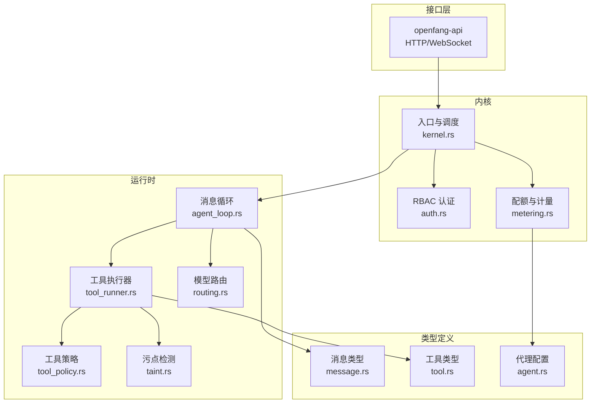
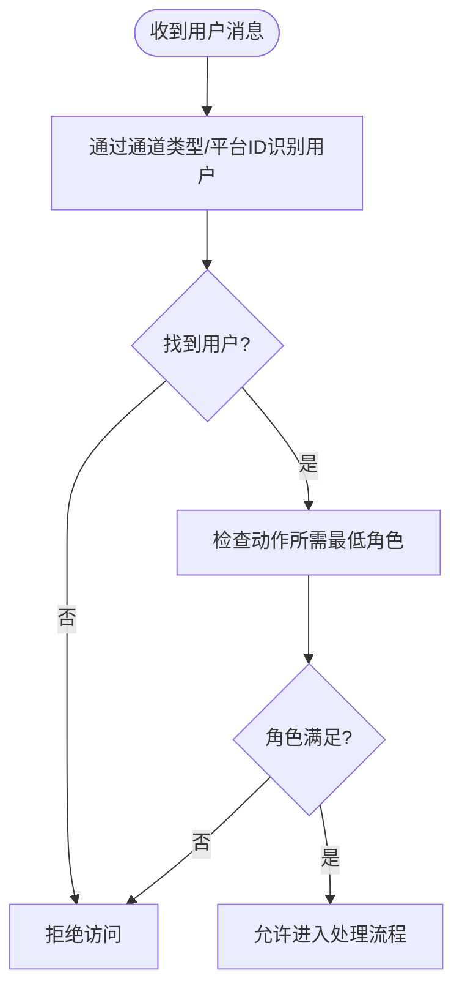
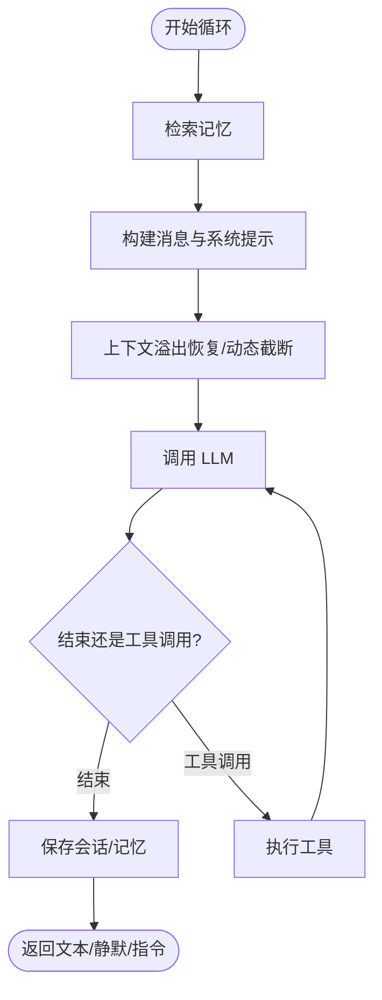
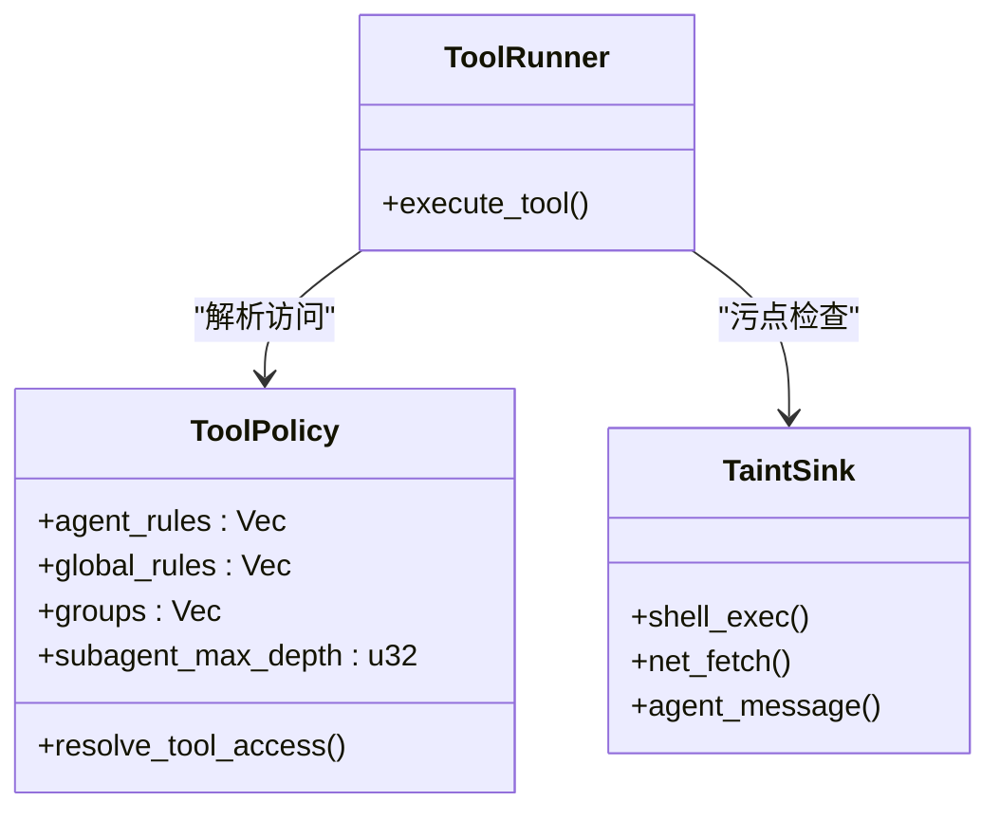
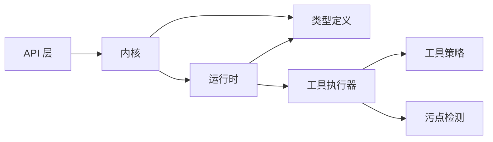

# 智能体消息处理

<cite>
**本文引用的文件**
- [lib.rs](file://crates/openfang-api/src/lib.rs)
- [lib.rs](file://crates/openfang-runtime/src/lib.rs)
- [lib.rs](file://crates/openfang-kernel/src/lib.rs)
- [message.rs](file://crates/openfang-types/src/message.rs)
- [tool.rs](file://crates/openfang-types/src/tool.rs)
- [agent_loop.rs](file://crates/openfang-runtime/src/agent_loop.rs)
- [tool_runner.rs](file://crates/openfang-runtime/src/tool_runner.rs)
- [routing.rs](file://crates/openfang-runtime/src/routing.rs)
- [auth.rs](file://crates/openfang-kernel/src/auth.rs)
- [metering.rs](file://crates/openfang-kernel/src/metering.rs)
- [agent.rs](file://crates/openfang-types/src/agent.rs)
- [tool_policy.rs](file://crates/openfang-runtime/src/tool_policy.rs)
- [taint.rs](file://crates/openfang-types/src/taint.rs)
- [kernel.rs](file://crates/openfang-kernel/src/kernel.rs)
</cite>

## 目录
1. [简介](#简介)
2. [项目结构](#项目结构)
3. [核心组件](#核心组件)
4. [架构总览](#架构总览)
5. [详细组件分析](#详细组件分析)
6. [依赖关系分析](#依赖关系分析)
7. [性能考虑](#性能考虑)
8. [故障排查指南](#故障排查指南)
9. [结论](#结论)

## 简介
本文件面向智能体消息处理的完整流程，覆盖从用户输入到最终响应返回的全链路：RBAC 权限检查、渠道策略与配额检查、会话与记忆检索、模型路由与上下文预算、LLM 代理循环执行、工具调用与安全防护、成本估算、使用记录与结果返回。同时对不同模块类型的处理方式（builtin:chat、wasm、python）进行说明，并给出消息路由、错误处理与性能优化策略，以及并发控制与资源管理建议。

## 项目结构
OpenFang 采用多 crate 的模块化设计，围绕“内核（Kernel）+ 运行时（Runtime）+ 类型定义（Types）+ API（API）”组织：
- openfang-kernel：内核负责生命周期、权限、配额、计量等核心能力
- openfang-runtime：运行时负责消息循环、工具执行、沙箱、浏览器自动化、LLM 驱动等
- openfang-types：统一的数据结构与协议（消息、工具、配置等）
- openfang-api：HTTP/WebSocket 接口层，承载聊天与管理接口



图表来源
- [lib.rs:1-18](file://crates/openfang-api/src/lib.rs#L1-L18)
- [lib.rs:1-59](file://crates/openfang-runtime/src/lib.rs#L1-L59)
- [lib.rs:1-30](file://crates/openfang-kernel/src/lib.rs#L1-L30)
- [message.rs:1-341](file://crates/openfang-types/src/message.rs#L1-L341)
- [tool.rs:1-650](file://crates/openfang-types/src/tool.rs#L1-L650)
- [agent_loop.rs:1-800](file://crates/openfang-runtime/src/agent_loop.rs#L1-L800)
- [tool_runner.rs:1-800](file://crates/openfang-runtime/src/tool_runner.rs#L1-L800)
- [routing.rs:1-376](file://crates/openfang-runtime/src/routing.rs#L1-L376)
- [auth.rs:1-317](file://crates/openfang-kernel/src/auth.rs#L1-L317)
- [metering.rs:1-807](file://crates/openfang-kernel/src/metering.rs#L1-L807)
- [agent.rs:1-800](file://crates/openfang-types/src/agent.rs#L1-L800)
- [tool_policy.rs:1-479](file://crates/openfang-runtime/src/tool_policy.rs#L1-L479)
- [taint.rs:123-244](file://crates/openfang-types/src/taint.rs#L123-L244)
- [kernel.rs:2140-2181](file://crates/openfang-kernel/src/kernel.rs#L2140-L2181)

章节来源
- [lib.rs:1-18](file://crates/openfang-api/src/lib.rs#L1-L18)
- [lib.rs:1-59](file://crates/openfang-runtime/src/lib.rs#L1-L59)
- [lib.rs:1-30](file://crates/openfang-kernel/src/lib.rs#L1-L30)

## 核心组件
- 消息与内容块：统一的消息结构、文本/图片/工具调用/结果/思考等块类型，支持长度统计与序列化
- 工具定义与结果：标准化工具输入输出，提供跨厂商工具 Schema 规范化
- 模型路由：基于复杂度评分自动选择模型，兼顾成本与性能
- 权限与配额：RBAC 用户角色与动作授权；内核计量引擎跟踪成本并校验配额
- 消息循环：检索记忆、构建上下文、调用 LLM、执行工具、保存会话与记忆
- 工具执行器：内置工具（文件、网络、Shell、子代理、知识图谱等），并支持 MCP 与技能注册表
- 安全策略：工具策略（组/通配符/深度限制）、污点检测（Shell 注入、外网泄露、机密外泄）

章节来源
- [message.rs:1-341](file://crates/openfang-types/src/message.rs#L1-L341)
- [tool.rs:1-650](file://crates/openfang-types/src/tool.rs#L1-L650)
- [routing.rs:1-376](file://crates/openfang-runtime/src/routing.rs#L1-L376)
- [auth.rs:1-317](file://crates/openfang-kernel/src/auth.rs#L1-L317)
- [metering.rs:1-807](file://crates/openfang-kernel/src/metering.rs#L1-L807)
- [agent_loop.rs:1-800](file://crates/openfang-runtime/src/agent_loop.rs#L1-L800)
- [tool_runner.rs:1-800](file://crates/openfang-runtime/src/tool_runner.rs#L1-L800)
- [tool_policy.rs:1-479](file://crates/openfang-runtime/src/tool_policy.rs#L1-L479)
- [taint.rs:123-244](file://crates/openfang-types/src/taint.rs#L123-L244)

## 架构总览
消息处理在内核入口处完成 RBAC 与配额检查后，进入运行时的消息循环。循环中根据模型路由选择合适模型，结合上下文预算与溢出恢复策略，驱动 LLM 生成文本或工具调用；当需要工具时，通过工具执行器与安全策略/污点检测进行二次校验，再执行具体操作并回填结果；最后记录使用量、估算成本并返回响应。

```mermaid
sequenceDiagram
participant Client as "客户端"
participant API as "API 层"
participant Kernel as "内核入口"
participant Auth as "RBAC"
participant Quota as "配额/计量"
participant Runtime as "运行时"
participant Loop as "消息循环"
participant LLM as "LLM 驱动"
participant Tools as "工具执行器"
Client->>API : 发送消息
API->>Kernel : 转交请求
Kernel->>Auth : RBAC 检查
Auth-->>Kernel : 通过/拒绝
Kernel->>Quota : 配额检查
Quota-->>Kernel : 通过/拒绝
Kernel->>Runtime : 启动消息循环
Runtime->>Loop : 加载会话/记忆
Loop->>LLM : 请求补全含工具
LLM-->>Loop : 文本/工具调用
alt 需要工具
Loop->>Tools : 执行工具策略+污点
Tools-->>Loop : 工具结果
Loop->>LLM : 继续迭代
end
Loop-->>Runtime : 最终文本/静默/指令
Runtime->>Quota : 记录用量/估算成本
Runtime-->>API : 返回响应
API-->>Client : 响应
```

图表来源
- [auth.rs:155-173](file://crates/openfang-kernel/src/auth.rs#L155-L173)
- [metering.rs:25-62](file://crates/openfang-kernel/src/metering.rs#L25-L62)
- [agent_loop.rs:140-167](file://crates/openfang-runtime/src/agent_loop.rs#L140-L167)
- [tool_runner.rs:98-117](file://crates/openfang-runtime/src/tool_runner.rs#L98-L117)
- [tool_policy.rs:76-144](file://crates/openfang-runtime/src/tool_policy.rs#L76-L144)
- [taint.rs:123-147](file://crates/openfang-types/src/taint.rs#L123-L147)

## 详细组件分析

### 1) RBAC 权限检查与渠道策略
- 用户身份映射：内核维护用户 ID、角色与通道绑定索引，支持按平台 ID 快速识别用户
- 动作授权：按动作所需最低角色进行判定，未知用户一律拒绝
- 渠道策略：可结合通道类型与平台 ID 决定是否放行（例如在入口处进行通道白名单/黑名单）



图表来源
- [auth.rs:141-173](file://crates/openfang-kernel/src/auth.rs#L141-L173)

章节来源
- [auth.rs:1-317](file://crates/openfang-kernel/src/auth.rs#L1-L317)

### 2) 渠道策略检查与配额检查
- 渠道策略：可在入口层对特定渠道（如 Telegram、Slack）设置访问频率、消息长度、禁用功能等策略
- 配额检查：内核计量引擎按小时/日/月维度校验成本上限，支持全局预算与单代理配额
- 成本估算：运行时可使用默认或目录定价估算成本，便于前端展示与告警

章节来源
- [metering.rs:25-100](file://crates/openfang-kernel/src/metering.rs#L25-L100)
- [agent.rs:247-282](file://crates/openfang-types/src/agent.rs#L247-L282)

### 3) 条目查找与模块分发
- 条目解析：内核根据 AgentManifest 的 module 字段决定执行路径
  - builtin:chat：直接进入运行时消息循环
  - wasm:xxx：调用 WASM 执行器，返回响应文本
  - python:xxx：通过子进程执行 Python 脚本代理
- 入口与调度：内核负责加载条目、初始化会话、注入能力与策略

章节来源
- [kernel.rs:2140-2181](file://crates/openfang-kernel/src/kernel.rs#L2140-L2181)
- [agent.rs:423-494](file://crates/openfang-types/src/agent.rs#L423-L494)

### 4) 消息循环与 LLM 代理
- 记忆检索：优先向量相似，失败则回退文本搜索；将相关记忆拼接至系统提示
- 上下文构建：过滤系统消息、插入“规范上下文消息”，并对图像块做瘦身以节省 token
- 循环执行：调用 LLM，处理 EndTurn/StopSequence 或 ToolUse 分支；对空响应与幻觉动作进行保护
- 结果落盘：保存会话、记忆交互摘要；触发钩子（BeforePromptBuild、AgentLoopEnd）



图表来源
- [agent_loop.rs:177-222](file://crates/openfang-runtime/src/agent_loop.rs#L177-L222)
- [agent_loop.rs:347-605](file://crates/openfang-runtime/src/agent_loop.rs#L347-L605)

章节来源
- [agent_loop.rs:1-800](file://crates/openfang-runtime/src/agent_loop.rs#L1-L800)

### 5) 工具调用与安全防护
- 工具策略：支持组/通配符/深度限制；deny 优先于 allow；全局规则在代理规则之后生效
- 污点检测：Shell 执行阻断外部网络与不可信数据；网络抓取阻断密钥/PII；代理消息阻断机密
- 执行器：内置文件/网络/Shell/子代理/知识图谱/媒体/A2A 等工具；支持 MCP 与技能注册表
- 超时与回退：工具超时统一回退为错误消息；失败后注入指导语避免编造结果



图表来源
- [tool_policy.rs:36-144](file://crates/openfang-runtime/src/tool_policy.rs#L36-L144)
- [taint.rs:123-157](file://crates/openfang-types/src/taint.rs#L123-L157)
- [tool_runner.rs:98-117](file://crates/openfang-runtime/src/tool_runner.rs#L98-L117)

章节来源
- [tool_policy.rs:1-479](file://crates/openfang-runtime/src/tool_policy.rs#L1-L479)
- [taint.rs:123-244](file://crates/openfang-types/src/taint.rs#L123-L244)
- [tool_runner.rs:1-800](file://crates/openfang-runtime/src/tool_runner.rs#L1-L800)

### 6) 成本估算与使用记录
- 成本估算：默认按模型族费率估算，或使用目录定价；支持按小时/日/月查询用量
- 使用记录：运行时在循环结束时更新 TokenUsage，内核计量引擎持久化并校验配额
- 预算状态：提供全局与代理维度的预算使用率，用于仪表盘与告警

章节来源
- [metering.rs:145-213](file://crates/openfang-kernel/src/metering.rs#L145-L213)
- [agent_loop.rs:576-596](file://crates/openfang-runtime/src/agent_loop.rs#L576-L596)

### 7) 模型路由与上下文预算
- 路由评分：综合字符数、工具数量、代码标记、对话轮次、系统提示长度，划分简单/中等/复杂三档
- 模型选择：根据评分选择对应模型；支持别名解析与存在性校验
- 上下文预算：动态截断工具结果，溢出恢复阶段替换为摘要/压缩，避免输入爆炸

章节来源
- [routing.rs:43-131](file://crates/openfang-runtime/src/routing.rs#L43-L131)
- [agent_loop.rs:349-364](file://crates/openfang-runtime/src/agent_loop.rs#L349-L364)

### 8) 不同模块类型的处理方式
- builtin:chat：直接进入消息循环，走标准 LLM 流程
- wasm：内核解析模块路径，调用 WASM 执行器，提取 response/text 输出
- python：内核解析脚本路径，通过子进程执行 Python 代理，返回文本或 JSON

章节来源
- [agent.rs:423-494](file://crates/openfang-types/src/agent.rs#L423-L494)
- [kernel.rs:2140-2181](file://crates/openfang-kernel/src/kernel.rs#L2140-L2181)

## 依赖关系分析
- 运行时依赖内核提供的权限与配额接口；消息循环依赖工具执行器与策略/污点模块
- 类型层为所有模块提供统一的数据契约（消息、工具、配置）
- API 层仅作为入口，不参与业务逻辑，保证职责清晰



图表来源
- [lib.rs:1-18](file://crates/openfang-api/src/lib.rs#L1-L18)
- [lib.rs:1-59](file://crates/openfang-runtime/src/lib.rs#L1-L59)
- [lib.rs:1-30](file://crates/openfang-kernel/src/lib.rs#L1-L30)
- [tool_runner.rs:1-800](file://crates/openfang-runtime/src/tool_runner.rs#L1-L800)
- [tool_policy.rs:1-479](file://crates/openfang-runtime/src/tool_policy.rs#L1-L479)
- [taint.rs:123-244](file://crates/openfang-types/src/taint.rs#L123-L244)

章节来源
- [lib.rs:1-18](file://crates/openfang-api/src/lib.rs#L1-L18)
- [lib.rs:1-59](file://crates/openfang-runtime/src/lib.rs#L1-L59)
- [lib.rs:1-30](file://crates/openfang-kernel/src/lib.rs#L1-L30)

## 性能考虑
- 并发控制：工具执行统一超时（默认 120 秒），避免长尾阻塞；循环最大迭代次数与连续 MaxTokens 次数限制防止过长生成
- 上下文优化：消息历史自动修剪、图像块瘦身、动态截断工具结果、溢出恢复阶段
- 模型路由：按复杂度自动选型，降低无效高阶模型开销
- 资源配额：CPU/内存/网络/Token/成本的多维配额，防止资源滥用
- I/O 优化：向量检索失败回退文本检索，减少失败重试成本

章节来源
- [agent_loop.rs:34-99](file://crates/openfang-runtime/src/agent_loop.rs#L34-L99)
- [routing.rs:1-376](file://crates/openfang-runtime/src/routing.rs#L1-L376)
- [agent.rs:247-282](file://crates/openfang-types/src/agent.rs#L247-L282)

## 故障排查指南
- 权限被拒：确认用户角色与动作所需最低角色匹配；检查通道绑定是否正确
- 配额超限：查看小时/日/月成本阈值；必要时提升限额或优化模型选择
- 工具失败：检查工具策略与污点检测；关注超时与错误回退消息；查看钩子日志定位问题
- 空响应/无输出：检查上下文溢出与历史修剪；确认工具调用是否被阻断
- 成本异常：核对模型费率与用量记录；检查路由别名解析是否正确

章节来源
- [auth.rs:155-173](file://crates/openfang-kernel/src/auth.rs#L155-L173)
- [metering.rs:25-100](file://crates/openfang-kernel/src/metering.rs#L25-L100)
- [tool_runner.rs:712-753](file://crates/openfang-runtime/src/tool_runner.rs#L712-L753)
- [agent_loop.rs:454-478](file://crates/openfang-runtime/src/agent_loop.rs#L454-L478)

## 结论
OpenFang 的消息处理以“内核 + 运行时 + 类型”的清晰分层实现，既保证了安全性（RBAC、工具策略、污点检测、配额与成本控制），又兼顾性能（模型路由、上下文预算、超时与回退）。通过统一的消息与工具类型，以及可扩展的 MCP/技能注册表，系统能够灵活适配多场景的智能体应用。