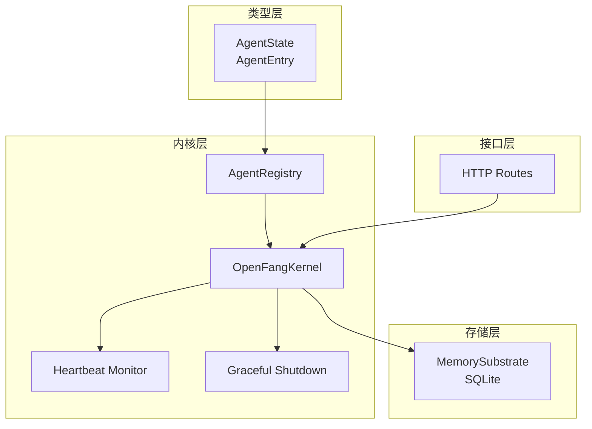
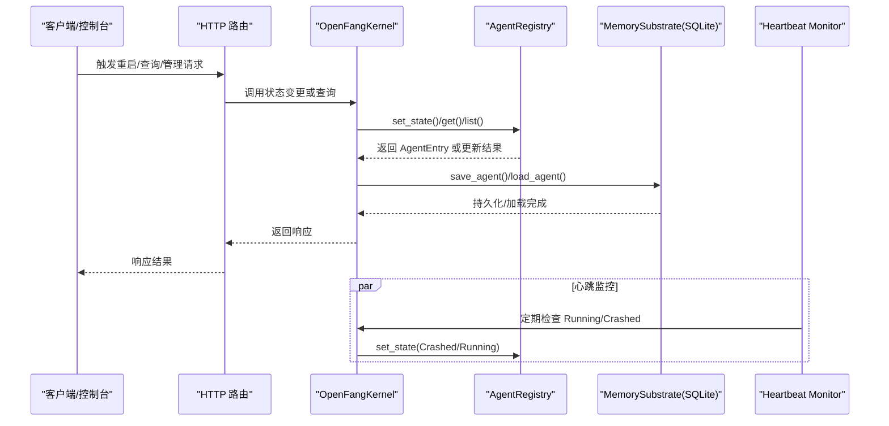
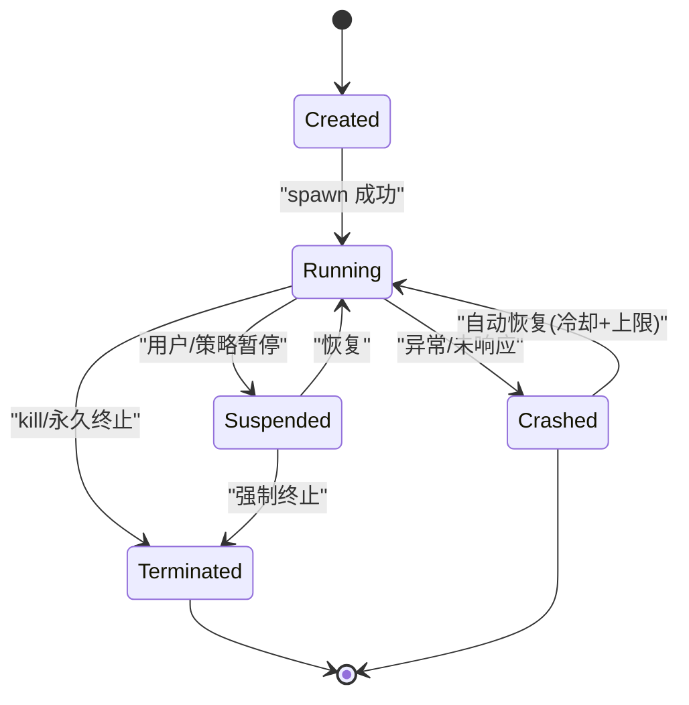
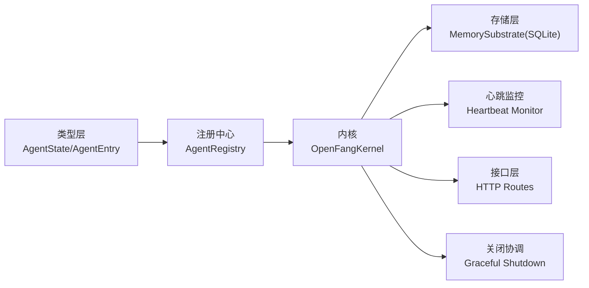

# 智能体状态管理

<cite>
**本文引用的文件**
- [crates/openfang-types/src/agent.rs](file://crates/openfang-types/src/agent.rs)
- [crates/openfang-kernel/src/registry.rs](file://crates/openfang-kernel/src/registry.rs)
- [crates/openfang-kernel/src/kernel.rs](file://crates/openfang-kernel/src/kernel.rs)
- [crates/openfang-kernel/src/heartbeat.rs](file://crates/openfang-kernel/src/heartbeat.rs)
- [crates/openfang-runtime/src/graceful_shutdown.rs](file://crates/openfang-runtime/src/graceful_shutdown.rs)
- [crates/openfang-api/src/routes.rs](file://crates/openfang-api/src/routes.rs)
- [crates/openfang-memory/src/structured.rs](file://crates/openfang-memory/src/structured.rs)
</cite>

## 目录
1. [简介](#简介)
2. [项目结构](#项目结构)
3. [核心组件](#核心组件)
4. [架构总览](#架构总览)
5. [详细组件分析](#详细组件分析)
6. [依赖关系分析](#依赖关系分析)
7. [性能考量](#性能考量)
8. [故障排查指南](#故障排查指南)
9. [结论](#结论)
10. [附录](#附录)

## 简介
本文件系统化阐述 OpenFang 智能体状态管理的设计与实现，聚焦以下目标：
- 明确定义 Running、Suspended、Terminated 三类运行态及其语义边界
- 解释状态转换的触发条件（spawn、message/tick、kill、shutdown、reboot/restore）
- 描述状态持久化策略与恢复流程
- 提供状态机图、状态转换表与状态查询接口说明
- 给出状态异常处理与恢复机制的实现细节
- 强调 AgentState 枚举定义、状态变更的原子性与并发安全

## 项目结构
围绕状态管理的关键模块分布如下：
- 类型与枚举：在类型层定义 AgentState 及 AgentEntry
- 注册中心：维护内存中的 Agent 注册表，提供状态更新与索引
- 内核：编排生命周期事件、调度、能力授予、持久化与恢复
- 心跳与自动恢复：监控 Running/Crashed 状态并尝试自动恢复
- 关闭协调：优雅关闭时对状态进行持久化与清理
- API：对外暴露重启等状态操作接口
- 存储：将 AgentEntry（含 state）持久化到 SQLite

图表来源
- [crates/openfang-types/src/agent.rs](file://crates/openfang-types/src/agent.rs)
- [crates/openfang-kernel/src/registry.rs](file://crates/openfang-kernel/src/registry.rs)
- [crates/openfang-kernel/src/kernel.rs](file://crates/openfang-kernel/src/kernel.rs)
- [crates/openfang-kernel/src/heartbeat.rs](file://crates/openfang-kernel/src/heartbeat.rs)
- [crates/openfang-runtime/src/graceful_shutdown.rs](file://crates/openfang-runtime/src/graceful_shutdown.rs)
- [crates/openfang-api/src/routes.rs](file://crates/openfang-api/src/routes.rs)
- [crates/openfang-memory/src/structured.rs](file://crates/openfang-memory/src/structured.rs)

章节来源
- [crates/openfang-types/src/agent.rs](file://crates/openfang-types/src/agent.rs)
- [crates/openfang-kernel/src/registry.rs](file://crates/openfang-kernel/src/registry.rs)
- [crates/openfang-kernel/src/kernel.rs](file://crates/openfang-kernel/src/kernel.rs)
- [crates/openfang-kernel/src/heartbeat.rs](file://crates/openfang-kernel/src/heartbeat.rs)
- [crates/openfang-runtime/src/graceful_shutdown.rs](file://crates/openfang-runtime/src/graceful_shutdown.rs)
- [crates/openfang-api/src/routes.rs](file://crates/openfang-api/src/routes.rs)
- [crates/openfang-memory/src/structured.rs](file://crates/openfang-memory/src/structured.rs)

## 核心组件
- AgentState 枚举：定义智能体生命周期状态集合，包括 Created、Running、Suspended、Terminated、Crashed
- AgentEntry：注册表项，包含 AgentId、name、manifest、state、mode、时间戳、会话与身份等字段
- AgentRegistry：线程安全的注册表，提供注册、查询、按 ID 更新状态、移除等操作
- OpenFangKernel：内核协调者，负责 spawn、stop、kill、持久化、恢复等
- Heartbeat Monitor：周期检查 Running/Crashed 状态并执行自动恢复
- Graceful Shutdown：优雅关闭流程，确保状态持久化与资源回收
- API 路由：对外提供重启等状态操作接口
- MemorySubstrate：将 AgentEntry（含 state）持久化到 SQLite

章节来源
- [crates/openfang-types/src/agent.rs](file://crates/openfang-types/src/agent.rs)
- [crates/openfang-kernel/src/registry.rs](file://crates/openfang-kernel/src/registry.rs)
- [crates/openfang-kernel/src/kernel.rs](file://crates/openfang-kernel/src/kernel.rs)
- [crates/openfang-kernel/src/heartbeat.rs](file://crates/openfang-kernel/src/heartbeat.rs)
- [crates/openfang-runtime/src/graceful_shutdown.rs](file://crates/openfang-runtime/src/graceful_shutdown.rs)
- [crates/openfang-api/src/routes.rs](file://crates/openfang-api/src/routes.rs)
- [crates/openfang-memory/src/structured.rs](file://crates/openfang-memory/src/structured.rs)

## 架构总览
下图展示状态管理在系统中的位置与交互：

图表来源
- [crates/openfang-api/src/routes.rs](file://crates/openfang-api/src/routes.rs)
- [crates/openfang-kernel/src/kernel.rs](file://crates/openfang-kernel/src/kernel.rs)
- [crates/openfang-kernel/src/registry.rs](file://crates/openfang-kernel/src/registry.rs)
- [crates/openfang-kernel/src/heartbeat.rs](file://crates/openfang-kernel/src/heartbeat.rs)
- [crates/openfang-memory/src/structured.rs](file://crates/openfang-memory/src/structured.rs)

## 详细组件分析

### AgentState 枚举与语义
- Created：已创建但尚未启动
- Running：正在运行并处理事件
- Suspended：暂停中，不处理事件
- Terminated：已终止且不可恢复
- Crashed：崩溃等待恢复

这些值用于统一表达智能体生命周期状态，并作为状态机的节点。

章节来源
- [crates/openfang-types/src/agent.rs](file://crates/openfang-types/src/agent.rs)

### AgentRegistry：状态更新与并发安全
- set_state(id, state)：原子性地更新指定 Agent 的状态，并刷新 last_active
- 并发模型：基于 DashMap 实现读写锁，支持高并发读取与受控写入
- 其他状态相关操作：set_mode、update_session_id、mark_onboarding_complete 等均在更新状态的同时刷新 last_active，便于心跳检测

章节来源
- [crates/openfang-kernel/src/registry.rs](file://crates/openfang-kernel/src/registry.rs)

### OpenFangKernel：生命周期编排与持久化
- spawn_agent_checked：创建会话、注册调度器、写入注册表、持久化到 SQLite
- stop_agent_run：取消运行中的任务（用于重启）
- kill_agent：从注册表移除并从持久存储删除，记录审计日志
- restore/重启：从持久存储加载 AgentEntry，重置状态为 Running，重新授权能力与注册调度器
- shutdown：在优雅关闭前，将所有 Agent 状态置为 Suspended 并持久化，以便下次启动恢复

章节来源
- [crates/openfang-kernel/src/kernel.rs](file://crates/openfang-kernel/src/kernel.rs)

### Heartbeat Monitor：自动恢复与异常处理
- 仅针对 Running 与 Crashed 状态进行检查
- 对于 Crashed：根据冷却时间与最大尝试次数进行自动恢复，将状态重置为 Running
- 对于 Running：若超过不活跃阈值，发布“未响应”事件并可进一步处理

章节来源
- [crates/openfang-kernel/src/heartbeat.rs](file://crates/openfang-kernel/src/heartbeat.rs)

### Graceful Shutdown：状态持久化与清理
- 在关闭阶段将所有 Agent 状态置为 Suspended，避免数据丢失
- 将更新后的 AgentEntry 保存回持久存储
- 通过 ShutdownCoordinator 控制阶段推进与超时

章节来源
- [crates/openfang-runtime/src/graceful_shutdown.rs](file://crates/openfang-runtime/src/graceful_shutdown.rs)
- [crates/openfang-kernel/src/kernel.rs](file://crates/openfang-kernel/src/kernel.rs)

### API 接口：状态查询与重启
- 提供重启接口：先取消运行中的任务，再将状态重置为 Running，并记录审计日志
- 查询接口：可通过路由获取 Agent 状态与相关信息

章节来源
- [crates/openfang-api/src/routes.rs](file://crates/openfang-api/src/routes.rs)

### 存储层：状态持久化策略
- 保存：INSERT/ON CONFLICT UPDATE，将 AgentEntry（含 state）序列化后写入 SQLite
- 加载：按 ID 查询，反序列化为 AgentEntry；若状态字段损坏则跳过该 Agent
- Schema 升级：对旧版本进行自动修复与升级，保证兼容性

章节来源
- [crates/openfang-memory/src/structured.rs](file://crates/openfang-memory/src/structured.rs)

### 状态机图与转换表

#### 状态机图

图表来源
- [crates/openfang-types/src/agent.rs](file://crates/openfang-types/src/agent.rs)
- [crates/openfang-kernel/src/heartbeat.rs](file://crates/openfang-kernel/src/heartbeat.rs)
- [crates/openfang-kernel/src/kernel.rs](file://crates/openfang-kernel/src/kernel.rs)

#### 状态转换表
- spawn：Created → Running（注册表写入、调度器注册、持久化）
- message/tick：Running（处理事件/定时任务）
- suspend：Running → Suspended；Suspended → Running（手动恢复）
- kill：Running/Suspended → Terminated（从注册表移除并删除持久化）
- shutdown：Running/Suspended → Suspended（优雅关闭时持久化）
- reboot/restore：从持久化加载 → Running（能力重授、调度器重注册）

章节来源
- [crates/openfang-kernel/src/kernel.rs](file://crates/openfang-kernel/src/kernel.rs)
- [crates/openfang-kernel/src/registry.rs](file://crates/openfang-kernel/src/registry.rs)
- [crates/openfang-kernel/src/heartbeat.rs](file://crates/openfang-kernel/src/heartbeat.rs)
- [crates/openfang-memory/src/structured.rs](file://crates/openfang-memory/src/structured.rs)

### 状态查询接口
- 列表查询：AgentRegistry.list() 返回所有 AgentEntry，其中包含当前 state
- 单个查询：AgentRegistry.get(id) 获取指定 AgentEntry
- 名称查询：AgentRegistry.find_by_name(name) 支持按名称检索
- API 查询：通过 HTTP 路由返回状态与元数据

章节来源
- [crates/openfang-kernel/src/registry.rs](file://crates/openfang-kernel/src/registry.rs)
- [crates/openfang-api/src/routes.rs](file://crates/openfang-api/src/routes.rs)

### 并发安全与原子性
- set_state 原子性：在 DashMap 上进行一次性写入，同时更新 last_active，避免竞态
- 并发读写：读多写少场景下，DashMap 提供高性能并发访问
- 会话与消息串行：同一 Agent 的消息处理通过 per-agent 锁串行化，防止会话污染

章节来源
- [crates/openfang-kernel/src/registry.rs](file://crates/openfang-kernel/src/registry.rs)
- [crates/openfang-kernel/src/kernel.rs](file://crates/openfang-kernel/src/kernel.rs)

## 依赖关系分析
- 类型层依赖：AgentState/AgentEntry 为上层组件提供统一的数据契约
- 注册中心依赖：AgentRegistry 依赖 DashMap 提供并发安全
- 内核依赖：Kernel 同时依赖 Registry、Memory、Scheduler、EventBus 等子系统
- 存储依赖：MemorySubstrate 将 AgentEntry（含 state）持久化到 SQLite
- 监控依赖：Heartbeat Monitor 依赖 Registry 与配置进行状态检查
- 关闭依赖：ShutdownCoordinator 驱动内核各阶段，确保状态一致

图表来源
- [crates/openfang-types/src/agent.rs](file://crates/openfang-types/src/agent.rs)
- [crates/openfang-kernel/src/registry.rs](file://crates/openfang-kernel/src/registry.rs)
- [crates/openfang-kernel/src/kernel.rs](file://crates/openfang-kernel/src/kernel.rs)
- [crates/openfang-kernel/src/heartbeat.rs](file://crates/openfang-kernel/src/heartbeat.rs)
- [crates/openfang-runtime/src/graceful_shutdown.rs](file://crates/openfang-runtime/src/graceful_shutdown.rs)
- [crates/openfang-api/src/routes.rs](file://crates/openfang-api/src/routes.rs)
- [crates/openfang-memory/src/structured.rs](file://crates/openfang-memory/src/structured.rs)

## 性能考量
- 并发读取：DashMap 支持高并发读取，适合大规模 Agent 场景
- 状态刷新：每次 set_state 同步更新 last_active，便于心跳检测但需注意写放大
- 持久化策略：批量/合并写入可减少 I/O 压力；建议在高频状态变更场景下引入批处理
- 自动恢复：冷却时间与最大尝试次数限制可避免风暴式重试

## 故障排查指南
- 状态异常（Crashed）：检查心跳监控是否正确识别未响应；确认冷却时间与最大尝试次数设置；查看审计日志定位失败原因
- 重启无效：确认是否先取消运行中的任务；检查 set_state 是否成功更新
- 恢复失败：核对持久化文件完整性；确认恢复流程中能力重授与调度器注册是否成功
- 关闭后未恢复：确认优雅关闭阶段是否将状态置为 Suspended 并持久化

章节来源
- [crates/openfang-kernel/src/heartbeat.rs](file://crates/openfang-kernel/src/heartbeat.rs)
- [crates/openfang-kernel/src/kernel.rs](file://crates/openfang-kernel/src/kernel.rs)
- [crates/openfang-runtime/src/graceful_shutdown.rs](file://crates/openfang-runtime/src/graceful_shutdown.rs)
- [crates/openfang-api/src/routes.rs](file://crates/openfang-api/src/routes.rs)

## 结论
本状态管理体系以 AgentState 为核心，结合 AgentRegistry 的原子更新、Kernel 的生命周期编排、MemorySubstrate 的持久化与 Heartbeat Monitor 的自动恢复，形成了稳定、可观测、可恢复的状态管理闭环。通过 DashMap 提供的并发安全与 set_state 的原子性更新，系统在高并发场景下仍能保持一致性与可靠性。

## 附录
- 状态保持机制：通过 set_state 同步更新 last_active，便于心跳检测与异常恢复
- 持久化策略：INSERT/ON CONFLICT UPDATE，序列化 AgentEntry（含 state），支持 Schema 升级与自动修复
- 恢复流程：从持久化加载 → 重置状态为 Running → 重授能力 → 重新注册调度器