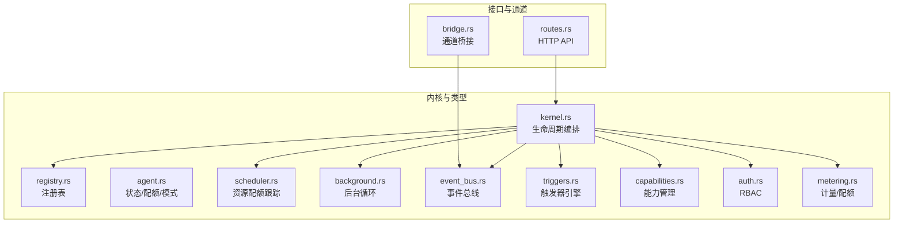
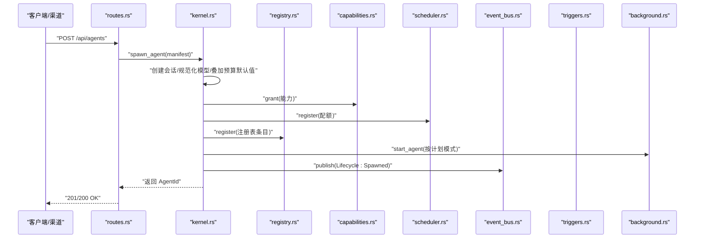
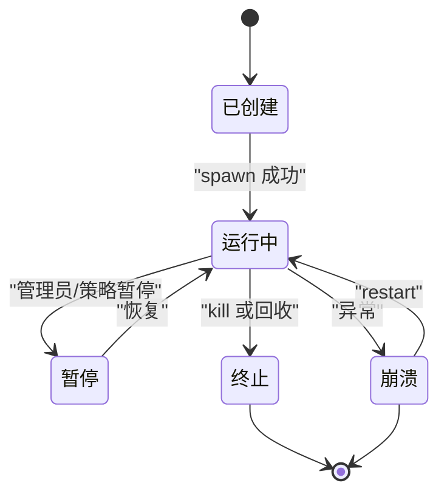
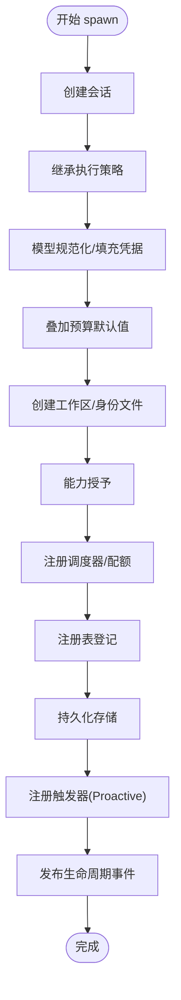
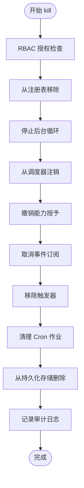
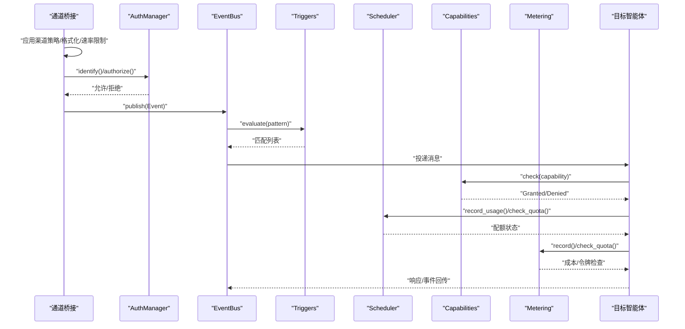
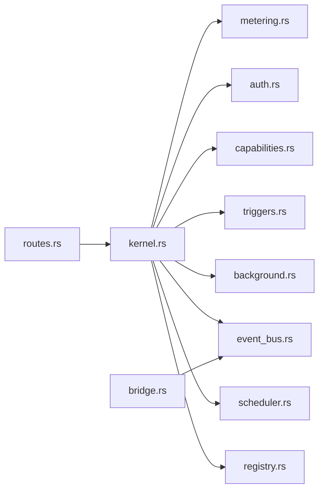

# 智能体生命周期

<cite>
**本文引用的文件**
- [crates/openfang-types/src/agent.rs](file://crates/openfang-types/src/agent.rs)
- [crates/openfang-kernel/src/kernel.rs](file://crates/openfang-kernel/src/kernel.rs)
- [crates/openfang-kernel/src/registry.rs](file://crates/openfang-kernel/src/registry.rs)
- [crates/openfang-kernel/src/event_bus.rs](file://crates/openfang-kernel/src/event_bus.rs)
- [crates/openfang-kernel/src/capabilities.rs](file://crates/openfang-kernel/src/capabilities.rs)
- [crates/openfang-kernel/src/auth.rs](file://crates/openfang-kernel/src/auth.rs)
- [crates/openfang-kernel/src/metering.rs](file://crates/openfang-kernel/src/metering.rs)
- [crates/openfang-kernel/src/scheduler.rs](file://crates/openfang-kernel/src/scheduler.rs)
- [crates/openfang-kernel/src/background.rs](file://crates/openfang-kernel/src/background.rs)
- [crates/openfang-kernel/src/triggers.rs](file://crates/openfang-kernel/src/triggers.rs)
- [crates/openfang-api/src/routes.rs](file://crates/openfang-api/src/routes.rs)
- [crates/openfang-channels/src/bridge.rs](file://crates/openfang-channels/src/bridge.rs)
</cite>

## 目录
1. [简介](#简介)
2. [项目结构](#项目结构)
3. [核心组件](#核心组件)
4. [架构总览](#架构总览)
5. [详细组件分析](#详细组件分析)
6. [依赖关系分析](#依赖关系分析)
7. [性能考量](#性能考量)
8. [故障排查指南](#故障排查指南)
9. [结论](#结论)
10. [附录](#附录)

## 简介
本文件系统性阐述 OpenFang 智能体生命周期管理，覆盖四种状态（Created、Running、Suspended、Terminated/Crashed）、spawn/kill 生命周期流程、消息处理中的 RBAC、渠道策略、配额检查与模块分发等关键环节，并提供状态机图、流程图与最佳实践建议，帮助开发者与运维人员在生产环境中安全、稳定地管理智能体。

## 项目结构
OpenFang 将智能体生命周期管理集中在内核（kernel）与类型定义（types）中，配合调度器（scheduler）、后台执行器（background）、事件总线（event_bus）、触发器（triggers）、能力管理（capabilities）、鉴权（auth）、计量（metering）以及通道桥接（channels/bridge）等子系统协同工作。

图表来源
- [crates/openfang-kernel/src/kernel.rs](file://crates/openfang-kernel/src/kernel.rs)
- [crates/openfang-kernel/src/registry.rs](file://crates/openfang-kernel/src/registry.rs)
- [crates/openfang-kernel/src/scheduler.rs](file://crates/openfang-kernel/src/scheduler.rs)
- [crates/openfang-kernel/src/background.rs](file://crates/openfang-kernel/src/background.rs)
- [crates/openfang-kernel/src/event_bus.rs](file://crates/openfang-kernel/src/event_bus.rs)
- [crates/openfang-kernel/src/triggers.rs](file://crates/openfang-kernel/src/triggers.rs)
- [crates/openfang-kernel/src/capabilities.rs](file://crates/openfang-kernel/src/capabilities.rs)
- [crates/openfang-kernel/src/auth.rs](file://crates/openfang-kernel/src/auth.rs)
- [crates/openfang-kernel/src/metering.rs](file://crates/openfang-kernel/src/metering.rs)
- [crates/openfang-api/src/routes.rs](file://crates/openfang-api/src/routes.rs)
- [crates/openfang-channels/src/bridge.rs](file://crates/openfang-channels/src/bridge.rs)

章节来源
- [crates/openfang-kernel/src/kernel.rs](file://crates/openfang-kernel/src/kernel.rs)
- [crates/openfang-types/src/agent.rs](file://crates/openfang-types/src/agent.rs)

## 核心组件
- 状态与模式：定义智能体状态（Created/Running/Suspended/Terminated/Crashed）与操作模式（Observe/Assist/Full），用于控制工具可用性与行为边界。
- 注册表（Registry）：维护所有已注册智能体的索引与元数据，支持按 ID/名称/标签查询、状态变更、会话更新等。
- 调度器（Scheduler）：跟踪每个智能体的资源使用（令牌数、工具调用次数）与配额，提供配额检查与任务中断能力。
- 后台执行器（Background）：根据计划模式（Reactive/Continuous/Periodic/Proactive）启动/停止后台循环，限制全局并发 LLM 调用。
- 事件总线（EventBus）：广播/订阅事件，支持目标路由（广播、系统、特定代理、模式匹配）与历史环形缓冲。
- 触发器（Triggers）：基于模式匹配的事件驱动机制，支持生命周期、系统事件、内存键变化等触发。
- 能力管理（Capabilities）：基于声明的能力授权与检查，确保工具调用受控。
- 鉴权（Auth）：基于角色的访问控制（RBAC），对用户身份识别与动作授权。
- 计量（Metering）：按小时/日/月统计成本与令牌用量，检查全局与单体配额。
- 通道桥接（Channels/Bridge）：将外部渠道消息路由到内核，应用渠道策略与格式化规则。

章节来源
- [crates/openfang-types/src/agent.rs](file://crates/openfang-types/src/agent.rs)
- [crates/openfang-kernel/src/registry.rs](file://crates/openfang-kernel/src/registry.rs)
- [crates/openfang-kernel/src/scheduler.rs](file://crates/openfang-kernel/src/scheduler.rs)
- [crates/openfang-kernel/src/background.rs](file://crates/openfang-kernel/src/background.rs)
- [crates/openfang-kernel/src/event_bus.rs](file://crates/openfang-kernel/src/event_bus.rs)
- [crates/openfang-kernel/src/triggers.rs](file://crates/openfang-kernel/src/triggers.rs)
- [crates/openfang-kernel/src/capabilities.rs](file://crates/openfang-kernel/src/capabilities.rs)
- [crates/openfang-kernel/src/auth.rs](file://crates/openfang-kernel/src/auth.rs)
- [crates/openfang-kernel/src/metering.rs](file://crates/openfang-kernel/src/metering.rs)
- [crates/openfang-channels/src/bridge.rs](file://crates/openfang-channels/src/bridge.rs)

## 架构总览
下图展示从 API 到内核、再到各子系统的调用链路与职责分工：

图表来源
- [crates/openfang-api/src/routes.rs](file://crates/openfang-api/src/routes.rs)
- [crates/openfang-kernel/src/kernel.rs](file://crates/openfang-kernel/src/kernel.rs)
- [crates/openfang-kernel/src/registry.rs](file://crates/openfang-kernel/src/registry.rs)
- [crates/openfang-kernel/src/capabilities.rs](file://crates/openfang-kernel/src/capabilities.rs)
- [crates/openfang-kernel/src/scheduler.rs](file://crates/openfang-kernel/src/scheduler.rs)
- [crates/openfang-kernel/src/event_bus.rs](file://crates/openfang-kernel/src/event_bus.rs)
- [crates/openfang-kernel/src/background.rs](file://crates/openfang-kernel/src/background.rs)

## 详细组件分析

### 智能体状态机与转换条件
- 状态定义：Created（已创建未启动）、Running（运行中）、Suspended（暂停）、Terminated（终止）、Crashed（崩溃）。
- 典型转换路径：
  - Created → Running：注册成功后进入 Running。
  - Running → Suspended：管理员或策略触发暂停。
  - Suspended → Running：恢复运行。
  - Running → Terminated：管理员或自动回收触发终止。
  - Running → Crashed：异常导致崩溃；可由重启流程恢复至 Running。
- 转换触发点：
  - API：/api/agents/{id}/restart 可将 Crashed/Stopped 恢复为 Running。
  - 内核：kill_agent 将智能体移出注册表并停止后台循环，最终进入 Terminated。

图表来源
- [crates/openfang-types/src/agent.rs](file://crates/openfang-types/src/agent.rs)
- [crates/openfang-kernel/src/kernel.rs](file://crates/openfang-kernel/src/kernel.rs)
- [crates/openfang-api/src/routes.rs](file://crates/openfang-api/src/routes.rs)

章节来源
- [crates/openfang-types/src/agent.rs](file://crates/openfang-types/src/agent.rs)
- [crates/openfang-kernel/src/kernel.rs](file://crates/openfang-kernel/src/kernel.rs)
- [crates/openfang-api/src/routes.rs](file://crates/openfang-api/src/routes.rs)

### spawn 流程（含权限与能力）
- 关键步骤
  - 会话创建：为新智能体创建会话，保证注册表与数据库一致。
  - 执行策略继承：若未显式配置，继承内核 exec_policy。
  - 模型规范化：从目录解析模型别名、填充 provider/api_key/base_url，必要时剥离 provider 前缀。
  - 预算默认值叠加：应用全局预算配置到资源配额。
  - 工作区准备：创建工作区目录并生成身份文件（如启用）。
  - 能力授予：将清单中的能力映射为内核能力并授予。
  - 调度注册：将智能体加入调度器并登记配额。
  - 注册表登记：写入注册表，记录父/子关系、标签、会话 ID 等。
  - 持久化存储：保存到 SQLite，确保重启后可恢复。
  - 触发器注册：对 Proactive 条件自动注册触发器。
  - 事件发布：发布生命周期事件，同步评估触发器。
- 权限与审计：spawn 前后记录审计日志，确保可追溯。

图表来源
- [crates/openfang-kernel/src/kernel.rs](file://crates/openfang-kernel/src/kernel.rs)
- [crates/openfang-kernel/src/capabilities.rs](file://crates/openfang-kernel/src/capabilities.rs)
- [crates/openfang-kernel/src/scheduler.rs](file://crates/openfang-kernel/src/scheduler.rs)
- [crates/openfang-kernel/src/registry.rs](file://crates/openfang-kernel/src/registry.rs)
- [crates/openfang-kernel/src/triggers.rs](file://crates/openfang-kernel/src/triggers.rs)
- [crates/openfang-kernel/src/event_bus.rs](file://crates/openfang-kernel/src/event_bus.rs)

章节来源
- [crates/openfang-kernel/src/kernel.rs](file://crates/openfang-kernel/src/kernel.rs)

### kill 流程（含权限与清理）
- 关键步骤
  - 权限检查：通过 API 路由层进行用户身份识别与动作授权。
  - 注销与停止：从注册表移除、停止后台循环、从调度器注销。
  - 能力撤销：撤销该智能体的所有能力授予。
  - 事件订阅取消：从事件总线取消其订阅通道。
  - 触发器移除：删除该智能体的触发器，清理遗留作业。
  - 持久化清理：从 SQLite 删除智能体记录。
  - 审计记录：记录 kill 行为，包含名称与结果。
- 结果：智能体进入 Terminated 状态，资源完全释放。

图表来源
- [crates/openfang-api/src/routes.rs](file://crates/openfang-api/src/routes.rs)
- [crates/openfang-kernel/src/kernel.rs](file://crates/openfang-kernel/src/kernel.rs)
- [crates/openfang-kernel/src/registry.rs](file://crates/openfang-kernel/src/registry.rs)
- [crates/openfang-kernel/src/background.rs](file://crates/openfang-kernel/src/background.rs)
- [crates/openfang-kernel/src/scheduler.rs](file://crates/openfang-kernel/src/scheduler.rs)
- [crates/openfang-kernel/src/capabilities.rs](file://crates/openfang-kernel/src/capabilities.rs)
- [crates/openfang-kernel/src/event_bus.rs](file://crates/openfang-kernel/src/event_bus.rs)
- [crates/openfang-kernel/src/triggers.rs](file://crates/openfang-kernel/src/triggers.rs)

章节来源
- [crates/openfang-api/src/routes.rs](file://crates/openfang-api/src/routes.rs)
- [crates/openfang-kernel/src/kernel.rs](file://crates/openfang-kernel/src/kernel.rs)

### 消息处理流程（RBAC、渠道策略、配额、模块分发）
- 渠道策略检查：通道桥接在接收消息时读取每通道覆盖项（输出格式、线程、生命周期反应等），并应用 DM/群组策略与速率限制。
- 用户身份识别：通过 AuthManager 将平台标识映射为 OpenFang 用户 ID，并进行角色授权。
- 模块分发：消息经由事件总线路由到目标智能体或广播；触发器引擎匹配事件并触发相应智能体的消息投递。
- 配额检查：在执行前进行能力检查与配额检查（令牌/工具调用/成本/全局预算），失败则拒绝或降级处理。
- 模块选择：根据模型目录解析模型别名与提供商，确保请求参数完整且合规。

图表来源
- [crates/openfang-channels/src/bridge.rs](file://crates/openfang-channels/src/bridge.rs)
- [crates/openfang-kernel/src/auth.rs](file://crates/openfang-kernel/src/auth.rs)
- [crates/openfang-kernel/src/event_bus.rs](file://crates/openfang-kernel/src/event_bus.rs)
- [crates/openfang-kernel/src/triggers.rs](file://crates/openfang-kernel/src/triggers.rs)
- [crates/openfang-kernel/src/scheduler.rs](file://crates/openfang-kernel/src/scheduler.rs)
- [crates/openfang-kernel/src/capabilities.rs](file://crates/openfang-kernel/src/capabilities.rs)
- [crates/openfang-kernel/src/metering.rs](file://crates/openfang-kernel/src/metering.rs)

章节来源
- [crates/openfang-channels/src/bridge.rs](file://crates/openfang-channels/src/bridge.rs)
- [crates/openfang-kernel/src/auth.rs](file://crates/openfang-kernel/src/auth.rs)
- [crates/openfang-kernel/src/event_bus.rs](file://crates/openfang-kernel/src/event_bus.rs)
- [crates/openfang-kernel/src/triggers.rs](file://crates/openfang-kernel/src/triggers.rs)
- [crates/openfang-kernel/src/scheduler.rs](file://crates/openfang-kernel/src/scheduler.rs)
- [crates/openfang-kernel/src/capabilities.rs](file://crates/openfang-kernel/src/capabilities.rs)
- [crates/openfang-kernel/src/metering.rs](file://crates/openfang-kernel/src/metering.rs)

## 依赖关系分析
- 内聚与耦合
  - kernel 对 registry、scheduler、background、event_bus、triggers、capabilities、metering 的强依赖体现了生命周期编排中心地位。
  - channels/bridge 与 kernel 通过事件总线解耦，仅在消息入口处耦合。
- 外部依赖
  - SQLite（通过 memory 子系统）用于持久化智能体与会话。
  - 模型目录（model catalog）用于模型别名解析与定价估算。
- 循环依赖
  - 未发现直接循环依赖；事件总线采用广播通道避免环状订阅。

图表来源
- [crates/openfang-kernel/src/kernel.rs](file://crates/openfang-kernel/src/kernel.rs)
- [crates/openfang-kernel/src/registry.rs](file://crates/openfang-kernel/src/registry.rs)
- [crates/openfang-kernel/src/scheduler.rs](file://crates/openfang-kernel/src/scheduler.rs)
- [crates/openfang-kernel/src/background.rs](file://crates/openfang-kernel/src/background.rs)
- [crates/openfang-kernel/src/event_bus.rs](file://crates/openfang-kernel/src/event_bus.rs)
- [crates/openfang-kernel/src/triggers.rs](file://crates/openfang-kernel/src/triggers.rs)
- [crates/openfang-kernel/src/capabilities.rs](file://crates/openfang-kernel/src/capabilities.rs)
- [crates/openfang-kernel/src/auth.rs](file://crates/openfang-kernel/src/auth.rs)
- [crates/openfang-kernel/src/metering.rs](file://crates/openfang-kernel/src/metering.rs)
- [crates/openfang-channels/src/bridge.rs](file://crates/openfang-channels/src/bridge.rs)
- [crates/openfang-api/src/routes.rs](file://crates/openfang-api/src/routes.rs)

章节来源
- [crates/openfang-kernel/src/kernel.rs](file://crates/openfang-kernel/src/kernel.rs)

## 性能考量
- 并发与节流
  - 后台执行器限制全局并发 LLM 调用，避免资源争抢。
  - 调度器按小时窗口重置令牌计数，减少长尾延迟。
- 存储与索引
  - 注册表使用多级索引（ID/名称/标签），查询与更新均基于并发哈希表，适合高吞吐场景。
- 事件与触发
  - 事件总线采用广播通道与环形历史缓冲，兼顾低延迟与可观测性。
- 成本与配额
  - 计量引擎支持按小时/日/月的成本与令牌限额，结合全局预算防止超支。

## 故障排查指南
- 常见问题定位
  - spawn 失败：检查模型规范化、工作区创建、能力授予与注册表重复名称。
  - kill 无效：确认 API 授权是否通过、注册表是否存在、后台循环是否停止。
  - 消息不达：检查渠道策略覆盖、事件总线订阅、触发器模式匹配。
  - 超配额/超预算：查看调度器与计量引擎的配额检查日志。
- 审计与追踪
  - 查看内核审计日志记录的 spawn/kill 动作与上下文，辅助复盘。
- 快速修复
  - 使用 /api/agents/{id}/restart 将崩溃智能体恢复为 Running。
  - 清理遗留 Cron 作业与触发器，避免孤儿任务。

章节来源
- [crates/openfang-kernel/src/kernel.rs](file://crates/openfang-kernel/src/kernel.rs)
- [crates/openfang-kernel/src/metering.rs](file://crates/openfang-kernel/src/metering.rs)
- [crates/openfang-kernel/src/scheduler.rs](file://crates/openfang-kernel/src/scheduler.rs)
- [crates/openfang-api/src/routes.rs](file://crates/openfang-api/src/routes.rs)

## 结论
OpenFang 的智能体生命周期以 kernel 为核心，围绕注册表、调度器、后台执行器、事件总线、触发器、能力与计量构建了完整的闭环。通过 RBAC 与渠道策略保障接入安全，通过配额与成本控制实现资源治理，通过触发器与事件总线实现自动化与可观测性。遵循本文的状态机与流程图，可有效提升智能体的稳定性与可维护性。

## 附录
- 最佳实践
  - 明确 exec_policy 与能力清单，最小权限原则授予。
  - 为长期运行智能体设置合理的连续/周期/主动模式与触发器。
  - 启用审计日志与配额告警，定期审查使用情况。
  - 在生产环境启用全局预算与令牌上限，避免意外超支。
  - 对关键智能体启用工作区身份文件与持久化存储，确保可恢复性。