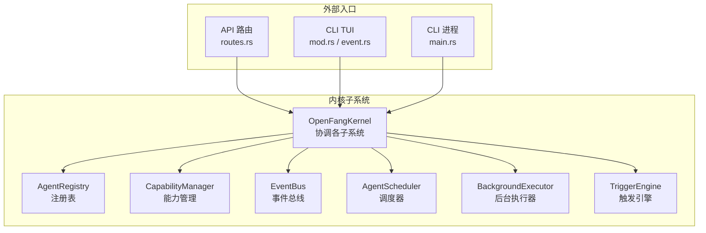
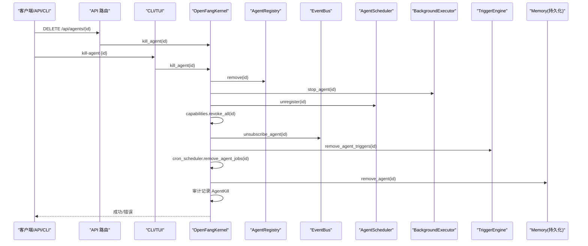
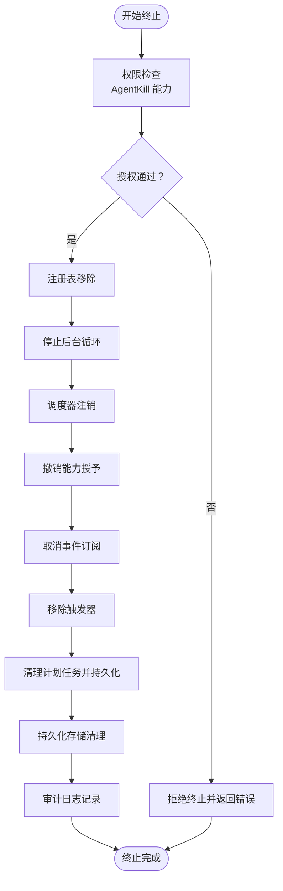
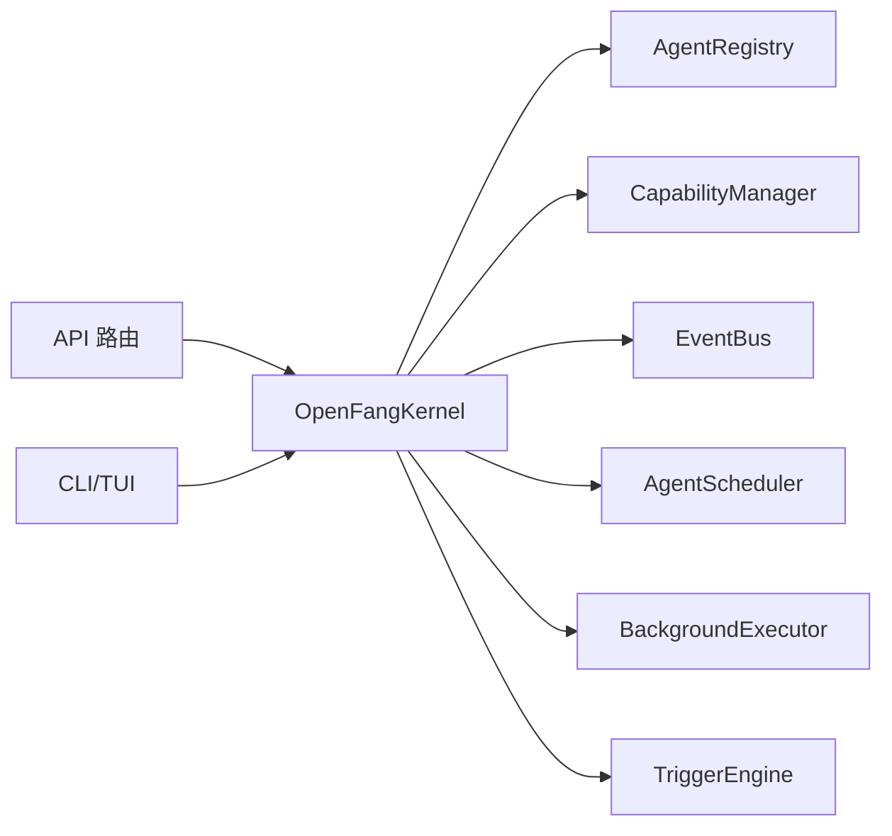

# 智能体终止流程

<cite>
**本文引用的文件**
- [kernel.rs](file://crates/openfang-kernel/src/kernel.rs)
- [capability.rs](file://crates/openfang-types/src/capability.rs)
- [capabilities.rs](file://crates/openfang-kernel/src/capabilities.rs)
- [registry.rs](file://crates/openfang-kernel/src/registry.rs)
- [event_bus.rs](file://crates/openfang-kernel/src/event_bus.rs)
- [scheduler.rs](file://crates/openfang-kernel/src/scheduler.rs)
- [background.rs](file://crates/openfang-kernel/src/background.rs)
- [triggers.rs](file://crates/openfang-kernel/src/triggers.rs)
- [routes.rs](file://crates/openfang-api/src/routes.rs)
- [mod.rs](file://crates/openfang-cli/src/tui/mod.rs)
- [event.rs](file://crates/openfang-cli/src/tui/event.rs)
- [main.rs](file://crates/openfang-cli/src/main.rs)
</cite>

## 目录
1. [简介](#简介)
2. [项目结构](#项目结构)
3. [核心组件](#核心组件)
4. [架构总览](#架构总览)
5. [详细组件分析](#详细组件分析)
6. [依赖关系分析](#依赖关系分析)
7. [性能考量](#性能考量)
8. [故障排查指南](#故障排查指南)
9. [结论](#结论)

## 简介
本文件系统性阐述 OpenFang 智能体终止流程，围绕“kill 流程的 8 个步骤”展开：权限检查、注册表移除、后台循环停止、调度器注销、能力撤销、事件订阅取消、触发器移除、持久化存储清理。同时说明权限验证机制（AgentKill 能力）与安全移除策略，提供终止失败的排查方法、数据完整性保障机制，以及终止过程中的资源清理与状态同步。

## 项目结构
终止流程由内核（kernel）协调多个子系统完成，涉及能力管理、注册表、事件总线、调度器、后台执行器、触发引擎等模块；外部入口包括 API 与 CLI。

图表来源
- [kernel.rs:60-164](file://crates/openfang-kernel/src/kernel.rs#L60-L164)
- [routes.rs:621-641](file://crates/openfang-api/src/routes.rs#L621-L641)
- [mod.rs:2103-2130](file://crates/openfang-cli/src/tui/mod.rs#L2103-L2130)
- [event.rs:954-996](file://crates/openfang-cli/src/tui/event.rs#L954-L996)
- [main.rs:1737-1740](file://crates/openfang-cli/src/main.rs#L1737-L1740)

章节来源
- [kernel.rs:60-164](file://crates/openfang-kernel/src/kernel.rs#L60-L164)

## 核心组件
- OpenFangKernel：终止流程的编排者，负责调用各子系统的清理动作。
- CapabilityManager：提供能力检查与撤销，确保终止具备授权。
- AgentRegistry：提供注册表读取与删除，用于获取被终止智能体信息并从索引中移除。
- EventBus：取消智能体事件订阅通道，防止消息泄漏。
- AgentScheduler：注销智能体任务与配额，回收资源。
- BackgroundExecutor：停止智能体后台循环任务。
- TriggerEngine：移除智能体触发器，避免残留触发链路。
- API/CLI：发起终止请求的入口，最终调用 kernel.kill_agent。

章节来源
- [kernel.rs:3199-3232](file://crates/openfang-kernel/src/kernel.rs#L3199-L3232)
- [capability.rs:12-72](file://crates/openfang-types/src/capability.rs#L12-L72)
- [capabilities.rs:14-61](file://crates/openfang-kernel/src/capabilities.rs#L14-L61)
- [registry.rs:75-88](file://crates/openfang-kernel/src/registry.rs#L75-L88)
- [event_bus.rs:95-98](file://crates/openfang-kernel/src/event_bus.rs#L95-L98)
- [scheduler.rs:119-124](file://crates/openfang-kernel/src/scheduler.rs#L119-L124)
- [background.rs:188-194](file://crates/openfang-kernel/src/background.rs#L188-L194)
- [triggers.rs:146-172](file://crates/openfang-kernel/src/triggers.rs#L146-L172)

## 架构总览
下图展示从入口到内核终止调用的关键交互路径。

图表来源
- [routes.rs:621-641](file://crates/openfang-api/src/routes.rs#L621-L641)
- [mod.rs:2103-2130](file://crates/openfang-cli/src/tui/mod.rs#L2103-L2130)
- [event.rs:954-996](file://crates/openfang-cli/src/tui/event.rs#L954-L996)
- [kernel.rs:3199-3232](file://crates/openfang-kernel/src/kernel.rs#L3199-L3232)

## 详细组件分析

### 终止流程的 8 个步骤
- 步骤一：权限检查（基于 AgentKill 能力）
  - 通过 CapabilityManager.check 对目标能力进行匹配校验，支持通配符与模式匹配。
  - 若无授权或授权不满足，终止应拒绝执行。
- 步骤二：注册表移除
  - 从 AgentRegistry 删除智能体条目，同时维护名称索引与标签索引。
- 步骤三：后台循环停止
  - 停止 BackgroundExecutor 中运行的后台任务（连续/周期模式），释放并发许可。
- 步骤四：调度器注销
  - 从 AgentScheduler 注销配额、使用统计与活动任务句柄。
- 步骤五：能力撤销
  - 从 CapabilityManager 撤销该智能体的所有能力授予。
- 步骤六：事件订阅取消
  - 从 EventBus 移除该智能体的订阅通道，避免事件泄漏。
- 步骤七：触发器移除
  - 从 TriggerEngine 移除该智能体的全部触发器，防止后续误触发。
- 步骤八：持久化存储清理
  - 从内存子系统移除该智能体的持久化数据；如存在关联计划任务，先清理并持久化变更。

图表来源
- [kernel.rs:3199-3232](file://crates/openfang-kernel/src/kernel.rs#L3199-L3232)
- [capabilities.rs:28-48](file://crates/openfang-kernel/src/capabilities.rs#L28-L48)
- [capability.rs:106-166](file://crates/openfang-types/src/capability.rs#L106-L166)
- [background.rs:188-194](file://crates/openfang-kernel/src/background.rs#L188-L194)
- [scheduler.rs:119-124](file://crates/openfang-kernel/src/scheduler.rs#L119-L124)
- [event_bus.rs:95-98](file://crates/openfang-kernel/src/event_bus.rs#L95-L98)
- [triggers.rs:146-172](file://crates/openfang-kernel/src/triggers.rs#L146-L172)

章节来源
- [kernel.rs:3199-3232](file://crates/openfang-kernel/src/kernel.rs#L3199-L3232)
- [capabilities.rs:28-48](file://crates/openfang-kernel/src/capabilities.rs#L28-L48)
- [capability.rs:106-166](file://crates/openfang-types/src/capability.rs#L106-L166)
- [background.rs:188-194](file://crates/openfang-kernel/src/background.rs#L188-L194)
- [scheduler.rs:119-124](file://crates/openfang-kernel/src/scheduler.rs#L119-L124)
- [event_bus.rs:95-98](file://crates/openfang-kernel/src/event_bus.rs#L95-L98)
- [triggers.rs:146-172](file://crates/openfang-kernel/src/triggers.rs#L146-L172)

### 权限验证机制与安全移除策略
- AgentKill 能力模型
  - 支持精确匹配、通配符（*）、前缀/后缀/中间通配等模式匹配规则。
  - 通过 capability_matches 实现跨能力类型的匹配判定。
- 授权检查流程
  - 在终止入口处对调用方的能力进行检查，若未授予或不满足范围，则拒绝终止。
- 安全移除策略
  - 先停止运行时资源（后台循环、调度任务），再撤销能力与订阅，最后清理持久化数据，确保无悬挂资源。
  - 审计日志记录 AgentKill 行为，便于追踪与合规。

章节来源
- [capability.rs:106-166](file://crates/openfang-types/src/capability.rs#L106-L166)
- [capabilities.rs:28-48](file://crates/openfang-kernel/src/capabilities.rs#L28-L48)
- [kernel.rs:3222-3228](file://crates/openfang-kernel/src/kernel.rs#L3222-L3228)

### 数据完整性保障机制
- 触发器迁移与保留
  - 提供 take_agent_triggers 以在终止前提取触发器，避免直接销毁导致的不可恢复。
- 计划任务清理
  - 终止时移除该智能体的计划任务并尝试持久化，防止孤儿任务。
- 审计日志
  - 记录终止操作的主体、目标、名称与结果，形成可追溯证据链。

章节来源
- [triggers.rs:146-172](file://crates/openfang-kernel/src/triggers.rs#L146-L172)
- [kernel.rs:3211-3217](file://crates/openfang-kernel/src/kernel.rs#L3211-L3217)
- [kernel.rs:3222-3228](file://crates/openfang-kernel/src/kernel.rs#L3222-L3228)

### 资源清理与状态同步
- 后台循环
  - 通过 abort 取消运行中的任务，释放全局并发许可。
- 调度与配额
  - 注销配额与使用统计，避免残留状态影响后续调度。
- 事件通道
  - 移除订阅通道，防止事件堆积与泄漏。
- 触发器
  - 清理所有触发器，避免后续误激活。
- 注册表
  - 删除主索引与辅助索引，确保查询不到已终止智能体。

章节来源
- [background.rs:188-194](file://crates/openfang-kernel/src/background.rs#L188-L194)
- [scheduler.rs:119-124](file://crates/openfang-kernel/src/scheduler.rs#L119-L124)
- [event_bus.rs:95-98](file://crates/openfang-kernel/src/event_bus.rs#L95-L98)
- [triggers.rs:146-172](file://crates/openfang-kernel/src/triggers.rs#L146-L172)
- [registry.rs:75-88](file://crates/openfang-kernel/src/registry.rs#L75-L88)

## 依赖关系分析
终止流程的耦合点主要集中在 OpenFangKernel 的 kill_agent 方法中，它按顺序调用各子系统的清理接口。入口层（API/CLI）仅负责转发请求，内部实现统一由内核承担，降低重复逻辑与边界条件遗漏风险。

图表来源
- [routes.rs:621-641](file://crates/openfang-api/src/routes.rs#L621-L641)
- [mod.rs:2103-2130](file://crates/openfang-cli/src/tui/mod.rs#L2103-L2130)
- [event.rs:954-996](file://crates/openfang-cli/src/tui/event.rs#L954-L996)
- [kernel.rs:3199-3232](file://crates/openfang-kernel/src/kernel.rs#L3199-L3232)

章节来源
- [kernel.rs:3199-3232](file://crates/openfang-kernel/src/kernel.rs#L3199-L3232)

## 性能考量
- 并发控制
  - 后台 LLM 并发许可在终止时自动释放，避免资源泄露。
- 批量清理
  - 计划任务清理与持久化合并处理，减少多次 IO。
- 事件历史
  - 终止后不再向该智能体投递事件，避免无效广播与堆积。

## 故障排查指南
- 常见失败原因
  - 缺少 AgentKill 能力：检查调用方是否具备相应授权。
  - 注册表不存在：确认智能体 ID 是否有效且仍存在于注册表。
  - 后台任务未退出：检查 shutdown 信号是否正确传播。
  - 触发器未清理：确认 TriggerEngine 的移除逻辑是否执行。
  - 计划任务残留：检查 cron_scheduler 的清理与持久化是否成功。
- 排查步骤
  - 查看内核日志中的终止记录与审计日志。
  - 验证各子系统状态：注册表、事件通道、调度器、后台执行器、触发器。
  - 复查权限：确认 capability_matches 的模式匹配是否符合预期。
- 相关实现参考
  - 终止入口与错误处理：[kernel.rs:3199-3232](file://crates/openfang-kernel/src/kernel.rs#L3199-L3232)
  - 能力匹配测试与规则：[capability.rs:282-316](file://crates/openfang-types/src/capability.rs#L282-L316)
  - API 终止路由：[routes.rs:621-641](file://crates/openfang-api/src/routes.rs#L621-L641)
  - CLI 终止调用：[mod.rs:2103-2130](file://crates/openfang-cli/src/tui/mod.rs#L2103-L2130)、[event.rs:954-996](file://crates/openfang-cli/src/tui/event.rs#L954-L996)、[main.rs:1737-1740](file://crates/openfang-cli/src/main.rs#L1737-L1740)

章节来源
- [kernel.rs:3199-3232](file://crates/openfang-kernel/src/kernel.rs#L3199-L3232)
- [capability.rs:282-316](file://crates/openfang-types/src/capability.rs#L282-L316)
- [routes.rs:621-641](file://crates/openfang-api/src/routes.rs#L621-L641)
- [mod.rs:2103-2130](file://crates/openfang-cli/src/tui/mod.rs#L2103-L2130)
- [event.rs:954-996](file://crates/openfang-cli/src/tui/event.rs#L954-L996)
- [main.rs:1737-1740](file://crates/openfang-cli/src/main.rs#L1737-L1740)

## 结论
OpenFang 的智能体终止流程以能力驱动的安全模型为核心，通过内核统一编排，确保在 8 个关键步骤中有序清理资源、撤销权限、取消订阅与触发器，并清理持久化数据与审计记录。该设计兼顾安全性、可追溯性与可维护性，适合在生产环境中稳定运行与扩展。