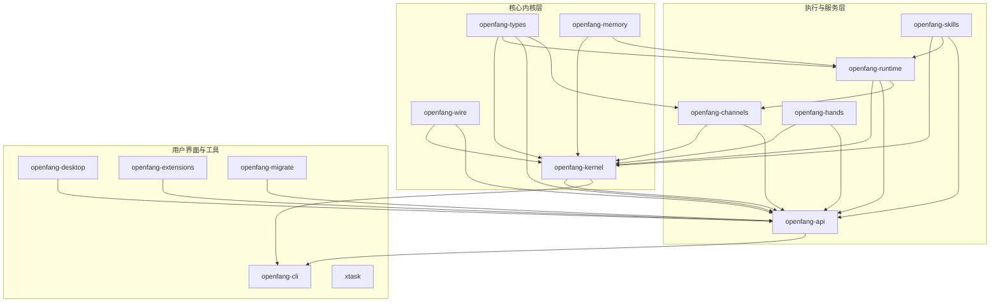
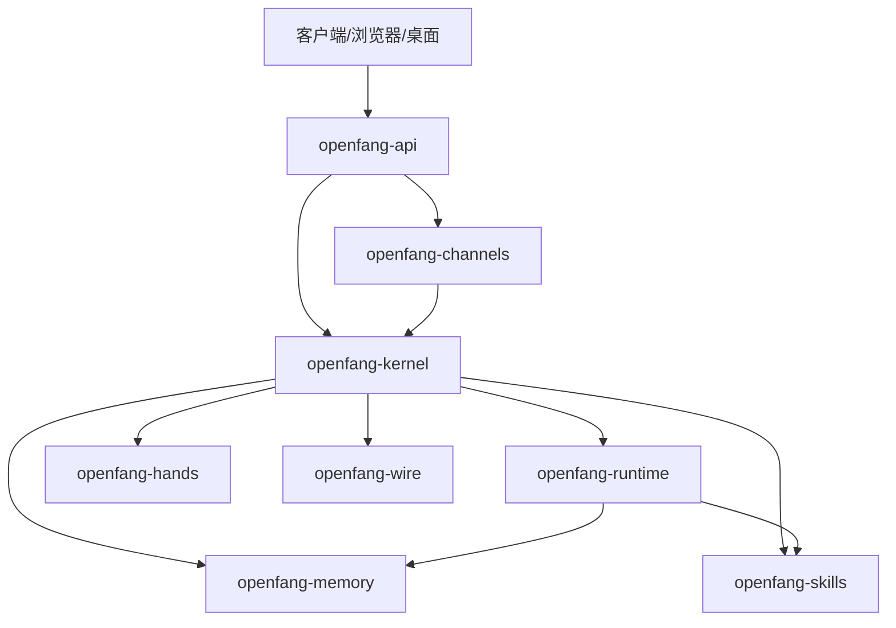
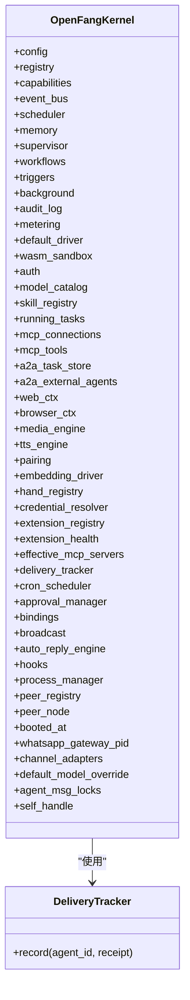
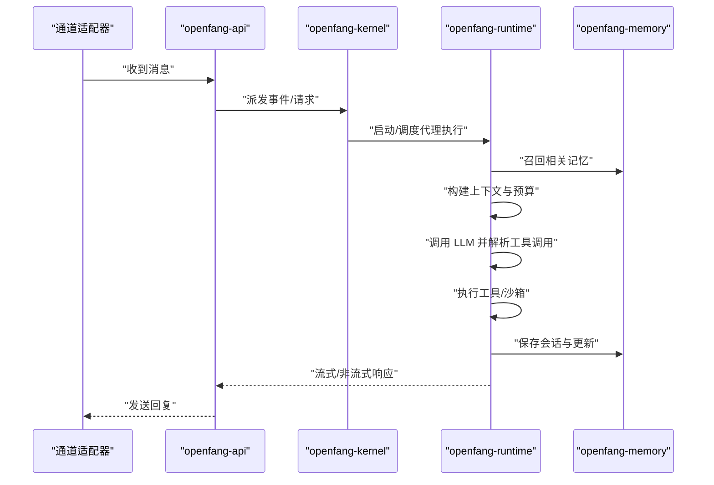
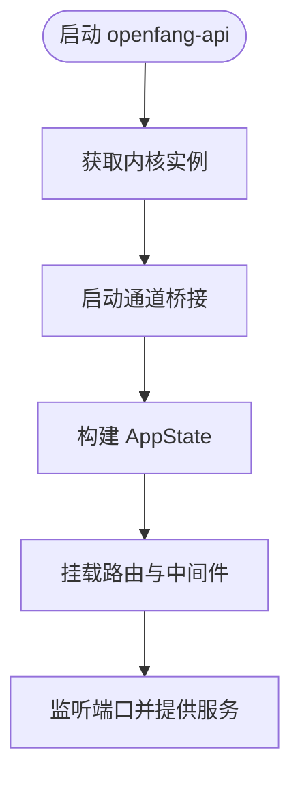
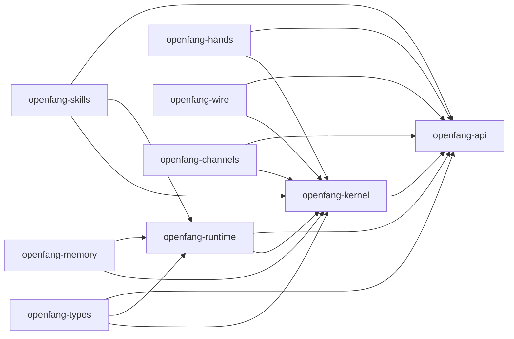

# 核心架构

<cite>
**本文引用的文件**
- [Cargo.toml](file://Cargo.toml)
- [README.md](file://README.md)
- [crates/openfang-kernel/Cargo.toml](file://crates/openfang-kernel/Cargo.toml)
- [crates/openfang-runtime/Cargo.toml](file://crates/openfang-runtime/Cargo.toml)
- [crates/openfang-api/Cargo.toml](file://crates/openfang-api/Cargo.toml)
- [crates/openfang-channels/Cargo.toml](file://crates/openfang-channels/Cargo.toml)
- [crates/openfang-kernel/src/lib.rs](file://crates/openfang-kernel/src/lib.rs)
- [crates/openfang-kernel/src/kernel.rs](file://crates/openfang-kernel/src/kernel.rs)
- [crates/openfang-runtime/src/lib.rs](file://crates/openfang-runtime/src/lib.rs)
- [crates/openfang-runtime/src/agent_loop.rs](file://crates/openfang-runtime/src/agent_loop.rs)
- [crates/openfang-api/src/lib.rs](file://crates/openfang-api/src/lib.rs)
- [crates/openfang-api/src/server.rs](file://crates/openfang-api/src/server.rs)
- [crates/openfang-channels/src/lib.rs](file://crates/openfang-channels/src/lib.rs)
- [crates/openfang-types/src/lib.rs](file://crates/openfang-types/src/lib.rs)
- [crates/openfang-memory/src/lib.rs](file://crates/openfang-memory/src/lib.rs)
- [crates/openfang-wire/src/lib.rs](file://crates/openfang-wire/src/lib.rs)
- [crates/openfang-skills/src/lib.rs](file://crates/openfang-skills/src/lib.rs)
- [crates/openfang-hands/src/lib.rs](file://crates/openfang-hands/src/lib.rs)
</cite>

## 目录
1. [引言](#引言)
2. [项目结构](#项目结构)
3. [核心组件](#核心组件)
4. [架构总览](#架构总览)
5. [详细组件分析](#详细组件分析)
6. [依赖分析](#依赖分析)
7. [性能考量](#性能考量)
8. [故障排查指南](#故障排查指南)
9. [结论](#结论)
10. [附录](#附录)

## 引言
本文件面向 OpenFang 的核心架构，系统性阐述其微内核与模块化设计、事件驱动体系、数据与控制流理念，以及 14 个核心 crate 的职责分工与相互关系。重点覆盖以下主题：
- 微内核与事件驱动：以 openfang-kernel 为核心协调器，统一调度、权限、工作流与审计。
- 模块化设计：openfang-runtime 提供执行环境与工具沙箱；openfang-api 提供 HTTP/WebSocket 接口；openfang-channels 提供 40+ 通道适配层。
- 数据与控制流：从通道消息到内核事件总线，再到运行时执行循环，最终落盘到内存子系统。
- 安全与合规：16 层安全系统贯穿内核、运行时与网络协议。
- 可扩展性与部署：支持桌面端、CLI、守护进程与多平台部署拓扑。

## 项目结构
OpenFang 采用工作区（workspace）组织，共 14 个核心 crate，围绕“类型定义”“内核”“运行时”“API”“通道”“内存”“技能”“手（Hands）”“网络协议”“迁移”“桌面”“CLI”“扩展”“任务”等维度分层解耦。

图表来源
- [Cargo.toml:1-162](file://Cargo.toml#L1-L162)
- [crates/openfang-kernel/Cargo.toml:1-45](file://crates/openfang-kernel/Cargo.toml#L1-L45)
- [crates/openfang-runtime/Cargo.toml:1-39](file://crates/openfang-runtime/Cargo.toml#L1-L39)
- [crates/openfang-api/Cargo.toml:1-46](file://crates/openfang-api/Cargo.toml#L1-L46)
- [crates/openfang-channels/Cargo.toml:1-43](file://crates/openfang-channels/Cargo.toml#L1-L43)

章节来源
- [Cargo.toml:1-162](file://Cargo.toml#L1-L162)
- [README.md:231-250](file://README.md#L231-L250)

## 核心组件
- openfang-types：共享数据模型、事件、错误、能力、工具、配置等，无业务逻辑，是所有 crate 的基础契约。
- openfang-kernel：微内核，负责代理生命周期、权限与能力、调度、工作流、触发器、后台执行、审计日志、计量计费、配对与自动回复等。
- openfang-runtime：代理执行环境，包含 LLM 驱动抽象、工具执行、WASM 沙箱、A2A/MCP、会话修复、媒体理解、TTS、进程管理等。
- openfang-api：HTTP/WebSocket API 守护进程，路由、中间件、速率限制、会话认证、OpenAI 兼容接口、仪表盘前端资源。
- openfang-channels：40+ 通道适配器（Telegram、Discord、Slack、WhatsApp、Email 等），统一消息格式与策略。
- openfang-memory：统一内存抽象，覆盖结构化（SQLite）、语义（向量）与知识图谱（SQLite）三层存储。
- openfang-skills：技能系统，支持 Python/WASM/Node/PromptOnly 等运行时，提供工具打包与市场。
- openfang-hands：预置的“手（Hands）”自治能力包，含激活、暂停、状态、指标与设置解析。
- openfang-wire：OFP（OpenFang Protocol）P2P 协议，跨机器发现、认证与通信。
- openfang-extensions：MCP 模板、凭据加密存储、OAuth2 PKCE 等扩展能力。
- openfang-migrate：从 OpenClaw、LangChain、AutoGPT 等迁移。
- openfang-desktop/openfang-cli：桌面应用与命令行工具，提供 TUI 与守护进程管理。
- xtask：构建自动化任务。

章节来源
- [crates/openfang-types/src/lib.rs:1-82](file://crates/openfang-types/src/lib.rs#L1-L82)
- [crates/openfang-kernel/src/lib.rs:1-30](file://crates/openfang-kernel/src/lib.rs#L1-L30)
- [crates/openfang-runtime/src/lib.rs:1-59](file://crates/openfang-runtime/src/lib.rs#L1-L59)
- [crates/openfang-api/src/lib.rs:1-18](file://crates/openfang-api/src/lib.rs#L1-L18)
- [crates/openfang-channels/src/lib.rs:1-55](file://crates/openfang-channels/src/lib.rs#L1-L55)
- [crates/openfang-memory/src/lib.rs:1-20](file://crates/openfang-memory/src/lib.rs#L1-L20)
- [crates/openfang-skills/src/lib.rs:1-255](file://crates/openfang-skills/src/lib.rs#L1-L255)
- [crates/openfang-hands/src/lib.rs:1-800](file://crates/openfang-hands/src/lib.rs#L1-L800)
- [crates/openfang-wire/src/lib.rs:1-20](file://crates/openfang-wire/src/lib.rs#L1-L20)

## 架构总览
OpenFang 采用“微内核 + 事件驱动 + 模块化”的整体架构：
- 微内核（openfang-kernel）作为中枢，聚合调度、权限、工作流、审计与配对等核心能力。
- 运行时（openfang-runtime）承载代理执行循环、工具与沙箱、LLM 驱动与路由、会话修复与上下文预算控制。
- API（openfang-api）对外暴露 REST/WS/SSE，桥接通道（openfang-channels）与内核，提供 OpenAI 兼容接口。
- 内存（openfang-memory）提供统一的结构化、语义与知识图谱存储。
- 技能（openfang-skills）与手（openfang-hands）通过清单与市场扩展能力。
- 网络（openfang-wire）提供 P2P 发现与互信通信。
- 类型（openfang-types）确保跨模块契约一致。

图表来源
- [crates/openfang-api/src/server.rs:35-54](file://crates/openfang-api/src/server.rs#L35-L54)
- [crates/openfang-kernel/src/kernel.rs:60-164](file://crates/openfang-kernel/src/kernel.rs#L60-L164)
- [crates/openfang-runtime/src/agent_loop.rs:145-167](file://crates/openfang-runtime/src/agent_loop.rs#L145-L167)

## 详细组件分析

### 组件一：内核（openfang-kernel）
- 职责
  - 代理注册与生命周期管理、权限与能力控制、调度与触发器、工作流引擎、后台执行、审计日志、计量计费、配对与自动回复、Cron 调度、审批管理、绑定与广播、交付跟踪、插件钩子、进程管理、OFP 对等节点与注册表。
- 关键结构
  - OpenFangKernel：聚合所有子系统句柄与共享状态，提供统一入口。
  - DeliveryTracker：按代理与全局上限记录交付回执。
- 交互模式
  - 事件总线（EventBus）驱动异步处理；调度器（AgentScheduler）与触发器（TriggerEngine）驱动周期性与条件动作；运行时通过 KernelHandle 与内核交互。

图表来源
- [crates/openfang-kernel/src/kernel.rs:60-164](file://crates/openfang-kernel/src/kernel.rs#L60-L164)
- [crates/openfang-kernel/src/kernel.rs:166-200](file://crates/openfang-kernel/src/kernel.rs#L166-L200)

章节来源
- [crates/openfang-kernel/src/lib.rs:1-30](file://crates/openfang-kernel/src/lib.rs#L1-L30)
- [crates/openfang-kernel/src/kernel.rs:60-164](file://crates/openfang-kernel/src/kernel.rs#L60-L164)

### 组件二：运行时（openfang-runtime）
- 职责
  - 代理执行循环（run_agent_loop）、LLM 驱动抽象与路由、工具执行与策略、WASM/子进程沙箱、A2A/MCP、会话修复、媒体理解、TTS、进程管理、上下文预算与溢出处理、循环检测与重试。
- 关键流程
  - 执行循环：加载上下文 → 记忆召回 → LLM 思考 → 工具调用 → 结果注入 → 保存会话 → 流式输出。
  - 上下文预算：基于 token 窗口与动态截断，防止溢出。
  - 循环保护：检测重复工具调用，避免死循环。
- 与内核协作
  - 通过 KernelHandle 获取内核能力（如审计、计量、工具定义、MCP 工具缓存）。

图表来源
- [crates/openfang-api/src/server.rs:35-54](file://crates/openfang-api/src/server.rs#L35-L54)
- [crates/openfang-kernel/src/kernel.rs:60-164](file://crates/openfang-kernel/src/kernel.rs#L60-L164)
- [crates/openfang-runtime/src/agent_loop.rs:145-167](file://crates/openfang-runtime/src/agent_loop.rs#L145-L167)

章节来源
- [crates/openfang-runtime/src/lib.rs:1-59](file://crates/openfang-runtime/src/lib.rs#L1-L59)
- [crates/openfang-runtime/src/agent_loop.rs:145-200](file://crates/openfang-runtime/src/agent_loop.rs#L145-L200)

### 组件三：API 层（openfang-api）
- 职责
  - 构建路由与中间件（CORS、追踪、压缩、速率限制、认证），提供 REST/WS/SSE 接口，OpenAI 兼容端点，仪表盘静态资源与健康检查。
- 启动流程
  - 启动通道桥接（Telegram/Slack/Discord 等），初始化 AppState，挂载路由，开启监听。

图表来源
- [crates/openfang-api/src/server.rs:35-54](file://crates/openfang-api/src/server.rs#L35-L54)

章节来源
- [crates/openfang-api/src/lib.rs:1-18](file://crates/openfang-api/src/lib.rs#L1-L18)
- [crates/openfang-api/src/server.rs:35-120](file://crates/openfang-api/src/server.rs#L35-L120)

### 组件四：通道层（openfang-channels）
- 职责
  - 提供 40+ 通道适配器，统一消息格式与策略（DM/群组策略、速率限制、输出格式化）。
- 设计
  - 每个通道实现 ChannelAdapter trait，转换为统一 ChannelMessage 事件，交由内核处理。

章节来源
- [crates/openfang-channels/src/lib.rs:1-55](file://crates/openfang-channels/src/lib.rs#L1-L55)

### 组件五：内存层（openfang-memory）
- 职责
  - 统一内存 API，覆盖结构化（SQLite）、语义（向量）与知识图谱（SQLite）三层存储。
- 设计
  - 通过 MemorySubstrate 抽象，屏蔽底层差异，向上提供统一接口。

章节来源
- [crates/openfang-memory/src/lib.rs:1-20](file://crates/openfang-memory/src/lib.rs#L1-L20)

### 组件六：技能与手（openfang-skills / openfang-hands）
- 职责
  - 技能：工具打包、多运行时支持（Python/WASM/Node/PromptOnly）、市场与验证。
  - 手：预置自治能力包，含清单（HAND.toml）、设置解析、指标、激活/暂停与状态管理。
- 设计
  - 通过清单声明工具、技能白名单、MCP 服务器白名单、要求与设置，内核在运行时进行权限与能力校验。

章节来源
- [crates/openfang-skills/src/lib.rs:1-255](file://crates/openfang-skills/src/lib.rs#L1-L255)
- [crates/openfang-hands/src/lib.rs:1-800](file://crates/openfang-hands/src/lib.rs#L1-L800)

### 组件七：网络协议（openfang-wire）
- 职责
  - OFP（OpenFang Protocol）P2P 协议，提供跨机器发现、认证与通信，基于 JSON-RPC 帧式消息。
- 设计
  - PeerNode 监听入站连接，PeerRegistry 维护已知对等节点与其代理，WireMessage 为帧式协议消息。

章节来源
- [crates/openfang-wire/src/lib.rs:1-20](file://crates/openfang-wire/src/lib.rs#L1-L20)

## 依赖分析
- 工作区依赖统一管理，核心库包括 tokio、serde、dashmap、crossbeam、tracing、reqwest、axum、wasmtime 等。
- crate 间依赖遵循“上层服务依赖内核，内核依赖类型与内存，运行时依赖类型与内存，API 依赖内核与运行时”，形成清晰的分层。

图表来源
- [Cargo.toml:26-136](file://Cargo.toml#L26-L136)
- [crates/openfang-kernel/Cargo.toml:8-37](file://crates/openfang-kernel/Cargo.toml#L8-L37)
- [crates/openfang-runtime/Cargo.toml:8-32](file://crates/openfang-runtime/Cargo.toml#L8-L32)
- [crates/openfang-api/Cargo.toml:8-40](file://crates/openfang-api/Cargo.toml#L8-L40)
- [crates/openfang-channels/Cargo.toml:8-40](file://crates/openfang-channels/Cargo.toml#L8-L40)

章节来源
- [Cargo.toml:1-162](file://Cargo.toml#L1-L162)
- [crates/openfang-kernel/Cargo.toml:1-45](file://crates/openfang-kernel/Cargo.toml#L1-L45)
- [crates/openfang-runtime/Cargo.toml:1-39](file://crates/openfang-runtime/Cargo.toml#L1-L39)
- [crates/openfang-api/Cargo.toml:1-46](file://crates/openfang-api/Cargo.toml#L1-L46)
- [crates/openfang-channels/Cargo.toml:1-43](file://crates/openfang-channels/Cargo.toml#L1-L43)

## 性能考量
- 冷启动与安装体积：单二进制 ~32MB，冷启动优于多数竞品；基准测试见 README。
- 并发与锁：内核使用 DashMap 与 Tokio Mutex/信号量；代理消息锁串行化同一代理的并发 LLM 调用，避免会话污染。
- 上下文预算与溢出处理：动态截断与溢出恢复，防止超大历史导致性能退化。
- 速率限制：GCRA 令牌桶限流，按 IP 与成本感知，兼顾公平与成本控制。
- 存储与向量化：向量检索优先，失败回退文本搜索；内存层支持压缩与迁移。

章节来源
- [README.md:117-186](file://README.md#L117-L186)
- [crates/openfang-kernel/src/kernel.rs:155-163](file://crates/openfang-kernel/src/kernel.rs#L155-L163)
- [crates/openfang-runtime/src/agent_loop.rs:1-200](file://crates/openfang-runtime/src/agent_loop.rs#L1-L200)

## 故障排查指南
- 通道连通性
  - 检查通道桥接是否启动，确认通道配置与凭证；查看通道适配器日志与健康状态。
- 代理执行异常
  - 查看运行时执行循环阶段回调与错误路径；关注工具超时、循环保护触发、上下文溢出恢复。
- 权限与能力
  - 确认代理清单中的工具与能力白名单；内核在启动时进行能力校验。
- 审计与回溯
  - 使用审计日志链定位问题时间点与操作序列；结合会话修复功能恢复损坏历史。
- 网络与 P2P
  - 检查 OFP 对等节点与注册表状态，确认互信认证与消息帧格式。

章节来源
- [crates/openfang-api/src/server.rs:35-120](file://crates/openfang-api/src/server.rs#L35-L120)
- [crates/openfang-runtime/src/agent_loop.rs:145-200](file://crates/openfang-runtime/src/agent_loop.rs#L145-L200)
- [crates/openfang-kernel/src/kernel.rs:60-164](file://crates/openfang-kernel/src/kernel.rs#L60-L164)

## 结论
OpenFang 以微内核为核心，通过事件驱动与模块化设计，实现了高内聚、低耦合的代理操作系统。内核统一编排调度、权限、工作流与审计，运行时提供强大的执行环境与安全沙箱，API 层提供完备的对外接口与兼容性，通道层覆盖主流沟通渠道，内存层支撑多维存储，技能与手扩展了能力边界，网络协议保障跨机互信。整体架构在性能、安全与可扩展性之间取得平衡，并提供丰富的运维与监控能力。

## 附录
- 基础设施要求
  - Rust 1.75+；Tokio 异步运行时；SQLite（内存层）；WASMtime（沙箱）；可选：Docker（子进程沙箱）、浏览器驱动（Playwright）。
- 可扩展性考虑
  - 插件化技能与 MCP；通道适配器可按需扩展；内存层支持向量与知识图谱演进；OFP 支持横向扩展与联邦。
- 部署拓扑
  - 单机守护进程（CLI/桌面）；多机集群（通过 OFP 对等网络）；容器化部署（Docker）；边缘侧轻量部署。
- 横切关注点
  - 安全：16 层安全系统（WASM 双重计量沙箱、Merkle 审计链、信息流污点追踪、Ed25519 签名、SSRF 保护、秘密零化、OFP 互信认证、能力门禁、安全头、健康端点脱敏、子进程沙箱、提示注入扫描、循环保护、会话修复、路径遍历防护、GCRA 速率限制）。
  - 监控：Prometheus 指标端点；Tracing 日志；健康检查与诊断。
  - 灾难恢复：会话修复与审计链；备份与迁移（openfang-migrate）。

章节来源
- [README.md:206-228](file://README.md#L206-L228)
- [crates/openfang-api/src/server.rs:120-135](file://crates/openfang-api/src/server.rs#L120-L135)
- [crates/openfang-kernel/src/kernel.rs:1-60](file://crates/openfang-kernel/src/kernel.rs#L1-L60)