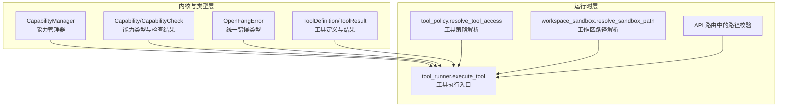
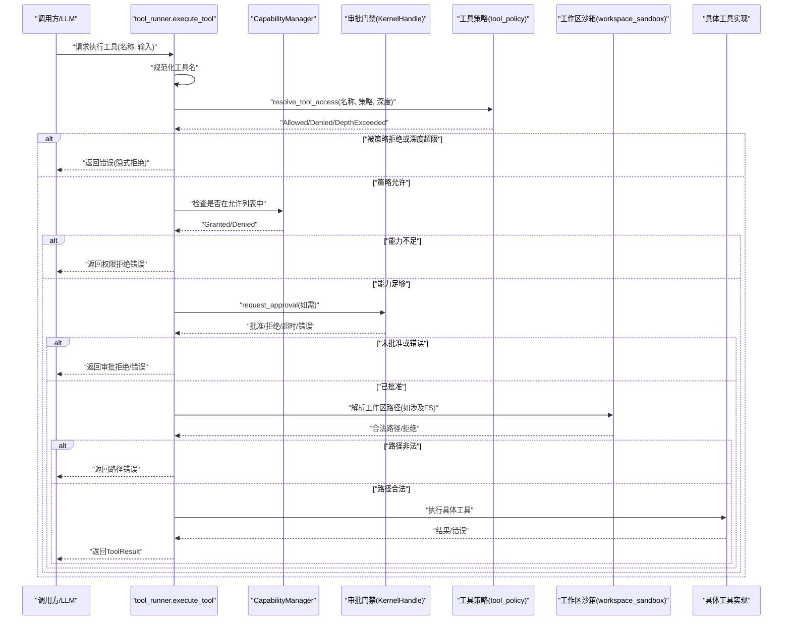
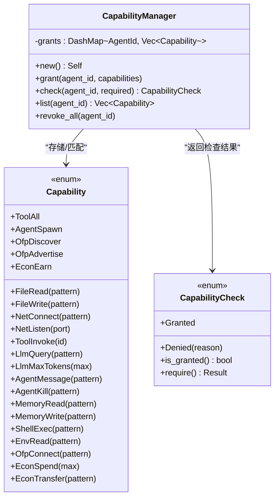
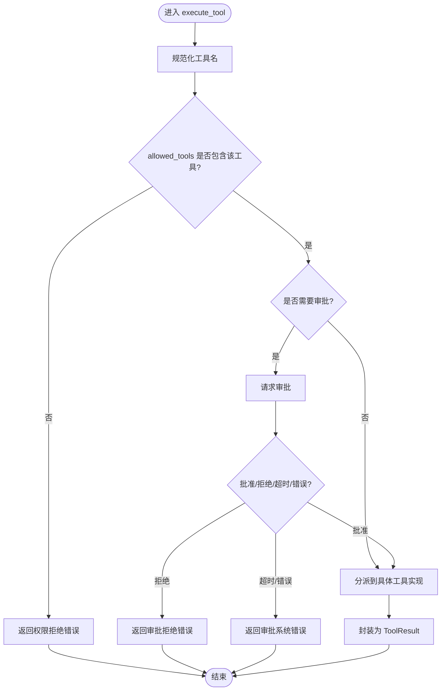
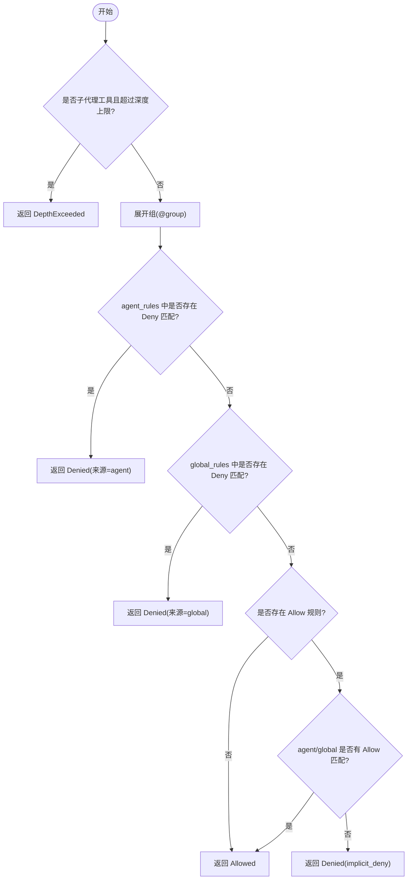
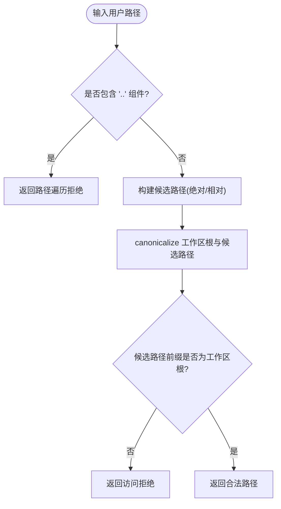
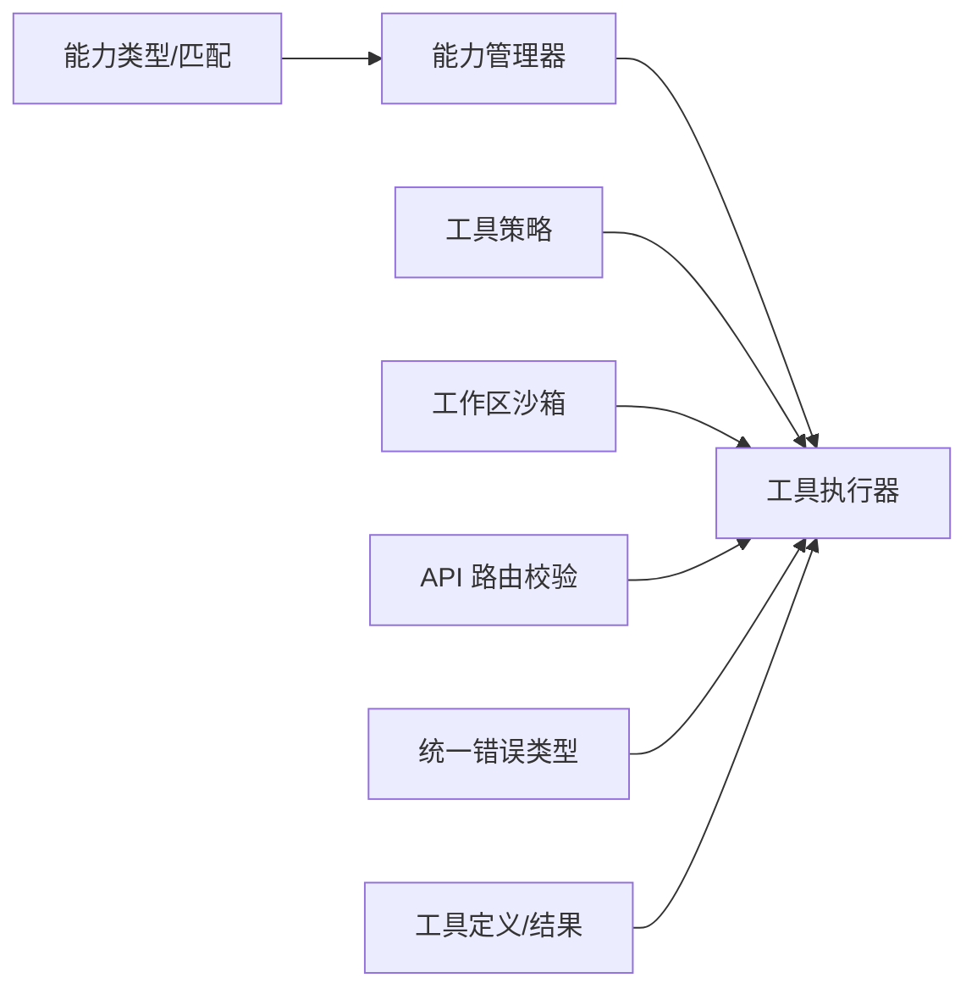

# 强制执行流程

<cite>
**本文引用的文件**
- [crates/openfang-kernel/src/capabilities.rs](file://crates/openfang-kernel/src/capabilities.rs)
- [crates/openfang-types/src/capability.rs](file://crates/openfang-types/src/capability.rs)
- [crates/openfang-runtime/src/tool_runner.rs](file://crates/openfang-runtime/src/tool_runner.rs)
- [crates/openfang-runtime/src/tool_policy.rs](file://crates/openfang-runtime/src/tool_policy.rs)
- [crates/openfang-runtime/src/workspace_sandbox.rs](file://crates/openfang-runtime/src/workspace_sandbox.rs)
- [crates/openfang-types/src/tool.rs](file://crates/openfang-types/src/tool.rs)
- [crates/openfang-types/src/error.rs](file://crates/openfang-types/src/error.rs)
- [crates/openfang-types/src/agent.rs](file://crates/openfang-types/src/agent.rs)
- [crates/openfang-api/src/routes.rs](file://crates/openfang-api/src/routes.rs)
- [crates/openfang-types/src/config.rs](file://crates/openfang-types/src/config.rs)
</cite>

## 目录
1. [简介](#简介)
2. [项目结构](#项目结构)
3. [核心组件](#核心组件)
4. [架构总览](#架构总览)
5. [详细组件分析](#详细组件分析)
6. [依赖关系分析](#依赖关系分析)
7. [性能考量](#性能考量)
8. [故障排查指南](#故障排查指南)
9. [结论](#结论)

## 简介
本文件面向“强制执行流程”，系统性阐述能力检查的完整闭环：从工具调用请求、能力管理器检查、路径验证（遍历检查）、工具执行到权限拒绝处理；并解释 DashMap 并发访问控制、能力授予与撤销机制、能力检查结果的处理与错误传播；同时覆盖工具运行时能力过滤、权限错误处理策略以及性能优化建议。

## 项目结构
围绕强制执行的关键代码分布在以下模块：
- 能力模型与匹配：类型定义与匹配规则
- 能力管理器：基于并发映射的能力授予/撤销/查询
- 工具执行器：工具调用入口、能力过滤、审批门禁、路径安全、执行策略
- 工具策略：基于规则的工具访问控制与深度限制
- 工作区沙箱：路径解析与遍历防护
- 错误与工具结果：统一错误类型与工具返回封装



**图表来源**
- [crates/openfang-kernel/src/capabilities.rs:1-96](file://crates/openfang-kernel/src/capabilities.rs#L1-L96)
- [crates/openfang-types/src/capability.rs:1-317](file://crates/openfang-types/src/capability.rs#L1-L317)
- [crates/openfang-runtime/src/tool_runner.rs:1-200](file://crates/openfang-runtime/src/tool_runner.rs#L1-L200)
- [crates/openfang-runtime/src/tool_policy.rs:1-145](file://crates/openfang-runtime/src/tool_policy.rs#L1-L145)
- [crates/openfang-runtime/src/workspace_sandbox.rs:1-148](file://crates/openfang-runtime/src/workspace_sandbox.rs#L1-L148)
- [crates/openfang-api/src/routes.rs:9101-9141](file://crates/openfang-api/src/routes.rs#L9101-L9141)

**章节来源**
- [crates/openfang-kernel/src/capabilities.rs:1-96](file://crates/openfang-kernel/src/capabilities.rs#L1-L96)
- [crates/openfang-types/src/capability.rs:1-317](file://crates/openfang-types/src/capability.rs#L1-L317)
- [crates/openfang-runtime/src/tool_runner.rs:1-200](file://crates/openfang-runtime/src/tool_runner.rs#L1-L200)
- [crates/openfang-runtime/src/tool_policy.rs:1-145](file://crates/openfang-runtime/src/tool_policy.rs#L1-L145)
- [crates/openfang-runtime/src/workspace_sandbox.rs:1-148](file://crates/openfang-runtime/src/workspace_sandbox.rs#L1-L148)
- [crates/openfang-api/src/routes.rs:9101-9141](file://crates/openfang-api/src/routes.rs#L9101-L9141)

## 核心组件
- 能力管理器（CapabilityManager）
  - 基于 DashMap 存储每个 Agent 的能力授予列表，提供授予、检查、列出、撤销等操作。
  - 检查逻辑通过 capability_matches 进行模式匹配，支持通配符、数值边界、布尔能力等。
- 能力类型与匹配（Capability/CapabilityCheck）
  - 定义文件系统、网络、工具、LLM、代理交互、内存、Shell、OFP、经济等多类能力。
  - 提供 capability_matches 与 validate_capability_inheritance，确保子能力不越权。
- 工具执行器（tool_runner.execute_tool）
  - 入口函数对工具名进行规范化，执行“允许列表”能力过滤，必要时请求审批，再进入具体工具分支。
  - 对 shell_exec 等高危工具执行额外的安全检查（元字符、策略、污点）。
- 工具策略（tool_policy）
  - 多层 deny-wins 规则：按优先级合并 agent/global 规则，支持组展开与深度限制。
- 工作区沙箱（workspace_sandbox）
  - 解析用户提供的路径，拒绝 “..” 组件，绝对/相对路径均需落在工作区根下，防止越权访问。
- 错误与工具结果（OpenFangError/ToolResult）
  - 统一错误类型，能力拒绝映射为特定错误；工具执行结果封装 is_error 与 content。

**章节来源**
- [crates/openfang-kernel/src/capabilities.rs:1-96](file://crates/openfang-kernel/src/capabilities.rs#L1-L96)
- [crates/openfang-types/src/capability.rs:1-317](file://crates/openfang-types/src/capability.rs#L1-L317)
- [crates/openfang-runtime/src/tool_runner.rs:90-526](file://crates/openfang-runtime/src/tool_runner.rs#L90-L526)
- [crates/openfang-runtime/src/tool_policy.rs:76-145](file://crates/openfang-runtime/src/tool_policy.rs#L76-L145)
- [crates/openfang-runtime/src/workspace_sandbox.rs:15-69](file://crates/openfang-runtime/src/workspace_sandbox.rs#L15-L69)
- [crates/openfang-types/src/error.rs:1-105](file://crates/openfang-types/src/error.rs#L1-L105)
- [crates/openfang-types/src/tool.rs:28-36](file://crates/openfang-types/src/tool.rs#L28-L36)

## 架构总览
下图展示一次工具调用的强制执行全流程，包括能力过滤、审批门禁、路径验证与执行策略：



**图表来源**
- [crates/openfang-runtime/src/tool_runner.rs:90-526](file://crates/openfang-runtime/src/tool_runner.rs#L90-L526)
- [crates/openfang-kernel/src/capabilities.rs:27-48](file://crates/openfang-kernel/src/capabilities.rs#L27-L48)
- [crates/openfang-runtime/src/tool_policy.rs:76-145](file://crates/openfang-runtime/src/tool_policy.rs#L76-L145)
- [crates/openfang-runtime/src/workspace_sandbox.rs:15-69](file://crates/openfang-runtime/src/workspace_sandbox.rs#L15-L69)

## 详细组件分析

### 能力管理器（CapabilityManager）
- 并发控制：使用 DashMap 存储每个 Agent 的能力列表，支持无锁读写与高并发场景下的安全访问。
- 授予与撤销：grant 插入/覆盖授予列表；revoke_all 删除某 Agent 的所有能力。
- 检查逻辑：若无该 Agent 的授予记录直接拒绝；否则遍历匹配 capability_matches，命中即 Granted，否则 Denied。
- 结果处理：CapabilityCheck 提供 is_granted 与 require，后者将 Denied 映射为 OpenFangError::CapabilityDenied。



**图表来源**
- [crates/openfang-kernel/src/capabilities.rs:9-61](file://crates/openfang-kernel/src/capabilities.rs#L9-L61)
- [crates/openfang-types/src/capability.rs:10-72](file://crates/openfang-types/src/capability.rs#L10-L72)
- [crates/openfang-types/src/capability.rs:75-98](file://crates/openfang-types/src/capability.rs#L75-L98)

**章节来源**
- [crates/openfang-kernel/src/capabilities.rs:1-96](file://crates/openfang-kernel/src/capabilities.rs#L1-L96)
- [crates/openfang-types/src/capability.rs:100-166](file://crates/openfang-types/src/capability.rs#L100-L166)
- [crates/openfang-types/src/capability.rs:168-187](file://crates/openfang-types/src/capability.rs#L168-L187)

### 工具执行器（execute_tool）
- 工具名规范化：通过工具兼容层将别名标准化为规范名称，避免 LLM 幻觉导致的非法工具名。
- 能力过滤：若传入 allowed_tools，则仅允许其中列出的工具执行；否则立即返回权限拒绝。
- 审批门禁：若 KernelHandle 存在且工具需要审批，先请求审批，批准后继续，否则返回审批拒绝或错误。
- 执行分支：根据工具名分派到具体实现（文件系统、网络、Shell、代理交互、浏览器、Docker、媒体理解等）。
- 结果封装：统一包装为 ToolResult，is_error 标记错误状态，content 返回人类可读信息。



**图表来源**
- [crates/openfang-runtime/src/tool_runner.rs:90-526](file://crates/openfang-runtime/src/tool_runner.rs#L90-L526)

**章节来源**
- [crates/openfang-runtime/src/tool_runner.rs:90-526](file://crates/openfang-runtime/src/tool_runner.rs#L90-L526)

### 工具策略（tool_policy）
- 规则优先级：deny-wins，agent_rules 高于 global_rules；显式 allow 覆盖默认隐式允许。
- 组展开：支持以 @group 形式引用工具组，提升策略表达力。
- 深度限制：针对子代理相关工具（spawn/kill 等）设置最大嵌套深度，防止无限递归或滥用。
- 结果类型：Allowed/Denied(含来源与规则)、DepthExceeded。



**图表来源**
- [crates/openfang-runtime/src/tool_policy.rs:76-145](file://crates/openfang-runtime/src/tool_policy.rs#L76-L145)

**章节来源**
- [crates/openfang-runtime/src/tool_policy.rs:1-479](file://crates/openfang-runtime/src/tool_policy.rs#L1-L479)

### 路径验证与工作区沙箱
- 遍历检查：拒绝任何包含 “..” 组件的路径，无论是否能解析回工作区。
- 绝对/相对路径：绝对路径需经 canonicalize 后仍位于工作区根下；相对路径拼接后同样要求。
- 新建文件：对父目录进行 canonicalize 并校验，确保不会越权创建。
- API 层补充：在 API 路由中对文件读取/写入路径进行二次校验，确保始终在工作区范围内。



**图表来源**
- [crates/openfang-runtime/src/workspace_sandbox.rs:15-69](file://crates/openfang-runtime/src/workspace_sandbox.rs#L15-L69)
- [crates/openfang-api/src/routes.rs:9101-9141](file://crates/openfang-api/src/routes.rs#L9101-L9141)

**章节来源**
- [crates/openfang-runtime/src/workspace_sandbox.rs:1-148](file://crates/openfang-runtime/src/workspace_sandbox.rs#L1-L148)
- [crates/openfang-api/src/routes.rs:9101-9141](file://crates/openfang-api/src/routes.rs#L9101-L9141)

### 能力检查与错误传播
- 能力检查结果：Granted/Denied，Denied 会映射为 OpenFangError::CapabilityDenied。
- 工具执行错误：ToolResult.is_error 标记错误；content 返回可读错误信息。
- 统一错误类型：OpenFangError 提供系统级错误语义，便于上层捕获与处理。

```mermaid
classDiagram
class OpenFangError {
<<enum>>
+CapabilityDenied(reason)
+ToolExecution{tool_id, reason}
+...其他错误类型
}
class ToolResult {
+tool_use_id : String
+content : String
+is_error : bool
}
OpenFangError <.. ToolResult : "错误传播"
```

**图表来源**
- [crates/openfang-types/src/error.rs:6-101](file://crates/openfang-types/src/error.rs#L6-L101)
- [crates/openfang-types/src/tool.rs:28-36](file://crates/openfang-types/src/tool.rs#L28-L36)

**章节来源**
- [crates/openfang-types/src/error.rs:1-105](file://crates/openfang-types/src/error.rs#L1-L105)
- [crates/openfang-types/src/tool.rs:28-36](file://crates/openfang-types/src/tool.rs#L28-L36)

## 依赖关系分析
- 内核层依赖类型层（能力模型），运行时层依赖内核层（能力检查）与类型层（工具定义/错误）。
- 工具策略独立于能力管理器，但两者共同决定工具是否可执行。
- 工作区沙箱与 API 路由共同构成路径安全防线，贯穿工具执行前后。



**图表来源**
- [crates/openfang-types/src/capability.rs:1-317](file://crates/openfang-types/src/capability.rs#L1-L317)
- [crates/openfang-kernel/src/capabilities.rs:1-96](file://crates/openfang-kernel/src/capabilities.rs#L1-L96)
- [crates/openfang-runtime/src/tool_runner.rs:1-200](file://crates/openfang-runtime/src/tool_runner.rs#L1-L200)
- [crates/openfang-runtime/src/tool_policy.rs:1-145](file://crates/openfang-runtime/src/tool_policy.rs#L1-L145)
- [crates/openfang-runtime/src/workspace_sandbox.rs:1-148](file://crates/openfang-runtime/src/workspace_sandbox.rs#L1-L148)
- [crates/openfang-api/src/routes.rs:9101-9141](file://crates/openfang-api/src/routes.rs#L9101-L9141)
- [crates/openfang-types/src/error.rs:1-105](file://crates/openfang-types/src/error.rs#L1-L105)
- [crates/openfang-types/src/tool.rs:1-650](file://crates/openfang-types/src/tool.rs#L1-L650)

**章节来源**
- [crates/openfang-types/src/capability.rs:1-317](file://crates/openfang-types/src/capability.rs#L1-L317)
- [crates/openfang-kernel/src/capabilities.rs:1-96](file://crates/openfang-kernel/src/capabilities.rs#L1-L96)
- [crates/openfang-runtime/src/tool_runner.rs:1-200](file://crates/openfang-runtime/src/tool_runner.rs#L1-L200)
- [crates/openfang-runtime/src/tool_policy.rs:1-145](file://crates/openfang-runtime/src/tool_policy.rs#L1-L145)
- [crates/openfang-runtime/src/workspace_sandbox.rs:1-148](file://crates/openfang-runtime/src/workspace_sandbox.rs#L1-L148)
- [crates/openfang-api/src/routes.rs:9101-9141](file://crates/openfang-api/src/routes.rs#L9101-L9141)
- [crates/openfang-types/src/error.rs:1-105](file://crates/openfang-types/src/error.rs#L1-L105)
- [crates/openfang-types/src/tool.rs:1-650](file://crates/openfang-types/src/tool.rs#L1-L650)

## 性能考量
- DashMap 并发访问：能力管理器使用 DashMap，读多写少场景下具备良好吞吐；建议合理划分 Agent 能力粒度，减少频繁更新。
- 能力匹配复杂度：capability_matches 采用模式匹配，通配符与数值比较开销较低；避免在单个 Agent 上授予过多宽泛能力，降低匹配成本。
- 工具策略评估：resolve_tool_access 顺序扫描规则，建议精简规则集、优先使用更具体的 allow/deny，减少隐式 deny 的误判与回溯。
- 路径解析：workspace_sandbox 的 canonicalize 在高并发下可能成为热点；建议缓存工作区根 canonicalize 结果，并在 API 层做预校验。
- 执行策略与污点检查：shell_exec 的元字符检测与策略校验为 O(n) 字符串扫描，建议在允许模式下谨慎放宽，避免引入高风险路径。

[本节为通用性能指导，无需特定文件引用]

## 故障排查指南
- 权限拒绝（Permission denied）
  - 检查 allowed_tools 是否包含该工具名（工具名已被规范化）。
  - 若 KernelHandle 存在且工具需要审批，确认审批流程是否被拒绝或超时。
  - 参考工具执行器中的错误返回路径。
- 路径遍历/访问拒绝
  - 确认路径不含 “..” 组件；绝对路径需位于工作区根下。
  - API 路由层也会进行二次校验，检查工作区路径与目标路径是否合规。
- 能力不足
  - 使用 CapabilityManager.list 查询当前授予列表，确认是否遗漏授予。
  - 检查 capability_matches 的模式匹配是否符合预期（通配符、数值边界）。
- 工具策略拒绝
  - 检查 agent_rules/global_rules 是否存在 deny 规则；确认是否被组展开影响。
  - 检查子代理工具深度是否超过 subagent_max_depth。
- 统一错误类型
  - CapabilityDenied：能力检查失败。
  - ToolExecution：工具执行失败，携带 tool_id 与 reason。
  - 其他：根据 OpenFangError 的枚举项定位问题来源。

**章节来源**
- [crates/openfang-runtime/src/tool_runner.rs:122-171](file://crates/openfang-runtime/src/tool_runner.rs#L122-L171)
- [crates/openfang-runtime/src/workspace_sandbox.rs:15-69](file://crates/openfang-runtime/src/workspace_sandbox.rs#L15-L69)
- [crates/openfang-kernel/src/capabilities.rs:45-48](file://crates/openfang-kernel/src/capabilities.rs#L45-L48)
- [crates/openfang-runtime/src/tool_policy.rs:76-145](file://crates/openfang-runtime/src/tool_policy.rs#L76-L145)
- [crates/openfang-types/src/error.rs:6-101](file://crates/openfang-types/src/error.rs#L6-L101)

## 结论
强制执行流程通过“工具策略 + 能力管理 + 审批门禁 + 路径沙箱”的多层保障，确保工具调用在可控范围内执行。DashMap 提供高效的并发能力存储，能力匹配与策略解析遵循最小授权原则，路径验证与 API 层校验共同阻断越权访问。结合统一错误类型与工具结果封装，系统在安全性与可观测性之间取得平衡。建议在生产环境中持续精简规则、优化能力授予、强化审批策略与路径校验，以获得更好的性能与安全性。