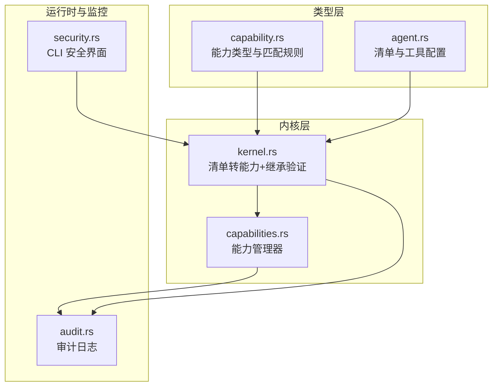
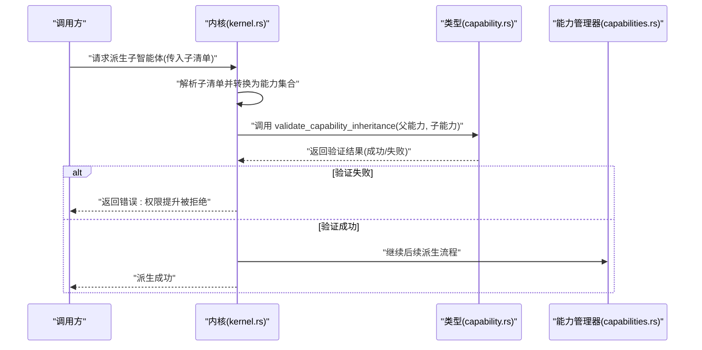
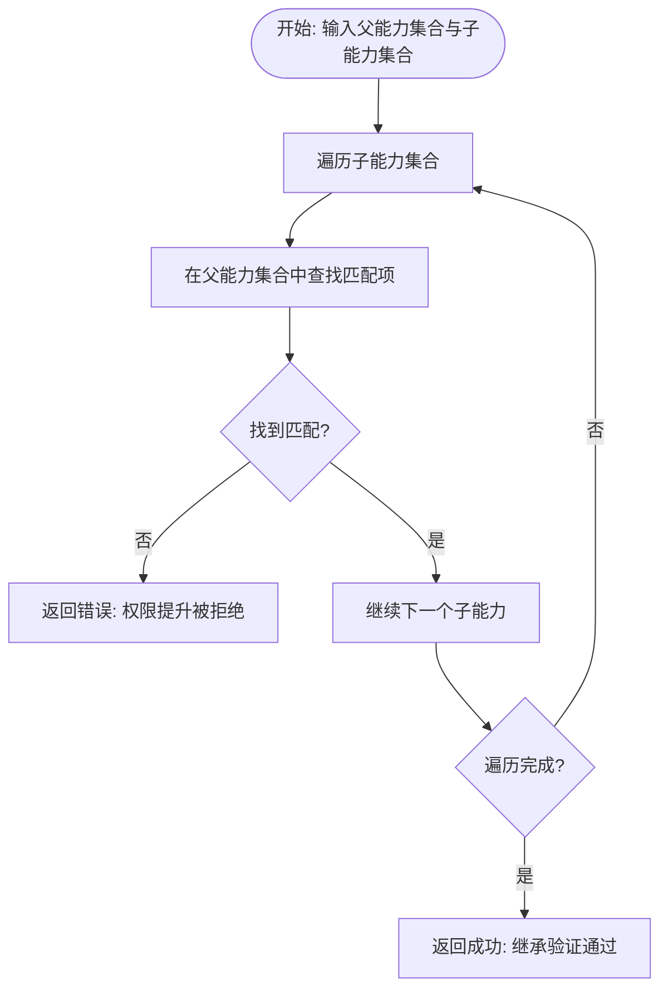
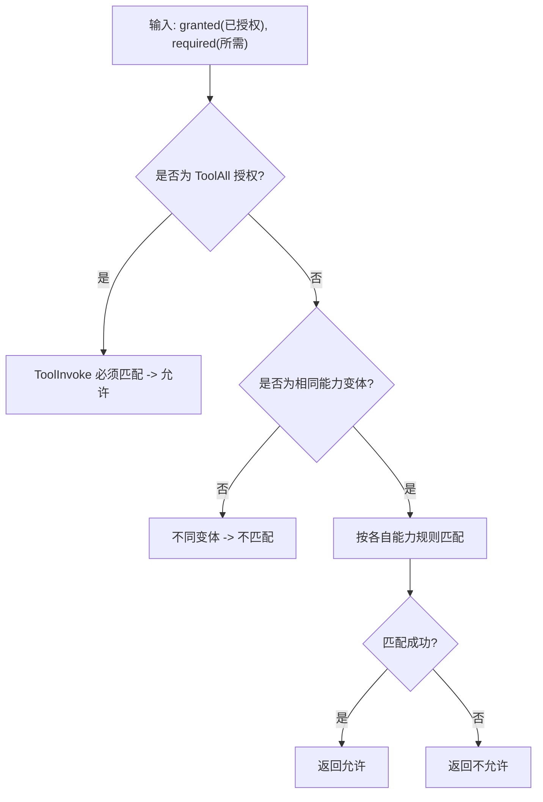
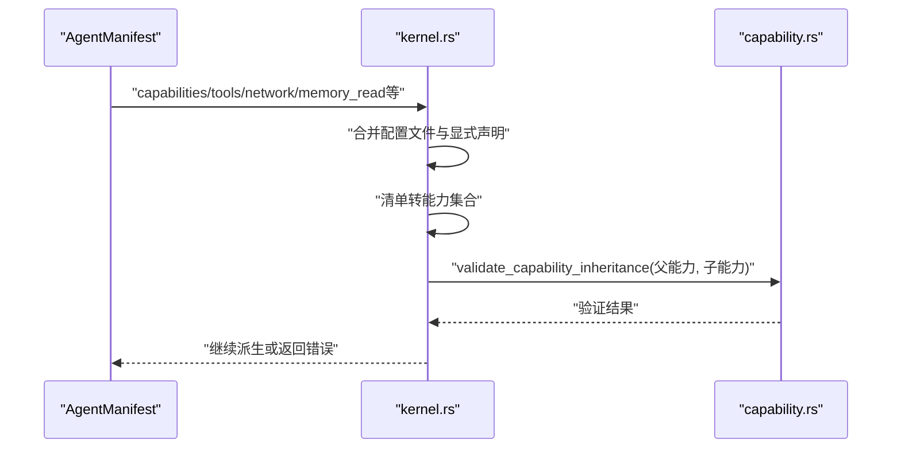
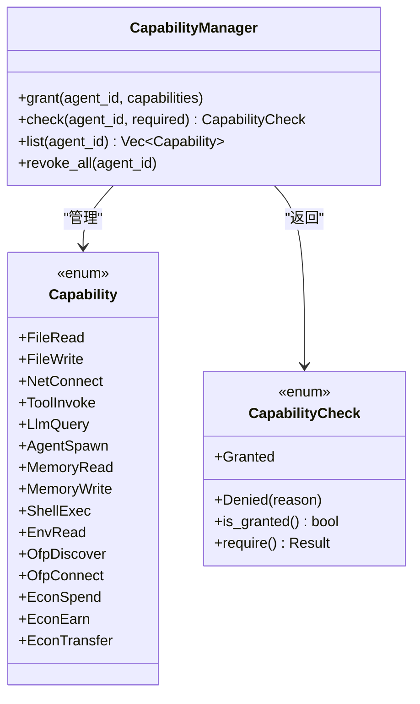
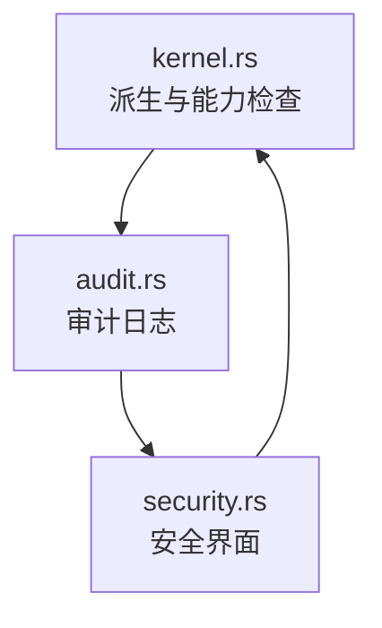
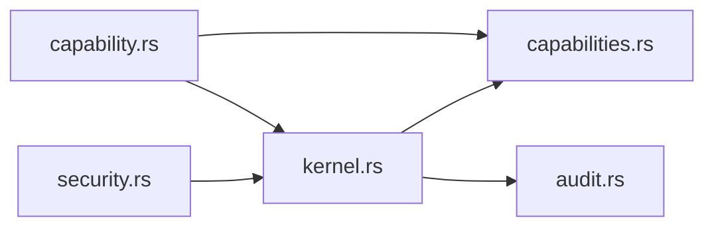

# 继承验证机制

<cite>
**本文档引用的文件**
- [crates/openfang-types/src/capability.rs](file://crates/openfang-types/src/capability.rs)
- [crates/openfang-kernel/src/kernel.rs](file://crates/openfang-kernel/src/kernel.rs)
- [crates/openfang-kernel/src/capabilities.rs](file://crates/openfang-kernel/src/capabilities.rs)
- [crates/openfang-types/src/agent.rs](file://crates/openfang-types/src/agent.rs)
- [crates/openfang-runtime/src/audit.rs](file://crates/openfang-runtime/src/audit.rs)
- [crates/openfang-cli/src/tui/screens/security.rs](file://crates/openfang-cli/src/tui/screens/security.rs)
</cite>

## 目录
1. [简介](#简介)
2. [项目结构](#项目结构)
3. [核心组件](#核心组件)
4. [架构概览](#架构概览)
5. [详细组件分析](#详细组件分析)
6. [依赖关系分析](#依赖关系分析)
7. [性能考虑](#性能考虑)
8. [故障排除指南](#故障排除指南)
9. [结论](#结论)
10. [附录](#附录)

## 简介
本文件系统性阐述 OpenFang 智能体继承验证机制，重点围绕 `validate_capability_inheritance()` 函数如何在智能体派生过程中防止权限提升（privilege escalation）。该机制通过严格的父智能体权限检查与子智能体权限继承限制，确保子智能体的能力始终是父智能体能力的子集，从而有效防范越权行为。

- 权限提升攻击防护原理：当子智能体声明的能力无法被父智能体已授予的能力覆盖时，派生过程直接拒绝，避免子智能体获得超出父级授权的权限。
- 子能力必须是父能力子集的要求：每个子能力都必须存在对应的父能力进行匹配，且匹配规则支持通配符与模式匹配。
- 验证时机：在解析子智能体清单并转换为能力集合后，立即执行继承验证，随后才进入正常的派生流程。
- 错误处理：验证失败返回明确的错误信息，指示具体被拒绝的子能力以及原因。

## 项目结构
继承验证机制涉及以下关键模块：
- 类型定义与匹配逻辑：位于 openfang-types 的 capability.rs，定义了能力类型、匹配规则与继承验证函数。
- 内核集成：位于 openfang-kernel 的 kernel.rs，负责将智能体清单转换为能力集合，并在派生前调用继承验证。
- 能力管理器：位于 openfang-kernel 的 capabilities.rs，提供运行时能力检查与审计记录。
- 工具与配置：位于 openfang-types 的 agent.rs，提供工具配置、资源配额与清单能力声明。
- 审计与监控：位于 openfang-runtime 的 audit.rs，记录能力检查与派生事件；CLI 安全界面展示继承验证功能状态。

**图表来源**
- [crates/openfang-types/src/capability.rs:100-187](file://crates/openfang-types/src/capability.rs#L100-L187)
- [crates/openfang-types/src/agent.rs:532-561](file://crates/openfang-types/src/agent.rs#L532-L561)
- [crates/openfang-kernel/src/kernel.rs:5434-5503](file://crates/openfang-kernel/src/kernel.rs#L5434-L5503)
- [crates/openfang-kernel/src/capabilities.rs:1-96](file://crates/openfang-kernel/src/capabilities.rs#L1-L96)
- [crates/openfang-runtime/src/audit.rs:113-136](file://crates/openfang-runtime/src/audit.rs#L113-L136)
- [crates/openfang-cli/src/tui/screens/security.rs:68-72](file://crates/openfang-cli/src/tui/screens/security.rs#L68-L72)

**章节来源**
- [crates/openfang-types/src/capability.rs:1-317](file://crates/openfang-types/src/capability.rs#L1-L317)
- [crates/openfang-kernel/src/kernel.rs:5434-5503](file://crates/openfang-kernel/src/kernel.rs#L5434-L5503)
- [crates/openfang-kernel/src/capabilities.rs:1-96](file://crates/openfang-kernel/src/capabilities.rs#L1-L96)
- [crates/openfang-types/src/agent.rs:532-561](file://crates/openfang-types/src/agent.rs#L532-L561)
- [crates/openfang-runtime/src/audit.rs:113-136](file://crates/openfang-runtime/src/audit.rs#L113-L136)
- [crates/openfang-cli/src/tui/screens/security.rs:68-72](file://crates/openfang-cli/src/tui/screens/security.rs#L68-L72)

## 核心组件
- 能力类型与匹配规则
  - 定义了文件读写、网络连接、工具调用、LLM 查询、代理交互、内存访问、Shell 执行、环境变量读取、OFP 协议、经济能力等多类能力。
  - 匹配规则支持精确匹配、通配符 "*"、glob 模式以及数值边界比较（如最大令牌数、最大支出）。
- 继承验证函数
  - 对子智能体的每个能力逐一检查，确认父智能体存在可覆盖的授予能力；若任一子能力无法被覆盖，则拒绝派生。
- 清单到能力转换
  - 将智能体清单中的能力声明转换为具体的能力枚举，支持配置文件与显式声明的合并。
- 能力管理器
  - 提供运行时能力检查、列表查询与撤销能力的功能，用于日常操作与审计。
- 审计与监控
  - 记录能力检查、代理派生等关键事件，支持审计链校验与 CLI 可视化。

**章节来源**
- [crates/openfang-types/src/capability.rs:10-187](file://crates/openfang-types/src/capability.rs#L10-L187)
- [crates/openfang-kernel/src/kernel.rs:5434-5503](file://crates/openfang-kernel/src/kernel.rs#L5434-L5503)
- [crates/openfang-kernel/src/capabilities.rs:22-48](file://crates/openfang-kernel/src/capabilities.rs#L22-L48)
- [crates/openfang-runtime/src/audit.rs:113-136](file://crates/openfang-runtime/src/audit.rs#L113-L136)

## 架构概览
继承验证在智能体派生流程中的位置如下：

**图表来源**
- [crates/openfang-kernel/src/kernel.rs:6370-6390](file://crates/openfang-kernel/src/kernel.rs#L6370-L6390)
- [crates/openfang-types/src/capability.rs:168-187](file://crates/openfang-types/src/capability.rs#L168-L187)

**章节来源**
- [crates/openfang-kernel/src/kernel.rs:6370-6390](file://crates/openfang-kernel/src/kernel.rs#L6370-L6390)
- [crates/openfang-types/src/capability.rs:168-187](file://crates/openfang-types/src/capability.rs#L168-L187)

## 详细组件分析

### 组件A：继承验证函数 validate_capability_inheritance()
- 功能概述
  - 核心职责：确保子智能体能力集合是父智能体能力集合的子集。
  - 实现方式：对子能力逐一扫描父能力集合，使用能力匹配规则判断是否存在覆盖项；若全部子能力均可被覆盖则通过，否则返回错误。
- 匹配规则要点
  - 通配符 "*" 可匹配任意值或任意工具调用。
  - Glob 模式支持前缀、后缀与中间通配符组合。
  - 数值能力采用下界/上界约束（如最大令牌数、最大支出）。
  - 布尔能力（如 AgentSpawn、OfpDiscover 等）精确匹配。
- 错误处理
  - 返回包含被拒绝能力的明确错误信息，便于定位问题。
- 测试用例
  - 子集场景通过：父具备更宽泛的授权，子具备更具体的授权。
  - 权限提升场景拒绝：父仅允许部分路径，子却要求通配符或危险能力。

**图表来源**
- [crates/openfang-types/src/capability.rs:168-187](file://crates/openfang-types/src/capability.rs#L168-L187)

**章节来源**
- [crates/openfang-types/src/capability.rs:168-187](file://crates/openfang-types/src/capability.rs#L168-L187)
- [crates/openfang-types/src/capability.rs:294-315](file://crates/openfang-types/src/capability.rs#L294-L315)

### 组件B：能力匹配与模式匹配
- 能力匹配函数 capability_matches()
  - 支持 ToolAll 对任意 ToolInvoke 的授权。
  - 文件/网络/工具/LLM/代理/内存/Shell/环境/OFP/经济等能力均按各自规则进行匹配。
  - Glob 匹配支持多种形态：前缀、后缀、中间通配符。
  - 数值能力采用大小比较，保证子能力不会超过父能力的上限。
- 运行时检查
  - 能力管理器在运行时对每次能力请求进行匹配检查，确保实时安全。

**图表来源**
- [crates/openfang-types/src/capability.rs:100-166](file://crates/openfang-types/src/capability.rs#L100-L166)

**章节来源**
- [crates/openfang-types/src/capability.rs:100-166](file://crates/openfang-types/src/capability.rs#L100-L166)
- [crates/openfang-kernel/src/capabilities.rs:27-48](file://crates/openfang-kernel/src/capabilities.rs#L27-L48)

### 组件C：清单到能力转换与派生入口
- 清单转换
  - 将 ManifestCapabilities 中的声明转换为具体的能力枚举，支持配置文件与显式声明的合并。
  - 若未设置显式工具列表，则使用工具配置文件推导出的能力作为基础。
- 派生入口
  - 在派生前调用继承验证，确保子能力合法。
  - 验证通过后继续常规派生流程。

**图表来源**
- [crates/openfang-kernel/src/kernel.rs:5434-5503](file://crates/openfang-kernel/src/kernel.rs#L5434-L5503)
- [crates/openfang-kernel/src/kernel.rs:6370-6390](file://crates/openfang-kernel/src/kernel.rs#L6370-L6390)

**章节来源**
- [crates/openfang-kernel/src/kernel.rs:5434-5503](file://crates/openfang-kernel/src/kernel.rs#L5434-L5503)
- [crates/openfang-kernel/src/kernel.rs:6370-6390](file://crates/openfang-kernel/src/kernel.rs#L6370-L6390)

### 组件D：能力管理器与运行时检查
- 能力管理器
  - 提供授予、检查、列出与撤销能力的接口，用于日常运行时控制。
- 运行时检查
  - 每次能力请求都会经过匹配检查，确保不越权。

**图表来源**
- [crates/openfang-kernel/src/capabilities.rs:8-62](file://crates/openfang-kernel/src/capabilities.rs#L8-L62)
- [crates/openfang-types/src/capability.rs:9-98](file://crates/openfang-types/src/capability.rs#L9-L98)

**章节来源**
- [crates/openfang-kernel/src/capabilities.rs:1-96](file://crates/openfang-kernel/src/capabilities.rs#L1-L96)
- [crates/openfang-types/src/capability.rs:74-98](file://crates/openfang-types/src/capability.rs#L74-L98)

### 组件E：审计与监控
- 审计记录
  - 记录能力检查、代理派生等关键事件，支持审计链校验。
- CLI 安全界面
  - 展示继承验证功能处于激活状态，便于运维人员确认安全特性启用情况。

**图表来源**
- [crates/openfang-runtime/src/audit.rs:113-136](file://crates/openfang-runtime/src/audit.rs#L113-L136)
- [crates/openfang-cli/src/tui/screens/security.rs:68-72](file://crates/openfang-cli/src/tui/screens/security.rs#L68-L72)

**章节来源**
- [crates/openfang-runtime/src/audit.rs:113-136](file://crates/openfang-runtime/src/audit.rs#L113-L136)
- [crates/openfang-cli/src/tui/screens/security.rs:68-72](file://crates/openfang-cli/src/tui/screens/security.rs#L68-L72)

## 依赖关系分析
- 组件耦合
  - kernel.rs 依赖 capability.rs 的继承验证与匹配函数。
  - capabilities.rs 依赖 capability.rs 的匹配规则进行运行时检查。
  - audit.rs 与 CLI security.rs 作为监控与可视化组件，间接依赖内核与能力管理器。
- 外部依赖
  - 使用 serde 进行序列化/反序列化，确保清单与能力数据的跨模块传递。
  - 使用 tracing 进行调试与审计日志输出。

**图表来源**
- [crates/openfang-types/src/capability.rs:1-317](file://crates/openfang-types/src/capability.rs#L1-L317)
- [crates/openfang-kernel/src/kernel.rs:5434-5503](file://crates/openfang-kernel/src/kernel.rs#L5434-L5503)
- [crates/openfang-kernel/src/capabilities.rs:1-96](file://crates/openfang-kernel/src/capabilities.rs#L1-L96)
- [crates/openfang-runtime/src/audit.rs:113-136](file://crates/openfang-runtime/src/audit.rs#L113-L136)
- [crates/openfang-cli/src/tui/screens/security.rs:68-72](file://crates/openfang-cli/src/tui/screens/security.rs#L68-L72)

**章节来源**
- [crates/openfang-types/src/capability.rs:1-317](file://crates/openfang-types/src/capability.rs#L1-L317)
- [crates/openfang-kernel/src/kernel.rs:5434-5503](file://crates/openfang-kernel/src/kernel.rs#L5434-L5503)
- [crates/openfang-kernel/src/capabilities.rs:1-96](file://crates/openfang-kernel/src/capabilities.rs#L1-L96)

## 性能考虑
- 时间复杂度
  - 继承验证对每个子能力执行一次父能力集合的线性扫描，整体复杂度为 O(N×M)，其中 N 为子能力数量，M 为父能力数量。对于典型场景（能力数量有限），性能开销可忽略。
- 空间复杂度
  - 能力集合存储与临时转换均为线性开销，通常不影响性能。
- 优化建议
  - 在父能力集合较大时，可考虑预构建索引（如按能力类型分组）以降低匹配成本。
  - 对于频繁派生的场景，可缓存清单到能力的转换结果，减少重复计算。

[本节为通用性能讨论，无需特定文件来源]

## 故障排除指南
- 常见错误与排查
  - "权限提升被拒绝"：检查子智能体清单中是否存在父智能体未授予的能力（如通配符或危险能力）。根据错误提示定位具体被拒绝的能力项。
  - 运行时能力检查失败：确认能力管理器中是否正确授予了相应能力，或检查模式匹配是否符合预期（通配符、Glob 规则）。
- 审计与验证
  - 通过 CLI 安全界面查看继承验证功能状态，确认其处于激活状态。
  - 使用审计接口查询最近事件，核对派生与能力检查记录，辅助定位问题。

**章节来源**
- [crates/openfang-types/src/capability.rs:168-187](file://crates/openfang-types/src/capability.rs#L168-L187)
- [crates/openfang-kernel/src/capabilities.rs:27-48](file://crates/openfang-kernel/src/capabilities.rs#L27-L48)
- [crates/openfang-cli/src/tui/screens/security.rs:68-72](file://crates/openfang-cli/src/tui/screens/security.rs#L68-L72)
- [crates/openfang-runtime/src/audit.rs:113-136](file://crates/openfang-runtime/src/audit.rs#L113-L136)

## 结论
继承验证机制通过严格的父-子能力匹配与子集约束，有效防止智能体在派生过程中发生权限提升。结合清单到能力转换、运行时能力检查与审计监控，形成了从设计到运行的完整安全闭环。该机制既保障了系统的安全性，又保持了灵活性，使父智能体能够精细地控制子智能体的权限范围。

[本节为总结性内容，无需特定文件来源]

## 附录
- 权限配置安全策略
  - 最小授权原则：仅授予子智能体完成任务所需的最小能力集合。
  - 明确模式：优先使用精确路径与主机名，避免过度使用通配符。
  - 数值上限：合理设置最大令牌数与最大支出，防止滥用。
- 审计方法
  - 定期检查审计日志，关注能力检查与派生事件。
  - 使用 CLI 安全界面核对关键安全特性状态。
  - 对异常事件进行溯源与复盘，持续优化权限配置。

[本节为通用指导，无需特定文件来源]