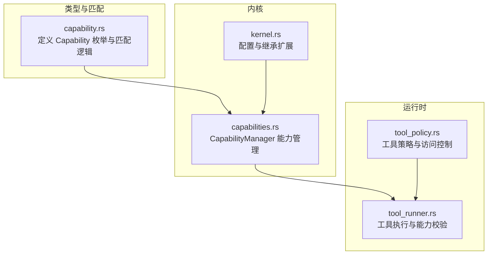
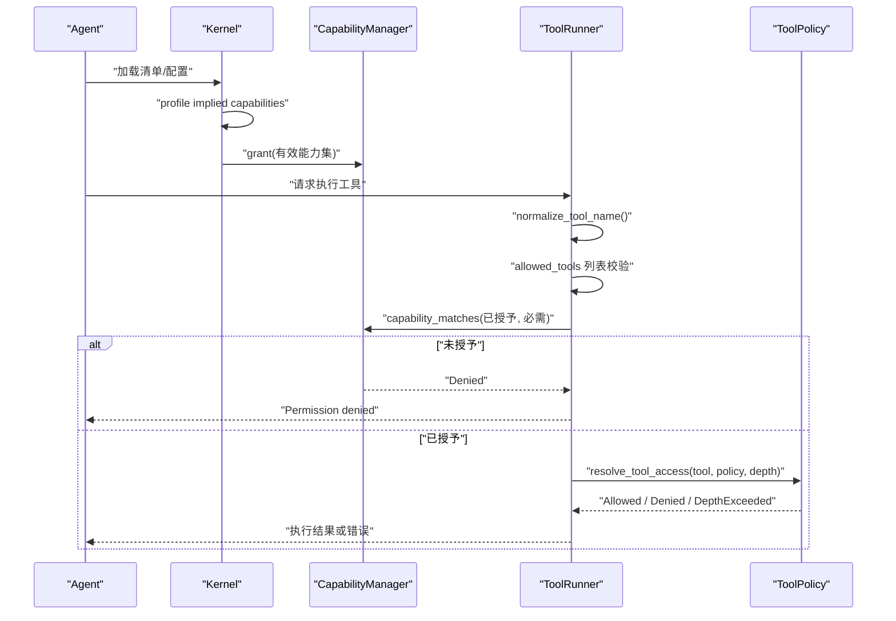
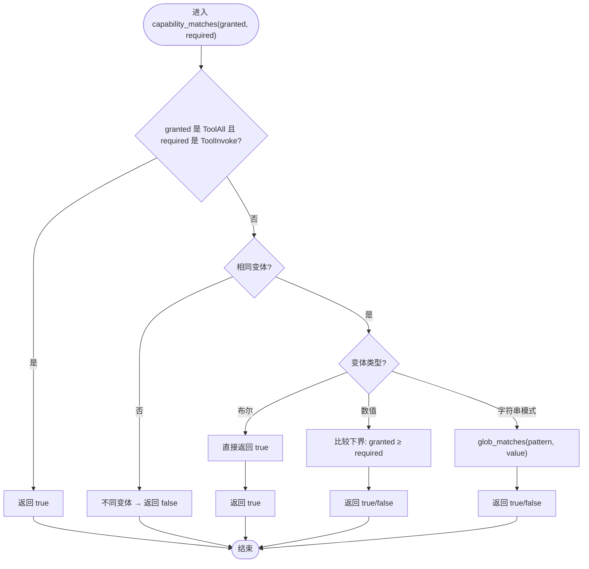
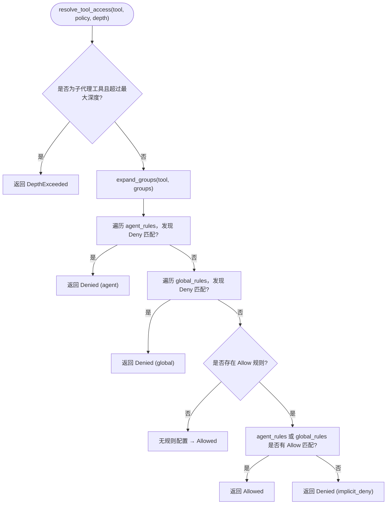
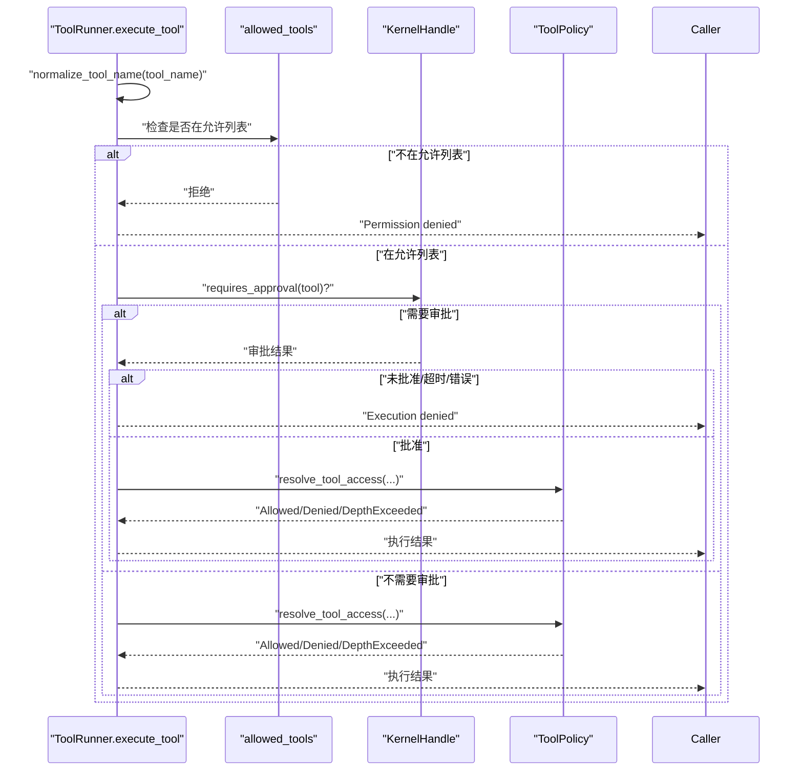
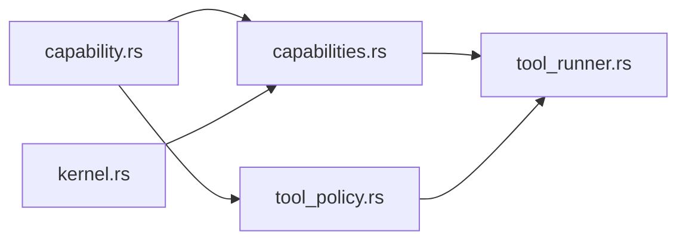

# 能力匹配机制

<cite>
**本文引用的文件**
- [capability.rs](file://crates/openfang-types/src/capability.rs)
- [capabilities.rs](file://crates/openfang-kernel/src/capabilities.rs)
- [tool_policy.rs](file://crates/openfang-runtime/src/tool_policy.rs)
- [tool_runner.rs](file://crates/openfang-runtime/src/tool_runner.rs)
- [agent.rs](file://crates/openfang-types/src/agent.rs)
- [kernel.rs](file://crates/openfang-kernel/src/kernel.rs)
</cite>

## 目录
1. [简介](#简介)
2. [项目结构](#项目结构)
3. [核心组件](#核心组件)
4. [架构总览](#架构总览)
5. [详细组件分析](#详细组件分析)
6. [依赖关系分析](#依赖关系分析)
7. [性能考量](#性能考量)
8. [故障排查指南](#故障排查指南)
9. [结论](#结论)
10. [附录](#附录)

## 简介
本文件系统化阐述 OpenFang 的“能力匹配机制”，重点围绕 capability_matches() 函数的匹配规则与实现，涵盖：
- 精确匹配、通配符匹配（*）、Glob 模式匹配（*.example.com）
- 中间通配符（api.*.com）匹配
- 数值能力边界检查（LlmMaxTokens、EconSpend）
- ToolAll 对具体工具调用的授权机制
- 布尔能力的简单匹配
- 不同变体间的不兼容性
- 匹配算法实现、性能考虑与测试用例分析

同时补充工具策略（ToolPolicy）中的多层访问控制（deny-wins、组展开、深度限制），以及在运行时执行工具前的“允许列表”校验流程。

## 项目结构
能力匹配机制涉及以下模块：
- 类型与匹配规则定义：crates/openfang-types/src/capability.rs
- 能力管理器：crates/openfang-kernel/src/capabilities.rs
- 工具策略与访问控制：crates/openfang-runtime/src/tool_policy.rs
- 工具执行与能力校验：crates/openfang-runtime/src/tool_runner.rs
- 配置与继承：crates/openfang-types/src/agent.rs、crates/openfang-kernel/src/kernel.rs

图表来源
- [capability.rs:100-166](file://crates/openfang-types/src/capability.rs#L100-L166)
- [capabilities.rs:27-48](file://crates/openfang-kernel/src/capabilities.rs#L27-L48)
- [tool_policy.rs:76-145](file://crates/openfang-runtime/src/tool_policy.rs#L76-L145)
- [tool_runner.rs:99-134](file://crates/openfang-runtime/src/tool_runner.rs#L99-L134)
- [kernel.rs:5438-5503](file://crates/openfang-kernel/src/kernel.rs#L5438-L5503)

章节来源
- [capability.rs:1-317](file://crates/openfang-types/src/capability.rs#L1-L317)
- [capabilities.rs:1-96](file://crates/openfang-kernel/src/capabilities.rs#L1-L96)
- [tool_policy.rs:1-479](file://crates/openfang-runtime/src/tool_policy.rs#L1-L479)
- [tool_runner.rs:1-800](file://crates/openfang-runtime/src/tool_runner.rs#L1-L800)
- [agent.rs:345-368](file://crates/openfang-types/src/agent.rs#L345-L368)
- [kernel.rs:5438-5503](file://crates/openfang-kernel/src/kernel.rs#L5438-L5503)

## 核心组件
- Capability 枚举：定义所有可授权的权限类型，包括文件系统、网络、工具、LLM、代理交互、内存、Shell、OFP、经济等。
- capability_matches()：统一的匹配函数，支持精确匹配、通配符、Glob、中间通配符、布尔能力、数值边界与变体不兼容性。
- CapabilityManager：按代理维度维护已授予的能力集合，并提供检查接口。
- ToolPolicy：多层工具策略（agent/global 规则、组展开、深度限制），并提供 deny-wins 优先级。
- ToolRunner：在执行工具前进行“允许列表”校验与审批门禁。

章节来源
- [capability.rs:10-72](file://crates/openfang-types/src/capability.rs#L10-L72)
- [capability.rs:100-166](file://crates/openfang-types/src/capability.rs#L100-L166)
- [capabilities.rs:27-48](file://crates/openfang-kernel/src/capabilities.rs#L27-L48)
- [tool_policy.rs:36-145](file://crates/openfang-runtime/src/tool_policy.rs#L36-L145)
- [tool_runner.rs:99-171](file://crates/openfang-runtime/src/tool_runner.rs#L99-L171)

## 架构总览
能力匹配贯穿“声明—授予—检查—执行”的闭环：
- 声明：Agent 清单中通过 profile 或显式 capabilities 声明所需能力。
- 授予：内核根据清单生成有效能力集合并授予。
- 检查：每次请求能力或执行工具时，先由 CapabilityManager 检查是否被授予；再由工具策略进一步约束。
- 执行：工具执行前再次基于“允许列表”与审批门禁进行二次校验。

图表来源
- [kernel.rs:5438-5503](file://crates/openfang-kernel/src/kernel.rs#L5438-L5503)
- [capabilities.rs:27-48](file://crates/openfang-kernel/src/capabilities.rs#L27-L48)
- [tool_runner.rs:99-171](file://crates/openfang-runtime/src/tool_runner.rs#L99-L171)
- [tool_policy.rs:76-145](file://crates/openfang-runtime/src/tool_policy.rs#L76-L145)

## 详细组件分析

### capability_matches() 匹配规则详解
- 精确匹配：当模式串与目标完全一致时匹配成功。
- 通配符匹配：模式为 "*" 时匹配任意目标。
- Glob 前缀/后缀匹配：以 "*" 开头（后缀）或以 "*" 结尾（前缀）时，分别判断后缀或前缀匹配。
- 中间通配符匹配："prefix*suffix" 形式，要求字符串同时满足前缀与后缀，并且长度足够。
- 变体不兼容：不同枚举变体之间永不匹配（例如 FileRead 与 FileWrite）。
- ToolAll 特例：ToolAll 可授予任意 ToolInvoke 权限。
- 布尔能力：AgentSpawn、OfpDiscover、OfpAdvertise、EconEarn 等无参数变体直接匹配。
- 数值边界：NetListen 端口必须相等；LlmMaxTokens 与 EconSpend 采用下界比较（授予值 ≥ 请求值）。

图表来源
- [capability.rs:100-166](file://crates/openfang-types/src/capability.rs#L100-L166)
- [capability.rs:189-212](file://crates/openfang-types/src/capability.rs#L189-L212)

章节来源
- [capability.rs:100-166](file://crates/openfang-types/src/capability.rs#L100-L166)
- [capability.rs:189-212](file://crates/openfang-types/src/capability.rs#L189-L212)

### ToolAll 对具体工具调用的授权机制
- ToolAll 是一种危险的授权，授予者可一次性放行所有 ToolInvoke 条目。
- 具体到某一次 ToolInvoke 请求时，若授予方为 ToolAll，则直接放行。
- 这种设计避免了为每个工具单独授予的繁琐，但需要谨慎使用。

章节来源
- [capability.rs:108-121](file://crates/openfang-types/src/capability.rs#L108-L121)
- [capability.rs:243-248](file://crates/openfang-types/src/capability.rs#L243-L248)

### 布尔能力的简单匹配与不同变体间的不兼容性
- 布尔能力无需模式匹配，只要求变体一致即可。
- 不同变体之间永不匹配，如 FileRead 与 FileWrite、NetConnect 与 AgentMessage 等。

章节来源
- [capability.rs:146-165](file://crates/openfang-types/src/capability.rs#L146-L165)

### 数值能力边界检查（LlmMaxTokens、EconSpend）
- LlmMaxTokens：授予的最大令牌数必须大于等于请求的令牌数。
- EconSpend：授予的美元额度必须大于等于请求的花费金额。
- NetListen：端口必须完全相等。

章节来源
- [capability.rs:152-161](file://crates/openfang-types/src/capability.rs#L152-L161)

### Glob 模式匹配算法实现
- 支持 "*" 作为通配符，匹配任意字符序列。
- 支持前缀/后缀匹配（strip_prefix/strip_suffix）。
- 支持中间通配符（prefix*suffix），要求前后缀同时满足且长度足够。
- 复杂度：对单个模式的匹配为 O(n)，其中 n 为待匹配字符串长度；整体复杂度取决于匹配的模式数量。

章节来源
- [capability.rs:189-212](file://crates/openfang-types/src/capability.rs#L189-L212)

### ToolPolicy 多层访问控制（deny-wins、组展开、深度限制）
- deny-wins：若存在任何 deny 规则匹配，立即拒绝，无论是否存在 allow 规则。
- agent_rules 优先于 global_rules：agent 层规则优先级更高。
- 组展开：支持通过 @group_name 引用工具组，组内的工具模式参与匹配。
- 深度限制：对子代理相关工具（agent_spawn、agent_kill 等）设置最大嵌套深度，防止无限递归。

图表来源
- [tool_policy.rs:76-145](file://crates/openfang-runtime/src/tool_policy.rs#L76-L145)
- [tool_policy.rs:152-177](file://crates/openfang-runtime/src/tool_policy.rs#L152-L177)
- [tool_policy.rs:249-275](file://crates/openfang-runtime/src/tool_policy.rs#L249-L275)

章节来源
- [tool_policy.rs:76-145](file://crates/openfang-runtime/src/tool_policy.rs#L76-L145)
- [tool_policy.rs:152-177](file://crates/openfang-runtime/src/tool_policy.rs#L152-L177)
- [tool_policy.rs:249-275](file://crates/openfang-runtime/src/tool_policy.rs#L249-L275)

### 运行时工具执行前的能力校验
- normalize_tool_name：标准化工具名，避免 LLM 幻觉导致的别名问题。
- allowed_tools 列表校验：若提供了允许列表，仅允许列表内的工具执行，否则直接拒绝。
- 审批门禁：若工具需要人类审批，先请求审批，批准后才继续执行。

图表来源
- [tool_runner.rs:99-171](file://crates/openfang-runtime/src/tool_runner.rs#L99-L171)
- [tool_policy.rs:76-145](file://crates/openfang-runtime/src/tool_policy.rs#L76-L145)

章节来源
- [tool_runner.rs:99-171](file://crates/openfang-runtime/src/tool_runner.rs#L99-L171)

### 配置与继承扩展（profile implied capabilities）
- 当清单未显式声明某些能力时，可通过 profile 推导出隐含能力（如网络、Shell、代理相关、内存读写等）。
- 内核在生成有效能力集时会合并 profile 与显式配置，确保最小权限原则与安全默认。

章节来源
- [agent.rs:345-368](file://crates/openfang-types/src/agent.rs#L345-L368)
- [kernel.rs:5438-5503](file://crates/openfang-kernel/src/kernel.rs#L5438-L5503)

## 依赖关系分析
- capability.rs 为所有匹配逻辑的核心，被 capabilities.rs 与 tool_policy.rs 引用。
- capabilities.rs 依赖 capability.rs 提供的匹配函数，用于能力检查。
- tool_policy.rs 与 tool_runner.rs 协作，前者负责工具策略解析，后者负责执行前的“允许列表”与审批门禁。
- kernel.rs 负责从清单与 profile 生成有效能力集，供 capabilities.rs 使用。

图表来源
- [capability.rs:100-166](file://crates/openfang-types/src/capability.rs#L100-L166)
- [capabilities.rs:27-48](file://crates/openfang-kernel/src/capabilities.rs#L27-L48)
- [tool_policy.rs:76-145](file://crates/openfang-runtime/src/tool_policy.rs#L76-L145)
- [tool_runner.rs:99-171](file://crates/openfang-runtime/src/tool_runner.rs#L99-L171)
- [kernel.rs:5438-5503](file://crates/openfang-kernel/src/kernel.rs#L5438-L5503)

章节来源
- [capability.rs:100-166](file://crates/openfang-types/src/capability.rs#L100-L166)
- [capabilities.rs:27-48](file://crates/openfang-kernel/src/capabilities.rs#L27-L48)
- [tool_policy.rs:76-145](file://crates/openfang-runtime/src/tool_policy.rs#L76-L145)
- [tool_runner.rs:99-171](file://crates/openfang-runtime/src/tool_runner.rs#L99-L171)
- [kernel.rs:5438-5503](file://crates/openfang-kernel/src/kernel.rs#L5438-L5503)

## 性能考量
- 匹配复杂度
  - 字符串模式匹配 glob_matches()：对单次匹配为 O(n)，n 为字符串长度；整体复杂度取决于授予能力的数量与模式数量。
  - 数值边界检查：O(1)。
  - 布尔能力匹配：O(1)。
- 访问控制复杂度
  - ToolPolicy.resolve_tool_access()：线性扫描 agent_rules 与 global_rules，最坏 O(A+G)，A/G 分别为规则条数。
  - expand_groups()：对每个组进行 glob 匹配，最坏 O(G·T)，T 为工具名数量。
- 实践建议
  - 将常用/高命中率的规则置于 agent_rules 前部，减少全局规则扫描。
  - 合理使用通配符，避免过长的中间通配符链导致多次查找。
  - 控制允许列表大小，避免在 ToolRunner 中进行大规模线性查找。

[本节为通用性能讨论，不直接分析具体文件]

## 故障排查指南
- “Permission denied: agent does not have capability to use tool”
  - 检查 agent 的 allowed_tools 是否包含该工具名（可能需要标准化后的名称）。
  - 确认清单中是否授予了 ToolAll 或具体的 ToolInvoke 权限。
- “Agent {id} does not have capability”
  - 确认 CapabilityManager 中是否正确授予了相应能力。
  - 检查是否误用了不同变体（如 FileRead 与 FileWrite）。
- “Execution denied: requires human approval and was denied or timed out”
  - 审批系统返回拒绝或超时，需重新发起审批或调整审批策略。
- “DepthExceeded”
  - 子代理工具嵌套深度超过限制，需调整策略或重构工作流。

章节来源
- [tool_runner.rs:122-171](file://crates/openfang-runtime/src/tool_runner.rs#L122-L171)
- [capabilities.rs:27-48](file://crates/openfang-kernel/src/capabilities.rs#L27-L48)
- [tool_policy.rs:76-145](file://crates/openfang-runtime/src/tool_policy.rs#L76-L145)

## 结论
OpenFang 的能力匹配机制以 capability_matches() 为核心，结合布尔能力、数值边界与字符串模式匹配，形成细粒度的安全控制。配合 ToolPolicy 的多层访问控制与运行时的“允许列表”校验，实现了从声明、授予、检查到执行的全链路安全。实践中应遵循最小权限原则，谨慎授予 ToolAll，并合理设计工具策略与深度限制，以平衡安全性与可用性。

[本节为总结性内容，不直接分析具体文件]

## 附录

### 测试用例要点
- 精确匹配、通配符匹配、中间通配符匹配、ToolAll 授权、不同变体不兼容、数值边界检查、继承校验等均有单元测试覆盖。

章节来源
- [capability.rs:214-317](file://crates/openfang-types/src/capability.rs#L214-L317)
- [tool_policy.rs:277-479](file://crates/openfang-runtime/src/tool_policy.rs#L277-L479)