# 能力安全模型

<cite>
**本文引用的文件**
- [capabilities.rs](file://crates/openfang-kernel/src/capabilities.rs)
- [capability.rs](file://crates/openfang-types/src/capability.rs)
- [host_functions.rs](file://crates/openfang-runtime/src/host_functions.rs)
- [sandbox.rs](file://crates/openfang-runtime/src/sandbox.rs)
- [taint.rs](file://crates/openfang-types/src/taint.rs)
- [auth.rs](file://crates/openfang-kernel/src/auth.rs)
- [session_auth.rs](file://crates/openfang-api/src/session_auth.rs)
- [rate_limiter.rs](file://crates/openfang-api/src/rate_limiter.rs)
- [web_fetch.rs](file://crates/openfang-runtime/src/web_fetch.rs)
- [config.rs](file://crates/openfang-kernel/src/config.rs)
- [security.rs](file://crates/openfang-cli/src/tui/screens/security.rs)
- [kernel.rs](file://crates/openfang-kernel/src/kernel.rs)
</cite>

## 目录
1. [引言](#引言)
2. [项目结构](#项目结构)
3. [核心组件](#核心组件)
4. [架构总览](#架构总览)
5. [详细组件分析](#详细组件分析)
6. [依赖关系分析](#依赖关系分析)
7. [性能考量](#性能考量)
8. [故障排查指南](#故障排查指南)
9. [结论](#结论)
10. [附录](#附录)

## 引言
本文件系统化阐述 OpenFang 的“能力安全模型”，围绕 16 层安全防护机制展开：能力类型与匹配规则、继承验证、强制执行流程；覆盖工具访问、内存访问、网络访问、智能体交互、Shell 访问、OFP（OpenFang Wire Protocol）网络等关键场景；并提供权限检查流程、路径遍历防护、能力继承验证、并发安全保证、安全配置指南与威胁防护策略。

## 项目结构
OpenFang 将安全能力贯穿内核、运行时、类型系统与 API 层：
- 类型层：定义能力枚举、匹配规则、污点模型与错误类型
- 内核层：能力管理器、认证授权、配置加载与合并
- 运行时层：WASM 沙箱、主机函数调用、路径解析与 SSRF 防护、工具策略
- API 层：会话认证、速率限制、安全中间件

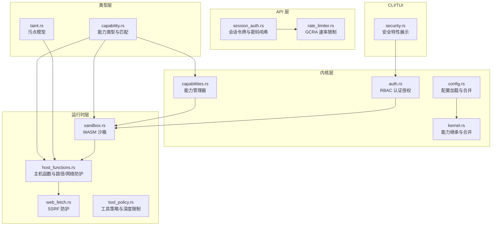

图表来源
- [capability.rs:10-72](file://crates/openfang-types/src/capability.rs#L10-L72)
- [capabilities.rs:9-62](file://crates/openfang-kernel/src/capabilities.rs#L9-L62)
- [auth.rs:98-189](file://crates/openfang-kernel/src/auth.rs#L98-L189)
- [config.rs:18-224](file://crates/openfang-kernel/src/config.rs#L18-L224)
- [kernel.rs:5438-5472](file://crates/openfang-kernel/src/kernel.rs#L5438-L5472)
- [sandbox.rs:98-388](file://crates/openfang-runtime/src/sandbox.rs#L98-L388)
- [host_functions.rs:73-269](file://crates/openfang-runtime/src/host_functions.rs#L73-L269)
- [web_fetch.rs:40-235](file://crates/openfang-runtime/src/web_fetch.rs#L40-L235)
- [taint.rs:12-158](file://crates/openfang-types/src/taint.rs#L12-L158)
- [session_auth.rs:9-72](file://crates/openfang-api/src/session_auth.rs#L9-L72)
- [rate_limiter.rs:37-64](file://crates/openfang-api/src/rate_limiter.rs#L37-L64)
- [security.rs:72-136](file://crates/openfang-cli/src/tui/screens/security.rs#L72-L136)

章节来源
- [capability.rs:1-317](file://crates/openfang-types/src/capability.rs#L1-L317)
- [capabilities.rs:1-96](file://crates/openfang-kernel/src/capabilities.rs#L1-L96)
- [auth.rs:1-317](file://crates/openfang-kernel/src/auth.rs#L1-L317)
- [config.rs:1-458](file://crates/openfang-kernel/src/config.rs#L1-L458)
- [kernel.rs:5438-5472](file://crates/openfang-kernel/src/kernel.rs#L5438-L5472)
- [sandbox.rs:1-608](file://crates/openfang-runtime/src/sandbox.rs#L1-L608)
- [host_functions.rs:73-269](file://crates/openfang-runtime/src/host_functions.rs#L73-L269)
- [web_fetch.rs:40-235](file://crates/openfang-runtime/src/web_fetch.rs#L40-L235)
- [taint.rs:1-245](file://crates/openfang-types/src/taint.rs#L1-L245)
- [session_auth.rs:1-110](file://crates/openfang-api/src/session_auth.rs#L1-L110)
- [rate_limiter.rs:37-64](file://crates/openfang-api/src/rate_limiter.rs#L37-L64)
- [security.rs:72-136](file://crates/openfang-cli/src/tui/screens/security.rs#L72-L136)

## 核心组件
- 能力类型与匹配：统一的能力枚举、模式匹配与继承校验
- 能力管理器：按 AgentId 授予与检查能力
- RBAC 认证授权：用户角色与动作授权
- WASM 沙箱：默认拒绝、能力门禁、燃料与超时控制
- 主机函数与路径/网络防护：路径遍历拒绝、SSRF 检测
- 污点跟踪：标签化数据流，敏感汇阻断
- 工具策略：优先级与通配符、组扩展、子代理深度限制
- 会话与速率限制：无状态会话令牌、GCRA 限流
- 配置加载与合并：安全 include、深度限制与目录边界

章节来源
- [capability.rs:10-187](file://crates/openfang-types/src/capability.rs#L10-L187)
- [capabilities.rs:9-62](file://crates/openfang-kernel/src/capabilities.rs#L9-L62)
- [auth.rs:98-189](file://crates/openfang-kernel/src/auth.rs#L98-L189)
- [sandbox.rs:98-388](file://crates/openfang-runtime/src/sandbox.rs#L98-L388)
- [host_functions.rs:73-269](file://crates/openfang-runtime/src/host_functions.rs#L73-L269)
- [taint.rs:12-158](file://crates/openfang-types/src/taint.rs#L12-L158)
- [web_fetch.rs:40-235](file://crates/openfang-runtime/src/web_fetch.rs#L40-L235)
- [session_auth.rs:9-72](file://crates/openfang-api/src/session_auth.rs#L9-L72)
- [rate_limiter.rs:37-64](file://crates/openfang-api/src/rate_limiter.rs#L37-L64)
- [config.rs:116-224](file://crates/openfang-kernel/src/config.rs#L116-L224)

## 架构总览
OpenFang 的能力安全模型以“类型定义—内核管理—运行时强制—API 边界”为主线，形成多层纵深防御：

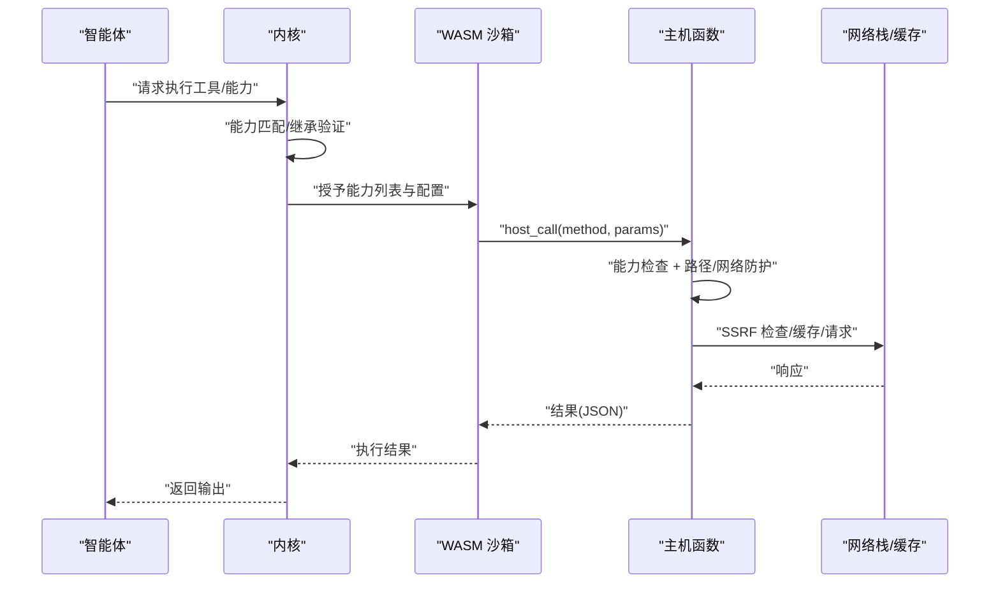

图表来源
- [kernel.rs:5438-5472](file://crates/openfang-kernel/src/kernel.rs#L5438-L5472)
- [capabilities.rs:27-48](file://crates/openfang-kernel/src/capabilities.rs#L27-L48)
- [sandbox.rs:277-388](file://crates/openfang-runtime/src/sandbox.rs#L277-L388)
- [host_functions.rs:194-265](file://crates/openfang-runtime/src/host_functions.rs#L194-L265)
- [web_fetch.rs:46-74](file://crates/openfang-runtime/src/web_fetch.rs#L46-L74)

## 详细组件分析

### 能力类型与继承验证
- 能力类型涵盖：文件读写、网络连接/监听、工具调用、LLM 查询/预算、智能体消息/杀伤、内存读写、Shell 执行/环境变量读取、OFP 发现/连接/广告、经济支出/入账/转账
- 匹配规则：支持精确匹配、通配符“*”、前缀/后缀/中缀通配；数值型能力进行上下界比较
- 继承验证：子能力必须被父能力集合所覆盖，防止越权提升

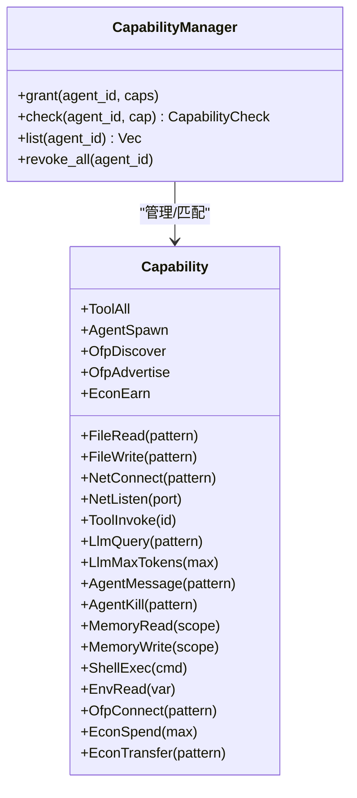

图表来源
- [capability.rs:10-72](file://crates/openfang-types/src/capability.rs#L10-L72)
- [capabilities.rs:9-62](file://crates/openfang-kernel/src/capabilities.rs#L9-L62)

章节来源
- [capability.rs:100-187](file://crates/openfang-types/src/capability.rs#L100-L187)
- [capabilities.rs:27-62](file://crates/openfang-kernel/src/capabilities.rs#L27-L62)

### 权限检查流程与能力继承
- 能力继承：当清单未显式声明工具能力时，使用 profile 的隐含能力，并与显式网络/Shell/消息/内存/OFP 等能力进行合并，确保子能力不越权
- 检查顺序：先能力匹配，再路径/网络等二次安全检查

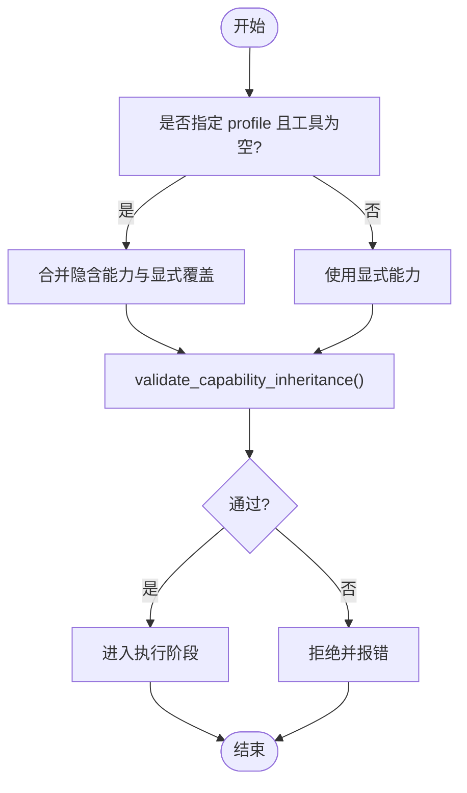

图表来源
- [kernel.rs:5438-5472](file://crates/openfang-kernel/src/kernel.rs#L5438-L5472)
- [capability.rs:168-187](file://crates/openfang-types/src/capability.rs#L168-L187)

章节来源
- [kernel.rs:5438-5472](file://crates/openfang-kernel/src/kernel.rs#L5438-L5472)
- [capability.rs:168-187](file://crates/openfang-types/src/capability.rs#L168-L187)

### 路径遍历防护与安全路径解析
- 安全路径解析：拒绝“..”组件，解析符号链接，规范化路径
- 写入场景：仅允许在已存在父目录下写入，再次校验文件名不含“..”
- 文件系统主机函数：在能力检查后，仍进行路径规范化与遍历拒绝

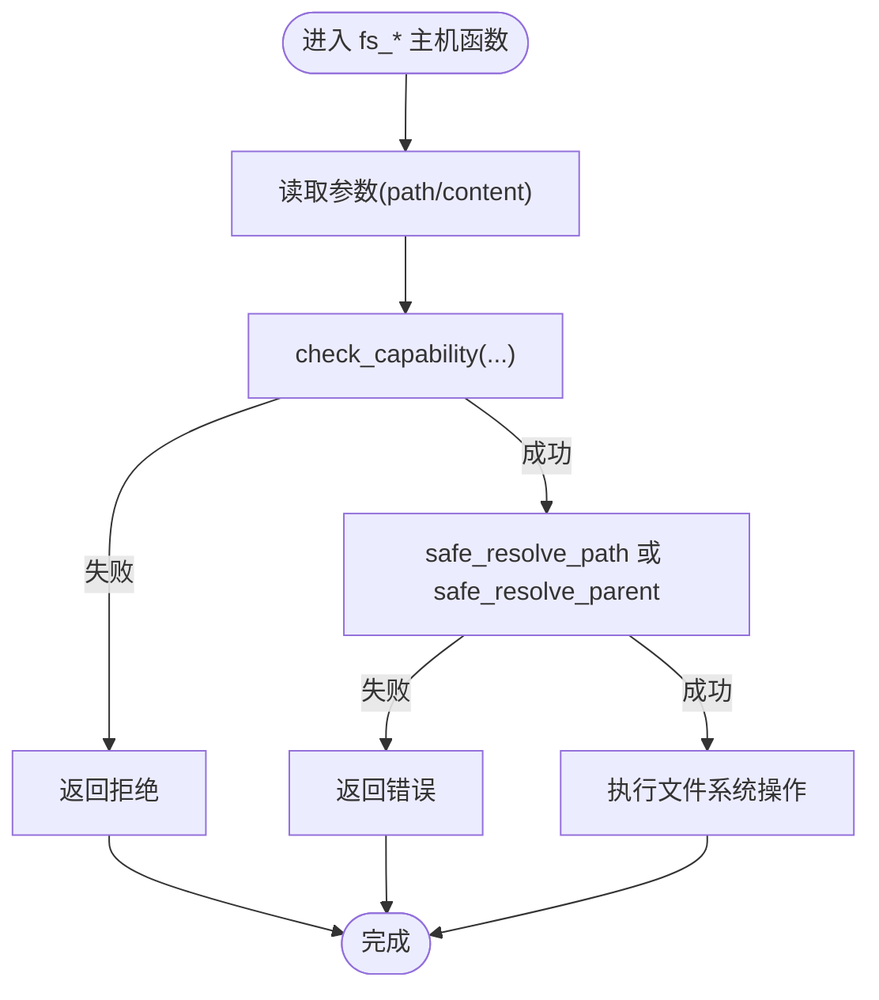

图表来源
- [host_functions.rs:194-265](file://crates/openfang-runtime/src/host_functions.rs#L194-L265)

章节来源
- [host_functions.rs:73-117](file://crates/openfang-runtime/src/host_functions.rs#L73-L117)

### 网络访问与 SSRF 防护
- 主机函数网络检查：仅允许 http/https，阻断 file/gopher/ftp；解析主机并检查解析到的每个 IP 是否为私有/回环/未指定
- Web 请求封装：GET 使用缓存键命中；统一 UA；方法白名单；对私有地址与元数据服务进行阻断
- 运行时 SSRF：主机函数与 web_fetch 双重检查，确保在发起任何网络 I/O 前完成检测

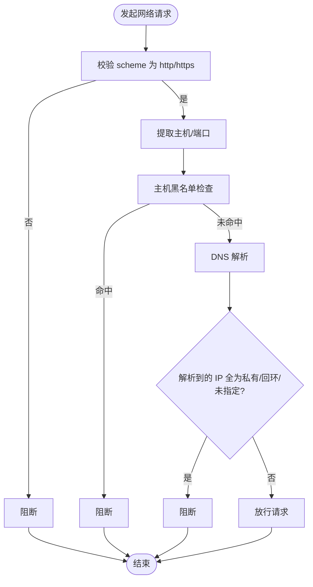

图表来源
- [host_functions.rs:123-176](file://crates/openfang-runtime/src/host_functions.rs#L123-L176)
- [web_fetch.rs:46-74](file://crates/openfang-runtime/src/web_fetch.rs#L46-L74)
- [web_fetch.rs:202-235](file://crates/openfang-runtime/src/web_fetch.rs#L202-L235)

章节来源
- [host_functions.rs:123-176](file://crates/openfang-runtime/src/host_functions.rs#L123-L176)
- [web_fetch.rs:40-235](file://crates/openfang-runtime/src/web_fetch.rs#L40-L235)

### 智能体操作与 Shell 访问
- 智能体消息/杀伤：支持模式匹配，防止任意广播或误杀
- Shell 执行：严格模式下禁止任意通配，结合污点模型阻断外部输入注入
- 污点模型：对 shell_exec、net_fetch、agent_message 等敏感汇设置阻断标签，必要时需显式去分类

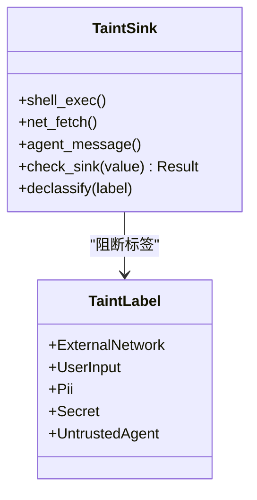

图表来源
- [taint.rs:12-158](file://crates/openfang-types/src/taint.rs#L12-L158)

章节来源
- [taint.rs:83-158](file://crates/openfang-types/src/taint.rs#L83-L158)
- [host_functions.rs:194-265](file://crates/openfang-runtime/src/host_functions.rs#L194-L265)

### 工具访问与子代理深度限制
- 工具策略：deny-wins、优先级（agent > global）、通配符与组扩展、显式 allow 列表
- 子代理限制：顶层无限制；深度 > 0 移除调度/进程类工具；接近最大深度时禁止 spawn/kill
- 默认允许：若无规则则放行

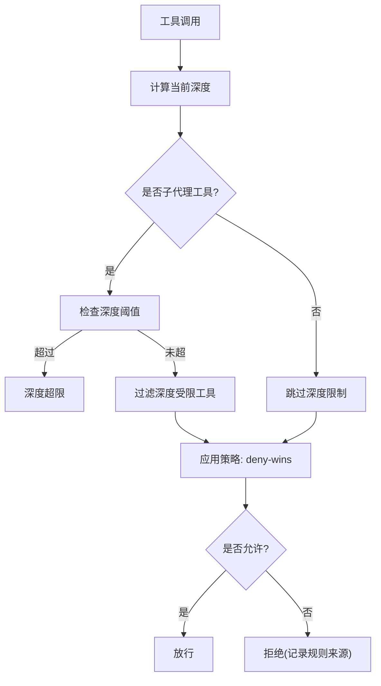

图表来源
- [tool_policy.rs:76-145](file://crates/openfang-runtime/src/tool_policy.rs#L76-L145)
- [tool_policy.rs:249-275](file://crates/openfang-runtime/src/tool_policy.rs#L249-L275)

章节来源
- [tool_policy.rs:1-479](file://crates/openfang-runtime/src/tool_policy.rs#L1-L479)

### 并发安全与沙箱执行
- 沙箱：默认拒绝所有系统资源，仅导入能力门禁的主机函数；启用燃料计量与 epoch 中断，防止无限循环与 CPU 洪水
- 主机函数：统一入口 host_call，每次调用均进行能力检查；日志函数无需能力检查
- 并发：执行在阻塞线程池中进行，避免阻塞 Tokio；超时 watchdog 通过引擎 epoch 中断触发

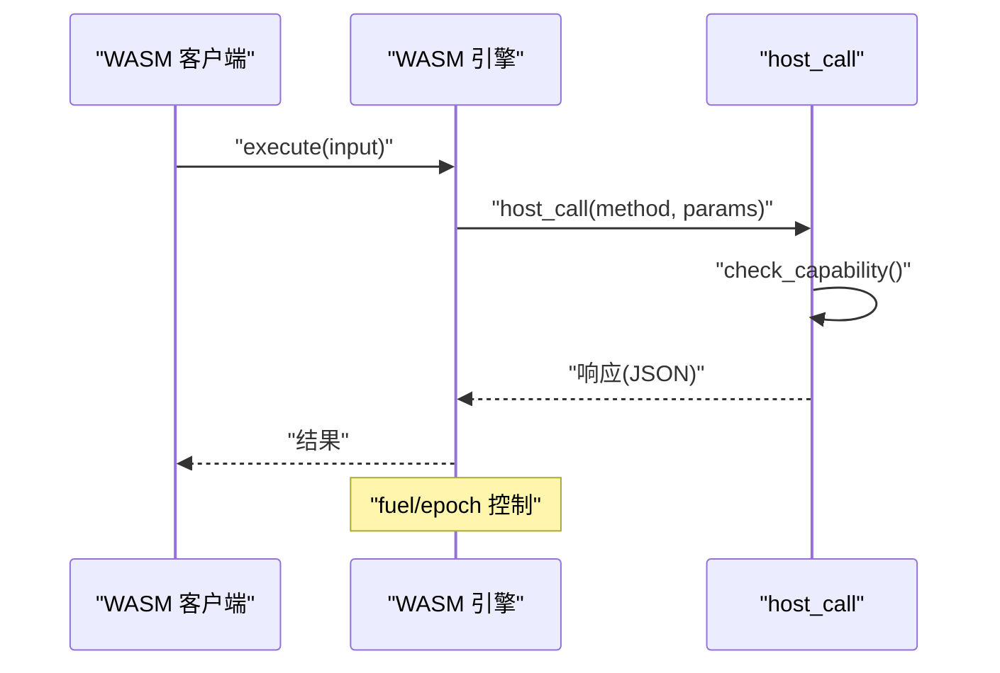

图表来源
- [sandbox.rs:112-275](file://crates/openfang-runtime/src/sandbox.rs#L112-L275)
- [sandbox.rs:277-388](file://crates/openfang-runtime/src/sandbox.rs#L277-L388)

章节来源
- [sandbox.rs:98-388](file://crates/openfang-runtime/src/sandbox.rs#L98-L388)

### 多用户 RBAC 与会话认证
- RBAC：角色分级（Viewer/User/Admin/Owner），动作所需最低角色；支持从通道标识解析用户身份
- 会话认证：HMAC-SHA256 无状态令牌，包含用户名+过期时间；密码存储采用 SHA-256 哈希（常量时间比较）

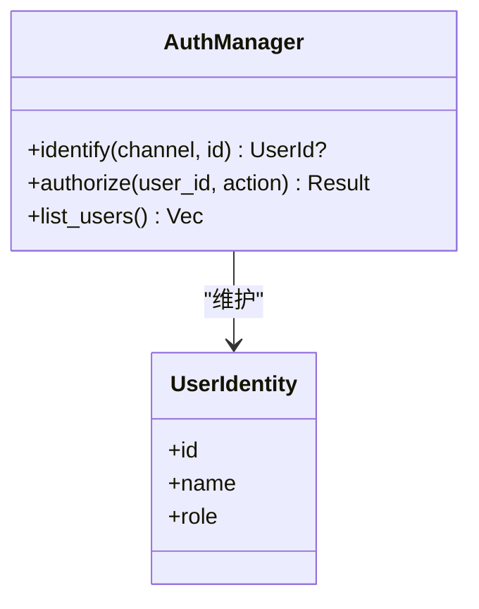

图表来源
- [auth.rs:98-189](file://crates/openfang-kernel/src/auth.rs#L98-L189)

章节来源
- [auth.rs:1-317](file://crates/openfang-kernel/src/auth.rs#L1-L317)
- [session_auth.rs:9-72](file://crates/openfang-api/src/session_auth.rs#L9-L72)

### API 速率限制与安全中间件
- 速率限制：基于 GCRA 的 keyed 限流，按 IP 计数，动态计算成本
- 安全中间件：可选安全头（CSP/X-Frame-Options/HSTS）等

章节来源
- [rate_limiter.rs:37-64](file://crates/openfang-api/src/rate_limiter.rs#L37-L64)
- [security.rs:110-134](file://crates/openfang-cli/src/tui/screens/security.rs#L110-L134)

### 配置加载与安全 include
- 支持 include 合并，根配置覆盖 include；拒绝绝对路径、路径穿越、逃逸配置目录、循环引用；限制最大嵌套深度

章节来源
- [config.rs:116-224](file://crates/openfang-kernel/src/config.rs#L116-L224)

## 依赖关系分析

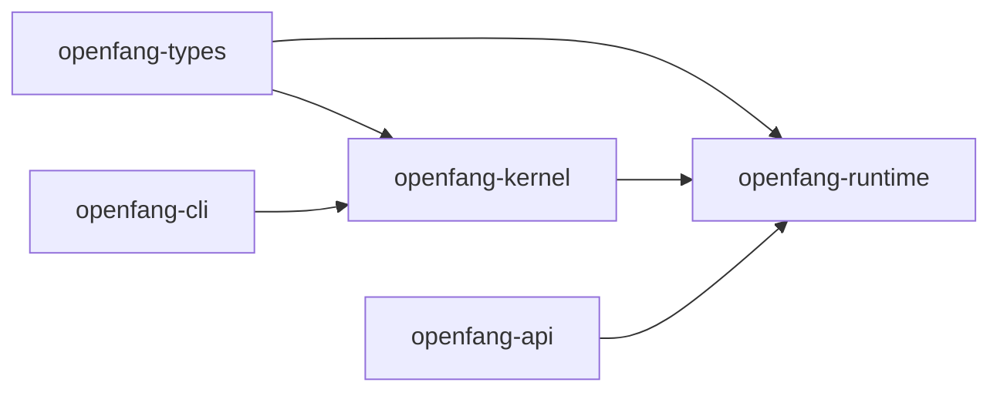

图表来源
- [capability.rs:1-317](file://crates/openfang-types/src/capability.rs#L1-L317)
- [auth.rs:1-317](file://crates/openfang-kernel/src/auth.rs#L1-L317)
- [sandbox.rs:1-608](file://crates/openfang-runtime/src/sandbox.rs#L1-L608)
- [host_functions.rs:1-269](file://crates/openfang-runtime/src/host_functions.rs#L1-L269)
- [session_auth.rs:1-110](file://crates/openfang-api/src/session_auth.rs#L1-L110)
- [security.rs:72-136](file://crates/openfang-cli/src/tui/screens/security.rs#L72-L136)

章节来源
- [capability.rs:1-317](file://crates/openfang-types/src/capability.rs#L1-L317)
- [auth.rs:1-317](file://crates/openfang-kernel/src/auth.rs#L1-L317)
- [sandbox.rs:1-608](file://crates/openfang-runtime/src/sandbox.rs#L1-L608)
- [host_functions.rs:1-269](file://crates/openfang-runtime/src/host_functions.rs#L1-L269)
- [session_auth.rs:1-110](file://crates/openfang-api/src/session_auth.rs#L1-L110)
- [security.rs:72-136](file://crates/openfang-cli/src/tui/screens/security.rs#L72-L136)

## 性能考量
- 沙箱执行：燃料与 epoch 中断保障 CPU 与时钟开销可控；建议合理设置 fuel_limit 与 timeout_secs
- 路径解析：一次性 canonicalize 与组件扫描，避免重复 I/O
- SSRF：DNS 解析与 IP 检查在请求前完成，GET 请求利用缓存减少网络往返
- 工具策略：规则集较小情况下，通配符匹配与组扩展开销低；建议集中管理 allow 列表，减少 deny 规则数量
- 速率限制：GCRA 适合突发流量，建议按端点细化成本计算

## 故障排查指南
- 能力拒绝：检查 Agent 的能力授予与匹配规则；确认继承合并后的有效能力集合
- 路径遍历：确认传入路径不含“..”；写入场景确认父目录存在且文件名不含“..”
- SSRF：检查 URL scheme、主机名是否在黑名单；确认解析到的 IP 非私有/回环/未指定
- 子代理受限：确认当前深度与最大深度；避免在叶子层级使用 spawn/kill
- 会话令牌：确认签名算法一致、时间戳未过期、密钥正确
- 配置 include：检查路径是否相对、未穿越目录、无循环引用

章节来源
- [capabilities.rs:27-48](file://crates/openfang-kernel/src/capabilities.rs#L27-L48)
- [host_functions.rs:73-117](file://crates/openfang-runtime/src/host_functions.rs#L73-L117)
- [web_fetch.rs:202-235](file://crates/openfang-runtime/src/web_fetch.rs#L202-L235)
- [tool_policy.rs:249-275](file://crates/openfang-runtime/src/tool_policy.rs#L249-L275)
- [session_auth.rs:21-56](file://crates/openfang-api/src/session_auth.rs#L21-L56)
- [config.rs:151-182](file://crates/openfang-kernel/src/config.rs#L151-L182)

## 结论
OpenFang 的能力安全模型通过“类型驱动 + 内核强制 + 运行时隔离 + API 边界防护”的组合拳，构建了覆盖文件、网络、工具、Shell、内存、智能体交互与 OFP 的 16 层纵深安全体系。配合 RBAC、污点跟踪、工具策略、速率限制与安全配置，既满足灵活扩展，又确保最小权限与可审计性。

## 附录

### 安全配置指南
- 启用 RBAC 并为用户分配最小角色
- 明确 Agent 能力清单，优先使用通配符收敛而非放任“*”
- 为工具访问建立明确的 deny-wins 策略与组扩展
- 严格限制子代理深度，避免深层 spawn 链
- 开启 SSRF 与路径遍历防护，统一 UA 与缓存策略
- 使用 HMAC-SHA256 会话令牌与 SHA-256 密码哈希
- 启用 GCRA 速率限制并按端点细化成本

### 威胁防护策略
- Prompt 注入与数据外泄：启用污点跟踪并在敏感汇阻断
- SSRF 与元数据服务：双重 SSRF 检测与主机黑名单
- 路径遍历：拒绝“..”组件与符号链接滥用
- 越权与权限提升：能力继承验证与 deny-wins 策略
- 并发与资源滥用：燃料与超时控制、子代理深度限制
- API 攻击面：速率限制、安全头与最小暴露