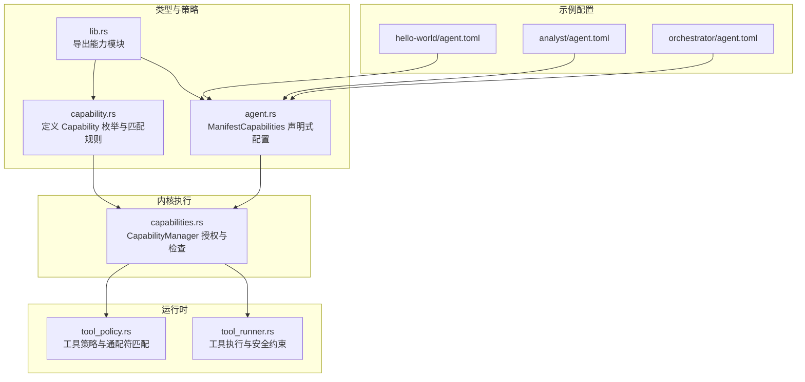
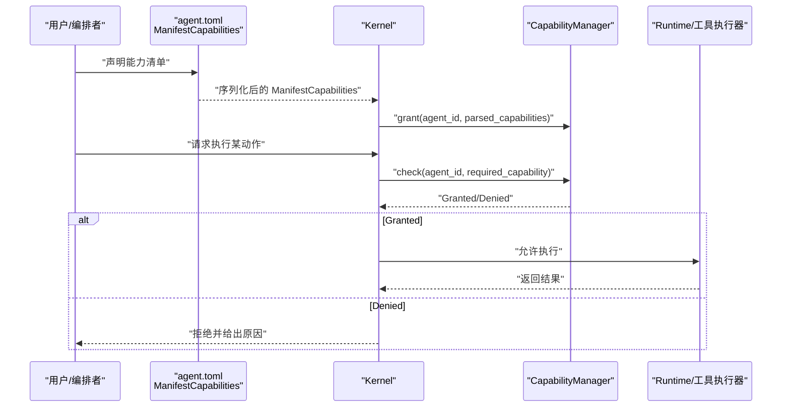
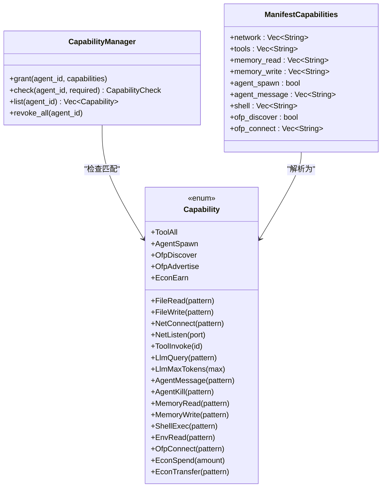

# 能力类型定义

<cite>
**本文引用的文件**
- [crates/openfang-types/src/capability.rs](file://crates/openfang-types/src/capability.rs)
- [crates/openfang-kernel/src/capabilities.rs](file://crates/openfang-kernel/src/capabilities.rs)
- [crates/openfang-types/src/agent.rs](file://crates/openfang-types/src/agent.rs)
- [crates/openfang-types/src/lib.rs](file://crates/openfang-types/src/lib.rs)
- [crates/openfang-runtime/src/tool_policy.rs](file://crates/openfang-runtime/src/tool_policy.rs)
- [crates/openfang-runtime/src/tool_runner.rs](file://crates/openfang-runtime/src/tool_runner.rs)
- [crates/openfang-kernel/tests/integration_test.rs](file://crates/openfang-kernel/tests/integration_test.rs)
- [agents/hello-world/agent.toml](file://agents/hello-world/agent.toml)
- [agents/analyst/agent.toml](file://agents/analyst/agent.toml)
- [agents/orchestrator/agent.toml](file://agents/orchestrator/agent.toml)
</cite>

## 目录
1. [简介](#简介)
2. [项目结构](#项目结构)
3. [核心组件](#核心组件)
4. [架构总览](#架构总览)
5. [详细组件分析](#详细组件分析)
6. [依赖关系分析](#依赖关系分析)
7. [性能考量](#性能考量)
8. [故障排查指南](#故障排查指南)
9. [结论](#结论)
10. [附录](#附录)

## 简介
本文件系统性梳理 OpenFang 的能力类型定义与使用规范，围绕 Capability 枚举的 12 类能力展开：文件读写、网络连接与监听、工具调用、LLM 查询与令牌预算、智能体交互、内存访问、Shell 执行与环境变量读取、OFP 网络、经济操作。内容涵盖作用范围、参数格式、匹配规则、使用场景、配置示例、通配符策略与最佳实践，帮助读者在保证安全的前提下正确授予与使用能力。

## 项目结构
OpenFang 将“能力”抽象为统一的枚举类型，并由内核进行强制执行。关键模块包括：
- openfang-types：定义 Capability 枚举、匹配逻辑、检查结果等核心类型
- openfang-kernel：实现 CapabilityManager，负责能力授予、查询与继承校验
- openfang-runtime：运行时工具策略与执行，结合能力进行安全控制
- agents/*：以 agent.toml 声明式配置能力，供内核解析并授予

**图示来源**
- [crates/openfang-types/src/capability.rs:10-72](file://crates/openfang-types/src/capability.rs#L10-L72)
- [crates/openfang-types/src/agent.rs:532-561](file://crates/openfang-types/src/agent.rs#L532-L561)
- [crates/openfang-kernel/src/capabilities.rs:9-62](file://crates/openfang-kernel/src/capabilities.rs#L9-L62)
- [crates/openfang-runtime/src/tool_policy.rs:191-228](file://crates/openfang-runtime/src/tool_policy.rs#L191-L228)
- [crates/openfang-runtime/src/tool_runner.rs:213-229](file://crates/openfang-runtime/src/tool_runner.rs#L213-L229)
- [agents/hello-world/agent.toml:24-30](file://agents/hello-world/agent.toml#L24-L30)
- [agents/analyst/agent.toml:44-50](file://agents/analyst/agent.toml#L44-L50)
- [agents/orchestrator/agent.toml:58-64](file://agents/orchestrator/agent.toml#L58-L64)

**章节来源**
- [crates/openfang-types/src/capability.rs:1-317](file://crates/openfang-types/src/capability.rs#L1-L317)
- [crates/openfang-kernel/src/capabilities.rs:1-96](file://crates/openfang-kernel/src/capabilities.rs#L1-L96)
- [crates/openfang-types/src/agent.rs:532-561](file://crates/openfang-types/src/agent.rs#L532-L561)
- [crates/openfang-types/src/lib.rs:1-82](file://crates/openfang-types/src/lib.rs#L1-L82)

## 核心组件
- Capability 枚举：定义 12 类能力及其参数形式（字符串模式、数值、布尔）
- 匹配与继承：capability_matches 实现精确/通配/数值边界匹配；validate_capability_inheritance 防止权限提升
- 内核管理器：CapabilityManager 提供授权、查询、列出、撤销能力
- 运行时策略：工具策略与执行器结合能力进行安全控制

**章节来源**
- [crates/openfang-types/src/capability.rs:10-72](file://crates/openfang-types/src/capability.rs#L10-L72)
- [crates/openfang-types/src/capability.rs:100-187](file://crates/openfang-types/src/capability.rs#L100-L187)
- [crates/openfang-kernel/src/capabilities.rs:9-62](file://crates/openfang-kernel/src/capabilities.rs#L9-L62)
- [crates/openfang-runtime/src/tool_policy.rs:191-228](file://crates/openfang-runtime/src/tool_policy.rs#L191-L228)
- [crates/openfang-runtime/src/tool_runner.rs:213-229](file://crates/openfang-runtime/src/tool_runner.rs#L213-L229)

## 架构总览
能力从声明到执行的端到端流程如下：

**图示来源**
- [crates/openfang-types/src/agent.rs:532-561](file://crates/openfang-types/src/agent.rs#L532-L561)
- [crates/openfang-kernel/src/capabilities.rs:22-48](file://crates/openfang-kernel/src/capabilities.rs#L22-L48)
- [crates/openfang-types/src/capability.rs:100-166](file://crates/openfang-types/src/capability.rs#L100-L166)

## 详细组件分析

### 文件能力：FileRead / FileWrite
- 作用范围：对文件系统的读取与写入操作
- 参数格式：字符串模式（支持通配符），用于匹配路径
- 使用场景：读取配置、日志、数据文件；写入结果、缓存
- 匹配规则：精确相等或 glob 模式匹配
- 示例配置片段（来自示例代理）：
  - 读取：["*"] 或 "/data/*"
  - 写入：["self.*"] 或 "/tmp/*"
- 最佳实践：
  - 仅授予必要目录与最小权限
  - 使用前缀/后缀/中间通配符限定路径范围
  - 避免授予根目录或系统关键路径

**章节来源**
- [crates/openfang-types/src/capability.rs:14-17](file://crates/openfang-types/src/capability.rs#L14-L17)
- [crates/openfang-types/src/capability.rs:112-115](file://crates/openfang-types/src/capability.rs#L112-L115)
- [crates/openfang-types/src/capability.rs:189-212](file://crates/openfang-types/src/capability.rs#L189-L212)
- [agents/hello-world/agent.toml:24-30](file://agents/hello-world/agent.toml#L24-L30)
- [agents/analyst/agent.toml:44-50](file://agents/analyst/agent.toml#L44-L50)

### 网络能力：NetConnect / NetListen
- 作用范围：连接外部主机、监听本地端口
- 参数格式：
  - NetConnect：主机:端口 字符串模式（如 "api.example.com:443"）
  - NetListen：u16 端口号（精确匹配）
- 使用场景：访问 API、服务间通信、调试监听
- 匹配规则：NetConnect 支持通配符；NetListen 精确匹配
- 示例配置片段：
  - network = ["*"] 允许任意主机:端口
  - network = ["api.*.com:*"] 限制域名前缀
- 最佳实践：
  - 优先使用通配域名而非全量 IP
  - 仅开放必要端口，避免 0.0.0.0 监听
  - 对外连接尽量限定到可信上游

**章节来源**
- [crates/openfang-types/src/capability.rs:20-23](file://crates/openfang-types/src/capability.rs#L20-L23)
- [crates/openfang-types/src/capability.rs:116-118](file://crates/openfang-types/src/capability.rs#L116-L118)
- [crates/openfang-types/src/capability.rs:153-155](file://crates/openfang-types/src/capability.rs#L153-L155)
- [agents/hello-world/agent.toml:24-30](file://agents/hello-world/agent.toml#L24-L30)
- [agents/analyst/agent.toml:44-50](file://agents/analyst/agent.toml#L44-L50)

### 工具能力：ToolInvoke / ToolAll
- 作用范围：调用具体工具或全部工具
- 参数格式：ToolInvoke 传入工具 ID；ToolAll 表示无限制
- 使用场景：文件读取、网页搜索、浏览器导航、Shell 执行等
- 匹配规则：ToolAll 可匹配任何 ToolInvoke；ID 精确相等或为 "*" 时可匹配任意 ID
- 示例配置片段：
  - tools = ["file_read", "web_search"]
  - tools = ["*"] 开放所有工具（高风险）
- 最佳实践：
  - 优先使用 ToolInvoke 指定工具，避免 ToolAll
  - 对 Shell 执行单独审慎授予
  - 定期审计工具使用情况

**章节来源**
- [crates/openfang-types/src/capability.rs:25-29](file://crates/openfang-types/src/capability.rs#L25-L29)
- [crates/openfang-types/src/capability.rs:119-121](file://crates/openfang-types/src/capability.rs#L119-L121)
- [agents/hello-world/agent.toml:24-30](file://agents/hello-world/agent.toml#L24-L30)
- [agents/analyst/agent.toml:44-50](file://agents/analyst/agent.toml#L44-L50)

### LLM 能力：LlmQuery / LlmMaxTokens
- 作用范围：模型查询与令牌预算控制
- 参数格式：
  - LlmQuery：模型名或模式（支持通配符）
  - LlmMaxTokens：u64 上限（向下取整，要求授予值不小于请求值）
- 使用场景：选择特定供应商/模型、限制成本
- 匹配规则：模型名精确或通配；令牌上限为下界比较
- 示例配置片段：
  - model = "openai/gpt-4" 或 "openai/*"
  - max_tokens = 10000（表示最多使用 10000 令牌）
- 最佳实践：
  - 明确指定模型前缀，避免误用昂贵模型
  - 为不同任务设置合理的令牌上限
  - 结合资源配额与计费监控

**章节来源**
- [crates/openfang-types/src/capability.rs:31-35](file://crates/openfang-types/src/capability.rs#L31-L35)
- [crates/openfang-types/src/capability.rs:122-124](file://crates/openfang-types/src/capability.rs#L122-L124)
- [crates/openfang-types/src/capability.rs:156-161](file://crates/openfang-types/src/capability.rs#L156-L161)
- [agents/hello-world/agent.toml:24-30](file://agents/hello-world/agent.toml#L24-L30)
- [agents/analyst/agent.toml:44-50](file://agents/analyst/agent.toml#L44-L50)

### 智能体能力：AgentSpawn / AgentMessage / AgentKill
- 作用范围：子智能体创建、向目标智能体发送消息、终止智能体
- 参数格式：字符串模式（支持通配符），用于匹配目标智能体 ID
- 使用场景：编排多智能体工作流、动态扩展任务分解
- 匹配规则：精确相等或 glob 模式匹配；AgentSpawn/AgentMessage/OfpAdvertise 为布尔型能力
- 示例配置片段：
  - agent_spawn = true
  - agent_message = ["*"] 或 ["agent-123"]
  - agent_kill = ["agent-*"]
- 最佳实践：
  - 严格限制可终止的智能体范围
  - 通过命名空间前缀隔离不同工作流
  - 与内存写入配合，确保状态可见性可控

**章节来源**
- [crates/openfang-types/src/capability.rs:37-43](file://crates/openfang-types/src/capability.rs#L37-L43)
- [crates/openfang-types/src/capability.rs:125-130](file://crates/openfang-types/src/capability.rs#L125-L130)
- [crates/openfang-types/src/capability.rs:147-149](file://crates/openfang-types/src/capability.rs#L147-L149)
- [agents/orchestrator/agent.toml:58-64](file://agents/orchestrator/agent.toml#L58-L64)

### 内存能力：MemoryRead / MemoryWrite
- 作用范围：读取与写入内存作用域
- 参数格式：字符串模式（支持通配符），用于匹配作用域名称
- 使用场景：跨智能体共享数据、会话状态持久化
- 匹配规则：精确相等或 glob 模式匹配
- 示例配置片段：
  - memory_read = ["*"] 或 ["shared.*"]
  - memory_write = ["self.*"] 或 ["shared.data"]
- 最佳实践：
  - 使用命名空间隔离作用域
  - 仅授予必要的只读/读写范围
  - 避免授予全局写入权限

**章节来源**
- [crates/openfang-types/src/capability.rs:45-49](file://crates/openfang-types/src/capability.rs#L45-L49)
- [crates/openfang-types/src/capability.rs:131-136](file://crates/openfang-types/src/capability.rs#L131-L136)
- [agents/hello-world/agent.toml:24-30](file://agents/hello-world/agent.toml#L24-L30)
- [agents/analyst/agent.toml:44-50](file://agents/analyst/agent.toml#L44-L50)

### Shell 与环境变量：ShellExec / EnvRead
- 作用范围：执行 Shell 命令、读取环境变量
- 参数格式：字符串模式（支持通配符），用于匹配命令或变量名
- 使用场景：系统运维、构建脚本、环境探测
- 匹配规则：精确相等或 glob 模式匹配；Shell 执行额外存在元字符安全检查
- 示例配置片段：
  - shell = ["python *", "cargo *"]
  - env_read = ["PATH", "HOME"]
- 最佳实践：
  - 优先使用白名单命令前缀
  - 禁止含元字符的命令拼接
  - 仅授予必要环境变量读取

**章节来源**
- [crates/openfang-types/src/capability.rs:51-55](file://crates/openfang-types/src/capability.rs#L51-L55)
- [crates/openfang-types/src/capability.rs:137-139](file://crates/openfang-types/src/capability.rs#L137-L139)
- [crates/openfang-runtime/src/tool_runner.rs:213-229](file://crates/openfang-runtime/src/tool_runner.rs#L213-L229)
- [agents/analyst/agent.toml:44-50](file://agents/analyst/agent.toml#L44-L50)

### OFP 网络：OfpDiscover / OfpConnect / OfpAdvertise
- 作用范围：发现远端智能体、连接远端节点、在网络中发布服务
- 参数格式：字符串模式（支持通配符），用于匹配远端标识
- 使用场景：分布式智能体网络、服务发现与调用
- 匹配规则：精确相等或 glob 模式匹配；OfpDiscover/OfpAdvertise 为布尔型能力
- 示例配置片段：
  - ofp_discover = true
  - ofp_connect = ["*"] 或 ["service-*"]
- 最佳实践：
  - 限制可连接的服务前缀
  - 仅在受信网络启用服务发布
  - 与 AgentMessage/AgentKill 协同，控制交互范围

**章节来源**
- [crates/openfang-types/src/capability.rs:57-63](file://crates/openfang-types/src/capability.rs#L57-L63)
- [crates/openfang-types/src/capability.rs:139-141](file://crates/openfang-types/src/capability.rs#L139-L141)
- [crates/openfang-types/src/capability.rs:147-149](file://crates/openfang-types/src/capability.rs#L147-L149)
- [agents/orchestrator/agent.toml:58-64](file://agents/orchestrator/agent.toml#L58-L64)

### 经济能力：EconSpend / EconEarn / EconTransfer
- 作用范围：花费额度、接收收入、向目标转账
- 参数格式：
  - EconSpend：f64 最大花费（美元）
  - EconEarn：布尔型能力
  - EconTransfer：字符串模式（支持通配符），用于匹配收款方
- 使用场景：购买 API 调用、服务付费、跨账户转账
- 匹配规则：EconSpend/EconTransfer 为模式匹配；EconSpend 为下界比较
- 示例配置片段：
  - econ_spend = 100.0（最大 100 美元）
  - econ_transfer = ["user-*"]
- 最佳实践：
  - 为每个代理设置独立的支出上限
  - 严格限制转账范围，避免滥用
  - 结合审计日志与账单监控

**章节来源**
- [crates/openfang-types/src/capability.rs:65-72](file://crates/openfang-types/src/capability.rs#L65-L72)
- [crates/openfang-types/src/capability.rs:159-161](file://crates/openfang-types/src/capability.rs#L159-L161)
- [crates/openfang-types/src/capability.rs:142-144](file://crates/openfang-types/src/capability.rs#L142-L144)

## 依赖关系分析
- 类型层：capability.rs 定义 Capability 枚举与匹配；agent.rs 定义 ManifestCapabilities 声明式配置
- 内核层：capabilities.rs 通过 CapabilityManager 统一管理授权与检查
- 运行时层：tool_policy.rs 提供通配符匹配算法；tool_runner.rs 在执行前进行安全检查
- 配置层：agents/*.toml 以人类可读的方式声明能力，内核解析后转换为 Capability 并授予

**图示来源**
- [crates/openfang-types/src/capability.rs:10-72](file://crates/openfang-types/src/capability.rs#L10-L72)
- [crates/openfang-kernel/src/capabilities.rs:9-62](file://crates/openfang-kernel/src/capabilities.rs#L9-L62)
- [crates/openfang-types/src/agent.rs:532-561](file://crates/openfang-types/src/agent.rs#L532-L561)

**章节来源**
- [crates/openfang-types/src/capability.rs:10-72](file://crates/openfang-types/src/capability.rs#L10-L72)
- [crates/openfang-kernel/src/capabilities.rs:9-62](file://crates/openfang-kernel/src/capabilities.rs#L9-L62)
- [crates/openfang-types/src/agent.rs:532-561](file://crates/openfang-types/src/agent.rs#L532-L561)

## 性能考量
- 匹配复杂度：字符串通配符匹配为线性扫描，建议优先使用前缀/后缀模式，减少中间通配符的使用
- 数值比较：令牌预算与支出上限为 O(1) 比较，开销极低
- 布尔能力：AgentSpawn/OfpDiscover/OfpAdvertise 无需模式匹配，检查最高效
- 缓存与并发：内核使用并发映射存储授权，查询为常数时间级

[本节为通用指导，不直接分析具体文件]

## 故障排查指南
- 无法执行某动作
  - 检查是否授予了对应 Capability
  - 若使用通配符，确认模式是否覆盖目标值
  - 对于数值能力，确认上限是否满足请求
- 权限提升被拒
  - 子代理能力必须是父代理能力的子集
  - 避免在受限父代理下创建不受限子代理
- Shell 执行失败
  - 检查命令是否包含不允许的元字符
  - 确认已授予相应 ShellExec 模式

**章节来源**
- [crates/openfang-types/src/capability.rs:100-187](file://crates/openfang-types/src/capability.rs#L100-L187)
- [crates/openfang-kernel/src/capabilities.rs:27-48](file://crates/openfang-kernel/src/capabilities.rs#L27-L48)
- [crates/openfang-runtime/src/tool_runner.rs:213-229](file://crates/openfang-runtime/src/tool_runner.rs#L213-L229)

## 结论
OpenFang 的能力体系以 Capability 枚举为核心，结合声明式配置与内核强制执行，实现了细粒度、可审计、可演进的安全模型。通过合理使用通配符与数值边界，既能满足灵活的业务需求，又能有效降低安全风险。建议在生产环境中遵循最小权限原则，定期审计能力授予与使用记录。

[本节为总结性内容，不直接分析具体文件]

## 附录

### 能力配置示例与最佳实践
- 基础示例（Hello World）
  - 读取/写入文件、网络访问、内存读写、不可创建子代理
  - 参考路径：[agents/hello-world/agent.toml:24-30](file://agents/hello-world/agent.toml#L24-L30)
- 数据分析师
  - 文件读写、Shell 执行、网络访问、内存读写
  - 参考路径：[agents/analyst/agent.toml:44-50](file://agents/analyst/agent.toml#L44-L50)
- 编排器
  - 创建/消息/终止子代理、内存读写、网络访问
  - 参考路径：[agents/orchestrator/agent.toml:58-64](file://agents/orchestrator/agent.toml#L58-L64)
- 集成测试示例
  - 通过内联 TOML 声明能力并启动代理
  - 参考路径：[crates/openfang-kernel/tests/integration_test.rs:39-58](file://crates/openfang-kernel/tests/integration_test.rs#L39-L58)

### 通配符与匹配规则速查
- 通配符支持：前缀、后缀、中间通配符
- 数值能力：下界比较（>=）
- 布尔能力：完全匹配
- 特殊规则：ToolAll 可匹配任意 ToolInvoke；AgentMessage/AgentKill/OfpConnect/EconTransfer 支持模式匹配

**章节来源**
- [crates/openfang-types/src/capability.rs:100-166](file://crates/openfang-types/src/capability.rs#L100-L166)
- [crates/openfang-types/src/capability.rs:189-212](file://crates/openfang-types/src/capability.rs#L189-L212)
- [crates/openfang-runtime/src/tool_policy.rs:191-228](file://crates/openfang-runtime/src/tool_policy.rs#L191-L228)