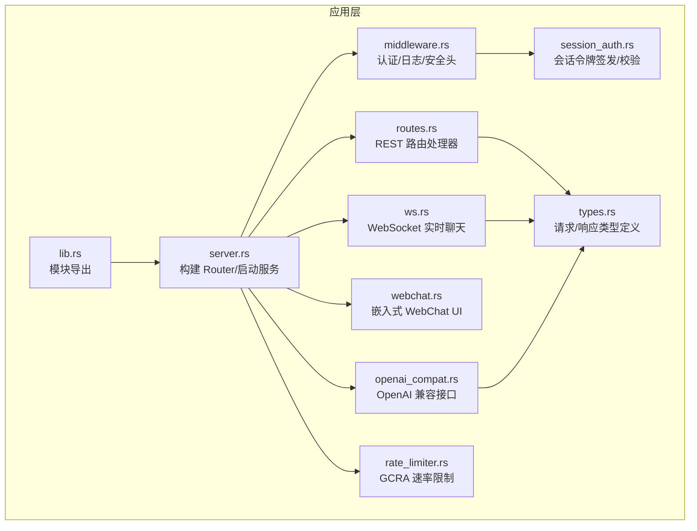
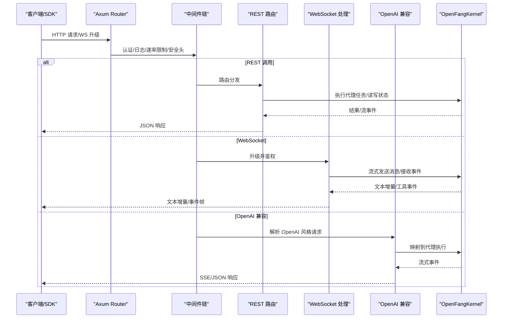
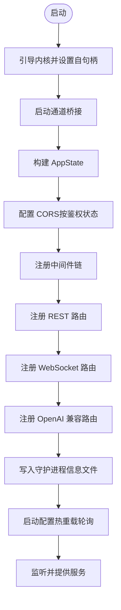
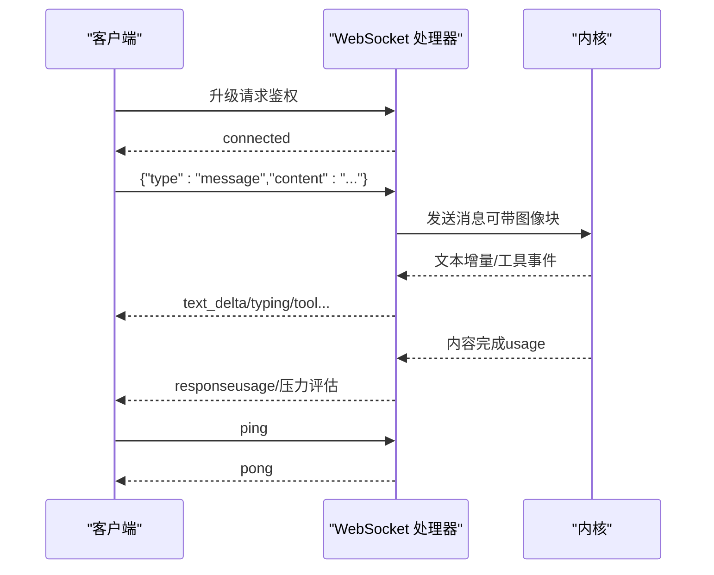
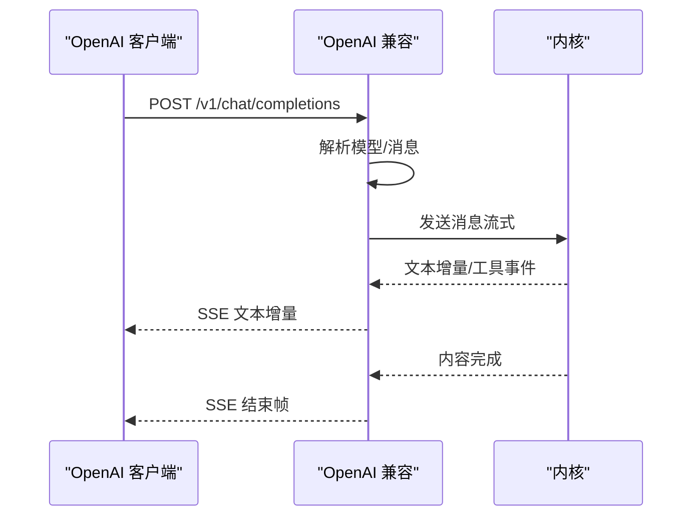
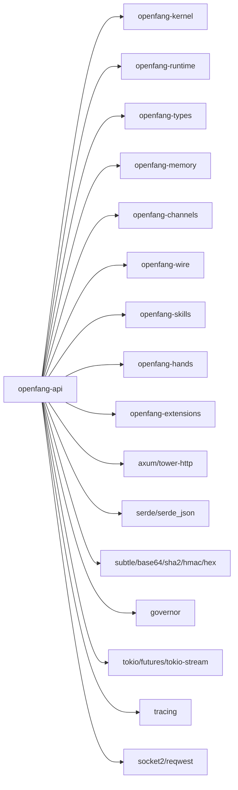

# API 服务器 (openfang-api)

<cite>
**本文引用的文件**
- [lib.rs](file://crates/openfang-api/src/lib.rs)
- [server.rs](file://crates/openfang-api/src/server.rs)
- [routes.rs](file://crates/openfang-api/src/routes.rs)
- [ws.rs](file://crates/openfang-api/src/ws.rs)
- [openai_compat.rs](file://crates/openfang-api/src/openai_compat.rs)
- [types.rs](file://crates/openfang-api/src/types.rs)
- [webchat.rs](file://crates/openfang-api/src/webchat.rs)
- [middleware.rs](file://crates/openfang-api/src/middleware.rs)
- [session_auth.rs](file://crates/openfang-api/src/session_auth.rs)
- [rate_limiter.rs](file://crates/openfang-api/src/rate_limiter.rs)
- [Cargo.toml](file://crates/openfang-api/Cargo.toml)
- [api_integration_test.rs](file://crates/openfang-api/tests/api_integration_test.rs)
- [basic.js](file://sdk/javascript/examples/basic.js)
- [client_basic.py](file://sdk/python/examples/client_basic.py)
</cite>

## 目录
1. [简介](#简介)
2. [项目结构](#项目结构)
3. [核心组件](#核心组件)
4. [架构总览](#架构总览)
5. [详细组件分析](#详细组件分析)
6. [依赖关系分析](#依赖关系分析)
7. [性能考量](#性能考量)
8. [故障排查指南](#故障排查指南)
9. [结论](#结论)
10. [附录](#附录)

## 简介
本文件为 OpenFang API 服务器的开发文档，面向后端工程师与集成开发者，系统性阐述以下内容：
- RESTful API 设计原则与端点规范
- WebSocket 实时通信机制与消息协议
- OpenAI 兼容接口的实现细节与兼容性
- Server 启动流程、路由配置与中间件链路
- 认证与会话机制、速率限制策略
- 与运行时内核（Kernel）与运行时引擎（Runtime）的集成方式
- 客户端 SDK 使用指南与最佳实践
- 错误处理策略、性能优化技巧与安全配置要求

## 项目结构
openfang-api 是一个基于 Rust + Axum 的 HTTP/WebSocket API 服务器，负责对外暴露代理管理、状态查询、聊天交互、工作流编排、通道桥接等能力，并通过 OpenAI 兼容接口无缝对接现有生态工具。

图示来源
- [lib.rs:1-18](file://crates/openfang-api/src/lib.rs#L1-L18)
- [server.rs:37-712](file://crates/openfang-api/src/server.rs#L37-L712)
- [routes.rs:21-43](file://crates/openfang-api/src/routes.rs#L21-L43)
- [ws.rs:1-140](file://crates/openfang-api/src/ws.rs#L1-L140)
- [openai_compat.rs:1-80](file://crates/openfang-api/src/openai_compat.rs#L1-L80)
- [webchat.rs:1-92](file://crates/openfang-api/src/webchat.rs#L1-L92)
- [middleware.rs:1-60](file://crates/openfang-api/src/middleware.rs#L1-L60)
- [session_auth.rs:1-20](file://crates/openfang-api/src/session_auth.rs#L1-L20)
- [rate_limiter.rs:1-44](file://crates/openfang-api/src/rate_limiter.rs#L1-L44)
- [types.rs:1-94](file://crates/openfang-api/src/types.rs#L1-L94)

章节来源
- [lib.rs:1-18](file://crates/openfang-api/src/lib.rs#L1-L18)
- [Cargo.toml:1-44](file://crates/openfang-api/Cargo.toml#L1-L44)

## 核心组件
- 应用状态 AppState：封装内核句柄、桥接管理器、频道配置、通知句柄、缓存等，供所有路由共享。
- 路由模块 routes：实现代理生命周期、会话、工作流、技能、渠道、审计、预算、网络、A2A 协议等 REST 接口。
- WebSocket 模块 ws：提供实时聊天通道，支持打字指示、文本增量、工具调用事件、静默完成等协议。
- OpenAI 兼容模块 openai_compat：将 OpenAI 风格请求映射到代理执行，支持非流式与 SSE 流式响应。
- 中间件 middleware：统一注入请求 ID、结构化日志、认证、安全头、CORS；提供会话 Cookie 校验。
- 速率限制 rate_limiter：基于 GCRA 的按 IP 分配令牌桶，区分操作成本，防止滥用。
- 会话认证 session_auth：HMAC-SHA256 签名的无状态会话令牌，用于仪表盘登录态。
- 类型定义 types：统一请求/响应数据结构，确保前后端契约一致。

章节来源
- [routes.rs:21-43](file://crates/openfang-api/src/routes.rs#L21-L43)
- [ws.rs:1-140](file://crates/openfang-api/src/ws.rs#L1-L140)
- [openai_compat.rs:1-80](file://crates/openfang-api/src/openai_compat.rs#L1-L80)
- [middleware.rs:1-60](file://crates/openfang-api/src/middleware.rs#L1-L60)
- [rate_limiter.rs:1-44](file://crates/openfang-api/src/rate_limiter.rs#L1-L44)
- [session_auth.rs:1-20](file://crates/openfang-api/src/session_auth.rs#L1-L20)
- [types.rs:1-94](file://crates/openfang-api/src/types.rs#L1-L94)

## 架构总览
下图展示从客户端到内核的完整调用链，包括 HTTP REST、WebSocket、OpenAI 兼容接口与内核交互。

图示来源
- [server.rs:121-710](file://crates/openfang-api/src/server.rs#L121-L710)
- [routes.rs:45-168](file://crates/openfang-api/src/routes.rs#L45-L168)
- [ws.rs:140-384](file://crates/openfang-api/src/ws.rs#L140-L384)
- [openai_compat.rs:245-367](file://crates/openfang-api/src/openai_compat.rs#L245-L367)
- [middleware.rs:62-215](file://crates/openfang-api/src/middleware.rs#L62-L215)

## 详细组件分析

### Server 启动与 Router 构建
- 构建阶段
  - 启动通道桥接（Telegram 等），初始化 AppState 并持有内核句柄与桥接管理器。
  - 基于内核配置动态设置 CORS：未启用鉴权时仅允许本地回环与常见开发端口；启用鉴权时限定可信来源。
  - 注册认证中间件（Bearer/X-API-Key）、速率限制中间件（GCRA）、安全头中间件、请求日志中间件、压缩与追踪层。
  - 注册全部 REST 路由（代理、会话、工作流、技能、渠道、审计、预算、网络、A2A、集成、配对、MCP 等）。
  - 注册 OpenAI 兼容端点 /v1/chat/completions 与 /v1/models。
  - 注册 WebSocket 端点 /api/agents/{id}/ws。
  - 注册嵌入式 WebChat UI 资源与主页。
- 运行阶段
  - 写入守护进程信息文件（含 PID、监听地址、启动时间、版本、平台），并限制文件权限。
  - 启动配置热重载轮询（每 30 秒检查配置文件修改并触发内核重载）。
  - 提供优雅关闭信号（通过 AppState.shutdown_notify 触发 HTTP 服务器关闭）。

图示来源
- [server.rs:37-712](file://crates/openfang-api/src/server.rs#L37-L712)

章节来源
- [server.rs:37-712](file://crates/openfang-api/src/server.rs#L37-L712)

### 路由与 REST API 设计
- 设计原则
  - 统一使用 JSON 请求/响应，路径采用层级命名（/api/.../{id}/...）。
  - 动作语义清晰：GET 列表/详情，POST 创建/触发，PUT 更新，DELETE 删除。
  - 对外公开端点遵循最小暴露原则：健康、状态、版本、列表类 GET 默认公开；写操作一律需要认证。
  - 对于可能产生大负载的端点（如上传、会话历史、审计日志）进行大小限制与缓存优化。
- 关键端点示例
  - 代理管理
    - GET /api/agents — 列出代理（带模型与认证状态）
    - POST /api/agents — 通过模板或清单创建代理
    - GET /api/agents/{id} — 获取代理详情
    - DELETE /api/agents/{id} — 杀死代理
    - PATCH /api/agents/{id} — 更新代理（模式/身份/配置等）
    - PUT /api/agents/{id}/mode — 设置运行模式
    - POST /api/agents/{id}/restart — 重启代理
    - POST /api/agents/{id}/start — 启动代理
    - POST /api/agents/{id}/stop — 停止代理
    - PUT /api/agents/{id}/model — 切换模型
    - GET/PUT /api/agents/{id}/tools — 查询/设置工具集
    - GET/PUT /api/agents/{id}/skills — 查询/设置技能集
    - GET/PUT /api/agents/{id}/mcp_servers — 查询/设置 MCP 服务器
    - PATCH /api/agents/{id}/identity — 更新身份信息
    - PATCH /api/agents/{id}/config — 更新配置
    - POST /api/agents/{id}/clone — 克隆代理
    - GET /api/agents/{id}/files — 列举文件
    - GET/PUT /api/agents/{id}/files/{filename} — 读取/更新文件
    - GET /api/agents/{id}/deliveries — 获取交付记录
    - POST /api/agents/{id}/upload — 上传文件
  - 会话与消息
    - POST /api/agents/{id}/message — 发送消息（非流式）
    - POST /api/agents/{id}/message/stream — 发送消息（流式）
    - GET /api/agents/{id}/session — 获取会话历史
    - GET /api/agents/{id}/sessions — 列举会话
    - POST /api/agents/{id}/sessions — 创建会话
    - GET /api/agents/{id}/sessions/{session_id}/switch — 切换会话
    - POST /api/agents/{id}/sessions/{session_id}/switch — 切换会话
    - POST /api/agents/{id}/session/reset — 重置会话
    - DELETE /api/agents/{id}/history — 清空历史
    - POST /api/agents/{id}/session/compact — 压缩会话
  - 工作流与触发器
    - GET/POST /api/workflows — 列表/创建
    - GET/PUT/DELETE /api/workflows/{id} — 读取/更新/删除
    - POST /api/workflows/{id}/run — 运行工作流
    - GET /api/workflows/{id}/runs — 查看运行记录
    - GET/POST /api/triggers — 列表/创建
    - DELETE/PUT /api/triggers/{id} — 删除/更新
  - 技能与市场
    - GET /api/skills — 列表
    - POST /api/skills/install — 安装
    - POST /api/skills/uninstall — 卸载
    - GET /api/marketplace/search — 市场搜索
  - ClowHub 生态
    - GET /api/clawhub/search — 搜索
    - GET /api/clawhub/browse — 浏览
    - GET /api/clawhub/skill/{slug} — 技能详情
    - GET /api/clawhub/skill/{slug}/code — 技能代码
    - POST /api/clawhub/install — 安装
  - 手（Hands）
    - GET /api/hands — 列表
    - POST /api/hands/install — 安装
    - POST /api/hands/upsert — 新增/更新
    - GET /api/hands/active — 活跃实例
    - GET /api/hands/{hand_id} — 详情
    - POST /api/hands/{hand_id}/activate — 激活
    - POST /api/hands/{hand_id}/check-deps — 检查依赖
    - POST /api/hands/{hand_id}/install-deps — 安装依赖
    - GET/PUT /api/hands/{hand_id}/settings — 读取/更新设置
    - POST /api/hands/instances/{id}/pause — 暂停
    - POST /api/hands/instances/{id}/resume — 恢复
    - DELETE /api/hands/instances/{id} — 停用
    - GET /api/hands/instances/{id}/stats — 统计
    - GET /api/hands/instances/{id}/browser — 浏览器视图
  - MCP 与外部协议
    - GET /api/mcp/servers — 列表
    - POST /mcp — 暴露 MCP 协议的 HTTP 端点
    - GET /.well-known/agent.json — A2A 卡片
    - GET /a2a/agents — 列表
    - POST /a2a/tasks/send — 发送任务
    - GET /a2a/tasks/{id} — 查询任务
    - POST /a2a/tasks/{id}/cancel — 取消任务
    - GET /api/a2a/agents — 外部代理列表
    - POST /api/a2a/discover — 发现外部代理
    - POST /api/a2a/send — 发送外部任务
    - GET /api/a2a/tasks/{id}/status — 外部任务状态
  - 集成与配对
    - GET /api/integrations — 列表
    - GET /api/integrations/available — 可用集成
    - POST /api/integrations/add — 添加
    - DELETE /api/integrations/{id} — 删除
    - POST /api/integrations/{id}/reconnect — 重连
    - GET /api/integrations/health — 健康检查
    - POST /api/integrations/reload — 重载
    - POST /api/pairing/request — 请求配对
    - POST /api/pairing/complete — 完成配对
    - GET /api/pairing/devices — 设备列表
    - DELETE /api/pairing/devices/{id} — 移除设备
    - POST /api/pairing/notify — 通知设备
  - 审计与日志
    - GET /api/audit/recent — 最近审计
    - GET /api/audit/verify — 审计验证
    - GET /api/logs/stream — 实时日志流（SSE）
  - 网络与拓扑
    - GET /api/peers — 节点列表
    - GET /api/network/status — 网络状态
  - 通信（Comms）
    - GET /api/comms/topology — 拓扑
    - GET /api/comms/events — 事件
    - GET /api/comms/events/stream — 事件流
    - POST /api/comms/send — 发送消息
    - POST /api/comms/task — 发送任务
  - 配置与模型
    - GET /api/config — 当前配置
    - GET /api/config/schema — 配置模式
    - POST /api/config/set — 设置配置项
    - GET /api/config/reload — 重新加载配置
    - GET /api/models — 模型列表
    - GET /api/models/aliases — 模型别名
    - POST /api/models/custom — 添加自定义模型
    - DELETE /api/models/custom/{*id} — 删除自定义模型
    - GET /api/models/{*id} — 获取模型
    - GET /api/providers — 提供商列表
    - POST /api/providers/{name}/key — 设置提供商密钥
    - DELETE /api/providers/{name}/key — 删除密钥
    - POST /api/providers/{name}/test — 测试提供商
    - PUT /api/providers/{name}/url — 设置提供商 URL
    - POST /api/providers/github-copilot/oauth/start — 开始 OAuth
    - GET /api/providers/github-copilot/oauth/poll/{poll_id} — 轮询 OAuth
  - 安全与审批
    - GET /api/approvals — 列表
    - POST /api/approvals — 创建
    - POST /api/approvals/{id}/approve — 审批
    - POST /api/approvals/{id}/reject — 拒绝
  - 用量与预算
    - GET /api/usage — 总用量
    - GET /api/usage/summary — 汇总
    - GET /api/usage/by-model — 按模型
    - GET /api/usage/daily — 日用量
    - GET /api/budget — 预算状态
    - PUT /api/budget — 更新预算
    - GET /api/budget/agents — 代理预算排行
    - GET /api/budget/agents/{id} — 代理预算状态
    - PUT /api/budget/agents/{id} — 更新代理预算
  - 会话与标签
    - GET /api/sessions — 列表
    - DELETE /api/sessions/{id} — 删除
    - PUT /api/sessions/{id}/label — 设置标签
    - GET /api/agents/{id}/sessions/by-label/{label} — 按标签查找会话
  - 代理更新与绑定
    - PUT /api/agents/{id}/update — 更新代理
    - GET /api/bindings — 列表
    - POST /api/bindings — 添加
    - DELETE /api/bindings/{index} — 删除
  - 仪表盘认证
    - POST /api/auth/login — 登录
    - POST /api/auth/logout — 登出
    - GET /api/auth/check — 检查登录态
  - 公共与诊断
    - GET /api/health — 健康检查（最小信息）
    - GET /api/health/detail — 详细健康
    - GET /api/status — 运行状态
    - GET /api/version — 版本
    - GET /api/metrics — Prometheus 指标
    - POST /api/shutdown — 优雅关闭
  - 上传与静态资源
    - GET /api/uploads/{file_id} — 下载上传文件
    - GET / — WebChat 主页
    - GET /logo.png /favicon.ico /manifest.json /sw.js — 静态资源

章节来源
- [server.rs:121-682](file://crates/openfang-api/src/server.rs#L121-L682)
- [routes.rs:45-765](file://crates/openfang-api/src/routes.rs#L45-L765)

### WebSocket 实时通信机制
- 升级与鉴权
  - 支持通过 Authorization: Bearer 或 ?token= 参数进行鉴权（浏览器无法设置自定义头时使用查询参数）。
  - 按来源 IP 限制并发连接数（默认每 IP 最多 5 个）。
- 消息协议
  - 客户端 → 服务器：{"type":"message","content":"..."} 或 {"type":"command","command":"...","args":"..."}
  - 服务器 → 客户端：{"type":"connected","agent_id":"..."}、{"type":"typing","state":"start|tool|stop"}、{"type":"text_delta","content":"..."}、{"type":"response","content":"...","input_tokens":N,"output_tokens":N,"iterations":N}、{"type":"error","content":"..."}、{"type":"agents_updated","agents":[...]}、{"type":"silent_complete"}、{"type":"canvas","canvas_id":"...","html":"...","title":"..."}、{"type":"pong"}
- 事件处理
  - 文本增量采用去抖策略（字符阈值与时间阈值），避免过度频繁推送。
  - 工具调用事件映射为更友好的前端事件，支持“开始/输入增量/结束”三段式。
  - 支持图像附件解析（来自上传目录或直接 Base64），并根据模型能力提示是否支持视觉。
  - 会周期性广播代理列表变更（变更检测哈希），减少冗余推送。
- 超时与限流
  - 空闲超时：30 分钟无消息自动断开。
  - 每分钟最多 10 条消息，超过返回错误。

图示来源
- [ws.rs:140-384](file://crates/openfang-api/src/ws.rs#L140-L384)
- [routes.rs:328-428](file://crates/openfang-api/src/routes.rs#L328-L428)

章节来源
- [ws.rs:1-384](file://crates/openfang-api/src/ws.rs#L1-L384)
- [routes.rs:328-428](file://crates/openfang-api/src/routes.rs#L328-L428)

### OpenAI 兼容接口实现
- 模型解析
  - 支持三种模型标识：openfang:<name>、UUID、名称；均解析为代理实例。
- 消息转换
  - 将 OpenAI 的 role/content 映射为内部 Message/ContentBlock；支持文本与 data URI 图像。
- 非流式响应
  - 直接返回 ChatCompletionResponse，包含角色、内容与 token usage。
- 流式响应（SSE）
  - 首帧发送 role=assistant；后续发送 text_delta；工具调用以 tool_calls 形式增量传输；结束发送 finish_reason=stop 与 [DONE]。
- 错误处理
  - 未知模型返回 404；缺失用户消息返回 400；内核错误返回 500。

图示来源
- [openai_compat.rs:245-367](file://crates/openfang-api/src/openai_compat.rs#L245-L367)
- [openai_compat.rs:369-532](file://crates/openfang-api/src/openai_compat.rs#L369-L532)

章节来源
- [openai_compat.rs:1-560](file://crates/openfang-api/src/openai_compat.rs#L1-L560)

### 认证与会话机制
- API Key 认证
  - 支持 Authorization: Bearer 与 X-API-Key；支持 ?token= 查询参数（WebSocket/SSE 场景）。
  - 使用常量时间比较防止时序攻击；未配置或为空白时跳过认证。
- 仪表盘会话认证
  - 使用 HMAC-SHA256 签名的无状态会话令牌（包含用户名、过期时间），支持 Cookie 校验。
- 安全头与 CSP
  - 设置 x-content-type-options、x-frame-options、x-xss-protection、Strict-Transport-Security、Content-Security-Policy、Referrer-Policy、Cache-Control 等。
- CORS
  - 未启用鉴权时仅允许本地回环与常见开发端口；启用鉴权时限定可信来源。

章节来源
- [middleware.rs:62-259](file://crates/openfang-api/src/middleware.rs#L62-L259)
- [session_auth.rs:1-110](file://crates/openfang-api/src/session_auth.rs#L1-L110)

### 速率限制策略（GCRA）
- 成本模型
  - 不同端点分配不同 token 成本（如 health=1、spawn=50、message=30、run=100 等），GET 列表类通常较低。
- 限额
  - 每 IP 每分钟 500 令牌；超出返回 429 并携带 retry-after。
- 实施
  - 在中间件中提取客户端 IP，计算成本并检查；通过 governor::DashMapStateStore 实现全局状态存储。

章节来源
- [rate_limiter.rs:1-98](file://crates/openfang-api/src/rate_limiter.rs#L1-L98)

### 与运行时引擎的集成
- 内核句柄
  - 所有路由与 WebSocket 处理器通过 AppState 持有的 Arc<OpenFangKernel> 调用内核能力（注册表、内存、工具、会话、审计、配对、网络等）。
- 流式执行
  - OpenAI 兼容与 WebSocket 均通过内核的流式接口获取事件（文本增量、工具调用、内容完成等），并在前端以增量形式呈现。
- 配置热重载
  - 服务器启动后轮询配置文件变更，触发内核重载计划，避免重启服务即可生效。

章节来源
- [routes.rs:21-43](file://crates/openfang-api/src/routes.rs#L21-L43)
- [ws.rs:500-781](file://crates/openfang-api/src/ws.rs#L500-L781)
- [openai_compat.rs:378-532](file://crates/openfang-api/src/openai_compat.rs#L378-L532)
- [server.rs:728-757](file://crates/openfang-api/src/server.rs#L728-L757)

### 客户端 SDK 使用指南与最佳实践
- JavaScript SDK
  - 示例：basic.js 展示了健康检查、列出代理、创建代理、发送消息与清理的完整流程。
  - 建议：在生产环境设置 Authorization 头或 X-API-Key；对长文本消息进行分片与去重；对流式响应进行缓冲与去抖。
- Python SDK
  - 示例：client_basic.py 展示了相同流程的 Python 实现。
  - 建议：使用会话持久化与重试策略；对 OpenAI 兼容接口传入合适的 temperature 与 max_tokens；对图像输入使用 data URI。
- 通用最佳实践
  - 使用 HTTPS 与严格 CSP；启用速率限制与日志审计；对敏感端点使用 API Key；对 WebSocket 设置心跳与重连策略。

章节来源
- [basic.js:1-35](file://sdk/javascript/examples/basic.js#L1-L35)
- [client_basic.py:1-36](file://sdk/python/examples/client_basic.py#L1-L36)

## 依赖关系分析
- 内部依赖
  - openfang-api 依赖 openfang-kernel、openfang-runtime、openfang-types、openfang-memory、openfang-channels、openfang-wire、openfang-skills、openfang-hands、openfang-extensions 等。
- 外部依赖
  - web 框架：axum、tower-http（CORS、追踪、压缩）
  - 并发与流：tokio、futures、tokio-stream
  - 序列化：serde、serde_json
  - 安全与加密：subtle、base64、sha2、hmac、hex
  - 速率限制：governor
  - 日志与指标：tracing
  - 网络：socket2、reqwest

图示来源
- [Cargo.toml:8-38](file://crates/openfang-api/Cargo.toml#L8-L38)

章节来源
- [Cargo.toml:1-44](file://crates/openfang-api/Cargo.toml#L1-L44)

## 性能考量
- 流式传输
  - WebSocket 与 OpenAI 兼容均采用增量推送，降低首包延迟与内存占用。
- 去抖与批量刷新
  - 文本增量采用字符阈值与时间阈值控制推送频率；代理列表变更采用哈希检测避免重复广播。
- 缓存与预热
  - 提供商探测缓存（60 秒 TTL）、ClawHub 响应缓存（120 秒 TTL）减少外部依赖抖动。
- 压缩与压缩
  - 启用 gzip/deflate 压缩，显著降低大响应体积。
- 速率限制
  - GCRA 按操作成本分配令牌，避免热点端点被刷爆。

章节来源
- [ws.rs:520-781](file://crates/openfang-api/src/ws.rs#L520-L781)
- [routes.rs:37-43](file://crates/openfang-api/src/routes.rs#L37-L43)
- [rate_limiter.rs:14-79](file://crates/openfang-api/src/rate_limiter.rs#L14-L79)

## 故障排查指南
- 常见错误码
  - 400：无效代理 ID、消息过大、清单过大、签名不匹配、缺少用户消息等。
  - 401：缺少或无效 API Key、会话过期。
  - 403：签名验证失败、未授权访问。
  - 404：代理不存在、模型未找到。
  - 429：速率限制触发。
  - 500：内核错误、流式设置失败、会话后处理失败。
- 排查步骤
  - 检查中间件日志中的 x-request-id，定位请求链路。
  - 确认认证头（Authorization/Bearer、X-API-Key、Cookie）正确。
  - 对 WebSocket：确认鉴权参数（Authorization 或 ?token=），检查每分钟消息数与空闲超时。
  - 对 OpenAI 兼容：确认模型标识解析成功，最后一条消息为用户消息。
  - 对上传与会话：检查文件大小限制与上传目录权限。
- 单元与集成测试
  - 提供真实 HTTP 集成测试，覆盖健康检查、代理生命周期、工作流、触发器、认证等场景。

章节来源
- [routes.rs:45-168](file://crates/openfang-api/src/routes.rs#L45-L168)
- [ws.rs:332-384](file://crates/openfang-api/src/ws.rs#L332-L384)
- [openai_compat.rs:250-367](file://crates/openfang-api/src/openai_compat.rs#L250-L367)
- [api_integration_test.rs:187-582](file://crates/openfang-api/tests/api_integration_test.rs#L187-L582)

## 结论
openfang-api 通过清晰的 REST 设计、稳健的 WebSocket 实时通道与 OpenAI 兼容接口，实现了对代理生命周期、会话、工作流、技能、渠道、审计、预算、网络、A2A 协议与 MCP 的全面管理。配合严格的认证、速率限制与安全头策略，以及与内核的深度集成，为上层应用提供了高性能、可扩展且安全的统一入口。

## 附录

### API 端点一览（摘要）
- 代理管理：/api/agents, /api/agents/{id}, /api/agents/{id}/restart, /api/agents/{id}/start, /api/agents/{id}/stop, /api/agents/{id}/mode, /api/agents/{id}/model, /api/agents/{id}/tools, /api/agents/{id}/skills, /api/agents/{id}/mcp_servers, /api/agents/{id}/identity, /api/agents/{id}/config, /api/agents/{id}/clone, /api/agents/{id}/files, /api/agents/{id}/deliveries, /api/agents/{id}/upload
- 会话与消息：/api/agents/{id}/message, /api/agents/{id}/message/stream, /api/agents/{id}/session, /api/agents/{id}/sessions, /api/agents/{id}/sessions/{session_id}/switch, /api/agents/{id}/session/reset, /api/agents/{id}/history, /api/agents/{id}/session/compact
- 工作流与触发器：/api/workflows, /api/workflows/{id}, /api/workflows/{id}/run, /api/workflows/{id}/runs, /api/triggers, /api/triggers/{id}
- 技能与市场：/api/skills, /api/marketplace/search
- ClowHub：/api/clawhub/search, /api/clawhub/browse, /api/clawhub/skill/{slug}, /api/clawhub/skill/{slug}/code, /api/clawhub/install
- 手（Hands）：/api/hands, /api/hands/install, /api/hands/upsert, /api/hands/active, /api/hands/{hand_id}, /api/hands/{hand_id}/activate, /api/hands/{hand_id}/check-deps, /api/hands/{hand_id}/install-deps, /api/hands/{hand_id}/settings, /api/hands/instances/{id}/pause, /api/hands/instances/{id}/resume, /api/hands/instances/{id}, /api/hands/instances/{id}/stats, /api/hands/instances/{id}/browser
- MCP 与外部协议：/api/mcp/servers, /mcp, /.well-known/agent.json, /a2a/agents, /a2a/tasks/send, /a2a/tasks/{id}, /a2a/tasks/{id}/cancel, /api/a2a/agents, /api/a2a/discover, /api/a2a/send, /api/a2a/tasks/{id}/status
- 集成与配对：/api/integrations, /api/integrations/available, /api/integrations/add, /api/integrations/{id}, /api/integrations/{id}/reconnect, /api/integrations/health, /api/integrations/reload, /api/pairing/request, /api/pairing/complete, /api/pairing/devices, /api/pairing/devices/{id}, /api/pairing/notify
- 审计与日志：/api/audit/recent, /api/audit/verify, /api/logs/stream
- 网络与拓扑：/api/peers, /api/network/status
- 通信（Comms）：/api/comms/topology, /api/comms/events, /api/comms/events/stream, /api/comms/send, /api/comms/task
- 配置与模型：/api/config, /api/config/schema, /api/config/set, /api/config/reload, /api/models, /api/models/aliases, /api/models/custom, /api/models/custom/{*id}, /api/models/{*id}, /api/providers, /api/providers/{name}/key, /api/providers/{name}/test, /api/providers/{name}/url, /api/providers/github-copilot/oauth/start, /api/providers/github-copilot/oauth/poll/{poll_id}
- 安全与审批：/api/approvals, /api/approvals/{id}/approve, /api/approvals/{id}/reject
- 用量与预算：/api/usage, /api/usage/summary, /api/usage/by-model, /api/usage/daily, /api/budget, /api/budget/agents, /api/budget/agents/{id}, /api/budget/agents/{id}
- 会话与标签：/api/sessions, /api/sessions/{id}, /api/sessions/{id}/label, /api/agents/{id}/sessions/by-label/{label}
- 代理更新与绑定：/api/agents/{id}/update, /api/bindings, /api/bindings/{index}
- 仪表盘认证：/api/auth/login, /api/auth/logout, /api/auth/check
- 公共与诊断：/api/health, /api/health/detail, /api/status, /api/version, /api/metrics, /api/shutdown
- 上传与静态资源：/api/uploads/{file_id}, /, /logo.png, /favicon.ico, /manifest.json, /sw.js

### 请求/响应类型参考
- SpawnRequest/SpawnResponse：创建代理的请求与响应
- MessageRequest/MessageResponse：发送消息的请求与响应
- AttachmentRef：附件引用（文件 ID、类型、名称）
- 更多类型定义参见 [types.rs:1-94](file://crates/openfang-api/src/types.rs#L1-L94)

章节来源
- [server.rs:121-682](file://crates/openfang-api/src/server.rs#L121-L682)
- [types.rs:1-94](file://crates/openfang-api/src/types.rs#L1-L94)