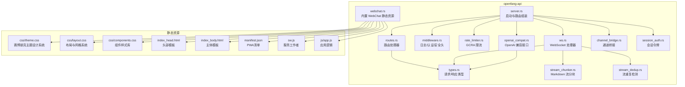
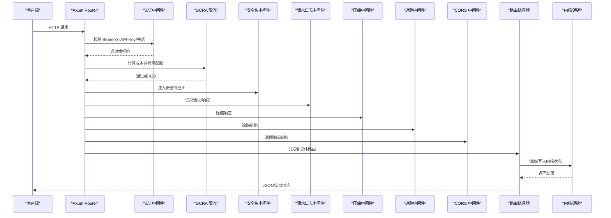
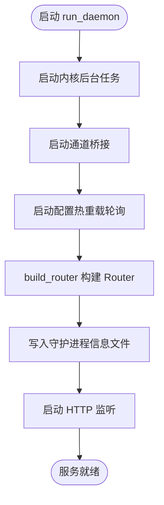
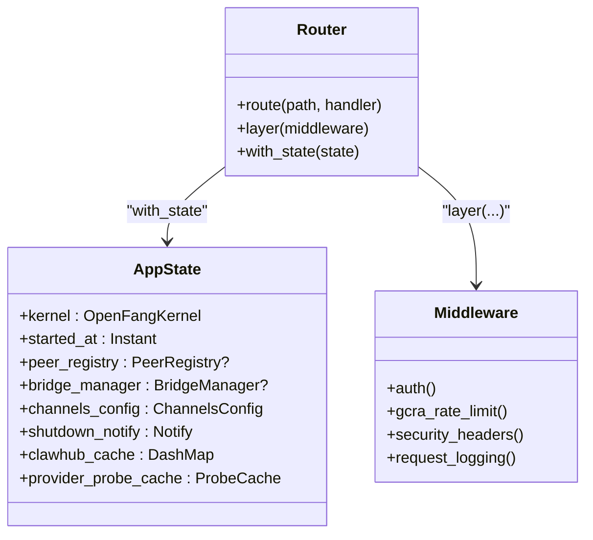
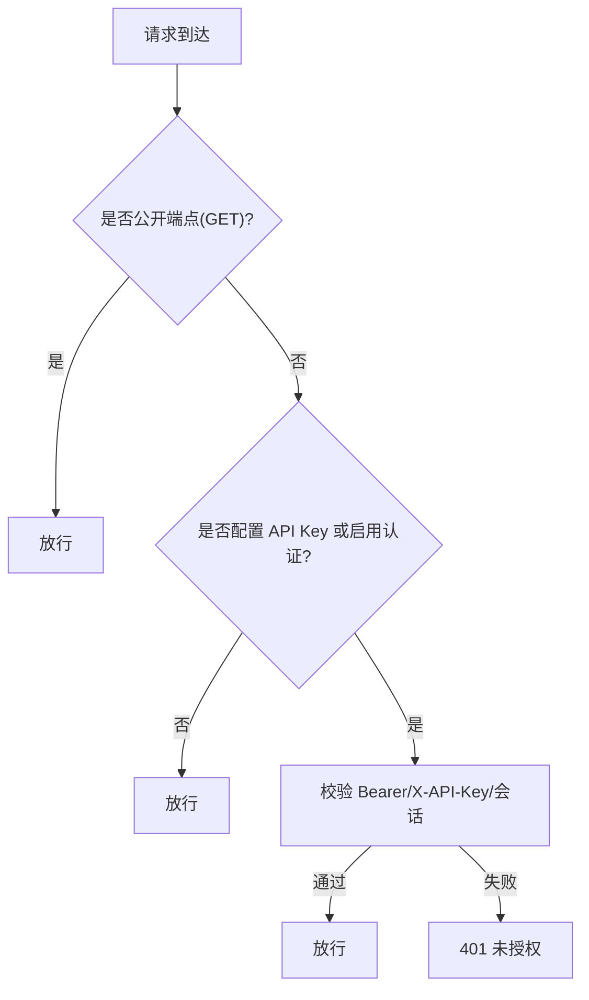
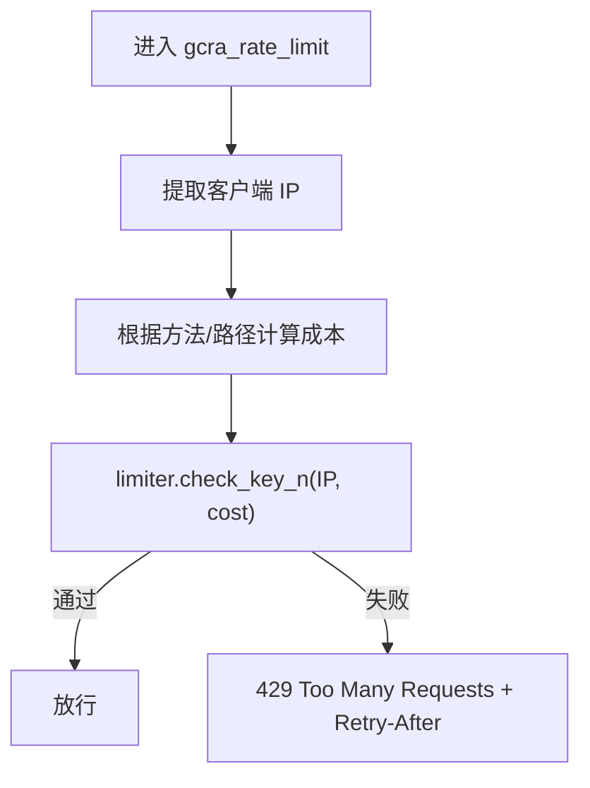
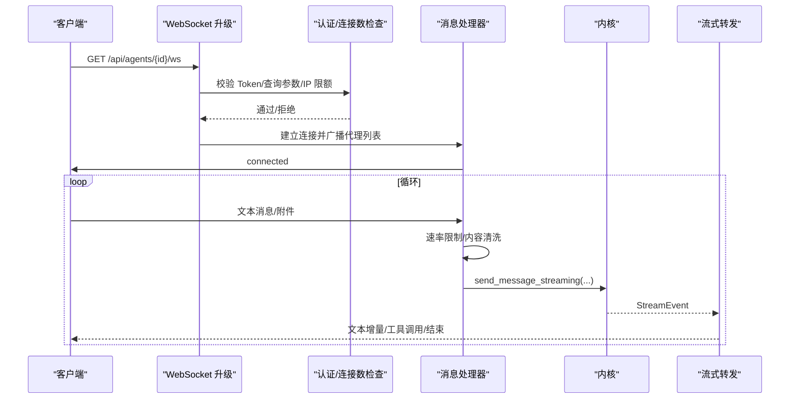
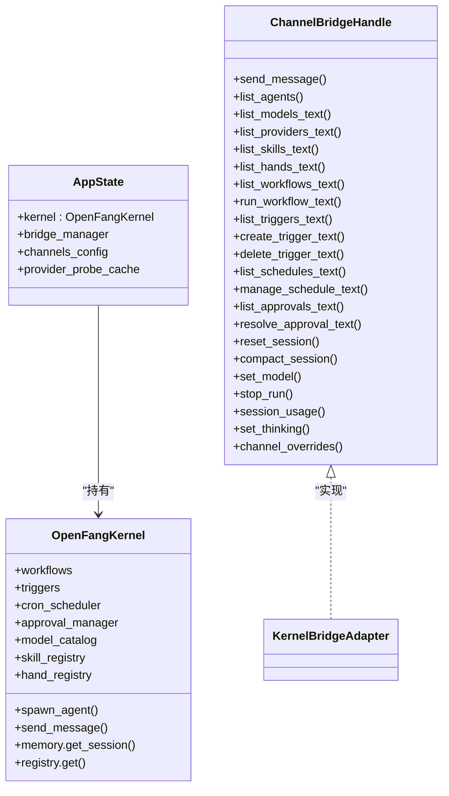
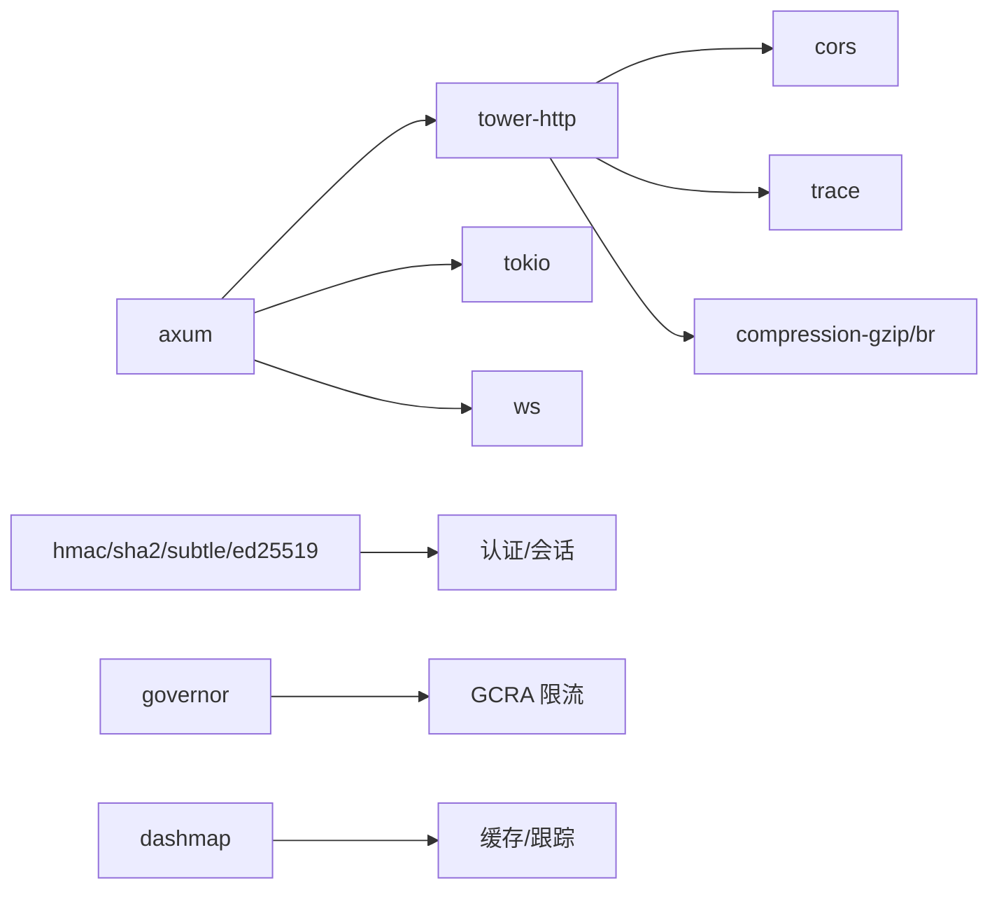

# HTTP 服务器

<cite>
**本文引用的文件**
- [server.rs](file://crates/openfang-api/src/server.rs)
- [lib.rs](file://crates/openfang-api/src/lib.rs)
- [routes.rs](file://crates/openfang-api/src/routes.rs)
- [middleware.rs](file://crates/openfang-api/src/middleware.rs)
- [rate_limiter.rs](file://crates/openfang-api/src/rate_limiter.rs)
- [webchat.rs](file://crates/openfang-api/src/webchat.rs)
- [ws.rs](file://crates/openfang-api/src/ws.rs)
- [types.rs](file://crates/openfang-api/src/types.rs)
- [session_auth.rs](file://crates/openfang-api/src/session_auth.rs)
- [channel_bridge.rs](file://crates/openfang-api/src/channel_bridge.rs)
- [openai_compat.rs](file://crates/openfang-api/src/openai_compat.rs)
- [stream_chunker.rs](file://crates/openfang-api/src/stream_chunker.rs)
- [stream_dedup.rs](file://crates/openfang-api/src/stream_dedup.rs)
- [theme.css](file://crates/openfang-api/static/css/theme.css)
- [layout.css](file://crates/openfang-api/static/css/layout.css)
- [components.css](file://crates/openfang-api/static/css/components.css)
- [index_head.html](file://crates/openfang-api/static/index_head.html)
- [index_body.html](file://crates/openfang-api/static/index_body.html)
- [manifest.json](file://crates/openfang-api/static/manifest.json)
- [sw.js](file://crates/openfang-api/static/sw.js)
- [app.js](file://crates/openfang-api/static/js/app.js)
- [Cargo.toml](file://Cargo.toml)
- [daemon_lifecycle_test.rs](file://crates/openfang-api/tests/daemon_lifecycle_test.rs)
</cite>

## 目录
1. [简介](#简介)
2. [项目结构](#项目结构)
3. [核心组件](#核心组件)
4. [架构总览](#架构总览)
5. [详细组件分析](#详细组件分析)
6. [依赖关系分析](#依赖关系分析)
7. [性能考虑](#性能考虑)
8. [故障排除指南](#故障排除指南)
9. [结论](#结论)
10. [附录](#附录)

## 简介
本文件面向 OpenFang HTTP 服务器的技术文档，系统阐述基于 Axum 的 HTTP/WebSocket API 服务如何启动、配置、注册路由、应用中间件、处理请求与流式响应，并与内核模块进行交互。文档覆盖安全与认证、速率限制、压缩与追踪、OpenAI 兼容接口、健康检查与指标、部署与监控建议以及常见问题排查。特别关注最新的UI重新设计，包括赛博朋克主题的CSS实现、HTML模板更新和PWA配置。

## 项目结构
OpenFang 将 HTTP 服务器封装在 openfang-api crate 中，核心入口位于 server.rs，路由定义在 routes.rs，中间件与认证在 middleware.rs，WebSocket 在 ws.rs，OpenAI 兼容接口在 openai_compat.rs，静态 WebChat 资源在 webchat.rs，通道桥接在 channel_bridge.rs。构建时通过 build_router 组装 Router 并注入共享状态 AppState，随后由 run_daemon 启动监听。

**更新** 新增了完整的静态资源子图，包括赛博朋克主题CSS文件、HTML模板和PWA配置

图示来源
- [server.rs:30-712](file://crates/openfang-api/src/server.rs#L30-L712)
- [routes.rs:21-43](file://crates/openfang-api/src/routes.rs#L21-L43)
- [middleware.rs:17-259](file://crates/openfang-api/src/middleware.rs#L17-L259)
- [rate_limiter.rs:46-79](file://crates/openfang-api/src/rate_limiter.rs#L46-L79)
- [ws.rs:135-384](file://crates/openfang-api/src/ws.rs#L135-L384)
- [openai_compat.rs:245-367](file://crates/openfang-api/src/openai_compat.rs#L245-L367)
- [webchat.rs:77-92](file://crates/openfang-api/src/webchat.rs#L77-L92)
- [channel_bridge.rs:63-174](file://crates/openfang-api/src/channel_bridge.rs#L63-L174)
- [types.rs:5-94](file://crates/openfang-api/src/types.rs#L5-L94)
- [session_auth.rs:9-56](file://crates/openfang-api/src/session_auth.rs#L9-L56)
- [stream_chunker.rs:6-140](file://crates/openfang-api/src/stream_chunker.rs#L6-L140)
- [stream_dedup.rs:12-69](file://crates/openfang-api/src/stream_dedup.rs#L12-L69)
- [theme.css:1-300](file://crates/openfang-api/static/css/theme.css#L1-L300)
- [layout.css:1-412](file://crates/openfang-api/static/css/layout.css#L1-L412)
- [components.css:1-3532](file://crates/openfang-api/static/css/components.css#L1-L3532)
- [index_head.html:1-45](file://crates/openfang-api/static/index_head.html#L1-L45)
- [index_body.html:1-4971](file://crates/openfang-api/static/index_body.html#L1-L4971)
- [manifest.json:1-14](file://crates/openfang-api/static/manifest.json#L1-L14)
- [sw.js:1-4](file://crates/openfang-api/static/sw.js#L1-L4)
- [app.js:286-418](file://crates/openfang-api/static/js/app.js#L286-L418)

章节来源
- [lib.rs:1-18](file://crates/openfang-api/src/lib.rs#L1-L18)
- [server.rs:30-712](file://crates/openfang-api/src/server.rs#L30-L712)

## 核心组件
- 服务器启动与路由组装：build_router 构建完整 Router，注入 CORS、认证、限流、安全头、压缩、追踪等中间层；run_daemon 启动监听并写入守护进程信息文件。
- 路由与控制器：routes.rs 定义所有 REST API 路由处理器，统一读取 AppState 获取内核句柄与共享状态。
- 中间件体系：request_logging 记录请求/响应；auth 实现 Bearer/X-API-Key 与会话 Cookie 双重认证；security_headers 注入安全响应头；GCRA 限流按路径与方法计算成本。
- WebSocket：agent_ws 提供实时聊天通道，支持升级校验、连接数限制、空闲超时、消息速率限制与文本去抖。
- OpenAI 兼容：/v1/chat/completions 与 /v1/models 提供标准兼容接口，支持 SSE 流式输出。
- 内核交互：channel_bridge 将内核能力暴露给通道适配器；AppState 持有内核句柄与运行期缓存。
- 静态资源：webchat 提供内置 WebChat 单页应用与 PWA 支持，包含赛博朋克主题设计系统。
- 类型系统：types.rs 定义请求/响应结构体，确保 API 输入输出一致性。

**更新** 静态资源现在包含完整的赛博朋克主题设计系统，支持主题切换和PWA功能

章节来源
- [server.rs:30-712](file://crates/openfang-api/src/server.rs#L30-L712)
- [routes.rs:21-43](file://crates/openfang-api/src/routes.rs#L21-L43)
- [middleware.rs:17-259](file://crates/openfang-api/src/middleware.rs#L17-L259)
- [rate_limiter.rs:46-79](file://crates/openfang-api/src/rate_limiter.rs#L46-L79)
- [ws.rs:135-384](file://crates/openfang-api/src/ws.rs#L135-L384)
- [openai_compat.rs:245-367](file://crates/openfang-api/src/openai_compat.rs#L245-L367)
- [webchat.rs:77-92](file://crates/openfang-api/src/webchat.rs#L77-L92)
- [channel_bridge.rs:63-174](file://crates/openfang-api/src/channel_bridge.rs#L63-L174)
- [types.rs:5-94](file://crates/openfang-api/src/types.rs#L5-L94)

## 架构总览
Axum Router 作为入口，按顺序应用中间件层（认证、限流、安全头、日志、压缩、追踪、CORS），随后进入路由分发。REST 路由直接返回 JSON 响应；WebSocket 路由建立持久连接；OpenAI 兼容路由将 OpenAI 风格消息转换为内部消息并转发到内核；静态资源路由提供 WebChat 与图标。

图示来源
- [server.rs:121-709](file://crates/openfang-api/src/server.rs#L121-L709)
- [middleware.rs:62-215](file://crates/openfang-api/src/middleware.rs#L62-L215)
- [rate_limiter.rs:51-79](file://crates/openfang-api/src/rate_limiter.rs#L51-L79)
- [routes.rs:45-168](file://crates/openfang-api/src/routes.rs#L45-L168)

## 详细组件分析

### 服务器启动与生命周期
- build_router：初始化 AppState（内核句柄、启动时间、对等节点注册、通道桥管理器、热重载配置、通知句柄、缓存等），注册全部路由，装配中间件层，返回 Router 与共享状态。
- run_daemon：启动内核后台任务与通道桥，启动配置热重载轮询，构建 Router，写入守护进程信息文件（含 PID、监听地址、版本、平台），启动 HTTP 服务监听。

图示来源
- [server.rs:714-800](file://crates/openfang-api/src/server.rs#L714-L800)

章节来源
- [server.rs:30-712](file://crates/openfang-api/src/server.rs#L30-L712)
- [server.rs:714-800](file://crates/openfang-api/src/server.rs#L714-L800)

### 路由注册与中间件管道
- 路由注册：通过 Router::new().route(...) 注册 REST 与 WebSocket 路由，覆盖代理管理、会话、工作流、技能、手部、MCP、审计、网络、通信、模型目录、提供商、预算、日志、配对、A2A 协议、集成管理、设备配对、OpenAI 兼容等。
- 中间件装配顺序：认证（Bearer/X-API-Key/会话）、GCRA 限流、安全头、请求日志、压缩、追踪、CORS。CORS 根据是否启用 API Key 或认证进行不同宽松度控制。

图示来源
- [server.rs:121-709](file://crates/openfang-api/src/server.rs#L121-L709)
- [routes.rs:21-43](file://crates/openfang-api/src/routes.rs#L21-L43)
- [middleware.rs:62-215](file://crates/openfang-api/src/middleware.rs#L62-L215)
- [rate_limiter.rs:46-79](file://crates/openfang-api/src/rate_limiter.rs#L46-L79)

章节来源
- [server.rs:121-709](file://crates/openfang-api/src/server.rs#L121-L709)
- [middleware.rs:62-215](file://crates/openfang-api/src/middleware.rs#L62-L215)
- [rate_limiter.rs:46-79](file://crates/openfang-api/src/rate_limiter.rs#L46-L79)

### 认证与安全
- 认证策略：当配置了非空 API Key 或启用了仪表盘认证时，要求 Authorization: Bearer <api_key> 或 X-API-Key，或会话 Cookie（Dashboard 登录）。公开端点仅允许 GET，其他端点均需认证。
- 会话令牌：使用 HMAC-SHA256 签名，包含用户名与过期时间，支持常量时间比较与过期判断。
- 安全响应头：统一注入 X-Content-Type-Options、X-Frame-Options、X-XSS-Protection、Content-Security-Policy、Referrer-Policy、Cache-Control、Strict-Transport-Security。

图示来源
- [middleware.rs:62-215](file://crates/openfang-api/src/middleware.rs#L62-L215)
- [session_auth.rs:9-56](file://crates/openfang-api/src/session_auth.rs#L9-L56)

章节来源
- [middleware.rs:62-215](file://crates/openfang-api/src/middleware.rs#L62-L215)
- [session_auth.rs:9-56](file://crates/openfang-api/src/session_auth.rs#L9-L56)

### 速率限制（GCRA）
- 成本模型：不同方法/路径分配不同 token 成本，如 /api/health=1、POST /api/agents=50、POST /message=30、POST /run=100 等。
- 限流算法：每 IP 使用 keyed GCRA，配额为每分钟 500 token；超过则返回 429 并设置 Retry-After。

图示来源
- [rate_limiter.rs:14-79](file://crates/openfang-api/src/rate_limiter.rs#L14-L79)

章节来源
- [rate_limiter.rs:14-79](file://crates/openfang-api/src/rate_limiter.rs#L14-L79)

### 请求处理机制与响应格式
- REST：路由处理器从 State 读取内核句柄与共享状态，执行业务逻辑后返回 JSON；错误通过 StatusCode 与 JSON 错误体返回。
- WebSocket：升级前进行认证与连接数限制；建立连接后周期性广播代理列表变更；接收消息后进行速率限制与内容清洗，调用内核发送消息并以事件驱动方式流式回传，支持文本去抖与工具调用增量输出。
- OpenAI 兼容：将 OpenAI 风格消息转换为内部消息，支持非流式与 SSE 流式两种响应。

图示来源
- [ws.rs:135-384](file://crates/openfang-api/src/ws.rs#L135-L384)
- [openai_compat.rs:245-367](file://crates/openfang-api/src/openai_compat.rs#L245-L367)

章节来源
- [routes.rs:45-168](file://crates/openfang-api/src/routes.rs#L45-L168)
- [ws.rs:135-384](file://crates/openfang-api/src/ws.rs#L135-L384)
- [openai_compat.rs:245-367](file://crates/openfang-api/src/openai_compat.rs#L245-L367)

### 与内核模块的交互
- AppState 持有 OpenFangKernel 的 Arc 引用，作为 KernelHandle 供工具调用；同时持有通道桥管理器与热重载配置。
- channel_bridge 实现 ChannelBridgeHandle，将内核的消息发送、代理查找、模型/提供商/技能/手部列表等能力暴露给通道适配器。
- 路由处理器通过 state.kernel 调用内核 API，实现代理生命周期、会话、工作流、触发器、计划任务、审批、配对等功能。

图示来源
- [routes.rs:21-43](file://crates/openfang-api/src/routes.rs#L21-L43)
- [channel_bridge.rs:63-174](file://crates/openfang-api/src/channel_bridge.rs#L63-L174)

章节来源
- [routes.rs:21-43](file://crates/openfang-api/src/routes.rs#L21-L43)
- [channel_bridge.rs:63-174](file://crates/openfang-api/src/channel_bridge.rs#L63-L174)

### 静态资源与 WebChat
- webchat 提供内置 WebChat 单页应用，打包编译时的 HTML/CSS/JS 与 PWA 资源，设置 ETag 与缓存控制头，支持主题切换、Markdown 渲染、WebSocket 实时聊天与 HTTP 回退。
- **更新** 新增赛博朋克主题设计系统，包含完整的颜色变量、发光效果、玻璃拟态和动画效果。

**章节来源**
- [webchat.rs:77-92](file://crates/openfang-api/src/webchat.rs#L77-L92)
- [theme.css:1-300](file://crates/openfang-api/static/css/theme.css#L1-L300)
- [layout.css:1-412](file://crates/openfang-api/static/css/layout.css#L1-L412)
- [components.css:1-3532](file://crates/openfang-api/static/css/components.css#L1-L3532)
- [index_head.html:1-45](file://crates/openfang-api/static/index_head.html#L1-L45)
- [index_body.html:1-4971](file://crates/openfang-api/static/index_body.html#L1-L4971)
- [manifest.json:1-14](file://crates/openfang-api/static/manifest.json#L1-L14)
- [sw.js:1-4](file://crates/openfang-api/static/sw.js#L1-L4)
- [app.js:286-418](file://crates/openfang-api/static/js/app.js#L286-L418)

### OpenAI 兼容接口
- /v1/chat/completions：解析 OpenAI 风格消息，支持数据 URI 图像；可选择非流式或 SSE 流式；将最后一条用户消息转为内部消息并调用内核。
- /v1/models：列出可用代理作为模型对象返回。

章节来源
- [openai_compat.rs:245-367](file://crates/openfang-api/src/openai_compat.rs#L245-L367)
- [openai_compat.rs:534-559](file://crates/openfang-api/src/openai_compat.rs#L534-L559)

### 流式传输优化
- 文本去抖：定时器与字符阈值双重控制，避免频繁小包。
- Markdown 分块：智能识别代码块边界，不破坏 fenced code 区间。
- 重复检测：滑动窗口对比最近发送片段，避免重复输出。

章节来源
- [ws.rs:520-761](file://crates/openfang-api/src/ws.rs#L520-L761)
- [stream_chunker.rs:6-140](file://crates/openfang-api/src/stream_chunker.rs#L6-L140)
- [stream_dedup.rs:12-69](file://crates/openfang-api/src/stream_dedup.rs#L12-L69)

## 依赖关系分析
- 运行时与框架：Tokio（异步运行时）、Axum（Web 框架）、Tower/Tower-HTTP（中间件栈）、Hyper/Http/Http-body（底层协议）。
- 安全与加密：HMAC-SHA256、SHA256、Ed25519、subtle（常量时间比较）、OpenSSL（vendored）。
- 并发与缓存：DashMap、Goverlor（GCRA 限流）、WebSocket 客户端（tokio-tungstenite）。
- 序列化：Serde、Toml、RMP-serde、JSON5。

图示来源
- [Cargo.toml:83-87](file://Cargo.toml#L83-L87)
- [Cargo.toml:100-114](file://Cargo.toml#L100-L114)
- [Cargo.toml:141-142](file://Cargo.toml#L141-L142)

章节来源
- [Cargo.toml:83-87](file://Cargo.toml#L83-L87)
- [Cargo.toml:100-114](file://Cargo.toml#L100-L114)
- [Cargo.toml:141-142](file://Cargo.toml#L141-L142)

## 性能考虑
- 编译优化：发布配置启用 LTO、单代码生成单元、符号裁剪与优化等级 3；release-fast 用于快速迭代。
- 中间件开销：开启压缩与追踪会增加 CPU 开销，建议在生产中按需启用；GCRA 限流与 CORS 评估在高并发下需关注键空间与内存占用。
- 流式传输：合理设置文本去抖阈值与最大块大小，避免过度拆分；在长代码块场景下强制闭合 fence，减少客户端渲染压力。
- 连接管理：WebSocket 按 IP 限流与空闲超时，防止资源耗尽；注意心跳与 Ping/Pong 处理。
- **更新** 赛博朋克主题的CSS动画和发光效果在低端设备上可能影响性能，建议在生产环境中适当调整动画复杂度。

章节来源
- [Cargo.toml:148-160](file://Cargo.toml#L148-L160)
- [ws.rs:35-46](file://crates/openfang-api/src/ws.rs#L35-L46)
- [stream_chunker.rs:19-140](file://crates/openfang-api/src/stream_chunker.rs#L19-L140)
- [theme.css:224-299](file://crates/openfang-api/static/css/theme.css#L224-L299)

## 故障排除指南
- 401 未授权：确认 Authorization 头或 X-API-Key 是否正确；若启用仪表盘认证，检查会话 Cookie 是否有效且未过期。
- 429 太多请求：检查 GCRA 配额与路径成本；可通过降低客户端并发或调整限流策略缓解。
- WebSocket 拒绝：检查 API Key 查询参数或头部；确认 IP 连接数未超过上限；确认代理存在且在线。
- 健康检查：访问 /api/health 与 /api/health/detail；若返回 5xx，查看日志与内核状态。
- 配置热重载：修改配置文件后约 30 秒生效；若无变化，检查文件权限与路径。
- 守护进程冲突：若启动时报“另一个守护进程已在运行”，清理旧的守护进程信息文件后重启。
- **更新** 主题显示异常：检查浏览器是否支持CSS变量和现代动画特性；确认网络连接正常以加载字体和资源。

章节来源
- [middleware.rs:62-215](file://crates/openfang-api/src/middleware.rs#L62-L215)
- [rate_limiter.rs:51-79](file://crates/openfang-api/src/rate_limiter.rs#L51-L79)
- [ws.rs:135-190](file://crates/openfang-api/src/ws.rs#L135-L190)
- [server.rs:714-800](file://crates/openfang-api/src/server.rs#L714-L800)
- [daemon_lifecycle_test.rs:120-153](file://crates/openfang-api/tests/daemon_lifecycle_test.rs#L120-L153)

## 结论
OpenFang HTTP 服务器以 Axum 为核心，通过清晰的中间件管道、严格的认证与安全策略、完善的流式传输与 OpenAI 兼容接口，实现了高性能、可观测、可扩展的代理管理与聊天服务。结合内核模块与通道桥接，形成从 REST 到 WebSocket 的全栈能力，适合在生产环境中部署与运维。最新的UI重新设计引入了赛博朋克主题的CSS实现，提供了现代化的视觉体验和良好的用户体验。

## 附录

### 服务器配置示例与要点
- 监听地址与端口：在 run_daemon 中解析 SocketAddr 并绑定；建议使用环境变量或配置文件指定。
- API Key 与认证：设置 api_key 可启用 Bearer 认证；启用仪表盘认证时使用会话 Cookie。
- CORS 策略：未配置 API Key 时默认仅允许本地开发来源；配置 API Key 或启用认证后允许更广泛的来源。
- 压缩与追踪：生产环境建议启用压缩与追踪，便于调试与性能分析。
- 守护进程信息：启动后写入 JSON 文件，包含 PID、监听地址、版本与平台，便于 CLI 发现。

章节来源
- [server.rs:714-800](file://crates/openfang-api/src/server.rs#L714-L800)
- [server.rs:56-104](file://crates/openfang-api/src/server.rs#L56-L104)

### SSL/TLS 与健康检查
- SSL/TLS：Axum 通过 hyper-util/tokio-tungstenite 支持 TLS；可在上游反向代理（如 Nginx/Caddy）或容器编排中启用 HTTPS。
- 健康检查端点：/api/health 与 /api/health/detail 提供基本与详细健康状态；/api/metrics 提供 Prometheus 指标端点。

章节来源
- [server.rs:128-135](file://crates/openfang-api/src/server.rs#L128-L135)
- [routes.rs:751-765](file://crates/openfang-api/src/routes.rs#L751-L765)

### 部署与监控建议
- 部署：使用 systemd 服务文件或容器编排；将守护进程信息文件路径传递给 run_daemon；在反向代理后启用 HTTPS。
- 监控：启用 Tower Trace 与日志 JSON 输出；收集 /api/metrics 指标；观察 GCRA 429 与 WebSocket 连接数峰值。
- 日志：使用 tracing-subscriber 的 env-filter 控制日志级别；生产环境建议输出 JSON 便于日志聚合。

章节来源
- [Cargo.toml:44-45](file://Cargo.toml#L44-L45)
- [server.rs:759-760](file://crates/openfang-api/src/server.rs#L759-L760)

### 赛博朋克主题设计系统

**更新** 新增赛博朋克主题设计系统的详细说明

OpenFang 采用了完整的赛博朋克主题设计系统，包含以下核心特性：

#### 主题色彩系统
- **背景层次**：深空渐变基础色，包括 `--bg`、`--bg-primary`、`--bg-elevated` 等多层背景色
- **文本系统**：高对比度文本层次，从主文本 `--text` 到次要文本 `--text-secondary` 和消隐文本 `--text-muted`
- **品牌色彩**：霓虹青色 `--accent` (#00f5ff) 和霓虹紫色 `--accent2` (#b829dd) 的双色系统
- **状态色彩**：成功绿色、错误红色、警告黄色、信息蓝色的霓虹变体

#### 视觉效果
- **发光效果**：`--glow-cyan`、`--glow-purple` 等发光阴影效果
- **玻璃拟态**：`--glass-bg`、`--glass-border` 等半透明背景和边框
- **动画系统**：`fadeIn`、`slideUp`、`scaleIn` 等入场动画和 `shimmer`、`pulse-ring` 等动态效果
- **阴影系统**：从 `--shadow-xs` 到 `--shadow-xl` 的多层次阴影

#### 主题切换机制
- **三种模式**：light（亮色）、dark（暗色）、system（系统跟随）
- **本地存储**：使用 localStorage 保存用户偏好的主题模式
- **系统感知**：当设置为 system 模式时，自动跟随操作系统的深色/浅色偏好

#### PWA 支持
- **渐进式Web应用**：完整的 PWA 清单文件和 Service Worker
- **离线支持**：基础的 Service Worker 实现，支持基本的离线访问
- **安装支持**：支持桌面和移动设备的应用安装

**章节来源**
- [theme.css:1-300](file://crates/openfang-api/static/css/theme.css#L1-L300)
- [layout.css:1-200](file://crates/openfang-api/static/css/layout.css#L1-L200)
- [components.css:1-200](file://crates/openfang-api/static/css/components.css#L1-L200)
- [index_head.html:1-45](file://crates/openfang-api/static/index_head.html#L1-L45)
- [index_body.html:1-4971](file://crates/openfang-api/static/index_body.html#L1-L4971)
- [manifest.json:1-14](file://crates/openfang-api/static/manifest.json#L1-L14)
- [sw.js:1-4](file://crates/openfang-api/static/sw.js#L1-L4)
- [app.js:286-418](file://crates/openfang-api/static/js/app.js#L286-L418)