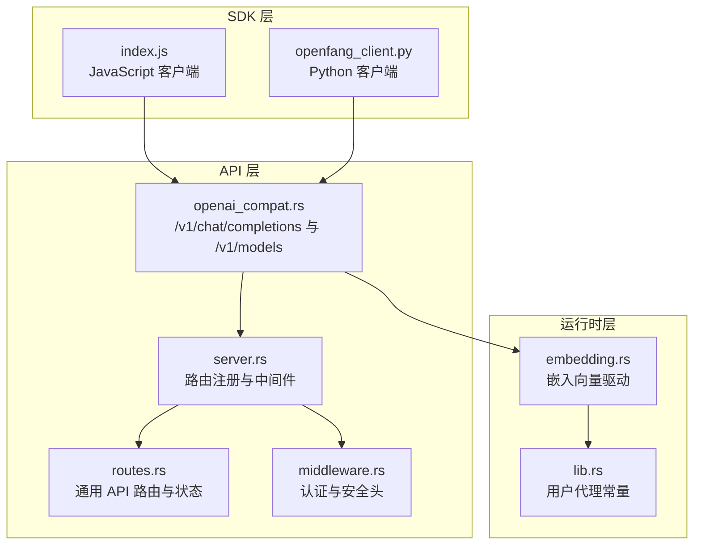
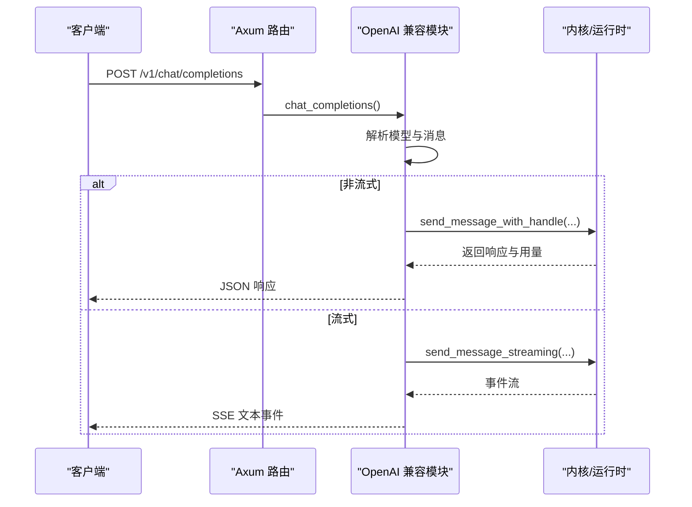
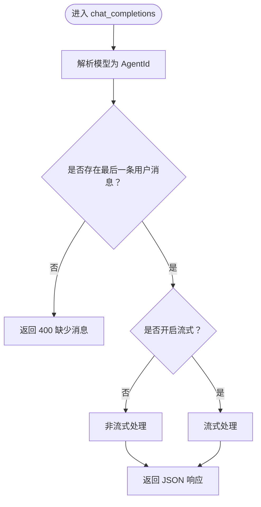
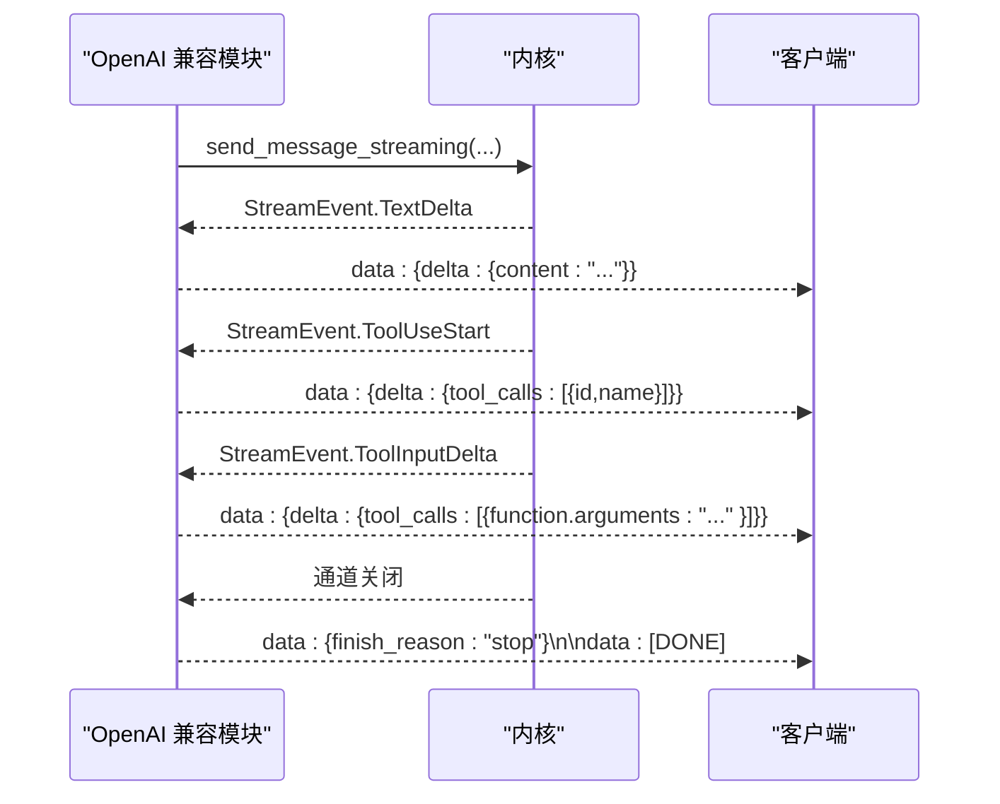
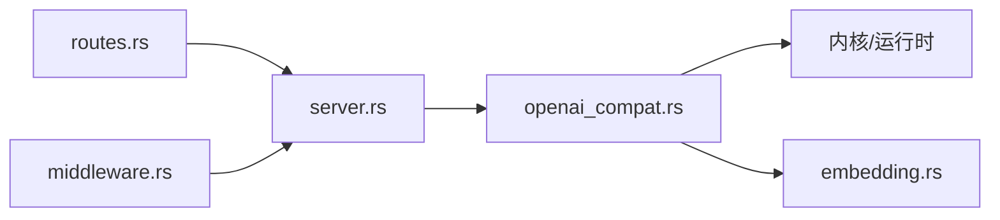

# OpenAI 兼容接口

<cite>
**本文档引用的文件**
- [openai_compat.rs](file://crates/openfang-api/src/openai_compat.rs)
- [server.rs](file://crates/openfang-api/src/server.rs)
- [routes.rs](file://crates/openfang-api/src/routes.rs)
- [types.rs](file://crates/openfang-api/src/types.rs)
- [middleware.rs](file://crates/openfang-api/src/middleware.rs)
- [stream_chunker.rs](file://crates/openfang-api/src/stream_chunker.rs)
- [stream_dedup.rs](file://crates/openfang-api/src/stream_dedup.rs)
- [embedding.rs](file://crates/openfang-runtime/src/embedding.rs)
- [lib.rs](file://crates/openfang-runtime/src/lib.rs)
- [index.js](file://sdk/javascript/index.js)
- [openfang_client.py](file://sdk/python/openfang_client.py)
- [kernel.rs](file://crates/openfang-kernel/src/kernel.rs)
</cite>

## 目录
1. [简介](#简介)
2. [项目结构](#项目结构)
3. [核心组件](#核心组件)
4. [架构总览](#架构总览)
5. [详细组件分析](#详细组件分析)
6. [依赖关系分析](#依赖关系分析)
7. [性能考量](#性能考量)
8. [故障排查指南](#故障排查指南)
9. [结论](#结论)
10. [附录](#附录)

## 简介
本文件面向希望在 OpenFang 上使用 OpenAI 兼容接口的开发者，系统化阐述聊天补全、模型列表、嵌入向量等能力的实现细节，包括：
- 请求参数转换与响应格式标准化
- 流式响应（SSE）处理与去重
- 错误分类与映射
- 与不同 LLM 提供商的集成与模型切换
- 从 OpenAI SDK 迁移到 OpenFang 的步骤与注意事项

## 项目结构
OpenFang 将 OpenAI 兼容接口作为 HTTP API 的一部分暴露，核心位于 openfang-api crate，并通过 openfang-runtime 提供运行时能力（如嵌入向量驱动）。SDK 位于 sdk 目录，提供 JavaScript 与 Python 客户端。

**图表来源**
- [openai_compat.rs:1-774](file://crates/openfang-api/src/openai_compat.rs#L1-L774)
- [server.rs:683-712](file://crates/openfang-api/src/server.rs#L683-L712)
- [routes.rs:1-11270](file://crates/openfang-api/src/routes.rs#L1-L11270)
- [middleware.rs:1-270](file://crates/openfang-api/src/middleware.rs#L1-L270)
- [embedding.rs:1-420](file://crates/openfang-runtime/src/embedding.rs#L1-L420)
- [lib.rs:1-59](file://crates/openfang-runtime/src/lib.rs#L1-L59)
- [index.js:1-480](file://sdk/javascript/index.js#L1-L480)
- [openfang_client.py:1-368](file://sdk/python/openfang_client.py#L1-L368)

**章节来源**
- [openai_compat.rs:1-774](file://crates/openfang-api/src/openai_compat.rs#L1-L774)
- [server.rs:683-712](file://crates/openfang-api/src/server.rs#L683-L712)
- [routes.rs:1-11270](file://crates/openfang-api/src/routes.rs#L1-L11270)
- [middleware.rs:1-270](file://crates/openfang-api/src/middleware.rs#L1-L270)
- [embedding.rs:1-420](file://crates/openfang-runtime/src/embedding.rs#L1-L420)
- [lib.rs:1-59](file://crates/openfang-runtime/src/lib.rs#L1-L59)
- [index.js:1-480](file://sdk/javascript/index.js#L1-L480)
- [openfang_client.py:1-368](file://sdk/python/openfang_client.py#L1-L368)

## 核心组件
- OpenAI 兼容聊天补全与模型列表：实现 /v1/chat/completions 与 /v1/models，支持非流式与流式响应。
- 嵌入向量驱动：提供 OpenAI 兼容的 /v1/embeddings 接口，适配多提供商。
- 中间件与安全：统一注入请求 ID、日志、认证与安全头。
- SDK 客户端：提供 JavaScript 与 Python 客户端，便于直接调用 REST API。

**章节来源**
- [openai_compat.rs:245-367](file://crates/openfang-api/src/openai_compat.rs#L245-L367)
- [openai_compat.rs:534-559](file://crates/openfang-api/src/openai_compat.rs#L534-L559)
- [embedding.rs:61-175](file://crates/openfang-runtime/src/embedding.rs#L61-L175)
- [middleware.rs:18-44](file://crates/openfang-api/src/middleware.rs#L18-L44)
- [index.js:29-141](file://sdk/javascript/index.js#L29-L141)
- [openfang_client.py:46-135](file://sdk/python/openfang_client.py#L46-L135)

## 架构总览
OpenFang 在启动时构建 Router 并注册 OpenAI 兼容路由，随后将请求交由 openai_compat 模块处理。聊天补全会解析模型名并转发到内核执行；嵌入向量通过运行时驱动访问外部提供商。

**图表来源**
- [server.rs:683-712](file://crates/openfang-api/src/server.rs#L683-L712)
- [openai_compat.rs:245-367](file://crates/openfang-api/src/openai_compat.rs#L245-L367)
- [openai_compat.rs:369-532](file://crates/openfang-api/src/openai_compat.rs#L369-L532)

**章节来源**
- [server.rs:683-712](file://crates/openfang-api/src/server.rs#L683-L712)
- [openai_compat.rs:245-367](file://crates/openfang-api/src/openai_compat.rs#L245-L367)
- [openai_compat.rs:369-532](file://crates/openfang-api/src/openai_compat.rs#L369-L532)

## 详细组件分析

### 聊天补全（/v1/chat/completions）
- 模型解析：支持三种形式解析 agent：openfang:<name>、UUID、纯名称字符串。
- 消息转换：将 OpenAI 风格的消息结构转换为内部消息类型，支持文本与 dataURL 图像。
- 非流式响应：返回标准 OpenAI 结构，包含 id、object、created、model、choices、usage。
- 流式响应（SSE）：先发送角色 delta，再逐段推送文本增量与工具调用增量，最后发送结束标记。

**图表来源**
- [openai_compat.rs:250-288](file://crates/openfang-api/src/openai_compat.rs#L250-L288)
- [openai_compat.rs:296-320](file://crates/openfang-api/src/openai_compat.rs#L296-L320)

**章节来源**
- [openai_compat.rs:162-184](file://crates/openfang-api/src/openai_compat.rs#L162-L184)
- [openai_compat.rs:188-241](file://crates/openfang-api/src/openai_compat.rs#L188-L241)
- [openai_compat.rs:245-367](file://crates/openfang-api/src/openai_compat.rs#L245-L367)

### 流式响应处理（SSE）
- 初始事件：发送包含角色的首个增量事件。
- 文本增量：按事件推送文本片段。
- 工具调用：开始与输入增量分别以独立事件推送。
- 结束标记：通道关闭后发送 finish_reason 与 [DONE]。

**图表来源**
- [openai_compat.rs:370-532](file://crates/openfang-api/src/openai_compat.rs#L370-L532)

**章节来源**
- [openai_compat.rs:370-532](file://crates/openfang-api/src/openai_compat.rs#L370-L532)

### 响应格式标准化
- 非流式响应字段：id、object、created、model、choices[].message（role、content）、usage（prompt_tokens、completion_tokens、total_tokens）。
- 流式响应字段：choices[].delta（role/content/tool_calls），并在结束时携带 finish_reason。
- 工具调用：仅在存在时出现在响应中，否则省略。

**章节来源**
- [openai_compat.rs:68-158](file://crates/openfang-api/src/openai_compat.rs#L68-L158)
- [openai_compat.rs:101-125](file://crates/openfang-api/src/openai_compat.rs#L101-L125)
- [openai_compat.rs:127-144](file://crates/openfang-api/src/openai_compat.rs#L127-L144)

### 模型列表（/v1/models）
- 将所有可用 agent 以 OpenAI 模型对象的形式列出，id 采用 openfang:<name> 前缀，owned_by 固定为 openfang。

**章节来源**
- [openai_compat.rs:534-559](file://crates/openfang-api/src/openai_compat.rs#L534-L559)

### 嵌入向量（/v1/embeddings）
- 驱动实现：OpenAIEmbeddingDriver 支持任意 OpenAI 兼容提供商，自动推断维度与基础 URL。
- 维度推断：针对常见模型进行预设，未知模型默认 1536。
- 外部 API 警告：当基础 URL 非本地时发出警告，提示文本可能离开本机。
- 使用场景：与内核默认嵌入模型选择配合，支持云与本地提供商切换。

**章节来源**
- [embedding.rs:61-175](file://crates/openfang-runtime/src/embedding.rs#L61-L175)
- [embedding.rs:177-250](file://crates/openfang-runtime/src/embedding.rs#L177-L250)
- [kernel.rs:5532-5545](file://crates/openfang-kernel/src/kernel.rs#L5532-L5545)

### 中间件与安全
- 认证：支持 Bearer Token 与 X-API-Key，同时支持查询参数 token=，用于 SSE 客户端。
- 安全头：设置多种安全响应头，限制跨域与内容策略。
- 日志：统一注入请求 ID 并记录请求耗时与状态码。

**章节来源**
- [middleware.rs:62-215](file://crates/openfang-api/src/middleware.rs#L62-L215)
- [middleware.rs:232-259](file://crates/openfang-api/src/middleware.rs#L232-L259)
- [middleware.rs:18-44](file://crates/openfang-api/src/middleware.rs#L18-L44)

### SDK 与迁移指南
- JavaScript SDK：提供 OpenFang 类，封装 REST 调用与 SSE 流式读取。
- Python SDK：提供 OpenFang 类，封装 REST 调用与 SSE 流式读取。
- 迁移建议：
  - 将 OpenAI SDK 的 base URL 替换为 OpenFang 服务地址。
  - 使用 /v1/chat/completions 与 /v1/models 替代对应 OpenAI 端点。
  - 对于嵌入向量，使用 /v1/embeddings 或通过运行时驱动创建嵌入驱动。

**章节来源**
- [index.js:29-141](file://sdk/javascript/index.js#L29-L141)
- [openfang_client.py:46-135](file://sdk/python/openfang_client.py#L46-L135)

## 依赖关系分析
OpenAI 兼容模块依赖运行时内核以执行消息与流式事件，同时依赖嵌入向量驱动以支持向量相关能力。

**图表来源**
- [openai_compat.rs:1-774](file://crates/openfang-api/src/openai_compat.rs#L1-L774)
- [embedding.rs:1-420](file://crates/openfang-runtime/src/embedding.rs#L1-L420)
- [server.rs:683-712](file://crates/openfang-api/src/server.rs#L683-L712)
- [routes.rs:1-11270](file://crates/openfang-api/src/routes.rs#L1-L11270)
- [middleware.rs:1-270](file://crates/openfang-api/src/middleware.rs#L1-L270)

**章节来源**
- [openai_compat.rs:1-774](file://crates/openfang-api/src/openai_compat.rs#L1-L774)
- [embedding.rs:1-420](file://crates/openfang-runtime/src/embedding.rs#L1-L420)
- [server.rs:683-712](file://crates/openfang-api/src/server.rs#L683-L712)
- [routes.rs:1-11270](file://crates/openfang-api/src/routes.rs#L1-L11270)
- [middleware.rs:1-270](file://crates/openfang-api/src/middleware.rs#L1-L270)

## 性能考量
- 流式传输：SSE 事件按增量推送，减少首字节延迟；Markdown 感知分块器避免代码块被截断。
- 去重策略：滑动窗口去重检测重复文本，降低冗余传输。
- 用户代理：运行时统一设置 User-Agent，提升与部分提供商的兼容性。

**章节来源**
- [stream_chunker.rs:1-245](file://crates/openfang-api/src/stream_chunker.rs#L1-L245)
- [stream_dedup.rs:1-161](file://crates/openfang-api/src/stream_dedup.rs#L1-L161)
- [lib.rs:6-8](file://crates/openfang-runtime/src/lib.rs#L6-L8)

## 故障排查指南
- 认证失败：检查 Authorization 头或 X-API-Key 是否正确，或查询参数 token= 是否匹配。
- 模型未找到：确认模型名解析逻辑（openfang:<name>、UUID、名称）是否正确。
- 嵌入驱动外部 API：当基础 URL 非本地时会发出警告，注意数据外发风险。
- 错误分类：运行时对常见 HTTP 状态与错误信息进行分类，便于定位问题类型。

**章节来源**
- [middleware.rs:136-215](file://crates/openfang-api/src/middleware.rs#L136-L215)
- [openai_compat.rs:250-265](file://crates/openfang-api/src/openai_compat.rs#L250-L265)
- [embedding.rs:229-239](file://crates/openfang-runtime/src/embedding.rs#L229-L239)

## 结论
OpenFang 通过 openfang-api 提供了与 OpenAI 兼容的聊天补全与模型列表接口，并以 SSE 实现流式体验；通过 openfang-runtime 的嵌入向量驱动实现向量能力。结合中间件与 SDK，可平滑迁移现有 OpenAI 应用至 OpenFang 生态，同时保留灵活的提供商切换与成本控制能力。

## 附录

### OpenAI 兼容端点对照
- /v1/chat/completions → 聊天补全（非流式/流式）
- /v1/models → 模型列表（以 agent 显示）
- /v1/embeddings → 嵌入向量（通过运行时驱动）

**章节来源**
- [server.rs:683-712](file://crates/openfang-api/src/server.rs#L683-L712)
- [openai_compat.rs:534-559](file://crates/openfang-api/src/openai_compat.rs#L534-L559)
- [embedding.rs:123-175](file://crates/openfang-runtime/src/embedding.rs#L123-L175)