# REST 路由系统

<cite>
**本文档引用的文件**
- [routes.rs](file://crates/openfang-api/src/routes.rs)
- [lib.rs](file://crates/openfang-api/src/lib.rs)
- [middleware.rs](file://crates/openfang-api/src/middleware.rs)
- [server.rs](file://crates/openfang-api/src/server.rs)
- [types.rs](file://crates/openfang-api/src/types.rs)
- [rate_limiter.rs](file://crates/openfang-api/src/rate_limiter.rs)
- [session_auth.rs](file://crates/openfang-api/src/session_auth.rs)
- [webchat.rs](file://crates/openfang-api/src/webchat.rs)
- [ws.rs](file://crates/openfang-api/src/ws.rs)
- [openai_compat.rs](file://crates/openfang-api/src/openai_compat.rs)
- [channel_bridge.rs](file://crates/openfang-api/src/channel_bridge.rs)
</cite>

## 目录
1. [简介](#简介)
2. [项目结构](#项目结构)
3. [核心组件](#核心组件)
4. [架构概览](#架构概览)
5. [详细组件分析](#详细组件分析)
6. [依赖关系分析](#依赖关系分析)
7. [性能考虑](#性能考虑)
8. [故障排除指南](#故障排除指南)
9. [结论](#结论)

## 简介

OpenFang REST 路由系统是 OpenFang Agent OS 的核心 HTTP API 层，提供了完整的智能体管理、消息处理、配置查询和状态监控功能。该系统基于 Rust 和 Axum 框架构建，采用模块化设计，支持生产环境的高可用性和安全性要求。

系统的主要特点包括：
- 完整的智能体生命周期管理
- 实时消息处理和 WebSocket 支持
- 成本感知的速率限制机制
- 多层安全认证和授权
- OpenAI 兼容的 API 接口
- 广泛的渠道适配器集成

## 项目结构

OpenFang REST 路由系统位于 `crates/openfang-api/src/` 目录下，采用清晰的模块化组织：

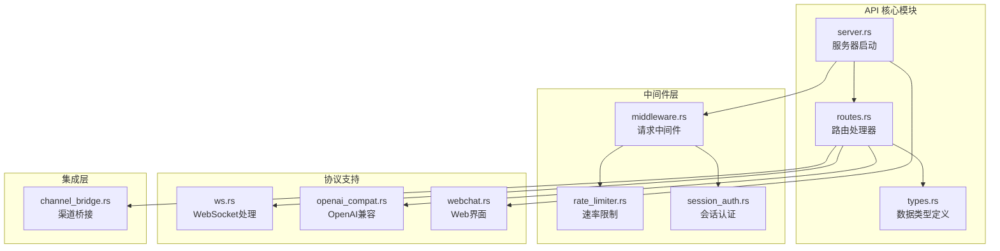

**图表来源**
- [lib.rs:1-18](file://crates/openfang-api/src/lib.rs#L1-L18)
- [server.rs:30-712](file://crates/openfang-api/src/server.rs#L30-L712)

**章节来源**
- [lib.rs:1-18](file://crates/openfang-api/src/lib.rs#L1-L18)
- [server.rs:30-712](file://crates/openfang-api/src/server.rs#L30-L712)

## 核心组件

### 应用状态管理

系统使用共享的应用状态 `AppState` 来管理核心资源：

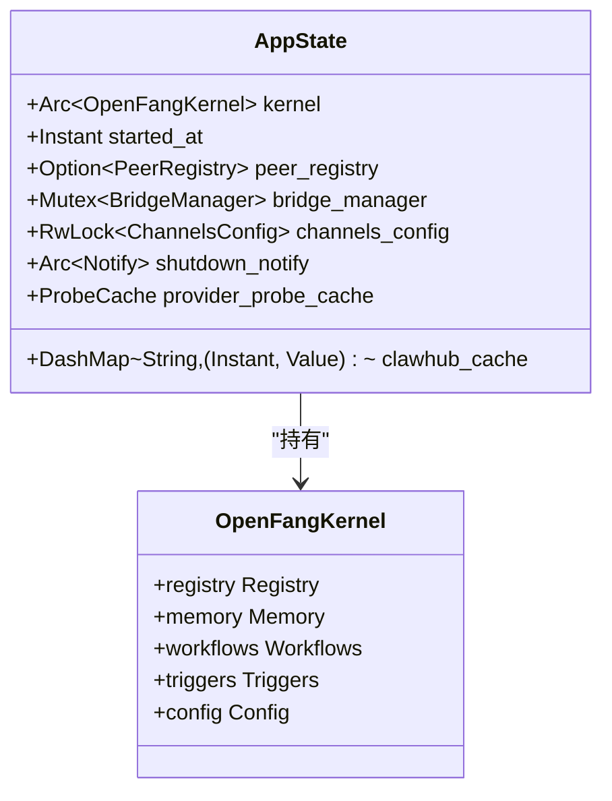

**图表来源**
- [routes.rs:21-43](file://crates/openfang-api/src/routes.rs#L21-L43)

### 路由系统架构

系统采用分层路由设计，支持多种 HTTP 方法和复杂的 URL 模式：

```mermaid
graph TD
subgraph "HTTP 路由层"
Root[/] --> WebChat[WebChat 页面]
Health[/api/health] --> HealthHandler[健康检查]
Status[/api/status] --> StatusHandler[状态查询]
Version[/api/version] --> VersionHandler[版本信息]
subgraph "智能体管理"
Agents[/api/agents] --> ListAgents[列表查询]
Agents --> SpawnAgent[创建智能体]
AgentDetail[/api/agents/{id}] --> GetAgent[详情查询]
AgentDetail --> KillAgent[终止智能体]
AgentMsg[/api/agents/{id}/message] --> SendMessage[发送消息]
AgentSession[/api/agents/{id}/session] --> GetSession[获取会话]
end
subgraph "工作流管理"
Workflows[/api/workflows] --> ListWorkflows[列表查询]
Workflows --> CreateWorkflow[创建工作流]
WorkflowDetail[/api/workflows/{id}] --> GetWorkflow[获取详情]
WorkflowRun[/api/workflows/{id}/run] --> RunWorkflow[执行工作流]
end
subgraph "配置管理"
Config[/api/config] --> GetConfig[获取配置]
ConfigSchema[/api/config/schema] --> ConfigSchemaHandler[配置模式]
Providers[/api/providers] --> ListProviders[列出提供商]
end
end
```

**图表来源**
- [server.rs:121-682](file://crates/openfang-api/src/server.rs#L121-L682)

**章节来源**
- [routes.rs:21-43](file://crates/openfang-api/src/routes.rs#L21-L43)
- [server.rs:121-682](file://crates/openfang-api/src/server.rs#L121-L682)

## 架构概览

OpenFang REST 路由系统采用现代微服务架构设计，具有以下关键特性：

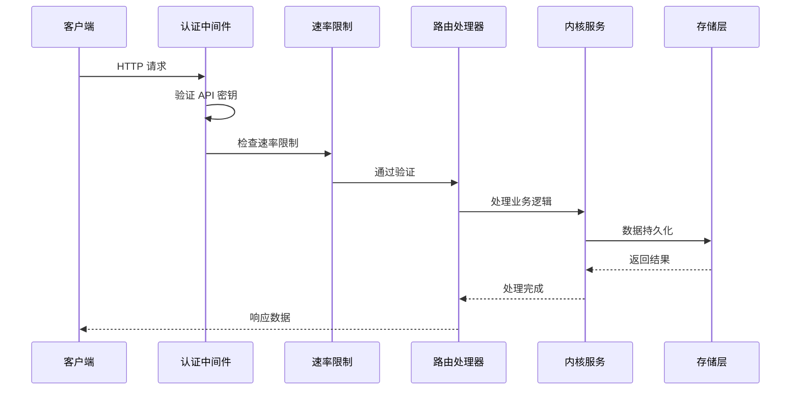

**图表来源**
- [middleware.rs:62-215](file://crates/openfang-api/src/middleware.rs#L62-L215)
- [rate_limiter.rs:51-79](file://crates/openfang-api/src/rate_limiter.rs#L51-L79)

### 中间件链路

系统实现了多层中间件来确保安全性和性能：

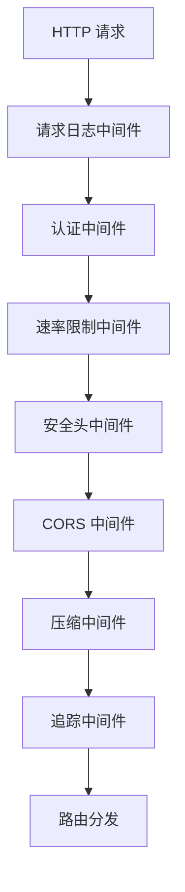

**图表来源**
- [server.rs:106-108](file://crates/openfang-api/src/server.rs#L106-L108)
- [server.rs:704-708](file://crates/openfang-api/src/server.rs#L704-L708)

**章节来源**
- [middleware.rs:17-44](file://crates/openfang-api/src/middleware.rs#L17-L44)
- [rate_limiter.rs:46-79](file://crates/openfang-api/src/rate_limiter.rs#L46-L79)
- [server.rs:106-108](file://crates/openfang-api/src/server.rs#L106-L108)

## 详细组件分析

### 智能体管理路由

智能体管理是系统的核心功能之一，提供了完整的生命周期管理：

#### 智能体创建流程

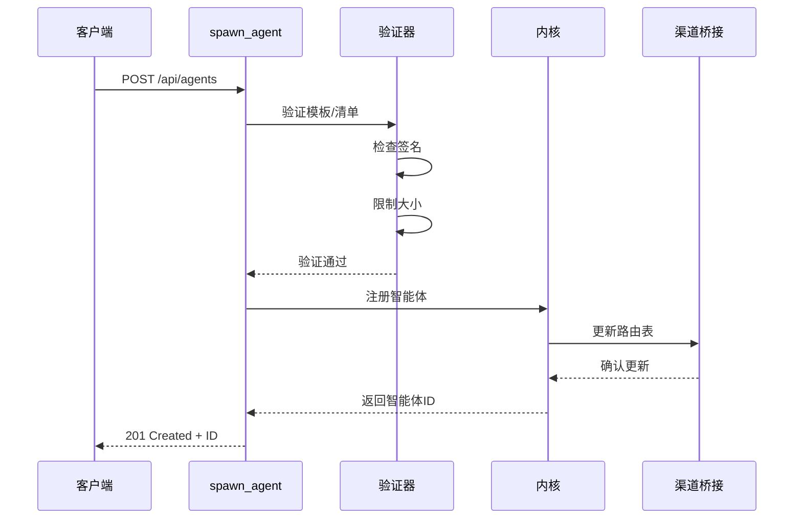

**图表来源**
- [routes.rs:46-168](file://crates/openfang-api/src/routes.rs#L46-L168)

#### 智能体消息处理

消息处理支持同步和异步两种模式：

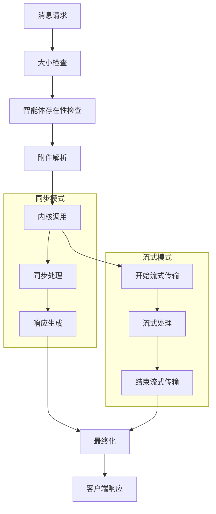

**图表来源**
- [routes.rs:328-428](file://crates/openfang-api/src/routes.rs#L328-L428)
- [routes.rs:1391-1494](file://crates/openfang-api/src/routes.rs#L1391-L1494)

**章节来源**
- [routes.rs:46-168](file://crates/openfang-api/src/routes.rs#L46-L168)
- [routes.rs:328-428](file://crates/openfang-api/src/routes.rs#L328-L428)
- [routes.rs:1391-1494](file://crates/openfang-api/src/routes.rs#L1391-L1494)

### 工作流管理系统

工作流系统提供了强大的自动化能力：

#### 工作流执行流程

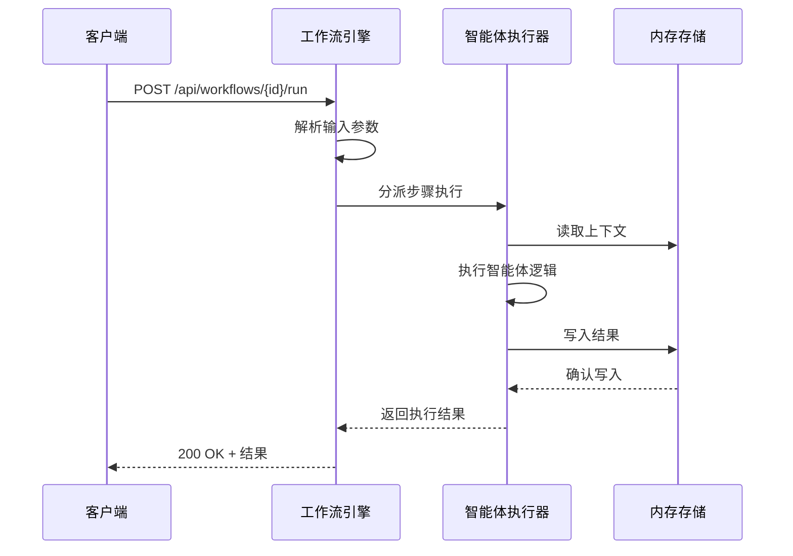

**图表来源**
- [routes.rs:891-926](file://crates/openfang-api/src/routes.rs#L891-L926)

#### 工作流步骤配置

工作流支持多种执行模式：

| 模式类型 | 描述 | 适用场景 |
|---------|------|----------|
| 顺序执行 | 严格按顺序执行每个步骤 | 标准业务流程 |
| 并行执行 | Fan-out 并行处理 | 需要并行计算的任务 |
| 条件执行 | 基于条件判断选择路径 | 动态决策流程 |
| 循环执行 | 重复执行直到满足条件 | 迭代优化任务 |

**章节来源**
- [routes.rs:771-871](file://crates/openfang-api/src/routes.rs#L771-L871)
- [routes.rs:891-926](file://crates/openfang-api/src/routes.rs#L891-L926)

### 配置管理系统

配置管理提供了灵活的系统配置能力：

#### 配置查询接口

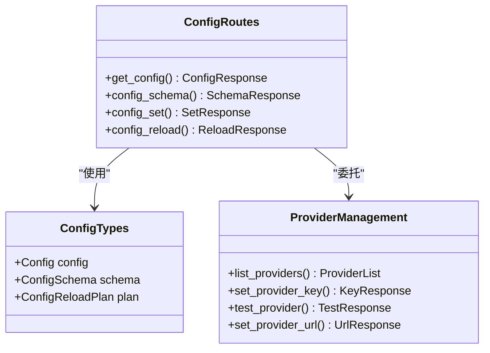

**图表来源**
- [server.rs:536-558](file://crates/openfang-api/src/server.rs#L536-L558)

**章节来源**
- [server.rs:536-558](file://crates/openfang-api/src/server.rs#L536-L558)

### 状态监控系统

系统提供了全面的状态监控和健康检查能力：

#### 监控指标收集

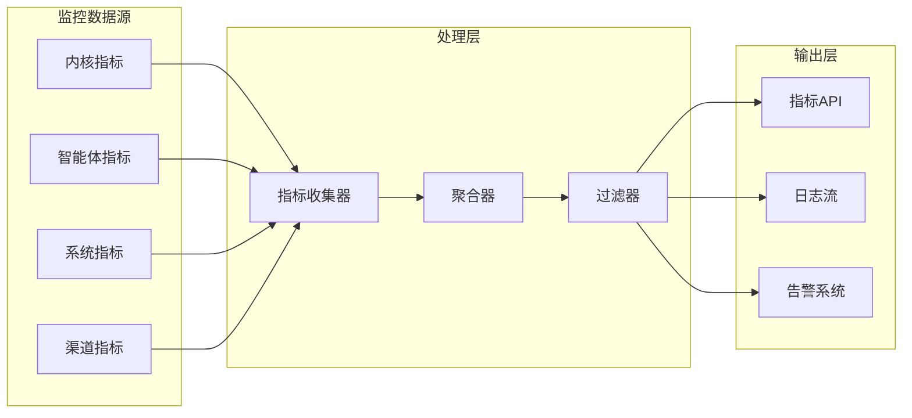

**图表来源**
- [routes.rs:712-749](file://crates/openfang-api/src/routes.rs#L712-L749)

**章节来源**
- [routes.rs:712-749](file://crates/openfang-api/src/routes.rs#L712-L749)

### WebSocket 实时通信

WebSocket 支持提供了实时双向通信能力：

#### WebSocket 连接管理

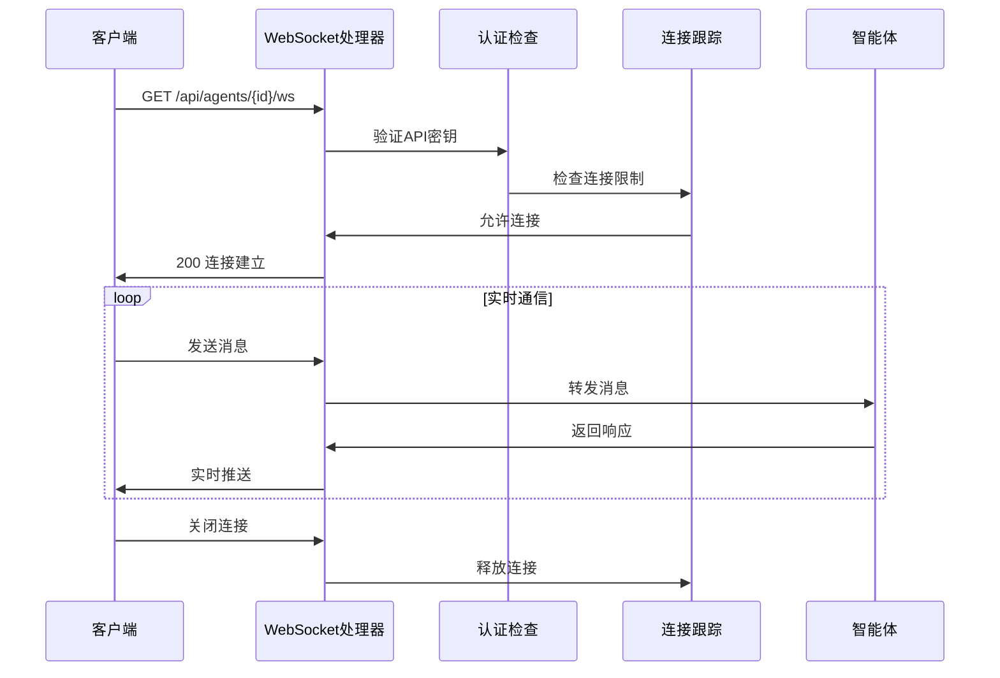

**图表来源**
- [ws.rs:140-207](file://crates/openfang-api/src/ws.rs#L140-L207)

**章节来源**
- [ws.rs:140-207](file://crates/openfang-api/src/ws.rs#L140-L207)

### OpenAI 兼容接口

系统提供了完整的 OpenAI 兼容 API：

#### OpenAI 兼容消息转换

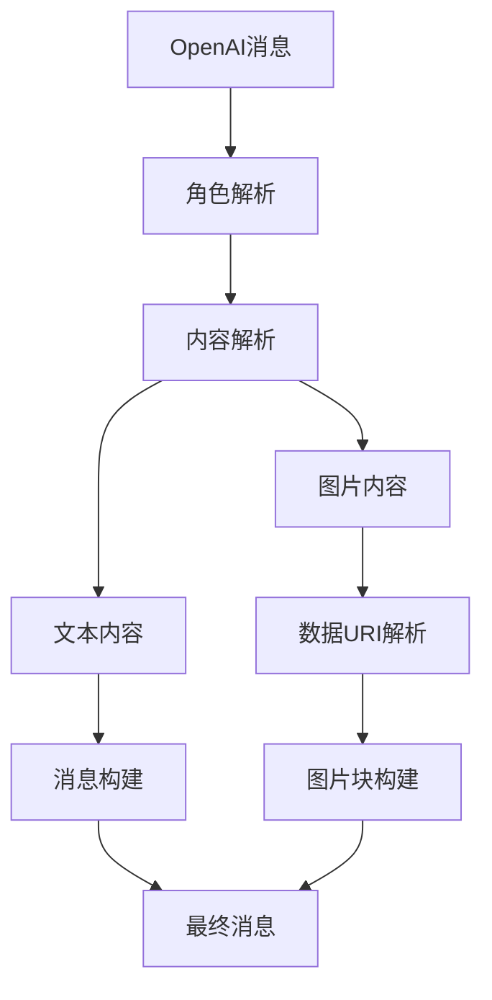

**图表来源**
- [openai_compat.rs:188-241](file://crates/openfang-api/src/openai_compat.rs#L188-L241)

**章节来源**
- [openai_compat.rs:245-367](file://crates/openfang-api/src/openai_compat.rs#L245-L367)
- [openai_compat.rs:188-241](file://crates/openfang-api/src/openai_compat.rs#L188-L241)

## 依赖关系分析

### 组件耦合度分析

系统采用了合理的模块化设计，各组件之间的耦合度保持在较低水平：

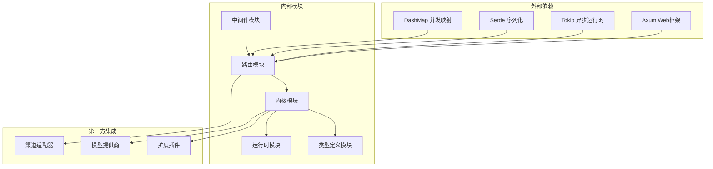

**图表来源**
- [lib.rs:6-17](file://crates/openfang-api/src/lib.rs#L6-L17)

### 数据流分析

系统中的主要数据流向：

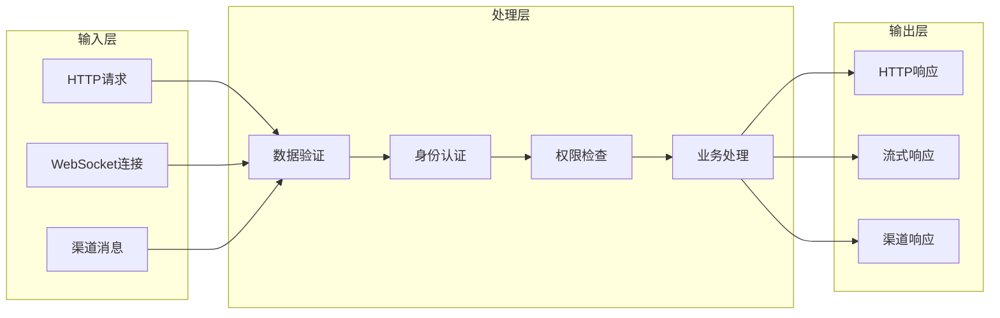

**图表来源**
- [middleware.rs:62-215](file://crates/openfang-api/src/middleware.rs#L62-L215)

**章节来源**
- [lib.rs:6-17](file://crates/openfang-api/src/lib.rs#L6-L17)
- [middleware.rs:62-215](file://crates/openfang-api/src/middleware.rs#L62-L215)

## 性能考虑

### 速率限制策略

系统实现了成本感知的 GCRA（通用信元速率算法）速率限制：

| 操作类型 | 成本权重 | 描述 |
|---------|---------|------|
| 健康检查 | 1 | 最低成本操作 |
| 列表查询 | 2-5 | 读取操作 |
| 工具查询 | 1 | 快速查询 |
| 智能体创建 | 50 | 高成本操作 |
| 消息处理 | 30 | 中等成本操作 |
| 工作流执行 | 100 | 最高成本操作 |

### 缓存策略

系统采用了多层次缓存机制：

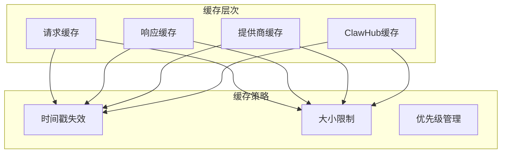

**图表来源**
- [routes.rs:36-43](file://crates/openfang-api/src/routes.rs#L36-L43)

### 并发处理

系统支持高并发请求处理：

- **连接限制**: 每个IP地址最多5个WebSocket连接
- **消息频率**: 每连接每分钟最多10条消息
- **内存管理**: 使用DashMap进行线程安全的数据共享
- **异步处理**: 基于Tokio的异步I/O模型

**章节来源**
- [rate_limiter.rs:14-44](file://crates/openfang-api/src/rate_limiter.rs#L14-L44)
- [ws.rs:35-47](file://crates/openfang-api/src/ws.rs#L35-L47)

## 故障排除指南

### 常见错误类型及解决方案

#### 认证相关错误

| 错误代码 | 错误类型 | 可能原因 | 解决方案 |
|---------|---------|---------|---------|
| 401 | 未授权 | API密钥无效 | 检查Authorization头或X-API-Key |
| 403 | 禁止访问 | 会话过期 | 重新登录获取新会话 |
| 429 | 请求过多 | 速率限制触发 | 等待重试或降低请求频率 |

#### 智能体相关错误

| 错误代码 | 错误类型 | 可能原因 | 解决方案 |
|---------|---------|---------|---------|
| 404 | 未找到 | 智能体不存在 | 验证智能体ID或名称 |
| 413 | 请求实体过大 | 消息超过64KB限制 | 分割消息或使用文件上传 |
| 500 | 内部错误 | 模型调用失败 | 检查模型配置和API密钥 |

#### 系统相关错误

| 错误代码 | 错误类型 | 可能原因 | 解决方案 |
|---------|---------|---------|---------|
| 503 | 服务不可用 | 系统维护中 | 稍后重试或检查维护状态 |
| 504 | 网关超时 | 请求处理超时 | 优化请求参数或增加超时时间 |

### 调试工具和技巧

#### 日志分析

系统提供了详细的日志记录功能：

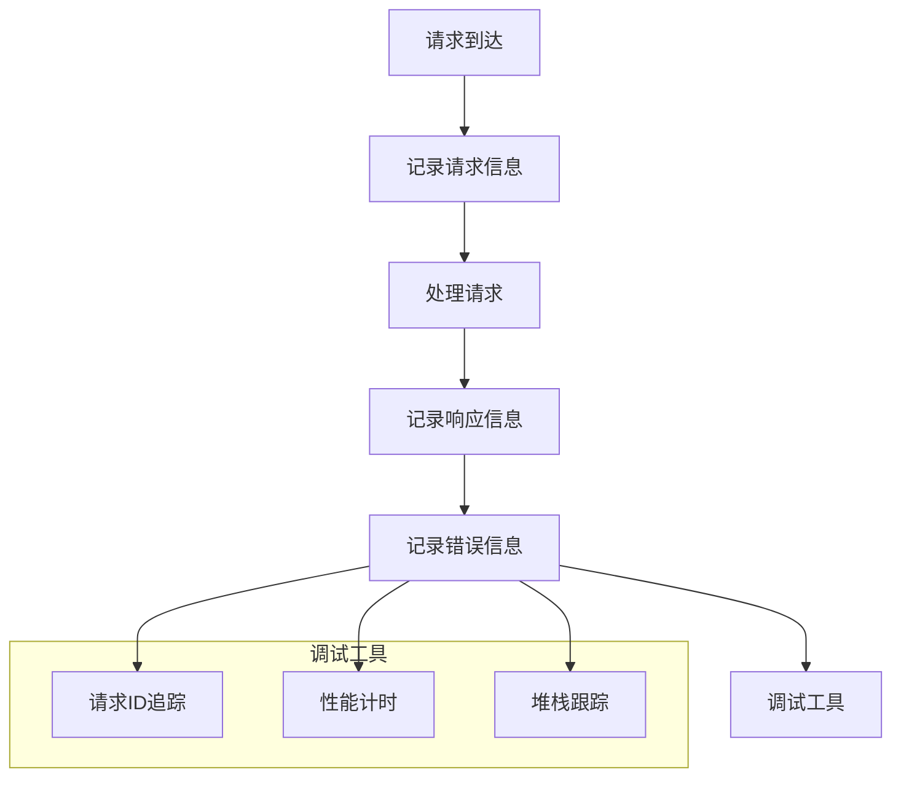

**图表来源**
- [middleware.rs:18-44](file://crates/openfang-api/src/middleware.rs#L18-L44)

#### 性能监控

建议使用以下指标监控系统性能：

- **请求延迟**: P50, P95, P99 延迟时间
- **错误率**: 各种HTTP状态码的错误比例
- **吞吐量**: 每秒请求数
- **资源使用**: CPU, 内存, 磁盘I/O

**章节来源**
- [middleware.rs:18-44](file://crates/openfang-api/src/middleware.rs#L18-L44)

## 结论

OpenFang REST 路由系统是一个设计精良、功能完整的 API 层，具有以下突出特点：

### 技术优势

1. **模块化设计**: 清晰的模块分离和职责划分
2. **安全性保障**: 多层认证、授权和安全中间件
3. **性能优化**: 成本感知的速率限制和缓存策略
4. **扩展性**: 支持新的渠道适配器和API扩展
5. **兼容性**: OpenAI 兼容的API接口

### 最佳实践建议

1. **合理使用速率限制**: 根据业务需求调整限流策略
2. **监控和日志**: 建立完善的监控体系和日志分析
3. **安全配置**: 正确配置API密钥和认证机制
4. **性能调优**: 根据实际负载调整系统参数
5. **错误处理**: 实现健壮的错误处理和恢复机制

该系统为 OpenFang Agent OS 提供了稳定可靠的服务接口，支持从简单的智能体管理到复杂的工作流自动化等各种应用场景。通过合理的配置和使用，可以充分发挥系统的性能和功能潜力。