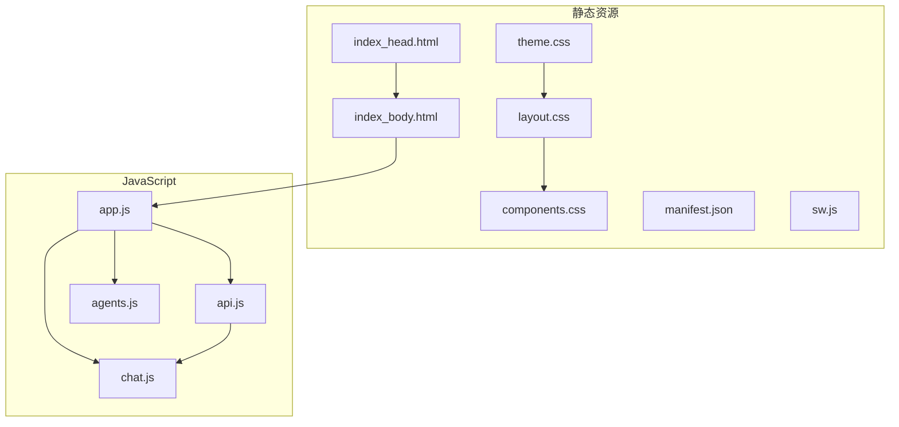
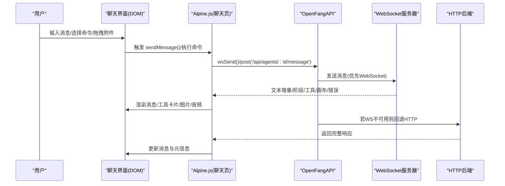
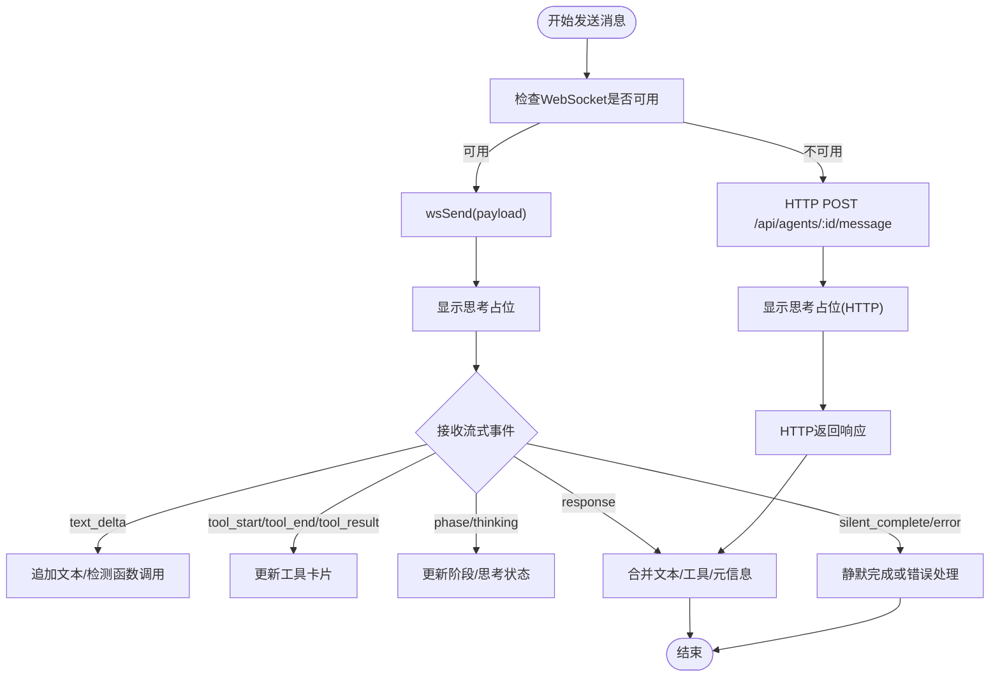
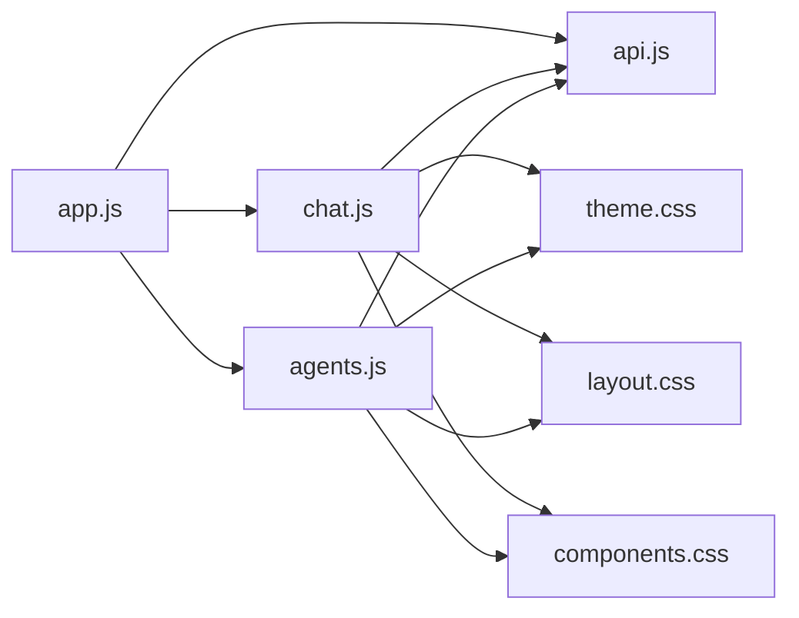

# Web 聊天界面

<cite>
**本文档引用的文件**
- [chat.js](file://crates/openfang-api/static/js/pages/chat.js)
- [agents.js](file://crates/openfang-api/static/js/pages/agents.js)
- [app.js](file://crates/openfang-api/static/js/app.js)
- [api.js](file://crates/openfang-api/static/js/api.js)
- [components.css](file://crates/openfang-api/static/css/components.css)
- [layout.css](file://crates/openfang-api/static/css/layout.css)
- [theme.css](file://crates/openfang-api/static/css/theme.css)
- [index_head.html](file://crates/openfang-api/static/index_head.html)
- [index_body.html](file://crates/openfang-api/static/index_body.html)
- [manifest.json](file://crates/openfang-api/static/manifest.json)
- [sw.js](file://crates/openfang-api/static/sw.js)
</cite>

## 目录
1. [简介](#简介)
2. [项目结构](#项目结构)
3. [核心组件](#核心组件)
4. [架构总览](#架构总览)
5. [详细组件分析](#详细组件分析)
6. [依赖关系分析](#依赖关系分析)
7. [性能考虑](#性能考虑)
8. [故障排除指南](#故障排除指南)
9. [结论](#结论)

## 简介
本文件为 OpenFang Web 聊天界面的全面用户界面文档，涵盖前端静态资源组织、JavaScript 交互逻辑、实时消息处理、HTML 模板、CSS 样式系统、用户交互设计、消息发送、历史记录、文件上传、语音输入、表情符号支持、界面定制与主题配置、响应式设计以及与后端 API 的集成方式和 WebSocket 连接管理等内容。目标是帮助开发者与使用者快速理解并高效使用该聊天界面。

## 项目结构
OpenFang Web 前端静态资源位于 crates/openfang-api/static 目录，采用模块化组织：
- 静态资源：HTML 模板（index_head.html、index_body.html）、CSS 主题与组件样式（components.css、layout.css、theme.css）、应用清单（manifest.json）、服务工作线程（sw.js）
- JavaScript 页面与应用逻辑：应用入口与全局状态（app.js）、API 客户端（api.js）、聊天页面（chat.js）、代理页面（agents.js）

**图表来源**
- [index_head.html:1-15](file://crates/openfang-api/static/index_head.html#L1-L15)
- [index_body.html:1-800](file://crates/openfang-api/static/index_body.html#L1-L800)
- [theme.css:1-277](file://crates/openfang-api/static/css/theme.css#L1-L277)
- [layout.css:1-315](file://crates/openfang-api/static/css/layout.css#L1-L315)
- [components.css:1-800](file://crates/openfang-api/static/css/components.css#L1-L800)
- [app.js:1-418](file://crates/openfang-api/static/js/app.js#L1-L418)
- [api.js:1-333](file://crates/openfang-api/static/js/api.js#L1-L333)
- [chat.js:1-1240](file://crates/openfang-api/static/js/pages/chat.js#L1-L1240)
- [agents.js:1-778](file://crates/openfang-api/static/js/pages/agents.js#L1-L778)
- [manifest.json:1-14](file://crates/openfang-api/static/manifest.json#L1-L14)
- [sw.js:1-4](file://crates/openfang-api/static/sw.js#L1-L4)

**章节来源**
- [index_head.html:1-15](file://crates/openfang-api/static/index_head.html#L1-L15)
- [index_body.html:1-800](file://crates/openfang-api/static/index_body.html#L1-L800)
- [theme.css:1-277](file://crates/openfang-api/static/css/theme.css#L1-L277)
- [layout.css:1-315](file://crates/openfang-api/static/css/layout.css#L1-L315)
- [components.css:1-800](file://crates/openfang-api/static/css/components.css#L1-L800)
- [app.js:1-418](file://crates/openfang-api/static/js/app.js#L1-L418)
- [api.js:1-333](file://crates/openfang-api/static/js/api.js#L1-L333)
- [chat.js:1-1240](file://crates/openfang-api/static/js/pages/chat.js#L1-L1240)
- [agents.js:1-778](file://crates/openfang-api/static/js/pages/agents.js#L1-L778)
- [manifest.json:1-14](file://crates/openfang-api/static/manifest.json#L1-L14)
- [sw.js:1-4](file://crates/openfang-api/static/sw.js#L1-L4)

## 核心组件
- 应用框架与路由：Alpine.js 全局应用组件负责页面路由、主题切换、侧边栏状态、连接状态监听与自动轮询
- API 客户端：封装 fetch 请求、WebSocket 管理、认证令牌注入、连接状态回调、通知系统
- 聊天页面：消息渲染、实时流式响应、工具调用卡片、文件/图片上传、语音录制与转录、搜索高亮、会话管理
- 代理页面：代理列表、详情面板、模板与预设、能力配置、模型切换、工具过滤
- 样式系统：主题变量、布局网格、组件库、动画与骨架屏、响应式断点

**章节来源**
- [app.js:286-418](file://crates/openfang-api/static/js/app.js#L286-L418)
- [api.js:132-333](file://crates/openfang-api/static/js/api.js#L132-L333)
- [chat.js:4-1240](file://crates/openfang-api/static/js/pages/chat.js#L4-L1240)
- [agents.js:19-778](file://crates/openfang-api/static/js/pages/agents.js#L19-L778)
- [theme.css:1-277](file://crates/openfang-api/static/css/theme.css#L1-L277)
- [layout.css:1-315](file://crates/openfang-api/static/css/layout.css#L1-L315)
- [components.css:1-800](file://crates/openfang-api/static/css/components.css#L1-L800)

## 架构总览
前端采用“模板 + Alpine.js + 自定义 API 客户端”的轻量架构：
- HTML 模板通过 Alpine 绑定数据与事件，动态渲染聊天界面
- API 客户端统一处理 HTTP 与 WebSocket，提供连接状态与错误提示
- 聊天页面负责消息生命周期管理、实时流式渲染与工具卡片展示
- 样式系统通过 CSS 变量与主题类实现深浅主题与响应式布局

**图表来源**
- [chat.js:908-1016](file://crates/openfang-api/static/js/pages/chat.js#L908-L1016)
- [api.js:215-291](file://crates/openfang-api/static/js/api.js#L215-L291)
- [index_body.html:542-778](file://crates/openfang-api/static/index_body.html#L542-L778)

**章节来源**
- [chat.js:908-1016](file://crates/openfang-api/static/js/pages/chat.js#L908-L1016)
- [api.js:215-291](file://crates/openfang-api/static/js/api.js#L215-L291)
- [index_body.html:542-778](file://crates/openfang-api/static/index_body.html#L542-L778)

## 详细组件分析

### 聊天页面（chat.js）
- 状态管理：当前代理、消息数组、输入文本、发送状态、消息队列、思考模式、附件、拖拽状态、上下文压力、录音状态、模型切换器、搜索状态、提示循环
- 实时消息处理：
  - WebSocket 接收事件类型：connected、thinking、typing、phase、text_delta、tool_start、tool_end、tool_result、response、silent_complete、error、agents_updated、command_result、canvas、pong
  - 流式渲染：text_delta 累加到当前消息；phase 更新思考状态；tool_* 事件构建工具卡片
  - 结束处理：response 合并累积文本与工具，清理 thinking/streaming 状态，更新 token 计数与元信息
- 交互逻辑：
  - 消息发送：支持 WebSocket 优先与 HTTP 回退；支持附件上传；队列机制避免并发冲突
  - 语音输入：麦克风权限获取、MediaRecorder 录制、上传与转录回填
  - 搜索高亮：按查询词在消息与工具名中匹配并高亮
  - 会话管理：多会话加载、切换、新建
  - 模型切换：弹出模型列表与分组筛选，支持缓存与服务端解析
  - Slash 命令：动态加载命令、输入过滤、快捷键触发
- 工具卡片：按工具类别着色、展开/折叠、输入/结果展示、图片/音频结果渲染
- Markdown 渲染：marked.js 配置、LaTeX 保护、复制按钮、外链新窗口

**图表来源**
- [chat.js:976-1016](file://crates/openfang-api/static/js/pages/chat.js#L976-L1016)
- [chat.js:613-879](file://crates/openfang-api/static/js/pages/chat.js#L613-L879)

**章节来源**
- [chat.js:4-1240](file://crates/openfang-api/static/js/pages/chat.js#L4-L1240)

### 应用与路由（app.js）
- Alpine 全局 store：应用状态、版本、代理数量、连接状态、待审批计数、焦点模式、引导横幅、认证提示、会话用户
- 主应用组件：页面路由（哈希）、主题切换（本地存储）、侧边栏折叠、连接轮询、键盘快捷键
- Markdown 渲染：marked 配置、LaTeX 保护、代码复制按钮、外链新窗口
- 工具图标：按工具前缀分类的 SVG 图标生成

**章节来源**
- [app.js:122-418](file://crates/openfang-api/static/js/app.js#L122-L418)

### API 客户端（api.js）
- 通知系统：Toast 成功/错误/警告/信息，确认对话框
- 错误友好化：根据状态码映射用户可读错误
- HTTP 封装：GET/POST/PUT/PATCH/DELETE，自动注入认证头
- WebSocket 管理：连接/断开/发送，自动重连策略，连接状态回调
- 上传：multipart/form-data 上传文件，带文件名与认证头

**章节来源**
- [api.js:1-333](file://crates/openfang-api/static/js/api.js#L1-L333)

### 代理页面（agents.js）
- 代理列表与状态过滤、运行/停止计数
- 多步骤创建向导：名称、身份、预设、系统提示、配置文件生成
- 详情面板：信息/文件/配置/工具过滤/模型切换/回退链
- 模板与内置预设：分类筛选、搜索、一键创建
- 批量操作：克隆、清空历史、批量停止

**章节来源**
- [agents.js:1-778](file://crates/openfang-api/static/js/pages/agents.js#L1-L778)

### 样式系统（theme.css、layout.css、components.css）
- 主题系统：CSS 变量定义浅/深主题、阴影、圆角、字体、动效曲线
- 布局系统：侧边栏、主内容区、响应式断点、移动端覆盖层、专注模式
- 组件系统：按钮、卡片、徽章、表格、表单、模态框、消息气泡、打字指示器、工具卡片、画布面板、会话切换器、搜索栏、Markdown 样式、复制按钮
- 动画与骨架：入场动画、骨架屏、滚动条美化、打印样式、减少动效偏好

**章节来源**
- [theme.css:1-277](file://crates/openfang-api/static/css/theme.css#L1-L277)
- [layout.css:1-315](file://crates/openfang-api/static/css/layout.css#L1-L315)
- [components.css:1-800](file://crates/openfang-api/static/css/components.css#L1-L800)

### HTML 模板（index_head.html、index_body.html）
- head：基础元信息、字体预连接、主题色、manifest
- body：应用根节点绑定 Alpine，侧边栏导航，页面容器，聊天内联视图，消息区域、输入区、附件预览、Slash 菜单、模型选择器、搜索栏、工具卡片、语音录制指示器
- PWA：manifest、service worker（简单直通）

**章节来源**
- [index_head.html:1-15](file://crates/openfang-api/static/index_head.html#L1-L15)
- [index_body.html:1-800](file://crates/openfang-api/static/index_body.html#L1-L800)
- [manifest.json:1-14](file://crates/openfang-api/static/manifest.json#L1-L14)
- [sw.js:1-4](file://crates/openfang-api/static/sw.js#L1-L4)

## 依赖关系分析
- 组件耦合：
  - chat.js 依赖 api.js 的 WebSocket 与 HTTP 能力，依赖 app.js 的 Alpine store 与主题状态
  - agents.js 依赖 api.js 获取代理列表与模板，依赖 app.js 的全局状态
  - app.js 作为顶层控制器，协调路由、主题、连接状态与自动刷新
- 外部依赖：
  - Alpine.js：MVVM 数据绑定与组件生命周期
  - marked.js：Markdown 渲染与语法高亮
  - hljs（可选）：代码块高亮
  - 浏览器原生 API：fetch、WebSocket、MediaRecorder、Clipboard API、File API

**图表来源**
- [app.js:122-418](file://crates/openfang-api/static/js/app.js#L122-L418)
- [api.js:132-333](file://crates/openfang-api/static/js/api.js#L132-L333)
- [chat.js:1-1240](file://crates/openfang-api/static/js/pages/chat.js#L1-L1240)
- [agents.js:1-778](file://crates/openfang-api/static/js/pages/agents.js#L1-L778)
- [theme.css:1-277](file://crates/openfang-api/static/css/theme.css#L1-L277)
- [layout.css:1-315](file://crates/openfang-api/static/css/layout.css#L1-L315)
- [components.css:1-800](file://crates/openfang-api/static/css/components.css#L1-L800)

**章节来源**
- [app.js:122-418](file://crates/openfang-api/static/js/app.js#L122-L418)
- [api.js:132-333](file://crates/openfang-api/static/js/api.js#L132-L333)
- [chat.js:1-1240](file://crates/openfang-api/static/js/pages/chat.js#L1-L1240)
- [agents.js:1-778](file://crates/openfang-api/static/js/pages/agents.js#L1-L778)

## 性能考虑
- 流式渲染优化：仅在必要时更新 DOM，延迟 LaTeX 渲染以减少重排
- 附件上传：限制大小与类型，及时释放预览 URL 对象
- WebSocket 优先：在可用时使用长连接，失败自动降级 HTTP
- 队列机制：避免并发发送导致的重复消息与状态混乱
- 响应式设计：媒体查询与触摸目标尺寸优化，减少移动端卡顿
- 动画与骨架：合理使用入场动画与骨架屏，避免过度动画影响性能

## 故障排除指南
- WebSocket 连接丢失：
  - 现象：出现重连提示，最终切换至 HTTP 模式
  - 处理：检查后端服务状态、网络连通性；查看控制台错误日志
- 401 未授权：
  - 现象：自动弹出认证提示，清除本地保存的 API Key
  - 处理：正确设置 API Key 或使用会话登录
- 上传失败：
  - 现象：附件上传失败或语音转录异常
  - 处理：检查文件类型与大小限制、麦克风权限、后端上传接口
- 模型切换失败：
  - 现象：切换后未生效或报错
  - 处理：确认可用模型列表、服务端解析返回值、重新加载会话
- 搜索无结果：
  - 现象：搜索关键词无法匹配消息或工具
  - 处理：确认查询词大小写不敏感匹配逻辑正常

**章节来源**
- [api.js:158-198](file://crates/openfang-api/static/js/api.js#L158-L198)
- [chat.js:1133-1195](file://crates/openfang-api/static/js/pages/chat.js#L1133-L1195)
- [chat.js:262-278](file://crates/openfang-api/static/js/pages/chat.js#L262-L278)

## 结论
OpenFang Web 聊天界面通过清晰的模块划分与现代化的前端技术栈，实现了流畅的实时聊天体验。其以 Alpine.js 为核心的状态管理、以 OpenFangAPI 为统一入口的通信层、以 CSS 变量驱动的主题系统与响应式布局，共同构成了一个可扩展、易维护且用户体验优秀的聊天前端。建议在后续迭代中进一步完善错误边界与可访问性，并持续优化流式渲染与多媒体处理的性能表现。