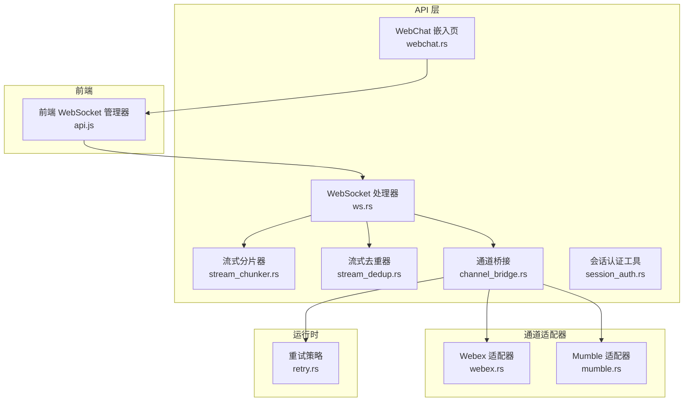
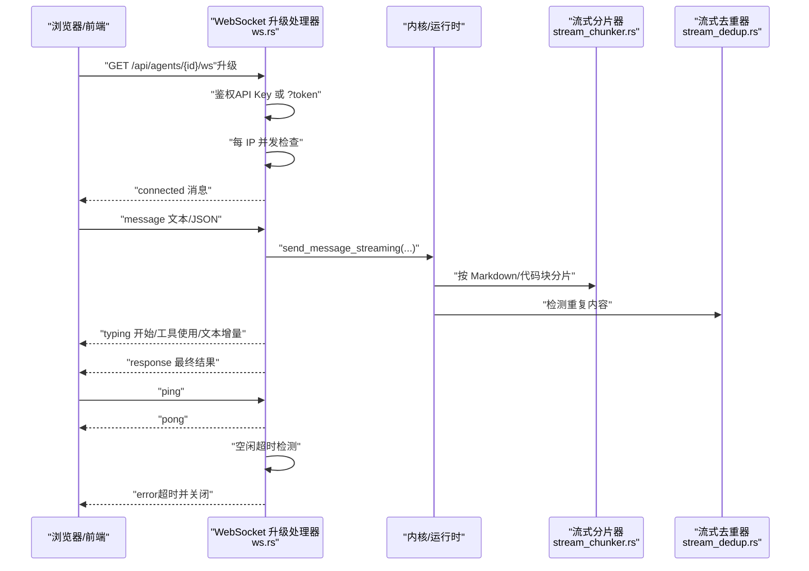
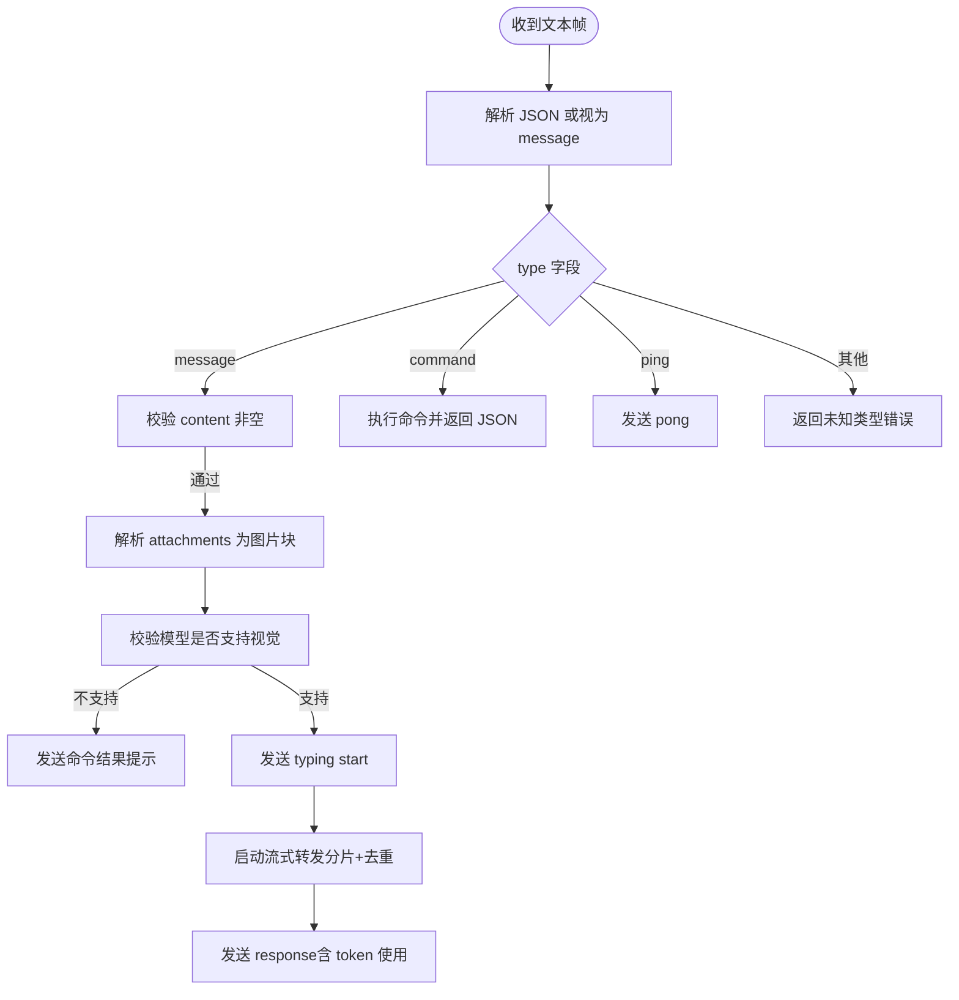
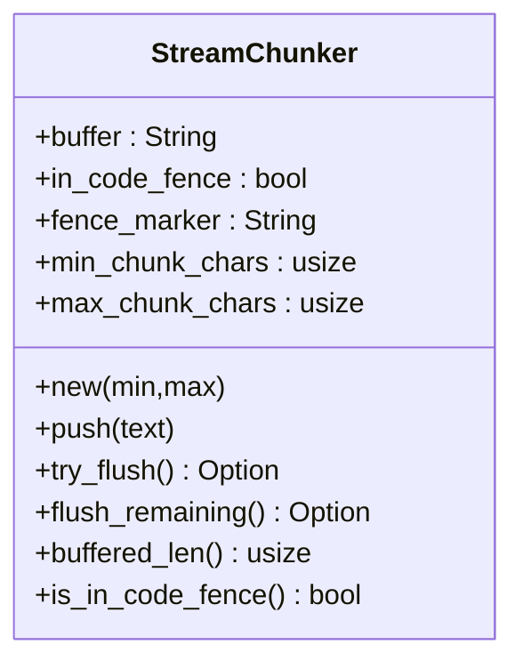
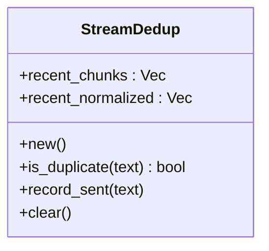
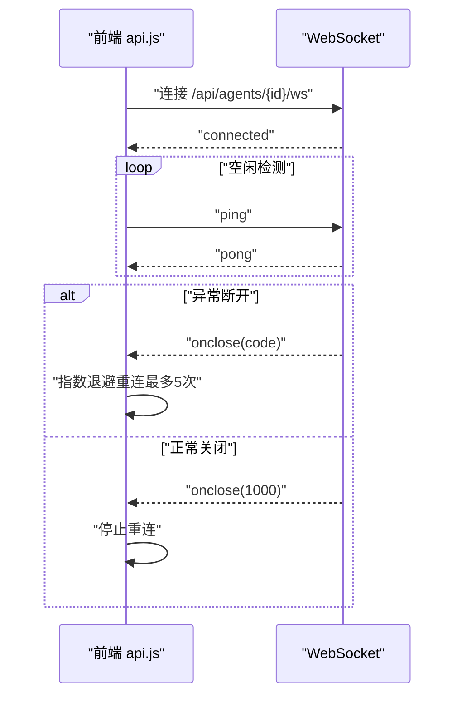
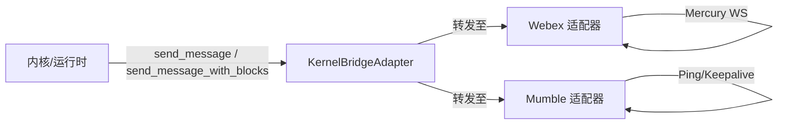
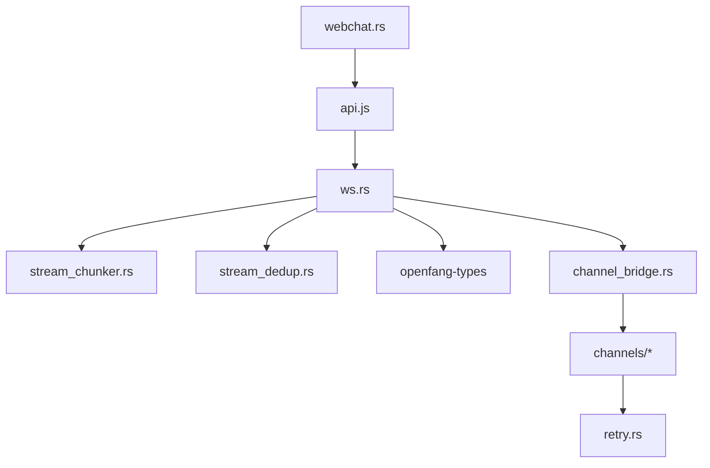

# WebSocket 通信

<cite>
**本文引用的文件**
- [crates/openfang-api/src/ws.rs](file://crates/openfang-api/src/ws.rs)
- [crates/openfang-api/src/stream_chunker.rs](file://crates/openfang-api/src/stream_chunker.rs)
- [crates/openfang-api/src/stream_dedup.rs](file://crates/openfang-api/src/stream_dedup.rs)
- [crates/openfang-api/src/channel_bridge.rs](file://crates/openfang-api/src/channel_bridge.rs)
- [crates/openfang-api/src/webchat.rs](file://crates/openfang-api/src/webchat.rs)
- [crates/openfang-api/static/js/api.js](file://crates/openfang-api/static/js/api.js)
- [crates/openfang-types/src/comms.rs](file://crates/openfang-types/src/comms.rs)
- [sdk/javascript/examples/basic.js](file://sdk/javascript/examples/basic.js)
- [sdk/python/examples/client_basic.py](file://sdk/python/examples/client_basic.py)
- [crates/openfang-channels/src/webex.rs](file://crates/openfang-channels/src/webex.rs)
- [crates/openfang-channels/src/mumble.rs](file://crates/openfang-channels/src/mumble.rs)
- [crates/openfang-api/src/session_auth.rs](file://crates/openfang-api/src/session_auth.rs)
- [crates/openfang-runtime/src/retry.rs](file://crates/openfang-runtime/src/retry.rs)
</cite>

## 目录
1. [简介](#简介)
2. [项目结构](#项目结构)
3. [核心组件](#核心组件)
4. [架构总览](#架构总览)
5. [详细组件分析](#详细组件分析)
6. [依赖关系分析](#依赖关系分析)
7. [性能考量](#性能考量)
8. [故障排查指南](#故障排查指南)
9. [结论](#结论)
10. [附录](#附录)

## 简介
本文件面向 OpenFang 的 WebSocket 通信子系统，系统性阐述实时连接建立、消息订阅与事件推送、双向通信实现、流式数据分片与去重、连接管理、心跳与断线重连、消息队列与会话管理等关键能力。同时给出客户端集成示例、消息格式规范、与消息渠道适配器的集成方式以及并发连接处理策略。

## 项目结构
OpenFang 将 WebSocket 能力集中在 openfang-api 子 crate 中，并通过静态资源嵌入 WebChat 前端；通道适配器位于 openfang-channels 子 crate；类型定义在 openfang-types；运行时与重试策略在 openfang-runtime；SDK 提供 JavaScript/Python 示例。

**图表来源**
- [crates/openfang-api/src/ws.rs](file://crates/openfang-api/src/ws.rs)
- [crates/openfang-api/src/stream_chunker.rs](file://crates/openfang-api/src/stream_chunker.rs)
- [crates/openfang-api/src/stream_dedup.rs](file://crates/openfang-api/src/stream_dedup.rs)
- [crates/openfang-api/src/channel_bridge.rs](file://crates/openfang-api/src/channel_bridge.rs)
- [crates/openfang-api/src/webchat.rs](file://crates/openfang-api/src/webchat.rs)
- [crates/openfang-api/static/js/api.js](file://crates/openfang-api/static/js/api.js)
- [crates/openfang-channels/src/webex.rs](file://crates/openfang-channels/src/webex.rs)
- [crates/openfang-channels/src/mumble.rs](file://crates/openfang-channels/src/mumble.rs)
- [crates/openfang-runtime/src/retry.rs](file://crates/openfang-runtime/src/retry.rs)

**章节来源**
- [crates/openfang-api/src/ws.rs](file://crates/openfang-api/src/ws.rs)
- [crates/openfang-api/src/webchat.rs](file://crates/openfang-api/src/webchat.rs)
- [crates/openfang-api/static/js/api.js](file://crates/openfang-api/static/js/api.js)

## 核心组件
- WebSocket 升级与连接管理：负责鉴权、速率限制、空闲超时、Ping/Pong 心跳、每 IP 并发上限控制、连接生命周期管理。
- 流式分片器（StreamChunker）：按 Markdown 结构与代码块边界进行智能分片，避免破坏语法与语义。
- 流式去重器（StreamDedup）：基于滑动窗口与规范化匹配，检测并抑制重复文本，提升用户体验。
- 通道桥接（ChannelBridge）：将内核与多通道适配器解耦，统一消息转发与会话管理。
- 前端 WebSocket 管理器：自动重连、状态通知、消息收发。
- 会话认证与安全：API Key 鉴权、会话令牌 HMAC 校验、速率限制与消息大小限制。
- 运行时重试策略：网络与通道投递的指数退避与抖动。

**章节来源**
- [crates/openfang-api/src/ws.rs](file://crates/openfang-api/src/ws.rs)
- [crates/openfang-api/src/stream_chunker.rs](file://crates/openfang-api/src/stream_chunker.rs)
- [crates/openfang-api/src/stream_dedup.rs](file://crates/openfang-api/src/stream_dedup.rs)
- [crates/openfang-api/src/channel_bridge.rs](file://crates/openfang-api/src/channel_bridge.rs)
- [crates/openfang-api/src/session_auth.rs](file://crates/openfang-api/src/session_auth.rs)
- [crates/openfang-runtime/src/retry.rs](file://crates/openfang-runtime/src/retry.rs)

## 架构总览
WebSocket 实时通信由后端 Axum WebSocket 升级入口发起，经连接守卫与鉴权后进入消息循环；消息以 JSON 文本帧传输，支持“打字”生命周期、文本增量、命令、错误等事件类型；服务端通过流式分片与去重优化传输质量；前端通过 api.js 统一管理连接、自动重连与回调。

**图表来源**
- [crates/openfang-api/src/ws.rs](file://crates/openfang-api/src/ws.rs)
- [crates/openfang-api/src/stream_chunker.rs](file://crates/openfang-api/src/stream_chunker.rs)
- [crates/openfang-api/src/stream_dedup.rs](file://crates/openfang-api/src/stream_dedup.rs)

## 详细组件分析

### WebSocket 连接与消息协议
- 协议与消息类型
  - 客户端 → 服务端：默认 JSON 文本，若非 JSON 则按 “message” 类型处理。
  - 服务端 → 客户端：支持多种事件类型，如 connected、typing（start/tool/stop）、text_delta、response、error、agents_updated、silent_complete、canvas 等。
- 鉴权
  - 支持 Authorization: Bearer 或查询参数 ?token=，采用常量时间比较防止时序攻击。
- 连接限制
  - 每 IP 最大并发连接数限制（默认 5），超过则返回限流。
- 速率限制
  - 每连接 1 分钟最多 10 条消息，超出返回错误。
- 空闲超时
  - 30 分钟无活动自动关闭，发送错误提示。
- 心跳
  - 接收 Ping 自动回送 Pong，刷新最后活跃时间。
- 安全
  - 单条消息最大 64KB；对 oversized 返回错误。
- 附件
  - 支持 attachments 引用上传文件，解析为图片内容块并做模型能力校验。

**图表来源**
- [crates/openfang-api/src/ws.rs](file://crates/openfang-api/src/ws.rs)

**章节来源**
- [crates/openfang-api/src/ws.rs](file://crates/openfang-api/src/ws.rs)

### 流式数据分片（StreamChunker）
- 设计目标：避免在代码块、段落、句子边界处截断，保证 Markdown 与代码块完整性。
- 关键点
  - 跟踪代码块起止标记，内部缓冲区达到最大阈值时强制闭合并重新打开。
  - 优先级：段落空行 > 单行换行 > 句末标点 > 达到最大字符数（UTF-8 字节边界安全）。
  - 提供最小/最大阈值配置，支持 flush_remaining 清空剩余内容。
- 复杂度
  - push/try_flush 均摊近似 O(n) 与 O(k)（k 为候选断点数量），整体受输入规模与断点分布影响。

**图表来源**
- [crates/openfang-api/src/stream_chunker.rs](file://crates/openfang-api/src/stream_chunker.rs)

**章节来源**
- [crates/openfang-api/src/stream_chunker.rs](file://crates/openfang-api/src/stream_chunker.rs)

### 流式去重（StreamDedup）
- 设计目标：抑制 LLM 重复输出同一文本或仅空白/大小写差异的片段。
- 关键点
  - 最小长度阈值（默认 10 字符）。
  - 滑动窗口（默认 50 个片段）记录最近发送内容。
  - 同时维护“精确匹配”和“规范化匹配”（小写+压缩空白）两套索引。
  - 发送成功后调用 record_sent 入窗，必要时淘汰最旧项。
- 复杂度
  - is_duplicate 平均 O(1)，record_sent O(1)（数组尾部插入与固定容量）。

**图表来源**
- [crates/openfang-api/src/stream_dedup.rs](file://crates/openfang-api/src/stream_dedup.rs)

**章节来源**
- [crates/openfang-api/src/stream_dedup.rs](file://crates/openfang-api/src/stream_dedup.rs)

### 连接管理、心跳与断线重连
- 连接管理
  - 每 IP 并发上限（默认 5），使用全局计数表跟踪并自动回收。
  - 空闲超时（30 分钟）触发关闭并发送错误消息。
- 心跳
  - 服务端接收 Ping 自动回送 Pong，刷新 last_activity。
- 断线重连
  - 前端实现指数退避（最大延迟 10 秒，最多 5 次尝试），失败后切换到 HTTP 模式并提示。
  - 服务端在 onclose 时清理后台任务，确保资源释放。

**图表来源**
- [crates/openfang-api/static/js/api.js](file://crates/openfang-api/static/js/api.js)
- [crates/openfang-api/src/ws.rs](file://crates/openfang-api/src/ws.rs)

**章节来源**
- [crates/openfang-api/static/js/api.js](file://crates/openfang-api/static/js/api.js)
- [crates/openfang-api/src/ws.rs](file://crates/openfang-api/src/ws.rs)

### 与消息渠道适配器的集成
- 通道桥接
  - 通过 KernelBridgeAdapter 将内核与各通道适配器解耦，统一消息发送、代理查找、工作流调度、审批与会话管理等能力。
  - 通道适配器（如 Webex、Mumble）各自维护长连接与心跳/重连逻辑，读取/写入消息流。
- 会话管理
  - 支持重置会话、紧凑化会话、设置模型、查看用量等命令，便于通道侧联动。

**图表来源**
- [crates/openfang-api/src/channel_bridge.rs](file://crates/openfang-api/src/channel_bridge.rs)
- [crates/openfang-channels/src/webex.rs](file://crates/openfang-channels/src/webex.rs)
- [crates/openfang-channels/src/mumble.rs](file://crates/openfang-channels/src/mumble.rs)

**章节来源**
- [crates/openfang-api/src/channel_bridge.rs](file://crates/openfang-api/src/channel_bridge.rs)
- [crates/openfang-channels/src/webex.rs](file://crates/openfang-channels/src/webex.rs)
- [crates/openfang-channels/src/mumble.rs](file://crates/openfang-channels/src/mumble.rs)

### 客户端集成示例与消息格式规范
- 客户端示例
  - JavaScript SDK：basic.js 展示健康检查、列出/创建/删除代理、发送消息。
  - Python SDK：client_basic.py 展示相同流程。
- 消息格式
  - 客户端 → 服务端
    - 默认 JSON 文本，若非 JSON 则按 type=message 处理。
    - 支持字段：type、content、attachments（可选）、command/args（可选）、ping/pong（可选）。
  - 服务端 → 客户端
    - connected：确认连接与代理 ID。
    - typing：start/tool/stop，伴随工具名（tool 场景）。
    - text_delta：文本增量。
    - response：最终响应，包含 input_tokens、output_tokens、上下文压力等级等。
    - error：错误信息。
    - agents_updated：代理列表变更广播。
    - silent_complete：静默完成（NO_REPLY）。
    - canvas：画布渲染（HTML 片段）。

**章节来源**
- [sdk/javascript/examples/basic.js](file://sdk/javascript/examples/basic.js)
- [sdk/python/examples/client_basic.py](file://sdk/python/examples/client_basic.py)
- [crates/openfang-api/src/ws.rs](file://crates/openfang-api/src/ws.rs)

### 并发连接处理与安全
- 并发控制
  - 每 IP 最大并发连接数限制（默认 5），使用原子计数与全局映射跟踪，RAII 守护在连接结束时自动减计数。
- 安全与限流
  - API Key 常量时间比较；单条消息最大 64KB；每连接 1 分钟最多 10 条消息。
- 会话认证
  - 会话令牌采用 HMAC-SHA256 签名，包含用户名与过期时间，支持常量时间校验与密码哈希存储。

**章节来源**
- [crates/openfang-api/src/ws.rs](file://crates/openfang-api/src/ws.rs)
- [crates/openfang-api/src/session_auth.rs](file://crates/openfang-api/src/session_auth.rs)

## 依赖关系分析
- 组件耦合
  - ws.rs 依赖 stream_chunker.rs 与 stream_dedup.rs 进行流式优化；依赖 channel_bridge.rs 与内核交互；依赖 openfang-types 的消息与内容块类型。
  - 前端 api.js 依赖后端 WebSocket 升级路径与错误提示；与 WebChat 页面共同构成 UI。
  - 通道适配器独立于 ws.rs，通过 channel_bridge.rs 间接与内核交互。
- 外部依赖
  - tokio、futures、axum、dashmap、subtle、hmac、sha2、hex 等。

**图表来源**
- [crates/openfang-api/src/ws.rs](file://crates/openfang-api/src/ws.rs)
- [crates/openfang-api/src/stream_chunker.rs](file://crates/openfang-api/src/stream_chunker.rs)
- [crates/openfang-api/src/stream_dedup.rs](file://crates/openfang-api/src/stream_dedup.rs)
- [crates/openfang-api/src/channel_bridge.rs](file://crates/openfang-api/src/channel_bridge.rs)
- [crates/openfang-api/src/webchat.rs](file://crates/openfang-api/src/webchat.rs)
- [crates/openfang-api/static/js/api.js](file://crates/openfang-api/static/js/api.js)
- [crates/openfang-runtime/src/retry.rs](file://crates/openfang-runtime/src/retry.rs)

**章节来源**
- [crates/openfang-api/src/ws.rs](file://crates/openfang-api/src/ws.rs)
- [crates/openfang-api/src/stream_chunker.rs](file://crates/openfang-api/src/stream_chunker.rs)
- [crates/openfang-api/src/stream_dedup.rs](file://crates/openfang-api/src/stream_dedup.rs)
- [crates/openfang-api/src/channel_bridge.rs](file://crates/openfang-api/src/channel_bridge.rs)
- [crates/openfang-api/src/webchat.rs](file://crates/openfang-api/src/webchat.rs)
- [crates/openfang-api/static/js/api.js](file://crates/openfang-api/static/js/api.js)
- [crates/openfang-runtime/src/retry.rs](file://crates/openfang-runtime/src/retry.rs)

## 性能考量
- 流式传输
  - 分片器避免频繁小包，减少网络拥塞；去重器降低带宽与渲染压力。
- 并发与内存
  - 每 IP 并发上限与空闲超时防止资源耗尽；滑动窗口大小与最小长度阈值平衡去重效果与内存占用。
- 重试与退避
  - 通道与网络操作采用指数退避+抖动，降低雪崩风险；最大延迟与上限限制保护系统稳定性。

[本节为通用指导，无需特定文件引用]

## 故障排查指南
- 常见错误
  - 401 未授权：检查 API Key 或 ?token 参数。
  - 429 速率限制：等待冷却或降低发送频率。
  - 413 消息过大：单条消息不超过 64KB。
  - 429/503 服务不可用：确认守护进程运行状态。
- 前端状态
  - 连接状态变化会触发回调，注意 onclose 与 onError 的区分；断线后自动指数退避重连。
- 通道适配器
  - Mercury/WS 与 Mumble 适配器具备独立的心跳与重连逻辑，关注 onclose 与 read 错误日志。

**章节来源**
- [crates/openfang-api/static/js/api.js](file://crates/openfang-api/static/js/api.js)
- [crates/openfang-channels/src/webex.rs](file://crates/openfang-channels/src/webex.rs)
- [crates/openfang-channels/src/mumble.rs](file://crates/openfang-channels/src/mumble.rs)

## 结论
OpenFang 的 WebSocket 通信体系以安全、稳定、可扩展为核心设计原则：通过严格的鉴权与限流保障安全，利用流式分片与去重提升传输质量，结合前端自动重连与通道适配器的心跳/重连机制实现高可用。该架构既满足实时聊天场景，也为多通道集成与会话管理提供了坚实基础。

[本节为总结，无需特定文件引用]

## 附录
- 术语
  - 文本增量（text_delta）：流式输出的中间片段。
  - 静默完成（silent_complete）：代理选择不回复文本。
  - 画布（canvas）：用于在前端渲染富媒体内容的 HTML 片段。
- 相关类型参考
  - 通信事件与拓扑类型定义参见 openfang-types/comms.rs。

**章节来源**
- [crates/openfang-types/src/comms.rs](file://crates/openfang-types/src/comms.rs)