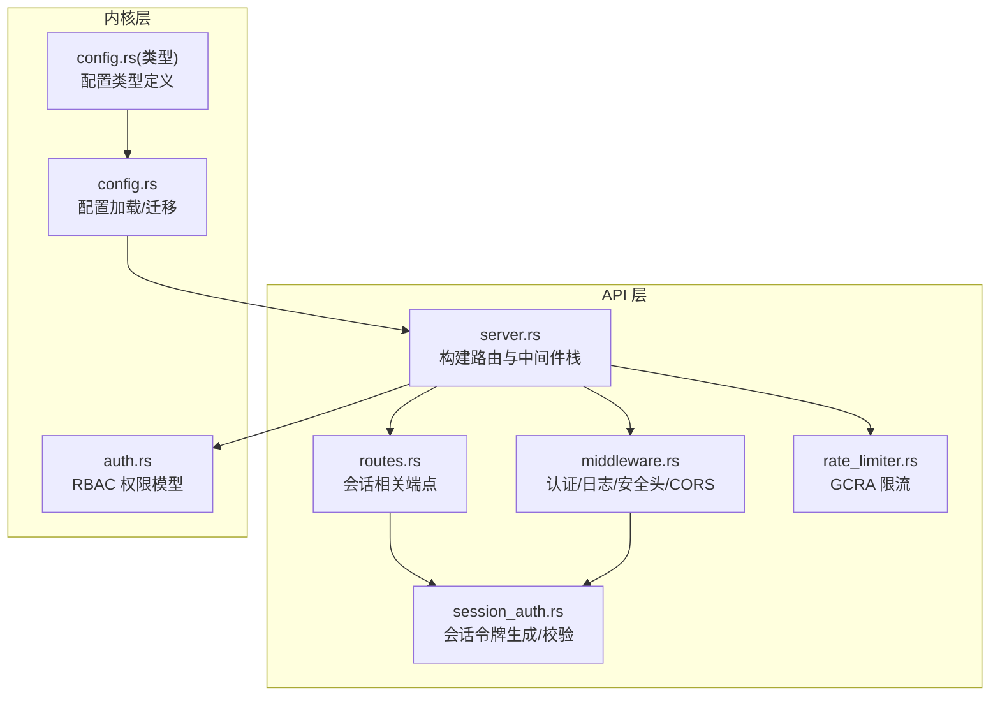
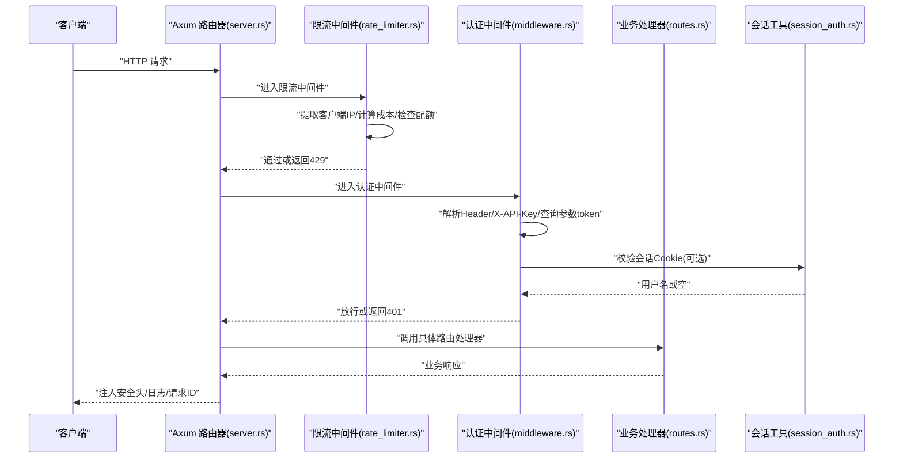
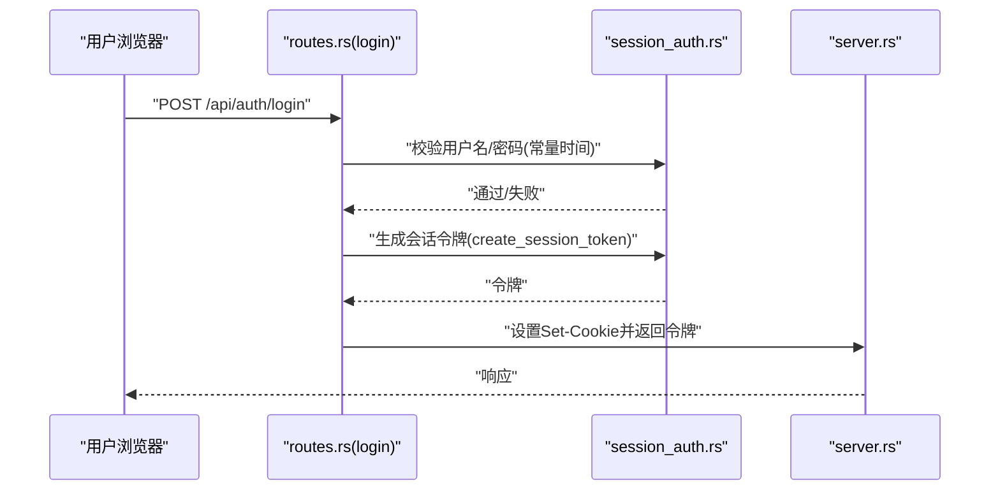
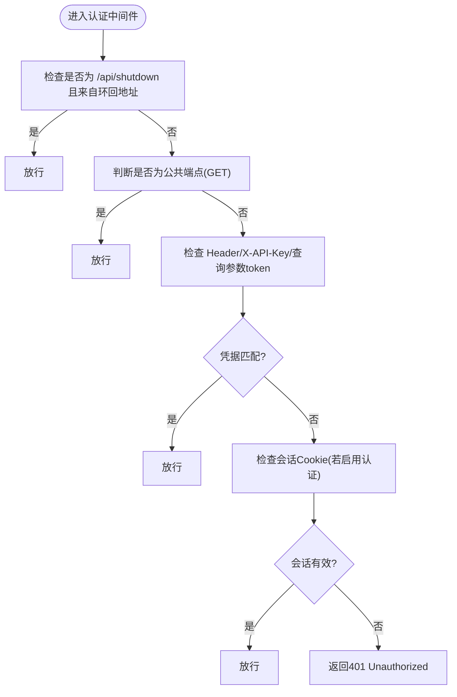
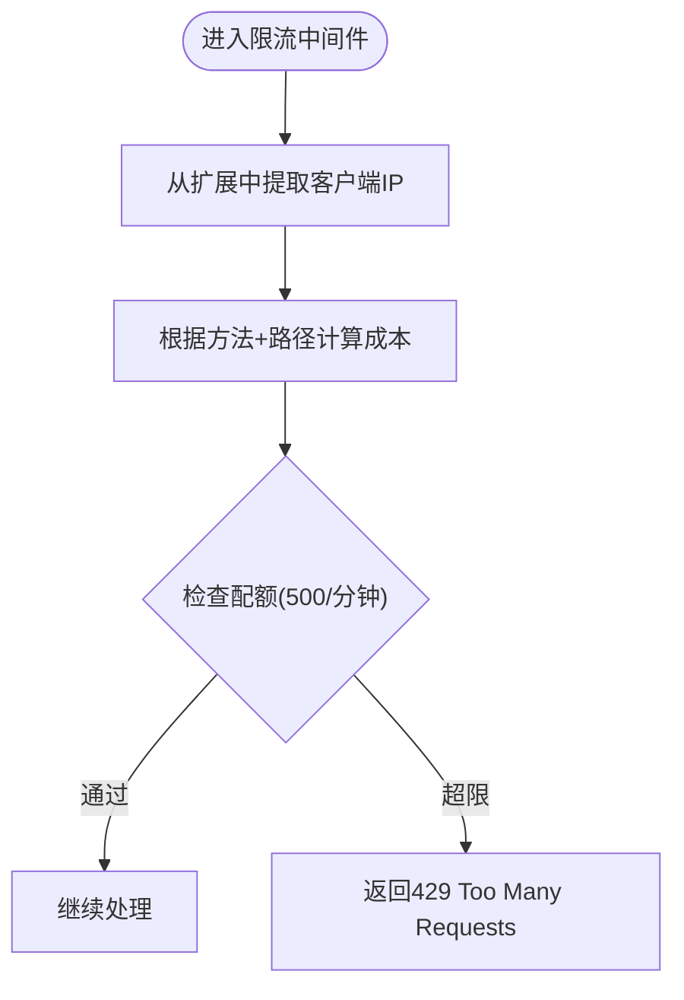
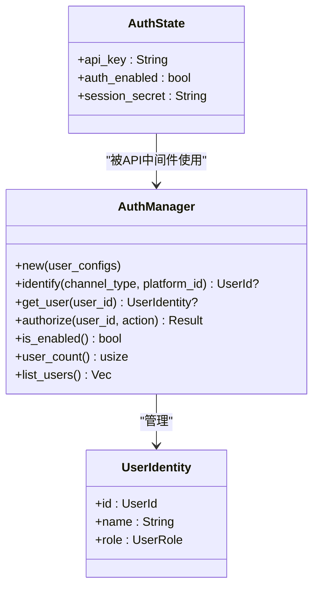
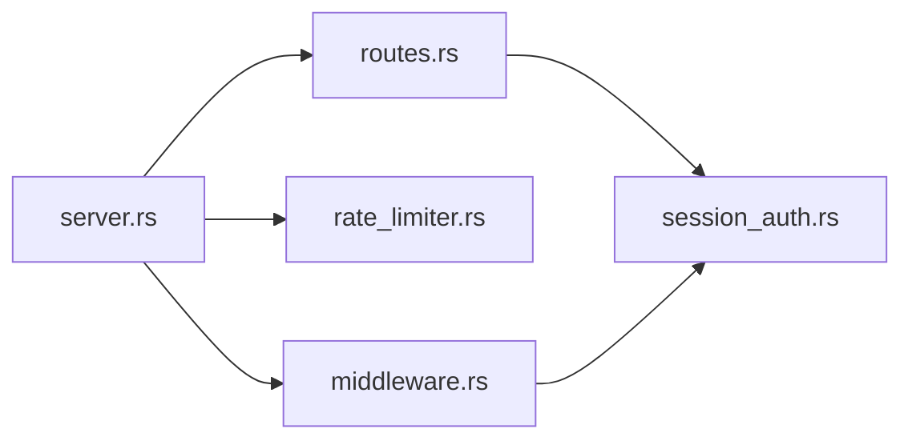

# 认证和中间件

<cite>
**本文档引用的文件**
- [session_auth.rs](file://crates/openfang-api/src/session_auth.rs)
- [middleware.rs](file://crates/openfang-api/src/middleware.rs)
- [rate_limiter.rs](file://crates/openfang-api/src/rate_limiter.rs)
- [server.rs](file://crates/openfang-api/src/server.rs)
- [routes.rs](file://crates/openfang-api/src/routes.rs)
- [lib.rs](file://crates/openfang-api/src/lib.rs)
- [auth.rs](file://crates/openfang-kernel/src/auth.rs)
- [config.rs](file://crates/openfang-kernel/src/config.rs)
- [config.rs（类型定义）](file://crates/openfang-types/src/config.rs)
- [openfang.toml.example](file://openfang.toml.example)
</cite>

## 目录
1. [简介](#简介)
2. [项目结构](#项目结构)
3. [核心组件](#核心组件)
4. [架构总览](#架构总览)
5. [详细组件分析](#详细组件分析)
6. [依赖关系分析](#依赖关系分析)
7. [性能考量](#性能考量)
8. [故障排查指南](#故障排查指南)
9. [结论](#结论)
10. [附录](#附录)

## 简介
本文件面向 OpenFang API 的认证与中间件系统，聚焦以下目标：
- 深入解释 SessionAuth 的会话管理机制、认证令牌处理与权限验证流程
- 详解 Middleware 的请求拦截、日志记录、CORS 处理与请求预处理
- 详述 RateLimiter 的限流策略、IP 白名单、请求频率控制与滥用防护
- 提供认证配置示例、安全最佳实践与访问控制策略
- 解释与内核认证系统的集成方式、会话持久化与安全审计功能

## 项目结构
OpenFang API 的认证与中间件主要分布在 openfang-api 子 crate 中，并与内核认证模块协同工作：
- openfang-api/src/session_auth.rs：无状态会话令牌生成与校验
- openfang-api/src/middleware.rs：认证、日志、安全头与 CORS 预处理
- openfang-api/src/rate_limiter.rs：基于 GCRA 的成本感知限流
- openfang-api/src/server.rs：构建路由与中间件栈，集成 CORS、安全头、限流与认证
- openfang-api/src/routes.rs：登录、登出、会话检查等会话相关端点
- openfang-api/src/lib.rs：模块导出入口
- openfang-kernel/src/auth.rs：内核级 RBAC 权限模型
- openfang-kernel/src/config.rs：配置加载与迁移
- openfang-types/src/config.rs：配置类型定义（含用户与认证相关字段）
- openfang.toml.example：示例配置文件

图表来源
- [server.rs:37-712](file://crates/openfang-api/src/server.rs#L37-L712)
- [middleware.rs:17-259](file://crates/openfang-api/src/middleware.rs#L17-L259)
- [rate_limiter.rs:46-79](file://crates/openfang-api/src/rate_limiter.rs#L46-L79)
- [routes.rs:11069-11191](file://crates/openfang-api/src/routes.rs#L11069-L11191)
- [session_auth.rs:9-72](file://crates/openfang-api/src/session_auth.rs#L9-L72)
- [auth.rs:98-189](file://crates/openfang-kernel/src/auth.rs#L98-L189)
- [config.rs:18-110](file://crates/openfang-kernel/src/config.rs#L18-L110)
- [config.rs（类型定义）:144-158](file://crates/openfang-types/src/config.rs#L144-L158)

章节来源
- [lib.rs:6-17](file://crates/openfang-api/src/lib.rs#L6-L17)
- [server.rs:37-712](file://crates/openfang-api/src/server.rs#L37-L712)

## 核心组件
- 会话令牌（SessionAuth）
  - 使用 HMAC-SHA256 对“用户名+过期时间”进行签名，Base64 编码后作为会话令牌
  - 校验时进行常量时间比较，防止时序攻击；同时检查过期时间
- 认证中间件（Middleware）
  - 支持 Bearer API Key 与 X-API-Key，支持查询参数 token（SSE/EventSource 场景）
  - 公共端点白名单（仅 GET），写操作（POST/PUT/DELETE）默认需认证
  - 支持会话 Cookie（Dashboard 登录态）与环回地址（/api/shutdown）豁免
  - 注入请求 ID 并统一记录结构化日志
- 安全头中间件
  - 统一注入安全响应头（X-Content-Type-Options、X-Frame-Options、X-XSS-Protection、Content-Security-Policy、Referrer-Policy、Cache-Control、Strict-Transport-Security）
- CORS 预处理
  - 未启用 API Key 时，默认允许本地开发来源；启用 API Key 时限制到受信来源
- 限流中间件（GCRA）
  - 基于连接信息提取客户端 IP，按路径与方法计算操作成本，全局 500 tokens/分钟配额
  - 超限时返回 429 并提示 Retry-After

章节来源
- [session_auth.rs:9-72](file://crates/openfang-api/src/session_auth.rs#L9-L72)
- [middleware.rs:17-259](file://crates/openfang-api/src/middleware.rs#L17-L259)
- [rate_limiter.rs:46-79](file://crates/openfang-api/src/rate_limiter.rs#L46-L79)
- [server.rs:56-104](file://crates/openfang-api/src/server.rs#L56-L104)

## 架构总览
下图展示从请求进入至响应返回的关键路径，包括认证、限流、日志与安全头的处理顺序。

图表来源
- [server.rs:696-709](file://crates/openfang-api/src/server.rs#L696-L709)
- [rate_limiter.rs:51-79](file://crates/openfang-api/src/rate_limiter.rs#L51-L79)
- [middleware.rs:62-215](file://crates/openfang-api/src/middleware.rs#L62-L215)
- [routes.rs:11069-11191](file://crates/openfang-api/src/routes.rs#L11069-L11191)
- [session_auth.rs:21-56](file://crates/openfang-api/src/session_auth.rs#L21-L56)

## 详细组件分析

### 会话令牌与登录流程
- 令牌生成
  - 内容格式：Base64("username:expiry:hmac_sha256(username:expiry)")
  - 过期时间由当前时间加小时数换算为秒
- 令牌校验
  - 解码 Base64，拆分三段并校验长度一致后进行常量时间 HMAC 比较
  - 同时检查过期时间是否已到
- 登录与登出
  - 登录成功后设置 HttpOnly、SameSite=Strict 的会话 Cookie，并记录审计日志
  - 登出清除会话 Cookie（Max-Age=0）
- 会话检查
  - 读取 Cookie 并校验，返回当前认证状态与模式

图表来源
- [routes.rs:11069-11132](file://crates/openfang-api/src/routes.rs#L11069-L11132)
- [session_auth.rs:9-18](file://crates/openfang-api/src/session_auth.rs#L9-L18)
- [server.rs:108-118](file://crates/openfang-api/src/server.rs#L108-L118)

章节来源
- [session_auth.rs:9-72](file://crates/openfang-api/src/session_auth.rs#L9-L72)
- [routes.rs:11069-11191](file://crates/openfang-api/src/routes.rs#L11069-L11191)

### 认证中间件与公共端点策略
- 公共端点白名单（仅 GET）
  - 包括健康检查、静态资源、部分只读列表接口、OAuth 授权回调等
- 写操作默认需认证
  - 所有非 GET 的端点（POST/PUT/DELETE）均需认证，防止未授权修改
- 凭据来源
  - Authorization: Bearer <api_key>
  - X-API-Key
  - 查询参数 token=（SSE/EventSource 场景）
- 会话 Cookie 支持
  - 当内核启用认证时，支持 openfang_session Cookie
- 环回豁免
  - /api/shutdown 仅允许本机访问
- 错误处理
  - 提供明确的 WWW-Authenticate: Bearer 与错误消息

图表来源
- [middleware.rs:62-215](file://crates/openfang-api/src/middleware.rs#L62-L215)

章节来源
- [middleware.rs:62-215](file://crates/openfang-api/src/middleware.rs#L62-L215)

### 日志与安全头中间件
- 请求 ID 注入
  - 生成唯一 x-request-id 并注入响应头，同时记录结构化日志（方法、路径、状态、耗时）
- 安全头
  - 统一注入安全响应头，减少常见 Web 攻击面
- CORS
  - 未启用 API Key：默认允许本地开发来源
  - 启用 API Key：限制到受信来源（含监听端口变体）

章节来源
- [middleware.rs:17-44](file://crates/openfang-api/src/middleware.rs#L17-L44)
- [middleware.rs:232-259](file://crates/openfang-api/src/middleware.rs#L232-L259)
- [server.rs:56-104](file://crates/openfang-api/src/server.rs#L56-L104)

### 限流中间件（GCRA）
- 成本感知
  - 不同端点与方法赋予不同 token 成本，如健康检查 1、spawn 50、message 30 等
- 速率配额
  - 全局每 IP 每分钟 500 个 token
- 实现细节
  - 从 ConnectInfo 提取 IP，计算成本后检查配额，超限返回 429 与 Retry-After

图表来源
- [rate_limiter.rs:51-79](file://crates/openfang-api/src/rate_limiter.rs#L51-L79)

章节来源
- [rate_limiter.rs:14-35](file://crates/openfang-api/src/rate_limiter.rs#L14-L35)
- [rate_limiter.rs:40-44](file://crates/openfang-api/src/rate_limiter.rs#L40-L44)
- [rate_limiter.rs:51-79](file://crates/openfang-api/src/rate_limiter.rs#L51-L79)

### 与内核认证系统的集成
- 内核 RBAC
  - 用户角色分级（Viewer/User/Admin/Owner），动作权限映射
  - 通过用户标识执行授权检查
- 集成点
  - API 层通过会话 Cookie 识别用户（当启用认证）
  - 内核侧对用户身份与动作进行细粒度授权
- 会话持久化与审计
  - 登录成功写入会话 Cookie，登出清除
  - 审计日志记录认证尝试与关键操作

图表来源
- [auth.rs:98-189](file://crates/openfang-kernel/src/auth.rs#L98-L189)
- [middleware.rs:47-52](file://crates/openfang-api/src/middleware.rs#L47-L52)

章节来源
- [auth.rs:13-84](file://crates/openfang-kernel/src/auth.rs#L13-L84)
- [auth.rs:98-189](file://crates/openfang-kernel/src/auth.rs#L98-L189)
- [middleware.rs:47-52](file://crates/openfang-api/src/middleware.rs#L47-L52)

## 依赖关系分析
- 模块耦合
  - server.rs 将认证、限流、安全头、日志与 CORS 中间件按顺序装配
  - routes.rs 依赖 session_auth.rs 进行登录/登出/会话检查
  - middleware.rs 依赖 session_auth.rs 进行会话校验
- 外部依赖
  - governor（GCRA 限流）、tower-http（CORS、Trace）、subtle（常量时间比较）、uuid（请求 ID）

图表来源
- [server.rs:696-709](file://crates/openfang-api/src/server.rs#L696-L709)
- [middleware.rs:17-259](file://crates/openfang-api/src/middleware.rs#L17-L259)
- [rate_limiter.rs:46-79](file://crates/openfang-api/src/rate_limiter.rs#L46-L79)
- [routes.rs:11069-11191](file://crates/openfang-api/src/routes.rs#L11069-L11191)
- [session_auth.rs:9-72](file://crates/openfang-api/src/session_auth.rs#L9-L72)

章节来源
- [server.rs:696-709](file://crates/openfang-api/src/server.rs#L696-L709)

## 性能考量
- 限流成本分配
  - 通过差异化成本平衡高开销操作（如 spawn、run、message）与低开销操作（如 health、status）
- 常量时间比较
  - 防止时序攻击的同时避免分支预测优化带来的侧信道风险
- 中间件顺序
  - 限流在前，认证次之，日志与安全头在最后，减少无效处理与日志开销
- CORS 与安全头
  - 一次性注入，避免重复计算

## 故障排查指南
- 401 未授权
  - 检查 Authorization 头或 X-API-Key 是否正确
  - 若使用 SSE/EventSource，确认查询参数 token= 是否正确传递
  - 若启用 Dashboard 会话认证，确认 Cookie openfang_session 是否存在且未过期
- 429 请求过多
  - 检查是否命中特定端点的成本阈值
  - 确认客户端是否在短时间内大量请求
- CORS 跨域失败
  - 未启用 API Key 时，确认来源是否为本地开发地址
  - 启用 API Key 时，确认来源是否在受信列表中
- 审计与日志
  - 查看请求 ID 与日志上下文，定位失败原因
  - 登录失败会记录审计日志，便于追踪

章节来源
- [middleware.rs:200-215](file://crates/openfang-api/src/middleware.rs#L200-L215)
- [rate_limiter.rs:66-76](file://crates/openfang-api/src/rate_limiter.rs#L66-L76)
- [routes.rs:11082-11096](file://crates/openfang-api/src/routes.rs#L11082-L11096)

## 结论
OpenFang API 的认证与中间件体系通过多层防护实现安全与可用性的平衡：
- 会话令牌采用 HMAC-SHA256 与常量时间比较，确保令牌安全性与抗时序攻击
- 认证中间件结合 API Key、查询参数与会话 Cookie，覆盖多种客户端场景
- GCRA 限流按成本精细化控制请求频率，有效防止滥用
- 统一的安全头与 CORS 配置降低常见 Web 风险
- 与内核 RBAC 的配合，使平台具备细粒度的访问控制能力

## 附录

### 认证配置示例与最佳实践
- 示例配置
  - 参考示例配置文件，设置 api_key 以启用 Bearer 认证
  - 如需 Dashboard 会话认证，可在内核配置中启用认证并设置会话参数
- 最佳实践
  - 生产环境务必设置非空 api_key
  - 使用 HTTPS 与严格安全头，避免明文传输
  - 合理设置会话过期时间，平衡用户体验与安全
  - 定期审查公共端点白名单，仅暴露必要接口
  - 启用审计日志，监控异常登录与高风险操作

章节来源
- [openfang.toml.example:5-6](file://openfang.toml.example#L5-L6)
- [server.rs:108-118](file://crates/openfang-api/src/server.rs#L108-L118)
- [routes.rs:11112-11117](file://crates/openfang-api/src/routes.rs#L11112-L11117)