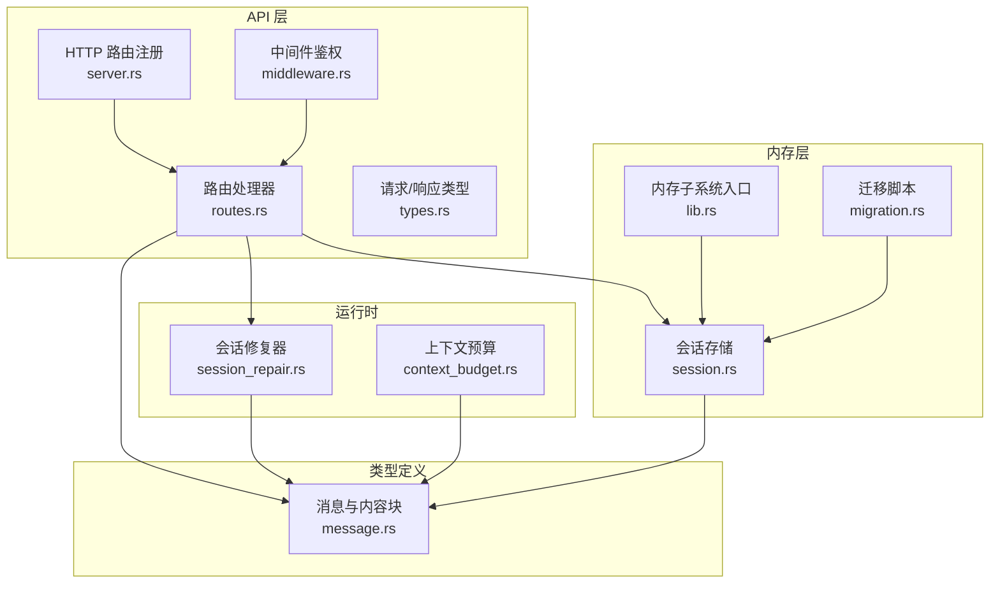
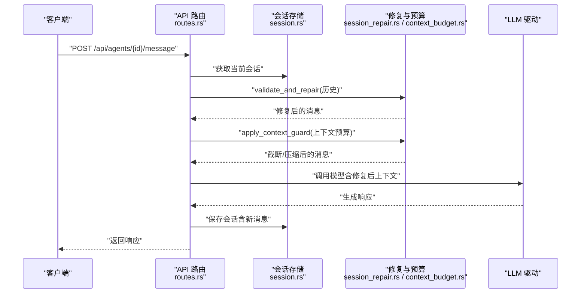
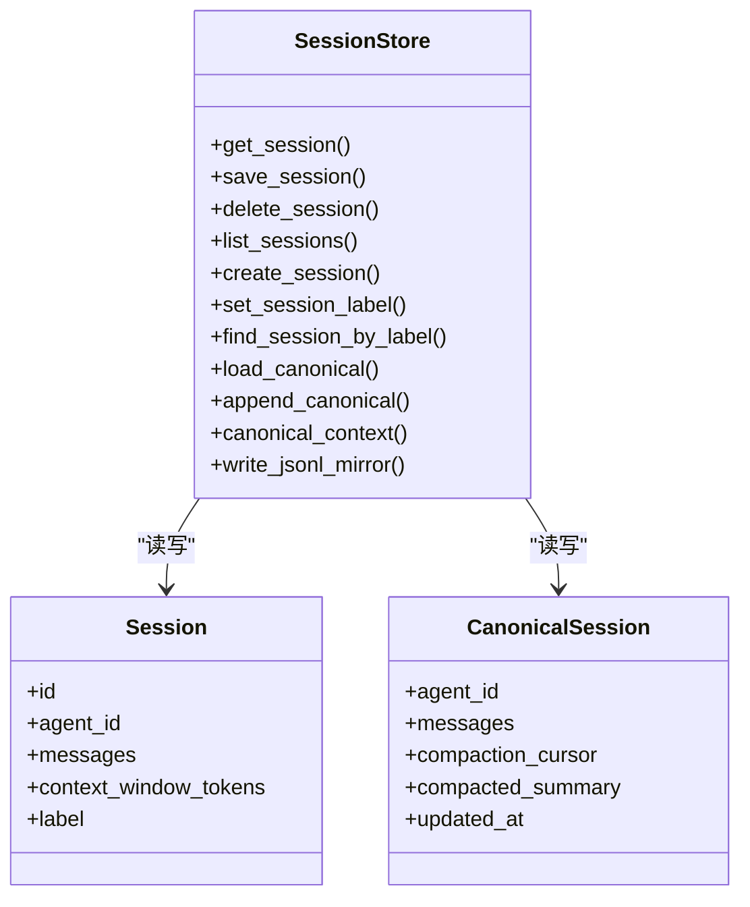
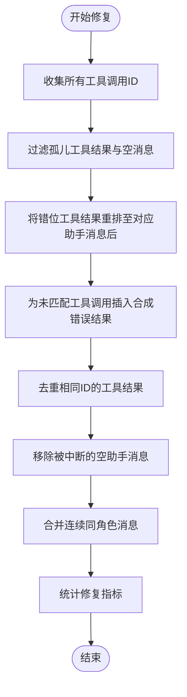
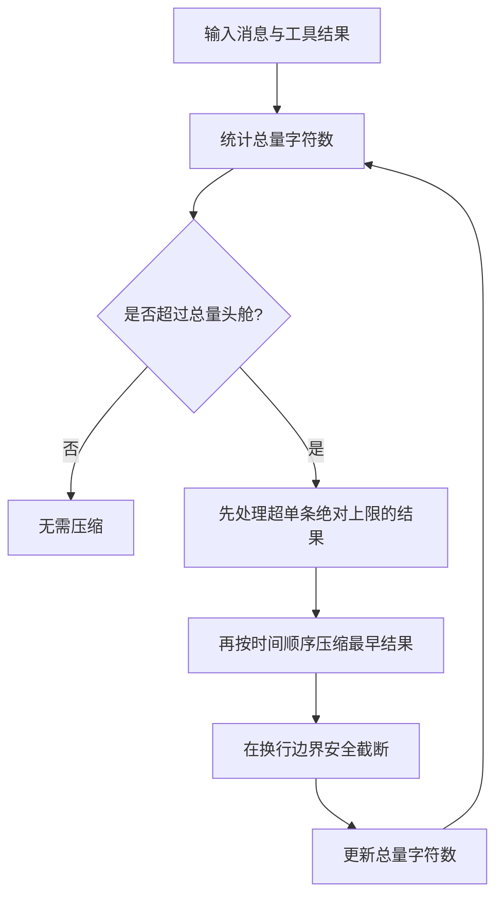
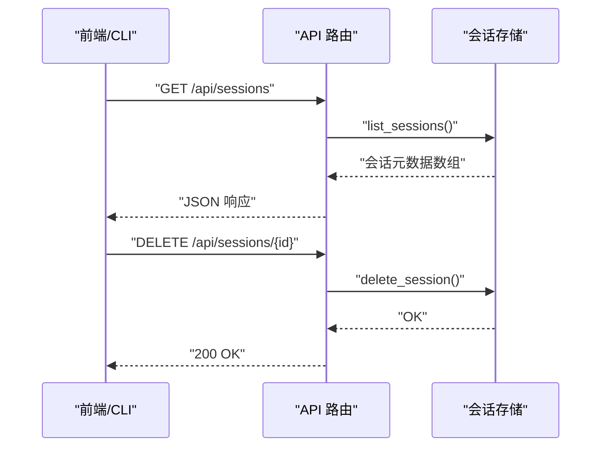
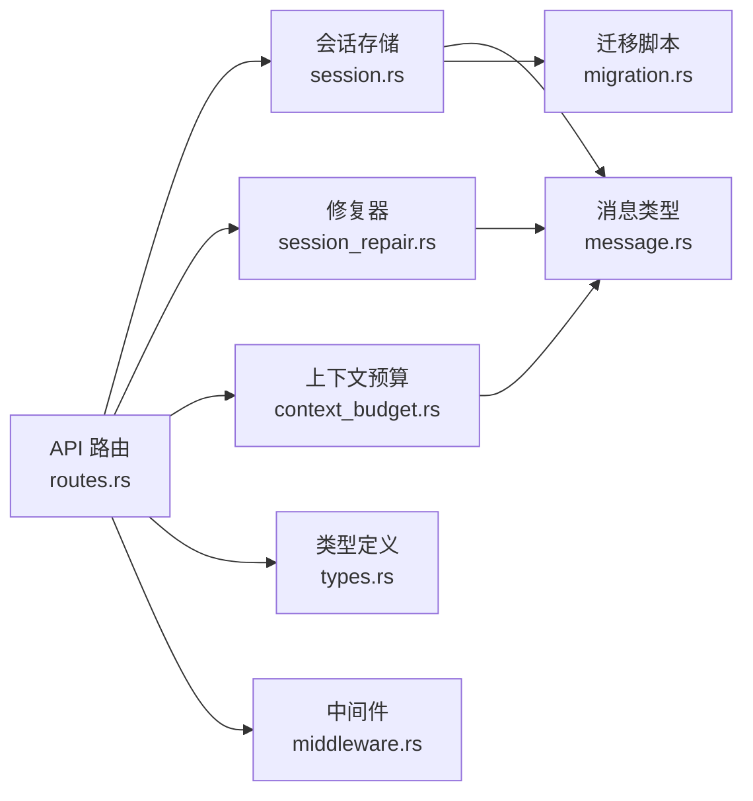

# 会话管理

<cite>
**本文引用的文件**
- [session.rs](file://crates/openfang-memory/src/session.rs)
- [session_repair.rs](file://crates/openfang-runtime/src/session_repair.rs)
- [routes.rs](file://crates/openfang-api/src/routes.rs)
- [server.rs](file://crates/openfang-api/src/server.rs)
- [message.rs](file://crates/openfang-types/src/message.rs)
- [context_budget.rs](file://crates/openfang-runtime/src/context_budget.rs)
- [migration.rs](file://crates/openfang-memory/src/migration.rs)
- [lib.rs](file://crates/openfang-memory/src/lib.rs)
- [types.rs](file://crates/openfang-api/src/types.rs)
- [middleware.rs](file://crates/openfang-api/src/middleware.rs)
- [sessions.js](file://crates/openfang-api/static/js/pages/sessions.js)
- [event.rs](file://crates/openfang-cli/src/tui/event.rs)
</cite>

## 目录
1. [简介](#简介)
2. [项目结构](#项目结构)
3. [核心组件](#核心组件)
4. [架构总览](#架构总览)
5. [详细组件分析](#详细组件分析)
6. [依赖关系分析](#依赖关系分析)
7. [性能考量](#性能考量)
8. [故障排查指南](#故障排查指南)
9. [结论](#结论)
10. [附录](#附录)

## 简介
本文件系统性阐述 OpenFang 的会话管理模块，覆盖对话历史存储结构、上下文窗口管理、会话状态跟踪、消息序列化格式、时间戳管理、会话清理策略、会话查询示例、上下文截断算法、历史回放功能，以及与智能体执行循环的集成方式与会话持久化/恢复机制。目标是帮助开发者与运维人员快速理解并正确使用会话管理能力。

## 项目结构
会话管理由“内存层（openfang-memory）+ 运行时修复（openfang-runtime）+ API 层（openfang-api）+ 类型定义（openfang-types）”协同实现：
- 内存层：负责会话与跨通道会话的持久化、列表、标签、镜像导出等。
- 运行时修复：负责会话历史校验与修复（工具调用对齐、重复结果去重、空消息清理、连续角色合并等）。
- API 层：提供会话查询、删除、标签设置、按标签查找等 HTTP 接口，并在消息发送路径中注入附件与会话镜像。
- 类型定义：统一消息结构、内容块、角色、令牌用量等数据模型。

图表来源
- [routes.rs:5460-5550](file://crates/openfang-api/src/routes.rs#L5460-L5550)
- [server.rs:500-513](file://crates/openfang-api/src/server.rs#L500-L513)
- [session.rs:1-120](file://crates/openfang-memory/src/session.rs#L1-L120)
- [session_repair.rs:35-178](file://crates/openfang-runtime/src/session_repair.rs#L35-L178)
- [context_budget.rs:1-120](file://crates/openfang-runtime/src/context_budget.rs#L1-L120)
- [migration.rs:74-186](file://crates/openfang-memory/src/migration.rs#L74-L186)
- [lib.rs:1-20](file://crates/openfang-memory/src/lib.rs#L1-L20)
- [message.rs:1-120](file://crates/openfang-types/src/message.rs#L1-L120)

章节来源
- [routes.rs:5460-5550](file://crates/openfang-api/src/routes.rs#L5460-L5550)
- [server.rs:500-513](file://crates/openfang-api/src/server.rs#L500-L513)
- [session.rs:1-120](file://crates/openfang-memory/src/session.rs#L1-L120)
- [session_repair.rs:35-178](file://crates/openfang-runtime/src/session_repair.rs#L35-L178)
- [context_budget.rs:1-120](file://crates/openfang-runtime/src/context_budget.rs#L1-L120)
- [migration.rs:74-186](file://crates/openfang-memory/src/migration.rs#L74-L186)
- [lib.rs:1-20](file://crates/openfang-memory/src/lib.rs#L1-L20)
- [message.rs:1-120](file://crates/openfang-types/src/message.rs#L1-L120)

## 核心组件
- 会话存储（SessionStore）
  - 提供会话的创建、保存、加载、删除、列表、标签设置、按标签查找等操作；支持 JSONL 镜像导出。
  - 支持“规范会话（CanonicalSession）”用于跨渠道持久化上下文，具备压缩阈值、最近窗口、摘要记录与游标。
- 会话修复器（validate_and_repair）
  - 对消息历史进行验证与修复：移除孤儿工具结果、重组错位工具结果、插入缺失结果、去重、合并连续同角色消息、移除空消息与中断助手消息等。
- 上下文预算（ContextBudget）
  - 基于上下文窗口动态计算单条工具结果上限与总量头舱，提供两层截断策略：单条结果截断与历史最早结果压缩。
- 消息与内容块（Message/ContentBlock）
  - 统一的消息结构，支持文本、图片、工具调用、工具结果、思考块等；提供文本提取、长度统计等辅助方法。
- API 路由与中间件
  - 提供会话列表、删除、标签设置、按标签查找等接口；会话查询接口返回可直接渲染的历史；中间件支持鉴权与只读访问控制。

章节来源
- [session.rs:27-260](file://crates/openfang-memory/src/session.rs#L27-L260)
- [session_repair.rs:35-178](file://crates/openfang-runtime/src/session_repair.rs#L35-L178)
- [context_budget.rs:12-120](file://crates/openfang-runtime/src/context_budget.rs#L12-L120)
- [message.rs:5-120](file://crates/openfang-types/src/message.rs#L5-L120)
- [routes.rs:5460-5550](file://crates/openfang-api/src/routes.rs#L5460-L5550)
- [middleware.rs:107-130](file://crates/openfang-api/src/middleware.rs#L107-L130)

## 架构总览
会话管理贯穿“请求进入—消息发送—历史修复—上下文截断—LLM 调用—响应输出—历史保存”的执行循环。API 层负责会话查询与管理，内存层负责持久化，运行时负责历史修复与上下文预算，类型层提供统一的数据模型。

图表来源
- [routes.rs:328-428](file://crates/openfang-api/src/routes.rs#L328-L428)
- [session.rs:39-101](file://crates/openfang-memory/src/session.rs#L39-L101)
- [session_repair.rs:35-178](file://crates/openfang-runtime/src/session_repair.rs#L35-L178)
- [context_budget.rs:96-198](file://crates/openfang-runtime/src/context_budget.rs#L96-L198)

## 详细组件分析

### 会话存储与跨渠道上下文
- 数据结构
  - 会话（Session）：包含会话 ID、所属智能体 ID、消息列表、上下文窗口估算、可选标签。
  - 规范会话（CanonicalSession）：跨渠道持久化上下文，包含完整历史、压缩游标、压缩摘要、更新时间。
- 存储与查询
  - 使用 SQLite 表 sessions 与 canonical_sessions 存储序列化后的消息与元数据。
  - 支持按标签查找、按智能体列出、创建带标签会话、写入 JSONL 镜像等。
- 压缩与摘要
  - 当消息数量超过阈值（默认 100），保留最近窗口（默认 50）并生成摘要，持续压缩旧消息以控制大小。
- 时间戳与更新
  - 所有写入操作更新 updated_at 字段，便于排序与审计。

图表来源
- [session.rs:12-260](file://crates/openfang-memory/src/session.rs#L12-L260)

章节来源
- [session.rs:12-260](file://crates/openfang-memory/src/session.rs#L12-L260)
- [migration.rs:254-271](file://crates/openfang-memory/src/migration.rs#L254-L271)

### 会话修复与历史回放
- 修复策略
  - 移除孤儿工具结果、重组错位工具结果、插入缺失结果、去重、合并连续同角色消息、移除空消息与中断助手消息。
- 安全与合规
  - 工具结果内容清洗：限制最大长度、去除长串 base64、移除提示注入标记等。
- 历史回放
  - 通过 canonical_context 获取最近消息与可选摘要，作为上下文注入到后续调用。

图表来源
- [session_repair.rs:35-178](file://crates/openfang-runtime/src/session_repair.rs#L35-L178)

章节来源
- [session_repair.rs:35-178](file://crates/openfang-runtime/src/session_repair.rs#L35-L178)
- [session_repair.rs:503-612](file://crates/openfang-runtime/src/session_repair.rs#L503-L612)

### 上下文预算与截断算法
- 动态预算
  - 单条结果上限：上下文窗口的 30% 转换为字符数。
  - 单条绝对上限：上下文窗口的 50%。
  - 总量头舱：上下文窗口的 75%。
- 截断策略
  - 单条结果：在换行边界安全截断，避免字节切分。
  - 历史压缩：当总量超头舱时，优先压缩最早结果，逐步降低到目标大小。
- 多语言与多字节安全
  - 在 UTF-8 边界上进行截断，确保不破坏字符完整性。

图表来源
- [context_budget.rs:96-198](file://crates/openfang-runtime/src/context_budget.rs#L96-L198)

章节来源
- [context_budget.rs:12-120](file://crates/openfang-runtime/src/context_budget.rs#L12-L120)
- [context_budget.rs:58-94](file://crates/openfang-runtime/src/context_budget.rs#L58-L94)

### 消息序列化格式与时间戳
- 序列化
  - 会话消息采用二进制消息包（MessagePack）序列化，存储在 SQLite 的 BLOB 字段中，保证高效与紧凑。
  - JSONL 镜像导出为人类可读格式，包含时间戳、角色、内容与工具使用/结果信息。
- 时间戳
  - 写入与更新均记录 RFC3339 时间字符串，便于排序与审计。
- 内容块
  - 支持文本、图片、工具调用、工具结果、思考等，提供文本提取与长度统计。

章节来源
- [session.rs:40-101](file://crates/openfang-memory/src/session.rs#L40-L101)
- [session.rs:518-618](file://crates/openfang-memory/src/session.rs#L518-L618)
- [message.rs:26-96](file://crates/openfang-types/src/message.rs#L26-L96)

### 会话查询与管理 API
- 列表与删除
  - GET /api/sessions：列出所有会话元数据（会话ID、智能体ID、消息数、创建时间、标签）。
  - DELETE /api/sessions/{id}：删除指定会话。
- 标签管理
  - PUT /api/sessions/{id}/label：设置会话标签。
  - GET /api/agents/{id}/sessions/by-label/{label}：按标签查找会话（按智能体作用域）。
- 会话详情
  - GET /api/agents/{id}/session：返回会话消息列表（含工具结果预览与图片上传镜像）。

图表来源
- [routes.rs:5460-5550](file://crates/openfang-api/src/routes.rs#L5460-L5550)
- [server.rs:500-513](file://crates/openfang-api/src/server.rs#L500-L513)
- [sessions.js:24-54](file://crates/openfang-api/static/js/pages/sessions.js#L24-L54)
- [event.rs:1226-1282](file://crates/openfang-cli/src/tui/event.rs#L1226-L1282)

章节来源
- [routes.rs:5460-5550](file://crates/openfang-api/src/routes.rs#L5460-L5550)
- [server.rs:500-513](file://crates/openfang-api/src/server.rs#L500-L513)
- [types.rs:28-51](file://crates/openfang-api/src/types.rs#L28-L51)
- [sessions.js:24-54](file://crates/openfang-api/static/js/pages/sessions.js#L24-L54)
- [event.rs:1226-1282](file://crates/openfang-cli/src/tui/event.rs#L1226-L1282)

### 与智能体执行循环的集成
- 附件注入
  - 在发送消息前，将上传的图片转换为内容块并注入到会话中，确保模型在当前轮次即可看到图片。
- 历史修复与预算
  - 发送消息前对历史进行修复与上下文预算应用，确保 LLM 输入合法且可控。
- 会话持久化与恢复
  - 每次交互后保存会话，支持跨通道恢复一致上下文；规范会话用于跨渠道记忆。

章节来源
- [routes.rs:291-326](file://crates/openfang-api/src/routes.rs#L291-L326)
- [session_repair.rs:35-178](file://crates/openfang-runtime/src/session_repair.rs#L35-L178)
- [context_budget.rs:96-198](file://crates/openfang-runtime/src/context_budget.rs#L96-L198)
- [session.rs:410-491](file://crates/openfang-memory/src/session.rs#L410-L491)

## 依赖关系分析
- 组件耦合
  - API 层依赖内存层与运行时修复/预算模块；内存层依赖类型定义与迁移脚本；运行时模块依赖类型定义。
- 外部依赖
  - SQLite（rusqlite）用于持久化；MessagePack（rmp-serde）用于高效序列化；前端静态资源与 CLI 事件驱动会话管理。

图表来源
- [routes.rs:5460-5550](file://crates/openfang-api/src/routes.rs#L5460-L5550)
- [session.rs:1-120](file://crates/openfang-memory/src/session.rs#L1-L120)
- [session_repair.rs:35-178](file://crates/openfang-runtime/src/session_repair.rs#L35-L178)
- [context_budget.rs:1-120](file://crates/openfang-runtime/src/context_budget.rs#L1-L120)
- [message.rs:1-120](file://crates/openfang-types/src/message.rs#L1-L120)
- [migration.rs:74-186](file://crates/openfang-memory/src/migration.rs#L74-L186)
- [types.rs:1-94](file://crates/openfang-api/src/types.rs#L1-L94)
- [middleware.rs:107-130](file://crates/openfang-api/src/middleware.rs#L107-L130)

章节来源
- [lib.rs:1-20](file://crates/openfang-memory/src/lib.rs#L1-L20)
- [routes.rs:5460-5550](file://crates/openfang-api/src/routes.rs#L5460-L5550)

## 性能考量
- 序列化与存储
  - 使用 MessagePack 与 SQLite BLOB 存储，减少 IO 与解析开销；JSONL 镜像为最佳努力，不影响主存储。
- 历史压缩
  - 规范会话压缩阈值与最近窗口，避免历史无限增长；上下文预算在调用前进行扫描与压缩，降低 LLM 负载。
- 并发与锁
  - 内存层使用互斥锁保护数据库连接，避免并发写冲突；建议在高并发场景下合理拆分会话或引入外部缓存。
- 图片与工具结果
  - 图片解码与 base64 大小限制在类型层定义；工具结果内容清洗与截断避免恶意或过大数据回灌。

## 故障排查指南
- 会话为空或缺失
  - 检查会话 ID 是否正确、是否存在；可通过按标签查找辅助定位。
- 工具调用错配
  - 修复器会自动重排与插入缺失结果；若仍异常，检查工具调用 ID 是否一致。
- 上下文过大
  - 启用上下文预算，确认已触发压缩；必要时降低模型上下文窗口或减少历史长度。
- 删除失败
  - 确认权限与鉴权配置；检查中间件是否允许该端点访问。
- 前端/CLI 不可用
  - 在进程内模式下，会话管理接口不可用；切换到守护进程模式或使用 API 直连。

章节来源
- [session_repair.rs:35-178](file://crates/openfang-runtime/src/session_repair.rs#L35-L178)
- [context_budget.rs:96-198](file://crates/openfang-runtime/src/context_budget.rs#L96-L198)
- [middleware.rs:107-130](file://crates/openfang-api/src/middleware.rs#L107-L130)
- [event.rs:1257-1282](file://crates/openfang-cli/src/tui/event.rs#L1257-L1282)

## 结论
OpenFang 的会话管理模块通过“内存层持久化 + 运行时修复与预算 + API 管理 + 统一类型模型”的设计，实现了稳定、可扩展、可审计的对话历史管理。其跨渠道规范会话、动态上下文预算与历史修复机制，有效保障了智能体执行循环的可靠性与安全性。

## 附录
- 会话查询示例
  - 列出所有会话：GET /api/sessions
  - 删除指定会话：DELETE /api/sessions/{id}
  - 设置会话标签：PUT /api/sessions/{id}/label
  - 按标签查找会话：GET /api/agents/{id}/sessions/by-label/{label}
- 会话清理策略
  - 按标签/智能体维度清理；规范会话定期压缩；JSONL 镜像仅作审计与调试用途。
- 历史回放
  - 使用 canonical_context 获取最近消息与摘要，作为后续调用的上下文。

章节来源
- [routes.rs:5460-5550](file://crates/openfang-api/src/routes.rs#L5460-L5550)
- [session.rs:477-491](file://crates/openfang-memory/src/session.rs#L477-L491)
- [sessions.js:24-54](file://crates/openfang-api/static/js/pages/sessions.js#L24-L54)