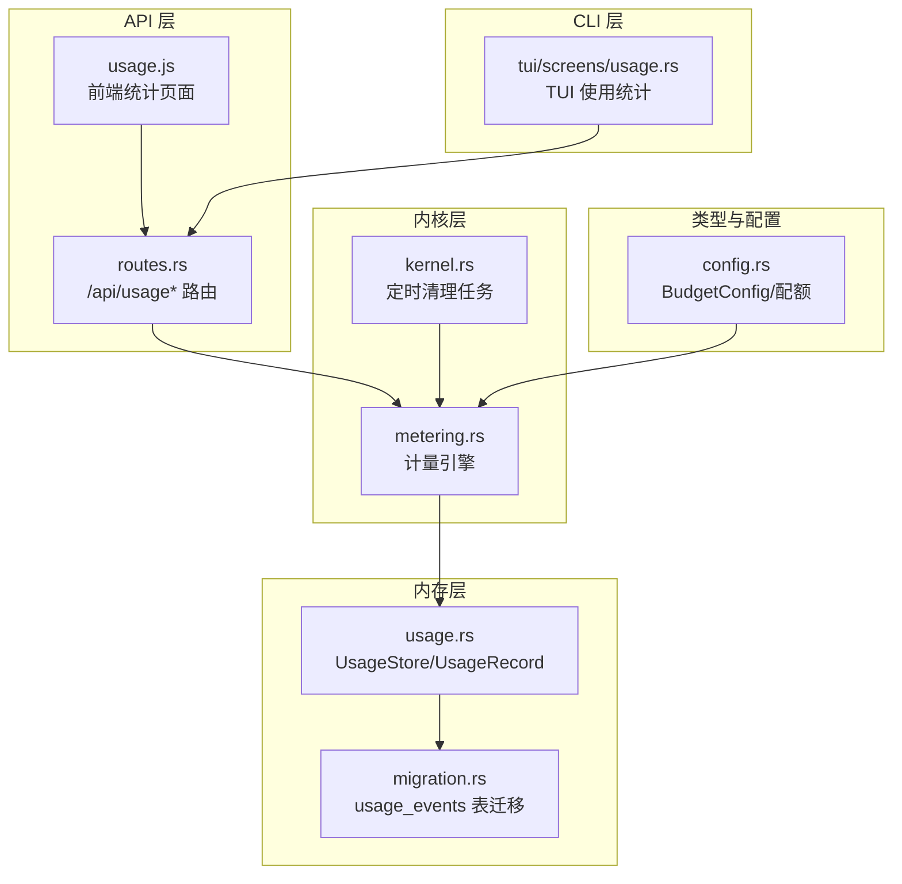
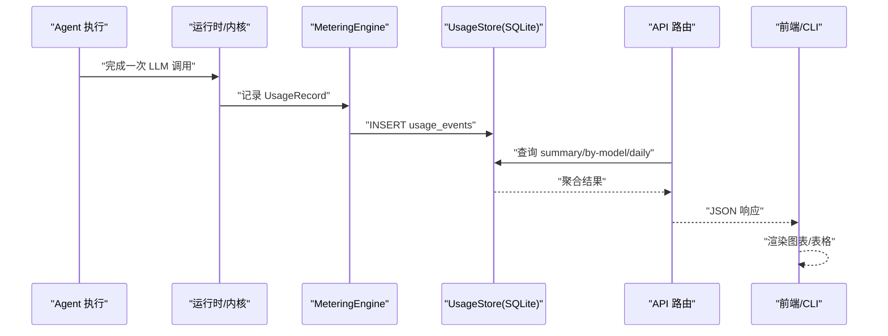
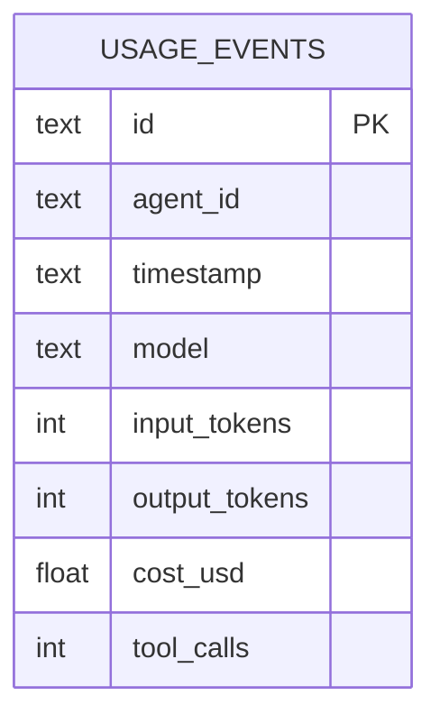
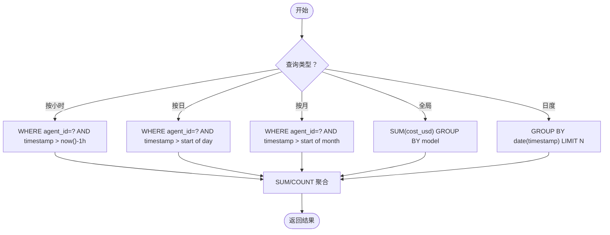
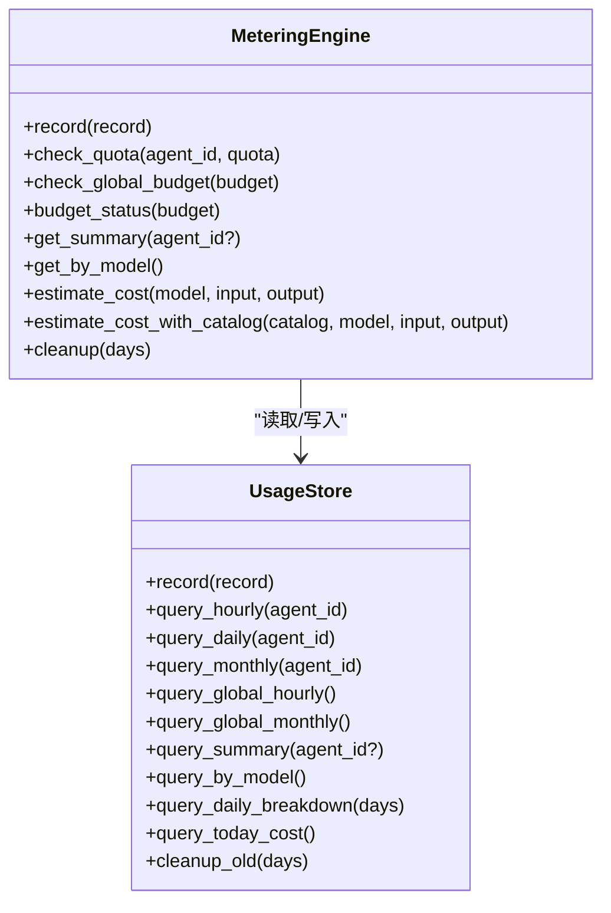
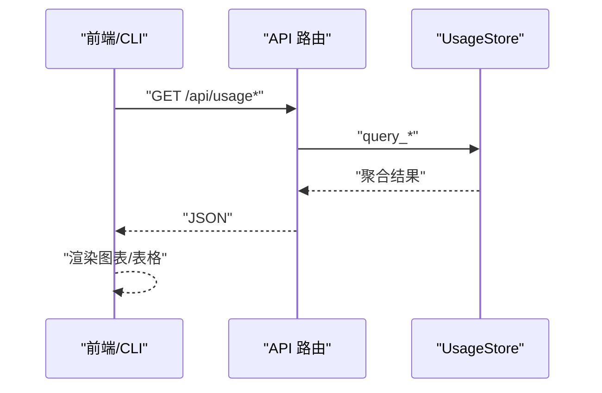
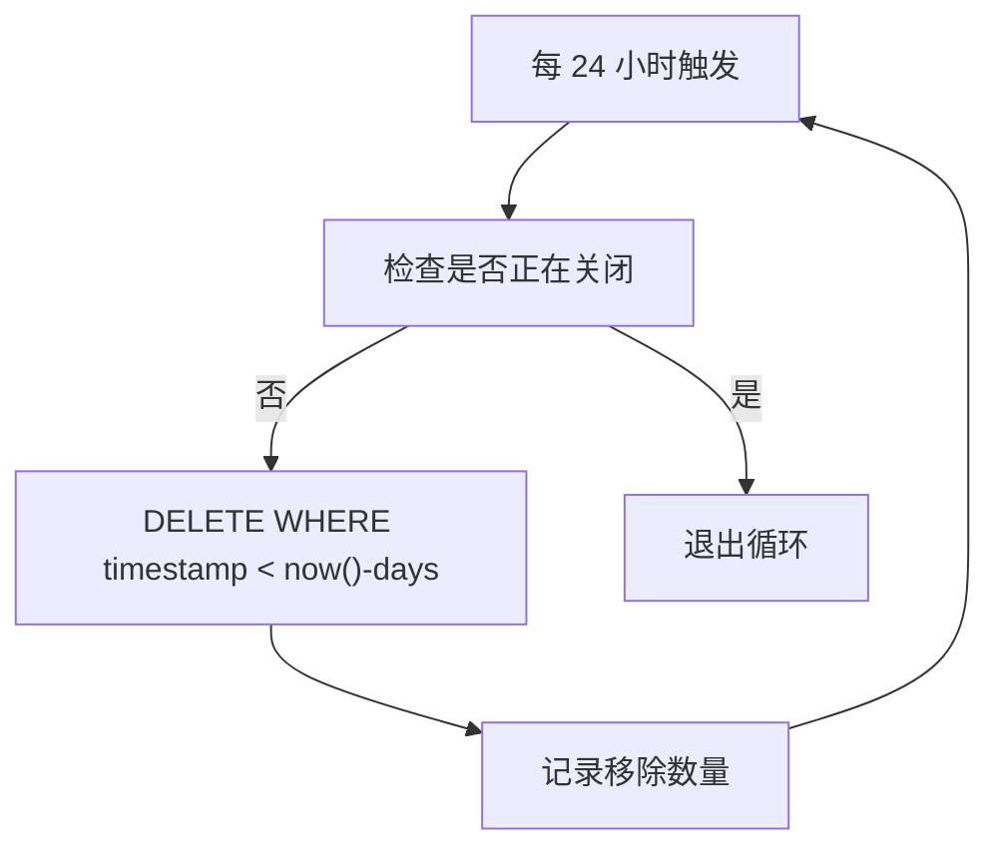
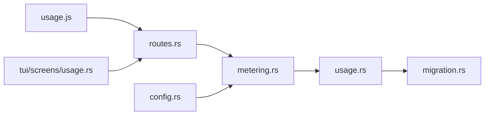

# 使用统计

<cite>
**本文档引用的文件**
- [crates/openfang-memory/src/usage.rs](file://crates/openfang-memory/src/usage.rs)
- [crates/openfang-kernel/src/metering.rs](file://crates/openfang-kernel/src/metering.rs)
- [crates/openfang-api/src/routes.rs](file://crates/openfang-api/src/routes.rs)
- [crates/openfang-api/static/js/pages/usage.js](file://crates/openfang-api/static/js/pages/usage.js)
- [crates/openfang-cli/src/tui/screens/usage.rs](file://crates/openfang-cli/src/tui/screens/usage.rs)
- [crates/openfang-memory/src/migration.rs](file://crates/openfang-memory/src/migration.rs)
- [crates/openfang-types/src/config.rs](file://crates/openfang-types/src/config.rs)
- [crates/openfang-kernel/src/kernel.rs](file://crates/openfang-kernel/src/kernel.rs)
</cite>

## 目录
1. [简介](#简介)
2. [项目结构](#项目结构)
3. [核心组件](#核心组件)
4. [架构总览](#架构总览)
5. [详细组件分析](#详细组件分析)
6. [依赖关系分析](#依赖关系分析)
7. [性能考虑](#性能考虑)
8. [故障排查指南](#故障排查指南)
9. [结论](#结论)
10. [附录](#附录)

## 简介
本文件为 OpenFang 使用统计模块的技术文档，聚焦于内存使用量跟踪、访问频率统计与性能指标采集。内容涵盖：
- 统计数据的存储格式与索引设计
- 聚合算法与趋势分析方法
- 查询接口与前端展示
- 预算与配额控制（全局与按代理）
- 容量规划建议与告警机制配置
- 与计量系统的集成方式

## 项目结构
使用统计相关代码主要分布在以下模块：
- 内存层：SQLite 表结构与查询封装
- 核心层：计量引擎与预算检查
- API 层：HTTP 接口与前端页面
- CLI 层：TUI 使用统计界面
- 类型与配置：预算阈值与限额定义

**图表来源**
- [crates/openfang-api/src/routes.rs:5167-5261](file://crates/openfang-api/src/routes.rs#L5167-L5261)
- [crates/openfang-kernel/src/metering.rs:1-213](file://crates/openfang-kernel/src/metering.rs#L1-L213)
- [crates/openfang-memory/src/usage.rs:71-352](file://crates/openfang-memory/src/usage.rs#L71-L352)
- [crates/openfang-memory/src/migration.rs:230-252](file://crates/openfang-memory/src/migration.rs#L230-L252)
- [crates/openfang-kernel/src/kernel.rs:3941-3963](file://crates/openfang-kernel/src/kernel.rs#L3941-L3963)
- [crates/openfang-types/src/config.rs:1151-1181](file://crates/openfang-types/src/config.rs#L1151-L1181)

**章节来源**
- [crates/openfang-api/src/routes.rs:5167-5261](file://crates/openfang-api/src/routes.rs#L5167-L5261)
- [crates/openfang-kernel/src/metering.rs:1-213](file://crates/openfang-kernel/src/metering.rs#L1-L213)
- [crates/openfang-memory/src/usage.rs:71-352](file://crates/openfang-memory/src/usage.rs#L71-L352)
- [crates/openfang-memory/src/migration.rs:230-252](file://crates/openfang-memory/src/migration.rs#L230-L252)
- [crates/openfang-kernel/src/kernel.rs:3941-3963](file://crates/openfang-kernel/src/kernel.rs#L3941-L3963)
- [crates/openfang-types/src/config.rs:1151-1181](file://crates/openfang-types/src/config.rs#L1151-L1181)

## 核心组件
- UsageStore：基于 SQLite 的使用事件持久化与查询封装，提供按小时/日/月/全局的聚合查询。
- MeteringEngine：计量引擎，负责记录使用事件、计算成本、检查配额与预算，并生成预算状态。
- API 路由：提供 /api/usage、/api/usage/summary、/api/usage/by-model、/api/usage/daily 等端点。
- 前端页面：usage.js 实现成本仪表盘、分组统计与趋势分析。
- CLI TUI：tui/screens/usage.rs 提供命令行界面的使用统计视图。
- 配置与预算：BudgetConfig 定义全局预算上限与告警阈值。

**章节来源**
- [crates/openfang-memory/src/usage.rs:71-352](file://crates/openfang-memory/src/usage.rs#L71-L352)
- [crates/openfang-kernel/src/metering.rs:1-213](file://crates/openfang-kernel/src/metering.rs#L1-L213)
- [crates/openfang-api/src/routes.rs:5167-5261](file://crates/openfang-api/src/routes.rs#L5167-L5261)
- [crates/openfang-api/static/js/pages/usage.js:1-252](file://crates/openfang-api/static/js/pages/usage.js#L1-L252)
- [crates/openfang-cli/src/tui/screens/usage.rs:1-448](file://crates/openfang-cli/src/tui/screens/usage.rs#L1-L448)
- [crates/openfang-types/src/config.rs:1151-1181](file://crates/openfang-types/src/config.rs#L1151-L1181)

## 架构总览
使用统计从“调用完成”到“可视化”的完整链路如下：

**图表来源**
- [crates/openfang-kernel/src/metering.rs:20-23](file://crates/openfang-kernel/src/metering.rs#L20-L23)
- [crates/openfang-memory/src/usage.rs:82-106](file://crates/openfang-memory/src/usage.rs#L82-L106)
- [crates/openfang-api/src/routes.rs:5167-5261](file://crates/openfang-api/src/routes.rs#L5167-L5261)

## 详细组件分析

### 数据模型与存储
- 表结构：usage_events（主键 id，agent_id，timestamp，model，input_tokens，output_tokens，cost_usd，tool_calls），并建立索引以加速按 agent+时间与时间范围查询。
- 记录结构：UsageRecord 包含 agent_id、model、输入/输出 token 数、估算成本、工具调用次数等字段。
- 存储格式：SQLite（rusqlite）；通过 UsageStore 封装插入与查询。

**图表来源**
- [crates/openfang-memory/src/migration.rs:230-252](file://crates/openfang-memory/src/migration.rs#L230-L252)

**章节来源**
- [crates/openfang-memory/src/migration.rs:230-252](file://crates/openfang-memory/src/migration.rs#L230-L252)
- [crates/openfang-memory/src/usage.rs:10-25](file://crates/openfang-memory/src/usage.rs#L10-L25)

### 聚合与查询
- 按小时/日/月/全局成本查询：基于 SQL SUM/COUNT/GROUP BY 实现，支持按 agent 过滤或全局汇总。
- 按模型分组：按 model 聚合成本、token 与调用次数，用于供应商与模型维度分析。
- 日度分解：最近 N 天的成本、token 与调用次数，用于趋势分析。
- 其他：最早事件时间、今日总成本等辅助指标。

**图表来源**
- [crates/openfang-memory/src/usage.rs:108-334](file://crates/openfang-memory/src/usage.rs#L108-L334)

**章节来源**
- [crates/openfang-memory/src/usage.rs:108-334](file://crates/openfang-memory/src/usage.rs#L108-L334)

### 计量引擎与预算控制
- 成本估算：内置模型定价表或通过模型目录动态定价，估算单次调用成本。
- 预算检查：对每小时/日/月进行全局与按代理检查，超过阈值返回配额超限错误。
- 预算状态：返回当前花费与百分比、告警阈值、默认每代理每小时 token 限额等。

**图表来源**
- [crates/openfang-kernel/src/metering.rs:1-213](file://crates/openfang-kernel/src/metering.rs#L1-L213)
- [crates/openfang-memory/src/usage.rs:71-352](file://crates/openfang-memory/src/usage.rs#L71-L352)

**章节来源**
- [crates/openfang-kernel/src/metering.rs:25-133](file://crates/openfang-kernel/src/metering.rs#L25-L133)
- [crates/openfang-types/src/config.rs:1151-1181](file://crates/openfang-types/src/config.rs#L1151-L1181)

### API 与前端集成
- 路由端点：
  - GET /api/usage：按代理统计 token 与工具调用
  - GET /api/usage/summary：总体摘要（输入/输出 token、总成本、调用次数、工具调用总数）
  - GET /api/usage/by-model：按模型分组的成本与用量
  - GET /api/usage/daily：最近 N 天的日度成本、token 与调用次数
  - GET/PUT /api/budget：预算状态与更新
- 前端页面（usage.js）：
  - 并行加载摘要、按模型、按代理与日度数据
  - 提供平均成本、每日成本、供应商聚合、模型成本条形图等
- CLI TUI（tui/screens/usage.rs）：
  - 支持切换“总览/按模型/按代理”视图，刷新与键盘导航

**图表来源**
- [crates/openfang-api/src/routes.rs:5167-5261](file://crates/openfang-api/src/routes.rs#L5167-L5261)
- [crates/openfang-api/static/js/pages/usage.js:26-78](file://crates/openfang-api/static/js/pages/usage.js#L26-L78)
- [crates/openfang-cli/src/tui/screens/usage.rs:65-155](file://crates/openfang-cli/src/tui/screens/usage.rs#L65-L155)

**章节来源**
- [crates/openfang-api/src/routes.rs:5167-5261](file://crates/openfang-api/src/routes.rs#L5167-L5261)
- [crates/openfang-api/static/js/pages/usage.js:1-252](file://crates/openfang-api/static/js/pages/usage.js#L1-L252)
- [crates/openfang-cli/src/tui/screens/usage.rs:1-448](file://crates/openfang-cli/src/tui/screens/usage.rs#L1-L448)

### 清理与容量规划
- 定期清理：内核启动后每 24 小时执行一次清理，删除 90 天前的使用事件，避免数据库膨胀。
- 建议：
  - 根据业务规模设置合理的保留周期（如 90/180 天）
  - 监控 SQLite 文件大小与查询性能，必要时拆分或迁移至更合适的存储
  - 对高频查询建立合适索引（已存在按 agent+timestamp 与 timestamp）

**图表来源**
- [crates/openfang-kernel/src/kernel.rs:3941-3963](file://crates/openfang-kernel/src/kernel.rs#L3941-L3963)

**章节来源**
- [crates/openfang-kernel/src/kernel.rs:3941-3963](file://crates/openfang-kernel/src/kernel.rs#L3941-L3963)

## 依赖关系分析
- UsageStore 依赖 SQLite 连接与 rusqlite
- MeteringEngine 依赖 UsageStore 与配置中的预算参数
- API 路由依赖内核提供的内存子系统与计量引擎
- 前端依赖 API 返回的标准化 JSON 结构
- CLI TUI 依赖 API 或本地客户端请求

**图表来源**
- [crates/openfang-api/src/routes.rs:5167-5261](file://crates/openfang-api/src/routes.rs#L5167-L5261)
- [crates/openfang-kernel/src/metering.rs:1-213](file://crates/openfang-kernel/src/metering.rs#L1-L213)
- [crates/openfang-memory/src/usage.rs:71-352](file://crates/openfang-memory/src/usage.rs#L71-L352)
- [crates/openfang-memory/src/migration.rs:230-252](file://crates/openfang-memory/src/migration.rs#L230-L252)
- [crates/openfang-types/src/config.rs:1151-1181](file://crates/openfang-types/src/config.rs#L1151-L1181)

**章节来源**
- [crates/openfang-api/src/routes.rs:5167-5261](file://crates/openfang-api/src/routes.rs#L5167-L5261)
- [crates/openfang-kernel/src/metering.rs:1-213](file://crates/openfang-kernel/src/metering.rs#L1-L213)
- [crates/openfang-memory/src/usage.rs:71-352](file://crates/openfang-memory/src/usage.rs#L71-L352)
- [crates/openfang-types/src/config.rs:1151-1181](file://crates/openfang-types/src/config.rs#L1151-L1181)

## 性能考虑
- 查询优化
  - 已有索引：usage_events(agent_id, timestamp)、usage_events(timestamp)，适合按代理与时间范围查询
  - 建议：在高并发场景下，可考虑对 model 建立二级索引以优化按模型分组查询
- 存储与清理
  - 定期清理减少表规模，提升查询性能
  - 可根据业务峰值调整清理周期与保留天数
- 前端渲染
  - 并行加载多个端点，减少等待时间
  - 图表计算在浏览器端进行，注意大数据量时的性能影响

[本节为通用指导，无需特定文件引用]

## 故障排查指南
- 常见问题
  - 查询为空：确认数据库迁移是否成功、是否有数据写入
  - 预算检查失败：检查配额配置与当前花费是否超过限制
  - 前端不显示数据：检查 API 端点可用性与网络连通性
- 定位步骤
  - 查看内核日志与清理任务是否正常运行
  - 在 API 层直接访问 /api/usage/* 端点验证返回
  - 使用 CLI TUI 刷新并查看加载状态
- 相关实现参考
  - 清理任务与错误处理
  - API 错误响应与降级策略
  - 前端加载错误提示与重试逻辑

**章节来源**
- [crates/openfang-kernel/src/kernel.rs:3941-3963](file://crates/openfang-kernel/src/kernel.rs#L3941-L3963)
- [crates/openfang-api/src/routes.rs:5167-5261](file://crates/openfang-api/src/routes.rs#L5167-L5261)
- [crates/openfang-api/static/js/pages/usage.js:26-78](file://crates/openfang-api/static/js/pages/usage.js#L26-L78)
- [crates/openfang-cli/src/tui/screens/usage.rs:65-155](file://crates/openfang-cli/src/tui/screens/usage.rs#L65-L155)

## 结论
OpenFang 使用统计模块通过 SQLite 持久化与计量引擎实现了对 LLM 调用成本、token 使用与工具调用的全面跟踪。配合 API、前端与 CLI 的多入口展示，用户可以快速掌握整体与细粒度的使用情况，并通过预算与配额控制成本风险。建议结合业务增长趋势合理设置保留周期与清理策略，持续优化查询性能与可视化体验。

[本节为总结，无需特定文件引用]

## 附录

### 统计查询示例（路径引用）
- 获取总体摘要：[crates/openfang-api/src/routes.rs:5193-5211](file://crates/openfang-api/src/routes.rs#L5193-L5211)
- 获取按模型分组：[crates/openfang-api/src/routes.rs:5213-5233](file://crates/openfang-api/src/routes.rs#L5213-L5233)
- 获取日度分解：[crates/openfang-api/src/routes.rs:5235-5261](file://crates/openfang-api/src/routes.rs#L5235-L5261)
- 获取按代理统计：[crates/openfang-api/src/routes.rs:5168-5187](file://crates/openfang-api/src/routes.rs#L5168-L5187)

### 预算与配额配置（路径引用）
- 全局预算配置：[crates/openfang-types/src/config.rs:1151-1181](file://crates/openfang-types/src/config.rs#L1151-L1181)
- 预算状态与更新端点：[crates/openfang-api/src/routes.rs:5267-5310](file://crates/openfang-api/src/routes.rs#L5267-L5310)
- 按代理预算状态：[crates/openfang-api/src/routes.rs:5312-5366](file://crates/openfang-api/src/routes.rs#L5312-L5366)

### 前端与 CLI 使用统计
- 前端页面逻辑：[crates/openfang-api/static/js/pages/usage.js:1-252](file://crates/openfang-api/static/js/pages/usage.js#L1-L252)
- CLI TUI 视图与交互：[crates/openfang-cli/src/tui/screens/usage.rs:1-448](file://crates/openfang-cli/src/tui/screens/usage.rs#L1-L448)