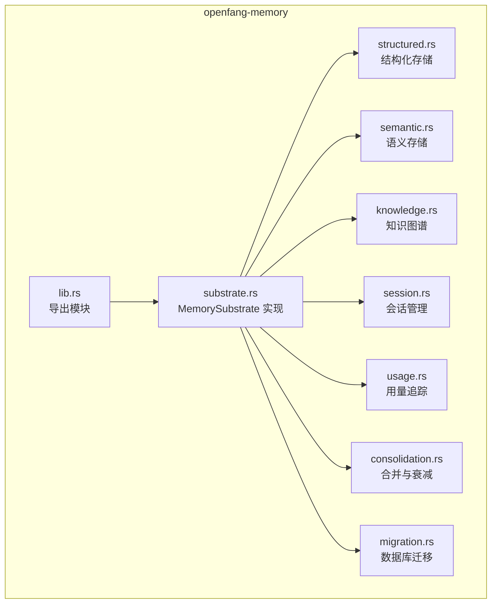
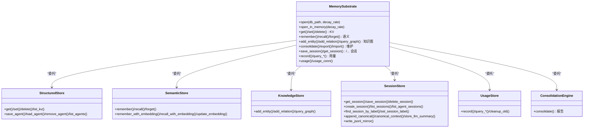
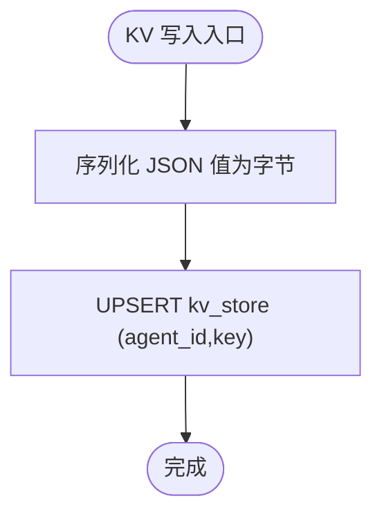
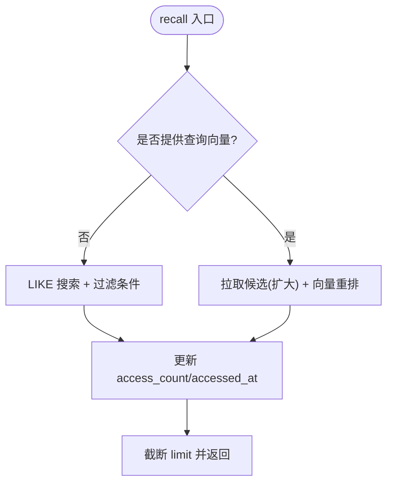
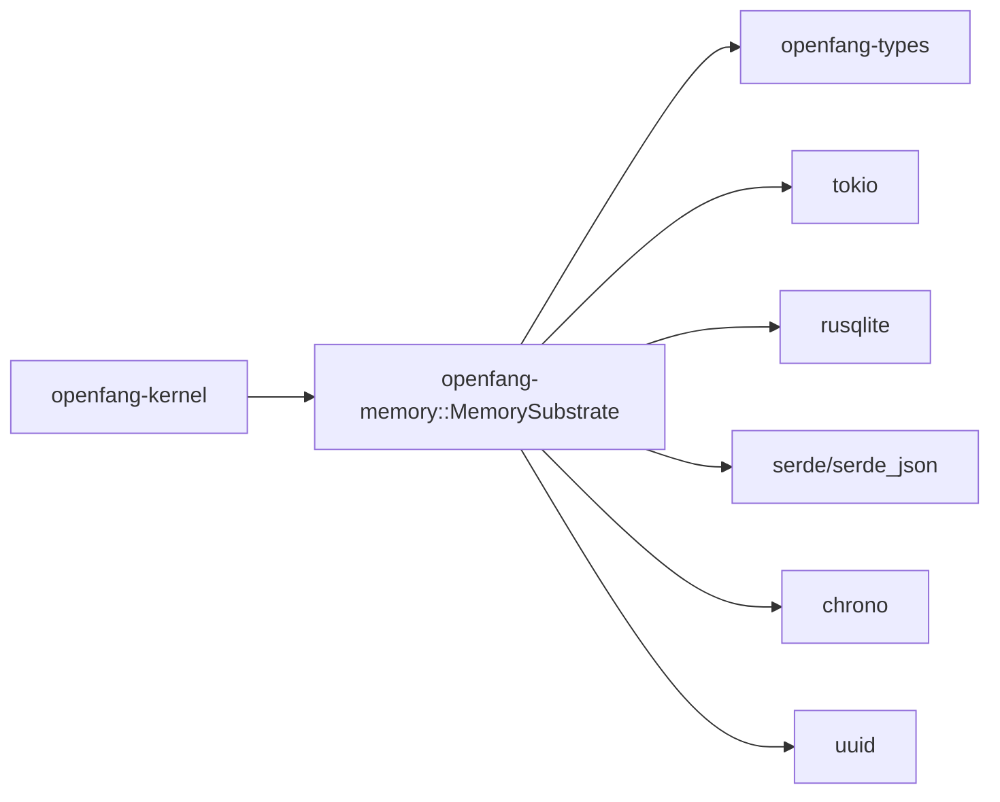

# 内存基座核心

<cite>
**本文引用的文件**
- [lib.rs](file://crates/openfang-memory/src/lib.rs)
- [substrate.rs](file://crates/openfang-memory/src/substrate.rs)
- [structured.rs](file://crates/openfang-memory/src/structured.rs)
- [semantic.rs](file://crates/openfang-memory/src/semantic.rs)
- [knowledge.rs](file://crates/openfang-memory/src/knowledge.rs)
- [session.rs](file://crates/openfang-memory/src/session.rs)
- [migration.rs](file://crates/openfang-memory/src/migration.rs)
- [consolidation.rs](file://crates/openfang-memory/src/consolidation.rs)
- [usage.rs](file://crates/openfang-memory/src/usage.rs)
- [memory.rs](file://crates/openfang-types/src/memory.rs)
- [kernel.rs](file://crates/openfang-kernel/src/kernel.rs)
- [Cargo.toml](file://crates/openfang-memory/Cargo.toml)
</cite>

## 目录
1. [简介](#简介)
2. [项目结构](#项目结构)
3. [核心组件](#核心组件)
4. [架构总览](#架构总览)
5. [详细组件分析](#详细组件分析)
6. [依赖分析](#依赖分析)
7. [性能考虑](#性能考虑)
8. [故障排查指南](#故障排查指南)
9. [结论](#结论)
10. [附录](#附录)

## 简介
本文件面向 OpenFang 内存基座核心（openfang-memory），系统化阐述 MemorySubstrate 的统一内存 API 设计理念与实现，覆盖三大存储后端：
- 结构化存储（Structured Store，基于 SQLite 的键值对与代理持久化）
- 语义存储（Semantic Store，基于 SQLite 的文本检索与向量相似度召回）
- 知识图谱（Knowledge Graph，基于 SQLite 的实体与关系）

并深入解析 Memory trait 接口设计、存储后端选择策略、数据一致性保障机制，提供 API 调用示例路径、错误处理模式、性能优化策略，以及与运行时内核的集成方式与存储后端切换配置指南。

## 项目结构
openfang-memory crate 将统一内存 API 暴露给上层，内部通过 MemorySubstrate 组合多个专用存储模块，并共享一个 SQLite 连接以确保事务一致性与跨模块协作。

图表来源
- [lib.rs:1-20](file://crates/openfang-memory/src/lib.rs#L1-L20)
- [substrate.rs:1-777](file://crates/openfang-memory/src/substrate.rs#L1-L777)
- [structured.rs:1-494](file://crates/openfang-memory/src/structured.rs#L1-L494)
- [semantic.rs:1-557](file://crates/openfang-memory/src/semantic.rs#L1-L557)
- [knowledge.rs:1-355](file://crates/openfang-memory/src/knowledge.rs#L1-L355)
- [session.rs:1-814](file://crates/openfang-memory/src/session.rs#L1-L814)
- [usage.rs:1-542](file://crates/openfang-memory/src/usage.rs#L1-L542)
- [consolidation.rs:1-102](file://crates/openfang-memory/src/consolidation.rs#L1-L102)
- [migration.rs:1-364](file://crates/openfang-memory/src/migration.rs#L1-L364)

章节来源
- [lib.rs:1-20](file://crates/openfang-memory/src/lib.rs#L1-L20)
- [Cargo.toml:1-24](file://crates/openfang-memory/Cargo.toml#L1-L24)

## 核心组件
- MemorySubstrate：统一内存 API 的具体实现，组合结构化、语义、知识图谱、会话、用量与合并引擎，对外暴露 Memory trait。
- StructuredStore：KV 存储与代理注册表，支持按代理维度的键值读写、列表与删除。
- SemanticStore：记忆体存储与召回，支持 LIKE 文本匹配与向量相似度召回，支持嵌入更新与访问计数维护。
- KnowledgeStore：实体与关系存储，支持图模式查询。
- SessionStore：会话生命周期管理，支持跨通道的“规范会话”（canonical session）持久化与压缩。
- UsageStore：用量事件记录与统计，支持按时间粒度查询与清理。
- ConsolidationEngine：记忆体合并与置信度衰减（Phase 1：仅衰减）。
- migration：数据库初始化与版本迁移，确保首次启动与升级安全。

章节来源
- [substrate.rs:26-76](file://crates/openfang-memory/src/substrate.rs#L26-L76)
- [structured.rs:9-13](file://crates/openfang-memory/src/structured.rs#L9-L13)
- [semantic.rs:19-23](file://crates/openfang-memory/src/semantic.rs#L19-L23)
- [knowledge.rs:15-19](file://crates/openfang-memory/src/knowledge.rs#L15-L19)
- [session.rs:12-31](file://crates/openfang-memory/src/session.rs#L12-L31)
- [usage.rs:70-74](file://crates/openfang-memory/src/usage.rs#L70-L74)
- [consolidation.rs:12-18](file://crates/openfang-memory/src/consolidation.rs#L12-L18)
- [migration.rs:7-48](file://crates/openfang-memory/src/migration.rs#L7-L48)

## 架构总览
MemorySubstrate 作为门面，将 Memory trait 的统一接口映射到各专用存储模块；所有存储共享同一 SQLite 连接，确保跨模块一致性与最小化锁竞争。

图表来源
- [substrate.rs:26-76](file://crates/openfang-memory/src/substrate.rs#L26-L76)
- [structured.rs:9-13](file://crates/openfang-memory/src/structured.rs#L9-L13)
- [semantic.rs:19-23](file://crates/openfang-memory/src/semantic.rs#L19-L23)
- [knowledge.rs:15-19](file://crates/openfang-memory/src/knowledge.rs#L15-L19)
- [session.rs:27-31](file://crates/openfang-memory/src/session.rs#L27-L31)
- [usage.rs:70-74](file://crates/openfang-memory/src/usage.rs#L70-L74)
- [consolidation.rs:12-18](file://crates/openfang-memory/src/consolidation.rs#L12-L18)

## 详细组件分析

### Memory trait 接口设计与实现映射
- 统一接口：Memory trait 定义了 KV、语义、知识图谱与维护操作的异步接口，MemorySubstrate 通过 tokio::task::spawn_blocking 将 SQLite 访问移至阻塞线程池，避免阻塞异步运行时。
- 后端选择策略：调用方不感知后端差异；具体行为由各 store 决定（如 recall 在无嵌入时回退到 LIKE 匹配）。
- 数据一致性：所有 store 共享同一 rusqlite::Connection（通过 Arc<Mutex<Connection>>），在单次调用中串行化访问，避免并发写冲突；WAL 模式提升并发读写能力。

章节来源
- [memory.rs:258-335](file://crates/openfang-types/src/memory.rs#L258-L335)
- [substrate.rs:571-681](file://crates/openfang-memory/src/substrate.rs#L571-L681)

### 结构化存储（Structured Store）
- 功能要点
  - KV：按 agent_id + key 唯一定位，支持 set/get/delete/list_kv。
  - 代理持久化：save_agent/load_agent/remove_agent/load_all_agents/list_agents，兼容列演进与自动修复。
- 错误处理：序列化失败、查询无结果等均有明确错误返回。
- 性能特性：使用 ON CONFLICT UPSERT，减少写路径分支；KV 列使用 BLOB 存储 JSON，便于扩展。

图表来源
- [structured.rs:46-66](file://crates/openfang-memory/src/structured.rs#L46-L66)

章节来源
- [structured.rs:21-111](file://crates/openfang-memory/src/structured.rs#L21-L111)
- [structured.rs:113-254](file://crates/openfang-memory/src/structured.rs#L113-L254)
- [structured.rs:256-414](file://crates/openfang-memory/src/structured.rs#L256-L414)
- [structured.rs:416-439](file://crates/openfang-memory/src/structured.rs#L416-L439)

### 语义存储（Semantic Store）
- 功能要点
  - remember/forget：插入/软删除记忆片段，记录 source、scope、metadata、confidence、access 统计。
  - recall：支持 LIKE 回退与向量相似度重排；当提供查询向量时，先拉取候选再按余弦相似度排序截断。
  - 嵌入：embedding 以 BLOB 存储，支持 update_embedding。
- 性能特性：候选集扩大（limit*10）以提升向量重排质量；访问计数与时间戳用于后续衰减与排序。

图表来源
- [semantic.rs:95-277](file://crates/openfang-memory/src/semantic.rs#L95-L277)

章节来源
- [semantic.rs:31-81](file://crates/openfang-memory/src/semantic.rs#L31-L81)
- [semantic.rs:83-114](file://crates/openfang-memory/src/semantic.rs#L83-L114)
- [semantic.rs:115-277](file://crates/openfang-memory/src/semantic.rs#L115-L277)
- [semantic.rs:293-306](file://crates/openfang-memory/src/semantic.rs#L293-L306)

### 知识图谱（Knowledge Store）
- 功能要点
  - add_entity/add_relation：实体与关系入库，支持 ON CONFLICT 更新属性与时间戳。
  - query_graph：基于三元组（源-关系-目标）的模式查询，支持名称或 ID 匹配。
- 性能特性：多索引（实体/关系/类型）支撑高效查询；限制返回条目数量。

章节来源
- [knowledge.rs:27-51](file://crates/openfang-memory/src/knowledge.rs#L27-L51)
- [knowledge.rs:53-80](file://crates/openfang-memory/src/knowledge.rs#L53-L80)
- [knowledge.rs:82-196](file://crates/openfang-memory/src/knowledge.rs#L82-L196)

### 会话管理（Session Store）
- 功能要点
  - 会话 CRUD：get/save/delete/list，支持标签与消息计数元数据。
  - 规范会话（canonical session）：跨通道持久化，支持消息压缩与摘要生成，控制窗口大小。
  - 镜像导出：将会话导出为人类可读的 JSONL 文件。
- 性能特性：消息序列化采用 MessagePack，兼顾体积与性能；压缩阈值与窗口大小可配置。

章节来源
- [session.rs:39-101](file://crates/openfang-memory/src/session.rs#L39-L101)
- [session.rs:117-143](file://crates/openfang-memory/src/session.rs#L117-L143)
- [session.rs:185-196](file://crates/openfang-memory/src/session.rs#L185-L196)
- [session.rs:362-475](file://crates/openfang-memory/src/session.rs#L362-L475)
- [session.rs:528-618](file://crates/openfang-memory/src/session.rs#L528-L618)

### 用量追踪（Usage Store）
- 功能要点
  - record：记录 LLM 使用事件（模型、输入/输出 token、成本、工具调用次数）。
  - 查询：小时/日/月/全局汇总；按模型分组；N 日明细。
  - 清理：按天数清理过期用量事件。
- 性能特性：多索引加速聚合查询；整型字段存储大数值，避免浮点误差。

章节来源
- [usage.rs:82-106](file://crates/openfang-memory/src/usage.rs#L82-L106)
- [usage.rs:108-191](file://crates/openfang-memory/src/usage.rs#L108-L191)
- [usage.rs:193-303](file://crates/openfang-memory/src/usage.rs#L193-L303)
- [usage.rs:336-351](file://crates/openfang-memory/src/usage.rs#L336-L351)

### 合并与衰减（Consolidation Engine）
- 功能要点
  - 定期衰减：对超过 7 天未访问的记忆，按 decay_rate 衰减置信度，下限不低于 0.1。
  - 报告：返回衰减数量与时长。
- 性能特性：单次 UPDATE 批量处理，避免逐条扫描。

章节来源
- [consolidation.rs:26-53](file://crates/openfang-memory/src/consolidation.rs#L26-L53)

### 数据库迁移（Migration）
- 功能要点
  - 版本化迁移：从 v1 到 v8，逐步引入任务队列、嵌入、用量、规范会话、标签、设备、审计等表与列。
  - 安全性：幂等执行、列存在性检查、用户版本记录。
- 性能特性：首次启动一次性迁移，后续只增量升级。

章节来源
- [migration.rs:10-48](file://crates/openfang-memory/src/migration.rs#L10-L48)
- [migration.rs:74-186](file://crates/openfang-memory/src/migration.rs#L74-L186)
- [migration.rs:215-228](file://crates/openfang-memory/src/migration.rs#L215-L228)
- [migration.rs:254-271](file://crates/openfang-memory/src/migration.rs#L254-L271)
- [migration.rs:286-304](file://crates/openfang-memory/src/migration.rs#L286-L304)
- [migration.rs:306-329](file://crates/openfang-memory/src/migration.rs#L306-L329)

### 与运行时内核的集成
- 内核启动时创建 MemorySubstrate（默认 WAL 模式、busy_timeout），并将共享连接传递给用量追踪器，确保用量与内存共享同一数据库。
- 内核负责配置加载与路径解析，决定 SQLite 文件路径与衰减率参数。

章节来源
- [kernel.rs:558-567](file://crates/openfang-kernel/src/kernel.rs#L558-L567)
- [kernel.rs:718-721](file://crates/openfang-kernel/src/kernel.rs#L718-L721)

## 依赖分析
- 内部依赖
  - openfang-types：统一的数据类型与 Memory trait 定义。
  - tokio/rusqlite/uuid/serde/chrono 等：异步运行时、SQLite 访问、序列化、时间与唯一标识。
- 外部依赖
  - SQLite：作为统一存储后端，承载所有数据结构与索引。
  - 运行时内核：负责实例化 MemorySubstrate 并注入配置。

图表来源
- [Cargo.toml:8-19](file://crates/openfang-memory/Cargo.toml#L8-L19)
- [kernel.rs:558-567](file://crates/openfang-kernel/src/kernel.rs#L558-L567)

章节来源
- [Cargo.toml:1-24](file://crates/openfang-memory/Cargo.toml#L1-L24)

## 性能考虑
- 异步与阻塞分离：Memory trait 的异步方法通过 spawn_blocking 调用各 store 的同步实现，避免阻塞 tokio 运行时。
- WAL 模式：启用 WAL 提升并发读性能；busy_timeout 减少锁等待超时。
- 索引与查询优化：memories、entities、relations、usage_events 等关键表建立索引，recall 与查询走索引路径。
- 候选集扩大：向量召回前扩大候选集（limit*10），提高重排质量。
- 压缩与衰减：规范会话压缩与记忆体置信度衰减降低存储与检索开销。
- 序列化：KV 使用 JSON，会话使用 MessagePack，平衡可读性与体积。

[本节为通用指导，无需特定文件引用]

## 故障排查指南
- 常见错误类型
  - Memory：SQLite 操作异常（如约束冲突、查询失败）。
  - Serialization：JSON/MessagePack 序列化/反序列化失败。
  - Internal：Tokio 任务执行异常（线程池或锁获取失败）。
- 定位建议
  - 检查数据库路径与权限、WAL 模式与 busy_timeout 设置。
  - 关注迁移是否成功、schema 版本是否匹配。
  - 对于 recall 无结果：确认是否提供查询向量、过滤条件是否过于严格、access_count 是否导致排序靠后。
  - 用量查询异常：确认时间范围与索引是否存在。
- 建议的日志与监控
  - tracing 日志输出关键路径（如向量召回候选数）。
  - 用量统计用于成本异常预警。

章节来源
- [structured.rs:22-43](file://crates/openfang-memory/src/structured.rs#L22-L43)
- [semantic.rs:95-114](file://crates/openfang-memory/src/semantic.rs#L95-L114)
- [usage.rs:108-191](file://crates/openfang-memory/src/usage.rs#L108-L191)

## 结论
MemorySubstrate 通过统一的 Memory trait 将结构化、语义与知识图谱三大存储抽象为一致的 API，借助共享 SQLite 连接与 WAL 模式，在保证一致性的同时兼顾性能。运行时内核负责实例化与配置注入，形成从配置到存储的完整闭环。随着嵌入能力完善，语义召回将逐步从 LIKE 回退过渡到向量相似度主导的混合策略，进一步提升检索质量与效率。

[本节为总结性内容，无需特定文件引用]

## 附录

### API 调用示例（路径指引）
- 获取/设置 KV
  - [get:573-579](file://crates/openfang-memory/src/substrate.rs#L573-L579)
  - [set:586-592](file://crates/openfang-memory/src/substrate.rs#L586-L592)
  - [delete:594-599](file://crates/openfang-memory/src/substrate.rs#L594-L599)
  - [list_kv:123-125](file://crates/openfang-memory/src/substrate.rs#L123-L125)
- 记忆体操作
  - [remember:609-618](file://crates/openfang-memory/src/substrate.rs#L609-L618)
  - [recall:625-631](file://crates/openfang-memory/src/substrate.rs#L625-L631)
  - [forget:633-638](file://crates/openfang-memory/src/substrate.rs#L633-L638)
  - [remember_with_embedding:349-352](file://crates/openfang-memory/src/substrate.rs#L349-L352)
  - [recall_with_embedding:361-364](file://crates/openfang-memory/src/substrate.rs#L361-L364)
- 知识图谱
  - [add_entity:640-645](file://crates/openfang-memory/src/substrate.rs#L640-L645)
  - [add_relation:647-652](file://crates/openfang-memory/src/substrate.rs#L647-L652)
  - [query_graph:654-659](file://crates/openfang-memory/src/substrate.rs#L654-L659)
- 会话管理
  - [save_session:148-149](file://crates/openfang-memory/src/substrate.rs#L148-L149)
  - [get_session:143-145](file://crates/openfang-memory/src/substrate.rs#L143-L145)
  - [list_sessions:168-170](file://crates/openfang-memory/src/substrate.rs#L168-L170)
  - [append_canonical:263-267](file://crates/openfang-memory/src/substrate.rs#L263-L267)
  - [canonical_context:223-229](file://crates/openfang-memory/src/substrate.rs#L223-L229)
- 用量追踪
  - [record:82-106](file://crates/openfang-memory/src/usage.rs#L82-L106)
  - [query_summary:193-231](file://crates/openfang-memory/src/usage.rs#L193-L231)
  - [query_by_model:233-265](file://crates/openfang-memory/src/usage.rs#L233-L265)
  - [cleanup_old:336-351](file://crates/openfang-memory/src/usage.rs#L336-L351)

### 错误处理模式
- 统一错误包装：OpenFangError 透明包裹底层错误，区分 Memory、Serialization、Internal 等类别。
- 返回策略：失败时返回错误，成功时返回业务结果；部分操作（如 JSONL 导出镜像）为尽力而为，不影响主存储。

章节来源
- [memory.rs:258-335](file://crates/openfang-types/src/memory.rs#L258-L335)
- [substrate.rs:571-681](file://crates/openfang-memory/src/substrate.rs#L571-L681)

### 性能优化策略
- 异步阻塞分离：所有 SQLite 访问通过 spawn_blocking。
- WAL 与锁：journal_mode=WAL、busy_timeout=5000。
- 索引与查询：为高频查询字段建立索引。
- 候选扩大与重排：向量召回前扩大候选集，提升重排质量。
- 压缩与衰减：规范会话压缩与记忆体置信度衰减。

章节来源
- [substrate.rs:40-44](file://crates/openfang-memory/src/substrate.rs#L40-L44)
- [semantic.rs:107-114](file://crates/openfang-memory/src/semantic.rs#L107-L114)
- [consolidation.rs:26-53](file://crates/openfang-memory/src/consolidation.rs#L26-L53)

### 与运行时引擎的集成方式
- 内核负责：
  - 解析配置（数据目录、SQLite 路径、衰减率）。
  - 创建 MemorySubstrate 并注入共享连接。
  - 将用量追踪器与内存共享同一连接，确保成本统计与内存一致。
- 运行时通过能力检查与内核句柄访问 KV 存取（例如 host_kv_get/host_kv_set）。

章节来源
- [kernel.rs:558-567](file://crates/openfang-kernel/src/kernel.rs#L558-L567)
- [kernel.rs:718-721](file://crates/openfang-kernel/src/kernel.rs#L718-L721)

### 存储后端切换与配置指南
- 切换策略
  - 当前实现：统一使用 SQLite 作为后端，MemorySubstrate 通过共享连接协调各模块。
  - 可扩展方向：在保持 Memory trait 不变的前提下，替换某模块的 store 实现（如以向量数据库替代语义存储的 SQLite 向量检索），需确保：
    - 保持接口一致（异步、错误类型）。
    - 保证事务一致性（共享连接或等效机制）。
    - 保留迁移与索引策略。
- 配置项（内核侧）
  - sqlite_path：SQLite 文件路径（默认 data_dir/openfang.db）。
  - decay_rate：记忆体置信度衰减率（传入 MemorySubstrate 构造）。
- 建议
  - 在开发环境使用 open_in_memory 快速验证逻辑。
  - 生产环境启用 WAL 模式与合理的 busy_timeout。
  - 定期执行 consolidate 与用量清理，维持性能与容量健康。

章节来源
- [substrate.rs:58-74](file://crates/openfang-memory/src/substrate.rs#L58-L74)
- [kernel.rs:558-567](file://crates/openfang-kernel/src/kernel.rs#L558-L567)
- [migration.rs:74-186](file://crates/openfang-memory/src/migration.rs#L74-L186)