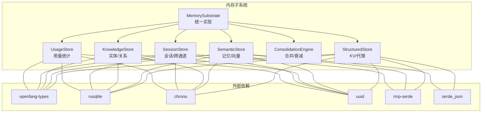
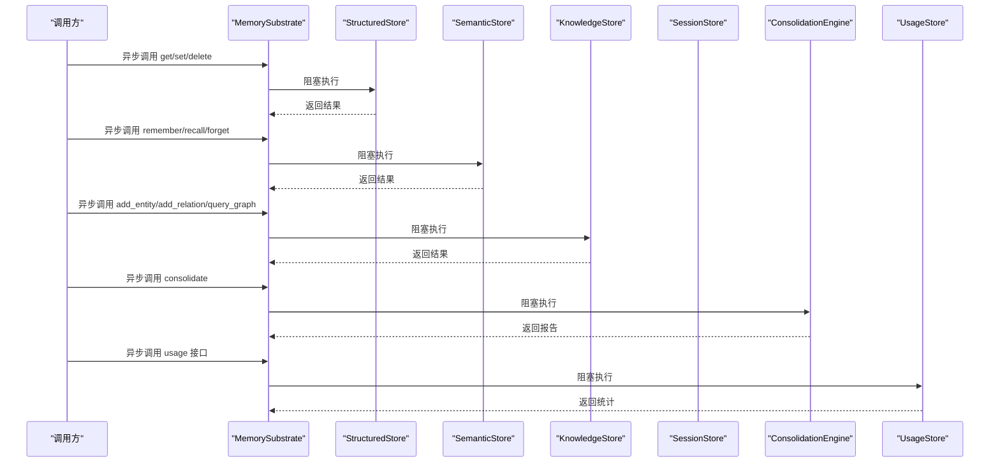
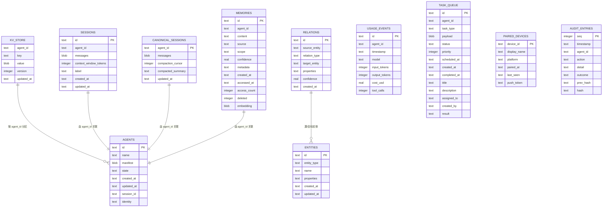
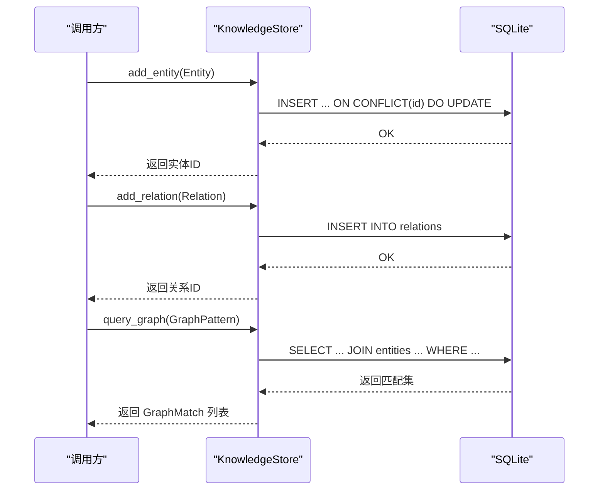
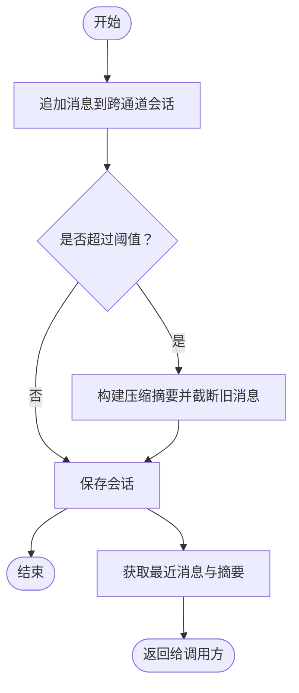
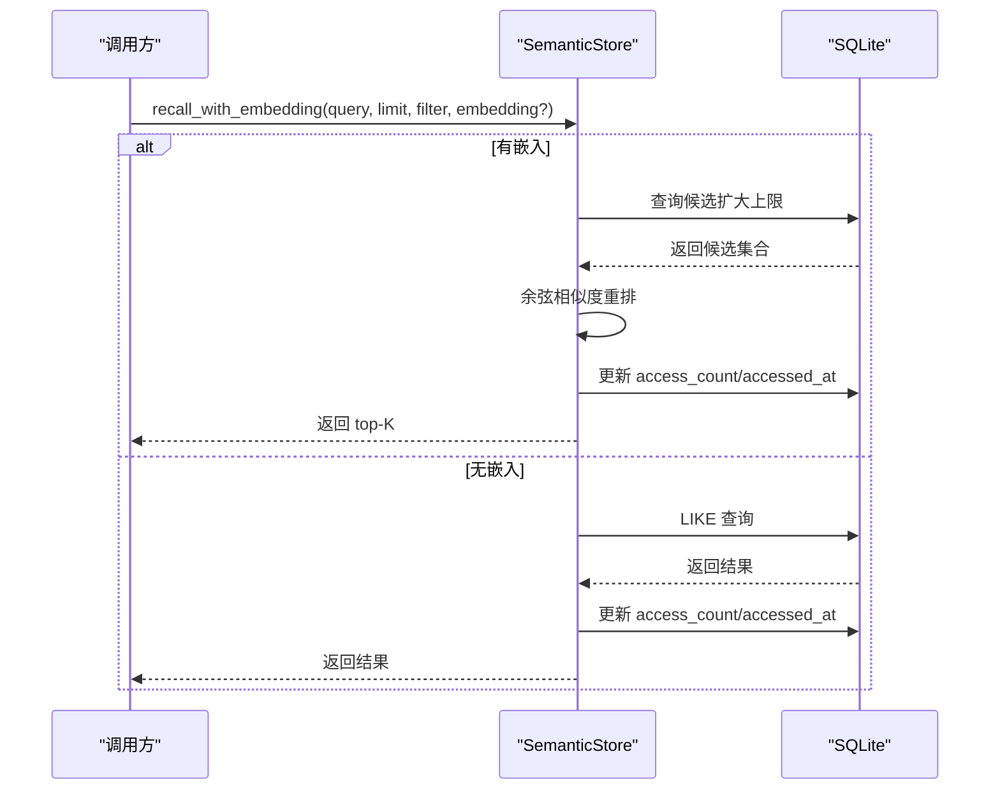
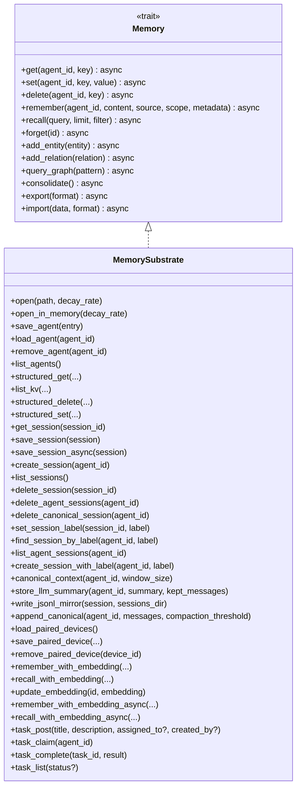
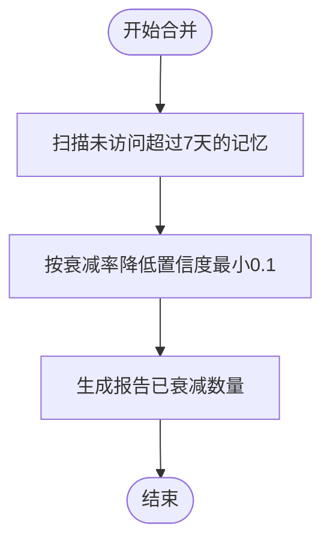
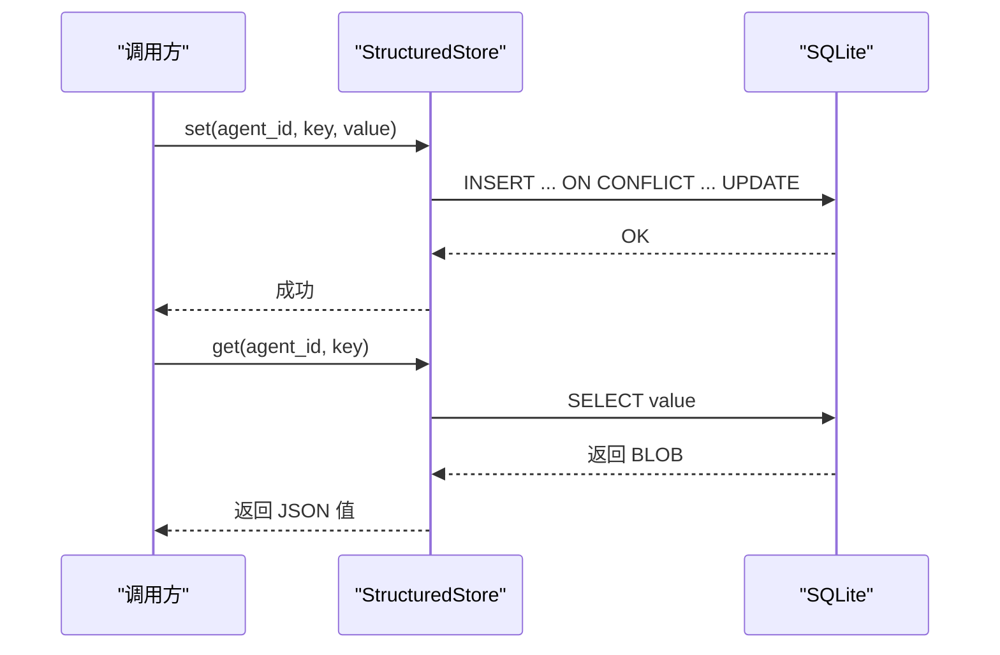
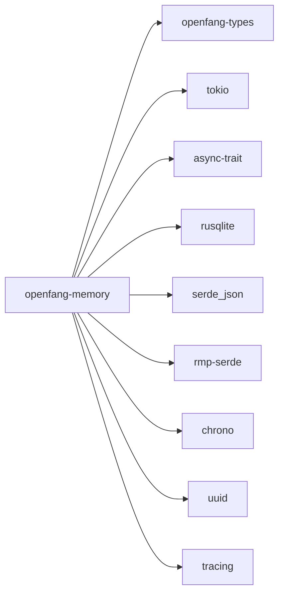

# 内存子系统 (openfang-memory)

<cite>
**本文引用的文件**
- [lib.rs](file://crates/openfang-memory/src/lib.rs)
- [substrate.rs](file://crates/openfang-memory/src/substrate.rs)
- [structured.rs](file://crates/openfang-memory/src/structured.rs)
- [semantic.rs](file://crates/openfang-memory/src/semantic.rs)
- [knowledge.rs](file://crates/openfang-memory/src/knowledge.rs)
- [session.rs](file://crates/openfang-memory/src/session.rs)
- [consolidation.rs](file://crates/openfang-memory/src/consolidation.rs)
- [migration.rs](file://crates/openfang-memory/src/migration.rs)
- [usage.rs](file://crates/openfang-memory/src/usage.rs)
- [memory.rs](file://crates/openfang-types/src/memory.rs)
- [message.rs](file://crates/openfang-types/src/message.rs)
- [Cargo.toml](file://crates/openfang-memory/Cargo.toml)
</cite>

## 目录
1. [简介](#简介)
2. [项目结构](#项目结构)
3. [核心组件](#核心组件)
4. [架构总览](#架构总览)
5. [详细组件分析](#详细组件分析)
6. [依赖关系分析](#依赖关系分析)
7. [性能考量](#性能考量)
8. [故障排查指南](#故障排查指南)
9. [结论](#结论)
10. [附录](#附录)

## 简介
OpenFang 内存子系统（openfang-memory）为智能体操作系统提供统一的记忆抽象层，整合三类存储后端：
- 结构化存储（SQLite）：键值对、会话、代理状态
- 语义存储：基于文本的检索（第一阶段：LIKE 匹配；第二阶段：向量相似度）
- 知识图谱（SQLite）：实体与关系

通过单一异步 API 抽象，MemorySubstrate 将结构化、语义、知识图谱、会话管理与合并引擎组合为一体，既支持传统文本检索，也为后续引入向量数据库打下基础。

## 项目结构
- crates/openfang-memory/src
  - lib.rs：模块导出入口
  - substrate.rs：MemorySubstrate 统一实现，聚合各存储与引擎
  - structured.rs：结构化存储（KV、代理注册）
  - semantic.rs：语义存储（记忆片段、召回、嵌入）
  - knowledge.rs：知识图谱（实体、关系、图查询）
  - session.rs：会话管理（消息历史、跨通道持久化、JSONL 备份）
  - consolidation.rs：内存合并与衰减
  - migration.rs：数据库模式迁移
  - usage.rs：使用计费追踪与统计
- crates/openfang-types/src
  - memory.rs：Memory trait、类型定义（MemoryFragment、Entity、Relation、过滤器等）
  - message.rs：消息内容模型（用于会话）

图表来源
- [substrate.rs:26-36](file://crates/openfang-memory/src/substrate.rs#L26-L36)
- [structured.rs:10-13](file://crates/openfang-memory/src/structured.rs#L10-L13)
- [semantic.rs:19-23](file://crates/openfang-memory/src/semantic.rs#L19-L23)
- [knowledge.rs:15-19](file://crates/openfang-memory/src/knowledge.rs#L15-L19)
- [session.rs:27-31](file://crates/openfang-memory/src/session.rs#L27-L31)
- [usage.rs:70-74](file://crates/openfang-memory/src/usage.rs#L70-L74)

章节来源
- [lib.rs:1-20](file://crates/openfang-memory/src/lib.rs#L1-L20)
- [Cargo.toml:1-24](file://crates/openfang-memory/Cargo.toml#L1-L24)

## 核心组件
- MemorySubstrate：统一入口，封装结构化、语义、知识、会话、合并与用量统计
- StructuredStore：键值对与代理持久化
- SemanticStore：记忆片段、召回、嵌入更新
- KnowledgeStore：实体与关系，图模式查询
- SessionStore：会话加载/保存、跨通道持久化、JSONL 备份
- ConsolidationEngine：按周期衰减旧记忆置信度
- UsageStore：LLM 使用事件记录与统计
- 迁移系统：版本化数据库模式升级

章节来源
- [substrate.rs:26-36](file://crates/openfang-memory/src/substrate.rs#L26-L36)
- [structured.rs:15-19](file://crates/openfang-memory/src/structured.rs#L15-L19)
- [semantic.rs:25-29](file://crates/openfang-memory/src/semantic.rs#L25-L29)
- [knowledge.rs:21-25](file://crates/openfang-memory/src/knowledge.rs#L21-L25)
- [session.rs:33-37](file://crates/openfang-memory/src/session.rs#L33-L37)
- [consolidation.rs:20-24](file://crates/openfang-memory/src/consolidation.rs#L20-L24)
- [usage.rs:76-80](file://crates/openfang-memory/src/usage.rs#L76-L80)
- [migration.rs:11-48](file://crates/openfang-memory/src/migration.rs#L11-L48)

## 架构总览
MemorySubstrate 作为门面，持有共享的 SQLite 连接，将各子系统组合为统一的异步 API。所有写操作在阻塞线程池中执行，避免阻塞 Tokio 运行时；读操作同样通过阻塞包装，确保一致性与可测试性。

图表来源
- [substrate.rs:571-681](file://crates/openfang-memory/src/substrate.rs#L571-L681)

章节来源
- [substrate.rs:38-74](file://crates/openfang-memory/src/substrate.rs#L38-L74)
- [substrate.rs:571-681](file://crates/openfang-memory/src/substrate.rs#L571-L681)

## 详细组件分析

### 存储抽象层设计
- 设计理念
  - 单一接口：Memory trait 抽象结构化、语义、知识三种存储
  - 异步门面：MemorySubstrate 提供统一异步 API，内部通过阻塞任务执行
  - 共享连接：所有子系统共享一个 SQLite 连接，保证 ACID 与一致性
  - 渐进增强：语义存储支持向量检索，但兼容 LIKE 回退路径
- 数据模型
  - 结构化：kv_store（agent_id, key, value, version, updated_at）
  - 语义：memories（id, agent_id, content, source, scope, confidence, metadata, created_at, accessed_at, access_count, deleted, embedding）
  - 知识：entities（id, entity_type, name, properties, created_at, updated_at）、relations（id, source_entity, relation_type, target_entity, properties, confidence, created_at）
  - 会话：sessions（id, agent_id, messages, context_window_tokens, label, created_at, updated_at），canonical_sessions（agent_id, messages, compaction_cursor, compacted_summary, updated_at）
  - 用量：usage_events（id, agent_id, timestamp, model, input_tokens, output_tokens, cost_usd, tool_calls）
  - 其他：agents、task_queue、events、migrations、paired_devices、audit_entries

图表来源
- [migration.rs:75-329](file://crates/openfang-memory/src/migration.rs#L75-L329)

章节来源
- [migration.rs:74-329](file://crates/openfang-memory/src/migration.rs#L74-L329)
- [structured.rs:21-80](file://crates/openfang-memory/src/structured.rs#L21-L80)
- [semantic.rs:31-81](file://crates/openfang-memory/src/semantic.rs#L31-L81)
- [knowledge.rs:27-80](file://crates/openfang-memory/src/knowledge.rs#L27-L80)
- [session.rs:39-101](file://crates/openfang-memory/src/session.rs#L39-L101)
- [usage.rs:82-106](file://crates/openfang-memory/src/usage.rs#L82-L106)

### Knowledge 知识图谱构建
- 实体与关系
  - 实体：包含类型、名称、属性、时间戳
  - 关系：源实体、关系类型、目标实体、属性、置信度、时间戳
- 图查询
  - 支持按源/关系/目标过滤，返回三元组匹配
  - 查询限制最多 100 条结果
- 原子性与幂等
  - 实体插入使用 ON CONFLICT 更新 name 与 properties
  - 关系插入为新记录

图表来源
- [knowledge.rs:27-80](file://crates/openfang-memory/src/knowledge.rs#L27-L80)
- [knowledge.rs:82-196](file://crates/openfang-memory/src/knowledge.rs#L82-L196)

章节来源
- [knowledge.rs:27-196](file://crates/openfang-memory/src/knowledge.rs#L27-L196)

### Session 对话历史管理
- 会话模型
  - Session：包含消息列表、上下文窗口令牌数、可选标签
  - CanonicalSession：跨通道持久化，支持压缩摘要与游标
- 跨通道持久化
  - append_canonical：超过阈值自动压缩旧消息，保留最近若干条
  - canonical_context：返回压缩摘要与最近消息
- 备份与镜像
  - write_jsonl_mirror：将会话写入人类可读 JSONL 文件，便于审计与离线分析

图表来源
- [session.rs:410-475](file://crates/openfang-memory/src/session.rs#L410-L475)

章节来源
- [session.rs:12-25](file://crates/openfang-memory/src/session.rs#L12-L25)
- [session.rs:343-360](file://crates/openfang-memory/src/session.rs#L343-L360)
- [session.rs:410-475](file://crates/openfang-memory/src/session.rs#L410-L475)
- [session.rs:528-617](file://crates/openfang-memory/src/session.rs#L528-L617)

### Semantic 向量化检索机制
- 检索策略
  - 无嵌入：LIKE 模糊匹配
  - 有嵌入：先拉取候选（扩大上限），再按余弦相似度重排，最后裁剪到 limit
- 嵌入存储
  - 向量以小端字节序序列化为 BLOB 存储
- 访问统计
  - 每次召回更新 access_count 与 accessed_at

图表来源
- [semantic.rs:95-277](file://crates/openfang-memory/src/semantic.rs#L95-L277)

章节来源
- [semantic.rs:31-81](file://crates/openfang-memory/src/semantic.rs#L31-L81)
- [semantic.rs:95-277](file://crates/openfang-memory/src/semantic.rs#L95-L277)

### Memory Substrate 数据模型
- 统一接口
  - Memory trait 定义了键值、语义、知识、维护与导入导出方法
  - MemorySubstrate 实现该 trait，并将调用分派到对应子系统
- 运行时集成
  - 所有操作通过 tokio::task::spawn_blocking 在阻塞线程执行
  - 提供同步访问接口（如 structured_get/set/list_kv/delete）供内核句柄使用

图表来源
- [memory.rs:258-335](file://crates/openfang-types/src/memory.rs#L258-L335)
- [substrate.rs:26-36](file://crates/openfang-memory/src/substrate.rs#L26-L36)
- [substrate.rs:571-681](file://crates/openfang-memory/src/substrate.rs#L571-L681)

章节来源
- [memory.rs:258-335](file://crates/openfang-types/src/memory.rs#L258-L335)
- [substrate.rs:26-36](file://crates/openfang-memory/src/substrate.rs#L26-L36)
- [substrate.rs:571-681](file://crates/openfang-memory/src/substrate.rs#L571-L681)

### Consolidation 数据合并策略
- 衰减逻辑
  - 7 天未访问的记忆，按衰减率降低置信度，最低不低于 0.1
- 合并策略
  - 第一阶段：仅置信度衰减，不进行去重或合并
  - 后续阶段可扩展为相似记忆合并

图表来源
- [consolidation.rs:26-53](file://crates/openfang-memory/src/consolidation.rs#L26-L53)

章节来源
- [consolidation.rs:26-53](file://crates/openfang-memory/src/consolidation.rs#L26-L53)

### Structured 结构化存储方案
- 键值对
  - 支持 get/set/delete/list，使用 JSON 序列化
  - 版本号自增，更新时间戳
- 代理持久化
  - 保存/加载代理清单与状态，支持向后兼容字段
  - 自动修复与去重

图表来源
- [structured.rs:21-80](file://crates/openfang-memory/src/structured.rs#L21-L80)

章节来源
- [structured.rs:21-111](file://crates/openfang-memory/src/structured.rs#L21-L111)
- [structured.rs:113-254](file://crates/openfang-memory/src/structured.rs#L113-L254)

## 依赖关系分析
- 内部依赖
  - openfang-types：提供 Memory trait、消息与内存类型定义
- 外部依赖
  - tokio、async-trait：异步运行时与 trait 宏
  - rusqlite：SQLite 访问
  - serde/serde_json/rmp-serde：序列化
  - chrono：时间处理
  - uuid：唯一标识
  - tracing：日志

图表来源
- [Cargo.toml:8-19](file://crates/openfang-memory/Cargo.toml#L8-L19)

章节来源
- [Cargo.toml:8-19](file://crates/openfang-memory/Cargo.toml#L8-L19)

## 性能考量
- I/O 与并发
  - 所有数据库操作通过 spawn_blocking 在阻塞线程执行，避免阻塞异步运行时
  - 共享连接减少连接开销，提升事务一致性
- 查询优化
  - 语义检索：无嵌入时使用 LIKE；有嵌入时先拉取更多候选再重排，控制重排成本
  - 索引建议：memories 表已有 agent_id、scope 索引；relations 表有 source/target/type 索引；可考虑为 embedding 字段建立向量索引（后续阶段）
- 内存管理
  - 会话压缩：默认阈值 100 条，最近窗口 50 条，避免上下文膨胀
  - 合并衰减：定期降低旧记忆置信度，减少无效召回
- 序列化
  - KV 使用 JSON；会话使用 MessagePack；嵌入使用小端字节序 BLOB

[本节为通用指导，无需特定文件引用]

## 故障排查指南
- 常见错误
  - SQLite 错误：检查连接、权限、磁盘空间
  - 序列化错误：确认 JSON/MessagePack 编解码正确
  - UUID 解析失败：检查数据完整性
- 日志与审计
  - 使用 tracing 输出调试信息
  - audit_entries 提供持久化审计轨迹
- 用量清理
  - 使用 UsageStore.cleanup_old 删除过期用量事件，释放空间

章节来源
- [usage.rs:336-351](file://crates/openfang-memory/src/usage.rs#L336-L351)
- [migration.rs:307-329](file://crates/openfang-memory/src/migration.rs#L307-L329)

## 结论
OpenFang 内存子系统通过统一抽象与渐进式增强，实现了从结构化 KV 到语义检索再到知识图谱的完整记忆体系。MemorySubstrate 将多存储后端整合为一致的异步 API，结合会话压缩、合并衰减与用量统计，为智能体提供稳定、可扩展的记忆基础设施。未来可在语义检索中引入专用向量数据库，并扩展知识图谱的推理能力。

[本节为总结，无需特定文件引用]

## 附录

### 查询示例（路径引用）
- 获取代理状态
  - [structured_get:114-119](file://crates/openfang-memory/src/substrate.rs#L114-L119)
- 设置键值对
  - [structured_set:133-140](file://crates/openfang-memory/src/substrate.rs#L133-L140)
- 记忆检索（含嵌入）
  - [recall_with_embedding:354-364](file://crates/openfang-memory/src/substrate.rs#L354-L364)
- 添加实体
  - [add_entity:640-645](file://crates/openfang-memory/src/substrate.rs#L640-L645)
- 查询知识图谱
  - [query_graph:654-659](file://crates/openfang-memory/src/substrate.rs#L654-L659)
- 合并内存
  - [consolidate:661-666](file://crates/openfang-memory/src/substrate.rs#L661-L666)
- 会话压缩与上下文
  - [append_canonical:257-267](file://crates/openfang-memory/src/substrate.rs#L257-L267)
  - [canonical_context:223-229](file://crates/openfang-memory/src/substrate.rs#L223-L229)

### 索引优化策略
- 当前索引
  - memories：agent_id、scope
  - relations：source、target、relation_type
  - usage_events：agent_id、timestamp
  - sessions：label（v6 起）
- 建议
  - 为 embedding 字段建立向量索引（后续阶段）
  - 根据查询模式增加复合索引（如 memories(agent_id, scope, created_at)）

章节来源
- [migration.rs:147-172](file://crates/openfang-memory/src/migration.rs#L147-L172)
- [migration.rs:244-245](file://crates/openfang-memory/src/migration.rs#L244-L245)
- [migration.rs:277-278](file://crates/openfang-memory/src/migration.rs#L277-L278)
- [migration.rs:320-322](file://crates/openfang-memory/src/migration.rs#L320-L322)

### 数据迁移方案
- 版本化迁移
  - 从 v1 到 v8 逐步添加表与列（agents、sessions、kv_store、memories、entities、relations、usage_events、canonical_sessions、task_queue、paired_devices、audit_entries）
  - 使用 user_version 跟踪当前版本
- 兼容性
  - 代理加载时使用 lenient 解析，自动修复并回写最新格式
  - 会话与代理表新增列采用 ALTER TABLE 并检查存在性

章节来源
- [migration.rs:11-48](file://crates/openfang-memory/src/migration.rs#L11-L48)
- [migration.rs:74-329](file://crates/openfang-memory/src/migration.rs#L74-L329)
- [structured.rs:113-158](file://crates/openfang-memory/src/structured.rs#L113-L158)
- [session.rs:186-196](file://crates/openfang-memory/src/session.rs#L186-L196)

### 与运行时引擎的集成
- 异步门面
  - MemorySubstrate 实现 Memory trait，供运行时直接调用
- 阻塞封装
  - 所有数据库操作通过 spawn_blocking 包装，避免阻塞 Tokio
- 内核句柄
  - 提供同步访问接口（如 structured_get/set/list_kv/delete），满足内核句柄需求

章节来源
- [substrate.rs:571-681](file://crates/openfang-memory/src/substrate.rs#L571-L681)
- [substrate.rs:113-140](file://crates/openfang-memory/src/substrate.rs#L113-L140)

### 备份与恢复
- 会话镜像
  - write_jsonl_mirror 将会话写入 JSONL 文件，便于离线备份与审计
- 用量清理
  - cleanup_old 按天数删除过期用量事件，控制存储增长

章节来源
- [session.rs:528-617](file://crates/openfang-memory/src/session.rs#L528-L617)
- [usage.rs:336-351](file://crates/openfang-memory/src/usage.rs#L336-L351)

### 数据生命周期管理与隐私保护
- 生命周期
  - 会话压缩：默认阈值与窗口大小控制上下文长度
  - 合并衰减：定期降低旧记忆置信度
  - 用量清理：按天清理过期用量事件
- 隐私
  - 会话镜像为只读备份，不影响主存储
  - 审计表提供不可篡改的审计轨迹

章节来源
- [session.rs:410-475](file://crates/openfang-memory/src/session.rs#L410-L475)
- [consolidation.rs:26-53](file://crates/openfang-memory/src/consolidation.rs#L26-L53)
- [usage.rs:336-351](file://crates/openfang-memory/src/usage.rs#L336-L351)
- [migration.rs:307-329](file://crates/openfang-memory/src/migration.rs#L307-L329)