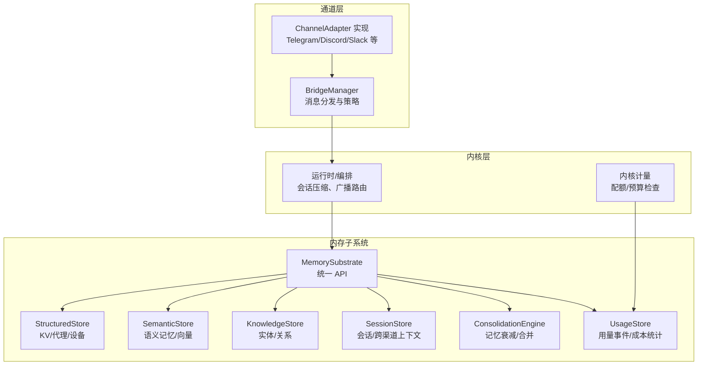
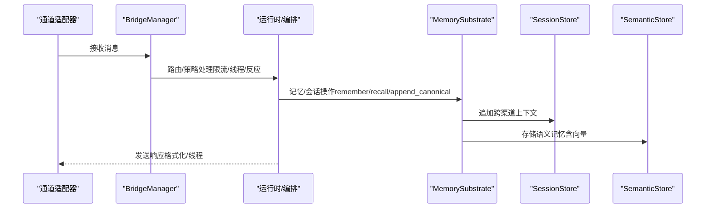
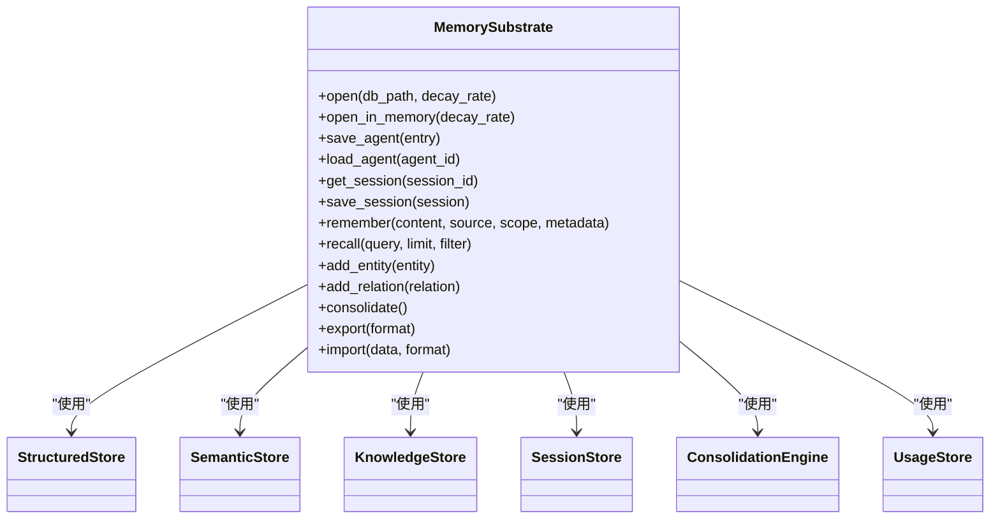
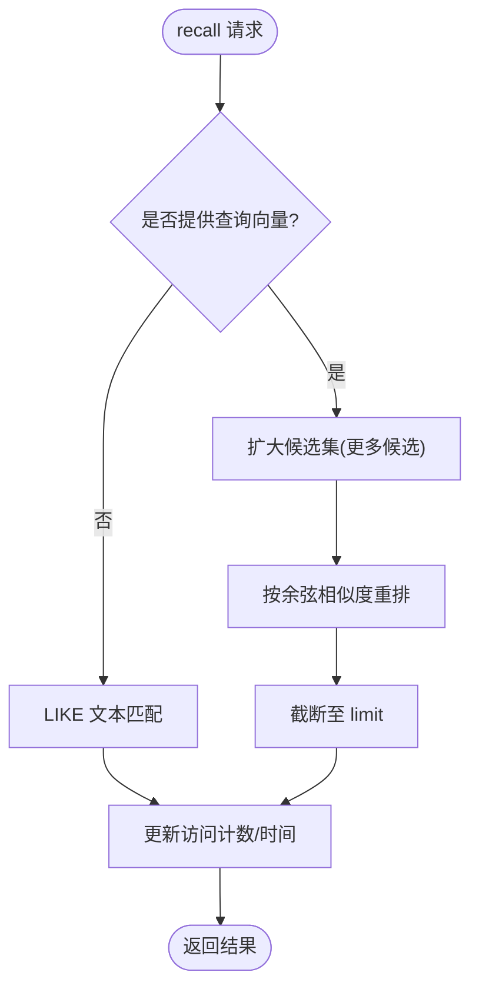
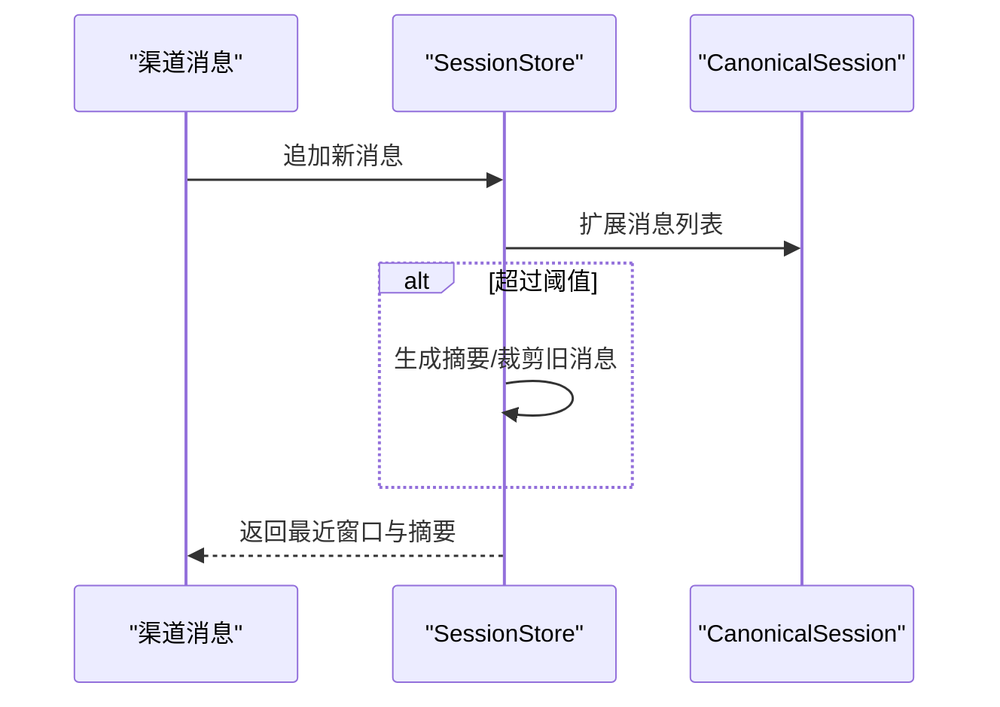
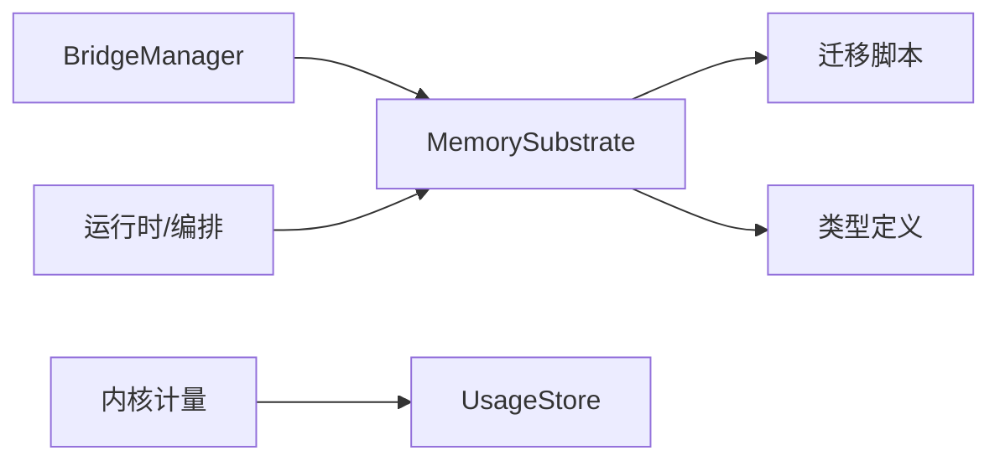
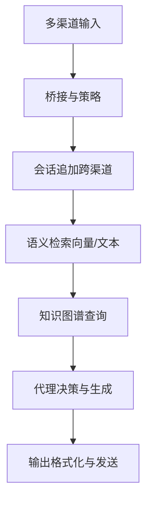

# 数据整合

<cite>
**本文引用的文件**
- [crates/openfang-memory/src/lib.rs](file://crates/openfang-memory/src/lib.rs)
- [crates/openfang-memory/src/substrate.rs](file://crates/openfang-memory/src/substrate.rs)
- [crates/openfang-memory/src/structured.rs](file://crates/openfang-memory/src/structured.rs)
- [crates/openfang-memory/src/semantic.rs](file://crates/openfang-memory/src/semantic.rs)
- [crates/openfang-memory/src/knowledge.rs](file://crates/openfang-memory/src/knowledge.rs)
- [crates/openfang-memory/src/session.rs](file://crates/openfang-memory/src/session.rs)
- [crates/openfang-memory/src/consolidation.rs](file://crates/openfang-memory/src/consolidation.rs)
- [crates/openfang-memory/src/migration.rs](file://crates/openfang-memory/src/migration.rs)
- [crates/openfang-memory/src/usage.rs](file://crates/openfang-memory/src/usage.rs)
- [crates/openfang-channels/src/bridge.rs](file://crates/openfang-channels/src/bridge.rs)
- [crates/openfang-runtime/src/compactor.rs](file://crates/openfang-runtime/src/compactor.rs)
- [crates/openfang-kernel/src/metering.rs](file://crates/openfang-kernel/src/metering.rs)
- [crates/openfang-types/src/memory.rs](file://crates/openfang-types/src/memory.rs)
</cite>

## 目录
1. [简介](#简介)
2. [项目结构](#项目结构)
3. [核心组件](#核心组件)
4. [架构总览](#架构总览)
5. [详细组件分析](#详细组件分析)
6. [依赖关系分析](#依赖关系分析)
7. [性能考量](#性能考量)
8. [故障排查指南](#故障排查指南)
9. [结论](#结论)
10. [附录](#附录)

## 简介
本技术文档聚焦于 OpenFang 的“数据整合”能力，系统阐述多源数据的统一处理机制、去重与冲突解决策略、格式转换与字段映射、质量评估标准，以及与存储后端的协调方式。文档还覆盖批量处理流程、增量同步机制、数据迁移与版本兼容处理方案，并通过图示化的方式帮助读者快速理解从消息通道到知识图谱与记忆系统的完整数据流。

## 项目结构
OpenFang 将“记忆”抽象为三层存储：结构化键值（KV）、语义记忆（向量/文本）与知识图谱（实体与关系）。这些能力由内存子系统统一对外提供异步 API，并在内核侧与通道桥接、会话编排、计量计费等模块协同工作。

图表来源
- [crates/openfang-channels/src/bridge.rs](file://crates/openfang-channels/src/bridge.rs)
- [crates/openfang-runtime/src/compactor.rs](file://crates/openfang-runtime/src/compactor.rs)
- [crates/openfang-kernel/src/metering.rs](file://crates/openfang-kernel/src/metering.rs)
- [crates/openfang-memory/src/substrate.rs](file://crates/openfang-memory/src/substrate.rs)

章节来源
- [crates/openfang-memory/src/lib.rs](file://crates/openfang-memory/src/lib.rs)
- [crates/openfang-memory/src/substrate.rs](file://crates/openfang-memory/src/substrate.rs)

## 核心组件
- 内存子系统（MemorySubstrate）：统一聚合结构化、语义、知识、会话、计量与整合引擎，暴露异步 API。
- 结构化存储（StructuredStore）：KV 持久化、代理注册、设备配对等。
- 语义存储（SemanticStore）：记忆的增删查改，支持向量检索与回填。
- 知识图谱（KnowledgeStore）：实体与关系的增删查改，图模式查询。
- 会话存储（SessionStore）：会话生命周期管理、跨渠道持久化上下文、LLM 压缩摘要。
- 整合引擎（ConsolidationEngine）：定期衰减旧记忆置信度，为后续合并留出扩展空间。
- 用量存储（UsageStore）：记录调用事件，支持小时/日/月维度统计与清理。
- 通道桥接（BridgeManager）：适配多通道输入，执行策略（限流、线程、反应动画、自动回复），并路由到代理。

章节来源
- [crates/openfang-memory/src/substrate.rs](file://crates/openfang-memory/src/substrate.rs)
- [crates/openfang-memory/src/structured.rs](file://crates/openfang-memory/src/structured.rs)
- [crates/openfang-memory/src/semantic.rs](file://crates/openfang-memory/src/semantic.rs)
- [crates/openfang-memory/src/knowledge.rs](file://crates/openfang-memory/src/knowledge.rs)
- [crates/openfang-memory/src/session.rs](file://crates/openfang-memory/src/session.rs)
- [crates/openfang-memory/src/consolidation.rs](file://crates/openfang-memory/src/consolidation.rs)
- [crates/openfang-memory/src/usage.rs](file://crates/openfang-memory/src/usage.rs)
- [crates/openfang-channels/src/bridge.rs](file://crates/openfang-channels/src/bridge.rs)

## 架构总览
下图展示从通道消息进入，经桥接与路由，写入会话与语义记忆，最终可被知识图谱与结构化存储消费的整体流程。

图表来源
- [crates/openfang-channels/src/bridge.rs](file://crates/openfang-channels/src/bridge.rs)
- [crates/openfang-runtime/src/compactor.rs](file://crates/openfang-runtime/src/compactor.rs)
- [crates/openfang-memory/src/substrate.rs](file://crates/openfang-memory/src/substrate.rs)
- [crates/openfang-memory/src/session.rs](file://crates/openfang-memory/src/session.rs)
- [crates/openfang-memory/src/semantic.rs](file://crates/openfang-memory/src/semantic.rs)

## 详细组件分析

### 统一内存子系统（MemorySubstrate）
- 职责：组合结构化、语义、知识、会话、计量与整合引擎，提供统一的异步接口；内部以共享 SQLite 连接实现跨存储一致性。
- 关键能力：
  - KV 操作：set/get/delete/list
  - 语义记忆：remember/recall/forget，支持向量检索与回填
  - 知识图谱：add_entity/add_relation/query_graph
  - 会话：create/list/delete/append_canonical/store_llm_summary
  - 整合：consolidate（当前阶段为置信度衰减）
  - 用量：usage（查询/统计）
- 并发模型：所有操作通过 tokio::task::spawn_blocking 在阻塞线程中执行 SQLite，避免阻塞运行时。

图表来源
- [crates/openfang-memory/src/substrate.rs](file://crates/openfang-memory/src/substrate.rs)

章节来源
- [crates/openfang-memory/src/substrate.rs](file://crates/openfang-memory/src/substrate.rs)

### 结构化存储（StructuredStore）
- KV 存储：按 agent_id + key 唯一定位，支持序列化/反序列化，更新时自增版本号。
- 代理注册：保存/加载代理清单，兼容历史列（如 session_id、identity），自动修复不兼容的存储 blob。
- 设备配对：持久化设备信息，支持插入或替换。

章节来源
- [crates/openfang-memory/src/structured.rs](file://crates/openfang-memory/src/structured.rs)

### 语义存储（SemanticStore）
- 记忆增删：remember/forget，支持带/不带嵌入向量。
- 回忆检索：recall 支持文本 LIKE 匹配；recall_with_embedding 支持向量相似度排序；未提供向量时回退为 LIKE。
- 向量回填：update_embedding 可为已有记忆补充向量。
- 访问统计：每次召回更新访问次数与时间戳，用于后续衰减策略。

图表来源
- [crates/openfang-memory/src/semantic.rs](file://crates/openfang-memory/src/semantic.rs)

章节来源
- [crates/openfang-memory/src/semantic.rs](file://crates/openfang-memory/src/semantic.rs)

### 知识图谱（KnowledgeStore）
- 实体与关系：add_entity/add_relation 支持重复键覆盖更新；query_graph 支持三元组过滤与限制。
- 模式查询：支持按源实体、关系类型、目标实体过滤，返回三元组匹配集合。

章节来源
- [crates/openfang-memory/src/knowledge.rs](file://crates/openfang-memory/src/knowledge.rs)

### 会话与跨渠道上下文（SessionStore）
- 会话生命周期：创建、保存、删除、列表、按标签查找。
- 跨渠道持久化：CanonicalSession 维护每个代理的全局对话历史，来自不同渠道的消息会被追加到同一会话。
- 压缩与摘要：当消息数量超过阈值时，生成摘要并保留最近若干条消息，降低上下文长度。
- JSONL 备份：将会话导出为人类可读的 JSONL 文件，便于审计与离线分析。

图表来源
- [crates/openfang-memory/src/session.rs](file://crates/openfang-memory/src/session.rs)
- [crates/openfang-runtime/src/compactor.rs](file://crates/openfang-runtime/src/compactor.rs)

章节来源
- [crates/openfang-memory/src/session.rs](file://crates/openfang-memory/src/session.rs)
- [crates/openfang-runtime/src/compactor.rs](file://crates/openfang-runtime/src/compactor.rs)

### 整合与去重（ConsolidationEngine）
- 当前阶段：仅执行“旧记忆置信度衰减”，不进行实体/关系层面的合并。
- 下一阶段规划：在置信度衰减基础上引入重复/近似记忆的合并策略，以减少知识冗余。

章节来源
- [crates/openfang-memory/src/consolidation.rs](file://crates/openfang-memory/src/consolidation.rs)

### 用量与成本（UsageStore）
- 记录：每次 LLM 调用产生一条用量事件，包含 agent_id、模型、输入/输出 token 数、估算成本与工具调用次数。
- 查询：支持按小时/日/月聚合，支持按模型分组统计与每日分解。
- 清理：定期清理过期用量事件，控制存储规模。

章节来源
- [crates/openfang-memory/src/usage.rs](file://crates/openfang-memory/src/usage.rs)

### 通道桥接与策略（BridgeManager）
- 消息流：订阅适配器消息流，为每条消息派发独立任务，避免慢响应阻塞。
- 策略：限流（按用户/分钟）、线程化回复、生命周期反应动画、自动回复检测、错误清洗与交付记录。
- 路由：根据用户身份与默认路由解析目标代理，支持广播与顺序/并行两种广播策略。

章节来源
- [crates/openfang-channels/src/bridge.rs](file://crates/openfang-channels/src/bridge.rs)

## 依赖关系分析
- 内存子系统依赖 SQLite 迁移脚本确保表结构与索引一致，支撑所有存储后端。
- 通道桥接依赖内核句柄完成代理发现、会话复位、模型切换、用量查询等能力。
- 运行时编排依赖会话存储与计量引擎，保障上下文长度与成本控制。
- 类型定义（openfang-types）为跨模块提供统一的数据结构与枚举。

图表来源
- [crates/openfang-memory/src/migration.rs](file://crates/openfang-memory/src/migration.rs)
- [crates/openfang-channels/src/bridge.rs](file://crates/openfang-channels/src/bridge.rs)
- [crates/openfang-kernel/src/metering.rs](file://crates/openfang-kernel/src/metering.rs)
- [crates/openfang-types/src/memory.rs](file://crates/openfang-types/src/memory.rs)

章节来源
- [crates/openfang-memory/src/migration.rs](file://crates/openfang-memory/src/migration.rs)
- [crates/openfang-types/src/memory.rs](file://crates/openfang-types/src/memory.rs)

## 性能考量
- I/O 隔离：所有 SQLite 操作在阻塞线程池执行，避免阻塞 Tokio 运行时。
- 向量检索：候选集扩大再重排，平衡召回质量与性能；建议在高并发场景限制并发派发任务数量。
- 会话压缩：阈值触发摘要生成，显著降低上下文长度；摘要大小与保留窗口可调。
- 成本控制：用量事件按小时/日/月聚合查询，清理策略避免无限增长。

## 故障排查指南
- 代理不可用：桥接在“代理不存在”时尝试按名称重新解析，若仍失败，检查代理注册与命名一致性。
- 错误清洗：对常见错误（限流、认证、上下文超限、服务过载、超时、模型不可用）进行清洗与友好提示。
- 用量异常：检查用量事件记录是否成功写入，确认清理策略未过早删除数据。
- 会话丢失：确认 CanonicalSession 是否正确追加消息，检查压缩阈值与保留窗口配置。

章节来源
- [crates/openfang-channels/src/bridge.rs](file://crates/openfang-channels/src/bridge.rs)
- [crates/openfang-memory/src/usage.rs](file://crates/openfang-memory/src/usage.rs)
- [crates/openfang-memory/src/session.rs](file://crates/openfang-memory/src/session.rs)

## 结论
OpenFang 的数据整合以“统一内存子系统”为核心，结合通道桥接、会话压缩与计量引擎，形成从多源输入到结构化存储、语义检索与知识图谱的闭环。当前阶段重点在于记忆置信度衰减与跨渠道上下文持久化，下一阶段将引入实体/关系层面的去重与合并策略，进一步提升知识质量与一致性。

## 附录

### 数据格式转换与字段映射
- 语义记忆：content（文本）、source（枚举）、scope（字符串）、metadata（JSON）、embedding（二进制向量）。
- 知识图谱：实体（id、类型、名称、属性）、关系（源/目标实体、关系类型、属性、置信度）。
- 会话：消息数组（角色、内容块、时间戳），支持文本、工具调用、图像、思考等块类型。
- 用量事件：agent_id、模型、输入/输出 token、成本、工具调用次数、时间戳。

章节来源
- [crates/openfang-memory/src/semantic.rs](file://crates/openfang-memory/src/semantic.rs)
- [crates/openfang-memory/src/knowledge.rs](file://crates/openfang-memory/src/knowledge.rs)
- [crates/openfang-memory/src/session.rs](file://crates/openfang-memory/src/session.rs)
- [crates/openfang-memory/src/usage.rs](file://crates/openfang-memory/src/usage.rs)

### 质量评估标准
- 语义检索：基于余弦相似度的重排与截断，结合访问计数与置信度。
- 知识图谱：实体/关系唯一性约束，属性 JSON 合法性校验。
- 会话摘要：摘要长度与保留窗口控制，避免过度压缩导致上下文丢失。
- 成本与配额：按小时/日/月限额与全局预算检查，异常自动拦截。

章节来源
- [crates/openfang-memory/src/semantic.rs](file://crates/openfang-memory/src/semantic.rs)
- [crates/openfang-memory/src/knowledge.rs](file://crates/openfang-memory/src/knowledge.rs)
- [crates/openfang-runtime/src/compactor.rs](file://crates/openfang-runtime/src/compactor.rs)
- [crates/openfang-kernel/src/metering.rs](file://crates/openfang-kernel/src/metering.rs)

### 数据整合示例（概念流程）
- 多源输入：用户在 Telegram 与 Discord 同时提问，BridgeManager 分别派发到对应代理。
- 上下文注入：SessionStore 将两条消息分别追加到 CanonicalSession，保持跨渠道一致性。
- 语义检索：SemanticStore 基于向量相似度召回相关记忆，供代理决策。
- 知识图谱：KnowledgeStore 增补实体与关系，丰富上下文背景。
- 输出格式化：BridgeManager 根据渠道特性应用输出格式与线程化回复。

图表来源
- [crates/openfang-channels/src/bridge.rs](file://crates/openfang-channels/src/bridge.rs)
- [crates/openfang-memory/src/session.rs](file://crates/openfang-memory/src/session.rs)
- [crates/openfang-memory/src/semantic.rs](file://crates/openfang-memory/src/semantic.rs)
- [crates/openfang-memory/src/knowledge.rs](file://crates/openfang-memory/src/knowledge.rs)

### 批量处理与增量同步
- 批量处理：通道适配器以流式方式推送消息，BridgeManager 为每条消息派发独立任务，支持并发上限。
- 增量同步：SemanticStore 的 recall 支持按过滤条件（agent_id、scope、最小置信度、source）增量检索；SessionStore 的 CanonicalSession 采用阈值触发压缩，增量摘要生成。

章节来源
- [crates/openfang-channels/src/bridge.rs](file://crates/openfang-channels/src/bridge.rs)
- [crates/openfang-memory/src/semantic.rs](file://crates/openfang-memory/src/semantic.rs)
- [crates/openfang-memory/src/session.rs](file://crates/openfang-memory/src/session.rs)

### 与存储后端的协调
- SQLite：作为统一后端承载结构化、语义、知识、会话、用量与迁移脚本，保证 ACID 事务与一致性。
- WAL 模式：启用 WAL 与忙等待超时，提升并发读写稳定性。
- 迁移脚本：版本化迁移确保数据库结构演进与向后兼容。

章节来源
- [crates/openfang-memory/src/substrate.rs](file://crates/openfang-memory/src/substrate.rs)
- [crates/openfang-memory/src/migration.rs](file://crates/openfang-memory/src/migration.rs)

### 数据迁移与版本兼容
- 迁移脚本：版本化迁移，逐步添加缺失列与索引，兼容历史数据结构。
- 代理注册：自动修复不兼容的代理清单与状态，避免因版本升级导致的数据损坏。
- 用量清理：定期清理过期用量事件，防止历史数据膨胀影响性能。

章节来源
- [crates/openfang-memory/src/migration.rs](file://crates/openfang-memory/src/migration.rs)
- [crates/openfang-memory/src/structured.rs](file://crates/openfang-memory/src/structured.rs)
- [crates/openfang-memory/src/usage.rs](file://crates/openfang-memory/src/usage.rs)