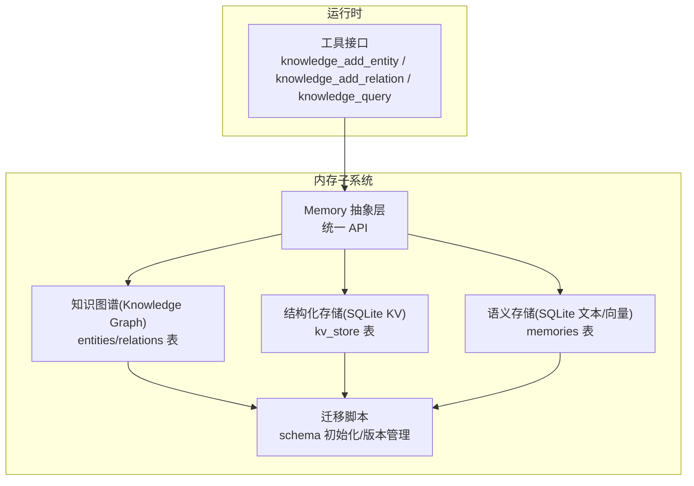
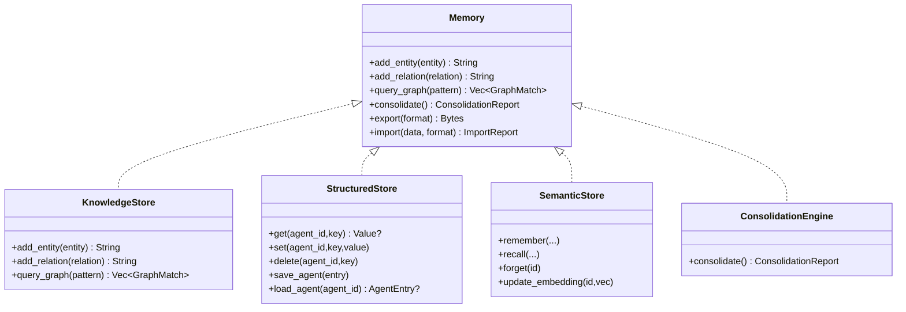
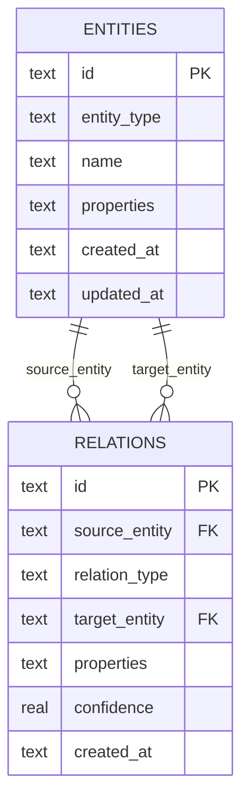
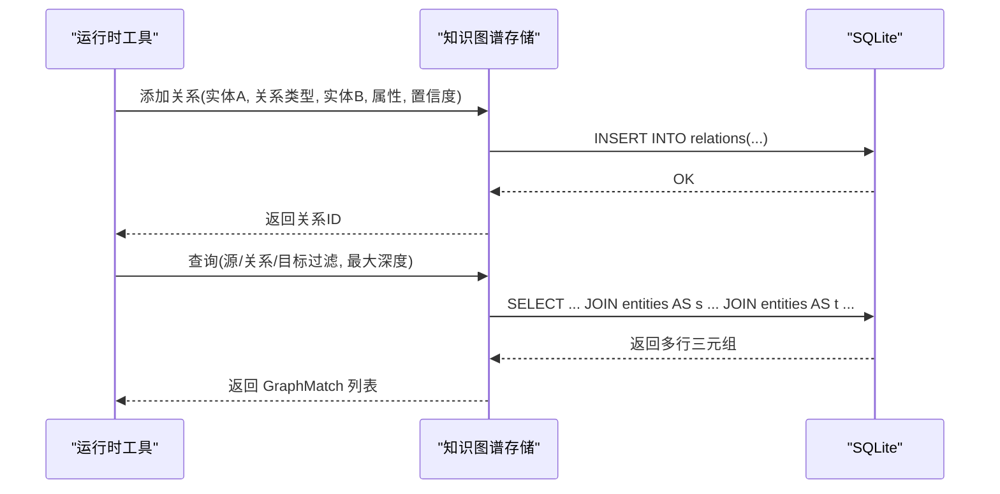
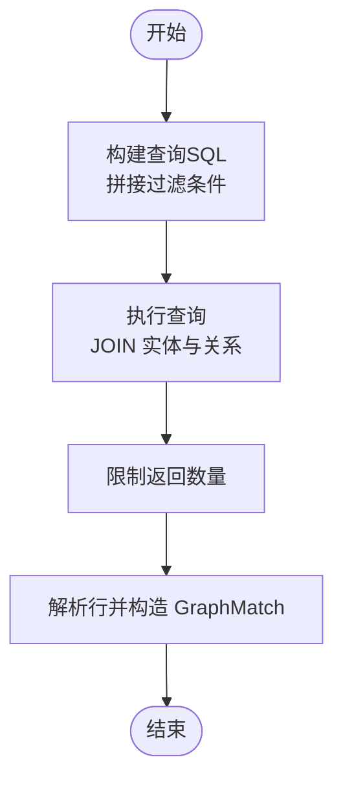
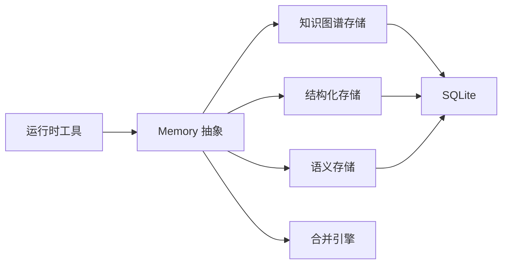

# 知识图谱

<cite>
**本文引用的文件**
- [knowledge.rs](file://crates/openfang-memory/src/knowledge.rs)
- [memory.rs](file://crates/openfang-types/src/memory.rs)
- [migration.rs](file://crates/openfang-memory/src/migration.rs)
- [substrate.rs](file://crates/openfang-memory/src/substrate.rs)
- [structured.rs](file://crates/openfang-memory/src/structured.rs)
- [semantic.rs](file://crates/openfang-memory/src/semantic.rs)
- [consolidation.rs](file://crates/openfang-memory/src/consolidation.rs)
- [tool_runner.rs](file://crates/openfang-runtime/src/tool_runner.rs)
- [lib.rs](file://crates/openfang-memory/src/lib.rs)
</cite>

## 目录
1. [简介](#简介)
2. [项目结构](#项目结构)
3. [核心组件](#核心组件)
4. [架构总览](#架构总览)
5. [详细组件分析](#详细组件分析)
6. [依赖分析](#依赖分析)
7. [性能考量](#性能考量)
8. [故障排查指南](#故障排查指南)
9. [结论](#结论)
10. [附录](#附录)

## 简介
本文件面向 OpenFang 的“知识图谱”模块，系统性阐述其数据模型（实体与关系）、图数据库实现策略、知识表示方法、节点与边的数据结构、关系推理机制、图遍历算法、图查询示例、关系挖掘思路、知识更新策略，以及与结构化存储的集成方式，并提供可视化与分析工具的使用建议。

## 项目结构
知识图谱能力由内存子系统统一抽象，底层以 SQLite 作为持久化后端，配合迁移脚本初始化表结构；运行时通过工具接口暴露知识图谱的增删改查能力；同时与结构化存储、语义存储共同构成统一的 Memory 抽象层。

**图表来源**
- [lib.rs:1-20](file://crates/openfang-memory/src/lib.rs#L1-L20)
- [migration.rs:74-186](file://crates/openfang-memory/src/migration.rs#L74-L186)
- [knowledge.rs:15-25](file://crates/openfang-memory/src/knowledge.rs#L15-L25)
- [structured.rs:9-13](file://crates/openfang-memory/src/structured.rs#L9-L13)
- [semantic.rs:19-23](file://crates/openfang-memory/src/semantic.rs#L19-L23)
- [tool_runner.rs:813-831](file://crates/openfang-runtime/src/tool_runner.rs#L813-L831)

**章节来源**
- [lib.rs:1-20](file://crates/openfang-memory/src/lib.rs#L1-L20)

## 核心组件
- 知识图谱存储：基于 SQLite 的实体与关系表，支持图模式查询与 JSON 序列化的关系类型与属性。
- 运行时工具：提供知识图谱的实体/关系添加与查询工具，输入参数映射到 GraphPattern。
- 内存子系统：统一 Memory 抽象，将知识图谱、结构化存储、语义存储整合为一致的 API。
- 迁移脚本：负责首次启动时创建知识图谱相关表及索引，并维护 schema 版本。

**章节来源**
- [knowledge.rs:15-25](file://crates/openfang-memory/src/knowledge.rs#L15-L25)
- [memory.rs:258-335](file://crates/openfang-types/src/memory.rs#L258-L335)
- [migration.rs:74-186](file://crates/openfang-memory/src/migration.rs#L74-L186)
- [tool_runner.rs:813-831](file://crates/openfang-runtime/src/tool_runner.rs#L813-L831)

## 架构总览
知识图谱在系统中的位置如下：

**图表来源**
- [memory.rs:258-335](file://crates/openfang-types/src/memory.rs#L258-L335)
- [knowledge.rs:15-25](file://crates/openfang-memory/src/knowledge.rs#L15-L25)
- [structured.rs:9-13](file://crates/openfang-memory/src/structured.rs#L9-L13)
- [semantic.rs:19-23](file://crates/openfang-memory/src/semantic.rs#L19-L23)
- [consolidation.rs:12-18](file://crates/openfang-memory/src/consolidation.rs#L12-L18)

## 详细组件分析

### 数据模型与存储
- 实体（Entity）：包含唯一标识、类型、名称、任意属性、创建/更新时间。
- 关系（Relation）：包含源实体、关系类型、目标实体、关系属性、置信度、创建时间。
- 关系类型（RelationType）：内置若干常用关系，如工作于、隶属于、位于、部分/整体、使用/产生等，支持自定义。
- 图模式（GraphPattern）：用于查询的过滤条件（源/关系/目标），以及最大遍历深度。
- 图匹配结果（GraphMatch）：返回三元组（源实体、关系、目标实体）。

**图表来源**
- [migration.rs:150-172](file://crates/openfang-memory/src/migration.rs#L150-L172)
- [memory.rs:115-171](file://crates/openfang-types/src/memory.rs#L115-L171)
- [memory.rs:173-199](file://crates/openfang-types/src/memory.rs#L173-L199)
- [memory.rs:201-223](file://crates/openfang-types/src/memory.rs#L201-L223)

**章节来源**
- [memory.rs:115-199](file://crates/openfang-types/src/memory.rs#L115-L199)
- [memory.rs:201-223](file://crates/openfang-types/src/memory.rs#L201-L223)
- [migration.rs:150-172](file://crates/openfang-memory/src/migration.rs#L150-L172)

### 图数据库实现策略
- 存储引擎：SQLite（rusqlite）。
- 模式设计：实体表与关系表，关系表包含源/目标外键、关系类型、属性、置信度、时间戳。
- 查询策略：单次 JOIN 查询返回三元组，按过滤条件动态拼接 WHERE 条件，限制返回条数。
- 类型序列化：关系类型与属性以 JSON 字符串存储，便于扩展与兼容。

**图表来源**
- [knowledge.rs:53-80](file://crates/openfang-memory/src/knowledge.rs#L53-L80)
- [knowledge.rs:82-196](file://crates/openfang-memory/src/knowledge.rs#L82-L196)
- [migration.rs:160-172](file://crates/openfang-memory/src/migration.rs#L160-L172)

**章节来源**
- [knowledge.rs:53-80](file://crates/openfang-memory/src/knowledge.rs#L53-L80)
- [knowledge.rs:82-196](file://crates/openfang-memory/src/knowledge.rs#L82-L196)

### 知识表示与推理
- 知识表示：以实体与关系为核心，关系可携带属性与置信度，便于表达复杂语义。
- 推理机制：当前实现为基于模式的精确匹配查询，未见内置规则引擎或路径推理逻辑。可通过查询模式组合与多跳查询（受 max_depth 限制）进行简单推断。
- 关系挖掘：可在外部流程中对文本进行实体抽取与关系抽取，再调用知识图谱写入接口批量入库。

**章节来源**
- [memory.rs:156-171](file://crates/openfang-types/src/memory.rs#L156-L171)
- [memory.rs:173-199](file://crates/openfang-types/src/memory.rs#L173-L199)
- [knowledge.rs:82-196](file://crates/openfang-memory/src/knowledge.rs#L82-L196)

### 图遍历与查询算法
- 单次查询：通过 SQL JOIN 将实体与关系连接，按过滤条件筛选并限制返回数量。
- 遍历深度：通过 GraphPattern 的 max_depth 字段控制查询深度（当前实现中该字段存在但未在 SQL 中直接体现，实际深度由查询语句与过滤条件决定）。
- 性能要点：为关系表建立索引（源、目标、关系类型），有助于提升查询效率。

**图表来源**
- [knowledge.rs:82-196](file://crates/openfang-memory/src/knowledge.rs#L82-L196)
- [migration.rs:160-172](file://crates/openfang-memory/src/migration.rs#L160-L172)

**章节来源**
- [knowledge.rs:82-196](file://crates/openfang-memory/src/knowledge.rs#L82-L196)

### 知识更新策略
- 新增实体/关系：通过工具接口或直接调用知识图谱存储的写入方法，生成唯一 ID 并持久化。
- 置信度衰减：通过内存子系统的合并引擎定期降低长时间未访问的记忆置信度（语义记忆），知识图谱当前未见专门的置信度衰减逻辑。
- 导入导出：Memory 抽象提供导出/导入接口，知识图谱当前导出实现为空，后续可扩展为实体/关系的序列化输出。

**章节来源**
- [tool_runner.rs:813-831](file://crates/openfang-runtime/src/tool_runner.rs#L813-L831)
- [tool_runner.rs:1833-1895](file://crates/openfang-runtime/src/tool_runner.rs#L1833-L1895)
- [tool_runner.rs:1897-1932](file://crates/openfang-runtime/src/tool_runner.rs#L1897-L1932)
- [consolidation.rs:26-53](file://crates/openfang-memory/src/consolidation.rs#L26-L53)
- [memory.rs:326-334](file://crates/openfang-types/src/memory.rs#L326-L334)

### 与结构化存储的集成
- 结构化存储：KV 键值对、代理状态、会话等以 SQLite 表保存，提供 get/set/delete 等操作。
- 集成点：知识图谱与结构化存储共享同一 SQLite 连接，迁移脚本统一初始化，二者在同一事务边界内协同工作。
- 使用场景：将知识图谱实体的元信息、来源渠道等以键值形式存入结构化存储，实现跨模块数据共享。

**章节来源**
- [structured.rs:21-80](file://crates/openfang-memory/src/structured.rs#L21-L80)
- [migration.rs:74-186](file://crates/openfang-memory/src/migration.rs#L74-L186)

### 可视化与分析工具使用指南
- 运行时工具输出：知识图谱查询工具返回格式化的三元组列表，包含实体名、类型、关系与置信度，便于快速审阅。
- 建议的可视化方案：
  - 将 GraphMatch 结果导出为标准图数据格式（如 JSON-LD 或三元组 CSV），交由外部可视化工具（如 Gephi、Cytoscape、D3.js）渲染。
  - 在前端页面中基于 SVG 或 Canvas 绘制节点与边，结合交互实现点击高亮、邻域展开、属性面板等功能。
  - 对关系置信度进行着色分级，辅助判断关系可靠性。
- 分析维度：可统计实体类型分布、关系类型分布、中心性指标、社区发现等（需在外部工具完成）。

**章节来源**
- [tool_runner.rs:1897-1932](file://crates/openfang-runtime/src/tool_runner.rs#L1897-L1932)

## 依赖分析
- 组件耦合：
  - Memory 抽象统一了知识图谱、结构化存储、语义存储与合并引擎的调用入口。
  - 知识图谱存储依赖 SQLite 连接与迁移脚本提供的表结构。
  - 运行时工具通过 KernelHandle 调用知识图谱 API，输入参数映射到 GraphPattern。
- 外部依赖：
  - rusqlite：SQLite 访问。
  - serde / serde_json：实体/关系/属性的序列化。
  - uuid / chrono：ID 与时间戳处理。

**图表来源**
- [memory.rs:258-335](file://crates/openfang-types/src/memory.rs#L258-L335)
- [substrate.rs:640-671](file://crates/openfang-memory/src/substrate.rs#L640-L671)
- [knowledge.rs:15-25](file://crates/openfang-memory/src/knowledge.rs#L15-L25)
- [structured.rs:9-13](file://crates/openfang-memory/src/structured.rs#L9-L13)
- [semantic.rs:19-23](file://crates/openfang-memory/src/semantic.rs#L19-L23)
- [consolidation.rs:12-18](file://crates/openfang-memory/src/consolidation.rs#L12-L18)

**章节来源**
- [memory.rs:258-335](file://crates/openfang-types/src/memory.rs#L258-L335)
- [substrate.rs:640-671](file://crates/openfang-memory/src/substrate.rs#L640-L671)

## 性能考量
- 查询性能：为关系表建立索引（源、目标、关系类型）可显著提升过滤与 JOIN 性能。
- 返回限制：查询默认限制返回数量，避免一次性返回大量结果导致内存压力。
- 置信度衰减：语义存储具备置信度衰减逻辑，知识图谱可借鉴此策略对长期未使用的边进行降权或清理。
- 批量写入：对外部关系挖掘流程，建议采用批量插入以减少事务开销。

[本节为通用指导，无需特定文件引用]

## 故障排查指南
- 迁移失败：检查迁移脚本是否成功执行，确认 schema 版本与表结构是否存在差异。
- 查询无结果：确认过滤条件（源/关系/目标）是否正确，必要时放宽条件验证数据是否存在。
- 序列化错误：检查实体/关系类型与属性的 JSON 序列化是否正确，避免非法字符或类型不匹配。
- 并发问题：知识图谱存储使用互斥锁保护连接，注意避免长时间持有锁导致阻塞。

**章节来源**
- [migration.rs:10-47](file://crates/openfang-memory/src/migration.rs#L10-L47)
- [knowledge.rs:53-80](file://crates/openfang-memory/src/knowledge.rs#L53-L80)
- [knowledge.rs:82-196](file://crates/openfang-memory/src/knowledge.rs#L82-L196)

## 结论
OpenFang 的知识图谱模块以 SQLite 为持久化基础，通过清晰的数据模型与统一的 Memory 抽象，实现了实体与关系的高效存储与查询。当前以模式匹配为主，未来可扩展为多跳推理与关系挖掘。与结构化存储、语义存储的协同，使知识图谱成为统一记忆体系的重要组成部分。建议在生产环境中完善索引、置信度衰减与可视化工具链，以支撑更大规模的知识管理与分析需求。

[本节为总结性内容，无需特定文件引用]

## 附录

### 图查询示例（基于工具接口）
- 添加实体
  - 工具名：knowledge_add_entity
  - 输入：name、entity_type、properties（可选）
  - 输出：实体 ID
- 添加关系
  - 工具名：knowledge_add_relation
  - 输入：source、relation、target、properties（可选）、confidence（可选）
  - 输出：关系 ID
- 查询图
  - 工具名：knowledge_query
  - 输入：source（可选）、relation（可选）、target（可选）、max_depth（可选，默认 1）
  - 输出：匹配的三元组列表（含实体名/类型、关系类型/置信度）

**章节来源**
- [tool_runner.rs:813-831](file://crates/openfang-runtime/src/tool_runner.rs#L813-L831)
- [tool_runner.rs:1833-1895](file://crates/openfang-runtime/src/tool_runner.rs#L1833-L1895)
- [tool_runner.rs:1897-1932](file://crates/openfang-runtime/src/tool_runner.rs#L1897-L1932)