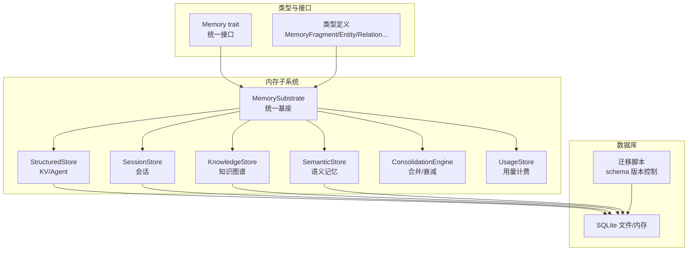
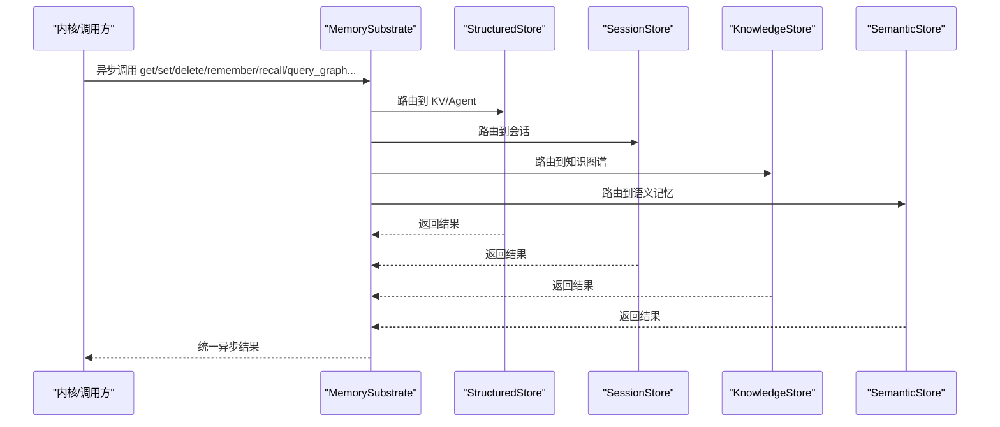
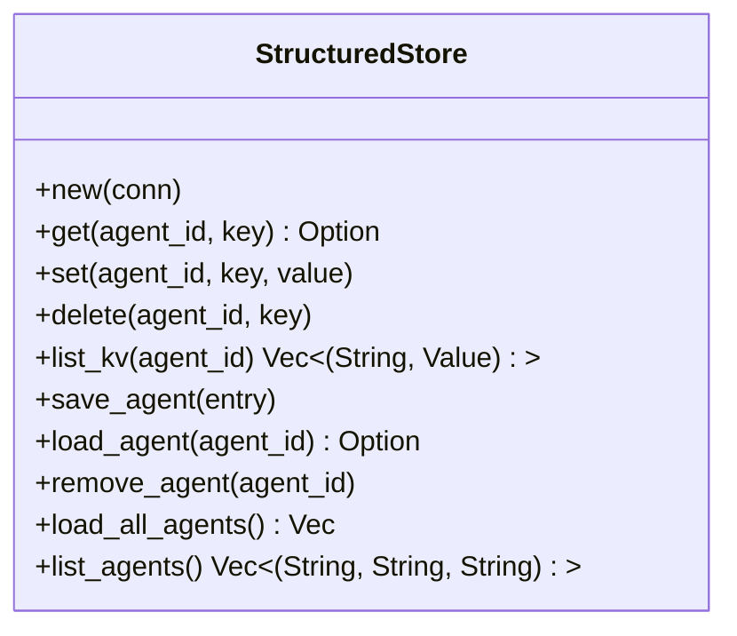
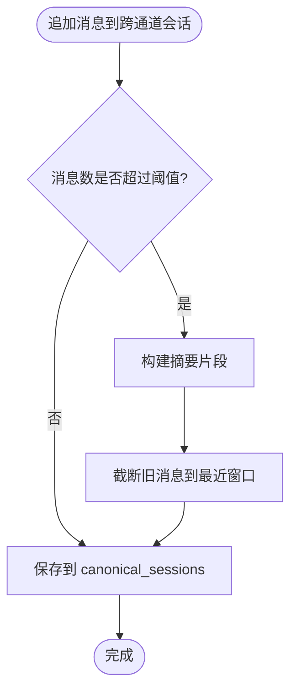
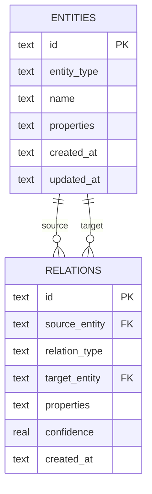
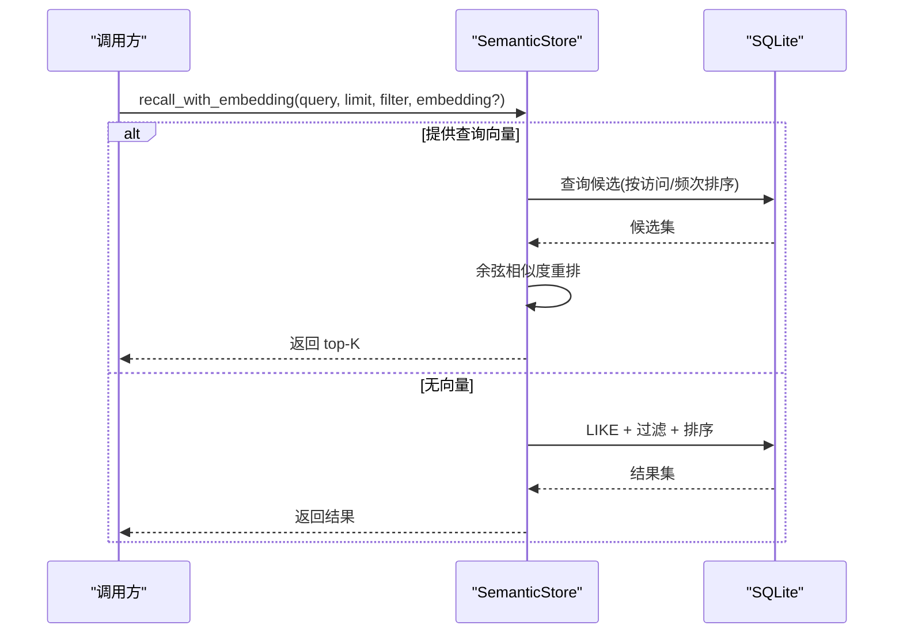
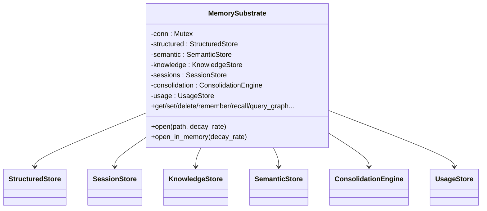
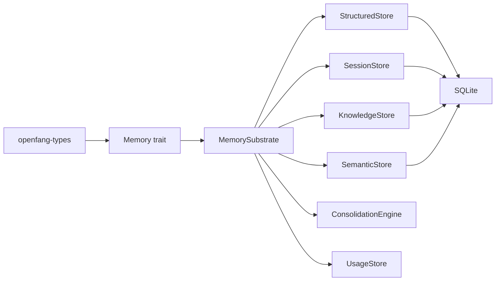

# 结构化存储

<cite>
**本文引用的文件**
- [lib.rs](file://crates/openfang-memory/src/lib.rs)
- [structured.rs](file://crates/openfang-memory/src/structured.rs)
- [session.rs](file://crates/openfang-memory/src/session.rs)
- [knowledge.rs](file://crates/openfang-memory/src/knowledge.rs)
- [semantic.rs](file://crates/openfang-memory/src/semantic.rs)
- [migration.rs](file://crates/openfang-memory/src/migration.rs)
- [substrate.rs](file://crates/openfang-memory/src/substrate.rs)
- [memory.rs](file://crates/openfang-types/src/memory.rs)
- [consolidation.rs](file://crates/openfang-memory/src/consolidation.rs)
- [usage.rs](file://crates/openfang-memory/src/usage.rs)
- [kernel.rs](file://crates/openfang-kernel/src/kernel.rs)
</cite>

## 目录
1. [简介](#简介)
2. [项目结构](#项目结构)
3. [核心组件](#核心组件)
4. [架构总览](#架构总览)
5. [详细组件分析](#详细组件分析)
6. [依赖关系分析](#依赖关系分析)
7. [性能考量](#性能考量)
8. [故障排查指南](#故障排查指南)
9. [结论](#结论)
10. [附录](#附录)

## 简介
本技术文档聚焦 OpenFang 的结构化存储模块，系统性阐述基于 SQLite 的键值对存储、会话状态管理、智能体状态持久化，以及与知识图谱、语义存储的协同机制。文档覆盖数据表结构设计、索引策略、事务处理、CRUD 示例、查询优化技巧、数据完整性约束，并提供备份恢复与迁移方案。

## 项目结构
结构化存储位于 openfang-memory 子工程中，采用“统一内存基座 + 多后端”的分层设计：
- 统一接口：Memory trait 抽象出 KV、语义、知识图谱等能力
- 基座实现：MemorySubstrate 聚合 StructuredStore、SemanticStore、KnowledgeStore、SessionStore、ConsolidationEngine、UsageStore
- 后端实现：StructuredStore（KV + Agent）、SessionStore（会话）、KnowledgeStore（实体-关系）、SemanticStore（向量检索）
- 迁移与版本：migration.rs 提供 schema 版本管理与增量迁移
- 类型定义：openfang-types 提供统一的数据模型与接口

图表来源
- [substrate.rs:28-75](file://crates/openfang-memory/src/substrate.rs#L28-L75)
- [structured.rs:10-19](file://crates/openfang-memory/src/structured.rs#L10-L19)
- [session.rs:27-31](file://crates/openfang-memory/src/session.rs#L27-L31)
- [knowledge.rs:15-19](file://crates/openfang-memory/src/knowledge.rs#L15-L19)
- [semantic.rs:19-23](file://crates/openfang-memory/src/semantic.rs#L19-L23)
- [consolidation.rs:12-18](file://crates/openfang-memory/src/consolidation.rs#L12-L18)
- [usage.rs:70-74](file://crates/openfang-memory/src/usage.rs#L70-L74)
- [migration.rs:74-186](file://crates/openfang-memory/src/migration.rs#L74-L186)

章节来源
- [lib.rs:1-20](file://crates/openfang-memory/src/lib.rs#L1-L20)
- [substrate.rs:26-75](file://crates/openfang-memory/src/substrate.rs#L26-L75)

## 核心组件
- StructuredStore：键值对存储（KV）与智能体状态持久化，支持并发安全连接封装
- SessionStore：会话历史加载/保存、跨通道持久化（canonical sessions）、消息压缩与摘要
- KnowledgeStore：实体与关系的增删查改，图模式查询
- SemanticStore：语义记忆的新增、召回、软删除、向量嵌入更新；支持文本回退与向量重排
- ConsolidationEngine：记忆合并与置信度衰减（阶段 1 不合并，仅衰减）
- UsageStore：用量事件记录与多粒度统计查询
- MemorySubstrate：统一入口，聚合各子存储并暴露 Memory trait

章节来源
- [structured.rs:10-440](file://crates/openfang-memory/src/structured.rs#L10-L440)
- [session.rs:27-516](file://crates/openfang-memory/src/session.rs#L27-L516)
- [knowledge.rs:15-196](file://crates/openfang-memory/src/knowledge.rs#L15-L196)
- [semantic.rs:19-307](file://crates/openfang-memory/src/semantic.rs#L19-L307)
- [consolidation.rs:12-53](file://crates/openfang-memory/src/consolidation.rs#L12-L53)
- [usage.rs:70-351](file://crates/openfang-memory/src/usage.rs#L70-L351)
- [substrate.rs:26-569](file://crates/openfang-memory/src/substrate.rs#L26-L569)

## 架构总览
统一内存基座通过共享 SQLite 连接，将 KV/会话/知识图谱/语义记忆/用量/合并等能力整合为单一异步接口。运行时通过迁移脚本确保 schema 最新，WAL 模式提升并发写入性能。

图表来源
- [substrate.rs:571-681](file://crates/openfang-memory/src/substrate.rs#L571-L681)
- [structured.rs:21-80](file://crates/openfang-memory/src/structured.rs#L21-L80)
- [session.rs:39-101](file://crates/openfang-memory/src/session.rs#L39-L101)
- [knowledge.rs:27-80](file://crates/openfang-memory/src/knowledge.rs#L27-L80)
- [semantic.rs:31-81](file://crates/openfang-memory/src/semantic.rs#L31-L81)

## 详细组件分析

### 键值对与智能体状态持久化（StructuredStore）
- 数据模型
  - kv_store：按 agent_id + key 唯一定位，value 为 JSON Blob，带版本号与更新时间
  - agents：智能体注册表，manifest 使用 MessagePack 编码，state 为 JSON 字符串，新增 session_id 与 identity 列用于兼容
- 并发与事务
  - 通过 Arc<Mutex<Connection>> 包装连接，所有操作在互斥锁保护下执行，避免竞态
  - 使用 SQLite 的 INSERT ... ON CONFLICT 实现幂等写入与版本递增
- 主要操作
  - get/set/delete/list_kv：标准 KV CRUD
  - save_agent/load_agent/remove_agent：智能体注册、加载、删除
  - load_all_agents：带兼容性修复与去重逻辑
- 完整性与兼容
  - 运行时动态添加列（如 session_id、identity），保证向前兼容
  - 严格错误转换与返回类型，便于上层统一处理

图表来源
- [structured.rs:10-440](file://crates/openfang-memory/src/structured.rs#L10-L440)

章节来源
- [structured.rs:21-240](file://crates/openfang-memory/src/structured.rs#L21-L240)
- [structured.rs:256-414](file://crates/openfang-memory/src/structured.rs#L256-L414)

### 会话状态管理（SessionStore 与 Canonical Sessions）
- 数据模型
  - sessions：每个会话一条记录，messages 为 Message 数组的二进制序列化
  - canonical_sessions：跨通道持久化的“主会话”，按 agent_id 唯一
- 功能特性
  - 会话创建、保存、删除、列表与标签管理
  - 跨通道上下文：append_canonical 将不同渠道的消息汇聚到同一 canonical 会话
  - 智能压缩：当消息数量超过阈值时，生成摘要并保留最近若干条消息
  - JSONL 镜像导出：将会话内容导出为人类可读的 JSONL 文件
- 查询与上下文注入
  - canonical_context 返回摘要与最近消息窗口，用于提示词注入

图表来源
- [session.rs:410-475](file://crates/openfang-memory/src/session.rs#L410-L475)

章节来源
- [session.rs:39-260](file://crates/openfang-memory/src/session.rs#L39-L260)
- [session.rs:362-516](file://crates/openfang-memory/src/session.rs#L362-L516)

### 知识图谱（KnowledgeStore）
- 数据模型
  - entities：实体表，含类型、名称、属性、时间戳
  - relations：关系表，含源实体、关系类型、目标实体、属性、置信度、时间戳
- 查询能力
  - 支持按源/关系/目标过滤的三元组查询，最多返回限定条目
  - 关系类型与实体类型均以 JSON 文本存储，便于扩展
- 索引策略
  - relations 表对 source_entity/target_entity/relation_type 建有索引，加速图遍历

图表来源
- [migration.rs:150-172](file://crates/openfang-memory/src/migration.rs#L150-L172)
- [knowledge.rs:27-80](file://crates/openfang-memory/src/knowledge.rs#L27-L80)

章节来源
- [knowledge.rs:82-196](file://crates/openfang-memory/src/knowledge.rs#L82-L196)
- [migration.rs:150-172](file://crates/openfang-memory/src/migration.rs#L150-L172)

### 语义记忆（SemanticStore）与向量检索
- 数据模型
  - memories：内容、来源、范围、置信度、元数据、访问统计、软删除标记、可选 embedding
- 回忆策略
  - 文本回退：无向量时使用 LIKE 模糊匹配
  - 向量检索：提供查询向量时，先拉取候选再按余弦相似度重排
  - 访问统计：每次召回增加 access_count 与 accessed_at
- 索引策略
  - 对 agent_id 与 scope 建有索引，加速过滤与排序
- 嵌入存储
  - embedding 以小端序字节流存储，便于快速序列化/反序列化

图表来源
- [semantic.rs:95-277](file://crates/openfang-memory/src/semantic.rs#L95-L277)
- [migration.rs:215-227](file://crates/openfang-memory/src/migration.rs#L215-L227)

章节来源
- [semantic.rs:31-277](file://crates/openfang-memory/src/semantic.rs#L31-L277)
- [migration.rs:133-149](file://crates/openfang-memory/src/migration.rs#L133-L149)

### 统一内存基座（MemorySubstrate）
- 组成与职责
  - 统一封装各子存储，提供异步 API；内部使用共享连接与互斥锁
  - 提供任务队列、设备配对、用量统计等扩展能力
- 与内核集成
  - 内核持有 Arc<MemorySubstrate>，作为统一内存入口
- 异步执行
  - 所有数据库写操作通过 tokio::task::spawn_blocking 在阻塞线程池执行，避免阻塞异步运行时

图表来源
- [substrate.rs:26-75](file://crates/openfang-memory/src/substrate.rs#L26-L75)

章节来源
- [substrate.rs:38-111](file://crates/openfang-memory/src/substrate.rs#L38-L111)
- [substrate.rs:571-681](file://crates/openfang-memory/src/substrate.rs#L571-L681)

### 类型与接口（openfang-types）
- Memory trait：统一的 KV、语义、知识图谱与维护操作接口
- MemoryFragment/Entity/Relation：语义记忆、实体、关系的标准数据结构
- MemoryFilter：召回过滤器，支持按 agent/source/scope/confidence/时间/元数据过滤

章节来源
- [memory.rs:258-335](file://crates/openfang-types/src/memory.rs#L258-L335)

## 依赖关系分析
- 组件耦合
  - MemorySubstrate 高内聚地组合各子存储，降低上层耦合
  - 各子存储均依赖共享连接，避免重复打开数据库
- 外部依赖
  - rusqlite：SQLite 访问
  - rmp-serde：MessagePack 序列化（智能体 manifest、会话消息）
  - serde_json：JSON 序列化（KV 值、元数据、实体/关系属性）
  - tokio：异步执行与阻塞任务调度
- 可能的循环依赖
  - 未发现直接循环依赖；类型定义与实现分离清晰

图表来源
- [substrate.rs:14-25](file://crates/openfang-memory/src/substrate.rs#L14-L25)
- [memory.rs:258-335](file://crates/openfang-types/src/memory.rs#L258-L335)

章节来源
- [substrate.rs:14-25](file://crates/openfang-memory/src/substrate.rs#L14-L25)
- [memory.rs:258-335](file://crates/openfang-types/src/memory.rs#L258-L335)

## 性能考量
- WAL 模式与忙等待
  - 开启 WAL 模式与合理的 busy_timeout，提升并发写入吞吐与稳定性
- 索引策略
  - sessions：按 agent_id、label、created_at 建有索引，支持会话列表与标签查询
  - memories：按 agent_id、scope 建有索引，加速语义召回过滤
  - relations：按 source_entity、target_entity、relation_type 建有索引，加速图查询
- 向量检索优化
  - 无查询向量时使用 LIKE 回退；有向量时先拉取更多候选再重排，平衡准确率与性能
- 访问统计与衰减
  - recall 时更新 access_count 与 accessed_at，配合合并引擎进行置信度衰减
- 异步写入
  - 所有写操作在阻塞线程池执行，避免阻塞 Tokio 运行时

章节来源
- [substrate.rs:40-44](file://crates/openfang-memory/src/substrate.rs#L40-L44)
- [migration.rs:106-172](file://crates/openfang-memory/src/migration.rs#L106-L172)
- [semantic.rs:107-156](file://crates/openfang-memory/src/semantic.rs#L107-L156)
- [consolidation.rs:26-53](file://crates/openfang-memory/src/consolidation.rs#L26-L53)

## 故障排查指南
- 常见错误类型
  - 内部错误：互斥锁失败、序列化/反序列化异常
  - 内存错误：SQL 执行失败、查询无结果
  - 参数错误：UUID 解析失败、时间解析失败
- 定位方法
  - 检查迁移是否成功（schema 版本与表存在）
  - 核对连接状态与 busy_timeout 设置
  - 观察日志中的 warn/info 条目（如重复名称、不兼容 manifest 等）
- 典型问题
  - 读取 agent 时字段缺失：迁移脚本会自动添加列，确认 schema 版本
  - 会话为空或消息丢失：检查 sessions/canonical_sessions 表是否存在
  - 语义召回为空：确认是否提供 embedding 或数据库中已有 embedding

章节来源
- [structured.rs:160-240](file://crates/openfang-memory/src/structured.rs#L160-L240)
- [session.rs:362-408](file://crates/openfang-memory/src/session.rs#L362-L408)
- [semantic.rs:95-101](file://crates/openfang-memory/src/semantic.rs#L95-L101)
- [migration.rs:50-72](file://crates/openfang-memory/src/migration.rs#L50-L72)

## 结论
OpenFang 的结构化存储以 SQLite 为核心，通过统一内存基座将 KV、会话、知识图谱与语义记忆有机整合。借助完善的迁移机制、索引策略与异步执行模型，系统在易用性与性能之间取得良好平衡。面向未来，可在语义存储引入更丰富的向量索引与合并策略，进一步提升召回质量与存储效率。

## 附录

### 数据库表结构与索引
- agents：主键 id，索引：无
- sessions：主键 id，索引：agent_id、label、created_at
- kv_store：复合主键 (agent_id, key)，索引：无
- memories：主键 id，索引：agent_id、scope
- entities：主键 id，索引：无
- relations：主键 id，索引：source_entity、target_entity、relation_type
- canonical_sessions：主键 agent_id，索引：无
- usage_events：主键 id，索引：agent_id、timestamp、action
- migrations：主键 version，索引：无

章节来源
- [migration.rs:74-329](file://crates/openfang-memory/src/migration.rs#L74-L329)

### 事务与一致性
- 幂等写入：KV 使用 INSERT ... ON CONFLICT 实现，避免重复写入
- 会话更新：使用 ON CONFLICT 更新消息与标签，保持原子性
- 删除策略：软删除（memories.deleted 标记），便于审计与恢复
- 并发控制：互斥锁保护连接，避免竞态

章节来源
- [structured.rs:58-65](file://crates/openfang-memory/src/structured.rs#L58-L65)
- [session.rs:86-99](file://crates/openfang-memory/src/session.rs#L86-L99)
- [semantic.rs:280-291](file://crates/openfang-memory/src/semantic.rs#L280-L291)

### CRUD 操作示例（路径指引）
- KV
  - 设置键值：[set:46-66](file://crates/openfang-memory/src/structured.rs#L46-L66)
  - 获取键值：[get:21-43](file://crates/openfang-memory/src/structured.rs#L21-L43)
  - 删除键值：[delete:68-80](file://crates/openfang-memory/src/structured.rs#L68-L80)
  - 列出键值：[list_kv:82-111](file://crates/openfang-memory/src/structured.rs#L82-L111)
- 会话
  - 创建会话：[create_session:186-196](file://crates/openfang-memory/src/session.rs#L186-L196)
  - 保存会话：[save_session:77-101](file://crates/openfang-memory/src/session.rs#L77-L101)
  - 加载会话：[get_session:39-75](file://crates/openfang-memory/src/session.rs#L39-L75)
  - 删除会话：[delete_session:103-115](file://crates/openfang-memory/src/session.rs#L103-L115)
  - 追加跨通道消息：[append_canonical:410-475](file://crates/openfang-memory/src/session.rs#L410-L475)
- 知识图谱
  - 添加实体：[add_entity:27-51](file://crates/openfang-memory/src/knowledge.rs#L27-L51)
  - 添加关系：[add_relation:53-80](file://crates/openfang-memory/src/knowledge.rs#L53-L80)
  - 图查询：[query_graph:82-196](file://crates/openfang-memory/src/knowledge.rs#L82-L196)
- 语义记忆
  - 新增记忆：[remember:31-81](file://crates/openfang-memory/src/semantic.rs#L31-L81)
  - 回忆检索：[recall:83-101](file://crates/openfang-memory/src/semantic.rs#L83-L101)
  - 软删除：[forget:279-291](file://crates/openfang-memory/src/semantic.rs#L279-L291)
  - 更新嵌入：[update_embedding:293-306](file://crates/openfang-memory/src/semantic.rs#L293-L306)

### 查询优化技巧
- 使用合适的过滤条件：优先按 agent_id、scope、source 等建立的索引过滤
- 向量检索：先扩大候选集再重排，减少不必要的相似度计算
- 访问统计：利用 access_count 与 accessed_at 排序，优先返回高频/近期记忆
- 会话压缩：合理设置阈值与窗口大小，平衡上下文长度与存储成本

章节来源
- [semantic.rs:107-156](file://crates/openfang-memory/src/semantic.rs#L107-L156)
- [session.rs:410-475](file://crates/openfang-memory/src/session.rs#L410-L475)

### 数据完整性约束
- 主键约束：各表均有明确主键，防止重复
- 外键约束：relations 的 source_entity/target_entity 引用 entities.id
- 默认值：kv_store.version、memories.confidence、memories.deleted 等字段具备默认值
- 时间戳：统一使用 RFC3339 字符串存储时间，便于跨语言解析

章节来源
- [migration.rs:74-186](file://crates/openfang-memory/src/migration.rs#L74-L186)
- [migration.rs:150-172](file://crates/openfang-memory/src/migration.rs#L150-L172)

### 备份、恢复与迁移
- 备份
  - 直接复制 SQLite 文件（生产环境建议停机或使用只读快照）
  - 导出 JSONL 会话镜像：[write_jsonl_mirror:528-618](file://crates/openfang-memory/src/session.rs#L528-L618)
- 恢复
  - 将备份文件复制回原位置，重启服务
  - 使用 JSONL 镜像重建会话（需自定义导入流程）
- 迁移
  - 自动迁移：启动时自动执行迁移脚本，确保 schema 版本一致
  - 版本追踪：通过 migrations 表记录已应用版本
  - 向后兼容：动态添加列，避免破坏现有数据

章节来源
- [migration.rs:10-48](file://crates/openfang-memory/src/migration.rs#L10-L48)
- [migration.rs:50-72](file://crates/openfang-memory/src/migration.rs#L50-L72)
- [session.rs:528-618](file://crates/openfang-memory/src/session.rs#L528-L618)

### 与内核的集成点
- 内核持有 MemorySubstrate 的 Arc 引用，作为统一内存入口
- 通过 Memory trait 对外暴露 KV/语义/知识图谱能力
- 用量统计与任务队列等扩展能力由 MemorySubstrate 提供

章节来源
- [kernel.rs:60-95](file://crates/openfang-kernel/src/kernel.rs#L60-L95)
- [substrate.rs:26-75](file://crates/openfang-memory/src/substrate.rs#L26-L75)