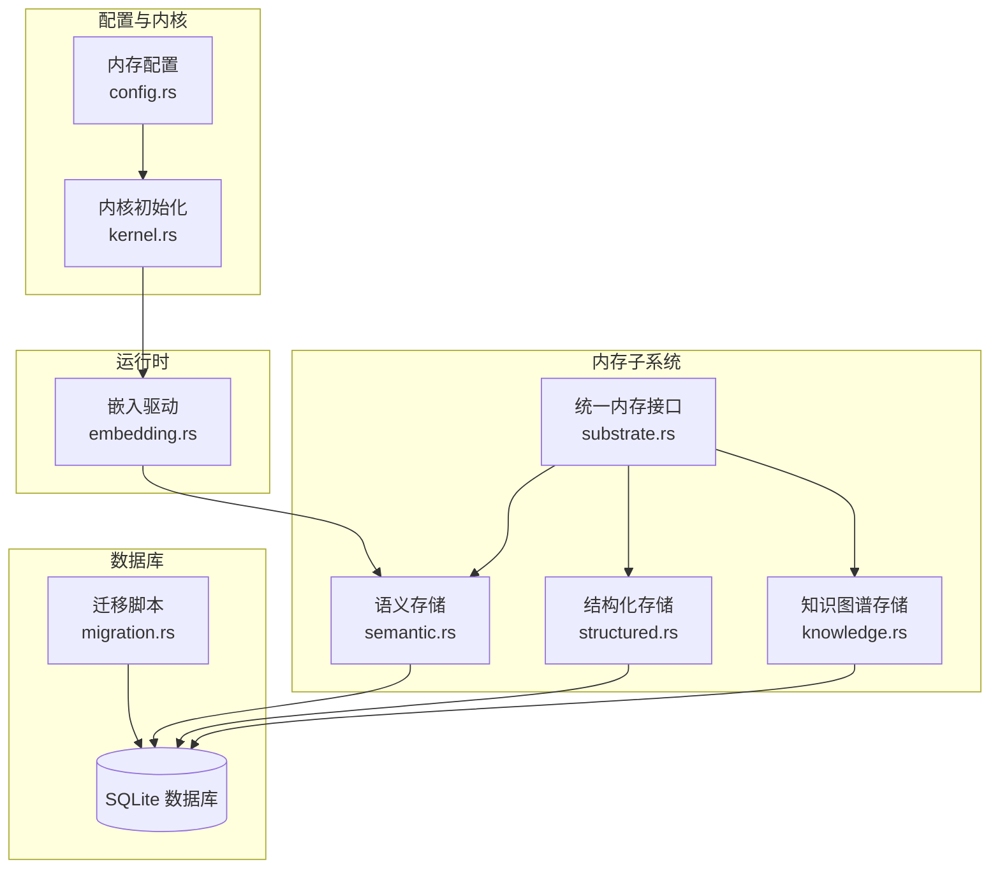
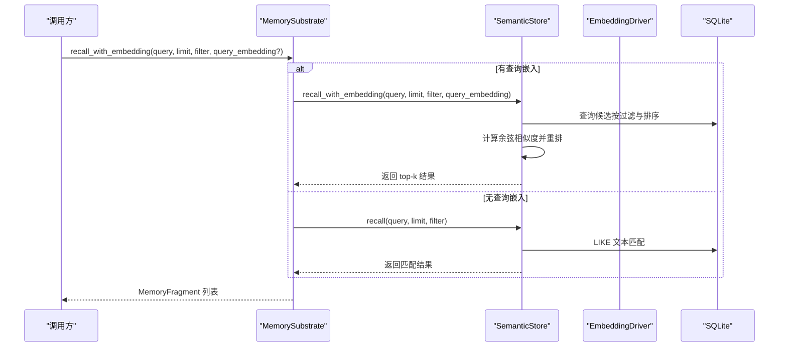
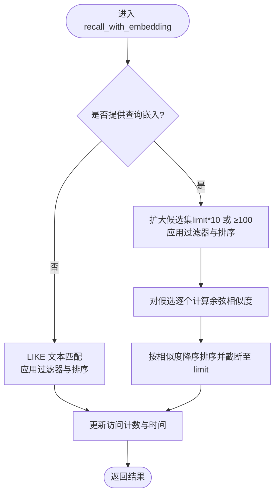
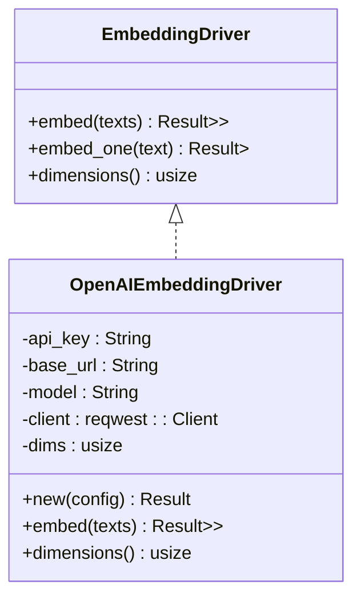
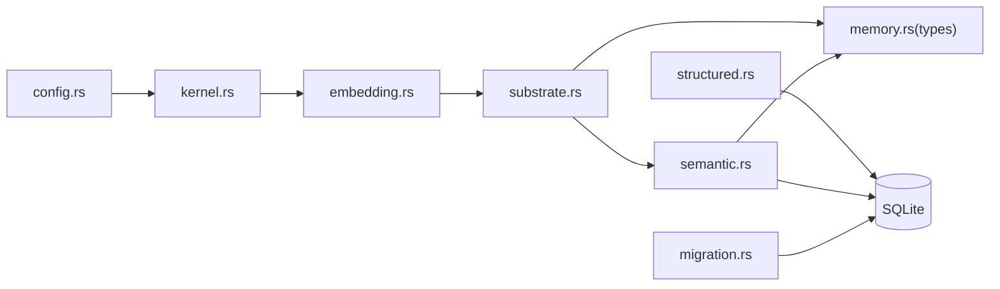

# 语义检索

<cite>
**本文引用的文件**
- [crates/openfang-memory/src/semantic.rs](file://crates/openfang-memory/src/semantic.rs)
- [crates/openfang-runtime/src/embedding.rs](file://crates/openfang-runtime/src/embedding.rs)
- [crates/openfang-memory/src/substrate.rs](file://crates/openfang-memory/src/substrate.rs)
- [crates/openfang-memory/src/migration.rs](file://crates/openfang-memory/src/migration.rs)
- [crates/openfang-types/src/memory.rs](file://crates/openfang-types/src/memory.rs)
- [crates/openfang-types/src/config.rs](file://crates/openfang-types/src/config.rs)
- [crates/openfang-kernel/src/kernel.rs](file://crates/openfang-kernel/src/kernel.rs)
- [crates/openfang-skills/bundled/vector-db/SKILL.md](file://crates/openfang-skills/bundled/vector-db/SKILL.md)
</cite>

## 目录
1. [简介](#简介)
2. [项目结构](#项目结构)
3. [核心组件](#核心组件)
4. [架构总览](#架构总览)
5. [详细组件分析](#详细组件分析)
6. [依赖关系分析](#依赖关系分析)
7. [性能考量](#性能考量)
8. [故障排查指南](#故障排查指南)
9. [结论](#结论)
10. [附录](#附录)

## 简介
本文件面向 OpenFang 的语义检索模块，系统性阐述其文本向量化、相似度计算与检索流程，并结合当前代码库中 SQLite 存储与本地嵌入驱动的实现，给出可操作的配置、使用与优化建议。文档同时覆盖与结构化存储的协同机制、检索结果排序与阈值调优、以及在现有架构下如何扩展到外部向量数据库（如 Qdrant）的思路。

## 项目结构
OpenFang 将记忆分为三类后端：
- 结构化存储：键值对、会话、代理状态等（SQLite）
- 语义存储：基于 SQLite 的文本/向量检索（LIKE 回退或向量重排）
- 知识图谱：实体与关系（SQLite）

语义检索位于 memory 子系统，通过统一的 Memory 接口对外提供能力；嵌入生成由运行时的 embedding 驱动完成；数据库模式由迁移脚本初始化并维护。

图表来源
- [crates/openfang-memory/src/semantic.rs](file://crates/openfang-memory/src/semantic.rs)
- [crates/openfang-memory/src/substrate.rs](file://crates/openfang-memory/src/substrate.rs)
- [crates/openfang-runtime/src/embedding.rs](file://crates/openfang-runtime/src/embedding.rs)
- [crates/openfang-types/src/config.rs](file://crates/openfang-types/src/config.rs)
- [crates/openfang-kernel/src/kernel.rs](file://crates/openfang-kernel/src/kernel.rs)
- [crates/openfang-memory/src/migration.rs](file://crates/openfang-memory/src/migration.rs)

章节来源
- [crates/openfang-memory/src/lib.rs](file://crates/openfang-memory/src/lib.rs)
- [crates/openfang-memory/src/substrate.rs](file://crates/openfang-memory/src/substrate.rs)

## 核心组件
- 语义存储（SemanticStore）：负责记忆的持久化、向量检索与回退匹配；支持按过滤条件查询、更新向量、访问计数统计。
- 嵌入驱动（EmbeddingDriver）：抽象通用嵌入接口，提供 OpenAI 兼容实现，支持多提供商与本地模型；负责维度推断与请求封装。
- 统一内存接口（MemorySubstrate）：聚合结构化、语义与知识图谱存储，暴露统一异步 API；在语义检索路径上桥接嵌入驱动与语义存储。
- 数据库迁移（migration.rs）：初始化表结构（含 memories 表与 embedding 列），确保 schema 版本管理。
- 类型与配置（memory.rs、config.rs）：定义 MemoryFragment、MemoryFilter、MemorySource 等类型，以及内存子系统的配置项（如 embedding_model、embedding_provider 等）。

章节来源
- [crates/openfang-memory/src/semantic.rs](file://crates/openfang-memory/src/semantic.rs)
- [crates/openfang-runtime/src/embedding.rs](file://crates/openfang-runtime/src/embedding.rs)
- [crates/openfang-memory/src/substrate.rs](file://crates/openfang-memory/src/substrate.rs)
- [crates/openfang-memory/src/migration.rs](file://crates/openfang-memory/src/migration.rs)
- [crates/openfang-types/src/memory.rs](file://crates/openfang-types/src/memory.rs)
- [crates/openfang-types/src/config.rs](file://crates/openfang-types/src/config.rs)

## 架构总览
OpenFang 的语义检索采用“阶段式”设计：
- 阶段 1：无嵌入时，使用 SQLite LIKE 匹配进行文本检索。
- 阶段 2：有查询嵌入时，先按过滤条件与时间序拉取候选集，再用余弦相似度对候选进行重排，最后截断返回。

图表来源
- [crates/openfang-memory/src/semantic.rs](file://crates/openfang-memory/src/semantic.rs)
- [crates/openfang-memory/src/substrate.rs](file://crates/openfang-memory/src/substrate.rs)

## 详细组件分析

### 语义存储（SemanticStore）
- 存储与检索
  - remember/remember_with_embedding：写入 content、source、scope、metadata、confidence、时间戳与可选 embedding。
  - recall/recall_with_embedding：支持过滤器（agent_id、scope、min_confidence、source、时间范围、metadata）、LIKE 回退与向量重排。
- 向量检索流程
  - 当提供 query_embedding 时，先扩大候选集（默认 limit×10 或至少 100），随后对每个候选计算余弦相似度并降序重排，最终截断至 limit。
  - 对于未嵌入的记忆，仍可参与 LIKE 匹配（当未提供查询嵌入时）。
- 嵌入序列化
  - embedding_to_bytes/embedding_from_bytes：将 f32 向量以小端字节序序列化为 SQLite BLOB，便于跨进程/线程安全传输与持久化。

图表来源
- [crates/openfang-memory/src/semantic.rs](file://crates/openfang-memory/src/semantic.rs)

章节来源
- [crates/openfang-memory/src/semantic.rs](file://crates/openfang-memory/src/semantic.rs)

### 嵌入驱动（EmbeddingDriver）
- 接口与实现
  - EmbeddingDriver：定义 embed/embed_one/dimensions，支持批量与单条嵌入计算。
  - OpenAIEmbeddingDriver：实现 OpenAI 兼容端点（/v1/embeddings），自动推断维度，支持自定义 base_url 与环境变量 API Key。
- 安全提示
  - 当非本地地址被检测到时，会发出警告，提醒外部 API 可能导致内容外发。
- 维度与模型
  - 内置常见模型维度映射；若响应维度与推断不一致，以实际响应为准。

图表来源
- [crates/openfang-runtime/src/embedding.rs](file://crates/openfang-runtime/src/embedding.rs)

章节来源
- [crates/openfang-runtime/src/embedding.rs](file://crates/openfang-runtime/src/embedding.rs)

### 统一内存接口（MemorySubstrate）
- 职责
  - 将结构化、语义与知识图谱存储组合为单一 Memory 接口；在语义检索路径上，负责将查询嵌入传递给语义存储，并在必要时在阻塞线程中执行 SQLite 操作。
- 关键方法
  - remember_with_embedding/forget/update_embedding：委托语义存储。
  - recall_with_embedding_async：在阻塞任务中执行 recall_with_embedding，避免阻塞 Tokio 运行时。
- 与内核的衔接
  - 内核根据配置自动创建嵌入驱动，并在需要时为查询生成嵌入，再交由 MemorySubstrate 执行检索。

章节来源
- [crates/openfang-memory/src/substrate.rs](file://crates/openfang-memory/src/substrate.rs)
- [crates/openfang-kernel/src/kernel.rs](file://crates/openfang-kernel/src/kernel.rs)

### 数据库模式与迁移
- 核心表
  - memories：包含 content、source、scope、metadata、confidence、created_at/accessed_at/access_count/deleted/embedding 等字段。
- 迁移
  - 在 v3 中新增 embedding 列，支持向量检索；后续版本逐步完善审计、用量、会话等表。
- 索引
  - 为 agent_id、scope 等常用过滤列建立索引，提升召回效率。

章节来源
- [crates/openfang-memory/src/migration.rs](file://crates/openfang-memory/src/migration.rs)

### 类型与配置
- MemoryFragment/MemoryFilter/MemorySource：定义检索单元、过滤条件与来源类型。
- MemoryConfig：控制 SQLite 路径、嵌入模型、提供商、API Key 环境变量、合并阈值与周期等。

章节来源
- [crates/openfang-types/src/memory.rs](file://crates/openfang-types/src/memory.rs)
- [crates/openfang-types/src/config.rs](file://crates/openfang-types/src/config.rs)

## 依赖关系分析
- 语义存储依赖 SQLite（rusqlite）与类型定义（openfang_types）。
- 嵌入驱动独立于语义存储，但通过统一接口被内核注入。
- 统一内存接口聚合三类存储，形成“门面”层。
- 迁移脚本确保数据库 schema 一致性。

图表来源
- [crates/openfang-runtime/src/embedding.rs](file://crates/openfang-runtime/src/embedding.rs)
- [crates/openfang-memory/src/substrate.rs](file://crates/openfang-memory/src/substrate.rs)
- [crates/openfang-memory/src/semantic.rs](file://crates/openfang-memory/src/semantic.rs)
- [crates/openfang-types/src/memory.rs](file://crates/openfang-types/src/memory.rs)
- [crates/openfang-types/src/config.rs](file://crates/openfang-types/src/config.rs)
- [crates/openfang-kernel/src/kernel.rs](file://crates/openfang-kernel/src/kernel.rs)
- [crates/openfang-memory/src/migration.rs](file://crates/openfang-memory/src/migration.rs)

章节来源
- [crates/openfang-memory/src/semantic.rs](file://crates/openfang-memory/src/semantic.rs)
- [crates/openfang-runtime/src/embedding.rs](file://crates/openfang-runtime/src/embedding.rs)
- [crates/openfang-memory/src/substrate.rs](file://crates/openfang-memory/src/substrate.rs)
- [crates/openfang-memory/src/migration.rs](file://crates/openfang-memory/src/migration.rs)
- [crates/openfang-types/src/memory.rs](file://crates/openfang-types/src/memory.rs)
- [crates/openfang-types/src/config.rs](file://crates/openfang-types/src/config.rs)
- [crates/openfang-kernel/src/kernel.rs](file://crates/openfang-kernel/src/kernel.rs)

## 性能考量
- 候选集扩大策略
  - 当存在查询嵌入时，默认扩大候选集（limit×10 或至少 100），以降低漏召回风险；重排后再截断，平衡准确率与延迟。
- 排序与截断
  - 使用余弦相似度对候选进行稳定排序，随后截断至 limit；访问计数与时间在返回后更新，用于后续衰减与排序。
- 索引与过滤
  - 利用 SQLite 索引（如 agent_id、scope）减少扫描范围；过滤器（agent_id、scope、min_confidence、source、时间窗、metadata）在 SQL 层应用，减少内存拷贝。
- 嵌入维度与网络开销
  - 嵌入维度影响向量大小与相似度计算成本；外部 API 会带来网络延迟与隐私风险，建议优先考虑本地模型或内网部署。
- 与结构化存储协同
  - 结构化存储适合精确键值检索与状态管理；语义存储适合模糊匹配与语义近似；两者可并行使用，按场景选择。

[本节为通用性能讨论，无需特定文件引用]

## 故障排查指南
- 无嵌入导致的回退
  - 若未提供查询嵌入，将回退到 LIKE 文本匹配；检查是否正确生成并传入查询嵌入。
- 候选不足或排序异常
  - 检查过滤条件是否过于严格；确认扩大候选集逻辑是否生效；验证 embedding 是否成功写入（memories 表 embedding 列）。
- 外部嵌入服务告警
  - 当检测到非本地 base_url 时会发出警告；请确认环境变量与自定义 URL 配置是否正确。
- 维度不匹配
  - 嵌入维度应与模型一致；若响应维度与推断不一致，以实际响应为准；确保查询与入库使用相同维度。
- SQLite 锁与超时
  - 运行时启用 WAL 模式与忙等待超时，避免并发写入冲突；如遇长时间锁等待，检查并发写入与事务边界。

章节来源
- [crates/openfang-runtime/src/embedding.rs](file://crates/openfang-runtime/src/embedding.rs)
- [crates/openfang-memory/src/semantic.rs](file://crates/openfang-memory/src/semantic.rs)
- [crates/openfang-memory/src/substrate.rs](file://crates/openfang-memory/src/substrate.rs)

## 结论
OpenFang 的语义检索在当前阶段以 SQLite 为核心，结合本地或外部嵌入驱动，实现了从文本到向量再到相似度重排的完整链路。其设计兼顾易用性与扩展性：既能在无嵌入时回退到 LIKE 匹配，又能在有嵌入时通过余弦相似度实现高质量检索。未来可在现有架构基础上引入外部向量数据库（如 Qdrant），以获得更高效的高维向量索引与查询能力，同时保留 SQLite 在结构化存储与元数据方面的优势。

## 附录

### 文本预处理与嵌入模型选择
- 预处理建议
  - 清洗噪声、标准化空白、保留关键结构（如代码块、表格）以便后续 chunking。
- 模型选择
  - 通用场景可选用开源模型（如 all-MiniLM-L6-v2），成本低、效果稳定；对专业领域可选用专用模型或微调后的嵌入。
- 与检索指标匹配
  - 选择与训练目标一致的距离度量（cosine 适用于归一化嵌入）。

章节来源
- [crates/openfang-skills/bundled/vector-db/SKILL.md](file://crates/openfang-skills/bundled/vector-db/SKILL.md)

### 向量索引策略与 Qdrant 集成思路
- 索引策略
  - HNSW、IVF、Flat 等各有权衡；需结合召回精度、内存占用与查询延迟进行选择。
- 与 SQLite 协同
  - SQLite 适合结构化数据与元数据过滤；向量数据库适合大规模高维相似度检索；可通过联合查询与结果融合（如 Reciprocal Rank Fusion）实现混合检索。
- 集成步骤（概念性）
  - 在入库时同时写入 SQLite 与外部向量数据库；检索时先用 SQLite 过滤元数据，再用向量数据库做相似度检索，最后融合排序。

章节来源
- [crates/openfang-skills/bundled/vector-db/SKILL.md](file://crates/openfang-skills/bundled/vector-db/SKILL.md)

### 语义搜索示例与阈值调整
- 示例流程
  - 输入查询 → 生成查询嵌入 → 通过 MemorySubstrate 调用语义存储 → 先扩大候选集 → 余弦相似度重排 → 截断返回。
- 相似度阈值
  - 可在应用层对最小相似度阈值进行裁剪，或在返回后按阈值过滤；阈值设置需结合业务召回与精度目标。
- 结果排序
  - 默认按相似度降序；可叠加访问计数、时间权重等进行二次排序。

章节来源
- [crates/openfang-memory/src/semantic.rs](file://crates/openfang-memory/src/semantic.rs)
- [crates/openfang-types/src/memory.rs](file://crates/openfang-types/src/memory.rs)

### 与结构化存储的协同工作机制
- 结构化存储
  - 适合精确键值检索、代理状态与会话管理；可作为语义检索前的过滤器，缩小候选范围。
- 协同方式
  - 先用结构化过滤（如 agent_id、scope、时间窗），再进行语义重排；或将结构化元数据作为检索特征参与融合。

章节来源
- [crates/openfang-memory/src/structured.rs](file://crates/openfang-memory/src/structured.rs)
- [crates/openfang-memory/src/semantic.rs](file://crates/openfang-memory/src/semantic.rs)