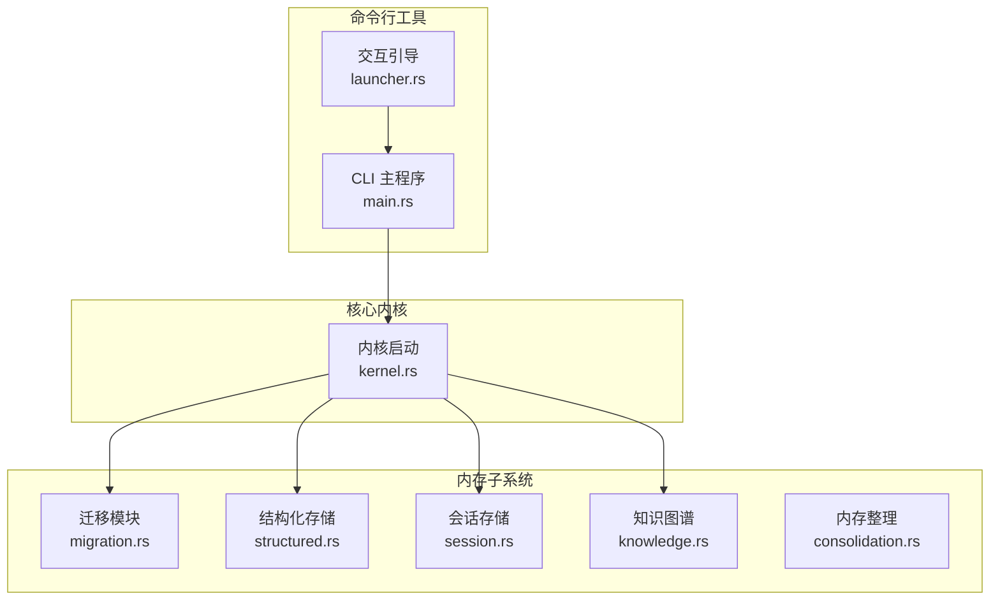
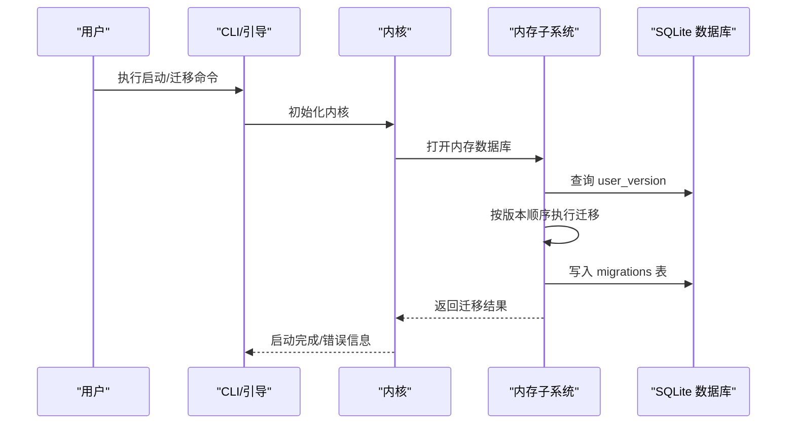
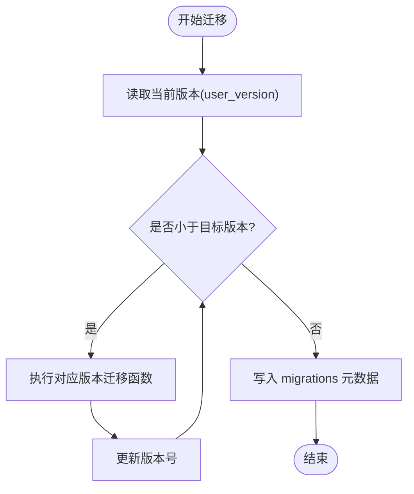
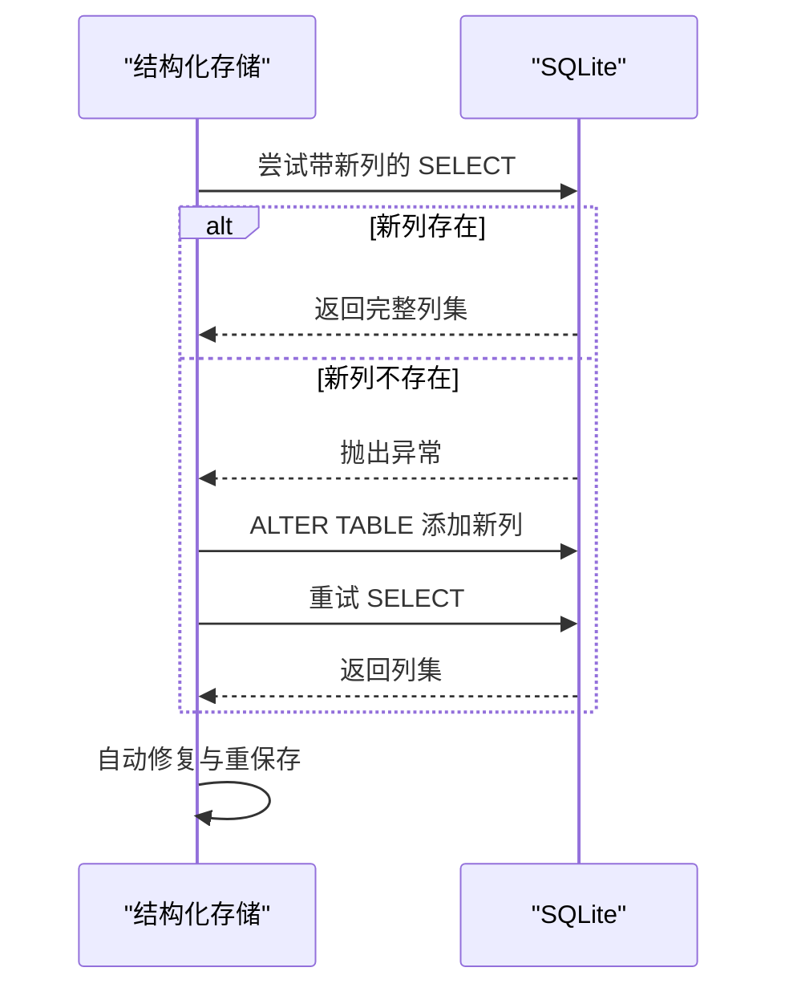
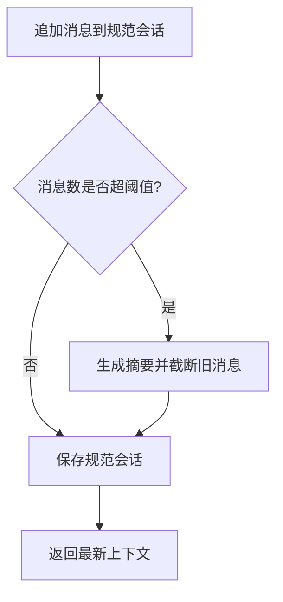
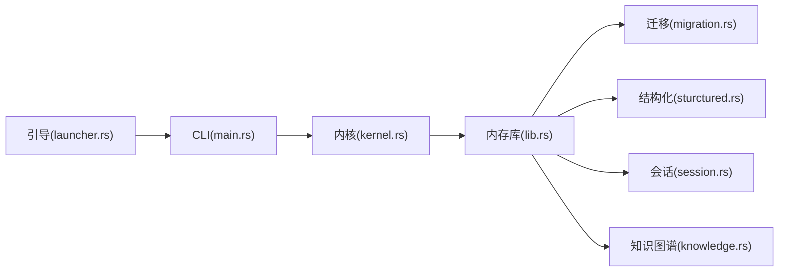

# 迁移系统

<cite>
**本文档引用的文件**
- [Cargo.toml](file://Cargo.toml)
- [migration.rs](file://crates/openfang-memory/src/migration.rs)
- [lib.rs](file://crates/openfang-memory/src/lib.rs)
- [structured.rs](file://crates/openfang-memory/src/structured.rs)
- [session.rs](file://crates/openfang-memory/src/session.rs)
- [knowledge.rs](file://crates/openfang-memory/src/knowledge.rs)
- [consolidation.rs](file://crates/openfang-memory/src/consolidation.rs)
- [kernel.rs](file://crates/openfang-kernel/src/kernel.rs)
- [main.rs](file://crates/openfang-cli/src/main.rs)
- [launcher.rs](file://crates/openfang-cli/src/launcher.rs)
</cite>

## 目录
1. [简介](#简介)
2. [项目结构](#项目结构)
3. [核心组件](#核心组件)
4. [架构总览](#架构总览)
5. [详细组件分析](#详细组件分析)
6. [依赖关系分析](#依赖关系分析)
7. [性能考量](#性能考量)
8. [故障排查指南](#故障排查指南)
9. [结论](#结论)
10. [附录](#附录)

## 简介
本文件面向 OpenFang 的迁移系统模块，系统化阐述数据库模式升级机制、数据迁移脚本管理、版本兼容性处理策略，并给出迁移策略、回滚机制、数据完整性验证方法。文档同时覆盖与配置管理的集成方式、迁移工具使用指南与最佳实践，以及批量升级流程与故障恢复方案。

## 项目结构
OpenFang 迁移系统主要由以下部分组成：
- 内存子系统（openfang-memory）：负责 SQLite 模式迁移、表结构定义、迁移跟踪与版本控制。
- 核心内核（openfang-kernel）：在启动时初始化内存子系统并执行迁移。
- 命令行工具（openfang-cli）：提供交互式引导与命令入口，支持一键迁移与诊断。
- 工作区与配置：通过配置加载与校验，确保迁移环境的一致性。

**图表来源**
- [migration.rs:1-363](file://crates/openfang-memory/src/migration.rs#L1-L363)
- [structured.rs:1-494](file://crates/openfang-memory/src/structured.rs#L1-L494)
- [session.rs:1-814](file://crates/openfang-memory/src/session.rs#L1-L814)
- [knowledge.rs:1-355](file://crates/openfang-memory/src/knowledge.rs#L1-L355)
- [consolidation.rs:1-102](file://crates/openfang-memory/src/consolidation.rs#L1-L102)
- [kernel.rs:505-570](file://crates/openfang-kernel/src/kernel.rs#L505-L570)
- [main.rs:107-294](file://crates/openfang-cli/src/main.rs#L107-L294)
- [launcher.rs:175-270](file://crates/openfang-cli/src/launcher.rs#L175-L270)

**章节来源**
- [Cargo.toml:1-160](file://Cargo.toml#L1-L160)
- [lib.rs:1-20](file://crates/openfang-memory/src/lib.rs#L1-L20)

## 核心组件
- 迁移模块（migration.rs）
  - 定义当前 Schema 版本常量与迁移函数集合。
  - 提供运行迁移的入口函数，按版本顺序执行迁移。
  - 使用 SQLite PRAGMA user_version 记录当前版本，并维护 migrations 表记录每次迁移。
- 结构化存储（structured.rs）
  - 提供键值对持久化、代理状态存储与加载。
  - 在加载代理时进行向后兼容处理（列存在性检测与自动补全）。
- 会话存储（session.rs）
  - 负责对话历史的序列化与持久化，支持跨通道的统一会话上下文。
- 知识图谱（knowledge.rs）
  - 实体与关系的增删查改，支持图模式查询。
- 内存整理（consolidation.rs）
  - 对长期未访问的记忆进行置信度衰减，保证存储效率。
- 内核启动（kernel.rs）
  - 启动阶段打开内存数据库并调用迁移，确保数据库 Schema 最新。
- CLI 与交互引导（main.rs、launcher.rs）
  - 提供命令入口与首次运行引导，包含从 OpenClaw 迁移的提示与流程。

**章节来源**
- [migration.rs:1-48](file://crates/openfang-memory/src/migration.rs#L1-L48)
- [structured.rs:113-254](file://crates/openfang-memory/src/structured.rs#L113-L254)
- [session.rs:39-101](file://crates/openfang-memory/src/session.rs#L39-L101)
- [knowledge.rs:27-80](file://crates/openfang-memory/src/knowledge.rs#L27-L80)
- [consolidation.rs:26-53](file://crates/openfang-memory/src/consolidation.rs#L26-L53)
- [kernel.rs:558-567](file://crates/openfang-kernel/src/kernel.rs#L558-L567)
- [main.rs:107-294](file://crates/openfang-cli/src/main.rs#L107-L294)
- [launcher.rs:50-57](file://crates/openfang-cli/src/launcher.rs#L50-L57)

## 架构总览
迁移系统遵循“版本驱动”的 Schema 升级策略，通过迁移跟踪表与版本号实现幂等升级。内核在启动时自动执行迁移，确保数据库 Schema 与应用版本一致；CLI 提供用户友好的引导与诊断能力。

**图表来源**
- [kernel.rs:558-567](file://crates/openfang-kernel/src/kernel.rs#L558-L567)
- [migration.rs:10-48](file://crates/openfang-memory/src/migration.rs#L10-L48)

## 详细组件分析

### 组件一：迁移模块（Schema 升级与版本控制）
- 设计要点
  - 当前 Schema 版本常量定义，迁移函数按版本编号组织。
  - 运行迁移时先读取当前版本，再按需执行后续版本的迁移函数。
  - 使用 SQLite PRAGMA user_version 存储版本号，使用 migrations 表记录迁移元数据。
- 幂等性与安全性
  - 迁移函数内部使用条件判断避免重复执行。
  - migrations 表插入使用 INSERT OR IGNORE，保证幂等。
- 版本演进
  - 从版本 1 到当前版本，逐步引入实体关系、审计日志等表与索引。
- 复杂度分析
  - 时间复杂度：O(N)，N 为待升级版本数量。
  - 空间复杂度：O(1)，仅维护连接与少量临时变量。

**图表来源**
- [migration.rs:10-48](file://crates/openfang-memory/src/migration.rs#L10-L48)
- [migration.rs:50-54](file://crates/openfang-memory/src/migration.rs#L50-L54)
- [migration.rs:174-184](file://crates/openfang-memory/src/migration.rs#L174-L184)

**章节来源**
- [migration.rs:1-48](file://crates/openfang-memory/src/migration.rs#L1-L48)
- [migration.rs:50-54](file://crates/openfang-memory/src/migration.rs#L50-L54)
- [migration.rs:174-184](file://crates/openfang-memory/src/migration.rs#L174-L184)

### 组件二：结构化存储（向后兼容与代理迁移）
- 设计要点
  - 代理存储在迁移后新增列（如 session_id、identity）时，采用 ALTER TABLE 兼容旧版本。
  - 加载代理时通过多轮 prepare 尝试不同列集，实现对历史版本的兼容。
  - 自动修复与重保存：当发现存储的代理清单与当前版本不匹配时，自动以新格式重写。
- 错误处理
  - 对于无效 UUID、损坏的 JSON/消息包进行跳过与告警。
  - 重复名称去重，保留首次出现的代理。
- 性能影响
  - 兼容路径与自动修复会带来额外的查询与写入操作，但仅在首次加载时发生。

**图表来源**
- [structured.rs:127-136](file://crates/openfang-memory/src/structured.rs#L127-L136)
- [structured.rs:167-176](file://crates/openfang-memory/src/structured.rs#L167-L176)
- [structured.rs:268-279](file://crates/openfang-memory/src/structured.rs#L268-L279)

**章节来源**
- [structured.rs:113-254](file://crates/openfang-memory/src/structured.rs#L113-L254)
- [structured.rs:262-414](file://crates/openfang-memory/src/structured.rs#L262-L414)

### 组件三：会话存储（跨通道上下文与压缩）
- 设计要点
  - 使用消息序列化将会话持久化到 SQLite，并提供跨通道的统一上下文。
  - 支持会话列表、标签设置、删除与清理。
  - 提供“规范会话”（canonical session）用于跨渠道上下文聚合。
- 压缩与摘要
  - 当消息数量超过阈值时，生成摘要并截断旧消息，保持上下文窗口大小可控。
- 性能考量
  - 序列化/反序列化成本与磁盘 IO 成正比；建议合理设置阈值与窗口大小。

**图表来源**
- [session.rs:410-475](file://crates/openfang-memory/src/session.rs#L410-L475)

**章节来源**
- [session.rs:39-101](file://crates/openfang-memory/src/session.rs#L39-L101)
- [session.rs:322-334](file://crates/openfang-memory/src/session.rs#L322-L334)
- [session.rs:410-475](file://crates/openfang-memory/src/session.rs#L410-L475)
- [session.rs:481-491](file://crates/openfang-memory/src/session.rs#L481-L491)

### 组件四：知识图谱（实体与关系）
- 设计要点
  - 实体与关系的增删查改，支持基于图模式的查询。
  - 使用 JSON 字段存储类型与属性，便于扩展。
- 性能优化
  - 为实体与关系建立索引，提升查询性能。
- 数据一致性
  - 通过 ON CONFLICT 更新与唯一约束保证数据一致性。

**章节来源**
- [knowledge.rs:27-80](file://crates/openfang-memory/src/knowledge.rs#L27-L80)
- [knowledge.rs:82-196](file://crates/openfang-memory/src/knowledge.rs#L82-L196)
- [knowledge.rs:160-172](file://crates/openfang-memory/src/knowledge.rs#L160-L172)

### 组件五：内存整理（置信度衰减）
- 设计要点
  - 对长时间未访问的记忆进行置信度衰减，防止过期信息误导。
  - 提供报告统计，便于监控与调优。
- 性能影响
  - 周期性扫描与更新，建议在低峰时段执行。

**章节来源**
- [consolidation.rs:26-53](file://crates/openfang-memory/src/consolidation.rs#L26-L53)

### 组件六：内核启动与迁移集成
- 设计要点
  - 内核启动时根据配置打开内存数据库，随后调用迁移模块执行升级。
  - 配置边界检查与环境变量覆盖，确保启动参数安全。
- 可靠性
  - 驱动初始化失败时提供降级策略，保证内核可启动。

**章节来源**
- [kernel.rs:507-570](file://crates/openfang-kernel/src/kernel.rs#L507-L570)
- [kernel.rs:591-716](file://crates/openfang-kernel/src/kernel.rs#L591-L716)

### 组件七：CLI 与交互引导（迁移入口）
- 设计要点
  - 提供命令入口与交互式引导菜单，首次运行时检测 OpenClaw 并提示迁移。
  - 支持健康检查与诊断，辅助迁移问题定位。
- 用户体验
  - 首次运行优先引导“获取开始”，其中包含迁移选项。

**章节来源**
- [main.rs:107-294](file://crates/openfang-cli/src/main.rs#L107-L294)
- [launcher.rs:50-57](file://crates/openfang-cli/src/launcher.rs#L50-L57)
- [launcher.rs:78-104](file://crates/openfang-cli/src/launcher.rs#L78-L104)

## 依赖关系分析
- 组件耦合
  - 内核依赖内存子系统进行数据库初始化与迁移。
  - 内存子系统内部各模块（结构化、会话、知识图谱、整理）相互独立，通过公共连接共享。
- 外部依赖
  - SQLite（rusqlite）作为底层存储。
  - 配置系统（TOML/环境变量）影响迁移行为与路径。
- 循环依赖
  - 无循环依赖，模块职责清晰。

**图表来源**
- [lib.rs:10-19](file://crates/openfang-memory/src/lib.rs#L10-L19)
- [kernel.rs:505-570](file://crates/openfang-kernel/src/kernel.rs#L505-L570)
- [main.rs:107-294](file://crates/openfang-cli/src/main.rs#L107-L294)
- [launcher.rs:175-270](file://crates/openfang-cli/src/launcher.rs#L175-L270)

**章节来源**
- [lib.rs:1-20](file://crates/openfang-memory/src/lib.rs#L1-L20)
- [kernel.rs:505-570](file://crates/openfang-kernel/src/kernel.rs#L505-L570)
- [main.rs:107-294](file://crates/openfang-cli/src/main.rs#L107-L294)
- [launcher.rs:175-270](file://crates/openfang-cli/src/launcher.rs#L175-L270)

## 性能考量
- 迁移性能
  - 迁移为一次性操作，通常在启动时完成；建议在低负载时段执行。
  - 对大表执行索引创建时注意锁竞争，可在维护窗口进行。
- 存储与序列化
  - 会话与代理存储使用序列化，建议控制单条记录大小，避免过大对象。
- 查询优化
  - 知识图谱与会话查询应充分利用索引，避免全表扫描。
- 内存与 CPU
  - 内存整理周期性执行，建议调整衰减率与周期，平衡性能与效果。

## 故障排查指南
- 迁移失败
  - 检查 migrations 表与 user_version 是否正确更新。
  - 查看具体版本迁移函数是否存在语法或约束冲突。
- 数据不一致
  - 校验结构化存储的兼容路径是否成功执行。
  - 检查代理清单是否被自动修复与重保存。
- 启动异常
  - 核对配置文件与环境变量，确认数据目录权限。
  - 使用健康检查命令诊断数据库连接与迁移状态。

**章节来源**
- [migration.rs:174-184](file://crates/openfang-memory/src/migration.rs#L174-L184)
- [structured.rs:315-411](file://crates/openfang-memory/src/structured.rs#L315-L411)
- [kernel.rs:533-556](file://crates/openfang-kernel/src/kernel.rs#L533-L556)

## 结论
OpenFang 的迁移系统通过版本驱动的 Schema 升级、幂等迁移与向后兼容策略，确保数据库在演进过程中保持稳定与一致。结合内核启动集成与 CLI 引导，用户可以安全地完成从旧版本到新版本的平滑过渡。建议在生产环境中制定严格的迁移计划与回滚预案，并定期进行数据完整性验证与性能评估。

## 附录

### 迁移策略与最佳实践
- 策略
  - 采用“增量迁移”：每个版本只做必要变更，避免一次性大改动。
  - 幂等执行：迁移函数必须可重复执行且不产生副作用。
  - 元数据追踪：使用 migrations 表记录版本与描述，便于审计。
- 最佳实践
  - 在维护窗口执行迁移，减少对业务的影响。
  - 对大表操作（如索引创建）分批进行，避免长事务锁。
  - 迁移前后进行数据完整性校验（表存在性、关键字段、索引）。

### 回滚机制
- 建议
  - 通过备份数据库文件实现快速回滚。
  - 在迁移脚本中增加“回滚准备”步骤（如临时表备份），以便必要时回退。
- 注意
  - 回滚需谨慎评估，避免破坏后续版本的数据结构。

### 数据完整性验证
- 验证清单
  - 核对 migrations 表中的版本与时间戳。
  - 检查关键表（agents、sessions、kv_store、memories、entities、relations、audit_entries）是否存在。
  - 验证索引是否创建完成。
  - 对重要数据进行抽样查询与一致性检查。

### 迁移工具使用指南
- 命令入口
  - 使用 CLI 启动内核，内核自动执行迁移。
  - 首次运行时可通过交互引导选择“获取开始”，其中包含迁移选项。
- 诊断与健康检查
  - 使用健康检查命令查看迁移状态与数据库连接情况。
  - 如遇问题，查看日志并结合 migrations 表定位失败版本。

**章节来源**
- [main.rs:107-294](file://crates/openfang-cli/src/main.rs#L107-L294)
- [launcher.rs:78-104](file://crates/openfang-cli/src/launcher.rs#L78-L104)
- [migration.rs:174-184](file://crates/openfang-memory/src/migration.rs#L174-L184)