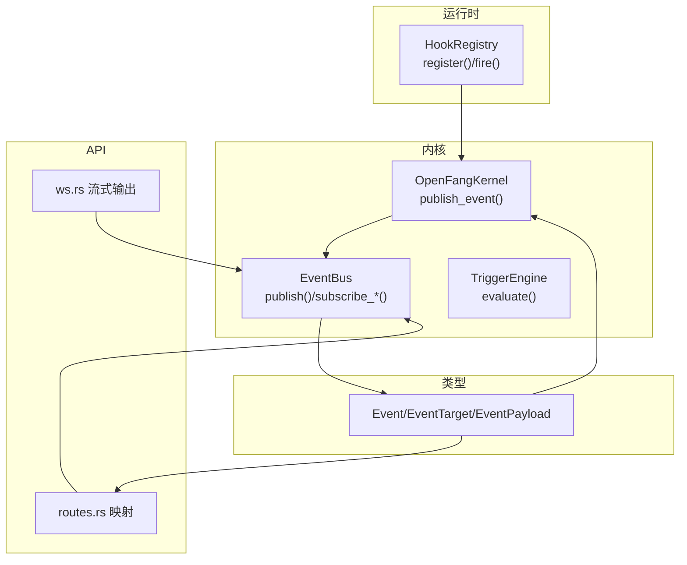
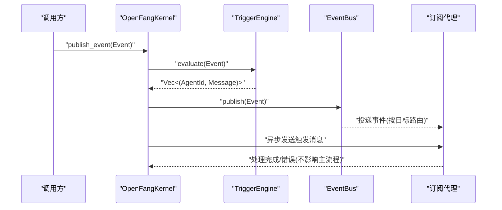
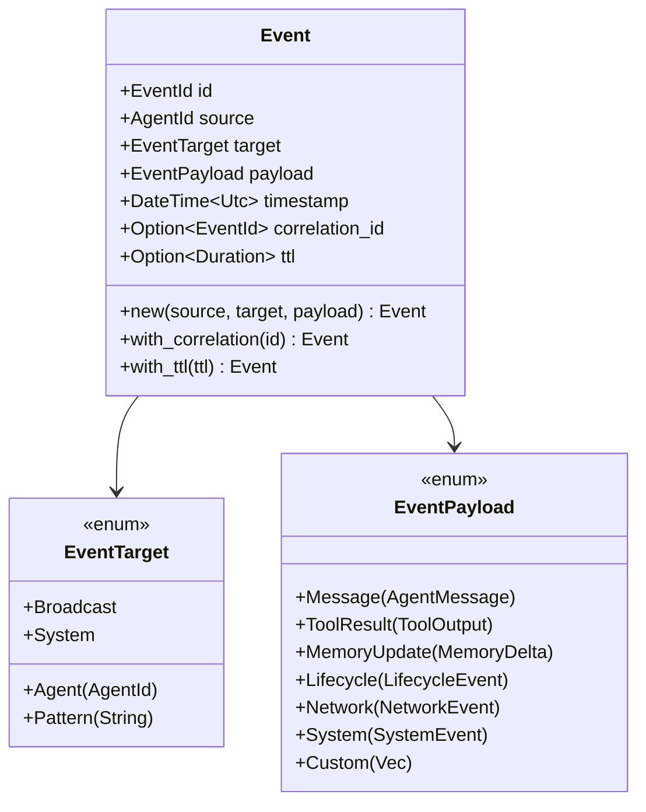
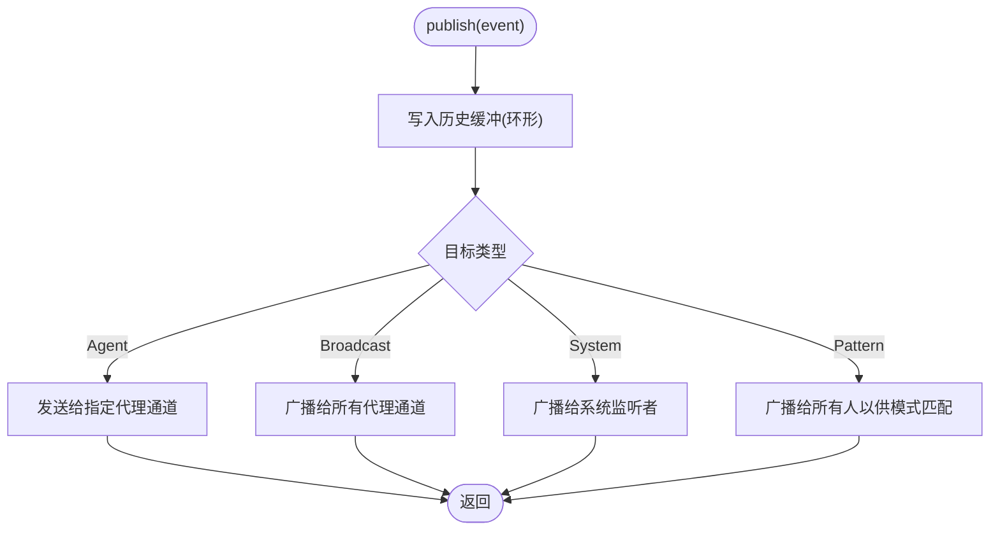
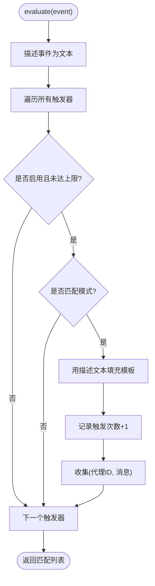
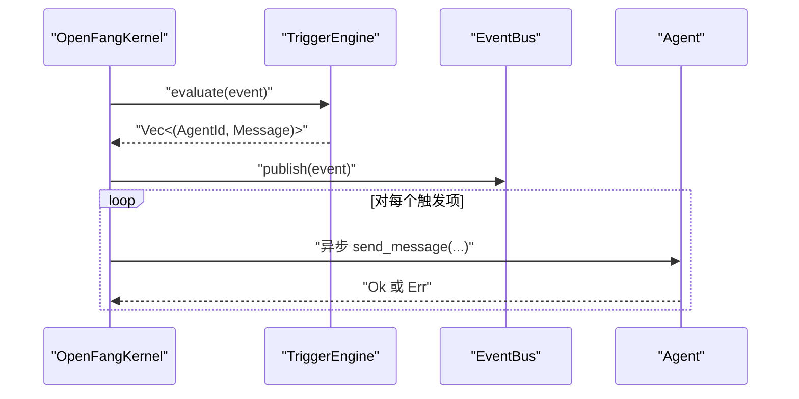
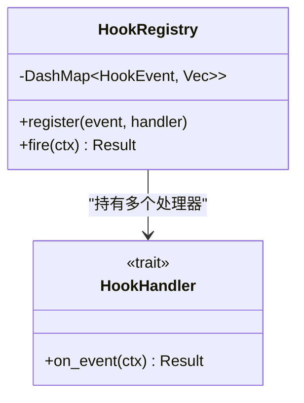
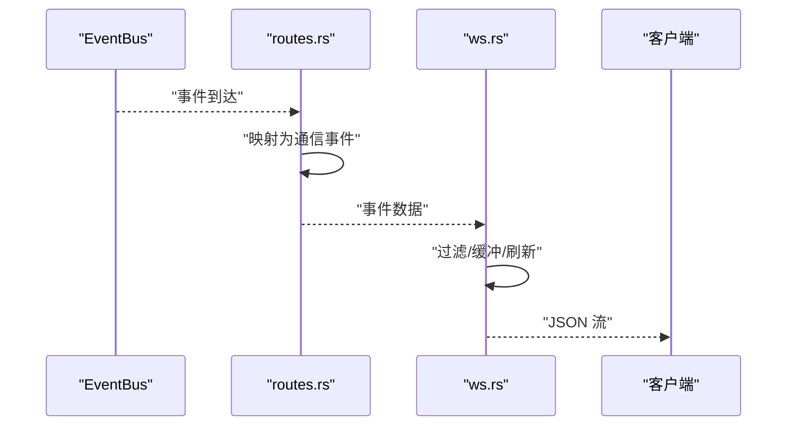
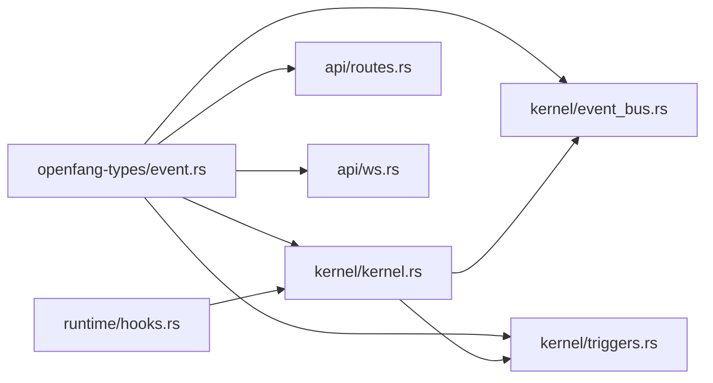

# 事件总线（Event Bus）

<cite>
**本文引用的文件**
- [crates/openfang-kernel/src/event_bus.rs](file://crates/openfang-kernel/src/event_bus.rs)
- [crates/openfang-types/src/event.rs](file://crates/openfang-types/src/event.rs)
- [crates/openfang-kernel/src/triggers.rs](file://crates/openfang-kernel/src/triggers.rs)
- [crates/openfang-kernel/src/kernel.rs](file://crates/openfang-kernel/src/kernel.rs)
- [crates/openfang-kernel/src/lib.rs](file://crates/openfang-kernel/src/lib.rs)
- [crates/openfang-runtime/src/hooks.rs](file://crates/openfang-runtime/src/hooks.rs)
- [crates/openfang-api/src/routes.rs](file://crates/openfang-api/src/routes.rs)
- [crates/openfang-api/src/ws.rs](file://crates/openfang-api/src/ws.rs)
- [crates/openfang-kernel/src/error.rs](file://crates/openfang-kernel/src/error.rs)
</cite>

## 目录
1. [简介](#简介)
2. [项目结构](#项目结构)
3. [核心组件](#核心组件)
4. [架构总览](#架构总览)
5. [详细组件分析](#详细组件分析)
6. [依赖关系分析](#依赖关系分析)
7. [性能考量](#性能考量)
8. [故障排查指南](#故障排查指南)
9. [结论](#结论)
10. [附录](#附录)

## 简介
本文件面向 OpenFang 事件总线系统，系统性阐述事件驱动架构：事件发布与订阅、消息路由、异步处理、事件聚合；详解 EventBus 设计模式、事件类型定义、处理器注册、错误传播机制；并结合代码路径给出发布/订阅/回调处理的示例定位，解释事件持久化、事件重放、事件溯源思路，最后提供性能优化与调试技巧。

## 项目结构
事件总线相关的核心位于内核与类型模块：
- 事件类型与目标定义：crates/openfang-types/src/event.rs
- 事件总线实现：crates/openfang-kernel/src/event_bus.rs
- 触发器引擎（事件驱动唤醒）：crates/openfang-kernel/src/triggers.rs
- 内核集成与触发分发：crates/openfang-kernel/src/kernel.rs
- 插件钩子注册（非阻塞错误传播）：crates/openfang-runtime/src/hooks.rs
- API 层事件映射与流式输出：crates/openfang-api/src/routes.rs、crates/openfang-api/src/ws.rs
- 错误类型与传播：crates/openfang-kernel/src/error.rs

**图表来源**
- [crates/openfang-kernel/src/kernel.rs:3615-3642](file://crates/openfang-kernel/src/kernel.rs#L3615-L3642)
- [crates/openfang-kernel/src/event_bus.rs:14-99](file://crates/openfang-kernel/src/event_bus.rs#L14-L99)
- [crates/openfang-kernel/src/triggers.rs:82-314](file://crates/openfang-kernel/src/triggers.rs#L82-L314)
- [crates/openfang-types/src/event.rs:55-300](file://crates/openfang-types/src/event.rs#L55-L300)
- [crates/openfang-runtime/src/hooks.rs:35-53](file://crates/openfang-runtime/src/hooks.rs#L35-L53)
- [crates/openfang-api/src/routes.rs:10712-10740](file://crates/openfang-api/src/routes.rs#L10712-L10740)
- [crates/openfang-api/src/ws.rs:596-621](file://crates/openfang-api/src/ws.rs#L596-L621)

**章节来源**
- [crates/openfang-kernel/src/lib.rs:1-30](file://crates/openfang-kernel/src/lib.rs#L1-L30)

## 核心组件
- 事件模型：事件 ID、来源、目标、载荷、时间戳、关联 ID、TTL 等，支持多种事件载荷类型（消息、工具结果、内存变更、生命周期、网络、系统、自定义）。
- 事件总线：基于广播通道，支持按代理、广播、系统、模式匹配路由；维护环形历史缓冲区。
- 触发器引擎：按模式匹配事件，生成提示模板消息，自动唤醒订阅代理；支持最大触发次数、启用/禁用、迁移与恢复。
- 内核集成：统一发布入口，先评估触发器，再发布事件，最后异步派发触发消息。
- 钩子系统：插件级事件钩子注册与执行，非阻塞性错误传播。
- API 映射：将内部事件映射为对外通信事件，并在 WebSocket 流中输出。

**章节来源**
- [crates/openfang-types/src/event.rs:32-327](file://crates/openfang-types/src/event.rs#L32-L327)
- [crates/openfang-kernel/src/event_bus.rs:14-99](file://crates/openfang-kernel/src/event_bus.rs#L14-L99)
- [crates/openfang-kernel/src/triggers.rs:82-314](file://crates/openfang-kernel/src/triggers.rs#L82-L314)
- [crates/openfang-kernel/src/kernel.rs:3615-3642](file://crates/openfang-kernel/src/kernel.rs#L3615-L3642)
- [crates/openfang-runtime/src/hooks.rs:35-53](file://crates/openfang-runtime/src/hooks.rs#L35-L53)
- [crates/openfang-api/src/routes.rs:10712-10740](file://crates/openfang-api/src/routes.rs#L10712-L10740)
- [crates/openfang-api/src/ws.rs:596-621](file://crates/openfang-api/src/ws.rs#L596-L621)

## 架构总览
事件总线采用“发布/订阅 + 路由 + 历史缓冲”的架构。内核作为协调者，负责：
- 发布事件前先评估触发器，得到待唤醒代理列表；
- 将事件发布到 EventBus；
- 异步向被唤醒代理发送触发消息。

**图表来源**
- [crates/openfang-kernel/src/kernel.rs:3615-3642](file://crates/openfang-kernel/src/kernel.rs#L3615-L3642)
- [crates/openfang-kernel/src/event_bus.rs:35-73](file://crates/openfang-kernel/src/event_bus.rs#L35-L73)
- [crates/openfang-kernel/src/triggers.rs:272-308](file://crates/openfang-kernel/src/triggers.rs#L272-L308)

## 详细组件分析

### 组件一：事件模型与目标（Event/EventTarget/EventPayload）
- 事件 ID、来源、目标、载荷、时间戳、关联 ID、TTL。
- 目标类型：指定代理、广播、系统、模式匹配。
- 载荷类型：消息、工具结果、内存更新、生命周期、网络、系统、自定义。
- 提供 with_correlation、with_ttl 辅助方法，序列化/反序列化测试覆盖。

**图表来源**
- [crates/openfang-types/src/event.rs:32-327](file://crates/openfang-types/src/event.rs#L32-L327)

**章节来源**
- [crates/openfang-types/src/event.rs:55-327](file://crates/openfang-types/src/event.rs#L55-L327)

### 组件二：事件总线（EventBus）
- 广播通道：全局广播与按代理的独立广播通道。
- 路由策略：按目标类型路由至相应接收端。
- 历史缓冲：环形队列保存最近事件，支持查询历史。
- 订阅接口：按代理订阅、全量订阅。

**图表来源**
- [crates/openfang-kernel/src/event_bus.rs:35-73](file://crates/openfang-kernel/src/event_bus.rs#L35-L73)

**章节来源**
- [crates/openfang-kernel/src/event_bus.rs:14-99](file://crates/openfang-kernel/src/event_bus.rs#L14-L99)

### 组件三：触发器引擎（TriggerEngine）
- 模式匹配：生命周期、特定代理名、系统事件关键字、内存更新、内容匹配等。
- 触发行为：生成提示模板消息，记录触发次数，支持最大触发上限与禁用。
- 生命周期管理：注册、移除、按代理取回/恢复、重新分配代理 ID。

**图表来源**
- [crates/openfang-kernel/src/triggers.rs:272-308](file://crates/openfang-kernel/src/triggers.rs#L272-L308)
- [crates/openfang-kernel/src/triggers.rs:322-366](file://crates/openfang-kernel/src/triggers.rs#L322-L366)

**章节来源**
- [crates/openfang-kernel/src/triggers.rs:82-314](file://crates/openfang-kernel/src/triggers.rs#L82-L314)

### 组件四：内核集成与触发分发
- 统一发布入口：先评估触发器，再发布事件，最后异步派发触发消息。
- 错误处理：派发失败仅记录警告，不阻塞主流程。

**图表来源**
- [crates/openfang-kernel/src/kernel.rs:3615-3642](file://crates/openfang-kernel/src/kernel.rs#L3615-L3642)

**章节来源**
- [crates/openfang-kernel/src/kernel.rs:3615-3642](file://crates/openfang-kernel/src/kernel.rs#L3615-L3642)

### 组件五：钩子注册与错误传播（非阻塞）
- 注册：按事件类型注册多个处理器，按注册顺序执行。
- 执行：非阻塞事件下，处理器错误会被吞掉；阻塞事件下错误会传播。
- 测试覆盖：多处理器均触发、错误不崩溃、四种事件均触发。

**图表来源**
- [crates/openfang-runtime/src/hooks.rs:35-53](file://crates/openfang-runtime/src/hooks.rs#L35-L53)

**章节来源**
- [crates/openfang-runtime/src/hooks.rs:35-53](file://crates/openfang-runtime/src/hooks.rs#L35-L53)
- [crates/openfang-runtime/src/hooks.rs:184-220](file://crates/openfang-runtime/src/hooks.rs#L184-L220)

### 组件六：API 映射与流式输出
- 事件映射：将内部事件映射为对外通信事件（如消息、生命周期），用于前端展示。
- 流式输出：WebSocket 流中对事件进行过滤与映射后输出。

**图表来源**
- [crates/openfang-api/src/routes.rs:10712-10740](file://crates/openfang-api/src/routes.rs#L10712-L10740)
- [crates/openfang-api/src/ws.rs:596-621](file://crates/openfang-api/src/ws.rs#L596-L621)

**章节来源**
- [crates/openfang-api/src/routes.rs:10712-10740](file://crates/openfang-api/src/routes.rs#L10712-L10740)
- [crates/openfang-api/src/ws.rs:596-621](file://crates/openfang-api/src/ws.rs#L596-L621)

## 依赖关系分析
- 类型层：事件模型被 EventBus、TriggerEngine、Kernel、API 共同使用。
- 内核层：Kernel 同时依赖 EventBus 与 TriggerEngine，形成“评估-发布-派发”的闭环。
- 运行时层：HookRegistry 与 Kernel 解耦，通过事件上下文触发，避免阻塞主流程。
- API 层：routes.rs 与 ws.rs 依赖事件模型进行外部映射与流式输出。

**图表来源**
- [crates/openfang-types/src/event.rs:55-327](file://crates/openfang-types/src/event.rs#L55-L327)
- [crates/openfang-kernel/src/event_bus.rs:14-99](file://crates/openfang-kernel/src/event_bus.rs#L14-L99)
- [crates/openfang-kernel/src/triggers.rs:82-314](file://crates/openfang-kernel/src/triggers.rs#L82-L314)
- [crates/openfang-kernel/src/kernel.rs:60-164](file://crates/openfang-kernel/src/kernel.rs#L60-L164)
- [crates/openfang-runtime/src/hooks.rs:35-53](file://crates/openfang-runtime/src/hooks.rs#L35-L53)
- [crates/openfang-api/src/routes.rs:10712-10740](file://crates/openfang-api/src/routes.rs#L10712-L10740)
- [crates/openfang-api/src/ws.rs:596-621](file://crates/openfang-api/src/ws.rs#L596-L621)

**章节来源**
- [crates/openfang-kernel/src/lib.rs:1-30](file://crates/openfang-kernel/src/lib.rs#L1-L30)

## 性能考量
- 广播通道容量：EventBus 使用广播通道，需根据并发订阅者数量调整容量，避免丢弃。
- 历史缓冲大小：默认保留固定数量事件，注意内存占用与查询开销。
- 触发器评估成本：触发器数量增长会增加评估时间，建议按需注册与限制最大触发次数。
- 异步派发：触发消息通过异步任务派发，避免阻塞主发布流程。
- API 流式输出：WebSocket 输出需注意缓冲与刷新策略，减少频繁小包。
- 错误传播：钩子非阻塞错误传播避免影响主流程，但应关注日志与监控。

[本节为通用指导，无需具体文件引用]

## 故障排查指南
- 发布无订阅者收到：检查目标类型与订阅接口；确认 EventBus 是否正确路由。
- 触发未生效：检查 TriggerEngine 注册状态、启用标志、最大触发次数、模式匹配条件。
- 触发消息未送达：查看内核派发日志与告警；确认代理存在且可接收消息。
- 钩子错误吞没：确认事件类型是否为非阻塞；必要时改为阻塞事件以便捕获错误。
- API 映射异常：检查 routes.rs 映射逻辑与字段解析；验证 ws.rs 流式输出过滤。
- 错误类型：内核错误包装 OpenFangError，便于统一处理与上报。

**章节来源**
- [crates/openfang-kernel/src/kernel.rs:3627-3638](file://crates/openfang-kernel/src/kernel.rs#L3627-L3638)
- [crates/openfang-runtime/src/hooks.rs:184-220](file://crates/openfang-runtime/src/hooks.rs#L184-L220)
- [crates/openfang-api/src/routes.rs:10712-10740](file://crates/openfang-api/src/routes.rs#L10712-L10740)
- [crates/openfang-api/src/ws.rs:640-665](file://crates/openfang-api/src/ws.rs#L640-L665)
- [crates/openfang-kernel/src/error.rs:6-19](file://crates/openfang-kernel/src/error.rs#L6-L19)

## 结论
OpenFang 事件总线以清晰的事件模型为核心，结合 EventBus 的高效路由与 TriggerEngine 的事件驱动能力，实现了高内聚、低耦合的事件驱动架构。内核统一入口确保发布-触发-派发流程的一致性；API 层提供稳定的事件映射与流式输出；运行时钩子体系保证扩展点的非阻塞性与可观测性。通过合理配置广播容量、历史缓冲与触发器策略，可在保证性能的同时满足复杂场景下的事件编排需求。

[本节为总结，无需具体文件引用]

## 附录

### 代码示例定位（路径）
- 发布事件：[crates/openfang-kernel/src/kernel.rs:3615-3642](file://crates/openfang-kernel/src/kernel.rs#L3615-L3642)
- 订阅事件（按代理）：[crates/openfang-kernel/src/event_bus.rs:75-82](file://crates/openfang-kernel/src/event_bus.rs#L75-L82)
- 订阅事件（全量）：[crates/openfang-kernel/src/event_bus.rs:84-87](file://crates/openfang-kernel/src/event_bus.rs#L84-L87)
- 处理事件回调（触发器）：[crates/openfang-kernel/src/triggers.rs:272-308](file://crates/openfang-kernel/src/triggers.rs#L272-L308)
- 钩子注册与执行：[crates/openfang-runtime/src/hooks.rs:35-53](file://crates/openfang-runtime/src/hooks.rs#L35-L53)
- API 事件映射：[crates/openfang-api/src/routes.rs:10712-10740](file://crates/openfang-api/src/routes.rs#L10712-L10740)
- WebSocket 流式输出：[crates/openfang-api/src/ws.rs:596-621](file://crates/openfang-api/src/ws.rs#L596-L621)

### 事件持久化、重放与事件溯源
- 历史缓冲：EventBus 维护环形历史缓冲，支持查询最近事件，可用于事件重放与审计。
- 审计链（Merkle 链）：运行时提供审计日志，记录可验证的链式条目，适合事件溯源与合规审计。
- 事件重放：可通过历史接口读取事件并按需重新投递或触发处理。
- 事件溯源：结合审计链与事件历史，可重建系统状态演进。

**章节来源**
- [crates/openfang-kernel/src/event_bus.rs:89-93](file://crates/openfang-kernel/src/event_bus.rs#L89-L93)
- [crates/openfang-runtime/src/audit.rs:156-274](file://crates/openfang-runtime/src/audit.rs#L156-L274)