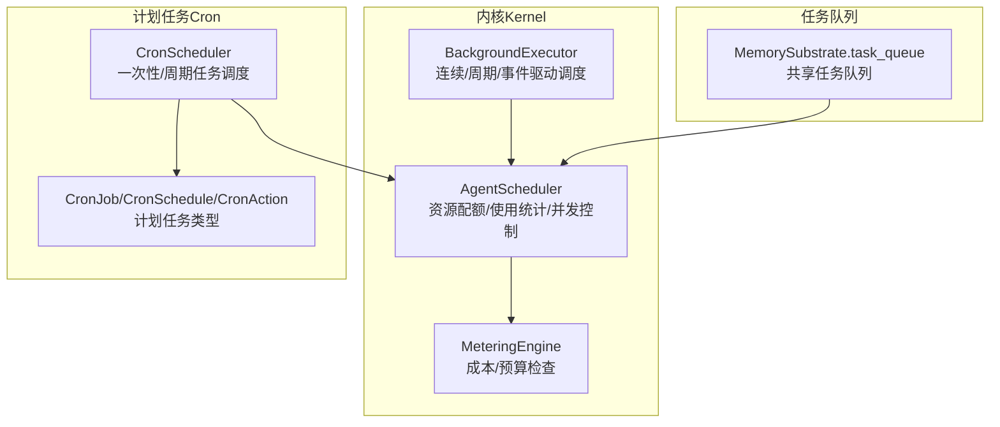
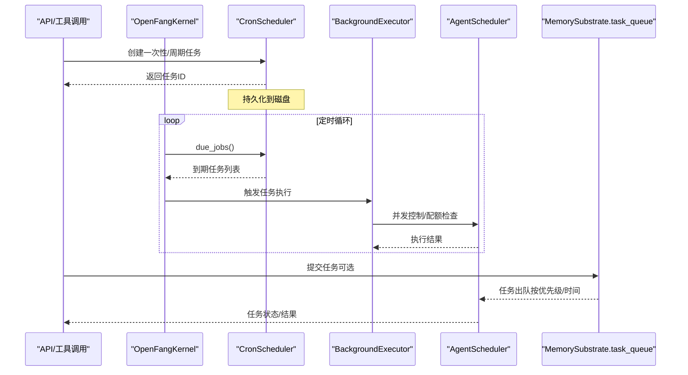
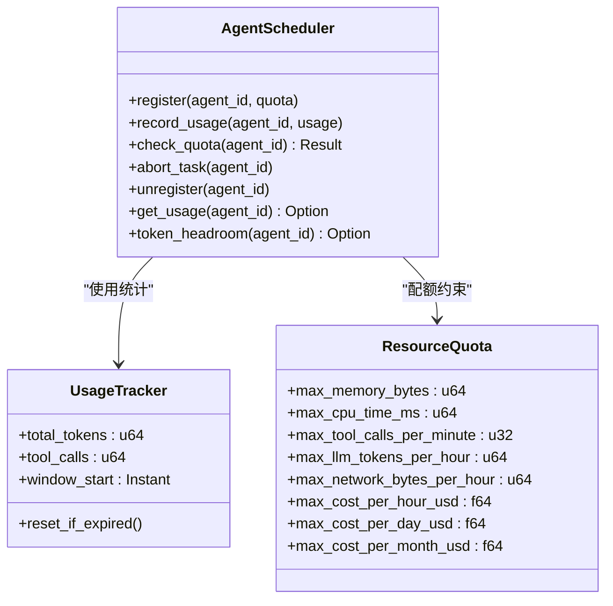
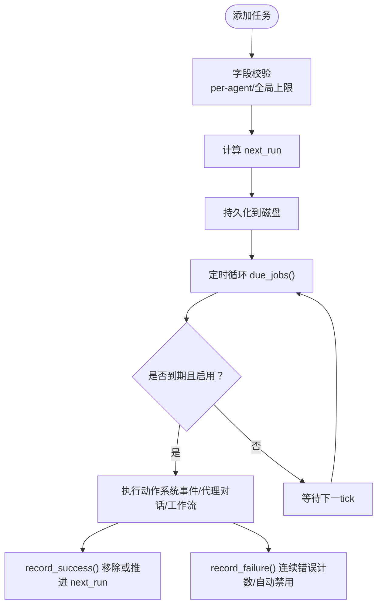
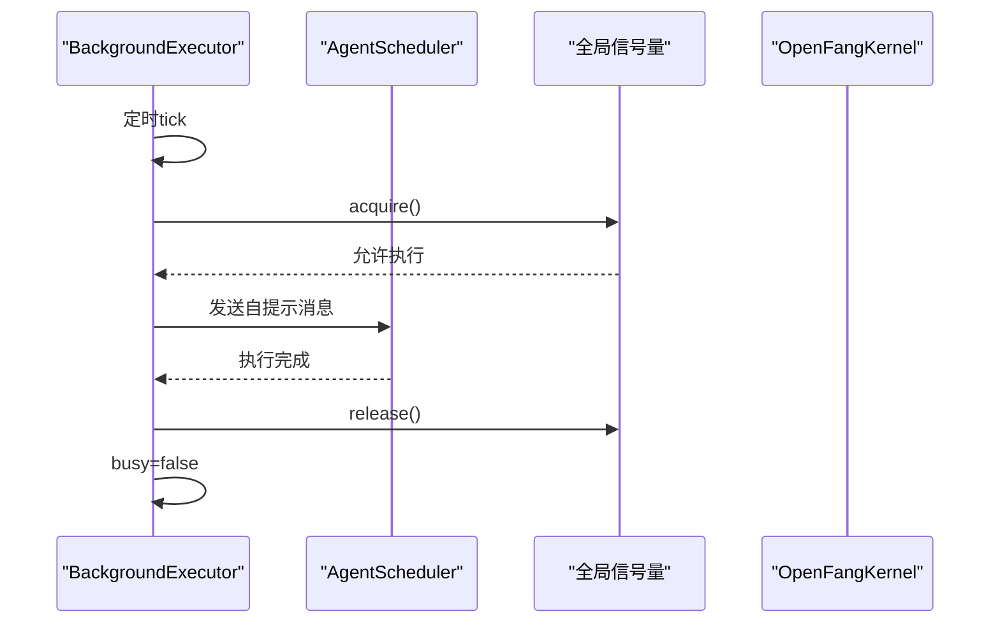
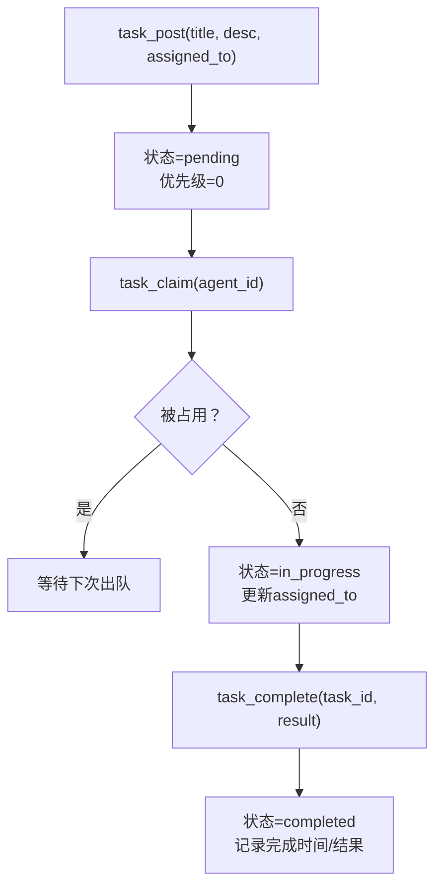
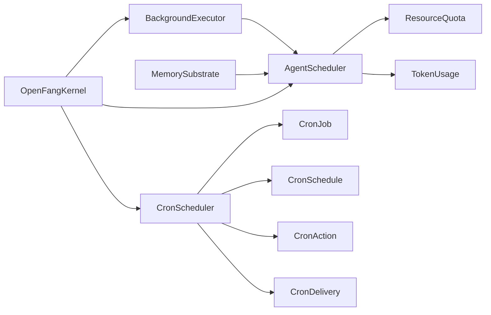

# 任务调度器（Scheduler）

<cite>
**本文引用的文件**
- [scheduler.rs](file://crates/openfang-kernel/src/scheduler.rs)
- [cron.rs](file://crates/openfang-kernel/src/cron.rs)
- [scheduler.rs（类型定义）](file://crates/openfang-types/src/scheduler.rs)
- [agent.rs（资源配额与调度模式）](file://crates/openfang-types/src/agent.rs)
- [background.rs](file://crates/openfang-kernel/src/background.rs)
- [kernel.rs](file://crates/openfang-kernel/src/kernel.rs)
- [substrate.rs（任务队列）](file://crates/openfang-memory/src/substrate.rs)
- [tool_runner.rs（工具调度）](file://crates/openfang-runtime/src/tool_runner.rs)
- [routes.rs（API调度）](file://crates/openfang-api/src/routes.rs)
</cite>

## 目录
1. [简介](#简介)
2. [项目结构](#项目结构)
3. [核心组件](#核心组件)
4. [架构总览](#架构总览)
5. [详细组件分析](#详细组件分析)
6. [依赖关系分析](#依赖关系分析)
7. [性能考量](#性能考量)
8. [故障排查指南](#故障排查指南)
9. [结论](#结论)
10. [附录](#附录)

## 简介
本文件系统化阐述 OpenFang 任务调度器的设计与实现，覆盖以下主题：
- 调度算法：优先级队列、时间片轮转、负载均衡、资源分配
- Scheduler 的调度策略、任务队列管理、并发控制、超时处理
- 定时任务、周期性任务、一次性任务的处理机制
- 具体代码示例路径：如何提交任务、设置调度参数、监控任务执行
- 调度性能优化建议与故障诊断方法

## 项目结构
OpenFang 将“任务调度”拆分为两个层面：
- 内核调度（Kernel Scheduler）：负责资源配额、使用统计、并发限制与任务生命周期管理
- 计划任务（Cron Scheduler）：负责一次性/周期性任务的触发与持久化

图表来源
- [scheduler.rs:43-145](file://crates/openfang-kernel/src/scheduler.rs#L43-L145)
- [cron.rs:60-358](file://crates/openfang-kernel/src/cron.rs#L60-L358)
- [scheduler.rs（类型定义）:166-189](file://crates/openfang-types/src/scheduler.rs#L166-L189)
- [background.rs:21-200](file://crates/openfang-kernel/src/background.rs#L21-L200)
- [substrate.rs:421-568](file://crates/openfang-memory/src/substrate.rs#L421-L568)

章节来源
- [scheduler.rs:1-192](file://crates/openfang-kernel/src/scheduler.rs#L1-L192)
- [cron.rs:1-1211](file://crates/openfang-kernel/src/cron.rs#L1-L1211)
- [scheduler.rs（类型定义）:1-1005](file://crates/openfang-types/src/scheduler.rs#L1-L1005)
- [background.rs:1-458](file://crates/openfang-kernel/src/background.rs#L1-L458)
- [substrate.rs:420-619](file://crates/openfang-memory/src/substrate.rs#L420-L619)

## 核心组件
- AgentScheduler：资源配额与使用统计，支持令牌用量记录、配额检查、任务中止与注销
- CronScheduler：一次性/周期性任务的注册、持久化、到期检测与结果记录
- BackgroundExecutor：基于时间片的连续/周期调度，配合全局并发信号量
- MemorySubstrate：共享任务队列，支持入队、抢占式出队与完成标记
- 类型系统：CronJob、CronSchedule、CronAction、CronDelivery 等

章节来源
- [scheduler.rs:43-145](file://crates/openfang-kernel/src/scheduler.rs#L43-L145)
- [cron.rs:60-358](file://crates/openfang-kernel/src/cron.rs#L60-L358)
- [scheduler.rs（类型定义）:166-189](file://crates/openfang-types/src/scheduler.rs#L166-L189)
- [background.rs:21-200](file://crates/openfang-kernel/src/background.rs#L21-L200)
- [substrate.rs:421-568](file://crates/openfang-memory/src/substrate.rs#L421-L568)

## 架构总览
下图展示了内核调度、计划任务与任务队列之间的交互关系。

图表来源
- [cron.rs:288-307](file://crates/openfang-kernel/src/cron.rs#L288-L307)
- [background.rs:40-186](file://crates/openfang-kernel/src/background.rs#L40-L186)
- [scheduler.rs:63-124](file://crates/openfang-kernel/src/scheduler.rs#L63-L124)
- [substrate.rs:421-568](file://crates/openfang-memory/src/substrate.rs#L421-L568)

## 详细组件分析

### AgentScheduler：资源配额与使用统计
- 资源配额：按 AgentId 维护 ResourceQuota，包括 LLM 令牌、网络字节、CPU 时间、内存等
- 使用统计：每小时滚动窗口统计令牌与工具调用次数，支持重置与头寸计算
- 并发控制：维护活跃任务句柄，支持中止与注销
- 配额检查：在执行前检查是否超出限额，防止超额使用

图表来源
- [scheduler.rs:11-145](file://crates/openfang-kernel/src/scheduler.rs#L11-L145)
- [agent.rs（资源配额与调度模式）:247-282](file://crates/openfang-types/src/agent.rs#L247-L282)

章节来源
- [scheduler.rs:43-145](file://crates/openfang-kernel/src/scheduler.rs#L43-L145)
- [agent.rs（资源配额与调度模式）:247-282](file://crates/openfang-types/src/agent.rs#L247-L282)

### CronScheduler：一次性/周期性任务
- 任务模型：CronJob 包含名称、启用状态、计划、动作、投递方式与运行元数据
- 计划类型：At（一次性）、Every（固定间隔）、Cron（标准 5 字段表达式）
- 生命周期：添加、删除、启用/禁用、到期查询、成功/失败记录与自动禁用
- 持久化：JSON 文件原子写入，支持热重载最大任务数

图表来源
- [cron.rs:134-166](file://crates/openfang-kernel/src/cron.rs#L134-L166)
- [cron.rs:288-307](file://crates/openfang-kernel/src/cron.rs#L288-L307)
- [cron.rs:311-357](file://crates/openfang-kernel/src/cron.rs#L311-L357)
- [scheduler.rs（类型定义）:166-189](file://crates/openfang-types/src/scheduler.rs#L166-L189)

章节来源
- [cron.rs:60-358](file://crates/openfang-kernel/src/cron.rs#L60-L358)
- [scheduler.rs（类型定义）:166-189](file://crates/openfang-types/src/scheduler.rs#L166-L189)

### BackgroundExecutor：时间片轮转与并发控制
- 支持三种模式：Reactive（响应式）、Continuous（连续）、Periodic（周期）、Proactive（事件驱动）
- 连续/周期模式：基于时间片的循环，内置“忙则跳过”与全局 LLM 并发信号量
- 事件驱动：通过触发器激活，无需专用循环

图表来源
- [background.rs:40-186](file://crates/openfang-kernel/src/background.rs#L40-L186)
- [scheduler.rs:111-124](file://crates/openfang-kernel/src/scheduler.rs#L111-L124)

章节来源
- [background.rs:21-200](file://crates/openfang-kernel/src/background.rs#L21-L200)
- [kernel.rs:130-131](file://crates/openfang-kernel/src/kernel.rs#L130-L131)

### 任务队列：共享任务队列与优先级
- 入队：task_post，生成唯一任务ID，初始状态 pending
- 出队：task_claim，按优先级降序、创建时间升序抢占式获取
- 完成：task_complete，标记完成并记录结果
- 与 AgentScheduler 协同：用于外部任务驱动的执行与配额控制

图表来源
- [substrate.rs:421-568](file://crates/openfang-memory/src/substrate.rs#L421-L568)

章节来源
- [substrate.rs:421-568](file://crates/openfang-memory/src/substrate.rs#L421-L568)

### 调度策略与超时处理
- 调度策略
  - 优先级：通过任务队列的排序规则体现（优先级高、更早创建）
  - 时间片轮转：BackgroundExecutor 在每个 tick 检查“忙碌状态”，避免重叠执行
  - 负载均衡：全局 LLM 并发信号量限制整体并发，避免资源争抢
- 超时处理
  - 计划任务支持 AgentTurn/WorkflowRun 的超时配置
  - AgentScheduler 提供配额检查与头寸计算，避免长时间占用资源

章节来源
- [background.rs:17-28](file://crates/openfang-kernel/src/background.rs#L17-L28)
- [scheduler.rs（类型定义）:116-134](file://crates/openfang-types/src/scheduler.rs#L116-L134)
- [scheduler.rs:77-100](file://crates/openfang-kernel/src/scheduler.rs#L77-L100)

### 定时/周期/一次性任务处理机制
- 一次性任务（At）：指定未来某一时刻触发
- 固定间隔（Every）：以秒为单位的固定周期
- Cron 表达式：标准 5 字段表达式，支持时区转换
- 动作类型：系统事件、代理对话、工作流执行
- 投递方式：无/通道/上次通道/Webhook

章节来源
- [scheduler.rs（类型定义）:80-161](file://crates/openfang-types/src/scheduler.rs#L80-L161)
- [cron.rs:364-441](file://crates/openfang-kernel/src/cron.rs#L364-L441)

### 代码示例（路径指引）
- 提交一次性任务（API/工具）
  - [tool_schedule_create（工具）:2061-2099](file://crates/openfang-runtime/src/tool_runner.rs#L2061-L2099)
  - [manage_schedule_text（聊天桥接）:492-527](file://crates/openfang-api/src/channel_bridge.rs#L492-L527)
- 设置调度参数（CronJob）
  - [CronJob 结构与验证:166-236](file://crates/openfang-types/src/scheduler.rs#L166-L236)
- 监控任务执行（内核）
  - [due_jobs 查询到期任务:288-307](file://crates/openfang-kernel/src/cron.rs#L288-L307)
  - [record_success/record_failure 结果记录:311-357](file://crates/openfang-kernel/src/cron.rs#L311-L357)
- 后台执行器（连续/周期）
  - [start_agent 启动循环:40-186](file://crates/openfang-kernel/src/background.rs#L40-L186)
- 任务队列管理
  - [task_post 入队:421-449](file://crates/openfang-memory/src/substrate.rs#L421-L449)
  - [task_claim 出队:451-502](file://crates/openfang-memory/src/substrate.rs#L451-L502)
  - [task_complete 完成:504-524](file://crates/openfang-memory/src/substrate.rs#L504-L524)

章节来源
- [tool_runner.rs:2061-2099](file://crates/openfang-runtime/src/tool_runner.rs#L2061-L2099)
- [channel_bridge.rs:492-527](file://crates/openfang-api/src/channel_bridge.rs#L492-L527)
- [scheduler.rs（类型定义）:166-236](file://crates/openfang-types/src/scheduler.rs#L166-L236)
- [cron.rs:288-357](file://crates/openfang-kernel/src/cron.rs#L288-L357)
- [background.rs:40-186](file://crates/openfang-kernel/src/background.rs#L40-L186)
- [substrate.rs:421-524](file://crates/openfang-memory/src/substrate.rs#L421-L524)

## 依赖关系分析
- AgentScheduler 依赖 ResourceQuota 与 TokenUsage，用于配额与使用统计
- CronScheduler 依赖 CronJob/CronSchedule/CronAction/CronDelivery 类型
- BackgroundExecutor 与 AgentScheduler 协作，受全局信号量限制
- MemorySubstrate 为外部任务提供共享队列
- Kernel 汇聚上述组件，提供统一的调度与执行入口

图表来源
- [scheduler.rs:43-145](file://crates/openfang-kernel/src/scheduler.rs#L43-L145)
- [cron.rs:60-358](file://crates/openfang-kernel/src/cron.rs#L60-L358)
- [agent.rs（资源配额与调度模式）:247-282](file://crates/openfang-types/src/agent.rs#L247-L282)
- [substrate.rs:421-568](file://crates/openfang-memory/src/substrate.rs#L421-L568)
- [kernel.rs:60-164](file://crates/openfang-kernel/src/kernel.rs#L60-L164)

章节来源
- [kernel.rs:60-164](file://crates/openfang-kernel/src/kernel.rs#L60-L164)
- [scheduler.rs:43-145](file://crates/openfang-kernel/src/scheduler.rs#L43-L145)
- [cron.rs:60-358](file://crates/openfang-kernel/src/cron.rs#L60-L358)
- [agent.rs（资源配额与调度模式）:247-282](file://crates/openfang-types/src/agent.rs#L247-L282)
- [substrate.rs:421-568](file://crates/openfang-memory/src/substrate.rs#L421-L568)

## 性能考量
- 并发控制
  - 全局 LLM 并发信号量限制同时发起的后台 LLM 调用，避免资源枯竭
  - “忙则跳过”策略减少重复执行，降低抖动
- 资源配额
  - 每小时滚动窗口统计令牌用量，及时阻断超额使用
  - 成本/预算引擎与 AgentScheduler 协同，提供多维度配额检查
- I/O 与持久化
  - Cron 任务持久化采用临时文件+原子重命名，保证一致性
- 任务队列
  - 出队按优先级与时间排序，确保高优任务尽快执行

章节来源
- [background.rs:17-28](file://crates/openfang-kernel/src/background.rs#L17-L28)
- [scheduler.rs:77-100](file://crates/openfang-kernel/src/scheduler.rs#L77-L100)
- [cron.rs:116-130](file://crates/openfang-kernel/src/cron.rs#L116-L130)

## 故障排查指南
- 任务未触发
  - 检查 CronJob 是否启用、next_run 是否已到期
  - 参考：[due_jobs 实现:288-307](file://crates/openfang-kernel/src/cron.rs#L288-L307)
- 自动禁用
  - 连续错误达到阈值后自动禁用，需手动启用或修复
  - 参考：[record_failure 实现:334-357](file://crates/openfang-kernel/src/cron.rs#L334-L357)
- 超出配额
  - 检查 AgentScheduler 的配额与使用统计，必要时调整 ResourceQuota
  - 参考：[check_quota 实现:77-100](file://crates/openfang-kernel/src/scheduler.rs#L77-L100)
- 并发过高
  - 观察全局信号量与 Busy 状态，适当增大并发上限或降低任务频率
  - 参考：[start_agent 实现:40-186](file://crates/openfang-kernel/src/background.rs#L40-L186)
- 任务队列异常
  - 检查 task_claim 是否被其他代理占用，确认状态流转
  - 参考：[task_claim 实现:451-502](file://crates/openfang-memory/src/substrate.rs#L451-L502)

章节来源
- [cron.rs:288-357](file://crates/openfang-kernel/src/cron.rs#L288-L357)
- [scheduler.rs:77-100](file://crates/openfang-kernel/src/scheduler.rs#L77-L100)
- [background.rs:40-186](file://crates/openfang-kernel/src/background.rs#L40-L186)
- [substrate.rs:451-502](file://crates/openfang-memory/src/substrate.rs#L451-L502)

## 结论
OpenFang 的调度体系将“资源配额与并发控制”（AgentScheduler）、“计划任务”（CronScheduler）与“时间片轮转”（BackgroundExecutor）有机结合，并通过共享任务队列实现跨模块的任务编排。通过严格的配额检查、原子持久化与全局并发限制，系统在保证稳定性的同时提供了灵活的调度能力。建议在生产环境中结合业务负载合理配置 ResourceQuota 与并发上限，并利用 Cron 任务与工具调度实现自动化运维。

## 附录
- 关键类型与常量
  - [CronJob/CronSchedule/CronAction/CronDelivery:166-189](file://crates/openfang-types/src/scheduler.rs#L166-L189)
  - [ScheduleMode/Priority/ResourceQuota:225-296](file://crates/openfang-types/src/agent.rs#L225-L296)
- 内核集成点
  - [OpenFangKernel 字段与初始化:60-164](file://crates/openfang-kernel/src/kernel.rs#L60-L164)