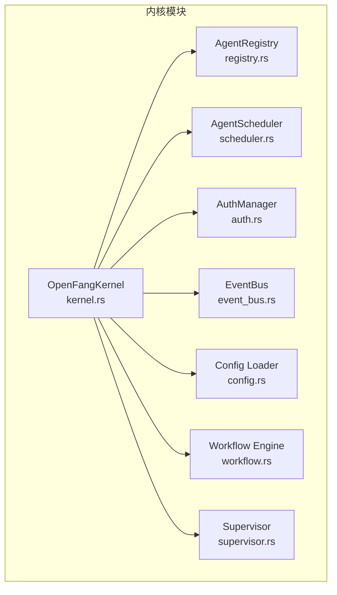
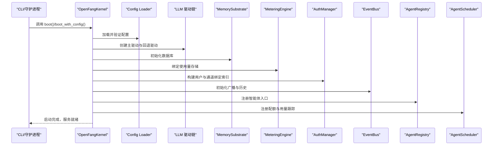
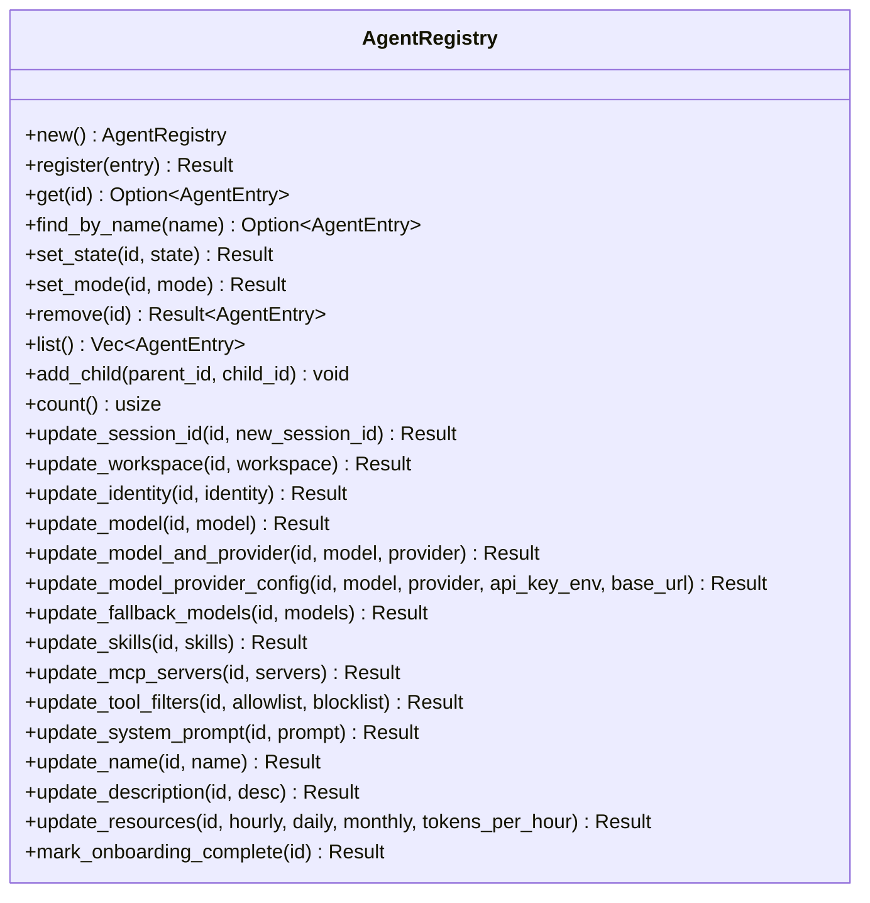
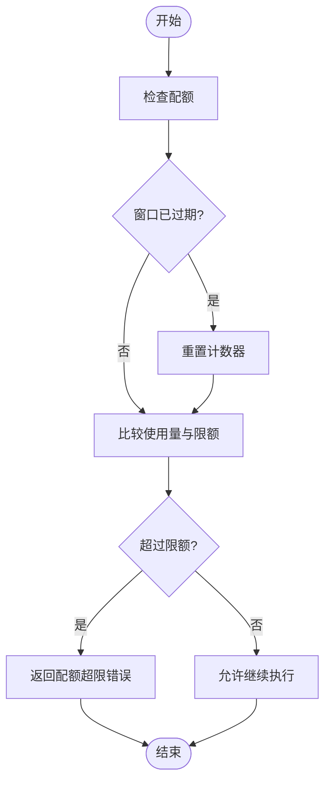
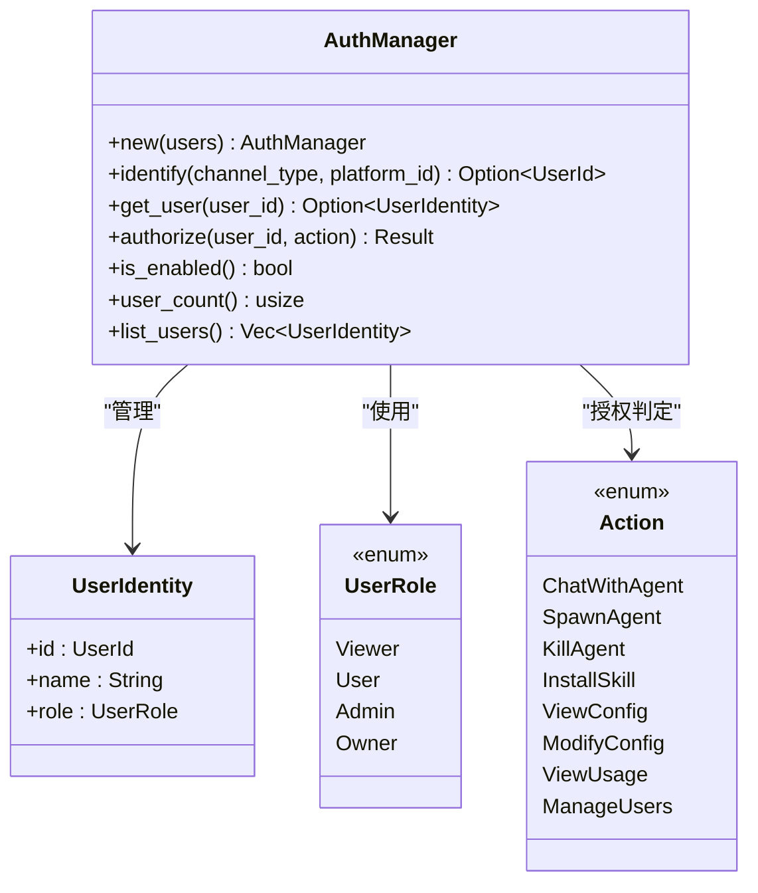
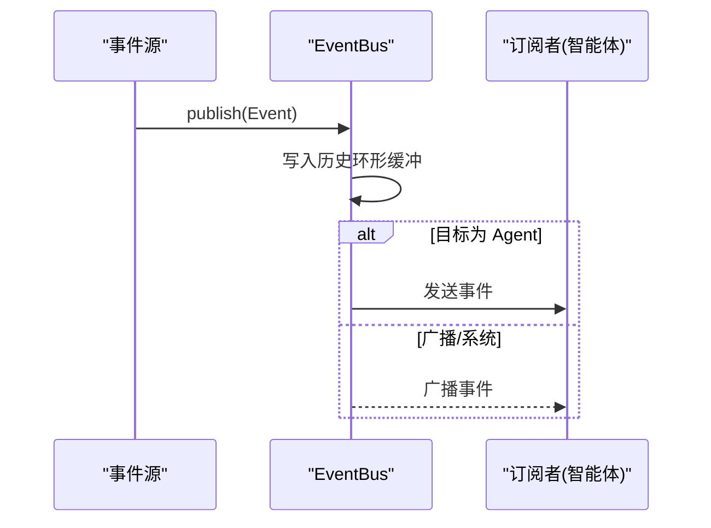
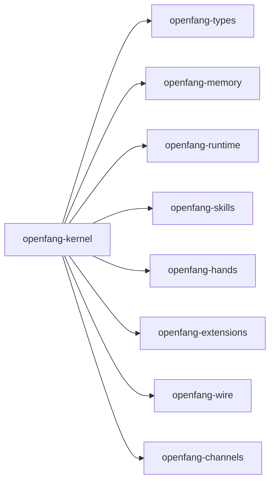

# 内核系统 (openfang-kernel)

<cite>
**本文引用的文件**
- [kernel.rs](file://crates/openfang-kernel/src/kernel.rs)
- [lib.rs](file://crates/openfang-kernel/src/lib.rs)
- [registry.rs](file://crates/openfang-kernel/src/registry.rs)
- [scheduler.rs](file://crates/openfang-kernel/src/scheduler.rs)
- [auth.rs](file://crates/openfang-kernel/src/auth.rs)
- [event_bus.rs](file://crates/openfang-kernel/src/event_bus.rs)
- [config.rs](file://crates/openfang-kernel/src/config.rs)
- [error.rs](file://crates/openfang-kernel/src/error.rs)
- [workflow.rs](file://crates/openfang-kernel/src/workflow.rs)
- [supervisor.rs](file://crates/openfang-kernel/src/supervisor.rs)
- [integration_test.rs](file://crates/openfang-kernel/tests/integration_test.rs)
- [README.md](file://README.md)
</cite>

## 目录
1. [简介](#简介)
2. [项目结构](#项目结构)
3. [核心组件](#核心组件)
4. [架构总览](#架构总览)
5. [详细组件分析](#详细组件分析)
6. [依赖关系分析](#依赖关系分析)
7. [性能考量](#性能考量)
8. [故障排除指南](#故障排除指南)
9. [结论](#结论)
10. [附录](#附录)

## 简介
OpenFang 内核系统是整个“智能体操作系统”的中枢，负责：
- 智能体生命周期管理（注册、启动、运行、终止）
- 调度与资源配额控制（令牌用量、并发限制、会话隔离）
- 权限与访问控制（基于角色的多用户认证）
- 事件总线系统（跨智能体通信、触发器与历史回放）
- 配置加载与热重载、审计与计量、沙箱与安全策略集成

本文件面向开发者与运维人员，系统化阐述 OpenFangKernel 的设计理念、Registry 的注册机制、Scheduler 的配额策略、Auth 的认证授权流程，并给出与其他模块的交互关系、关键配置参数、错误处理与性能优化建议。

## 项目结构
openfang-kernel 作为核心模块，通过 lib.rs 暴露子模块入口，内部以功能域划分：
- kernel：内核主结构体与启动装配逻辑
- registry：智能体注册表与索引
- scheduler：资源配额与执行调度
- auth：RBAC 认证与授权
- event_bus：事件总线与历史缓存
- config：配置加载与合并
- error：内核错误类型别名
- workflow：工作流引擎（定义与运行时）
- supervisor：进程监管与健康监控

图表来源
- [kernel.rs:505-800](file://crates/openfang-kernel/src/kernel.rs#L505-L800)
- [lib.rs:1-30](file://crates/openfang-kernel/src/lib.rs#L1-L30)

章节来源
- [lib.rs:1-30](file://crates/openfang-kernel/src/lib.rs#L1-L30)
- [README.md:231-250](file://README.md#L231-L250)

## 核心组件
本节聚焦 OpenFangKernel 的关键职责与数据结构设计。

- OpenFangKernel 设计理念
  - 单一内核聚合所有子系统：注册表、调度器、认证、事件总线、内存、工作流、触发器、后台执行器、审计与计量等
  - 通过 Arc 共享状态，保证并发安全；使用 OnceLock 安全地延迟初始化网络节点与对等体注册
  - 提供统一的启动流程：加载配置、初始化驱动链、构建内存与计量、注册认证、技能与手包、扩展与集成、WASM 沙箱、事件总线、触发器、工作流、后台执行器与监管器
  - 支持环境变量覆盖与配置边界约束，确保稳健性

- 关键字段概览
  - 配置与驱动：config、default_driver、model_catalog、effective_mcp_servers
  - 注册与调度：registry、scheduler、running_tasks
  - 安全与权限：auth、approval_manager、bindings、broadcast
  - 事件与触发：event_bus、triggers、delivery_tracker
  - 执行与沙箱：memory、wasm_sandbox、process_manager、a2a_task_store
  - 工作流与工具：workflows、skill_registry、hand_registry、extension_registry、extension_health
  - 健康与审计：audit_log、metering、hooks、peer_registry、peer_node、booted_at

- 启动流程要点
  - 加载配置（支持 include 合并、路径安全校验、迁移旧字段）
  - 初始化内存与计量（共享 SQLite 连接）
  - 构建 LLM 驱动链（主驱动失败自动探测其他可用驱动，再叠加回退驱动）
  - 初始化认证、模型目录、技能与手包、扩展注册、WASM 沙箱、事件总线、触发器、工作流、后台执行器与监管器
  - 记录启动时间，准备对外服务

章节来源
- [kernel.rs:505-800](file://crates/openfang-kernel/src/kernel.rs#L505-L800)
- [kernel.rs:16-164](file://crates/openfang-kernel/src/kernel.rs#L16-L164)
- [config.rs:18-110](file://crates/openfang-kernel/src/config.rs#L18-L110)

## 架构总览
下图展示了内核启动与关键子系统的装配关系，以及消息与事件在系统内的流转。

图表来源
- [kernel.rs:505-800](file://crates/openfang-kernel/src/kernel.rs#L505-L800)
- [config.rs:18-110](file://crates/openfang-kernel/src/config.rs#L18-L110)

## 详细组件分析

### OpenFangKernel 结构体与启动装配
- 设计要点
  - 使用 Arc 共享状态，DashMap 保证高并发读写
  - OnceLock 用于 PeerNode/PeerRegistry 的延迟初始化，避免循环依赖
  - 将 LLM 驱动链抽象为统一接口，支持主驱动失败时的自动探测与回退
  - 将计量与内存共享同一底层连接，降低开销
- 启动关键步骤
  - 配置加载与校验、边界约束、日志级别
  - 数据目录与内存数据库初始化
  - 驱动链构建与回退策略
  - 认证、模型目录、技能与手包、扩展注册
  - 事件总线、触发器、工作流、后台执行器、监管器
- 错误处理
  - 驱动链全部失败时降级为 StubDriver，保证内核可引导
  - 启动阶段的 IO/初始化错误统一包装为 KernelError::BootFailed

章节来源
- [kernel.rs:505-800](file://crates/openfang-kernel/src/kernel.rs#L505-L800)
- [error.rs:1-20](file://crates/openfang-kernel/src/error.rs#L1-L20)

### Registry：智能体注册机制
- 数据结构
  - 主索引：AgentId → AgentEntry
  - 名称索引：name → AgentId
  - 标签索引：tag → [AgentId]
- 核心能力
  - 注册、查询、按名称查找、移除
  - 更新状态、模式、会话、工作空间、身份、模型、技能、工具过滤、系统提示、资源配额等
  - 子智能体父子关系维护
- 并发与一致性
  - DashMap 提供无锁并发读写
  - 更新操作在持有可变引用时修改 last_active 字段，确保活动时间一致性

图表来源
- [registry.rs:7-345](file://crates/openfang-kernel/src/registry.rs#L7-L345)

章节来源
- [registry.rs:17-345](file://crates/openfang-kernel/src/registry.rs#L17-L345)

### Scheduler：任务调度与资源配额
- UsageTracker
  - 滚动小时窗口统计总 token 数与工具调用次数
  - 窗口过期自动重置
- AgentScheduler
  - 为每个 Agent 维护 ResourceQuota 与 UsageTracker
  - 记录 TokenUsage，检查配额，返回 QuotaExceeded 错误
  - 支持中止任务、注销 Agent、查询剩余头寸
- 复杂度与性能
  - 查找/更新均为 O(1) 基于哈希表
  - 窗口重置按需触发，避免周期性扫描

图表来源
- [scheduler.rs:77-100](file://crates/openfang-kernel/src/scheduler.rs#L77-L100)

章节来源
- [scheduler.rs:11-145](file://crates/openfang-kernel/src/scheduler.rs#L11-L145)

### Auth：认证与授权（RBAC）
- 用户角色与权限
  - Viewer ≤ User ≤ Admin ≤ Owner
  - Action 到最小角色映射：如 ChatWithAgent 需 User，ManageUsers 需 Owner
- 用户识别与授权
  - 通过 channel_type:platform_id 建立索引，支持跨平台识别同一用户
  - authorize 返回 AuthDenied 或 Ok(())
- 配置与启用
  - 从 KernelConfig 的用户列表构造
  - is_enabled 用于判断是否启用 RBAC

图表来源
- [auth.rs:98-189](file://crates/openfang-kernel/src/auth.rs#L98-L189)

章节来源
- [auth.rs:13-189](file://crates/openfang-kernel/src/auth.rs#L13-L189)

### Event Bus：事件总线与历史
- 功能
  - 广播到全局、按 Agent 分发、系统事件、模式匹配（待实现）与历史环形缓冲
  - 历史容量上限，新事件覆盖最旧条目
- 订阅
  - subscribe_agent 与 subscribe_all，支持按 Agent 过滤
- 与触发器协作
  - 发布前先评估触发器，再分发给订阅者

图表来源
- [event_bus.rs:24-99](file://crates/openfang-kernel/src/event_bus.rs#L24-L99)

章节来源
- [event_bus.rs:14-99](file://crates/openfang-kernel/src/event_bus.rs#L14-L99)

### 配置加载与合并（Config）
- 支持 include 深度合并，防止绝对路径、路径穿越与循环引用
- 自动迁移旧配置字段（如 api_key、api_listen 从 [api] 段迁移到根）
- 默认路径优先级：OPENFANG_HOME > ~/.openfang

章节来源
- [config.rs:18-262](file://crates/openfang-kernel/src/config.rs#L18-L262)

### 工作流引擎（Workflow）
- Workflow 定义包含步骤序列、描述、创建时间
- 步骤支持顺序、并行（扇出/收集）、条件、循环、错误处理策略
- 运行时记录每步输出、Token 使用、耗时与最终结果

章节来源
- [workflow.rs:66-199](file://crates/openfang-kernel/src/workflow.rs#L66-L199)

### 监管器（Supervisor）
- 提供优雅关闭信号、健康统计（panic/restart 计数）、单个 Agent 重启限制
- 与后台执行器配合，保障系统稳定退出

章节来源
- [supervisor.rs:9-121](file://crates/openfang-kernel/src/supervisor.rs#L9-L121)

## 依赖关系分析
- 内核对子模块的依赖
  - openfang-types：核心类型、事件、配置、错误
  - openfang-memory：内存基座、使用量存储
  - openfang-runtime：运行时、LLM 驱动、工具、WASM 沙箱、A2A、钩子
  - openfang-skills/openfang-hands/openfang-extensions/openfang-wire/openfang-channels：生态与适配层
- 外部依赖
  - tokio、dashmap、tracing、toml、chrono、uuid、thiserror、zeroize 等

图表来源
- [Cargo.toml:8-37](file://crates/openfang-kernel/Cargo.toml#L8-L37)

章节来源
- [Cargo.toml:8-37](file://crates/openfang-kernel/Cargo.toml#L8-L37)

## 性能考量
- 并发与锁
  - DashMap 用于高并发注册表与调度器，减少锁竞争
  - OnceLock 延迟初始化避免不必要的同步
- 资源配额
  - 滚动窗口统计，避免定期扫描带来的 CPU 开销
  - 仅在配额检查时重置窗口，降低计算成本
- 事件总线
  - 广播通道容量合理设置，避免内存膨胀
  - 历史环形缓冲上限固定，避免无限增长
- 驱动链
  - 主驱动失败自动探测与回退，提升可用性
  - 仅在必要时创建回退驱动，避免冗余对象
- I/O
  - 配置加载与合并采用深合并，减少重复解析
  - 路径安全校验在 include 解析阶段完成，避免后续运行时开销

[本节为通用指导，无需特定文件引用]

## 故障排除指南
- 启动失败
  - 检查配置文件是否存在与格式正确；查看日志中的配置警告
  - 若 LLM 驱动全部初始化失败，内核会降级为 StubDriver，需配置有效 API Key 或提供本地模型
- 认证问题
  - 确认用户配置与通道绑定是否正确；使用 is_enabled 判断 RBAC 是否启用
  - 授权失败时，确认用户角色是否满足 Action 最低要求
- 调度与配额
  - 出现 QuotaExceeded 错误，检查 ResourceQuota 设置或等待滚动窗口重置
  - 使用 token_headroom 获取剩余头寸，辅助前端提示
- 事件与触发
  - 未收到事件：确认订阅是否正确；检查目标类型（Agent/Broadcast/System/Pattern）
  - 触发器未生效：确认触发器表达式与事件内容匹配
- 集成测试参考
  - 参考集成测试，验证内核引导、智能体启动与消息往返

章节来源
- [error.rs:13-16](file://crates/openfang-kernel/src/error.rs#L13-L16)
- [integration_test.rs:27-84](file://crates/openfang-kernel/tests/integration_test.rs#L27-L84)

## 结论
OpenFang 内核系统以模块化与高并发为核心设计原则，通过统一的 OpenFangKernel 聚合注册、调度、认证、事件、工作流等子系统，形成完整的智能体操作系统中枢。其配置加载、驱动链回退、RBAC 授权与事件总线等机制共同保障了系统的稳定性、可扩展性与安全性。建议在生产环境中结合配额与审计、触发器与工作流，实现更高级别的自动化与可观测性。

[本节为总结，无需特定文件引用]

## 附录

### 初始化与使用示例（路径指引）
- 初始化内核
  - 参考：[kernel.rs:505-532](file://crates/openfang-kernel/src/kernel.rs#L505-L532)
- 注册智能体
  - 参考：[registry.rs:27-39](file://crates/openfang-kernel/src/registry.rs#L27-L39)
- 管理权限
  - 参考：[auth.rs:155-173](file://crates/openfang-kernel/src/auth.rs#L155-L173)
- 发布事件与触发
  - 参考：[kernel.rs:3615-3642](file://crates/openfang-kernel/src/kernel.rs#L3615-L3642)
- 集成测试（端到端）
  - 参考：[integration_test.rs:27-84](file://crates/openfang-kernel/tests/integration_test.rs#L27-L84)

### 关键配置参数（摘要）
- 配置文件位置与默认路径
  - 参考：[config.rs:245-262](file://crates/openfang-kernel/src/config.rs#L245-L262)
- include 合并与安全校验
  - 参考：[config.rs:112-224](file://crates/openfang-kernel/src/config.rs#L112-L224)
- 环境变量覆盖
  - 参考：[kernel.rs:517-531](file://crates/openfang-kernel/src/kernel.rs#L517-L531)