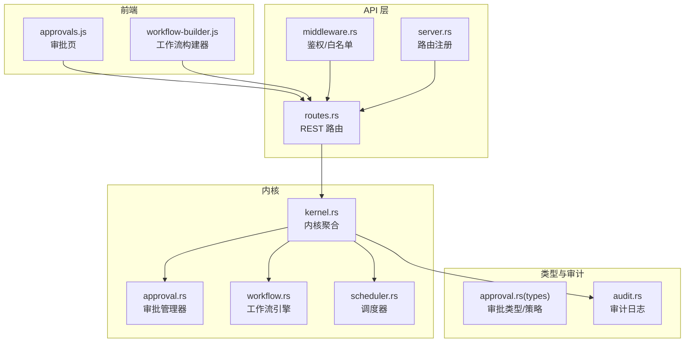
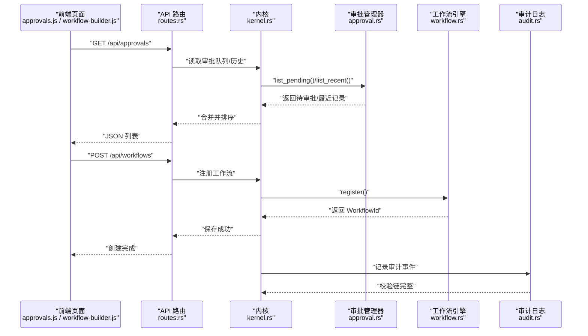
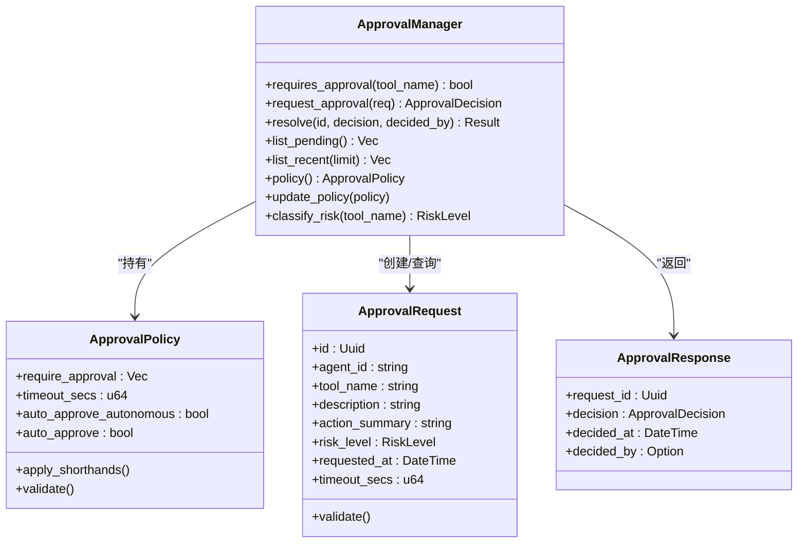
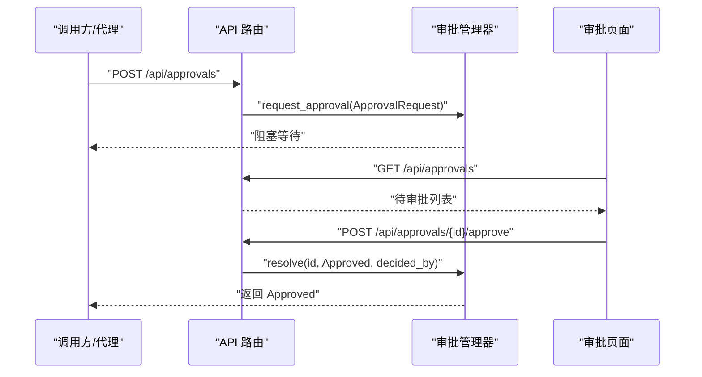
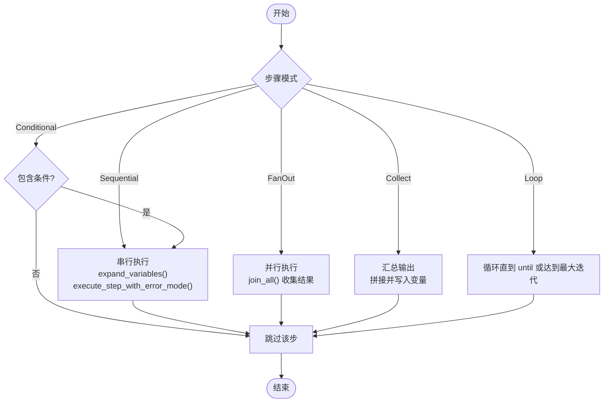
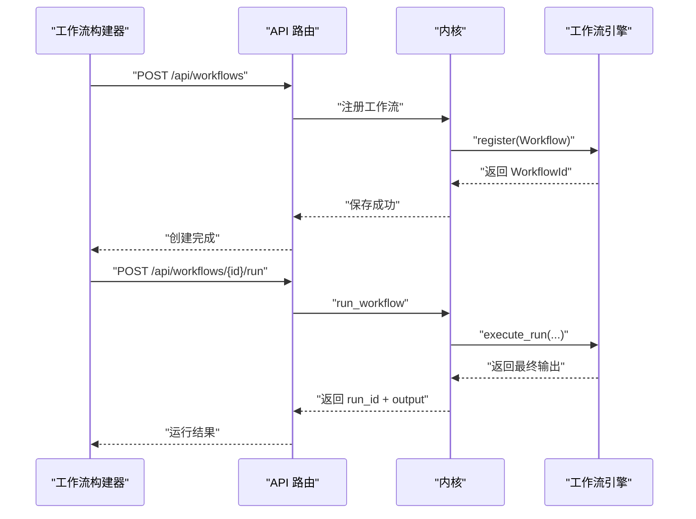
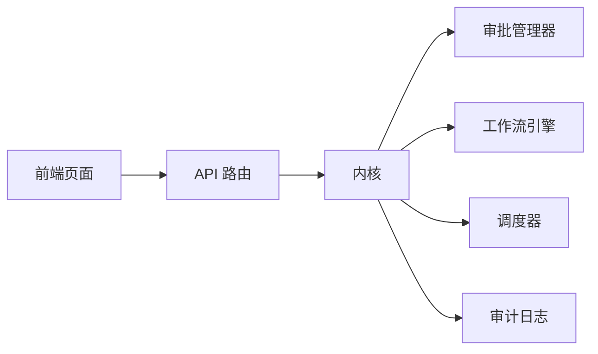

# 审批工作流（Approval & Workflow）

<cite>
**本文引用的文件**
- [crates/openfang-kernel/src/approval.rs](file://crates/openfang-kernel/src/approval.rs)
- [crates/openfang-types/src/approval.rs](file://crates/openfang-types/src/approval.rs)
- [crates/openfang-api/src/routes.rs](file://crates/openfang-api/src/routes.rs)
- [crates/openfang-api/static/js/pages/approvals.js](file://crates/openfang-api/static/js/pages/approvals.js)
- [crates/openfang-kernel/src/workflow.rs](file://crates/openfang-kernel/src/workflow.rs)
- [crates/openfang-api/static/js/pages/workflow-builder.js](file://crates/openfang-api/static/js/pages/workflow-builder.js)
- [crates/openfang-kernel/tests/workflow_integration_test.rs](file://crates/openfang-kernel/tests/workflow_integration_test.rs)
- [crates/openfang-kernel/src/kernel.rs](file://crates/openfang-kernel/src/kernel.rs)
- [crates/openfang-api/src/server.rs](file://crates/openfang-api/src/server.rs)
- [crates/openfang-api/src/middleware.rs](file://crates/openfang-api/src/middleware.rs)
- [crates/openfang-runtime/src/audit.rs](file://crates/openfang-runtime/src/audit.rs)
- [crates/openfang-kernel/src/scheduler.rs](file://crates/openfang-kernel/src/scheduler.rs)
</cite>

## 目录
1. [简介](#简介)
2. [项目结构](#项目结构)
3. [核心组件](#核心组件)
4. [架构总览](#架构总览)
5. [详细组件分析](#详细组件分析)
6. [依赖关系分析](#依赖关系分析)
7. [性能考量](#性能考量)
8. [故障排查指南](#故障排查指南)
9. [结论](#结论)
10. [附录](#附录)

## 简介
本技术文档聚焦 OpenFang 的“审批工作流”能力，系统化阐述两大部分：
- 审批流程：审批定义、流转规则、条件判断、决策机制与 API 集成。
- 工作流引擎：流程建模、状态管理、并行执行、异常处理与可视化。

文档同时给出可操作的实践建议，帮助团队实现业务流程自动化与合规性管理。

## 项目结构
围绕审批与工作流的关键模块分布如下：
- 类型与策略：审批类型、策略与风险等级定义位于 openfang-types。
- 内核与引擎：审批管理器与工作流引擎位于 openfang-kernel；内核组合各子系统。
- API 层：Axum 路由暴露审批与工作流的 REST 接口，并在中间件中控制访问。
- 前端页面：审批队列与工作流可视化编辑器通过静态 JS 实现交互。
- 运行时与审计：运行时审计日志用于合规追踪；调度器负责资源配额与使用统计。

图示来源
- [crates/openfang-api/src/server.rs:299-339](file://crates/openfang-api/src/server.rs#L299-L339)
- [crates/openfang-api/src/routes.rs:9400-9600](file://crates/openfang-api/src/routes.rs#L9400-L9600)
- [crates/openfang-kernel/src/kernel.rs:60-164](file://crates/openfang-kernel/src/kernel.rs#L60-L164)
- [crates/openfang-kernel/src/approval.rs:17-188](file://crates/openfang-kernel/src/approval.rs#L17-L188)
- [crates/openfang-kernel/src/workflow.rs:200-798](file://crates/openfang-kernel/src/workflow.rs#L200-L798)
- [crates/openfang-kernel/src/scheduler.rs:43-145](file://crates/openfang-kernel/src/scheduler.rs#L43-L145)
- [crates/openfang-types/src/approval.rs:165-280](file://crates/openfang-types/src/approval.rs#L165-L280)
- [crates/openfang-runtime/src/audit.rs:113-347](file://crates/openfang-runtime/src/audit.rs#L113-L347)
- [crates/openfang-api/static/js/pages/approvals.js:1-83](file://crates/openfang-api/static/js/pages/approvals.js#L1-L83)
- [crates/openfang-api/static/js/pages/workflow-builder.js:1-635](file://crates/openfang-api/static/js/pages/workflow-builder.js#L1-L635)

章节来源
- [crates/openfang-api/src/server.rs:299-339](file://crates/openfang-api/src/server.rs#L299-L339)
- [crates/openfang-api/src/routes.rs:9400-9600](file://crates/openfang-api/src/routes.rs#L9400-L9600)
- [crates/openfang-kernel/src/kernel.rs:60-164](file://crates/openfang-kernel/src/kernel.rs#L60-L164)

## 核心组件
- 审批策略与类型
  - 策略字段：需要审批的工具清单、超时秒数、是否自动批准等。
  - 风险等级：低/中/高/危急，用于 UI 与告警。
  - 请求/响应模型：携带决策者、时间戳、超时等信息。
- 审批管理器
  - 维护待审批请求、近期记录、策略热更新。
  - 提供阻塞式请求等待与超时处理，支持按 ID 解决审批。
- 工作流引擎
  - 定义步骤模式：顺序、并行（扇出/收集）、条件、循环、错误处理。
  - 管理运行实例状态、步骤结果、令牌用量与耗时统计。
- API 与前端
  - 暴露审批列表、创建、批准/拒绝接口。
  - 暴露工作流 CRUD、运行、历史查询与可视化构建器。
- 审计与配额
  - 审计链路确保不可篡改的历史轨迹。
  - 调度器跟踪令牌用量与配额，防止超额。

章节来源
- [crates/openfang-types/src/approval.rs:165-280](file://crates/openfang-types/src/approval.rs#L165-L280)
- [crates/openfang-kernel/src/approval.rs:17-188](file://crates/openfang-kernel/src/approval.rs#L17-L188)
- [crates/openfang-kernel/src/workflow.rs:66-198](file://crates/openfang-kernel/src/workflow.rs#L66-L198)
- [crates/openfang-api/src/routes.rs:9400-9600](file://crates/openfang-api/src/routes.rs#L9400-L9600)
- [crates/openfang-runtime/src/audit.rs:113-347](file://crates/openfang-runtime/src/audit.rs#L113-L347)
- [crates/openfang-kernel/src/scheduler.rs:43-145](file://crates/openfang-kernel/src/scheduler.rs#L43-L145)

## 架构总览
下图展示了从 API 到内核再到引擎与审计的整体调用链，以及审批与工作流两条主线。

图示来源
- [crates/openfang-api/src/routes.rs:9400-9600](file://crates/openfang-api/src/routes.rs#L9400-L9600)
- [crates/openfang-kernel/src/kernel.rs:60-164](file://crates/openfang-kernel/src/kernel.rs#L60-L164)
- [crates/openfang-kernel/src/approval.rs:17-188](file://crates/openfang-kernel/src/approval.rs#L17-L188)
- [crates/openfang-kernel/src/workflow.rs:200-798](file://crates/openfang-kernel/src/workflow.rs#L200-L798)
- [crates/openfang-runtime/src/audit.rs:113-347](file://crates/openfang-runtime/src/audit.rs#L113-L347)

## 详细组件分析

### 审批流程与引擎
- 审批定义与策略
  - 策略字段：require_approval、timeout_secs、auto_approve_autonomous、auto_approve。
  - 支持布尔简写与工具名列表混用，便于快速配置。
  - 风险等级分类：根据工具名映射到低/中/高/危急。
- 请求与响应
  - 请求包含工具名、描述、动作摘要、风险等级、超时秒数等。
  - 响应包含决策、决策时间、决策人等。
- 流转规则与决策
  - requires_approval 按策略匹配工具名。
  - request_approval 创建待审批项，限制每个代理的最大待审批数量，超时自动拒绝并记录。
  - resolve 支持批准/拒绝，发送决策给等待中的调用方。
- API 集成
  - GET /api/approvals 返回待审批与近期记录，按状态优先与时间排序。
  - POST /api/approvals 创建手动审批请求。
  - POST /api/approvals/{id}/approve 与 /api/approvals/{id}/reject 处理决策。

图示来源
- [crates/openfang-types/src/approval.rs:165-280](file://crates/openfang-types/src/approval.rs#L165-L280)
- [crates/openfang-types/src/approval.rs:74-160](file://crates/openfang-types/src/approval.rs#L74-L160)
- [crates/openfang-kernel/src/approval.rs:17-188](file://crates/openfang-kernel/src/approval.rs#L17-L188)

图示来源
- [crates/openfang-api/src/routes.rs:9475-9587](file://crates/openfang-api/src/routes.rs#L9475-L9587)
- [crates/openfang-kernel/src/approval.rs:52-126](file://crates/openfang-kernel/src/approval.rs#L52-L126)
- [crates/openfang-api/static/js/pages/approvals.js:37-80](file://crates/openfang-api/static/js/pages/approvals.js#L37-L80)

章节来源
- [crates/openfang-types/src/approval.rs:165-280](file://crates/openfang-types/src/approval.rs#L165-L280)
- [crates/openfang-kernel/src/approval.rs:17-188](file://crates/openfang-kernel/src/approval.rs#L17-L188)
- [crates/openfang-api/src/routes.rs:9400-9600](file://crates/openfang-api/src/routes.rs#L9400-L9600)
- [crates/openfang-api/static/js/pages/approvals.js:1-83](file://crates/openfang-api/static/js/pages/approvals.js#L1-L83)

### 工作流引擎与可视化
- 流程建模
  - 步骤模式：Sequential、FanOut、Collect、Conditional、Loop。
  - 错误处理：Fail/Skip/Retry，支持超时与重试次数。
  - 变量存储：支持将输出存入命名变量，供后续模板替换使用。
- 状态管理与执行
  - 运行状态：Pending/Running/Completed/Failed。
  - 执行器：按步骤顺序或并行执行，支持条件跳过与循环终止。
  - 结果记录：每步输出、令牌用量、耗时、代理标识。
- 可视化与导出
  - 前端拖拽画布，节点类型覆盖 Agent/Parallel/Condition/Loop/Collect/Start/End。
  - 导出为 TOML 片段，便于持久化与版本管理。
- API 与 CLI
  - REST：创建/查询/运行工作流，列出运行历史。
  - CLI：后台线程拉取运行历史与触发运行。

图示来源
- [crates/openfang-kernel/src/workflow.rs:430-798](file://crates/openfang-kernel/src/workflow.rs#L430-L798)
- [crates/openfang-api/static/js/pages/workflow-builder.js:470-571](file://crates/openfang-api/static/js/pages/workflow-builder.js#L470-L571)

图示来源
- [crates/openfang-api/src/server.rs:299-339](file://crates/openfang-api/src/server.rs#L299-L339)
- [crates/openfang-kernel/src/workflow.rs:200-798](file://crates/openfang-kernel/src/workflow.rs#L200-L798)
- [crates/openfang-kernel/tests/workflow_integration_test.rs:64-172](file://crates/openfang-kernel/tests/workflow_integration_test.rs#L64-L172)

章节来源
- [crates/openfang-kernel/src/workflow.rs:66-198](file://crates/openfang-kernel/src/workflow.rs#L66-L198)
- [crates/openfang-kernel/src/workflow.rs:430-798](file://crates/openfang-kernel/src/workflow.rs#L430-L798)
- [crates/openfang-api/static/js/pages/workflow-builder.js:1-635](file://crates/openfang-api/static/js/pages/workflow-builder.js#L1-L635)
- [crates/openfang-kernel/tests/workflow_integration_test.rs:64-172](file://crates/openfang-kernel/tests/workflow_integration_test.rs#L64-L172)

### 审批与工作流的协同
- 在工作流中，当某一步骤调用需要审批的工具时，内核会创建审批请求并阻塞当前步骤，直至人工批准或超时。
- 审批页面实时显示待审批项，管理员可在界面上批准或拒绝，从而恢复被阻塞的工作流执行。
- 审计日志记录审批决策与关键操作，形成可追溯的合规证据链。

章节来源
- [crates/openfang-kernel/src/approval.rs:52-126](file://crates/openfang-kernel/src/approval.rs#L52-L126)
- [crates/openfang-api/src/routes.rs:9400-9600](file://crates/openfang-api/src/routes.rs#L9400-L9600)
- [crates/openfang-runtime/src/audit.rs:113-347](file://crates/openfang-runtime/src/audit.rs#L113-L347)

## 依赖关系分析
- 组件耦合
  - API 路由依赖内核提供的审批管理器与工作流引擎。
  - 内核聚合了调度器、审计日志等子系统，作为审批与工作流的执行载体。
  - 前端页面通过 API 获取数据并驱动 UI 行为。
- 外部依赖
  - Axum 路由框架、Tokio 异步运行时、Serde 序列化、UUID/Chrono 时间库。
- 可能的循环依赖
  - 未发现直接循环依赖；API 路由仅单向依赖内核，内核聚合各子系统，保持清晰的单向依赖。

图示来源
- [crates/openfang-api/src/server.rs:299-339](file://crates/openfang-api/src/server.rs#L299-L339)
- [crates/openfang-kernel/src/kernel.rs:60-164](file://crates/openfang-kernel/src/kernel.rs#L60-L164)

章节来源
- [crates/openfang-api/src/server.rs:299-339](file://crates/openfang-api/src/server.rs#L299-L339)
- [crates/openfang-kernel/src/kernel.rs:60-164](file://crates/openfang-kernel/src/kernel.rs#L60-L164)

## 性能考量
- 并发与限流
  - 审批：每个代理最多保留固定数量的待审批请求，避免积压导致资源耗尽。
  - 工作流：FanOut 并行执行多个步骤，但需注意下游代理的并发与资源配额。
- 超时与重试
  - 步骤级超时与错误处理（Fail/Skip/Retry）降低失败传播与阻塞时间。
- 存储与清理
  - 工作流运行记录与审批近期记录均有限制容量，超过阈值按时间淘汰旧记录，避免内存膨胀。
- 资源配额
  - 调度器基于小时窗口统计令牌用量，防止代理超额使用造成服务不稳定。

章节来源
- [crates/openfang-kernel/src/approval.rs:12-188](file://crates/openfang-kernel/src/approval.rs#L12-L188)
- [crates/openfang-kernel/src/workflow.rs:258-314](file://crates/openfang-kernel/src/workflow.rs#L258-L314)
- [crates/openfang-kernel/src/scheduler.rs:43-145](file://crates/openfang-kernel/src/scheduler.rs#L43-L145)

## 故障排查指南
- 审批无响应或超时
  - 检查审批队列是否已满（每代理上限），确认超时设置是否合理。
  - 确认审批页面是否正确显示待审批项，必要时刷新或检查网络连接。
- 审批被拒绝或超时
  - 查看审批历史记录，确认决策者与时间戳；若为超时，检查审批策略 timeout_secs。
- 工作流执行失败
  - 查看运行历史与每步结果，定位失败步骤与错误模式（Fail/Skip/Retry）。
  - 检查代理解析（By Id/By Name）是否正确，模板变量是否缺失。
- 审计与合规
  - 使用审计页面过滤与搜索，核对关键事件（工具调用、Shell 执行、网络访问等）。
- API 权限
  - 中间件对部分只读接口放行，确认当前用户角色与访问路径是否符合白名单。

章节来源
- [crates/openfang-api/src/middleware.rs:107-130](file://crates/openfang-api/src/middleware.rs#L107-L130)
- [crates/openfang-api/src/routes.rs:9400-9600](file://crates/openfang-api/src/routes.rs#L9400-L9600)
- [crates/openfang-runtime/src/audit.rs:113-347](file://crates/openfang-runtime/src/audit.rs#L113-L347)

## 结论
OpenFang 将“审批”与“工作流”两大能力以清晰的类型与引擎设计贯穿于内核与 API 层，配合可视化构建器与审计日志，既满足业务流程自动化的需求，又兼顾合规与可观测性。通过合理的策略配置、超时与重试机制、配额控制与历史清理，系统在复杂场景下仍能保持稳定与可维护性。

## 附录
- API 端点速览（审批）
  - GET /api/approvals：列出待审批与近期记录
  - POST /api/approvals：创建手动审批请求
  - POST /api/approvals/{id}/approve：批准
  - POST /api/approvals/{id}/reject：拒绝
- API 端点速览（工作流）
  - GET /api/workflows：列出工作流
  - POST /api/workflows：创建工作流
  - GET /api/workflows/{id}：获取工作流详情
  - PUT /api/workflows/{id}：更新工作流
  - DELETE /api/workflows/{id}：删除工作流
  - POST /api/workflows/{id}/run：运行工作流
  - GET /api/workflows/{id}/runs：列出运行历史
- 最佳实践
  - 明确审批策略：最小化 require_approval 列表，仅对高风险工具启用审批。
  - 合理设置超时：结合工具特性与 SLA 设定 timeout_secs。
  - 使用条件与循环：在工作流中加入条件判断与循环终止，提升鲁棒性。
  - 可视化建模：通过前端构建器生成 TOML，便于版本管理与复用。
  - 合规审计：定期审查审计日志，建立事件分级与告警机制。

章节来源
- [crates/openfang-api/src/server.rs:299-339](file://crates/openfang-api/src/server.rs#L299-L339)
- [crates/openfang-api/src/routes.rs:9400-9600](file://crates/openfang-api/src/routes.rs#L9400-L9600)
- [crates/openfang-kernel/tests/workflow_integration_test.rs:64-172](file://crates/openfang-kernel/tests/workflow_integration_test.rs#L64-L172)