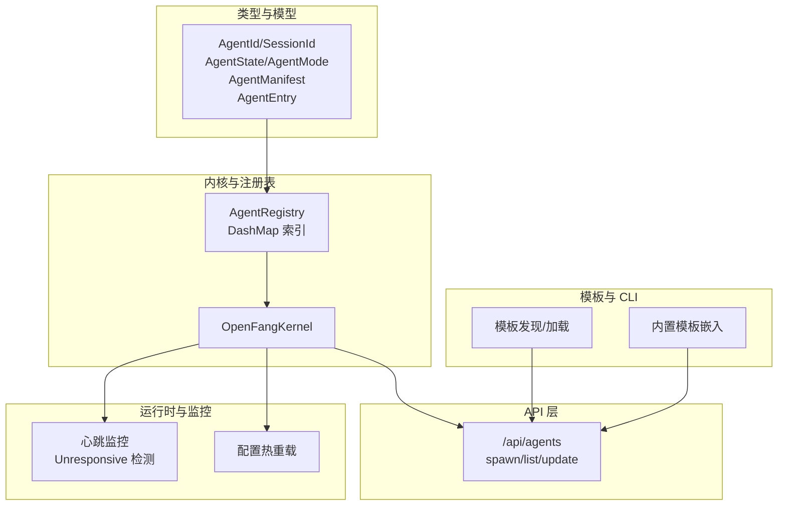
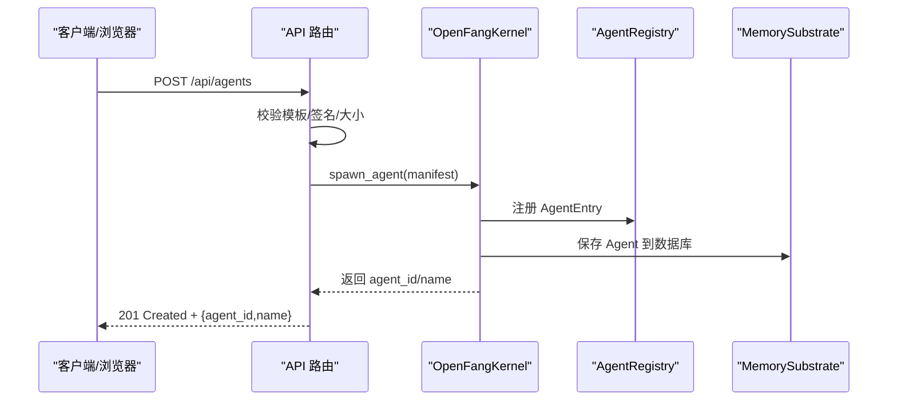
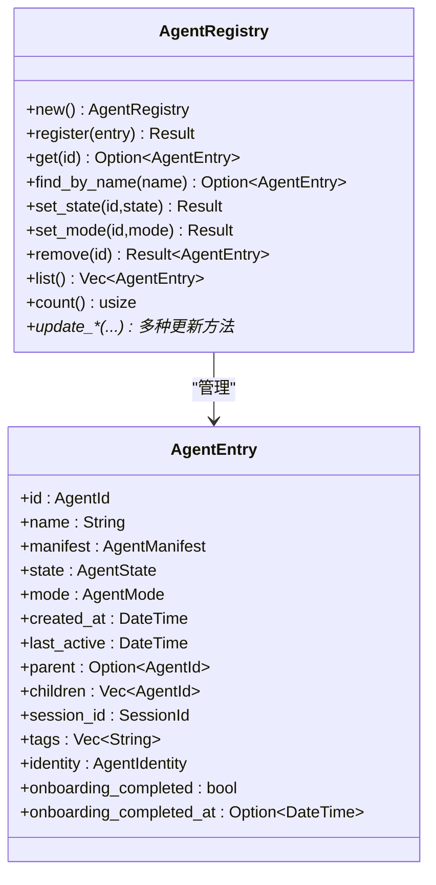
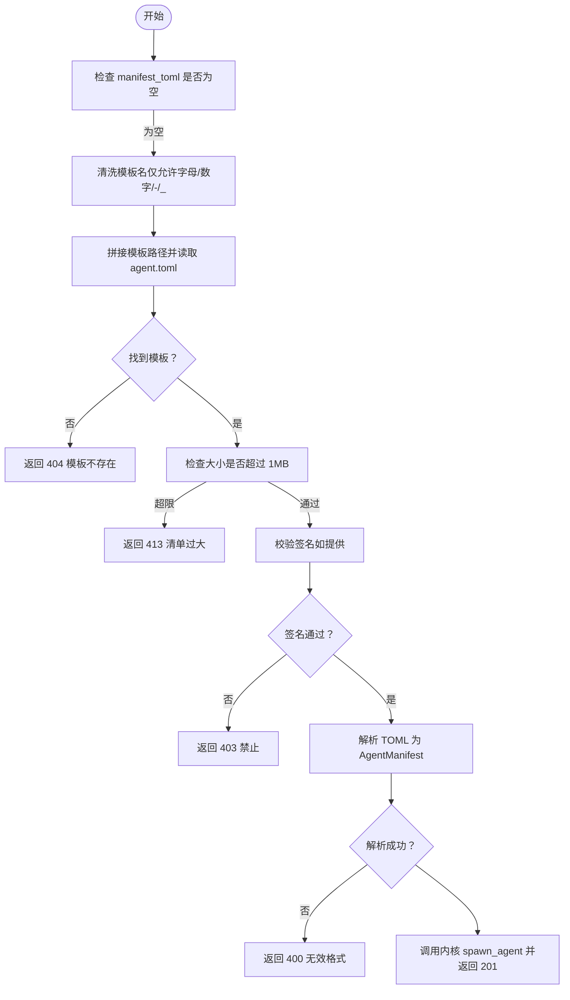
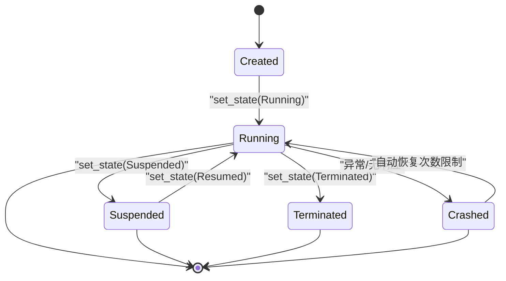
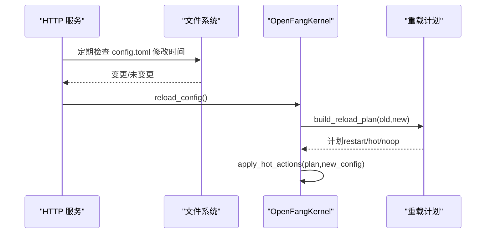
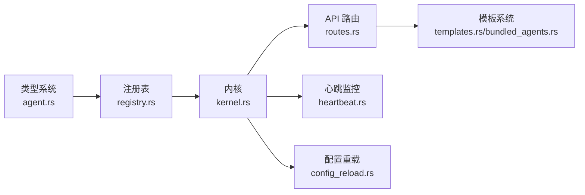

# 智能体注册表（Registry）

<cite>
**本文引用的文件**
- [crates/openfang-kernel/src/registry.rs](file://crates/openfang-kernel/src/registry.rs)
- [crates/openfang-types/src/agent.rs](file://crates/openfang-types/src/agent.rs)
- [crates/openfang-kernel/src/kernel.rs](file://crates/openfang-kernel/src/kernel.rs)
- [crates/openfang-kernel/src/heartbeat.rs](file://crates/openfang-kernel/src/heartbeat.rs)
- [crates/openfang-api/src/routes.rs](file://crates/openfang-api/src/routes.rs)
- [crates/openfang-cli/src/templates.rs](file://crates/openfang-cli/src/templates.rs)
- [crates/openfang-cli/src/bundled_agents.rs](file://crates/openfang-cli/src/bundled_agents.rs)
- [crates/openfang-api/src/server.rs](file://crates/openfang-api/src/server.rs)
- [crates/openfang-kernel/src/config_reload.rs](file://crates/openfang-kernel/src/config_reload.rs)
- [crates/openfang-types/src/event.rs](file://crates/openfang-types/src/event.rs)
</cite>

## 目录
1. [简介](#简介)
2. [项目结构](#项目结构)
3. [核心组件](#核心组件)
4. [架构总览](#架构总览)
5. [详细组件分析](#详细组件分析)
6. [依赖关系分析](#依赖关系分析)
7. [性能考量](#性能考量)
8. [故障排除指南](#故障排除指南)
9. [结论](#结论)
10. [附录](#附录)

## 简介
本文件面向 OpenFang 智能体注册表系统，系统性阐述智能体的发现、注册、状态跟踪与生命周期管理机制。重点覆盖以下方面：
- 注册表结构设计与索引策略
- 智能体元数据存储与版本管理
- 依赖解析与模板系统
- 配置验证与热重载机制
- 状态跟踪与心跳监控
- 常见使用场景与最佳实践
- 故障排除与常见问题定位

## 项目结构
OpenFang 的智能体注册表位于内核子系统中，围绕类型定义、注册表实现、内核编排、API 路由、CLI 模板与热重载等模块协同工作。

图示来源
- [crates/openfang-types/src/agent.rs](file://crates/openfang-types/src/agent.rs)
- [crates/openfang-kernel/src/registry.rs](file://crates/openfang-kernel/src/registry.rs)
- [crates/openfang-kernel/src/kernel.rs](file://crates/openfang-kernel/src/kernel.rs)
- [crates/openfang-api/src/routes.rs](file://crates/openfang-api/src/routes.rs)
- [crates/openfang-cli/src/templates.rs](file://crates/openfang-cli/src/templates.rs)
- [crates/openfang-cli/src/bundled_agents.rs](file://crates/openfang-cli/src/bundled_agents.rs)
- [crates/openfang-kernel/src/heartbeat.rs](file://crates/openfang-kernel/src/heartbeat.rs)
- [crates/openfang-kernel/src/config_reload.rs](file://crates/openfang-kernel/src/config_reload.rs)

章节来源
- [crates/openfang-types/src/agent.rs](file://crates/openfang-types/src/agent.rs)
- [crates/openfang-kernel/src/registry.rs](file://crates/openfang-kernel/src/registry.rs)
- [crates/openfang-kernel/src/kernel.rs](file://crates/openfang-kernel/src/kernel.rs)
- [crates/openfang-api/src/routes.rs](file://crates/openfang-api/src/routes.rs)
- [crates/openfang-cli/src/templates.rs](file://crates/openfang-cli/src/templates.rs)
- [crates/openfang-cli/src/bundled_agents.rs](file://crates/openfang-cli/src/bundled_agents.rs)
- [crates/openfang-kernel/src/heartbeat.rs](file://crates/openfang-kernel/src/heartbeat.rs)
- [crates/openfang-kernel/src/config_reload.rs](file://crates/openfang-kernel/src/config_reload.rs)

## 核心组件
- 注册表（AgentRegistry）：多索引内存结构，支持按 ID、名称、标签快速检索；提供注册、查询、更新、移除与计数等操作。
- 类型系统（AgentEntry/AgentManifest）：统一描述智能体身份、清单、状态、模式、资源配额、工具与 MCP 允许列表等。
- 内核集成（OpenFangKernel）：在启动、调度、持久化、事件发布、触发器注册等环节与注册表交互。
- API 路由：提供智能体创建、查询、更新、重启等接口，并对模板与签名进行校验。
- 模板系统：CLI 发现与加载模板，内置模板嵌入，支持向导式生成 TOML。
- 心跳监控：基于 last_active 与配置阈值检测无响应智能体，支持自动恢复策略。
- 配置热重载：监听配置文件变更，构建重载计划并应用可热更新项。

章节来源
- [crates/openfang-kernel/src/registry.rs](file://crates/openfang-kernel/src/registry.rs)
- [crates/openfang-types/src/agent.rs](file://crates/openfang-types/src/agent.rs)
- [crates/openfang-kernel/src/kernel.rs](file://crates/openfang-kernel/src/kernel.rs)
- [crates/openfang-api/src/routes.rs](file://crates/openfang-api/src/routes.rs)
- [crates/openfang-cli/src/templates.rs](file://crates/openfang-cli/src/templates.rs)
- [crates/openfang-cli/src/bundled_agents.rs](file://crates/openfang-cli/src/bundled_agents.rs)
- [crates/openfang-kernel/src/heartbeat.rs](file://crates/openfang-kernel/src/heartbeat.rs)
- [crates/openfang-kernel/src/config_reload.rs](file://crates/openfang-kernel/src/config_reload.rs)

## 架构总览
下图展示了从 API 请求到内核编排再到注册表与持久化的完整链路。

图示来源
- [crates/openfang-api/src/routes.rs](file://crates/openfang-api/src/routes.rs)
- [crates/openfang-kernel/src/kernel.rs](file://crates/openfang-kernel/src/kernel.rs)
- [crates/openfang-kernel/src/registry.rs](file://crates/openfang-kernel/src/registry.rs)

章节来源
- [crates/openfang-api/src/routes.rs](file://crates/openfang-api/src/routes.rs)
- [crates/openfang-kernel/src/kernel.rs](file://crates/openfang-kernel/src/kernel.rs)
- [crates/openfang-kernel/src/registry.rs](file://crates/openfang-kernel/src/registry.rs)

## 详细组件分析

### 注册表（AgentRegistry）设计与实现
- 数据结构
  - 主索引：AgentId → AgentEntry
  - 名称索引：name → AgentId
  - 标签索引：tag → Vec<AgentId>
  - 使用并发安全的 DashMap 实现读写分离与高并发访问
- 关键能力
  - 注册：去重检查（名称唯一），建立索引，插入主表
  - 查询：按 ID 获取、按名称查找、列出全部、统计数量
  - 更新：状态、模式、会话 ID、工作区、身份、模型、技能/MCP 过滤、系统提示、名称、描述、资源配额、标记完成等
  - 移除：删除主表记录并同步清理名称与标签索引
- 生命周期与状态
  - 状态枚举：Created、Running、Suspended、Terminated、Crashed
  - 模式枚举：Observe、Assist、Full，用于工具过滤
  - last_active 字段用于心跳与恢复策略

图示来源
- [crates/openfang-kernel/src/registry.rs](file://crates/openfang-kernel/src/registry.rs)
- [crates/openfang-types/src/agent.rs](file://crates/openfang-types/src/agent.rs)

章节来源
- [crates/openfang-kernel/src/registry.rs](file://crates/openfang-kernel/src/registry.rs)
- [crates/openfang-types/src/agent.rs](file://crates/openfang-types/src/agent.rs)

### 智能体元数据与版本管理
- AgentManifest 描述智能体的完整配置：名称、版本、描述、作者、模块路径、调度模式、模型配置、回退模型链、资源配额、优先级、能力声明、工具与技能、MCP 服务器允许列表、标签、路由与自治配置、工作区、执行策略、工具白黑名单等。
- 版本管理：字段 version 支持语义化版本，可用于后续迁移与兼容性判断。
- 工具与能力：通过 ManifestCapabilities 与 ToolProfile 推导工具集与能力集合，简化权限授予与审计。

章节来源
- [crates/openfang-types/src/agent.rs](file://crates/openfang-types/src/agent.rs)

### 模板系统与配置验证
- 模板发现与加载
  - CLI 支持从仓库 agents/、用户安装目录 ~/.openfang/agents/、环境变量 OPENFANG_AGENTS_DIR 等位置发现模板
  - 若磁盘未找到，则回退到内置模板（编译期嵌入）
- 配置验证
  - API 在创建智能体前对模板名进行路径穿越防护，限制最大清单大小
  - 对签名清单进行 Ed25519 校验，确保来源可信
  - 对 TOML 清单进行解析校验，错误时返回明确错误码

图示来源
- [crates/openfang-api/src/routes.rs](file://crates/openfang-api/src/routes.rs)
- [crates/openfang-cli/src/templates.rs](file://crates/openfang-cli/src/templates.rs)
- [crates/openfang-cli/src/bundled_agents.rs](file://crates/openfang-cli/src/bundled_agents.rs)

章节来源
- [crates/openfang-api/src/routes.rs](file://crates/openfang-api/src/routes.rs)
- [crates/openfang-cli/src/templates.rs](file://crates/openfang-cli/src/templates.rs)
- [crates/openfang-cli/src/bundled_agents.rs](file://crates/openfang-cli/src/bundled_agents.rs)

### 状态跟踪与生命周期管理
- 生命周期事件：Spawned、Started、Suspended、Resumed、Terminated、Crashed
- 内核在创建智能体后注册到调度器、写入注册表、持久化到数据库，并发布生命周期事件
- 心跳监控：基于 last_active 与配置阈值判断无响应；对 Crashed 智能体尝试有限次自动恢复；忽略刚创建且从未真正活跃的智能体

图示来源
- [crates/openfang-types/src/event.rs](file://crates/openfang-types/src/event.rs)
- [crates/openfang-kernel/src/registry.rs](file://crates/openfang-kernel/src/registry.rs)
- [crates/openfang-kernel/src/heartbeat.rs](file://crates/openfang-kernel/src/heartbeat.rs)

章节来源
- [crates/openfang-types/src/event.rs](file://crates/openfang-types/src/event.rs)
- [crates/openfang-kernel/src/registry.rs](file://crates/openfang-kernel/src/registry.rs)
- [crates/openfang-kernel/src/heartbeat.rs](file://crates/openfang-kernel/src/heartbeat.rs)

### 配置热重载机制
- 后台轮询：API 服务启动后以固定周期轮询配置文件修改时间，检测到变更后触发重载
- 重载计划：比较新旧配置，分类为需重启、可热更新或无操作三类
- 应用策略：根据当前重载模式决定是否应用热更新动作

图示来源
- [crates/openfang-api/src/server.rs](file://crates/openfang-api/src/server.rs)
- [crates/openfang-kernel/src/config_reload.rs](file://crates/openfang-kernel/src/config_reload.rs)
- [crates/openfang-kernel/src/kernel.rs](file://crates/openfang-kernel/src/kernel.rs)

章节来源
- [crates/openfang-api/src/server.rs](file://crates/openfang-api/src/server.rs)
- [crates/openfang-kernel/src/config_reload.rs](file://crates/openfang-kernel/src/config_reload.rs)
- [crates/openfang-kernel/src/kernel.rs](file://crates/openfang-kernel/src/kernel.rs)

## 依赖关系分析
- 注册表依赖类型系统中的 AgentEntry/AgentManifest/AgentState/AgentMode 等
- 内核在启动、调度、持久化、事件发布、触发器注册等环节与注册表交互
- API 路由依赖内核提供的 spawn/list/update 等能力
- 心跳监控依赖注册表的 list 与 AgentEntry 的 last_active 字段
- 配置热重载依赖内核的 reload_config 与重载计划模块

图示来源
- [crates/openfang-types/src/agent.rs](file://crates/openfang-types/src/agent.rs)
- [crates/openfang-kernel/src/registry.rs](file://crates/openfang-kernel/src/registry.rs)
- [crates/openfang-kernel/src/kernel.rs](file://crates/openfang-kernel/src/kernel.rs)
- [crates/openfang-api/src/routes.rs](file://crates/openfang-api/src/routes.rs)
- [crates/openfang-kernel/src/heartbeat.rs](file://crates/openfang-kernel/src/heartbeat.rs)
- [crates/openfang-kernel/src/config_reload.rs](file://crates/openfang-kernel/src/config_reload.rs)
- [crates/openfang-cli/src/templates.rs](file://crates/openfang-cli/src/templates.rs)
- [crates/openfang-cli/src/bundled_agents.rs](file://crates/openfang-cli/src/bundled_agents.rs)

章节来源
- [crates/openfang-types/src/agent.rs](file://crates/openfang-types/src/agent.rs)
- [crates/openfang-kernel/src/registry.rs](file://crates/openfang-kernel/src/registry.rs)
- [crates/openfang-kernel/src/kernel.rs](file://crates/openfang-kernel/src/kernel.rs)
- [crates/openfang-api/src/routes.rs](file://crates/openfang-api/src/routes.rs)
- [crates/openfang-kernel/src/heartbeat.rs](file://crates/openfang-kernel/src/heartbeat.rs)
- [crates/openfang-kernel/src/config_reload.rs](file://crates/openfang-kernel/src/config_reload.rs)
- [crates/openfang-cli/src/templates.rs](file://crates/openfang-cli/src/templates.rs)
- [crates/openfang-cli/src/bundled_agents.rs](file://crates/openfang-cli/src/bundled_agents.rs)

## 性能考量
- 并发与锁：注册表采用 DashMap 提供的并发读写，避免全局互斥，适合高并发场景
- 索引策略：名称与标签索引便于快速查找；注意标签索引的维护成本与内存占用
- 心跳开销：心跳检查遍历所有 Running/Crashed 智能体，建议合理设置检查间隔与超时阈值
- 热重载：仅对可热更新项应用，避免不必要的重启；对大配置文件应控制变更频率

## 故障排除指南
- 创建失败（400/403/404/413）
  - 400：清单格式无效或字段缺失
  - 403：签名验证失败
  - 404：模板名不合法或模板文件不存在
  - 413：清单过大（>1MB）
- 无响应告警
  - 检查智能体 last_active 是否持续更新
  - 调整心跳阈值或自治配置中的心跳间隔
  - 查看日志中“Agent is unresponsive”警告
- 自动恢复失败
  - 检查恢复尝试次数上限与冷却时间
  - 确认智能体模块与外部依赖可用
- 热重载未生效
  - 确认配置文件变更被检测到
  - 查看重载计划输出，确认属于可热更新类别

章节来源
- [crates/openfang-api/src/routes.rs](file://crates/openfang-api/src/routes.rs)
- [crates/openfang-kernel/src/heartbeat.rs](file://crates/openfang-kernel/src/heartbeat.rs)
- [crates/openfang-kernel/src/config_reload.rs](file://crates/openfang-kernel/src/config_reload.rs)

## 结论
OpenFang 的智能体注册表以类型安全的结构为核心，结合并发索引与内核编排，实现了高效、可观测、可扩展的智能体生命周期管理。配合模板系统、配置验证与热重载机制，为用户提供从创建、运行到维护的全链路体验。建议在生产环境中合理设置心跳阈值与资源配额，启用签名与大小限制，并定期审查模板与配置变更策略。

## 附录

### 常用操作示例（路径指引）
- 注册智能体
  - API：POST /api/agents（请求体包含 manifest_toml 或 template）
  - 参考：[crates/openfang-api/src/routes.rs](file://crates/openfang-api/src/routes.rs)
- 查询智能体列表
  - API：GET /api/agents
  - 参考：[crates/openfang-api/src/routes.rs](file://crates/openfang-api/src/routes.rs)
- 更新智能体配置（热更新）
  - API：PUT /api/agents/:id（支持模型、技能、MCP、系统提示等）
  - 参考：[crates/openfang-api/src/routes.rs](file://crates/openfang-api/src/routes.rs)
- 设置智能体模式
  - API：PUT /api/agents/:id/mode
  - 参考：[crates/openfang-api/src/routes.rs](file://crates/openfang-api/src/routes.rs)
- 重启智能体
  - API：POST /api/agents/:id/restart
  - 参考：[crates/openfang-api/src/routes.rs](file://crates/openfang-api/src/routes.rs)
- 模板发现与加载
  - CLI：discover_template_dirs/load_all_templates
  - 参考：[crates/openfang-cli/src/templates.rs](file://crates/openfang-cli/src/templates.rs)
- 内置模板嵌入
  - CLI：bundled_agents/install_bundled_agents
  - 参考：[crates/openfang-cli/src/bundled_agents.rs](file://crates/openfang-cli/src/bundled_agents.rs)
- 心跳监控
  - check_agents/summarize/RecoveryTracker
  - 参考：[crates/openfang-kernel/src/heartbeat.rs](file://crates/openfang-kernel/src/heartbeat.rs)
- 配置热重载
  - reload_config/apply_hot_actions
  - 参考：[crates/openfang-kernel/src/config_reload.rs](file://crates/openfang-kernel/src/config_reload.rs)