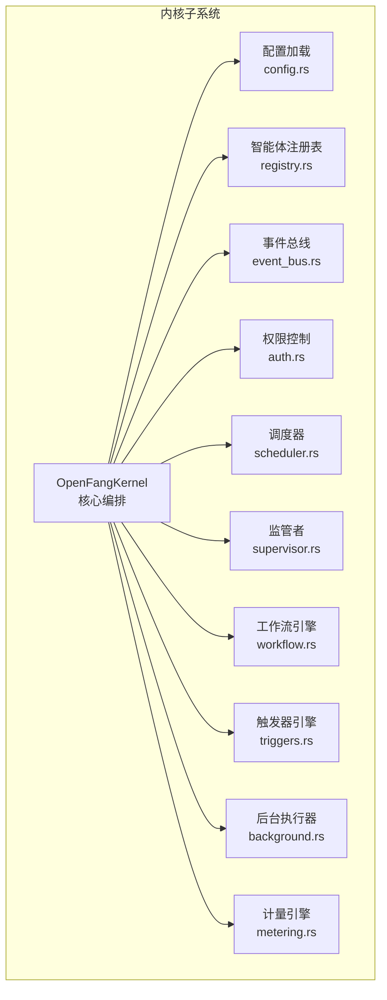
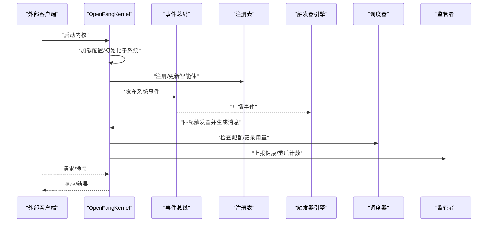
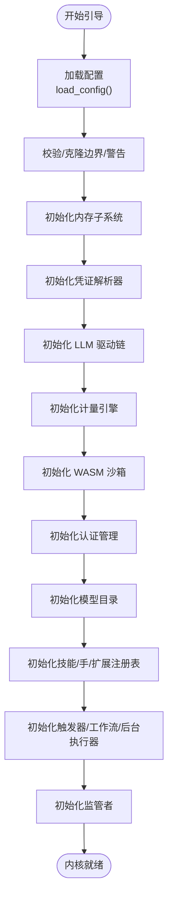
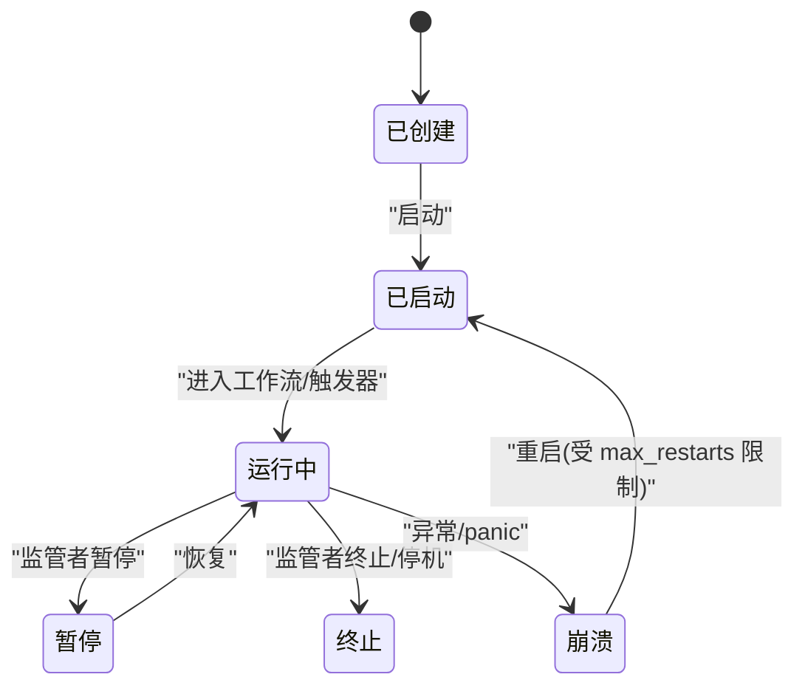
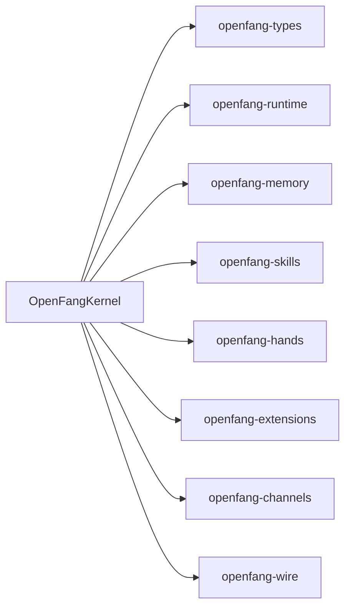

# 核心内核 (OpenFangKernel)

<cite>
**本文引用的文件**
- [lib.rs](file://crates/openfang-kernel/src/lib.rs)
- [kernel.rs](file://crates/openfang-kernel/src/kernel.rs)
- [config.rs](file://crates/openfang-kernel/src/config.rs)
- [event_bus.rs](file://crates/openfang-kernel/src/event_bus.rs)
- [auth.rs](file://crates/openfang-kernel/src/auth.rs)
- [scheduler.rs](file://crates/openfang-kernel/src/scheduler.rs)
- [registry.rs](file://crates/openfang-kernel/src/registry.rs)
- [supervisor.rs](file://crates/openfang-kernel/src/supervisor.rs)
- [workflow.rs](file://crates/openfang-kernel/src/workflow.rs)
- [triggers.rs](file://crates/openfang-kernel/src/triggers.rs)
- [background.rs](file://crates/openfang-kernel/src/background.rs)
- [metering.rs](file://crates/openfang-kernel/src/metering.rs)
</cite>

## 目录
1. [简介](#简介)
2. [项目结构](#项目结构)
3. [核心组件](#核心组件)
4. [架构总览](#架构总览)
5. [详细组件分析](#详细组件分析)
6. [依赖分析](#依赖分析)
7. [性能考虑](#性能考虑)
8. [故障排查指南](#故障排查指南)
9. [结论](#结论)
10. [附录](#附录)

## 简介
OpenFangKernel 是 OpenFang 智能体操作系统的核心内核，负责统一编排与管理智能体生命周期、内存协调、权限控制、事件分发、配额计量、后台执行与触发器、工作流引擎等关键能力。它通过模块化子系统（如 EventBus、AuthManager、AgentScheduler、MeteringEngine、TriggerEngine、WorkflowEngine、BackgroundExecutor、Supervisor 等）协同工作，形成高可用、可扩展、可观测的运行时内核。

## 项目结构
OpenFangKernel 所在的 crate 提供了内核的入口、配置加载、子系统装配与对外 API。核心文件包括：
- 内核入口与导出：lib.rs、kernel.rs
- 配置加载与校验：config.rs
- 子系统：event_bus.rs、auth.rs、scheduler.rs、registry.rs、supervisor.rs、workflow.rs、triggers.rs、background.rs、metering.rs

图表来源
- [kernel.rs:60-164](file://crates/openfang-kernel/src/kernel.rs#L60-L164)
- [config.rs:18-110](file://crates/openfang-kernel/src/config.rs#L18-L110)
- [registry.rs:8-25](file://crates/openfang-kernel/src/registry.rs#L8-L25)
- [event_bus.rs:15-22](file://crates/openfang-kernel/src/event_bus.rs#L15-L22)
- [auth.rs:98-103](file://crates/openfang-kernel/src/auth.rs#L98-L103)
- [scheduler.rs:44-51](file://crates/openfang-kernel/src/scheduler.rs#L44-L51)
- [supervisor.rs:10-21](file://crates/openfang-kernel/src/supervisor.rs#L10-L21)
- [workflow.rs:201-206](file://crates/openfang-kernel/src/workflow.rs#L201-L206)
- [triggers.rs:83-88](file://crates/openfang-kernel/src/triggers.rs#L83-L88)
- [background.rs:21-28](file://crates/openfang-kernel/src/background.rs#L21-L28)
- [metering.rs:9-12](file://crates/openfang-kernel/src/metering.rs#L9-L12)

章节来源
- [lib.rs:1-30](file://crates/openfang-kernel/src/lib.rs#L1-L30)
- [kernel.rs:1-120](file://crates/openfang-kernel/src/kernel.rs#L1-L120)

## 核心组件
- OpenFangKernel：内核主体，聚合所有子系统并提供统一 API；负责启动、装配、生命周期管理与跨模块协作。
- 配置系统：从 TOML 加载配置，支持 include 合并、环境变量覆盖、迁移兼容与深度校验。
- 事件总线：广播/订阅模型，支持按目标（广播、系统、特定代理）路由，并维护历史环形缓冲。
- 权限控制：基于角色的访问控制（RBAC），支持用户识别、授权检查与多平台通道绑定。
- 调度器：资源配额跟踪（令牌/工具调用/成本），周期性重置，任务取消与统计查询。
- 注册表：智能体注册、状态/模式更新、索引（名称/标签）、会话与工作区管理。
- 监管者：优雅停机信号、重启计数、异常统计与健康报告。
- 工作流引擎：多步流水线执行，支持顺序、并行、条件、循环、超时与重试策略。
- 触发器引擎：事件到代理的自动激活，支持生命周期、系统事件、内存更新、内容匹配等模式。
- 后台执行器：连续/周期/主动模式的代理自唤醒，全局并发限制与安全节流。
- 计量引擎：LLM 成本记录与配额检查，支持全局与单代理维度的预算告警。

章节来源
- [kernel.rs:60-164](file://crates/openfang-kernel/src/kernel.rs#L60-L164)
- [config.rs:18-110](file://crates/openfang-kernel/src/config.rs#L18-L110)
- [event_bus.rs:15-99](file://crates/openfang-kernel/src/event_bus.rs#L15-L99)
- [auth.rs:98-189](file://crates/openfang-kernel/src/auth.rs#L98-L189)
- [scheduler.rs:44-145](file://crates/openfang-kernel/src/scheduler.rs#L44-L145)
- [registry.rs:8-345](file://crates/openfang-kernel/src/registry.rs#L8-L345)
- [supervisor.rs:10-115](file://crates/openfang-kernel/src/supervisor.rs#L10-L115)
- [workflow.rs:201-797](file://crates/openfang-kernel/src/workflow.rs#L201-L797)
- [triggers.rs:83-314](file://crates/openfang-kernel/src/triggers.rs#L83-L314)
- [background.rs:21-200](file://crates/openfang-kernel/src/background.rs#L21-L200)
- [metering.rs:9-213](file://crates/openfang-kernel/src/metering.rs#L9-L213)

## 架构总览
OpenFangKernel 采用“子系统聚合 + 事件驱动”的架构设计。内核在启动时加载配置、初始化各子系统并建立它们之间的弱耦合依赖关系；运行期通过 EventBus 实现解耦通信，通过 TriggerEngine 将事件转换为对特定代理的消息；通过 Scheduler/Metering 控制资源使用；通过 Supervisor 统一治理生命周期与健康。

图表来源
- [kernel.rs:506-720](file://crates/openfang-kernel/src/kernel.rs#L506-L720)
- [event_bus.rs:36-73](file://crates/openfang-kernel/src/event_bus.rs#L36-L73)
- [triggers.rs:274-308](file://crates/openfang-kernel/src/triggers.rs#L274-L308)
- [scheduler.rs:78-100](file://crates/openfang-kernel/src/scheduler.rs#L78-L100)
- [supervisor.rs:42-50](file://crates/openfang-kernel/src/supervisor.rs#L42-L50)

## 详细组件分析

### OpenFangKernel 结构体与设计理念
- 设计理念
  - 单一职责：作为装配器与协调者，不直接承担业务逻辑，而是将具体能力委派给子系统。
  - 可观测性：内置审计日志、运行时指标、健康报告与调试接口。
  - 安全与隔离：通过 WASM 沙箱、进程管理、并发节流与权限控制保障安全边界。
  - 可扩展：插件技能、扩展集成、MCP 服务器、渠道适配器等均以注册表/配置驱动。
- 关键字段
  - 配置与注册表：config、registry、capabilities、bindings、broadcast
  - 事件与通信：event_bus、triggers、channel_adapters、delivery_tracker
  - 执行与调度：scheduler、background、running_tasks、a2a_task_store
  - 安全与鉴权：auth、credential_resolver、extension_health
  - 计量与成本：metering、model_catalog、skill_registry、hand_registry
  - 进程与网络：process_manager、peer_registry、peer_node
  - 其他：memory、wasm_sandbox、hooks、whatsapp_gateway_pid、cron_scheduler、approval_manager、auto_reply_engine

章节来源
- [kernel.rs:60-164](file://crates/openfang-kernel/src/kernel.rs#L60-L164)

### 初始化流程（引导）
- 配置加载与校验
  - 支持 include 深度合并、路径安全校验、环境变量覆盖、旧 schema 迁移与默认值回退。
- 子系统初始化
  - 内存子系统（SQLite）、凭证解析器（vault/dotenv/env）、LLM 驱动链（主驱动+回退+自动检测）、计量引擎、WASM 沙箱、认证管理、模型目录、技能/手/扩展注册表、触发器/工作流/后台执行器、监管者。
- 安全与健康
  - 若无可用 LLM 驱动，使用 StubDriver 返回友好错误，保证仪表盘可用。
  - Stable 模式冻结技能注册表，防止热更新破坏稳定性。
- 最终装配
  - 将子系统注入 OpenFangKernel 并设置弱引用 self_handle，便于触发器分发。

图表来源
- [kernel.rs:513-820](file://crates/openfang-kernel/src/kernel.rs#L513-L820)
- [config.rs:18-110](file://crates/openfang-kernel/src/config.rs#L18-L110)

章节来源
- [kernel.rs:506-820](file://crates/openfang-kernel/src/kernel.rs#L506-L820)
- [config.rs:18-110](file://crates/openfang-kernel/src/config.rs#L18-L110)

### 智能体生命周期管理
- 注册与状态
  - 注册智能体、更新状态/模式、会话切换、工作区与身份信息变更、资源配额更新。
- 启动与停止
  - 后台执行器根据 ScheduleMode 启动连续/周期/主动模式的任务循环；监管者统一处理优雅停机与重启计数。
- 触发器与自唤醒
  - 主动模式通过触发器在事件到达时唤醒；连续/周期模式定时发送自提示消息。
- 取消与恢复
  - 基于 running_tasks 的 AbortHandle 支持取消；触发器可 take/restore 或 reassign_agent_triggers。

图表来源
- [registry.rs:54-73](file://crates/openfang-kernel/src/registry.rs#L54-L73)
- [background.rs:48-186](file://crates/openfang-kernel/src/background.rs#L48-L186)
- [supervisor.rs:76-100](file://crates/openfang-kernel/src/supervisor.rs#L76-L100)
- [triggers.rs:100-243](file://crates/openfang-kernel/src/triggers.rs#L100-L243)

章节来源
- [registry.rs:17-345](file://crates/openfang-kernel/src/registry.rs#L17-L345)
- [background.rs:48-200](file://crates/openfang-kernel/src/background.rs#L48-L200)
- [supervisor.rs:23-115](file://crates/openfang-kernel/src/supervisor.rs#L23-L115)
- [triggers.rs:90-314](file://crates/openfang-kernel/src/triggers.rs#L90-L314)

### 内存协调
- 内存子系统
  - 使用 SQLite 持久化，支持衰减率、日志清理、使用统计与配额计算。
- 日志与身份文件
  - 自动生成智能体工作区目录与身份文件（SOUL/USER/TOOLS/MEMORY/AGENTS/BOOTSTRAP/IDENTITY/HEARTBEAT），并进行大小与路径安全限制。
- 交付收据追踪
  - DeliveryTracker 维护最近收据，带全局上限与每代理上限的 LRU 淘汰策略。

章节来源
- [kernel.rs:558-567](file://crates/openfang-kernel/src/kernel.rs#L558-L567)
- [kernel.rs:272-456](file://crates/openfang-kernel/src/kernel.rs#L272-L456)
- [kernel.rs:168-270](file://crates/openfang-kernel/src/kernel.rs#L168-L270)

### 权限控制（RBAC）
- 用户与角色
  - Viewer/User/Admin/Owner 四级角色，动作最小角色要求明确。
- 用户识别与授权
  - 通过通道绑定（Telegram/Discord 等）解析用户身份；授权检查返回具体拒绝原因。
- 配置启用
  - 当存在已注册用户时启用 RBAC；支持列出用户、统计数量。

章节来源
- [auth.rs:14-84](file://crates/openfang-kernel/src/auth.rs#L14-L84)
- [auth.rs:106-189](file://crates/openfang-kernel/src/auth.rs#L106-L189)

### 事件分发
- 发布/订阅
  - 支持广播、系统、特定代理与模式匹配；事件历史环形缓冲保留最近 1000 条。
- 触发器联动
  - 触发器引擎评估事件并生成消息，交由内核转发至对应代理。

章节来源
- [event_bus.rs:24-99](file://crates/openfang-kernel/src/event_bus.rs#L24-L99)
- [triggers.rs:274-308](file://crates/openfang-kernel/src/triggers.rs#L274-L308)

### 工作流引擎
- 步骤模式
  - 顺序、并行（扇出/收集）、条件、循环、超时与重试策略。
- 执行与回滚
  - 保持步骤结果、变量存储、输出汇总；失败时标记并记录错误。
- 运行管理
  - 最大保留运行实例数量，超过阈值按最早完成/失败优先淘汰。

章节来源
- [workflow.rs:67-198](file://crates/openfang-kernel/src/workflow.rs#L67-L198)
- [workflow.rs:208-797](file://crates/openfang-kernel/src/workflow.rs#L208-L797)

### 后台执行与触发器
- 后台执行器
  - 连续/周期模式定时自唤醒；主动模式依赖触发器；全局 LLM 并发限制（默认 5）。
- 触发器引擎
  - 生命周期、系统事件、内存更新、内容匹配等模式；支持最大触发次数与禁用。

章节来源
- [background.rs:30-200](file://crates/openfang-kernel/src/background.rs#L30-L200)
- [triggers.rs:83-314](file://crates/openfang-kernel/src/triggers.rs#L83-L314)

### 调度与配额
- 资源配额
  - 每小时令牌数、工具调用次数、成本限额；窗口重置与剩余头寸查询。
- 计量引擎
  - 成本记录、全局/单代理预算检查、模型定价估算、清理过期记录。

章节来源
- [scheduler.rs:44-145](file://crates/openfang-kernel/src/scheduler.rs#L44-L145)
- [metering.rs:14-213](file://crates/openfang-kernel/src/metering.rs#L14-L213)

## 依赖分析
- 内部依赖
  - kernel.rs 聚合 openfang-types、openfang-runtime、openfang-memory、openfang-skills、openfang-hands、openfang-extensions、openfang-channels、openfang-wire 等模块。
- 外部依赖
  - 异步运行时（Tokio）、广播通道（tokio::sync::broadcast）、并发同步（dashmap、tokio::sync）、序列化（serde）、UUID/时间（uuid、chrono）、日志（tracing）。
- 耦合与内聚
  - 内核通过 Arc/Mutex/RwLock 管理共享状态，子系统间通过事件总线弱耦合；调度/计量/触发器/后台执行器相对独立，便于替换与扩展。

图表来源
- [kernel.rs:3-36](file://crates/openfang-kernel/src/kernel.rs#L3-L36)

章节来源
- [kernel.rs:3-36](file://crates/openfang-kernel/src/kernel.rs#L3-L36)

## 性能考虑
- 并发与节流
  - 后台执行器使用全局信号量限制并发 LLM 调用；调度器按代理粒度串行化消息，避免会话冲突。
- 缓存与持久化
  - 事件历史环形缓冲（1000 条）；内存子系统使用 SQLite，支持清理与衰减。
- 资源配额
  - 每小时/天/月成本与令牌头寸检查，防止资源滥用。
- I/O 优化
  - 身份文件与日志写入带大小与路径限制，避免过大输入导致性能问题。

[本节为通用指导，无需特定文件引用]

## 故障排查指南
- 启动失败
  - 检查配置文件是否存在与可解析；关注 include 深度、路径遍历与循环检测错误；确认数据目录可写。
- LLM 驱动不可用
  - 查看驱动初始化日志与自动检测结果；若全部失败，内核仍可用但代理调用会报错；检查 API 密钥与提供商 URL。
- 权限拒绝
  - 确认用户角色与动作所需最小角色；检查通道绑定是否正确；使用授权检查接口验证。
- 调度与配额
  - 查看调度器使用统计与剩余头寸；检查计量引擎记录与预算状态；必要时调整配额或清理历史。
- 触发器不生效
  - 检查触发器模式与事件描述；确认最大触发次数与启用状态；验证事件目标与内容匹配。
- 后台任务卡住
  - 检查全局 LLM 并发许可是否耗尽；确认代理忙碌标志与任务句柄；必要时取消或重启代理。
- 监管者健康
  - 查看停机信号、重启计数与异常统计；确认 max_restarts 限制是否触发。

章节来源
- [config.rs:116-224](file://crates/openfang-kernel/src/config.rs#L116-L224)
- [kernel.rs:617-716](file://crates/openfang-kernel/src/kernel.rs#L617-L716)
- [auth.rs:158-173](file://crates/openfang-kernel/src/auth.rs#L158-L173)
- [scheduler.rs:78-100](file://crates/openfang-kernel/src/scheduler.rs#L78-L100)
- [metering.rs:27-100](file://crates/openfang-kernel/src/metering.rs#L27-L100)
- [triggers.rs:274-308](file://crates/openfang-kernel/src/triggers.rs#L274-L308)
- [background.rs:94-115](file://crates/openfang-kernel/src/background.rs#L94-L115)
- [supervisor.rs:42-100](file://crates/openfang-kernel/src/supervisor.rs#L42-L100)

## 结论
OpenFangKernel 通过清晰的模块划分与事件驱动架构，实现了对智能体生命周期、内存、权限、事件与工作流的统一编排。其稳健的配置加载、安全的执行边界、可观测的计量与治理能力，使其适用于生产级部署与多场景扩展。建议在生产环境中结合稳定模式、严格的配额与告警策略，配合完善的日志与审计体系，确保系统的可靠性与可维护性。

[本节为总结性内容，无需特定文件引用]

## 附录

### 如何创建内核实例与启动服务（步骤指引）
- 加载配置
  - 通过配置加载函数读取配置文件（支持 include 合并与环境变量覆盖）。
- 引导内核
  - 调用引导函数创建内核实例，内部完成子系统初始化与装配。
- 启动后台代理
  - 对声明为后台模式的代理，由后台执行器启动定时/周期/主动唤醒循环。
- 处理智能体请求
  - 通过事件总线发布事件，触发器引擎匹配后生成消息，调度器与计量引擎参与资源控制。

章节来源
- [config.rs:18-110](file://crates/openfang-kernel/src/config.rs#L18-L110)
- [kernel.rs:506-820](file://crates/openfang-kernel/src/kernel.rs#L506-L820)
- [background.rs:48-186](file://crates/openfang-kernel/src/background.rs#L48-L186)
- [event_bus.rs:36-73](file://crates/openfang-kernel/src/event_bus.rs#L36-L73)
- [triggers.rs:274-308](file://crates/openfang-kernel/src/triggers.rs#L274-L308)
- [scheduler.rs:78-100](file://crates/openfang-kernel/src/scheduler.rs#L78-L100)
- [metering.rs:27-62](file://crates/openfang-kernel/src/metering.rs#L27-L62)

### 关键配置参数与含义（节选）
- 配置加载
  - include：包含其他配置文件并深合并；支持最大嵌套深度与路径安全校验。
  - OPENFANG_HOME：决定配置根目录位置。
  - OPENFANG_LISTEN / OPENFANG_API_KEY：环境变量覆盖监听地址与 API 密钥。
- 模型与驱动
  - default_model/provider/base_url/api_key_env：默认模型与提供商配置。
  - fallback_providers：回退提供商列表。
- 资源与预算
  - memory.sqlite_path/decay_rate：内存数据库路径与衰减率。
  - users：RBAC 用户配置（名称、角色、通道绑定）。
  - budget/global 预算与 per-agent 配额：成本与令牌限额。
- 模式与行为
  - mode：稳定/开发/默认模式；稳定模式冻结技能注册表。
  - provider_urls：提供商 URL 覆盖映射。

章节来源
- [config.rs:18-110](file://crates/openfang-kernel/src/config.rs#L18-L110)
- [kernel.rs:513-820](file://crates/openfang-kernel/src/kernel.rs#L513-L820)

### 错误处理机制
- 配置错误
  - include 循环、路径逃逸、深度超限、解析失败时回退默认配置并记录警告。
- 驱动初始化
  - 主驱动失败尝试自动检测可用提供商；全部失败使用 StubDriver 返回友好错误。
- 授权与配额
  - 授权失败返回明确拒绝原因；配额超限抛出相应错误类型。
- 运行时异常
  - 监管者记录 panic 与重启次数；触发器达到最大触发次数自动禁用。

章节来源
- [config.rs:116-224](file://crates/openfang-kernel/src/config.rs#L116-L224)
- [kernel.rs:617-716](file://crates/openfang-kernel/src/kernel.rs#L617-L716)
- [auth.rs:158-173](file://crates/openfang-kernel/src/auth.rs#L158-L173)
- [scheduler.rs:78-100](file://crates/openfang-kernel/src/scheduler.rs#L78-L100)
- [supervisor.rs:52-100](file://crates/openfang-kernel/src/supervisor.rs#L52-L100)