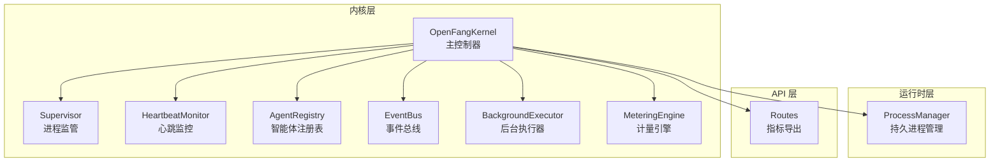
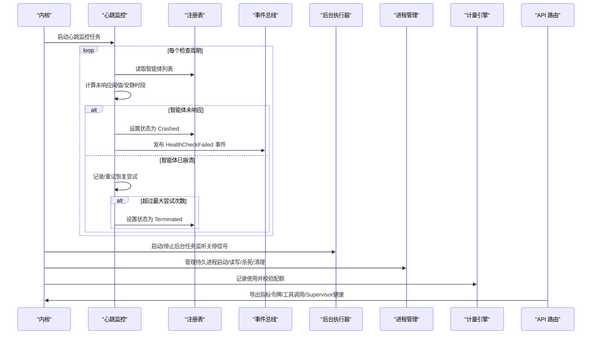
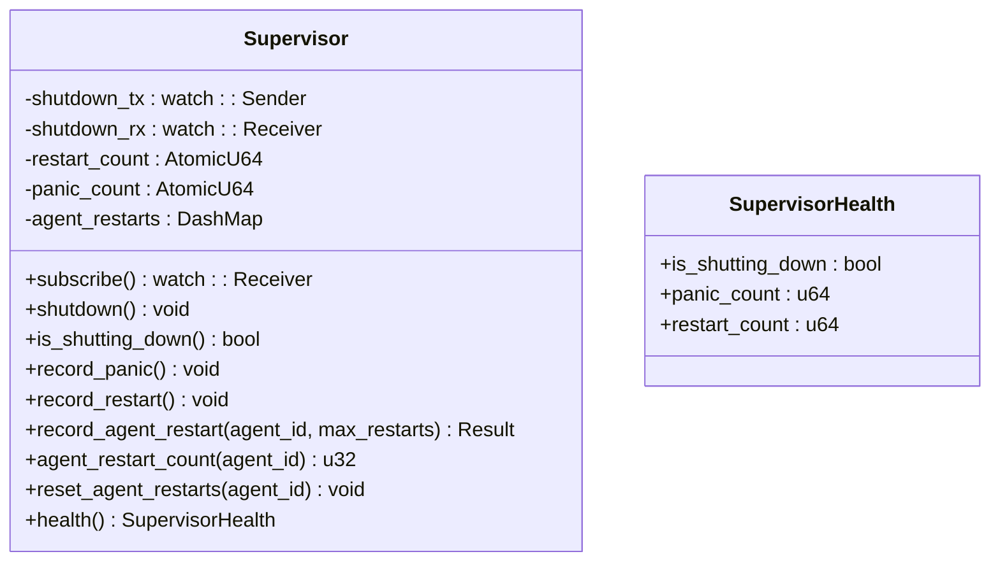
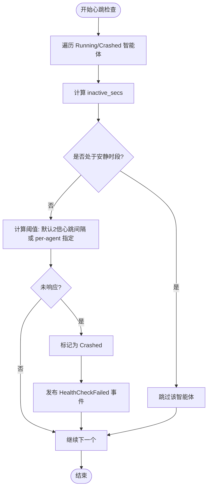
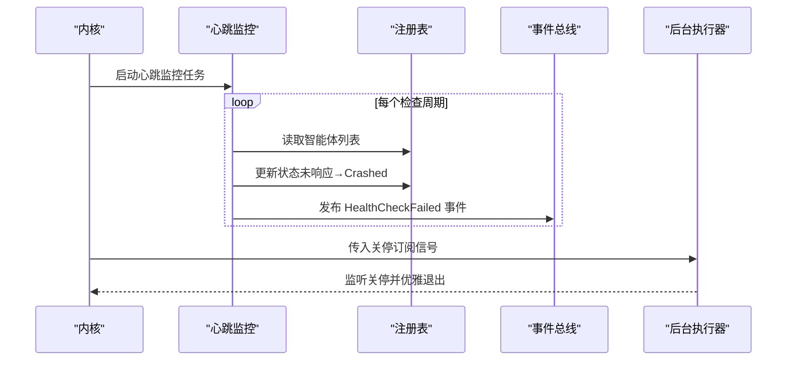
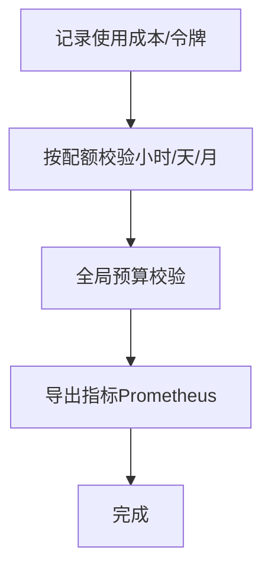
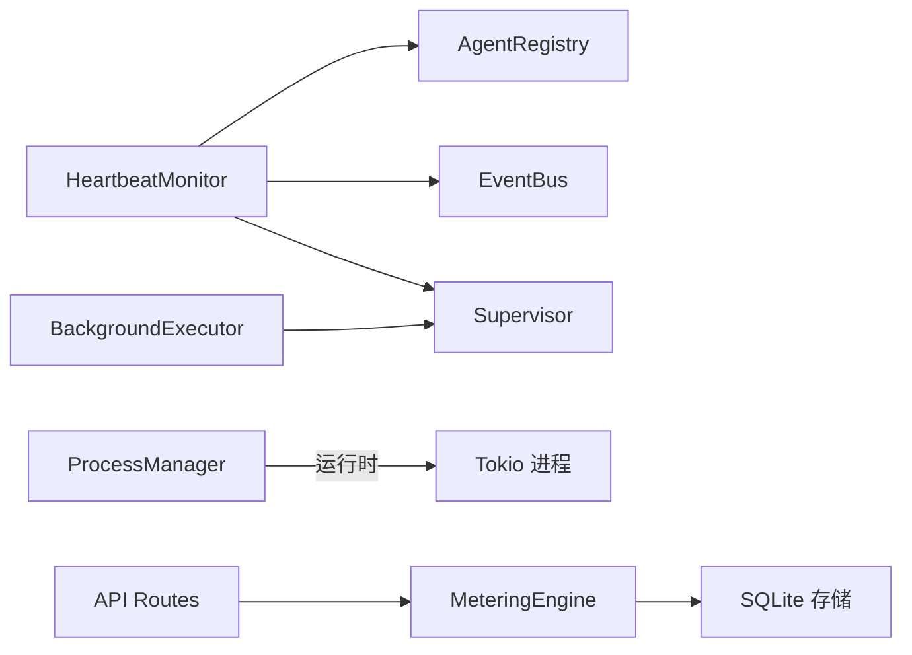

# 监管监控（Supervisor & Heartbeat）

<cite>
**本文档引用的文件**
- [supervisor.rs](file://crates/openfang-kernel/src/supervisor.rs)
- [heartbeat.rs](file://crates/openfang-kernel/src/heartbeat.rs)
- [kernel.rs](file://crates/openfang-kernel/src/kernel.rs)
- [registry.rs](file://crates/openfang-kernel/src/registry.rs)
- [event_bus.rs](file://crates/openfang-kernel/src/event_bus.rs)
- [background.rs](file://crates/openfang-kernel/src/background.rs)
- [process_manager.rs](file://crates/openfang-runtime/src/process_manager.rs)
- [metering.rs](file://crates/openfang-kernel/src/metering.rs)
- [routes.rs](file://crates/openfang-api/src/routes.rs)
- [agent.rs](file://crates/openfang-types/src/agent.rs)
- [openfang.toml.example](file://openfang.toml.example)
</cite>

## 目录
1. [简介](#简介)
2. [项目结构](#项目结构)
3. [核心组件](#核心组件)
4. [架构总览](#架构总览)
5. [详细组件分析](#详细组件分析)
6. [依赖关系分析](#依赖关系分析)
7. [性能考量](#性能考量)
8. [故障排查指南](#故障排查指南)
9. [结论](#结论)
10. [附录](#附录)

## 简介
本文件面向 OpenFang 监管监控系统，围绕“进程监控、健康检查、自动重启、资源监控”与“心跳系统（存活检测、超时处理、故障转移、状态同步）”两大主题进行深入技术说明。内容涵盖监管策略配置、智能体状态监控、异常处理流程、指标采集与告警、日志聚合以及系统稳定性保障与故障恢复策略。文档同时提供可直接定位到源码的路径指引，便于读者快速查阅实现细节。

## 项目结构
监管与心跳相关的核心代码集中在 kernel 子系统中，配合运行时的进程管理、计量引擎与 API 路由导出监控指标。下图展示了与监管监控相关的关键模块及其交互关系：



图表来源
- [kernel.rs:60-164](file://crates/openfang-kernel/src/kernel.rs#L60-L164)
- [supervisor.rs:10-21](file://crates/openfang-kernel/src/supervisor.rs#L10-L21)
- [heartbeat.rs:12-29](file://crates/openfang-kernel/src/heartbeat.rs#L12-L29)
- [registry.rs:8-15](file://crates/openfang-kernel/src/registry.rs#L8-L15)
- [event_bus.rs:15-22](file://crates/openfang-kernel/src/event_bus.rs#L15-L22)
- [background.rs:21-28](file://crates/openfang-kernel/src/background.rs#L21-L28)
- [process_manager.rs:50-54](file://crates/openfang-runtime/src/process_manager.rs#L50-L54)
- [metering.rs:9-12](file://crates/openfang-kernel/src/metering.rs#L9-L12)
- [routes.rs:3376-3406](file://crates/openfang-api/src/routes.rs#L3376-L3406)

章节来源
- [kernel.rs:60-164](file://crates/openfang-kernel/src/kernel.rs#L60-L164)
- [supervisor.rs:10-21](file://crates/openfang-kernel/src/supervisor.rs#L10-L21)
- [heartbeat.rs:12-29](file://crates/openfang-kernel/src/heartbeat.rs#L12-L29)
- [registry.rs:8-15](file://crates/openfang-kernel/src/registry.rs#L8-L15)
- [event_bus.rs:15-22](file://crates/openfang-kernel/src/event_bus.rs#L15-L22)
- [background.rs:21-28](file://crates/openfang-kernel/src/background.rs#L21-L28)
- [process_manager.rs:50-54](file://crates/openfang-runtime/src/process_manager.rs#L50-L54)
- [metering.rs:9-12](file://crates/openfang-kernel/src/metering.rs#L9-L12)
- [routes.rs:3376-3406](file://crates/openfang-api/src/routes.rs#L3376-L3406)

## 核心组件
- 进程监管（Supervisor）
  - 提供优雅关停信号、重启计数、崩溃统计与单个智能体重启上限控制能力，并通过 watch 通道向订阅者广播关停信号。
  - 关键接口包括：触发关停、查询关停状态、记录崩溃、记录重启、重置重启计数、健康摘要等。
- 心跳监控（HeartbeatMonitor）
  - 周期性扫描所有 Running/Crashed 智能体，依据 last_active 与心跳阈值判断是否未响应；对 Crashed 智能体尝试自动恢复，超过最大尝试次数后标记为 Terminated。
  - 支持 per-agent 的安静时段（quiet hours）过滤、默认与 per-agent 心跳间隔、恢复冷却时间与最大尝试次数等配置。
- 内核（OpenFangKernel）
  - 将 Supervisor、HeartbeatMonitor、AgentRegistry、EventBus、BackgroundExecutor、MeteringEngine 等子系统组装为统一入口，负责启动心跳监控任务、发布健康检查失败事件、清理过期使用记录等。
- 注册表（AgentRegistry）
  - 维护智能体生命周期状态、模式、会话 ID、工作空间、身份信息、模型配置、技能/工具白名单等元数据变更，并在状态更新时刷新 last_active 时间戳。
- 事件总线（EventBus）
  - 提供广播与按目标路由的消息分发，维护事件历史环形缓冲区，支持系统级与代理级订阅。
- 后台执行器（BackgroundExecutor）
  - 驱动连续/周期/主动型智能体的自唤醒循环，限制全局并发 LLM 调用，监听 Supervisor 的关停信号以优雅退出。
- 进程管理（ProcessManager）
  - 管理智能体启动的持久进程（REPL、服务器、守护进程），提供写入 stdin、读取 stdout/stderr、杀死进程、按代理列表、清理陈旧进程等功能。
- 计量引擎（MeteringEngine）
  - 记录使用成本与令牌消耗，按小时/天/月配额校验与全局预算校验，提供预算状态快照与清理过期记录能力。
- 指标导出（API Routes）
  - 导出 Prometheus 格式指标，包括 per-agent 令牌与工具调用总量、Supervisor 健康指标（崩溃与重启总数）等。

章节来源
- [supervisor.rs:23-115](file://crates/openfang-kernel/src/supervisor.rs#L23-L115)
- [heartbeat.rs:139-217](file://crates/openfang-kernel/src/heartbeat.rs#L139-L217)
- [kernel.rs:4358-4493](file://crates/openfang-kernel/src/kernel.rs#L4358-L4493)
- [registry.rs:54-62](file://crates/openfang-kernel/src/registry.rs#L54-L62)
- [event_bus.rs:36-73](file://crates/openfang-kernel/src/event_bus.rs#L36-L73)
- [background.rs:48-186](file://crates/openfang-kernel/src/background.rs#L48-L186)
- [process_manager.rs:67-162](file://crates/openfang-runtime/src/process_manager.rs#L67-L162)
- [metering.rs:21-62](file://crates/openfang-kernel/src/metering.rs#L21-L62)
- [routes.rs:3376-3406](file://crates/openfang-api/src/routes.rs#L3376-L3406)

## 架构总览
下图展示了监管与心跳在内核中的协作流程：Supervisor 负责关停信号与健康度统计；HeartbeatMonitor 周期扫描智能体状态并触发事件；EventBus 分发系统事件；BackgroundExecutor 与 ProcessManager 协同维持智能体生命周期；MeteringEngine 提供成本与配额控制；API Routes 导出监控指标。



图表来源
- [kernel.rs:4358-4493](file://crates/openfang-kernel/src/kernel.rs#L4358-L4493)
- [heartbeat.rs:139-217](file://crates/openfang-kernel/src/heartbeat.rs#L139-L217)
- [registry.rs:54-62](file://crates/openfang-kernel/src/registry.rs#L54-L62)
- [event_bus.rs:36-73](file://crates/openfang-kernel/src/event_bus.rs#L36-L73)
- [background.rs:48-186](file://crates/openfang-kernel/src/background.rs#L48-L186)
- [process_manager.rs:67-162](file://crates/openfang-runtime/src/process_manager.rs#L67-L162)
- [metering.rs:21-62](file://crates/openfang-kernel/src/metering.rs#L21-L62)
- [routes.rs:3376-3406](file://crates/openfang-api/src/routes.rs#L3376-L3406)

## 详细组件分析

### 进程监管（Supervisor）
- 功能要点
  - 通过 watch 通道广播关停信号，所有订阅者（如后台执行器）据此优雅退出。
  - 统计全局崩溃次数与重启次数，并按智能体维度记录重启次数，支持设置 per-agent 最大重启次数以避免无限重启。
  - 提供健康摘要（关停中、崩溃数、重启数），用于 API 指标导出。
- 关键接口与行为
  - 触发关停：向 watch 发送 true。
  - 查询关停状态：读取 Receiver 当前值。
  - 记录崩溃/重启：原子计数器递增。
  - 记录并检查 per-agent 重启次数：超过上限返回错误。
  - 重置重启计数：移除对应条目。
- 使用场景
  - 在系统升级或维护时，调用关停以确保正在运行的任务有序结束。
  - 对于异常频繁崩溃的智能体，结合最大重启次数策略避免雪崩。



图表来源
- [supervisor.rs:10-129](file://crates/openfang-kernel/src/supervisor.rs#L10-L129)

章节来源
- [supervisor.rs:23-115](file://crates/openfang-kernel/src/supervisor.rs#L23-L115)

### 心跳监控（HeartbeatMonitor）
- 功能要点
  - 周期扫描 Running/Crashed 智能体，计算 last_active 与当前时间差，若超过阈值则判定未响应。
  - 支持 per-agent quiet hours 过滤，避免在安静时段误判；默认阈值为心跳间隔的两倍。
  - 对 Crashed 智能体进行自动恢复尝试，超过最大尝试次数后标记为 Terminated。
  - 提供心跳状态汇总（总数、响应/未响应数量、未响应详情）。
- 关键算法与流程
  - 未响应判定：inactive_secs > timeout_secs 或状态为 Crashed。
  - 安静时段过滤：解析 HH:MM-HH:MM 格式，判断当前是否处于该时间段。
  - 自动恢复：记录失败次数与上次尝试时间，按冷却时间窗口控制重试频率。
- 事件发布
  - 未响应的 Running 智能体被标记为 Crashed 并发布 HealthCheckFailed 事件至系统通道。



图表来源
- [heartbeat.rs:139-217](file://crates/openfang-kernel/src/heartbeat.rs#L139-L217)
- [kernel.rs:4358-4493](file://crates/openfang-kernel/src/kernel.rs#L4358-L4493)

章节来源
- [heartbeat.rs:139-217](file://crates/openfang-kernel/src/heartbeat.rs#L139-L217)
- [kernel.rs:4358-4493](file://crates/openfang-kernel/src/kernel.rs#L4358-L4493)

### 内核集成与事件流
- 内核启动心跳监控任务，周期性调用 check_agents 并根据结果更新智能体状态、发布事件、清理过期使用记录。
- 后台执行器监听 Supervisor 的关停信号，优雅停止持续/周期任务。
- 注册表在状态变更时更新 last_active，确保心跳逻辑基于真实活跃度。



图表来源
- [kernel.rs:4358-4493](file://crates/openfang-kernel/src/kernel.rs#L4358-L4493)
- [heartbeat.rs:139-217](file://crates/openfang-kernel/src/heartbeat.rs#L139-L217)
- [registry.rs:54-62](file://crates/openfang-kernel/src/registry.rs#L54-L62)
- [event_bus.rs:36-73](file://crates/openfang-kernel/src/event_bus.rs#L36-L73)
- [background.rs:48-186](file://crates/openfang-kernel/src/background.rs#L48-L186)

章节来源
- [kernel.rs:4358-4493](file://crates/openfang-kernel/src/kernel.rs#L4358-L4493)

### 后台执行器与持久进程管理
- 后台执行器
  - 支持 Continuous/Periodic/Proactive 三种模式，分别以固定间隔、简化 cron 表达式或触发器驱动自唤醒。
  - 全局限制并发 LLM 调用，避免资源争抢；监听 Supervisor 关停信号以优雅退出。
- 持久进程管理
  - 管理智能体启动的长期运行进程（REPL、服务器等），提供 stdin 写入、stdout/stderr 读取、进程杀死、按代理列表与年龄清理等能力。

```mermaid
classDiagram
class BackgroundExecutor {
-tasks : DashMap<AgentId, JoinHandle<()>>
-shutdown_rx : watch : : Receiver<bool>
-llm_semaphore : Semaphore
+start_agent(agent_id, schedule, send_message) void
+stop_agent(agent_id) void
+active_count() usize
}
class ProcessManager {
-processes : DashMap<ProcessId, ManagedProcess>
-max_per_agent : usize
+start(agent_id, command, args) Result<ProcessId, String>
+write(process_id, data) Result<(), String>
+read(process_id) Result<(Vec<String>, Vec<String>), String>
+kill(process_id) Result<(), String>
+list(agent_id) Vec<ProcessInfo>
+cleanup(max_age_secs) void
+count() usize
}
```

图表来源
- [background.rs:21-200](file://crates/openfang-kernel/src/background.rs#L21-L200)
- [process_manager.rs:50-255](file://crates/openfang-runtime/src/process_manager.rs#L50-L255)

章节来源
- [background.rs:48-186](file://crates/openfang-kernel/src/background.rs#L48-L186)
- [process_manager.rs:67-162](file://crates/openfang-runtime/src/process_manager.rs#L67-L162)

### 计量引擎与指标导出
- 计量引擎
  - 记录使用成本与令牌消耗，按小时/天/月配额校验与全局预算校验；提供预算状态快照与清理过期记录。
- 指标导出
  - API 路由导出 Prometheus 格式指标，包括 per-agent 令牌与工具调用总量、Supervisor 健康指标（崩溃与重启总数）。



图表来源
- [metering.rs:21-133](file://crates/openfang-kernel/src/metering.rs#L21-L133)
- [routes.rs:3376-3406](file://crates/openfang-api/src/routes.rs#L3376-L3406)

章节来源
- [metering.rs:21-133](file://crates/openfang-kernel/src/metering.rs#L21-L133)
- [routes.rs:3376-3406](file://crates/openfang-api/src/routes.rs#L3376-L3406)

## 依赖关系分析
- 组件耦合
  - HeartbeatMonitor 依赖 AgentRegistry 获取智能体状态与元数据；通过 EventBus 发布系统事件；受 Supervisor 关停信号影响。
  - BackgroundExecutor 依赖 Supervisor 的关停信号；受全局 LLM 并发限制；与内核的调度器协同。
  - ProcessManager 与运行时环境交互，提供进程生命周期管理。
  - MeteringEngine 与内存存储交互，记录与查询使用数据；API 路由导出指标。
- 外部依赖
  - 事件总线采用广播通道；注册表使用并发映射；计量引擎基于 SQLite 存储。



图表来源
- [heartbeat.rs:12-29](file://crates/openfang-kernel/src/heartbeat.rs#L12-L29)
- [registry.rs:8-15](file://crates/openfang-kernel/src/registry.rs#L8-L15)
- [event_bus.rs:15-22](file://crates/openfang-kernel/src/event_bus.rs#L15-L22)
- [supervisor.rs:10-21](file://crates/openfang-kernel/src/supervisor.rs#L10-L21)
- [background.rs:21-28](file://crates/openfang-kernel/src/background.rs#L21-L28)
- [process_manager.rs:50-54](file://crates/openfang-runtime/src/process_manager.rs#L50-L54)
- [metering.rs:9-12](file://crates/openfang-kernel/src/metering.rs#L9-L12)
- [routes.rs:3376-3406](file://crates/openfang-api/src/routes.rs#L3376-L3406)

章节来源
- [heartbeat.rs:12-29](file://crates/openfang-kernel/src/heartbeat.rs#L12-L29)
- [registry.rs:8-15](file://crates/openfang-kernel/src/registry.rs#L8-L15)
- [event_bus.rs:15-22](file://crates/openfang-kernel/src/event_bus.rs#L15-L22)
- [supervisor.rs:10-21](file://crates/openfang-kernel/src/supervisor.rs#L10-L21)
- [background.rs:21-28](file://crates/openfang-kernel/src/background.rs#L21-L28)
- [process_manager.rs:50-54](file://crates/openfang-runtime/src/process_manager.rs#L50-L54)
- [metering.rs:9-12](file://crates/openfang-kernel/src/metering.rs#L9-L12)
- [routes.rs:3376-3406](file://crates/openfang-api/src/routes.rs#L3376-L3406)

## 性能考量
- 心跳检查频率与阈值
  - 默认检查间隔为 30 秒，未响应阈值为 180 秒（两倍心跳间隔）。可根据智能体复杂度（浏览器任务、长对话）调整。
- 并发与限流
  - 后台执行器限制全局并发 LLM 调用（默认 5），避免资源争用导致整体性能下降。
  - 进程管理对 stdout/stderr 读取使用异步缓冲与容量限制，防止内存膨胀。
- 存储与清理
  - 计量引擎定期清理过期使用记录，默认每 24 小时清理一次，保留 90 天数据，降低数据库压力。
- 指标导出
  - Prometheus 指标导出为只读操作，避免阻塞主业务流程。

## 故障排查指南
- 常见问题与定位
  - 智能体长时间未响应
    - 检查是否处于安静时段（quiet hours）配置；确认 per-agent 心跳间隔设置是否合理。
    - 查看事件总线历史，定位最近的 HealthCheckFailed 事件。
  - 智能体反复崩溃
    - 查看 Supervisor 的崩溃计数与重启计数；确认 per-agent 最大重启次数是否触发。
    - 检查注册表中智能体状态变化与 last_active 更新是否正常。
  - 后台任务无法停止
    - 确认 Supervisor 是否已发送关停信号；查看后台执行器的 active_count 与任务句柄状态。
  - 进程泄漏或僵尸进程
    - 使用 ProcessManager 的 list/kill/cleanup 接口排查与清理；检查 per-agent 进程数量上限。
  - 成本超支或配额告警
    - 通过计量引擎的预算状态快照与 API 指标导出定位超支原因；检查全局与 per-agent 配额配置。
- 建议操作
  - 在配置文件中调整心跳间隔与安静时段；必要时提高最大重启次数但需配合日志与告警。
  - 对高负载场景增加后台 LLM 并发上限或优化模型选择。
  - 定期清理过期使用记录与进程缓存，保持系统健康。

章节来源
- [heartbeat.rs:223-263](file://crates/openfang-kernel/src/heartbeat.rs#L223-L263)
- [registry.rs:54-62](file://crates/openfang-kernel/src/registry.rs#L54-L62)
- [supervisor.rs:84-95](file://crates/openfang-kernel/src/supervisor.rs#L84-L95)
- [background.rs:188-200](file://crates/openfang-kernel/src/background.rs#L188-L200)
- [process_manager.rs:218-249](file://crates/openfang-runtime/src/process_manager.rs#L218-L249)
- [metering.rs:103-133](file://crates/openfang-kernel/src/metering.rs#L103-L133)
- [routes.rs:3376-3406](file://crates/openfang-api/src/routes.rs#L3376-L3406)

## 结论
OpenFang 的监管监控体系以 Supervisor 为核心，结合 HeartbeatMonitor 实现对智能体的存活检测、自动重启与状态同步；通过 EventBus 与内核集成，形成闭环的事件驱动机制。后台执行器与进程管理保障了智能体生命周期的稳定运行，计量引擎与指标导出提供了成本控制与可观测性支撑。合理的配置与监控策略能够显著提升系统稳定性与可维护性。

## 附录

### 监管策略配置示例（路径指引）
- 内核配置示例（包含默认模型、网络、频道适配器等）
  - 参考路径：[openfang.toml.example:1-49](file://openfang.toml.example#L1-L49)
- 智能体自治配置（心跳间隔、最大重启次数、安静时段等）
  - 类型定义参考：[agent.rs:70-95](file://crates/openfang-types/src/agent.rs#L70-L95)

章节来源
- [openfang.toml.example:1-49](file://openfang.toml.example#L1-L49)
- [agent.rs:70-95](file://crates/openfang-types/src/agent.rs#L70-L95)

### 监控智能体状态（路径指引）
- 心跳状态汇总与未响应详情
  - 参考函数：[heartbeat.rs:279-292](file://crates/openfang-kernel/src/heartbeat.rs#L279-L292)
- 注册表状态更新（含 last_active 刷新）
  - 参考方法：[registry.rs:54-62](file://crates/openfang-kernel/src/registry.rs#L54-L62)

章节来源
- [heartbeat.rs:279-292](file://crates/openfang-kernel/src/heartbeat.rs#L279-L292)
- [registry.rs:54-62](file://crates/openfang-kernel/src/registry.rs#L54-L62)

### 异常处理与告警（路径指引）
- 健康检查失败事件发布
  - 参考位置：[kernel.rs:4478-4487](file://crates/openfang-kernel/src/kernel.rs#L4478-L4487)
- Supervisor 健康摘要导出为指标
  - 参考位置：[routes.rs:3396-3406](file://crates/openfang-api/src/routes.rs#L3396-L3406)

章节来源
- [kernel.rs:4478-4487](file://crates/openfang-kernel/src/kernel.rs#L4478-L4487)
- [routes.rs:3396-3406](file://crates/openfang-api/src/routes.rs#L3396-L3406)

### 系统稳定性保障与故障恢复策略（路径指引）
- 后台执行器关停信号监听与优雅退出
  - 参考位置：[background.rs:74-117](file://crates/openfang-kernel/src/background.rs#L74-L117)
- 进程清理与陈旧进程回收
  - 参考位置：[process_manager.rs:236-249](file://crates/openfang-runtime/src/process_manager.rs#L236-L249)
- 计量清理与过期记录移除
  - 参考位置：[kernel.rs:3941-3963](file://crates/openfang-kernel/src/kernel.rs#L3941-L3963)

章节来源
- [background.rs:74-117](file://crates/openfang-kernel/src/background.rs#L74-L117)
- [process_manager.rs:236-249](file://crates/openfang-runtime/src/process_manager.rs#L236-L249)
- [kernel.rs:3941-3963](file://crates/openfang-kernel/src/kernel.rs#L3941-L3963)