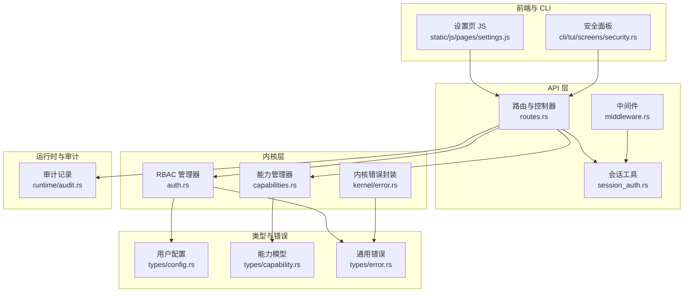
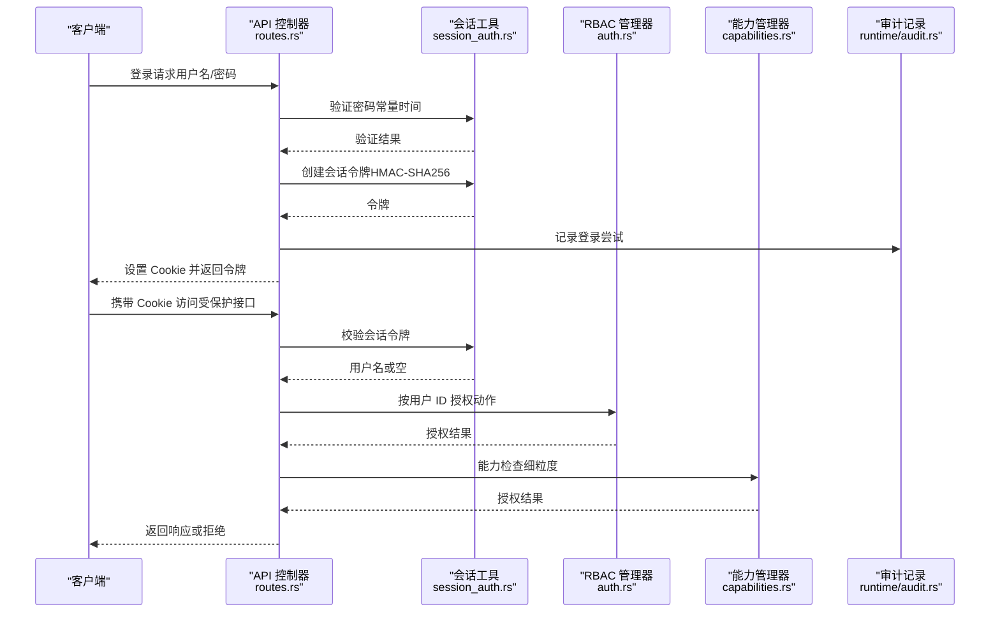
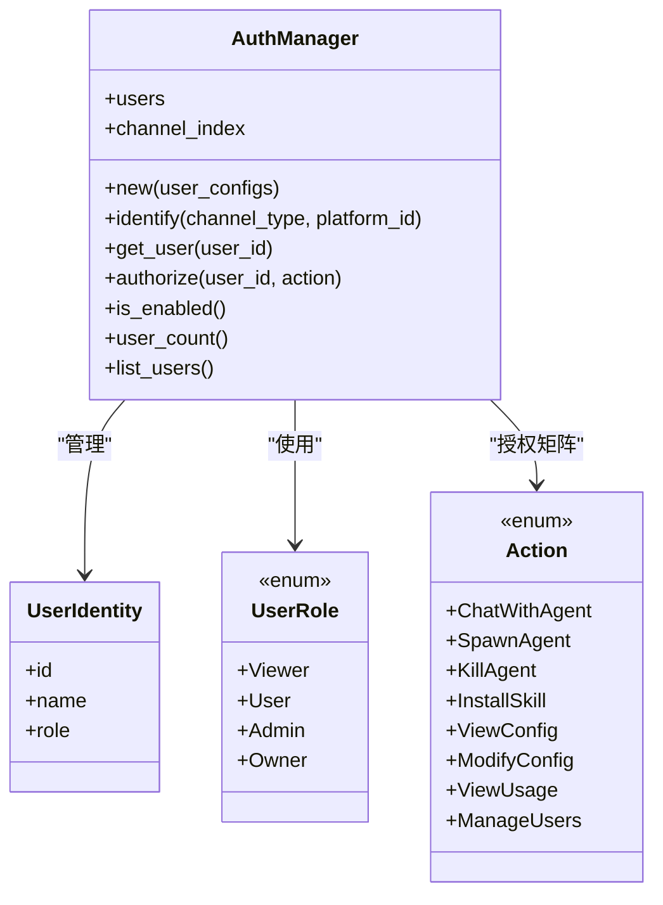
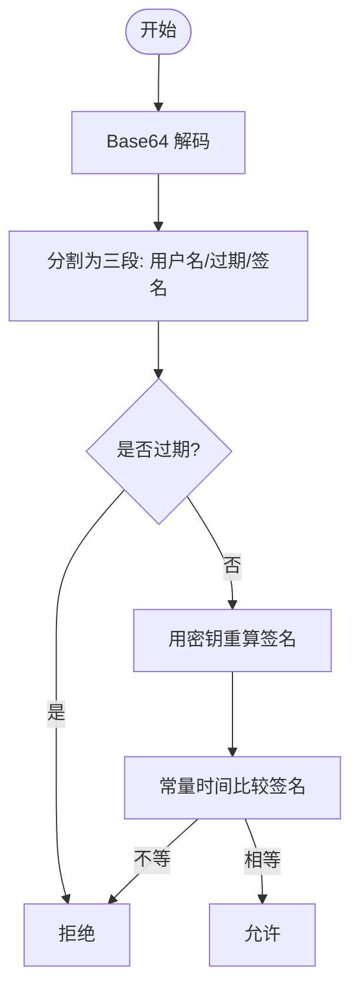
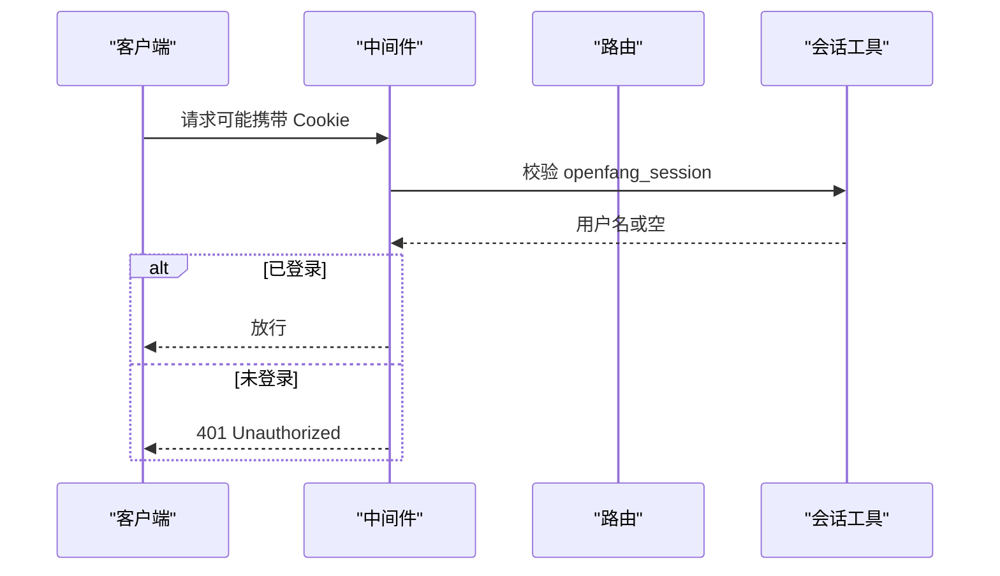
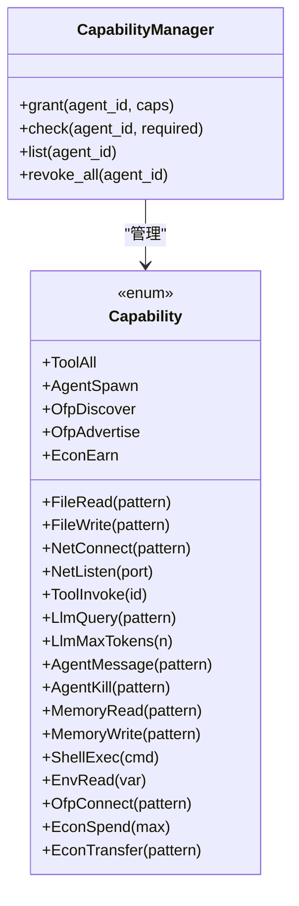
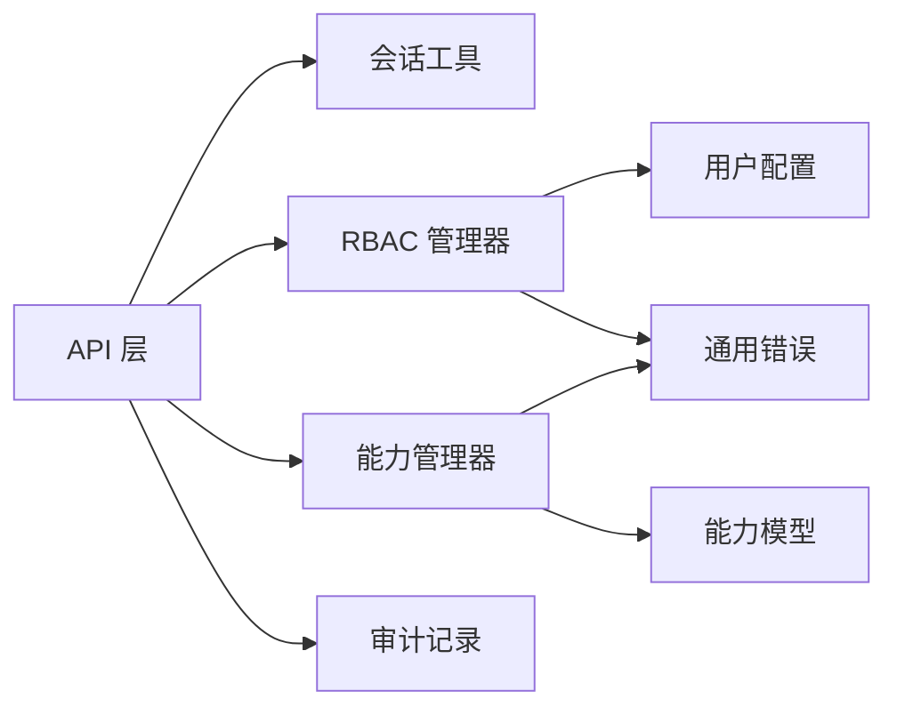

# 认证授权（Auth & Permissions）

<cite>
**本文引用的文件**
- [crates/openfang-kernel/src/auth.rs](file://crates/openfang-kernel/src/auth.rs)
- [crates/openfang-api/src/session_auth.rs](file://crates/openfang-api/src/session_auth.rs)
- [crates/openfang-api/src/routes.rs](file://crates/openfang-api/src/routes.rs)
- [crates/openfang-api/src/middleware.rs](file://crates/openfang-api/src/middleware.rs)
- [crates/openfang-types/src/config.rs](file://crates/openfang-types/src/config.rs)
- [crates/openfang-types/src/capability.rs](file://crates/openfang-types/src/capability.rs)
- [crates/openfang-kernel/src/capabilities.rs](file://crates/openfang-kernel/src/capabilities.rs)
- [crates/openfang-types/src/error.rs](file://crates/openfang-types/src/error.rs)
- [crates/openfang-kernel/src/error.rs](file://crates/openfang-kernel/src/error.rs)
- [crates/openfang-kernel/src/approval.rs](file://crates/openfang-kernel/src/approval.rs)
- [crates/openfang-runtime/src/audit.rs](file://crates/openfang-runtime/src/audit.rs)
- [crates/openfang-api/static/js/pages/settings.js](file://crates/openfang-api/static/js/pages/settings.js)
- [crates/openfang-cli/src/tui/screens/security.rs](file://crates/openfang-cli/src/tui/screens/security.rs)
- [crates/openfang-channels/src/bluesky.rs](file://crates/openfang-channels/src/bluesky.rs)
- [crates/openfang-skills/bundled/oauth-expert/SKILL.md](file://crates/openfang-skills/bundled/oauth-expert/SKILL.md)
</cite>

## 目录
1. [简介](#简介)
2. [项目结构](#项目结构)
3. [核心组件](#核心组件)
4. [架构总览](#架构总览)
5. [详细组件分析](#详细组件分析)
6. [依赖关系分析](#依赖关系分析)
7. [性能考量](#性能考量)
8. [故障排查指南](#故障排查指南)
9. [结论](#结论)
10. [附录](#附录)

## 简介
本文件面向 OpenFang 的认证授权体系，系统性阐述以下内容：
- 身份认证：基于会话令牌的无状态认证、密码哈希与常量时间比较、API 密钥与本地访问限制。
- 令牌管理：会话令牌的签发、校验、过期控制与 Cookie 设置。
- 会话控制：Cookie 安全属性、会话检查接口与审计日志。
- 多因素认证：当前实现以会话令牌为主，未内置短信/邮箱验证码流程；可结合外部 OAuth/OpenID Connect 实现。
- 权限控制：基于角色的访问控制（RBAC）与能力模型（Capability-based Security），支持细粒度工具、网络、内存、经济等权限。
- 动态授权：运行时审批策略、能力继承校验与权限缓存（DashMap 并发映射）。
- 安全最佳实践：常量时间比较、最小暴露面、审计与告警、资源配额与速率限制。

## 项目结构
OpenFang 将认证授权分布在内核、API 层、类型定义与前端 UI 中：
- 内核层负责 RBAC 与能力模型的权威判断，并提供审批与审计能力。
- API 层提供登录、登出、会话检查等接口，以及中间件对请求进行鉴权。
- 类型层定义用户配置、能力模型与错误类型。
- 前端 UI 提供安全特性概览与配置提示。

**图表来源**
- [crates/openfang-api/src/routes.rs](file://crates/openfang-api/src/routes.rs)
- [crates/openfang-api/src/session_auth.rs](file://crates/openfang-api/src/session_auth.rs)
- [crates/openfang-api/src/middleware.rs](file://crates/openfang-api/src/middleware.rs)
- [crates/openfang-kernel/src/auth.rs](file://crates/openfang-kernel/src/auth.rs)
- [crates/openfang-kernel/src/capabilities.rs](file://crates/openfang-kernel/src/capabilities.rs)
- [crates/openfang-types/src/config.rs](file://crates/openfang-types/src/config.rs)
- [crates/openfang-types/src/capability.rs](file://crates/openfang-types/src/capability.rs)
- [crates/openfang-types/src/error.rs](file://crates/openfang-types/src/error.rs)
- [crates/openfang-kernel/src/error.rs](file://crates/openfang-kernel/src/error.rs)
- [crates/openfang-runtime/src/audit.rs](file://crates/openfang-runtime/src/audit.rs)
- [crates/openfang-api/static/js/pages/settings.js](file://crates/openfang-api/static/js/pages/settings.js)
- [crates/openfang-cli/src/tui/screens/security.rs](file://crates/openfang-cli/src/tui/screens/security.rs)

**章节来源**
- [crates/openfang-api/src/routes.rs](file://crates/openfang-api/src/routes.rs)
- [crates/openfang-api/src/session_auth.rs](file://crates/openfang-api/src/session_auth.rs)
- [crates/openfang-api/src/middleware.rs](file://crates/openfang-api/src/middleware.rs)
- [crates/openfang-kernel/src/auth.rs](file://crates/openfang-kernel/src/auth.rs)
- [crates/openfang-kernel/src/capabilities.rs](file://crates/openfang-kernel/src/capabilities.rs)
- [crates/openfang-types/src/config.rs](file://crates/openfang-types/src/config.rs)
- [crates/openfang-types/src/capability.rs](file://crates/openfang-types/src/capability.rs)
- [crates/openfang-types/src/error.rs](file://crates/openfang-types/src/error.rs)
- [crates/openfang-kernel/src/error.rs](file://crates/openfang-kernel/src/error.rs)
- [crates/openfang-runtime/src/audit.rs](file://crates/openfang-runtime/src/audit.rs)
- [crates/openfang-api/static/js/pages/settings.js](file://crates/openfang-api/static/js/pages/settings.js)
- [crates/openfang-cli/src/tui/screens/security.rs](file://crates/openfang-cli/src/tui/screens/security.rs)

## 核心组件
- RBAC 管理器：维护用户身份、角色与动作授权矩阵，支持按用户 ID 授权与通道绑定识别。
- 能力管理器：基于能力模型的细粒度授权，支持通配与模式匹配、数值边界检查与继承校验。
- 会话工具：HMAC-SHA256 有状态签名的会话令牌，包含用户名与过期时间，支持常量时间校验。
- 审计与错误：统一的审计事件记录与错误类型，便于追踪认证失败与权限拒绝。
- 审批策略：对高风险操作（如文件写入、网络监听、经济支出）进行审批控制。

**章节来源**
- [crates/openfang-kernel/src/auth.rs](file://crates/openfang-kernel/src/auth.rs)
- [crates/openfang-kernel/src/capabilities.rs](file://crates/openfang-kernel/src/capabilities.rs)
- [crates/openfang-api/src/session_auth.rs](file://crates/openfang-api/src/session_auth.rs)
- [crates/openfang-types/src/error.rs](file://crates/openfang-types/src/error.rs)
- [crates/openfang-kernel/src/approval.rs](file://crates/openfang-kernel/src/approval.rs)

## 架构总览
OpenFang 的认证授权采用“内核权威 + API 边界”的分层设计：
- API 层负责入口鉴权与会话管理，调用内核进行权限决策。
- 内核层提供 RBAC 与能力模型的权威判断，并记录审计事件。
- 类型层定义配置与能力模型，确保跨模块一致性。
- 前端与 CLI 提供安全特性可视化与配置提示。

**图表来源**
- [crates/openfang-api/src/routes.rs](file://crates/openfang-api/src/routes.rs)
- [crates/openfang-api/src/session_auth.rs](file://crates/openfang-api/src/session_auth.rs)
- [crates/openfang-kernel/src/auth.rs](file://crates/openfang-kernel/src/auth.rs)
- [crates/openfang-kernel/src/capabilities.rs](file://crates/openfang-kernel/src/capabilities.rs)
- [crates/openfang-runtime/src/audit.rs](file://crates/openfang-runtime/src/audit.rs)

## 详细组件分析

### RBAC 与用户身份
- 角色层级：Viewer < User < Admin < Owner，用于动作授权矩阵。
- 动作与所需角色：例如聊天需要 User，安装技能需要 Admin，修改配置与用户管理需要 Owner。
- 用户注册：从用户配置加载，建立用户 ID、名称与角色；同时建立“渠道类型:平台 ID”索引，支持跨渠道识别同一用户。
- 授权判定：按用户 ID 获取身份，比较角色阈值，返回授权结果或拒绝错误。

**图表来源**
- [crates/openfang-kernel/src/auth.rs](file://crates/openfang-kernel/src/auth.rs)

**章节来源**
- [crates/openfang-kernel/src/auth.rs](file://crates/openfang-kernel/src/auth.rs)
- [crates/openfang-types/src/config.rs](file://crates/openfang-types/src/config.rs)

### 会话与令牌管理
- 令牌结构：base64(username:expiry:hmac)，HMAC 使用密钥对 payload 进行签名。
- 校验流程：解码 base64，解析三段，检查过期时间，重新计算签名并与提供的签名进行常量时间比较。
- 登录流程：常量时间比较用户名与密码哈希，成功后根据配置派生密钥生成令牌并设置 Cookie。
- 会话检查：从 Cookie 中提取 openfang_session，调用 verify_session_token 判断是否已登录。

**图表来源**
- [crates/openfang-api/src/session_auth.rs](file://crates/openfang-api/src/session_auth.rs)

**章节来源**
- [crates/openfang-api/src/session_auth.rs](file://crates/openfang-api/src/session_auth.rs)
- [crates/openfang-api/src/routes.rs](file://crates/openfang-api/src/routes.rs)

### API 鉴权与中间件
- 中间件：从请求头提取 Cookie 中的 openfang_session，进行校验；若启用 API Key，则仅允许本地访问。
- Bearer 令牌：非健康类接口要求 Authorization: Bearer 头部；当未配置 API Key 时，限制为本地访问。
- 登录接口：常量时间比较用户名与密码，记录审计日志，设置 HttpOnly、SameSite Cookie 并返回令牌。
- 登出接口：清除 openfang_session Cookie。
- 会话检查：根据配置决定是否启用认证，若启用则校验 Cookie 并返回认证状态。

**图表来源**
- [crates/openfang-api/src/middleware.rs](file://crates/openfang-api/src/middleware.rs)
- [crates/openfang-api/src/session_auth.rs](file://crates/openfang-api/src/session_auth.rs)

**章节来源**
- [crates/openfang-api/src/middleware.rs](file://crates/openfang-api/src/middleware.rs)
- [crates/openfang-api/src/routes.rs](file://crates/openfang-api/src/routes.rs)

### 能力模型与动态授权
- 能力类型：文件读写、网络连接/监听、工具调用、LLM 查询/预算、代理交互、内存访问、Shell 执行、环境变量读取、OFP 协议、经济支出/转入等。
- 匹配规则：支持精确匹配、通配符“*”、前缀/后缀/中缀通配；布尔型与数值型能力有特定比较逻辑。
- 继承校验：子能力必须被父能力覆盖，防止权限提升。
- 授权流程：先通过 RBAC，再进行能力检查；能力管理器使用并发映射存储每个代理的能力授予。

**图表来源**
- [crates/openfang-types/src/capability.rs](file://crates/openfang-types/src/capability.rs)
- [crates/openfang-kernel/src/capabilities.rs](file://crates/openfang-kernel/src/capabilities.rs)

**章节来源**
- [crates/openfang-types/src/capability.rs](file://crates/openfang-types/src/capability.rs)
- [crates/openfang-kernel/src/capabilities.rs](file://crates/openfang-kernel/src/capabilities.rs)

### 审计与错误处理
- 审计事件：记录认证尝试、工具调用、网络访问、Shell 执行、文件/内存访问、配置变更、代理生命周期等。
- 错误类型：统一的 OpenFangError，内核封装为 KernelError，包含认证/授权拒绝、资源配额超限、内部错误等。
- 日志与追踪：前端设置页与 CLI 安全面板展示当前启用的安全特性与配置提示，便于运维审计。

**章节来源**
- [crates/openfang-runtime/src/audit.rs](file://crates/openfang-runtime/src/audit.rs)
- [crates/openfang-types/src/error.rs](file://crates/openfang-types/src/error.rs)
- [crates/openfang-kernel/src/error.rs](file://crates/openfang-kernel/src/error.rs)
- [crates/openfang-api/static/js/pages/settings.js](file://crates/openfang-api/static/js/pages/settings.js)
- [crates/openfang-cli/src/tui/screens/security.rs](file://crates/openfang-cli/src/tui/screens/security.rs)

### 多因素认证与外部集成
- 当前实现：以会话令牌与 RBAC 为主，未内置短信/邮箱验证码流程。
- 外部方案：可通过 OAuth/OpenID Connect 技能实现授权流程与令牌管理，结合会话工具进行二次校验。
- 示例参考：OAuth 专家技能强调授权码流程、PKCE、JWT 校验与刷新令牌安全存储。

**章节来源**
- [crates/openfang-skills/bundled/oauth-expert/SKILL.md](file://crates/openfang-skills/bundled/oauth-expert/SKILL.md)

### 通道适配中的令牌管理
- 通道适配器在需要外部服务令牌时，实现“获取有效 JWT、创建/刷新会话、校验凭据”的流程，体现令牌生命周期管理与会话复用策略。

**章节来源**
- [crates/openfang-channels/src/bluesky.rs](file://crates/openfang-channels/src/bluesky.rs)

## 依赖关系分析
- 内聚性：RBAC 与能力模型分别聚焦“角色授权”和“能力授权”，职责清晰。
- 耦合性：API 层依赖会话工具与内核授权；内核依赖类型层的配置与能力模型；审计贯穿 API 与内核。
- 并发与缓存：RBAC 与能力管理器使用并发映射，支持高并发场景下的读写分离。
- 外部依赖：会话工具依赖 HMAC-SHA256、常量时间比较库；能力模型依赖通配匹配与数值比较。

**图表来源**
- [crates/openfang-api/src/routes.rs](file://crates/openfang-api/src/routes.rs)
- [crates/openfang-api/src/session_auth.rs](file://crates/openfang-api/src/session_auth.rs)
- [crates/openfang-kernel/src/auth.rs](file://crates/openfang-kernel/src/auth.rs)
- [crates/openfang-kernel/src/capabilities.rs](file://crates/openfang-kernel/src/capabilities.rs)
- [crates/openfang-types/src/config.rs](file://crates/openfang-types/src/config.rs)
- [crates/openfang-types/src/capability.rs](file://crates/openfang-types/src/capability.rs)
- [crates/openfang-types/src/error.rs](file://crates/openfang-types/src/error.rs)
- [crates/openfang-runtime/src/audit.rs](file://crates/openfang-runtime/src/audit.rs)

**章节来源**
- [crates/openfang-kernel/src/auth.rs](file://crates/openfang-kernel/src/auth.rs)
- [crates/openfang-kernel/src/capabilities.rs](file://crates/openfang-kernel/src/capabilities.rs)
- [crates/openfang-types/src/config.rs](file://crates/openfang-types/src/config.rs)
- [crates/openfang-types/src/capability.rs](file://crates/openfang-types/src/capability.rs)
- [crates/openfang-types/src/error.rs](file://crates/openfang-types/src/error.rs)
- [crates/openfang-runtime/src/audit.rs](file://crates/openfang-runtime/src/audit.rs)

## 性能考量
- 会话令牌：HMAC-SHA256 计算与 base64 编解码开销极低，适合高频校验。
- 并发授权：DashMap 提供无锁读路径，写入时加锁，适合高并发 RBAC 与能力查询。
- 审计日志：建议异步写入与批量提交，避免阻塞主请求链路。
- 速率限制：前端与 API 层提供速率限制与 WebSocket 连接限制，防止滥用。

[本节为通用指导，无需具体文件分析]

## 故障排查指南
- 登录失败
  - 检查用户名与密码是否常量时间比较通过；查看审计日志中的失败条目。
  - 确认会话密钥来源（API Key 或密码哈希）一致。
- 会话无效
  - 校验 Cookie 是否正确设置；确认令牌未过期；检查签名是否匹配。
- 授权拒绝
  - 确认用户角色是否满足动作所需；检查能力模型是否授予相应权限；查看审批策略是否生效。
- 审计与监控
  - 通过前端设置页与 CLI 安全面板查看当前启用的安全特性与配置提示；关注最近审计条目。

**章节来源**
- [crates/openfang-api/src/routes.rs](file://crates/openfang-api/src/routes.rs)
- [crates/openfang-api/src/session_auth.rs](file://crates/openfang-api/src/session_auth.rs)
- [crates/openfang-kernel/src/auth.rs](file://crates/openfang-kernel/src/auth.rs)
- [crates/openfang-kernel/src/capabilities.rs](file://crates/openfang-kernel/src/capabilities.rs)
- [crates/openfang-runtime/src/audit.rs](file://crates/openfang-runtime/src/audit.rs)
- [crates/openfang-api/static/js/pages/settings.js](file://crates/openfang-api/static/js/pages/settings.js)
- [crates/openfang-cli/src/tui/screens/security.rs](file://crates/openfang-cli/src/tui/screens/security.rs)

## 结论
OpenFang 的认证授权体系以 RBAC 与能力模型为核心，结合会话令牌与审计日志，形成“入口鉴权 + 内核权威 + 可观测”的完整闭环。通过常量时间比较、并发映射与严格的继承校验，系统在保证安全性的同时具备良好的性能与可扩展性。建议在生产环境中：
- 启用 API Key 并限制远程访问；
- 对高风险操作启用审批策略；
- 使用 OAuth/OpenID Connect 实现多因素认证；
- 定期审查用户角色与能力授予，遵循最小权限原则。

[本节为总结，无需具体文件分析]

## 附录

### 常见配置与示例路径
- 登录接口：POST /api/auth/login
  - 示例路径：[登录流程与会话创建](file://crates/openfang-api/src/routes.rs)
- 登出接口：POST /api/auth/logout
  - 示例路径：[清除会话 Cookie](file://crates/openfang-api/src/routes.rs)
- 会话检查：GET /api/auth/check
  - 示例路径：[会话状态检查](file://crates/openfang-api/src/routes.rs)
- 会话工具函数
  - 示例路径：[创建/校验会话令牌](file://crates/openfang-api/src/session_auth.rs)
- RBAC 授权
  - 示例路径：[按用户 ID 授权](file://crates/openfang-kernel/src/auth.rs)
- 能力模型检查
  - 示例路径：[能力匹配与检查](file://crates/openfang-types/src/capability.rs)
- 审计事件
  - 示例路径：[审计记录加载与分类](file://crates/openfang-runtime/src/audit.rs)

**章节来源**
- [crates/openfang-api/src/routes.rs](file://crates/openfang-api/src/routes.rs)
- [crates/openfang-api/src/session_auth.rs](file://crates/openfang-api/src/session_auth.rs)
- [crates/openfang-kernel/src/auth.rs](file://crates/openfang-kernel/src/auth.rs)
- [crates/openfang-types/src/capability.rs](file://crates/openfang-types/src/capability.rs)
- [crates/openfang-runtime/src/audit.rs](file://crates/openfang-runtime/src/audit.rs)