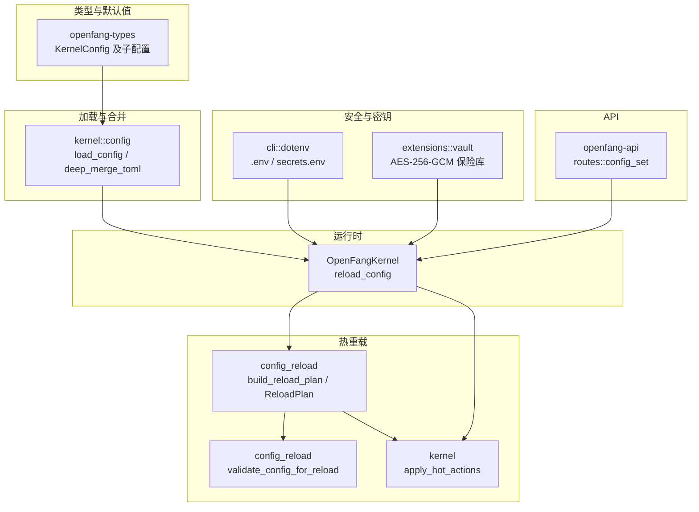
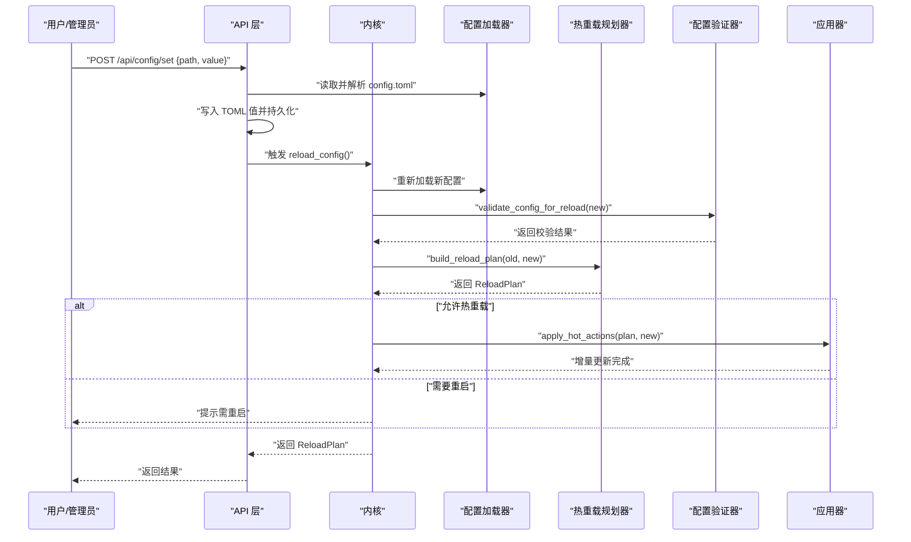
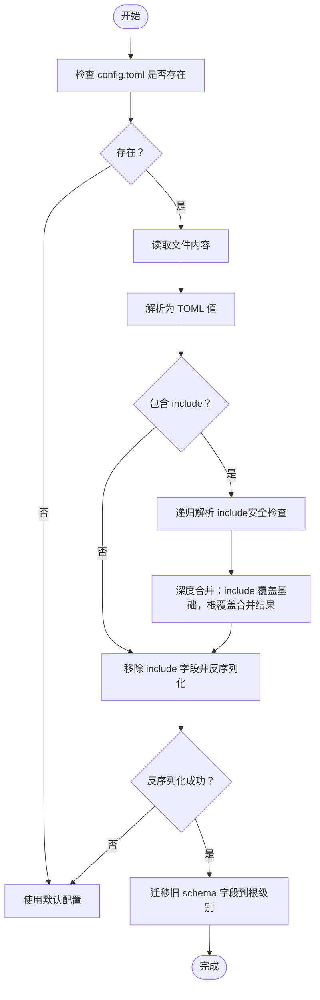
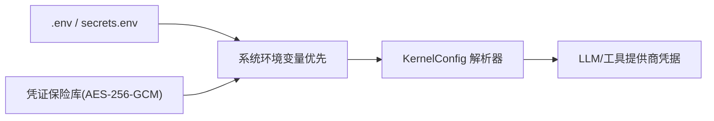
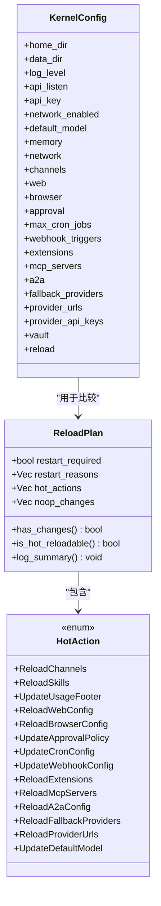
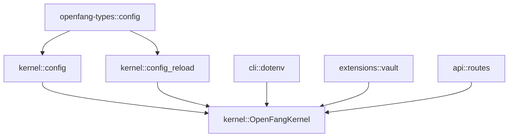

# 配置管理（Config & Reload）

<cite>
**本文档引用的文件**
- [crates/openfang-kernel/src/config.rs](file://crates/openfang-kernel/src/config.rs)
- [crates/openfang-kernel/src/config_reload.rs](file://crates/openfang-kernel/src/config_reload.rs)
- [crates/openfang-kernel/src/kernel.rs](file://crates/openfang-kernel/src/kernel.rs)
- [crates/openfang-types/src/config.rs](file://crates/openfang-types/src/config.rs)
- [crates/openfang-cli/src/dotenv.rs](file://crates/openfang-cli/src/dotenv.rs)
- [crates/openfang-extensions/src/vault.rs](file://crates/openfang-extensions/src/vault.rs)
- [openfang.toml.example](file://openfang.toml.example)
- [crates/openfang-api/src/routes.rs](file://crates/openfang-api/src/routes.rs)
</cite>

## 目录
1. [简介](#简介)
2. [项目结构](#项目结构)
3. [核心组件](#核心组件)
4. [架构总览](#架构总览)
5. [详细组件分析](#详细组件分析)
6. [依赖关系分析](#依赖关系分析)
7. [性能考虑](#性能考虑)
8. [故障排除指南](#故障排除指南)
9. [结论](#结论)
10. [附录](#附录)

## 简介
本文件系统性阐述 OpenFang 的配置管理系统与热重载机制，覆盖配置文件格式（TOML）、环境变量解析、默认值处理、配置验证、热重载计划构建、增量更新与回滚策略、一致性保障、配置分层与加密、敏感信息保护等。同时提供可操作的最佳实践与故障排除建议，并通过图示帮助读者理解关键流程。

## 项目结构
OpenFang 将配置管理拆分为多个层次：
- 类型定义层：在 openfang-types 中定义 KernelConfig 及各子配置结构，统一序列化/反序列化与默认值。
- 加载与合并层：在 kernel 的 config 模块中实现 TOML 文件读取、include 合并、安全校验与默认回退。
- 热重载层：在 config_reload 模块中对比新旧配置，生成 ReloadPlan 并按模式执行增量更新。
- 运行时应用层：在 kernel 中根据 ReloadPlan 应用热重载动作或标记重启需求。
- 安全与密钥层：通过 .env 与凭证保险库（vault）实现敏感信息的安全存储与解析。
- API 层：提供配置写入接口，支持通过 API 触发持久化与热重载。

**图表来源**
- [crates/openfang-types/src/config.rs:1262-1313](file://crates/openfang-types/src/config.rs#L1262-L1313)
- [crates/openfang-kernel/src/config.rs:18-110](file://crates/openfang-kernel/src/config.rs#L18-L110)
- [crates/openfang-kernel/src/config_reload.rs:123-267](file://crates/openfang-kernel/src/config_reload.rs#L123-L267)
- [crates/openfang-kernel/src/kernel.rs:3528-3613](file://crates/openfang-kernel/src/kernel.rs#L3528-L3613)
- [crates/openfang-cli/src/dotenv.rs:28-32](file://crates/openfang-cli/src/dotenv.rs#L28-L32)
- [crates/openfang-extensions/src/vault.rs:132-149](file://crates/openfang-extensions/src/vault.rs#L132-L149)
- [crates/openfang-api/src/routes.rs:9745-9785](file://crates/openfang-api/src/routes.rs#L9745-L9785)

**章节来源**
- [crates/openfang-types/src/config.rs:1262-1313](file://crates/openfang-types/src/config.rs#L1262-L1313)
- [crates/openfang-kernel/src/config.rs:18-110](file://crates/openfang-kernel/src/config.rs#L18-L110)
- [crates/openfang-kernel/src/config_reload.rs:123-267](file://crates/openfang-kernel/src/config_reload.rs#L123-L267)
- [crates/openfang-kernel/src/kernel.rs:3528-3613](file://crates/openfang-kernel/src/kernel.rs#L3528-L3613)
- [crates/openfang-cli/src/dotenv.rs:28-32](file://crates/openfang-cli/src/dotenv.rs#L28-L32)
- [crates/openfang-extensions/src/vault.rs:132-149](file://crates/openfang-extensions/src/vault.rs#L132-L149)
- [crates/openfang-api/src/routes.rs:9745-9785](file://crates/openfang-api/src/routes.rs#L9745-L9785)

## 核心组件
- 配置类型与默认值：KernelConfig 及其子配置（如 DefaultModelConfig、MemoryConfig、NetworkConfig、ChannelsConfig 等），均提供 serde 默认值与调试输出的敏感字段脱敏。
- 配置加载与合并：支持 include 指令进行多文件深度合并，内置安全检查（禁止绝对路径、目录穿越、循环引用、最大嵌套深度），失败时回退到默认配置。
- 配置验证：对关键字段（如 api_listen、max_cron_jobs、网络共享密钥）进行基本校验。
- 热重载计划：对比新旧配置，分类为“需要重启”、“可热重载”、“无操作”三类，并记录原因与动作清单。
- 运行时应用：根据 ReloadMode 决定是否应用热重载动作；对部分热点配置（如默认模型、URL 覆盖、审批策略、Cron 最大任务数）直接生效。
- 密钥与保险库：.env 与 secrets.env 优先级加载，系统环境变量最高优先；凭证保险库采用 AES-256-GCM 加密存储，Argon2 派生主密钥。
- API 写入：提供 /api/config/set 接口，支持以 JSON 形式设置单个配置项并触发持久化与热重载。

**章节来源**
- [crates/openfang-types/src/config.rs:1262-1313](file://crates/openfang-types/src/config.rs#L1262-L1313)
- [crates/openfang-kernel/src/config.rs:18-110](file://crates/openfang-kernel/src/config.rs#L18-L110)
- [crates/openfang-kernel/src/config_reload.rs:277-303](file://crates/openfang-kernel/src/config_reload.rs#L277-L303)
- [crates/openfang-kernel/src/config_reload.rs:123-267](file://crates/openfang-kernel/src/config_reload.rs#L123-L267)
- [crates/openfang-kernel/src/kernel.rs:3528-3613](file://crates/openfang-kernel/src/kernel.rs#L3528-L3613)
- [crates/openfang-cli/src/dotenv.rs:28-32](file://crates/openfang-cli/src/dotenv.rs#L28-L32)
- [crates/openfang-extensions/src/vault.rs:132-149](file://crates/openfang-extensions/src/vault.rs#L132-L149)
- [crates/openfang-api/src/routes.rs:9745-9785](file://crates/openfang-api/src/routes.rs#L9745-L9785)

## 架构总览
下图展示了从配置文件到运行时应用的完整链路，包括热重载决策与动作执行。

**图表来源**
- [crates/openfang-api/src/routes.rs:9745-9785](file://crates/openfang-api/src/routes.rs#L9745-L9785)
- [crates/openfang-kernel/src/kernel.rs:3528-3613](file://crates/openfang-kernel/src/kernel.rs#L3528-L3613)
- [crates/openfang-kernel/src/config_reload.rs:277-303](file://crates/openfang-kernel/src/config_reload.rs#L277-L303)
- [crates/openfang-kernel/src/config_reload.rs:123-267](file://crates/openfang-kernel/src/config_reload.rs#L123-L267)

## 详细组件分析

### 配置文件格式与分层
- 文件位置与优先级：默认位于 OPENFANG_HOME 或 ~/.openfang 下的 config.toml；可通过 OPENFANG_HOME 环境变量覆盖。
- include 指令：支持在根配置中声明 include 列表，先加载被包含文件并深度合并，再以根配置覆盖，形成“基础配置 ← 被包含文件 ← 根配置”的叠加顺序。
- 安全控制：拒绝绝对路径、包含父目录组件（..）、超出最大嵌套深度（默认 10）、循环引用；包含文件必须位于配置目录之内。
- 兼容迁移：自动将旧 schema 中位于 [api] 的 api_key、api_listen、log_level 迁移到根级别，避免用户误配。
- 默认回退：解析失败、包含解析失败、反序列化失败时回退到默认配置并记录警告日志。

**图表来源**
- [crates/openfang-kernel/src/config.rs:18-110](file://crates/openfang-kernel/src/config.rs#L18-L110)
- [crates/openfang-kernel/src/config.rs:116-224](file://crates/openfang-kernel/src/config.rs#L116-L224)
- [crates/openfang-kernel/src/config.rs:226-243](file://crates/openfang-kernel/src/config.rs#L226-L243)

**章节来源**
- [crates/openfang-kernel/src/config.rs:18-110](file://crates/openfang-kernel/src/config.rs#L18-L110)
- [crates/openfang-kernel/src/config.rs:116-224](file://crates/openfang-kernel/src/config.rs#L116-L224)
- [crates/openfang-kernel/src/config.rs:226-243](file://crates/openfang-kernel/src/config.rs#L226-L243)

### 环境变量与密钥解析
- .env 与 secrets.env：优先加载 ~/.openfang/.env，再加载 ~/.openfang/secrets.env；系统环境变量优先级最高，不会被覆盖。
- 凭证保险库：AES-256-GCM 加密存储，Argon2 派生主密钥；支持从 OS keyring 或环境变量 VAULT_KEY 获取主密钥；解锁后内存中零化清理，落盘加密。
- API 密钥解析：KernelConfig 提供 resolve_api_key_env，按“显式映射 → 认证档案 → 约定命名”的优先级解析。

**图表来源**
- [crates/openfang-cli/src/dotenv.rs:28-32](file://crates/openfang-cli/src/dotenv.rs#L28-L32)
- [crates/openfang-extensions/src/vault.rs:132-149](file://crates/openfang-extensions/src/vault.rs#L132-L149)
- [crates/openfang-types/src/config.rs:1323-1342](file://crates/openfang-types/src/config.rs#L1323-L1342)

**章节来源**
- [crates/openfang-cli/src/dotenv.rs:28-32](file://crates/openfang-cli/src/dotenv.rs#L28-L32)
- [crates/openfang-extensions/src/vault.rs:132-149](file://crates/openfang-extensions/src/vault.rs#L132-L149)
- [crates/openfang-types/src/config.rs:1323-1342](file://crates/openfang-types/src/config.rs#L1323-L1342)

### 默认值处理与兼容性
- KernelConfig::default 提供所有字段的合理默认值，确保最小可用配置。
- 日志级别、监听地址、网络开关、默认模型、内存参数、浏览器、扩展、Webhook、审批策略、Cron 最大任务数等均有明确默认。
- 示例配置 openfang.toml.example 展示了常用选项的注释样例，便于快速上手。

**章节来源**
- [crates/openfang-types/src/config.rs:1262-1313](file://crates/openfang-types/src/config.rs#L1262-L1313)
- [openfang.toml.example:1-49](file://openfang.toml.example#L1-L49)

### 配置验证
- 关键字段校验：api_listen 非空；max_cron_jobs 不超过上限；当 network_enabled 为真时 shared_secret 必须非空；审批策略内部校验通过。
- 校验失败时返回错误列表，阻止危险变更生效。

**章节来源**
- [crates/openfang-kernel/src/config_reload.rs:277-303](file://crates/openfang-kernel/src/config_reload.rs#L277-L303)

### 热重载机制
- 计划构建：build_reload_plan 对比旧/新配置，按字段粒度判断是否重启、可热重载或无操作，并记录原因与动作清单。
- 动作分类：
  - 需要重启：api_listen、api_key、network_enabled、network、memory、home_dir、data_dir、vault 等。
  - 可热重载：channels、web、browser、approval、max_cron_jobs、webhook_triggers、extensions、mcp_servers、a2a、fallback_providers、provider_urls、default_model 等。
  - 无操作：log_level、language、mode 等仅影响日志与界面语言。
- 应用策略：根据 ReloadMode 决定是否应用热重载动作；当前已实现的动作包括更新审批策略、调整 Cron 最大任务数、应用 provider URL 覆盖、更新默认模型等。
- 回滚与一致性：若计划要求重启，则热重载动作不应用，等待重启后由新配置接管；对于可热重载动作，尽量保证原子性与幂等性，避免状态不一致。

**图表来源**
- [crates/openfang-kernel/src/config_reload.rs:59-101](file://crates/openfang-kernel/src/config_reload.rs#L59-L101)
- [crates/openfang-kernel/src/config_reload.rs:17-48](file://crates/openfang-kernel/src/config_reload.rs#L17-L48)
- [crates/openfang-types/src/config.rs:962-1102](file://crates/openfang-types/src/config.rs#L962-L1102)

**章节来源**
- [crates/openfang-kernel/src/config_reload.rs:123-267](file://crates/openfang-kernel/src/config_reload.rs#L123-L267)
- [crates/openfang-kernel/src/kernel.rs:3560-3613](file://crates/openfang-kernel/src/kernel.rs#L3560-L3613)

### 运行时应用与回滚策略
- reload_config 流程：读取并校验新配置 → 生成热重载计划 → 记录摘要 → 若允许则应用热重载动作 → 返回计划。
- 回滚策略：若计划要求重启，则不应用热重载动作，等待重启后由新配置接管；热重载动作中涉及的子系统应在应用后保持一致性。
- 一致性保障：对关键字段（如默认模型、URL 覆盖）采用原子替换；对网络与内存等需要重启的配置，严格禁止热重载。

**章节来源**
- [crates/openfang-kernel/src/kernel.rs:3528-3558](file://crates/openfang-kernel/src/kernel.rs#L3528-L3558)
- [crates/openfang-kernel/src/kernel.rs:3560-3613](file://crates/openfang-kernel/src/kernel.rs#L3560-L3613)

### 通过 API 写入配置
- /api/config/set 接口接收 JSON { "path": "section.key", "value": "..." }，将值写入 TOML 并持久化，随后触发一次 reload_config。
- 该流程确保配置变更立即落地并尽可能热重载。

**章节来源**
- [crates/openfang-api/src/routes.rs:9745-9785](file://crates/openfang-api/src/routes.rs#L9745-L9785)

## 依赖关系分析
- 类型依赖：kernel 的 config 与 config_reload 依赖 openfang-types 的 KernelConfig 与 ReloadMode。
- 运行时依赖：kernel 在 reload_config 中调用 config 加载器与热重载模块，并与各子系统（审批、Cron、模型目录、默认模型覆盖等）交互。
- 安全依赖：.env 与 vault 为凭证解析提供安全链路，避免明文存储敏感信息。
- API 依赖：API 层负责对外暴露配置写入能力，内部仍走内核的 reload 流程。

**图表来源**
- [crates/openfang-types/src/config.rs:1262-1313](file://crates/openfang-types/src/config.rs#L1262-L1313)
- [crates/openfang-kernel/src/config.rs:18-110](file://crates/openfang-kernel/src/config.rs#L18-L110)
- [crates/openfang-kernel/src/config_reload.rs:123-267](file://crates/openfang-kernel/src/config_reload.rs#L123-L267)
- [crates/openfang-kernel/src/kernel.rs:3528-3613](file://crates/openfang-kernel/src/kernel.rs#L3528-L3613)
- [crates/openfang-cli/src/dotenv.rs:28-32](file://crates/openfang-cli/src/dotenv.rs#L28-L32)
- [crates/openfang-extensions/src/vault.rs:132-149](file://crates/openfang-extensions/src/vault.rs#L132-L149)
- [crates/openfang-api/src/routes.rs:9745-9785](file://crates/openfang-api/src/routes.rs#L9745-L9785)

**章节来源**
- [crates/openfang-types/src/config.rs:1262-1313](file://crates/openfang-types/src/config.rs#L1262-L1313)
- [crates/openfang-kernel/src/config.rs:18-110](file://crates/openfang-kernel/src/config.rs#L18-L110)
- [crates/openfang-kernel/src/config_reload.rs:123-267](file://crates/openfang-kernel/src/config_reload.rs#L123-L267)
- [crates/openfang-kernel/src/kernel.rs:3528-3613](file://crates/openfang-kernel/src/kernel.rs#L3528-L3613)
- [crates/openfang-cli/src/dotenv.rs:28-32](file://crates/openfang-cli/src/dotenv.rs#L28-L32)
- [crates/openfang-extensions/src/vault.rs:132-149](file://crates/openfang-extensions/src/vault.rs#L132-L149)
- [crates/openfang-api/src/routes.rs:9745-9785](file://crates/openfang-api/src/routes.rs#L9745-L9785)

## 性能考虑
- 深度合并与 JSON 序列化：热重载计划构建使用 JSON 序列化比较字段，复杂配置可能带来额外开销；建议在高频变更场景下谨慎使用。
- 重启成本：涉及网络、内存、API 监听等关键字段的变更需要重启，应尽量避免频繁改动。
- 缓存与幂等：对可热重载的动作（如 URL 覆盖、默认模型）应确保幂等，避免重复初始化带来的资源浪费。
- I/O 与磁盘：配置写入与保险库落盘均涉及磁盘 I/O，建议在批量变更时合并为一次写入。

## 故障排除指南
- 配置文件无法解析：检查 TOML 语法与 include 路径；确认未使用绝对路径、未包含 .. 组件、未超出最大嵌套深度；查看日志中的警告信息。
- 热重载未生效：确认 ReloadMode 设置为 Hybrid 或 Hot；检查计划中是否标记为“需要重启”；查看日志中的动作摘要。
- API 写入失败：检查 /api/config/set 请求体是否包含 path 与 value；确认目标路径合法且可写；查看返回的错误信息。
- 凭证无法加载：检查 .env 与 secrets.env 权限与格式；确认系统环境变量未覆盖；若使用保险库，确认主密钥来源正确且未过期。
- 网络配置错误：当 network_enabled 为真时必须设置 shared_secret；否则会触发校验失败。

**章节来源**
- [crates/openfang-kernel/src/config.rs:116-224](file://crates/openfang-kernel/src/config.rs#L116-L224)
- [crates/openfang-kernel/src/config_reload.rs:277-303](file://crates/openfang-kernel/src/config_reload.rs#L277-L303)
- [crates/openfang-api/src/routes.rs:9745-9785](file://crates/openfang-api/src/routes.rs#L9745-L9785)
- [crates/openfang-cli/src/dotenv.rs:166-190](file://crates/openfang-cli/src/dotenv.rs#L166-L190)
- [crates/openfang-extensions/src/vault.rs:251-263](file://crates/openfang-extensions/src/vault.rs#L251-L263)

## 结论
OpenFang 的配置管理以类型安全、默认完备、安全可控为核心设计原则，结合 include 分层、环境变量与保险库机制，提供了灵活而稳健的配置体系。热重载机制通过精细的变更分类与严格的校验，实现了高可用的在线运维能力。建议在生产环境中遵循最小权限、最小变更、可观测性的最佳实践，配合 API 写入与日志审计，确保配置演进的稳定性与安全性。

## 附录
- 配置示例参考：openfang.toml.example
- 关键实现路径参考：
  - 配置加载与合并：[crates/openfang-kernel/src/config.rs:18-110](file://crates/openfang-kernel/src/config.rs#L18-L110)
  - 热重载计划构建：[crates/openfang-kernel/src/config_reload.rs:123-267](file://crates/openfang-kernel/src/config_reload.rs#L123-L267)
  - 配置验证：[crates/openfang-kernel/src/config_reload.rs:277-303](file://crates/openfang-kernel/src/config_reload.rs#L277-L303)
  - 运行时应用：[crates/openfang-kernel/src/kernel.rs:3528-3613](file://crates/openfang-kernel/src/kernel.rs#L3528-L3613)
  - 环境变量加载：[crates/openfang-cli/src/dotenv.rs:28-32](file://crates/openfang-cli/src/dotenv.rs#L28-L32)
  - 凭证保险库：[crates/openfang-extensions/src/vault.rs:132-149](file://crates/openfang-extensions/src/vault.rs#L132-L149)
  - API 写入接口：[crates/openfang-api/src/routes.rs:9745-9785](file://crates/openfang-api/src/routes.rs#L9745-L9785)